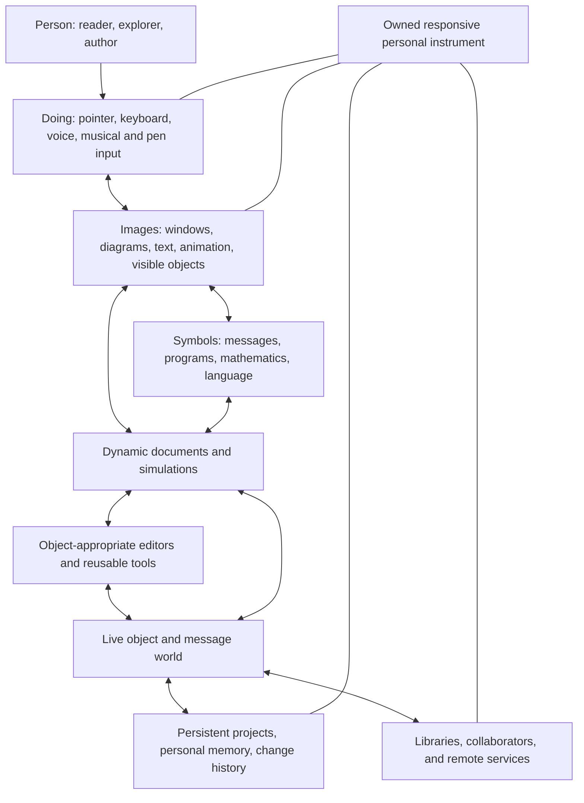
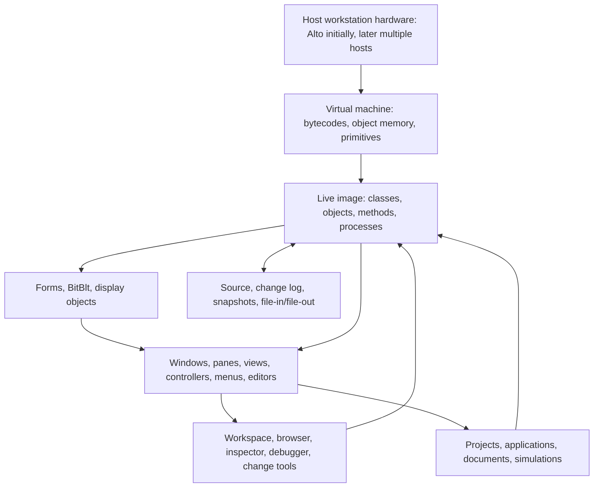
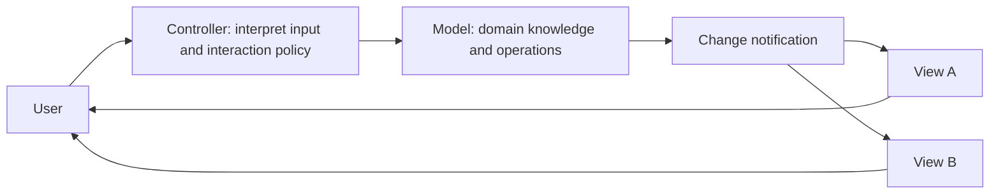
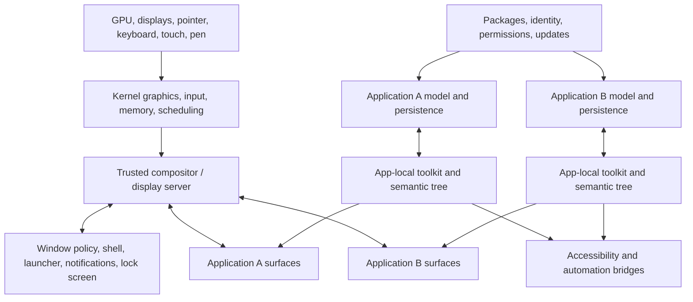
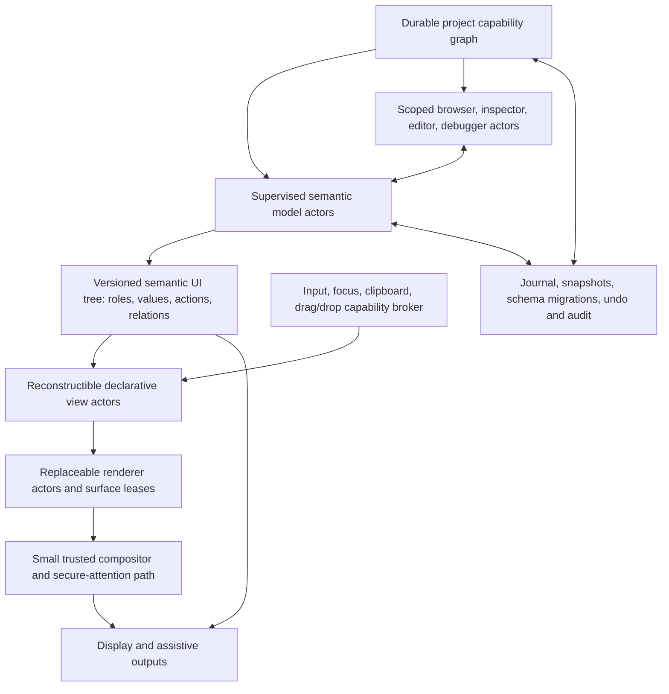
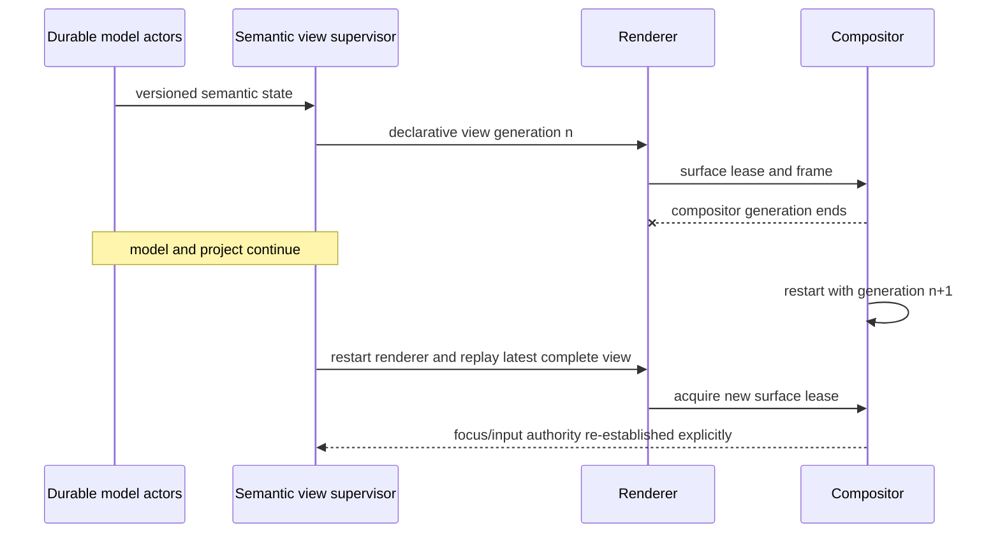

# Alan Kay's Smalltalk Visual Interface and the Modern Desktop

## Executive answer

Alan Kay's goal was not the desktop user interface as it is now commonly
understood. He was not primarily proposing a graphical shell for launching
sealed applications. He was pursuing a **personal dynamic medium**: an owned,
responsive, networked environment in which reading, writing, drawing,
animation, music, simulation, and programming were different expressions of
one computational material. The person using it—especially a child—was meant
to progress from manipulating visible things to understanding and creating the
symbolic processes behind them.

That distinction changes how its components should be read. A window was a
view onto a live object or a part of a dynamic document, not necessarily an
application container. An editor belonged to the kind of object being edited.
A browser, inspector, workspace, and debugger were ordinary tools inside the
same live world. Code was not merely an offline source artifact used by a
separate developer population; it was one representation of behavior that the
owner could inspect and change while the system ran.

The modern desktop preserved much of the visible interaction vocabulary:
bitmapped graphics, windows, pointers, menus, direct manipulation, reusable
controls, model/view separation, and immediate feedback. It usually inverted
the architectural center of gravity, however. The dominant unit became the
**application**: a packaged process owns an internal semantic model and renders
an opaque or semi-opaque surface for a trusted compositor. Development tools,
runtime internals, document formats, accessibility trees, persistence, and
cross-application composition sit behind separate contracts.

That divergence was not simply a mistake. Modern systems gained fault and
security isolation, least privilege, trusted composition, GPU scheduling,
accessibility infrastructure, internationalization, deployment identity, and
resource lifecycle management. The useful Atom OS conclusion is therefore not
to recreate a single globally mutable Smalltalk image. It is to recover Kay's
semantic continuity and user authorship **above capability and actor
boundaries**: durable model actors, user-owned project graphs, primary semantic
UI descriptions, disposable renderers, a narrow compositor, and live tools
whose authority is explicit, revocable, auditable, and recoverable.

## Question, scope, and standard of evidence

This report asks four related questions:

1. What did Kay think a visual computer interface was *for*?
2. Which conceptual and implemented components made that vision concrete in
   the Dynabook and Smalltalk work?
3. Which parts did the commercial desktop retain, narrow, or improve?
4. What should an actor-oriented Atom OS inherit without importing a 1970s
   trust model?

“Kay's interface” is used as shorthand for his framing and design direction,
not as a claim of sole invention. “Smalltalk interface” refers to several
systems that changed from Smalltalk-72 through Smalltalk-80 and Squeak, not one
timeless specification. “Modern desktop” refers to recurring architecture in
current Wayland, Windows, and macOS systems; it is not a claim that every
desktop, toolkit, or application has the same implementation.

Claims are classified as:

- **primary historical intent** when stated by Kay or Kay and Adele Goldberg;
- **implemented behavior** when documented by the people who built Smalltalk;
- **independent analysis** when developed in HCI or media scholarship;
- **current platform behavior** when stated by official platform
  documentation; and
- **Atom OS proposal** when it is a cross-source architectural deduction that
  remains unverified.

A successful conclusion must explain the component relationships, preserve
attribution, acknowledge counterevidence and modern advances, and produce
falsifiable design consequences. Similar-looking screenshots are not enough.

## Historical and attribution guardrails

Several common summaries obscure the architecture:

- Kay did not single-handedly invent the graphical user interface. In his own
  history he says the ingredients had precedents in the 1960s and credits the
  Smalltalk team extensively. Dan Ingalls drove much of the implementation;
  Diana Merry developed the early BitBlt operator and Ingalls redesigned,
  generalized, and implemented it in microcode; Adele Goldberg led research,
  documentation, and system work; Larry Tesler, Ted Kaehler, David Smith, Bob
  Flegal, Glenn Krasner, Jim Althoff, and many others contributed tools and
  interaction techniques. [Kay's
  history](../30-sources/kay-1993-early-history-smalltalk.md),
  [Ingalls's implementation history](../30-sources/ingalls-2020-evolution-of-smalltalk.md),
  and [Tesler's account](../30-sources/tesler-1981-smalltalk-environment.md)
  agree that the system was collective work.
- Model–View–Controller was formulated by **Trygve Reenskaug** at PARC in
  1979 and then implemented and elaborated by the Smalltalk community. It is an
  important component pattern, not a synonym for Kay's entire vision.
  [Reenskaug's note](../30-sources/reenskaug-1979-models-views-controllers.md)
  establishes the original roles; the [Smalltalk-80 MVC
  cookbook](../30-sources/krasner-pope-1988-mvc-smalltalk-80.md) documents the
  mature framework.
- The Xerox Star desktop was a separate office product designed by a named
  team. It shared Alto, bitmap, pointing, and PARC lineage, but its virtual
  office and universal commands served a different product goal from the
  Dynabook's universal authoring medium. [The Star team's
  account](../30-sources/smith-et-al-1982-designing-star-user-interface.md)
  should be credited directly.
- Smalltalk messages are not BEAM messages. Historical Smalltalk systems used a
  live, shared object world and lightweight processes; BEAM actors have
  process-private heaps, asynchronous signals, explicit failure relationships,
  and distribution semantics. Atom OS may transfer principles without
  pretending the mechanisms are identical.

## Kay's actual objective: a medium, not a shell

### The personal computer as owned intellectual material

The 1972 Dynabook proposal defines a personal computer as an active medium for
arbitrary symbolic ideas, with tools for manipulating those ideas and a way to
add new tools. Its opening child scenario is architectural: a learner retrieves
material from a shared library, changes a simulation, and creates a filter.
The child is not navigating a catalog of educational applications; the child
is reorganizing and extending the medium. The proposed notebook display,
keyboard or voice, storage, graphics, network access, and object/message model
serve that purpose. The paper remains explicitly speculative, so this is a
design requirement rather than proof of success.
[Kay 1972](../30-sources/kay-1972-personal-computer-for-children.md)

Kay and Goldberg's 1977 report names the computer a **metamedium** because it
can simulate older media and support not-yet-invented media. A static page can
contain one representation; a dynamic medium can answer questions, run an
experiment, expose a different view, or let its reader rewrite the model.
Text, drawing, animation, sound, filing, programming, and simulation are
therefore not separate product categories. They are materials and views within
one environment. [Kay and Goldberg
1977](../30-sources/kay-goldberg-1977-personal-dynamic-media.md)

The practical test is **authorship**. A system may display every traditional
medium beautifully and still fail Kay's criterion if the owner cannot express
new behavior. A fixed application with many preferences offers configuration;
a metamedium offers a language, examples, inspectors, and reusable parts from
which the owner can make a new tool. Manovich's later analysis identifies this
democratization of software construction as the ambition that commercial
graphical systems most often narrowed. [Manovich
2007](../30-sources/manovich-2007-alan-kay-universal-media-machine.md)

### The interface as a learning gradient

Kay's 1990 formulation, “Doing with Images makes Symbols,” relates three modes:

| Mode | Interface expression | Purpose |
| --- | --- | --- |
| Enactive—doing | pointing, dragging, typing, playing, direct action | establish cause and effect through bodily activity |
| Iconic—images | objects, windows, diagrams, animation, visible state | provide stable representations that can be compared and manipulated |
| Symbolic—language | names, messages, programs, mathematical and textual notation | express abstractions, rules, relationships, and reusable processes |

The modes are cumulative rather than competitive. A pointer does not replace
language; it gives the learner a concrete entrance into a system whose deeper
relationships can later be expressed symbolically. The visual interface fails
if it ends at easy pointing and permanently hides the model. The symbolic
interface fails if it demands syntax before the learner can see what the
symbols mean. [Kay 1990](../30-sources/kay-1990-user-interface-personal-view.md)

In 1985, Hutchins, Hollan, and Norman made the distinction more precise. An
interface can reduce the physical effort needed to express an action while
leaving a large gap between what the user intends and what the system means.
Direct manipulation is useful, but it can make abstraction, repetition,
variables, precision, and operations over sets awkward. Kay's strongest idea
is therefore the bridge between manipulation and a symbolic description of the
same thing, not direct manipulation alone. [Hutchins, Hollan, and Norman
1985](../30-sources/hutchins-et-al-1985-direct-manipulation-interfaces.md)

### Responsiveness as part of meaning

Kay and Goldberg compare the desired response to a musical instrument. The
point is more than low benchmark latency. If cause and visible effect are
separated by a pause, batch step, build, or context switch, the user cannot
easily form and test a causal theory. Immediate response is part of the
educational and expressive contract.

This also explains why contemporary live-programming demonstrations remain
relevant. Victor's interactive examples show state, flow, and consequences as
the program changes; their contribution is an argument about explanatory
design, not proof of universal learnability. [Victor
2012](../30-sources/victor-2012-learnable-programming.md) A recent live
metacircular runtime shows that garbage collection, JIT behavior, and VM
optimization can still be inspected and changed with high-level live tools,
although its evidence concerns expert developers rather than ordinary users.
[Pimás, Marr, and Garbervetsky
2023](../30-sources/pimas-et-al-2023-live-objects-all-the-way-down.md)

## The conceptual component model

Kay never published one final numbered component architecture. The following
model is a synthesis across the 1972, 1977, 1990, and 1993 works. It separates
roles that were often physically co-resident in Smalltalk so they can be
reasoned about in a modern system.

### 1. Personal instrument and sensory surface

The physical system includes a high-quality bitmapped display, pointing and
keyboard input, sound, storage, and communication. It must be owned and
available enough to become a continuing intellectual environment rather than a
shared terminal visited for isolated transactions. Immediate, predictable
feedback lets the user treat it as an instrument.

### 2. Live object and message substrate

Uniform objects hold state and respond to messages. The important interface
property is that visible parts, media objects, tools, and system services are
not dead drawings over inaccessible machinery. They participate in a common
description and communication model and can present themselves for inspection
or alteration.

### 3. Persistent personal world and projects

Work is a continuing object world rather than a sequence of application
launches. Smalltalk images could snapshot the live system. In Smalltalk-76,
Projects grouped windows, scheduler state, history, and changes into
screen-oriented work contexts; Smalltalk-80 retained the screen/work-context
idea with project histories and change sets. Source text and change records
also lived in external files, and the VM remained distinct, so “one image
contains literally everything” is an overstatement. Projects shared classes
and authority; they were not process or security isolation. [Ingalls
2020](../30-sources/ingalls-2020-evolution-of-smalltalk.md) and [Goldberg
1984](../30-sources/goldberg-1984-smalltalk-80-interactive-environment.md)

### 4. Dynamic documents and domain models

A dynamic document is a collection of related sensory objects, potentially
combining text, figures, sound, animation, links, programs, and simulations.
Each object can retain behavior and several representations. The document is a
computational project, not a passive byte format belonging to one application.

### 5. Views, windows, and graphical composition

Views expose models or objects; overlapping windows keep several resources and
levels of refinement simultaneously visible. Windows are composable objects
with common movement, sizing, focus, and lifecycle behavior, while their
contents retain domain-specific presentation. [Ingalls's contemporaneous
description](../30-sources/ingalls-1978-smalltalk-76-programming-system.md)
supports that reactive window protocol. The BitBlt line developed by Merry and
Ingalls and later described by [Ingalls
2020](../30-sources/ingalls-2020-evolution-of-smalltalk.md) provided a compact
bitmap substrate for text, menus, sprites, scrolling, and window movement.

### 6. Controllers, input interpretation, and editors

A controller translates physical input into meaningful operations and manages
the relevant views. An editor can be selected according to the object and the
operation: text, font, bitmap, animation, music, graph, or source method.
Reenskaug's model/view/controller roles clarify the separation, but the larger
vision does not require every visual component to use one fixed MVC class
framework.

### 7. Browsers, inspectors, workspaces, and debuggers

These are not peripheral developer applications. They are the reflective
interface to the medium:

- the **workspace** evaluates descriptions in context;
- the **browser** navigates classes, protocols, and methods and accepts changes;
- the **inspector** exposes the state and relationships of any object;
- the **debugger** makes suspended computation and its contexts inspectable;
- the **change manager and audit trail** explain and transport evolution; and
- media-specific editors let visible artifacts be altered with direct and
  symbolic operations.

The tools themselves are built from the same objects and may be inspected or
changed. That recursion is a central difference from an operating system whose
developer tools target externally built application binaries.

### 8. Media, simulation, retrieval, and collaboration

Drawing, animation, music, text, and simulation share a description system.
Manual edits and programmatic operations can address the same media objects.
Personal filing, cross-indexing, network libraries, communication with other
people, and software agents extend the environment beyond one screen without
making “the network” the user's primary conceptual object.

### 9. Literacy and progressive authorship

The final component is social and educational rather than a software module.
The environment needs examples, conventions, curricula, and progressively
revealed power through which a person moves from use to modification to
creation. Kay's own retrospective evidence says this was not solved: some
children produced striking work, many needed considerable help, and aspects of
the class system were difficult. The architecture enables a curriculum; it is
not the curriculum. [Kay
1993](../30-sources/kay-1993-early-history-smalltalk.md)

## What Smalltalk actually implemented

The conceptual vision and implemented Smalltalk overlap, but neither should be
used as evidence for the other without qualification.

The salient implementation property is **causal continuity**. The displayed
system, the objects responsible for its behavior, the source method, the
compiler, and the debugger were reachable within one running environment.
Changing a method could change the active interface without a separate
compile–link–restart sequence. An error could open a debugger on the live
context. Snapshots and change logs provided recovery mechanisms. The same
continuity was also a failure and authority hazard: a bad system change could
break the common UI, and a Project did not isolate one user's code from the
rest of the image.

The [Smalltalk-80 environment
manual](../30-sources/goldberg-1984-smalltalk-80-interactive-environment.md)
documents the tool workflows and their risks. [Ingalls's 1978
paper](../30-sources/ingalls-1978-smalltalk-76-programming-system.md) captures
the contemporary “reactive” design; [his 2020
history](../30-sources/ingalls-2020-evolution-of-smalltalk.md) explains how the
mechanisms evolved.

## MVC's proper place

MVC is a useful decomposition inside this architecture. The diagram below is
the mature Smalltalk-80 dependency elaboration, not the exact topology of
Reenskaug's short 1979 note. Reenskaug's controller sent interpreted user
messages to one or more views, which could update the model; the later
Smalltalk-80 framework commonly routed controller operations to the model and
broadcast model changes to dependent views.

Reenskaug's model speaks in the vocabulary of the problem domain. A view asks
the model questions and presents an answer. A controller mediates between user
and system and translates interaction into messages. Smalltalk-80 elaborated
this into dependencies, change notifications, subview hierarchies, transforms,
clipping, and reusable menu, text, list, form, browser, and debugger
components. [Krasner and Pope
1988](../30-sources/krasner-pope-1988-mvc-smalltalk-80.md)

MVC does not by itself provide:

- the persistent live world;
- end-user access to source and tools;
- the action-image-symbol learning gradient;
- simulation as a universal medium;
- a network and personal-information model;
- process isolation or capability security; or
- restart and distributed consistency semantics.

For Atom OS, “model,” “view,” and “controller” should therefore be roles in
actor protocols, not an excuse to reproduce synchronous shared-object calls.

## The desktop-metaphor fork

Xerox Star translated familiar office objects into icons, windows, and
universal operations for office professionals. Its designers emphasized a
stable conceptual model, seeing and pointing, WYSIWYG output, consistency,
simplicity, modeless interaction where possible, and user tailorability.
Temporary command modes remained visible and constrained. Implemented
tailoring included document and form templates, filing structures, database
views, and abbreviations; user-defined command buttons were a stated future
direction. This was an important usability and product-engineering
achievement. [Smith et al.
1982](../30-sources/smith-et-al-1982-designing-star-user-interface.md)

It also represents the fork that became dominant:

| Dynabook/Smalltalk direction | Xerox Star direction | Mainstream later-desktop tendency |
| --- | --- | --- |
| computer as programmable metamedium | computer as a familiar office work surface | computer as shell plus installed applications |
| dynamic document as related active objects | documents, folders, printers, and other data/function objects operated directly | documents and internal models commonly associated with an owning application |
| owner can create media and tools | user tailors forms, templates, filing, views, and abbreviations and applies generic commands | user operates packaged features and bounded extension or automation points |
| visual and symbolic representations connected | consistent seeing-and-pointing model hides most implementation detail | programming usually lives in a separate developer toolchain |
| live system tools are part of the environment | product internals remain behind a stable conceptual interface | deployed apps normally omit their source, inspector, compiler, and debugger |
| metaphor is a bridge to deeper concepts | office metaphor is the stable organizing model | desktop, launcher, app, and file conventions organize work |

These are tendencies, not mutually exclusive systems. Star inherited and
refined PARC techniques; Smalltalk also used windows, menus, and familiar
representations. The difference is the intended destination of learning and
control.

## A representative modern desktop architecture

Modern desktops are layered around protection, composition, and application
ownership. The following model combines current official documentation from
[Wayland](../30-sources/wayland-project-2026-architecture-and-protocol.md),
[Windows](../30-sources/microsoft-2026-desktop-ui-architecture.md), and
[Apple](../30-sources/apple-2026-desktop-ui-frameworks.md). It is a comparison
model, not a claim that their internals are identical.

### Modern component responsibilities

| Component | Representative current responsibility | Architectural consequence |
| --- | --- | --- |
| Kernel graphics and input | drive devices, manage GPU/display resources, normalize input | hardware mechanism is separated from application meaning |
| Compositor/display server | arbitrate focus, hit-test surfaces, transform coordinates, compose buffers, schedule presentation | one trusted service can present mutually distrustful clients without learning their full models |
| Shell/window policy | arrange top-level surfaces, launch/switch, decorate, notify, lock | desktop policy can be changed separately from client toolkits, though implementations sometimes combine it with the compositor |
| Application process | own domain model, commands, lifecycle, permissions, and local state | failure and authority are bounded, but the app becomes the normal unit of work |
| UI toolkit | construct views and controls, layout, style, events, data binding, accessibility nodes | rich object and declarative models survive, usually only inside an application |
| Renderer/surface | turn local view state into pixels or GPU buffers | the compositor normally receives presentation resources rather than a universal semantic object graph |
| Accessibility/automation | expose names, roles, values, state, relationships, actions, and focus | modern systems gain a machine-readable semantic projection, but it may diverge from visuals if treated as secondary |
| Persistence | serialize selected model and view state, restore after process relaunch | recovery is explicit and selective rather than continuation of a whole live image |
| Package and identity | sign, install, update, version, sandbox, grant resources | provenance and containment improve while producer/user roles harden |
| Interapplication exchange | files, clipboard types, drag/drop, URLs, IPC, services | interoperability is controlled but composition is less fluid than sharing arbitrary live objects |

Wayland exposes the boundary particularly clearly: clients render buffers,
while the compositor knows surfaces, geometry, focus, damage, and input
routing. Windows documents a trusted DWM process and application visual
subtrees, atomic composition batches, occlusion, and GPU/display timing. AppKit
retains object-based MVC; SwiftUI derives view hierarchies from state; both are
normally authoring technologies for developers of one application rather than
a universal end-user medium.

## What the modern desktop retained

The modern desktop is not a rejection of the PARC work. It retains many PARC
techniques and has developed later mechanisms that converge on parts of its
live-feedback goal:

- high-resolution bitmap or vector presentation;
- overlapping windows and simultaneous views;
- pointing, selection, contextual operations, menus, and modeless workflows;
- direct manipulation with rapid visual feedback and undo where applications
  provide it;
- multimedia documents and compositing;
- object-oriented and hierarchical UI components;
- variants of model/view/controller separation, observation, and data binding;
- as a later convergence, declarative state-to-view construction and live
  developer previews, without implying that Smalltalk used SwiftUI's model;
- reusable controls, styles, layout systems, and domain-specific editors; and
- personal customization inside platform- and application-defined bounds.

The apparent paradox is that modern desktops may implement a more sophisticated
version of every visible technique while implementing less of the
owner-programmable medium.

## Where it diverged

### Application rather than project

The application is usually the unit of installation, authority, lifecycle,
window ownership, and vendor identity. A document selects or belongs to an
application. Kay's dynamic document instead contains active heterogeneous
objects and their editors; the user's evolving project is primary.

### Developer tools rather than user tools

Modern toolkits can be highly live during development, but their inspector,
source editor, debugger, preview, and build graph ordinarily disappear from the
deployed environment. The producer modifies behavior; the user selects exposed
commands and preferences. Smalltalk made that boundary deliberately porous.

### Surface composition rather than semantic composition

A compositor can securely combine app surfaces without access to arbitrary
domain state. That is an excellent least-authority boundary, but pixels and
rectangles compose less richly than semantic objects. Accessibility trees,
clipboard formats, drag-and-drop types, and automation APIs partially restore
meaning through parallel channels.

### Reconstruction rather than continuing image

Modern applications persist selected data and reconstruct processes and views.
Smalltalk snapshots captured much of the running object world. Reconstruction
reduces coupling and supports independent updates; it also makes continuity a
special feature that each application must design.

### Platform consistency rather than medium uniformity

A modern platform supplies consistent controls and conventions. Smalltalk's
stronger uniformity was that tools, visible objects, application behavior, and
much system support used the same inspectable object/message concepts. One is
visual and procedural consistency; the other is semantic and computational
continuity.

### Controlled extension rather than universal alteration

Extensions, plugins, scripting, automation, and accessibility APIs still
exist, but they cross narrow interfaces. This protects users and vendors from
arbitrary mutation while preventing the casual construction and combination
of new media that Kay imagined.

## What modern systems genuinely improved

A credible comparison must count advances that the early environment did not
solve:

1. **Fault containment.** One application can terminate without destroying
   every other application's model and tools.
2. **Least privilege.** Processes, sandboxes, entitlements, portals, and
   brokers can limit file, device, network, input, and window authority.
3. **Trusted presentation.** A compositor can protect input focus, secure
   prompts, overlays, and pixels across mutually distrustful clients. The
   [Nitpicker secure-GUI
   study](../30-sources/feske-helmuth-2005-nitpicker.md) demonstrates why a
   small trusted composition and input path matters.
4. **Rendering systems.** GPU scheduling, occlusion, high-DPI rendering,
   multiple displays, color management, animation timing, and heterogeneous
   adapters are explicit engineering concerns.
5. **Accessibility.** Platforms expose semantic trees and standardized input
   behavior. [WCAG 2.2](../30-sources/w3c-2024-wcag-2-2.md) adds testable,
   technology-neutral criteria for perceivability, operability,
   understandability, and robustness, even though its normative scope is web
   content.
6. **Internationalization and multimodal input.** Text shaping, localization,
   keyboard navigation, touch, pen, assistive devices, and different display
   conditions receive systematic support.
7. **Deployment and provenance.** Signed packages, version identities,
   controlled updates, and compatibility contracts improve integrity and
   maintenance at ecosystem scale.
8. **Lifecycle and resource policy.** Some platform and application models can
   reclaim background resources, restore selected state, and mediate energy
   use. Separate graphics-service boundaries can enable independent recovery,
   but transparent client survival is not a universal desktop guarantee.

The design problem is not choosing between Kay and these advances. It is
making authorship and semantic continuity compatible with them.

## The difference in one worked example

Imagine a user builds a living model of a city budget containing text,
spreadsheets, maps, simulations, and an explanation.

In the Kay/Smalltalk ideal:

- the pieces are active objects in one project;
- each object can display itself and offer an appropriate editor;
- the user can inspect its state and messages;
- a manually adjusted value and a programmatic rule operate the same model;
- a new visualization can become a reusable tool;
- the project can retain several simultaneous views; and
- the boundary between using the model and programming it is gradual.

In a typical modern desktop:

- a spreadsheet app, document editor, mapping app, and simulation tool each own
  their internal model;
- the user composes exported files, links, embedded views, clipboard formats,
  or cloud-service APIs;
- each app supplies a different automation boundary;
- source, debugger, and runtime objects belong to the software producer; and
- the shell composes their windows but does not understand “budget,” “district,”
  or “scenario.”

The modern version may be safer, accessible, collaborative, and operationally
robust. The Kay version offers deeper semantic composition and a shorter path
from question to new tool. Atom OS should aim to make those properties
compatible instead of forcing the user to select one.

## Proposed Atom OS synthesis

The proposal below is new architecture, not a claim about Smalltalk or a
current platform.

### Project graph as the visible unit of work

Make a **user-owned project** the visible composition boundary. A project is a
durable, versioned capability graph linking model actors, media objects,
commands, views, histories, and collaborators. An application package may
supply actor types and editors, but it does not own the user's project or
become the only place where its objects can appear.

### Separate durable meaning from disposable presentation

The model actors and project graph own durable application meaning. Semantic
view state is derived from versioned model observations. Renderer actors own
GPU objects, caches, fonts, and surface leases. The compositor owns placement,
occlusion, focus arbitration, secure overlays, and final presentation—not the
domain model.

If the shell, compositor, or renderer fails:

The user's computation can therefore continue while its presentation restarts.
An application “with a UI” is not identical to that UI process: its durable
actors survive, buffer or reject interactions according to explicit policy,
and republish a fresh view after presentation recovers. A compositor crash
must not silently replay an input or duplicate an external effect.

### Make semantics primary, not an accessibility afterthought

Every visible component should publish a semantic record containing at least:

- stable identity and model generation;
- role, name, description, value, and state;
- parent/child and labelled-by/described-by relationships;
- available actions and the capability needed to request each one;
- focus and selection state;
- keyboard, pointer, touch, voice, and assistive-input affordances;
- change events and localization information; and
- presentation hints that may be ignored by alternate renderers.

The renderer and accessibility service consume the same record. Pixels are one
projection of meaning, not the source of meaning. This recovers part of Kay's
object continuity while supporting assistive technologies and nonvisual views.

### Treat input as authority

Focus, pointer capture, drag-and-drop, clipboard access, global shortcuts,
screen capture, and secure prompts should be represented by short-lived,
generation-bound capabilities derived from authenticated user action. The
input broker may route an event to a view actor, but that event does not confer
ambient access to the model, filesystem, device, or other projects. Secure
attention and credential entry require a trusted path that ordinary clients
cannot imitate.

### Scope liveness with capabilities and transactions

The Smalltalk lesson is not “any code may mutate anything.” Live tools should
request separate authority to:

- inspect public semantics;
- inspect private model state;
- evaluate a pure expression;
- stage a code or schema change;
- commit that change to one actor, subtree, project, or runtime component;
- attach tracing or debugging;
- read secrets or protected memory; and
- publish a reusable tool.

Changes should carry an author, target generation, declared authority, test
result, migration, rollback or compensation plan, and durable audit entry.
Meta-level changes cross an explicit fence, echoing Kay's later insistence that
reflection needs a boundary. [Feldman and Kay
2004](../30-sources/feldman-kay-2004-conversation-alan-kay.md)

### Map the idea onto the existing Atom OS layers

| Existing layer | UI responsibility |
| --- | --- |
| Kernel hardware and architecture support | display/GPU and input-controller mechanisms, DMA/IOMMU safety, timers, interrupt delivery, architecture faults |
| Minimal privileged kernel | domains, capabilities, mappings, bounded IPC, scheduling budgets, fault routes, revocation, safe teardown |
| Managed actor runtime | private heaps, actor identities, messaging, supervision signals, scheduling, code generations, serialization, distribution |
| OTP-like system services | project lifecycle policy, registries, persistence, device services, network sessions, updates, overload control, telemetry and audit |
| Unprivileged visual-computing services | semantic UI protocol, view supervision, renderer workers, compositor/shell policy, input broker, accessibility, live authoring tools |

The last row is a service/application layer above the four previously
researched mechanism and policy layers. Only the smallest hardware and
protection mechanisms stay privileged. The compositor may be highly trusted
without living in the kernel; it should run in a protected user-space domain
with recovery reserve and narrowly delegated display/input authority.

### Do not force one representation

Kay's “images” should not be interpreted as a requirement that every object
look graphical. A semantic model may have a visual canvas, text outline,
screen-reader traversal, program, table, voice dialogue, or remote collaborative
view. Several can coexist. The contract is that views reveal and manipulate
the same durable meaning and that symbolic access is available when it adds
leverage.

## Principles to preserve, adapt, and reject

| Decision | Principle | Reason |
| --- | --- | --- |
| Preserve | user as author, not only consumer | this is the defining metamedium property |
| Preserve | action–image–symbol continuity | direct manipulation and abstraction reinforce one another |
| Preserve | inspectable causal connection | users can understand why visible behavior occurred |
| Preserve | heterogeneous dynamic documents | projects can combine media and tools without one owning app |
| Preserve | instrument-like feedback | responsiveness supports thought and control |
| Adapt | live object world → supervised actor graph | retain uniformity without shared mutable state |
| Adapt | image persistence → journaled models plus reconstruction | retain continuity while supporting independent recovery and updates |
| Adapt | object-provided editor → capability-scoped editor protocol | retain extensibility without ambient authority |
| Adapt | MVC dependencies → versioned asynchronous subscriptions | tolerate failure, delay, restart, and reordering |
| Adapt | system self-modification → staged transactional change | preserve liveness with audit, rollback, and authority checks |
| Reject | one global failure/security domain | incompatible with hostile code and restartable services |
| Reject | pixels as the only UI contract | incompatible with semantic composition and accessibility |
| Reject | visual direct manipulation as sufficient literacy | it hides abstraction and makes repeated or set-based operations awkward |
| Reject | historical window appearance as the goal | Ingalls explicitly treated the object interaction model as the point |

## Evaluation program and falsifiers

The proposal should remain developing until prototypes answer the following.

### Learnability and authorship

- Give non-expert participants a mixed-media project and measure whether they
  can inspect an unfamiliar object, explain the relation between a visible
  action and its actor message, modify behavior, and publish a reusable tool.
- Compare direct-only, code-only, and action-image-symbol workflows on transfer
  to a new task, not only completion time on a trained task.
- The authorship claim is weakened if participants can configure examples but
  cannot form or debug a new behavior without expert intervention.

### Semantic continuity

- Render the same project through graphical, outline, and screen-reader views;
  verify that actions address stable model identities and preserve equivalent
  meaning.
- Replace one editor implementation while the project runs and prove that the
  durable object remains owned by the user rather than by the editor package.
- The model is falsified if cross-view consistency depends on screen scraping
  or ad hoc application adapters.

### Recovery

- Kill the shell, compositor, renderer, accessibility service, and editor at
  every protocol transition; verify bounded recovery, no model loss, no input
  replay, and no duplicated external effect.
- Reconstruct all views from durable model state plus explicitly persisted
  small UI state. Record what cannot be reconstructed and why.
- The separation claim fails if presentation restart requires terminating the
  application model or restoring a globally consistent memory image.

### Security

- Attempt focus theft, keylogging, pixel reads, prompt spoofing, unauthorized
  inspection, cross-project mutation, stale-capability reuse, and renderer
  resource exhaustion.
- Verify that a live tool can alter only the actor generation and fields
  authorized by its capability, and that revocation stops later changes.
- The design fails if “inspectable” implies reading secrets or “live” implies
  arbitrary runtime mutation.

### Performance and overload

- Measure input-to-semantic-action, semantic-action-to-view, and
  view-to-photon latency separately, including compositor restart and overload.
- Bound semantic event queues, coalesce superseded view generations, and prove
  that model progress does not depend on an unresponsive renderer.
- The instrument claim fails if ordinary edits routinely exceed a declared
  perceptual budget or overload turns UI backpressure into model failure.

### Evolution and distribution

- Migrate a project schema and editor protocol across versions with a durable
  audit trail and recovery from interruption at every step.
- Reconnect an offline collaborator and reconcile object identities, edits,
  authority, and presentation without conflating data merge with access grant.
- The metamedium claim is weakened if every new object type requires privileged
  shell code or a central vendor release.

## Evidence limits and unresolved questions

- Kay's papers explain an unusually coherent intent but do not provide a
  modern controlled evaluation of learning outcomes.
- Participant histories are indispensable and also selective. Exact priority
  and influence require triangulation; this report avoids a single-inventor
  narrative rather than trying to settle every historical dispute.
- Smalltalk demonstrates live semantic continuity in a trusted image. It does
  not demonstrate capability security, adversarial isolation, independent
  service restart, or BEAM-compatible actor semantics.
- Current platform documentation establishes supported architectures, not how
  consistently third-party applications implement accessibility, persistence,
  or sandbox guidance.
- “Modern desktop” spans systems with different compositor, toolkit, process,
  packaging, and extension models. The comparison concerns a dominant pattern,
  not every counterexample.
- A semantic project protocol could become another rigid framework. Its
  extensibility, versioning, latency, and user comprehension must be tested.
- The right boundary between owner-programmable services and protected system
  invariants remains an open design question, recorded in the connected
  inquiry.

## Conclusion

Kay's enduring proposal is not a style of window decoration. It is a theory of
personal computing: a person should be able to act on visible representations,
reach the symbols that explain them, and create new representations and tools
inside the same responsive medium. Smalltalk made this credible by joining a
live object world, dynamic documents, windows, editors, browsers, inspectors,
debuggers, projects, and change history.

The modern desktop retained the interaction surface and improved the system's
operational boundaries, but generally moved authorship behind application and
developer boundaries. For Atom OS, the most productive synthesis is a
**capability-safe metamedium**: the user's durable project is primary; semantic
models are supervised actors; visual and assistive views are reconstructible;
renderers and the desktop may crash independently; and live inspection and
modification are explicit powers rather than ambient privileges.

## Connections

- [Alan Kay, Smalltalk, and visual computing](../10-maps/alan-kay-smalltalk-ui.md) —
  curated route through the historical, implementation, HCI, modern-platform,
  and Atom OS evidence.
- [What visual-computing model should Atom OS
  adopt?](../40-inquiries/what-visual-computing-model-should-atom-os-adopt.md) —
  falsifiable workbench for the proposed project, semantic UI, compositor, and
  live-tool contracts.
- [BEAM, ERTS, and OTP principles for a new operating
  system](beam-erts-and-otp-principles-for-a-new-operating-system.md) — places
  the UI proposal above the existing architecture layers.
- [Managed actor runtime layer](managed-actor-runtime-layer.md) — supplies the
  actor identity, message, scheduling, code, and failure mechanisms needed by
  semantic visual services.
- [OTP-like system services layer](otp-like-system-services-layer.md) — supplies
  lifecycle, persistence, naming, update, resource, telemetry, and audit policy.
- [Authentication and authorization across the five-layer
  architecture](authentication-and-authorization-across-the-five-layer-architecture.md) —
  supplies the authority model for input, inspection, mutation, publication,
  and secure interaction.
- [2026-09-04 research session](../50-journal/2026-09-04-alan-kay-smalltalk-ui-deep-dive.md) —
  records method, evidence boundaries, and exhaustive source provenance.

## Sources

### Kay and Smalltalk primary sources

- [A Personal Computer for Children of All Ages](../30-sources/kay-1972-personal-computer-for-children.md)
- [Personal Dynamic Media](../30-sources/kay-goldberg-1977-personal-dynamic-media.md)
- [User Interface: A Personal View](../30-sources/kay-1990-user-interface-personal-view.md)
- [The Early History of Smalltalk](../30-sources/kay-1993-early-history-smalltalk.md)
- [A Conversation with Alan Kay](../30-sources/feldman-kay-2004-conversation-alan-kay.md)
- [The Smalltalk-76 Programming System](../30-sources/ingalls-1978-smalltalk-76-programming-system.md)
- [The Evolution of Smalltalk](../30-sources/ingalls-2020-evolution-of-smalltalk.md)
- [Smalltalk-80: The Interactive Programming Environment](../30-sources/goldberg-1984-smalltalk-80-interactive-environment.md)
- [Models-Views-Controllers](../30-sources/reenskaug-1979-models-views-controllers.md)
- [The Smalltalk-80 MVC Cookbook](../30-sources/krasner-pope-1988-mvc-smalltalk-80.md)
- [The Smalltalk Environment](../30-sources/tesler-1981-smalltalk-environment.md)
- [Designing the Star User Interface](../30-sources/smith-et-al-1982-designing-star-user-interface.md)

### Analysis and contemporary evidence

- [Direct Manipulation Interfaces](../30-sources/hutchins-et-al-1985-direct-manipulation-interfaces.md)
- [Alan Kay's Universal Media Machine](../30-sources/manovich-2007-alan-kay-universal-media-machine.md)
- [Learnable Programming](../30-sources/victor-2012-learnable-programming.md)
- [Live Objects All The Way Down](../30-sources/pimas-et-al-2023-live-objects-all-the-way-down.md)
- [Wayland Architecture and Protocol](../30-sources/wayland-project-2026-architecture-and-protocol.md)
- [Windows Desktop UI Architecture Documentation](../30-sources/microsoft-2026-desktop-ui-architecture.md)
- [Apple Desktop UI Framework and Design Documentation](../30-sources/apple-2026-desktop-ui-frameworks.md)
- [Web Content Accessibility Guidelines 2.2](../30-sources/w3c-2024-wcag-2-2.md)
- [A Nitpicker's guide to a minimal-complexity secure GUI](../30-sources/feske-helmuth-2005-nitpicker.md)
