# Application Evolution, Schema Compatibility, and Migration

## Executive decision

Application change should default to an **immutable new generation prepared in
private, verified against an explicit compatibility matrix, then atomically
published by Layer 4 while the old generation drains**. Wire compatibility,
behavioral compatibility, durable-state readability, workflow continuity,
projection rebuild, authorization, and external-effect reversibility are
separate gates.

Hot in-place actor/state conversion is exceptional. It requires a named safe
point, explicit transformer, invariant checks, and bounded recovery plan.
Rollback is permitted only while the old generation can read every newly
written durable record or a tested reverse migration exists and no irreversible
effect boundary has been crossed. Otherwise the system rolls forward,
reconciles, compensates, or quarantines; it does not claim time reversal.

## Question and operational standard

The component asks: **how can an application, its protocols, durable state,
workflows, projections, and adapters change while old and new work coexist?**

It succeeds only if:

- artifact, manifest, code, protocol, state, event, snapshot, workflow,
  projection, and adapter versions are independently identifiable;
- every old-reader/new-writer and new-reader/old-writer path is tested where
  coexistence is allowed;
- wire decoding is never treated as proof of invariant or outcome compatibility;
- removed field IDs and enum variants cannot be reinterpreted;
- unknown critical semantics fail closed;
- migrations are resumable, idempotent, checkpointed, and generation-fenced;
- in-flight workflows retain compatible definition and compensation code;
- shadow/canary execution cannot duplicate real external effects;
- publication, drain, rollback cutoff, and retirement are explicit durable
  transitions;
- application policy remains Layer 5 while artifact validation, staging,
  publication, and fleet orchestration remain Layer 4; and
- every migration has corruption, power-loss, space-exhaustion, and rollback/
  roll-forward fault tests.

## Evidence and limits

[Online schema change in F1](../../30-sources/rae-et-al-2013-online-schema-change-f1.md)
shows that apparently simple mixed-schema operation can corrupt shared data and
that safe intermediate states can be modeled under explicit version-lag
assumptions. Those F1 assumptions do not automatically fit actor state.

[Mutatis Mutandis](../../30-sources/stoyle-et-al-2005-safe-predictable-dynamic-updating.md)
supports explicit update points and state transformers, while showing that
code and live data cannot be changed independently. Type safety is weaker than
domain invariant or external-effect safety.

[Protocol Buffers guidance](../../30-sources/google-2026-protocol-buffers-evolution.md),
[behavioral subtyping](../../30-sources/liskov-wing-1994-behavioral-subtyping.md),
and [RFC 9413](../../30-sources/thomson-schinazi-2023-maintaining-robust-protocols.md)
separate structural and behavioral concerns. [NixOS](../../30-sources/dolstra-et-al-2008-nixos.md)
supports immutable generation/rollback thinking; its store switch does not
roll back mutable data or effects.

## Compatibility manifest

```text
ApplicationCompatibilityMatrix {
  application_generation,
  beam_otp_profile,
  required_and_provided_ports[],
  command_query_event_outcome_versions[],
  behavioral_contract_versions[],
  state_event_snapshot_reader_writer_ranges[],
  projection_versions_and_rebuild_paths[],
  workflow_definition_compatibility[],
  extension_and_adapter_versions[],
  configuration_and_secret_schema_versions[],
  mixed_generation_pairs[],
  migration_graph,
  rollback_preconditions,
  irreversible_boundaries,
  fixture_and_property_evidence
}
```

Compatibility is a directed relation. “New reads old” does not imply “old
reads new.” A major/minor label summarizes policy only after tests; it is not
evidence itself.

## Schema rules

- Stable numeric or symbolic field identities are never reused after removal.
- Removed fields and enum values are reserved.
- Required meaning is introduced through an explicit new critical variant or
  negotiated profile, not an optional field old code ignores.
- Unknown optional data is preserved where round-trip semantics promise it;
  transformations that discard it say so.
- Defaults are semantic choices and cannot silently change for old records.
- Widening a type is tested for overflow, ordering, precision, and equality.
- Validation, authorization, redaction, and tenant scope are versioned with the
  data they constrain.
- Human-readable labels are never durable dispatch or identity keys.

## Behavioral compatibility

For each operation, compare:

- preconditions and required authority;
- invariants and postconditions;
- accepted, pending, committed, not-committed, terminated, and indeterminate
  outcomes;
- ordering, duplicate, retry, deadline, and cancellation semantics;
- projection freshness and redaction;
- external effects and reconciliation routes; and
- reachable histories while old and new actors communicate.

An added optional field is not behaviorally safe if an old actor can accept a
command yet violate the new invariant. A renamed outcome is not compatible if
old clients retry an already committed effect.

## Migration classes

| Class | Strategy | Rollback condition |
| --- | --- | --- |
| Additive readable schema | new readers/writers with old-reader-safe fields | old code can read all new writes |
| Expand/contract | add dual-read/write form, backfill, switch readers, stop old writers, contract | permitted until old representation or reverse path is retained |
| Copy-transform | build shadow state from immutable source, validate, publish new root | original untouched and effects not crossed |
| Event upcast | interpret old immutable events through versioned pure transforms | old reducer remains available or snapshots/events reversible |
| In-place state transform | audited safe point with exclusive fenced writer | before irreversible transform commit or with tested reverse transform |
| Workflow handoff | state-specific old-to-new protocol | only at declared states with both definitions/compensations retained |
| Projection rebuild | derive a new generation from authoritative input | discardable until publication; old projection can remain |
| External protocol transition | dual endpoint/adapter or negotiated version | endpoint and effects support old path; otherwise roll forward |

## Generation state machine

```mermaid
stateDiagram-v2
    [*] --> Parsed
    Parsed --> Rejected: signature, manifest, graph, or compatibility invalid
    Parsed --> Prepared: resources and private generation admitted
    Prepared --> ShadowMigrating: copied state/projections built
    ShadowMigrating --> Validating: digests, invariants, fixtures, SLO checks
    Prepared --> Validating: no migration required
    Validating --> Rejected: evidence fails
    Validating --> Canary: bounded compatible traffic
    Canary --> Rejected: semantic or resource regression
    Canary --> QuiescingOld: close old admission for controlled cutover
    QuiescingOld --> Canary: handoff fails; reopen old admission
    QuiescingOld --> Published: accepted writers terminal/handed off; atomically advance writer fence and route
    Published --> DrainingOld: old non-writing cleanup drains
    DrainingOld --> Retired: outcomes/workflows handed off or terminal
    DrainingOld --> RolledBack: rollback preconditions remain true
    DrainingOld --> RollForwardRepair: irreversible boundary crossed
    DrainingOld --> Quarantined: no safe automatic recovery
    Published --> RolledBack: rollback preconditions remain true
    Published --> RollForwardRepair: irreversible boundary crossed
    RollForwardRepair --> Retired: repaired generation becomes authoritative
    RollForwardRepair --> Quarantined: no safe automatic repair
    Rejected --> [*]
    Retired --> [*]
    RolledBack --> [*]
    Quarantined --> [*]
```



Layer 4 records each transition and owns atomic publication. Layer 5 provides
semantic validation, migration, handoff, rollback cutoff, and repair logic.

## Durable-state migration protocol

1. Freeze exact source application/schema/code generation and frontier.
2. Reserve target space, CPU/I/O, audit, and recovery budget.
3. Derive a private read facet to source and write facet to a shadow target.
4. Transform deterministically with per-range checkpoints and digests.
5. Validate target schemas, aggregate invariants, referential integrity,
   operation outcomes, outbox/effect intents, workflows, and projections.
6. Replay or capture source changes through an explicit delta protocol.
7. Close old admission for a controlled cutover and reach the declared
   quiescence or dual-write safe point.
8. Finish every accepted old-generation write or durably hand its operation ID,
   outcome responsibility, workflow state, and effect intents to a compatible
   new-generation owner. If this cannot be proved, reopen the old admission
   generation and do not publish.
9. In one Layer 4 transaction, advance the datastore writer fence and publish
   the new admission/route generation; no old writer can commit after this
   linearization point.
10. Drain only old non-writing cleanup and already handed-off reconciliation;
    every commit path checks the new writer fence.
11. Retain the old root through the rollback window, then delete only under
    recorded policy.

Migrations are idempotent by migration ID and checkpoint. A restart never
guesses whether a range completed; it verifies the digest or rewrites the
shadow range.

## Event and snapshot evolution

Event-sourced contexts keep old event readers or pure upcasters for the entire
retention period. Upcasters do not consult current external services or perform
effects. Copy-transform into a new stream is a new auditable generation and
preserves a mapping from old event IDs/positions.

Snapshots include their event position, schema, reader range, code generation,
and checksum. An incompatible snapshot is discarded and rebuilt if the source
events remain; it is never partially interpreted as current state.

## Workflow evolution

Each workflow instance pins a definition generation. A new generation may:

- let old instances finish under retained code;
- take over only states in a declared handoff matrix;
- transform state at a safe point with current authority;
- route old participant protocol versions through an adapter; or
- quarantine instances whose semantics cannot be preserved.

The updater retains compensation code and parameters for every prior committed
step. Removing an adapter while a workflow may need it is incompatible even if
all new commands decode.

## External effects and canaries

Shadow validation uses recorded/synthetic inputs or a target that explicitly
supports dry run. It never sends a real payment, device command, notification,
or publication twice for comparison. A canary handling real work receives
unique admitted traffic and ordinary durable outcomes.

After an irreversible effect, “rollback” can only switch code while preserving
new state/effect knowledge; it cannot erase observation. The manifest changes
to roll-forward repair or domain compensation.

## Security and authority

Migration facets are separate from ordinary read/write and application
administrator rights. They are generation-, schema-, range-, operation-, and
time-bound. The migration worker cannot publish its target, mint user identity,
read unrelated tenants, invoke arbitrary adapters, or delete the source.

Artifacts, source/target digests, migration checkpoints, validation results,
publication, rollback cutoff, and deletion are auditable. Secrets are
re-derived under current policy; live secret/capability handles are never copied
as state.

## Resource and overload policy

Migration budgets include shadow bytes, write amplification, retained old
generation, replay CPU, validation memory, network, projection rebuild,
workflow handoff, telemetry, and rollback reserve. Ordinary service admission
may be limited so migration cannot starve recovery or invariant commits.

Space exhaustion before publication discards or resumes the shadow target.
After publication, enough reserve remains for roll-forward repair. An updater
cannot consume the only copy of rollback evidence while claiming rollback is
available.

## Alternatives considered

| Alternative | Decision |
| --- | --- |
| Mutate installed code/state in place by default | reject; difficult to validate and roll back |
| SemVer label proves compatibility | reject; require directed matrices and executable evidence |
| Wire decode means behavioral compatibility | reject; test invariants, outcomes, histories, and authority |
| Stop the world for every migration | allow only small bounded cases; prefer shadow/online staged paths |
| Hot code upgrade for every release | reject; retain as exceptional audited profile |
| Roll back code after irreversible effect and call system restored | reject; roll forward or compensate with honest evidence |
| Delete old formats immediately after publish | reject; retain through declared workflow/retry/rollback window |

## Staged implementation and verification

1. Build a compatibility-corpus runner for command, event, state, snapshot,
   outcome, and projection encodings.
2. Model expand/contract and copy-transform protocols with old/new actors.
3. Implement private shadow migration with checkpoints, digests, validation,
   atomic publication, and fenced old writers.
4. Crash or exhaust space at every checkpoint and publication transition.
5. Run all old/new reader-writer combinations and generated histories.
6. Keep an old workflow across upgrade and exercise completion, compensation,
   handoff, and quarantine.
7. Cross an irreversible mock effect and verify rollback is refused in favor of
   roll-forward repair.

The design is falsified if old and new allowed actors corrupt shared state, if
a failed migration can publish partial data, if rollback loses knowledge of a
committed effect, or if a migration facet can access or publish outside its
declared scope.

## Connections

- [Applications and domain services layer](../applications-and-domain-services-layer.md)
- [Release, update, rollback, and state migration](../otp-like-system-services-components/release-update-rollback-and-state-migration.md)
- [Durable state, journals, snapshots, and projections](durable-state-journals-snapshots-and-projections.md)
- [Workflows, process managers, timers, and compensation](workflows-process-managers-timers-and-compensation.md)
- [Capability-scoped live tools and transactional evolution](../visual-computing-synthesis-components/capability-scoped-live-tools-and-transactional-evolution.md)

## Sources

- [Online, Asynchronous Schema Change in F1](../../30-sources/rae-et-al-2013-online-schema-change-f1.md)
- [Mutatis Mutandis](../../30-sources/stoyle-et-al-2005-safe-predictable-dynamic-updating.md)
- [Protocol Buffers evolution guidance](../../30-sources/google-2026-protocol-buffers-evolution.md)
- [A Behavioral Notion of Subtyping](../../30-sources/liskov-wing-1994-behavioral-subtyping.md)
- [Maintaining Robust Protocols](../../30-sources/thomson-schinazi-2023-maintaining-robust-protocols.md)
- [NixOS](../../30-sources/dolstra-et-al-2008-nixos.md)
- [TOSCA 2.0](../../30-sources/oasis-2025-tosca-2.md)
- [Event-sourced systems and schema evolution](../../30-sources/overeem-et-al-2021-event-sourced-systems.md)
