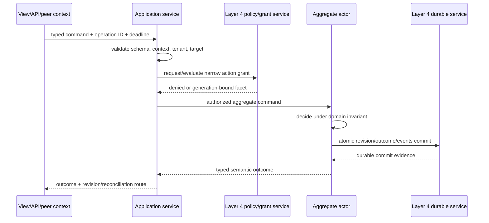

# Bounded Contexts, Domain Model, and Application Services

## Executive decision

Layer 5 should organize meaning around explicit **bounded contexts**, then keep
three roles separate inside each context:

- an **application service** admits and coordinates one use case;
- aggregates, entities, values, and policies express stateful domain rules; and
- a **domain service** expresses a significant rule that does not naturally
  belong to one entity or value.

Infrastructure adapters, presentation adapters, and context translators sit at
the boundary. They may translate representation and transport, but they cannot
invent domain meaning or bypass the target context's authorization and
invariants. “Service” without one of these qualifiers is too ambiguous for an
architecture contract.

## Question and operational standard

The component asks: **where should business meaning live so that it survives
changes in UI, storage, transport, actor placement, and lower-layer services?**

It succeeds only if:

- every term and invariant has an owning bounded context;
- context crossings use an explicit published language and translation policy;
- use-case coordination contains no hidden business rule;
- domain rules can be tested without starting a compositor, network, device,
  secret store, or production persistence adapter;
- domain services are narrow named policies, not dumping grounds for unrelated
  procedural code;
- entity identity and aggregate consistency are explicit;
- read models and presentation models cannot mutate state behind the command
  boundary;
- context, business tenant, authenticated security-realm binding, application
  generation, and protection
  domain remain distinct metadata; and
- lower-layer behavior inherited by a prototype is not presented as a domain
  guarantee.

## Evidence and limits

[Evans](../../30-sources/evans-2015-domain-driven-design-reference.md)
provides the main vocabulary and explicitly separates domain, application,
presentation, and infrastructure responsibilities. [Parnas](../../30-sources/parnas-1972-decomposing-systems-into-modules.md)
supports interfaces that hide volatile representation decisions. These are
design frameworks, not empirical proof that one decomposition fits every
domain.

[Hexagonal architecture](../../30-sources/cockburn-2005-hexagonal-architecture.md)
supplies a practical inside/outside and port/adapter pattern. It does not
specify distributed failure, authority, consistency, or actor supervision.
Atom OS adds those contracts explicitly rather than assuming architectural
purity is enough.

## Bounded-context catalog

```text
BoundedContextDescriptor {
  context_id,
  ubiquitous_language_version,
  owned_entity_and_value_types[],
  aggregate_types_and_invariants[],
  application_commands_and_queries[],
  published_events_and_views[],
  external_context_relationships[],
  tenant_and_policy_binding,
  compatibility_matrix,
  data_and_retention_class,
  recovery_and_degradation_policy
}
```

The catalog is declarative evidence used by manifest validation, protocol
tooling, migration tests, authorization policy, and documentation. It is not a
runtime object registry. A bounded context may span several application actors
or packages; one package may contain several small contexts if their contracts
remain explicit.

## Roles inside a context

| Role | Owns | Must not own |
| --- | --- | --- |
| Application service | syntax/version validation, use-case authorization request, operation ID, deadline, orchestration, outcome return | aggregate invariants, ambient resources, generic infrastructure |
| Entity | durable identity and behavior across state change | cross-context orchestration by convenience |
| Value object | immutable/domain equality semantics and validation | independent lifecycle or hidden external effects |
| Aggregate root | synchronous invariant boundary, accepted commands, state revision, domain facts | arbitrary remote objects inside one fictitious transaction |
| Domain service | named domain calculation or decision spanning values/entities where no one object is natural owner | storage/network/UI code or unbounded “manager” responsibilities |
| Domain policy/specification | composable rule or predicate | authority to execute an effect merely because a condition is true |
| Repository port | semantic load/save/query contract for aggregates | exposure of storage handles or database schema to domain logic |
| Context translator | mapping between published languages and outcomes | silent reinterpretation of unknown or incompatible semantics |

### Application-service flow



The application service may coordinate several already idempotent operations
through a process manager. It must not load two aggregates and pretend its
ordinary actor heap makes their durable updates atomic.

## Context relationships

Every edge has an explicit relationship and anti-corruption policy:

- **published language:** a stable subset intentionally exposed to peers;
- **customer/supplier:** which context may drive compatible change and how it
  is negotiated;
- **conformist:** deliberate adoption of another model, with the coupling
  accepted and tested;
- **anti-corruption layer:** translator protecting the local model from a
  foreign one;
- **shared kernel:** a deliberately tiny shared semantic model with joint
  ownership and synchronized change; or
- **open host/service interface:** a versioned protocol offered to many peers.

Translation records source protocol version, source event/operation ID,
destination operation ID, target context generation, lossy fields, rejected
unknowns, and outcome mapping. A translator is independently supervised and
receives authority only to the two specific ports it joins.

## Domain model versus actor model

| Domain concept | Actor implementation candidate | Important separation |
| --- | --- | --- |
| Entity/aggregate identity | stable `DomainRef` resolved to actor activation | PID is one transient route, not identity |
| Aggregate command | one serialized actor turn | serialization is not durable commit |
| Domain event | immutable committed fact | not every actor message or signal |
| Domain service | pure function or narrow actor | no implicit global singleton or ambient authority |
| Repository | typed port to Layer 4 persistence | actor heap is not the recovery authority |
| Context boundary | versioned protocol and translator | not automatically a node/protection boundary |
| Invariant | checked decision + transactional commit | supervisor restart cannot repair an invalid commit automatically |

Pure domain rules should be ordinary deterministic BEAM code where possible.
A domain service becomes a stateful actor only when it has its own justified
identity, concurrency, cache, or lifecycle. “Everything is an actor” does not
mean every function needs a PID.

## Queries and projections

Queries have no domain mutation effect. They return:

```text
QueryResult {
  value_or_page,
  observed_revision_or_frontier,
  projection_generation,
  freshness_and_completeness,
  redaction_policy_revision,
  continuation | null
}
```

A simple context may read the aggregate's current state through a validated
query method. Separate projections are justified by materially different
access patterns, fan-out, privacy, history, or availability requirements—not
by a blanket CQRS rule. A stale projection never accepts a mutation without
carrying its observed revision to the command side.

## Authorization placement

Layer 5 defines resources and actions in domain vocabulary and places policy-
enforcement points at the aggregate or effect boundary that knows what will
happen. Layer 4 evaluates global identity/policy and issues a narrow grant.
Domain invariants and authorization are related but distinct:

- an authorized command can still violate an invariant;
- a valid state transition can still be unauthorized;
- a cached read model can be structurally correct but over-disclose data;
- a translator may be authorized to map one event but not invoke every target
  command; and
- no context assigns itself administrator, owner, or trusted identity status.

## Failure, overload, and recovery

Failure of presentation or an adapter leaves the domain model intact. Failure
of an application service loses only reconstructible orchestration unless it
had already durably accepted responsibility; long-lived responsibility must be
a process manager. Aggregate failure recovers from the authoritative state and
durable outcome ledger before accepting commands.

Each context declares command priority, admission limits, read-only or stale-
read mode, maximum projection lag, and which invariant-preserving operations
remain available under dependency failure. Domain services have bounded CPU
and data inputs. A complex calculation that exceeds one turn is chunked or
moved to a worker actor with explicit cancellation, without exposing partial
mutations.

## Alternatives considered

| Alternative | Decision |
| --- | --- |
| Organize by UI screens or database tables | reject as the semantic root; both are changeable projections/representations |
| One “business service” layer containing every rule and adapter | reject because authority and cohesion become invisible |
| Rich application services, anemic domain state | allow only deliberately for simple transaction scripts; do not call it the default domain model |
| One microservice or protected domain per bounded context | reject as an automatic mapping; evaluate trust, scale, recovery, and resource needs separately |
| CQRS and event sourcing everywhere | reject; select independently per context |
| Share internal entity types across contexts | reject by default; publish a small language or translator instead |

## Staged implementation and verification

1. Choose one narrow domain and write its vocabulary, commands, invariants,
   entities, values, and context boundaries before choosing persistence.
2. Implement pure decision functions and property tests.
3. Wrap one aggregate in an actor host and current-state repository port.
4. Add an application service and one alternate adapter; run the domain tests
   with no production infrastructure.
5. Add a second context with an intentionally different model and explicit
   translator.
6. Inject schema mismatch, stale revision, actor restart, policy change,
   adapter outage, duplicate command, and overload.
7. Measure whether a domain-rule change remains contained to its context and
   whether an adapter/storage/UI change leaves it untouched.

The design is falsified if business rules appear only in adapters, if a context
crossing shares mutable internal objects, if a supervision or deployment
boundary is asserted solely from DDD terminology, or if a supposedly pure
domain service can perform ambient external effects.

## Connections

- [Applications and domain services layer](../applications-and-domain-services-layer.md)
- [Durable domain identity, aggregate actors, and lifecycle](durable-domain-identity-aggregate-actors-and-lifecycle.md)
- [Typed commands, queries, events, and protocol contracts](typed-commands-queries-events-and-protocol-contracts.md)
- [Presentation sessions, semantic views, and user outcomes](presentation-sessions-semantic-views-and-user-outcomes.md)

## Sources

- [Domain-Driven Design Reference](../../30-sources/evans-2015-domain-driven-design-reference.md)
- [On the Criteria To Be Used in Decomposing Systems into Modules](../../30-sources/parnas-1972-decomposing-systems-into-modules.md)
- [Hexagonal Architecture](../../30-sources/cockburn-2005-hexagonal-architecture.md)
- [Capability Myths Demolished](../../30-sources/miller-et-al-2003-capability-myths.md)
- [End-to-End Arguments in System Design](../../30-sources/saltzer-et-al-1984-end-to-end-arguments.md)
