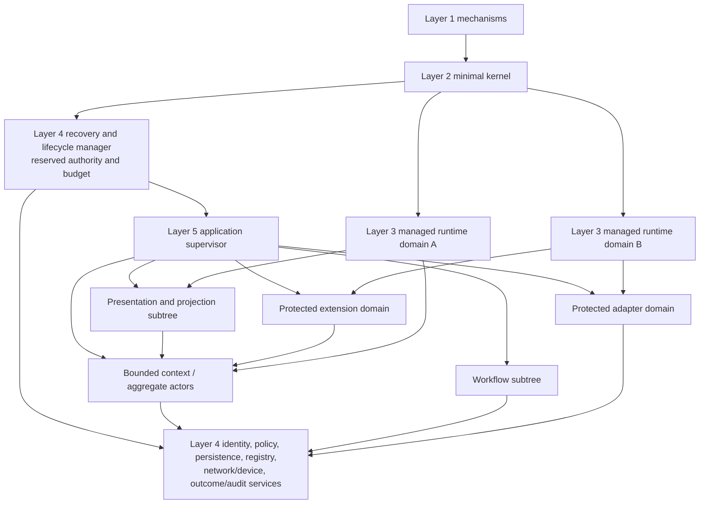

# Cross-Layer Placement, Tenancy, Overload, and Recovery Topology

## Executive decision

Applications and domain services remain an **unprivileged fifth layer**. They
declare semantic topology, tenant/data scope, supervision, required protected
domains, authority, budgets, recovery order, and degraded behavior. Layer 4
validates and provisions those declarations; Layer 3 executes managed actors;
Layer 2 enforces memory, capability, IPC, resource, revocation, and teardown
boundaries; Layer 1 supplies hardware mechanisms.

No single granularity is universal. A bounded context, aggregate, actor,
supervision subtree, tenant, application bundle, and protected domain answer
different questions. Cheap mutually trusted aggregates can share one runtime
domain. A native parser, payment adapter, secret-bearing service, untrusted
plugin, or tenant with strong confidentiality requirements can receive its own
protected domain. Recovery authority is held outside the component it may have
to stop or replace.

Layer 5 decides which work is semantically essential, degradable, read-only,
deferrable, or rejectable. It cannot enforce its own hard limits. Outcome,
audit, revocation, fencing, reconciliation, and recovery paths retain reserved
lower-layer resources ahead of new optional work.

## Question and operational standard

The component asks: **where should application responsibilities and failure
boundaries live so one tenant, adapter, view, plugin, hot key, or crashed actor
cannot compromise every application or make recovery circular?**

It succeeds only if:

- each responsibility is placed at the lowest layer that must enforce it
  against distrustful higher code—and no lower;
- every protected domain has an external recovery holder with narrower
  authority than the application itself;
- each Layer 5 business-tenant reference is bound by Layer 4 to an authenticated
  security realm and binding generation across identity, persistence,
  authority, budgets, telemetry, backup, migration, and recovery;
- a supervision subtree is never presented as confidentiality or integrity
  isolation by itself;
- application restart groups match actual mutable-state and authority coupling;
- stale messages, routes, leases, capabilities, timers, projections, and
  adapters fail at their sinks after recovery;
- no accepted operation is silently shed under overload;
- new admission cannot consume reconciliation or recovery reserve;
- desktop/presentation, domain models, adapters, and system services can
  recover independently where their contracts claim they can; and
- headless, embedded, desktop, remote, and multi-tenant profiles reuse the same
  core contracts with different admitted services.

## Evidence and limits

[Architectural concerns in multi-tenant SaaS](../../30-sources/krebs-et-al-2012-multi-tenant-saas.md)
show that tenancy spans data, configuration, performance isolation, quality of
service, customization, and affinity. This cloud evidence does not pick a
capability-actor OS boundary.

[Wedge](../../30-sources/bittau-et-al-2008-wedge.md) and [Capsicum](../../30-sources/watson-et-al-2010-capsicum.md)
demonstrate reduced privilege and explicit capability restriction in UNIX
settings. [seL4 design principles](../../30-sources/heiser-2020-sel4-design-principles.md)
and [L4 lessons](../../30-sources/elphinstone-heiser-2013-l4-lessons.md) support
small privileged mechanisms and user-space policy. The exact Atom OS domain
cost and assurance profile remains unmeasured.

[Crash-only software](../../30-sources/candea-fox-2003-crash-only-software.md)
and [microreboot](../../30-sources/candea-et-al-2004-microreboot.md) support
restart-oriented recovery when state and retry boundaries are explicit. [SEDA](../../30-sources/welsh-et-al-2001-seda.md)
and [Dagor](../../30-sources/zhou-et-al-2018-dagor.md) provide overload-control
precedents under their systems. None proves the topology below.

## Placement rule

Apply these questions in order:

1. Does the concern require privileged instruction, architecture entry,
   interrupt, MMIO, DMA/IOMMU, reset, cache/TLB ordering, time, or fault
   mechanism? Layer 1 owns only that mechanism.
2. Must it enforce memory, capability, IPC, object lifetime, resource, revoke,
   or teardown against distrustful domains? Layer 2 owns the generic mechanism.
3. Is it BEAM-compatible loading/execution, actor heap/mailbox/signals, timer,
   reduction scheduling, process-local tracing GC, code generation, or native-
   work boundary? Layer 3 owns it.
4. Is it generic lifecycle, registry, persistence, identity/policy, secrets,
   device/network service, distributed coordination, update, overload,
   observability, audit, or operator control? Layer 4 owns the policy service.
5. Is it business identity, invariant, use case, workflow, domain event,
   external-effect meaning, semantic view, collaboration rule, or user outcome?
   Layer 5 owns it.

Higher layers declare needs and consume narrower contracts; they do not copy
lower mechanisms merely to avoid a typed dependency.

## Responsibility matrix

| Concern | Layer 1 | Layer 2 | Layer 3 | Layer 4 | Layer 5 |
| --- | --- | --- | --- | --- | --- |
| Identity | hardware/boot facts | kernel object generations | PID/runtime incarnation | authoritative workload/user/tenant and security-realm identity, names, policy epochs, binding generation | bounded-context, business-tenant reference, domain, workflow, operation identity |
| Authority | architecture trap mechanism | capability representation/enforcement/revocation | opaque handle transfer | policy decision, grant derivation, secrets | typed resources/actions and sink-side use |
| Execution | CPU/interrupt/time mechanisms | domain/IPC/scheduling-account enforcement | actors, reductions, GC, messages, timers | lifecycle/admission/recovery policy | domain decisions, workflows, projections |
| Persistence | ordering/cache/fault mechanisms | mappings and object authority | serialization helpers only | WAL/checkpoint/store/outcome substrate | schemas, invariants, event/state/snapshot/projection policy |
| Network/device | MMIO/DMA/IRQ/reset mechanisms | isolated mappings/routes/queues | async port/worker mechanics | drivers, endpoints, protocols, sessions | semantic adapter and effect outcome |
| Update | code-publication mechanisms | W^X, stop/revoke/teardown | loader/code generations | artifact, release, staging, publication, rollback orchestration | behavioral compatibility, state/workflow transform, effect cutoff |
| Overload | counters/timers/interrupt controls | resource accounts and hard ceilings | reductions/mailbox/heap accounting | global admission, queues, quotas, reserve, alarms | command classes and semantic degradation |
| Observability | low-level fault facts | bounded kernel evidence | actor/runtime trace hooks | telemetry, audit, alarms, operator control | semantic SLIs, invariant and outcome evidence |

## Trust and recovery topology



Arrows express lifecycle/protocol dependence, not unrestricted capability
flow. The recovery manager can revoke, stop, replace, rebind, or quarantine
declared domains; it cannot read arbitrary domain state or execute business
effects. Persistence/outcome authority survives application subtree failure.

## Boundary selection

| Boundary | Choose granularity from | Typical mistake |
| --- | --- | --- |
| Bounded context | language/model cohesion and change | assuming one deployable service |
| Aggregate | synchronous invariant and transaction scope | making every relation one huge aggregate |
| Actor | serialization, state locality, activation overhead | treating PID as durable entity or security boundary |
| Supervision subtree | shared restart/escalation policy | giving supervisor data/authority it need not have |
| Business-tenant/security-realm binding | application domain partition mapped to authenticated identity, data disclosure, policy, and accounting scope | assuming the two IDs are identical or accepting an application-supplied realm tag without enforcement |
| Protected domain | mutual trust, native-code risk, secret/data authority, resource and recovery coupling | one domain for all cheap actors or one domain per actor automatically |
| Deployment package | update/release/ownership cadence | making package boundary define domain model |

### Protected-domain escalation criteria

Create a separate protected domain when one or more are material:

- mutually distrustful authors, tenants, or principals;
- native, unsafe, JIT, GPU, parser, codec, or extension code;
- secrets or high-confidentiality data not needed by siblings;
- high-consequence device/network/payment/publication authority;
- independent resource enforcement or denial containment;
- independently revocable and replaceable lifecycle;
- different update/signing provenance; or
- evidence that one shared runtime compromise would exceed the accepted trust
  boundary.

Actor subtrees remain the cheap default inside one mutually trusted domain.

## Tenant binding

```text
TenantApplicationBinding {
  business_tenant_ref,
  authenticated_security_realm_id,
  binding_generation,
  application_id_and_generation,
  allowed_bounded_contexts,
  identity_and_policy_namespace,
  persistence_and_backup_namespace,
  capability_derivation_root,
  resource_accounts_and_quotas,
  extension_and_adapter_policy,
  network_device_and_secret_scope,
  telemetry_audit_and_outcome_scope,
  placement_and_protection_profile,
  update_recovery_and_export_policy
}
```

Layer 5 defines the meaning and lifecycle of `business_tenant_ref`; it is a
designation and grants no authority. Layer 4 authenticates
`security_realm_id`, issues the mapping and `binding_generation`, and derives
the enforceable persistence, capability, budget, and audit scopes. The two
identities may be many-to-many over time, but every admitted operation names
one current binding explicitly.

The durable `DomainRef` carries the business-tenant designation only. The
current binding ID/generation accompanies every request, grant, record
partition, projection, adapter session, trace redaction policy, backup, and
migration authorization. Realm migration can therefore fence and replace a
binding without changing the domain entity's identity. Missing, self-asserted,
stale, or mismatched bindings are protocol errors before admission, never a
default to the current process.

Shared services use per-tenant namespaces and resource accounts, avoid global
mutable caches of sensitive data, and make cache keys include all policy/
redaction dimensions. Strong isolation profiles use separate encryption keys,
stores, protected domains, or devices as needed; the architecture does not
claim one logical tag equals physical isolation.

## Resource hierarchy

```text
SystemRecoveryReserve
  -> Layer4CoreServices
  -> TenantAccount
       -> ApplicationGenerationAccount
            -> ContextAccount
                 -> Aggregate/Workflow/Projection/Adapter/Extension accounts
```

Charges include kernel objects/capability slots, CPU/reductions, heap/binaries,
mailbox bytes, timers, durable bytes/history/snapshots/outcomes, network/device
queues, native work, projection sessions, telemetry, migration shadow space,
and teardown/recovery work. A delegated scheduler or application cannot create
work whose completion cost is uncharged.

## Semantic admission and degradation

Layer 5 classifies work:

| Class | Examples | Overload behavior |
| --- | --- | --- |
| Safety/control | revoke, fence, outcome/audit commit, reconciliation, recovery | protected reserve; deny new ordinary work first |
| Accepted invariant work | commit already admitted command/workflow step | finish or retain queryable pending responsibility |
| Interactive deadline work | user command/query | admit only when budget predicts useful completion; typed reject otherwise |
| Workflow/projection maintenance | timers, read-model update | fair bounded progress; expose age/freshness |
| Optional/speculative | prefetch, analytics, cosmetic view, rebuild optimization | coalesce, defer, cancel, or drop with counters |

The application declares a degraded-mode state machine: full, read-only, stale-
bounded, queued-with-limit, offline-local, repair-only, or unavailable. It names
which invariants and outcomes remain guaranteed. Layer 4 enforces queue and
resource ceilings and publishes dependencies/alarms.

## Recovery groups

A recovery group is the smallest set whose non-separable transient state,
authority, or external session must change generation together. It is derived
from the declared graph and verified under faults.

| Failure | Restart/recover | Must survive | Fence/reconcile |
| --- | --- | --- | --- |
| Presentation/view | view/projection session | domain actors, durable outcomes/workflows | session, focus/input, projection generation; reconcile submitted operation IDs |
| Aggregate actor | one activation or pooled host shard | store, outcome ledger, other aggregates | PID/route/lease; recover state and pending operations |
| Process manager | one workflow activation | workflow record, timers, effects/outcomes | step/timer generation and pending adapter operations |
| Adapter | one adapter domain/instance | originating state, outbox, workflow | route/lease/device session; query external IDs |
| Extension | one extension instance/domain | host domain state | imports, mappings, callbacks; validate/discard result |
| Context runtime domain | all actors sharing corrupted/failed runtime | Layer 4 store and independent contexts/domains | runtime and actor incarnations, all live grants/routes |
| Persistence service | affected store shard/service | replicated/checkpoint evidence and application records | reject new commits, reconcile uncertain local outcomes |
| Application generation | application subtrees | Layer 4 lifecycle/outcome/audit and retained durable data | publication/admission generation; drain or migrate workflows |
| Recovery manager | preprovisioned successor | kernel and sealed recovery state | old recovery epoch and escrowed sessions |

If a supposedly independent restart repeatedly requires a sibling's hidden
state, the real recovery group is larger and the contract must be redesigned or
documented honestly.

## Recovery sequence

1. Lower fault route or monitor informs an independent supervisor/recovery
   holder.
2. Close new admissions and publish degraded/unavailable state using reserve.
3. Revoke/fence failed generation routes, capabilities, leases, timers, input
   sessions, and adapter/device sessions at their sinks.
4. Preserve or quarantine uncertain resources until quiescence is proved.
5. Start a private replacement with newly derived authority and resource
   accounts.
6. Recover domain state plus durable operation/workflow/effect frontiers.
7. Query external operations with stable IDs before retry.
8. Validate invariants, dependencies, policy, schema, and readiness evidence.
9. Atomically publish the new generation through Layer 4.
10. Reconnect views/projections from fresh snapshots and resume ordinary
    admission gradually.

An application never needs the crashed component to voluntarily surrender its
authority. Forced teardown may quarantine hardware/native resources whose safe
reuse cannot be proved.

## Desktop and headless profiles

A desktop application consists of durable domain/workflow services plus one or
more optional presentation providers. Desktop failure restarts presentation
and reconciles operation IDs; it need not restart the domain. An application
may pause user-dependent workflows while headless, but that is declared domain
policy.

An embedded profile may admit one fixed semantic adapter and no general
desktop. A server profile may offer remote API/semantic views. A local-first
profile may retain mergeable domain work while Layer 4 network services are
absent. These profiles share identity, command/outcome, persistence, and
authority contracts.

## Security invariants

- Every tenant and application generation has a distinct capability derivation
  and resource-account path.
- Recovery authority is outside and narrower than the failed component's
  ordinary authority.
- A supervisor can monitor/restart without automatically reading child state.
- Registry/discovery returns identity and generation, not invocation authority.
- All stale generations fail at actual state/effect sinks.
- Shared caches, projections, deduplication ledgers, telemetry, backup, and
  migration include tenant and redaction scope.
- Native and untrusted components cannot share application memory merely for
  lower latency without changing the declared trust boundary.
- An operator can repair one named workflow/effect without receiving global
  application administrator authority.

## Alternatives considered

| Alternative | Decision |
| --- | --- |
| Entire application in one protected domain | allowed for small mutually trusted low-risk app; not universal default |
| One protected domain per actor | reject as baseline; defeats cheap actor density and may increase kernel/runtime cost |
| One tenant per process tree only | reject; supervision is not enforced data/authority isolation |
| One bounded context equals one microservice | reject; semantic and deployment boundaries differ |
| Application implements private registry/store/identity/update manager | reject; duplicates Layer 4 and creates inconsistent policy |
| Restart whole application for any actor fault | reject where state/authority boundaries permit finer recovery |
| Shed accepted work silently | reject; retain outcome responsibility or never admit it |
| Use ordinary resources for recovery | reject; overload can otherwise make recovery impossible |

## Staged implementation and verification

1. Generate the declared actor/supervision/domain/authority/resource graph for
   one application and compare it with runtime observations.
2. Run many cheap aggregate actors in one protected domain; isolate one native
   adapter and one untrusted extension separately.
3. Create two tenants, attack names/caches/storage/projections/telemetry, and
   prove cross-tenant requests fail at sinks.
4. Exhaust every resource account while revocation, outcome commit,
   reconciliation, and recovery remain within reserve.
5. Crash each actor, subtree, runtime domain, adapter, Layer 4 dependency, and
   presentation separately; measure actual recovery groups and deadlines.
6. Pause an old lease holder through failover and verify every persistent and
   external sink rejects its fence.
7. Run desktop, headless, embedded, remote, and local-first profiles over the
   same domain protocol.
8. Compromise a supervisor/recovery holder and verify its narrower authority
   cannot perform domain effects or read arbitrary state.

The design is falsified if a tenant tag without capability/storage enforcement
crosses data, if recovery depends on the failed component's cooperation, if an
accepted effect is lost under overload, if a presentation failure necessarily
destroys domain state, or if the observed recovery group is systematically
larger than declared.

## Connections

- [Applications and domain services layer](../applications-and-domain-services-layer.md)
- [Minimal privileged kernel layer](../minimal-privileged-kernel-layer.md)
- [Managed actor runtime layer](../managed-actor-runtime-layer.md)
- [OTP-like system services layer](../otp-like-system-services-layer.md)
- [Cross-layer visual placement and recovery](../visual-computing-synthesis-components/cross-layer-placement-and-recovery-topology.md)
- [Admission, overload, and service-resource governance](../otp-like-system-services-components/admission-overload-and-service-resource-governance.md)

## Sources

- [Architectural Concerns in Multi-Tenant SaaS Applications](../../30-sources/krebs-et-al-2012-multi-tenant-saas.md)
- [Wedge](../../30-sources/bittau-et-al-2008-wedge.md)
- [Capsicum](../../30-sources/watson-et-al-2010-capsicum.md)
- [seL4 Design Principles](../../30-sources/heiser-2020-sel4-design-principles.md)
- [From L3 to seL4](../../30-sources/elphinstone-heiser-2013-l4-lessons.md)
- [Crash-Only Software](../../30-sources/candea-fox-2003-crash-only-software.md)
- [Microreboot](../../30-sources/candea-et-al-2004-microreboot.md)
- [SEDA](../../30-sources/welsh-et-al-2001-seda.md)
- [Dagor](../../30-sources/zhou-et-al-2018-dagor.md)
- [Resource Containers](../../30-sources/banga-et-al-1999-resource-containers.md)
