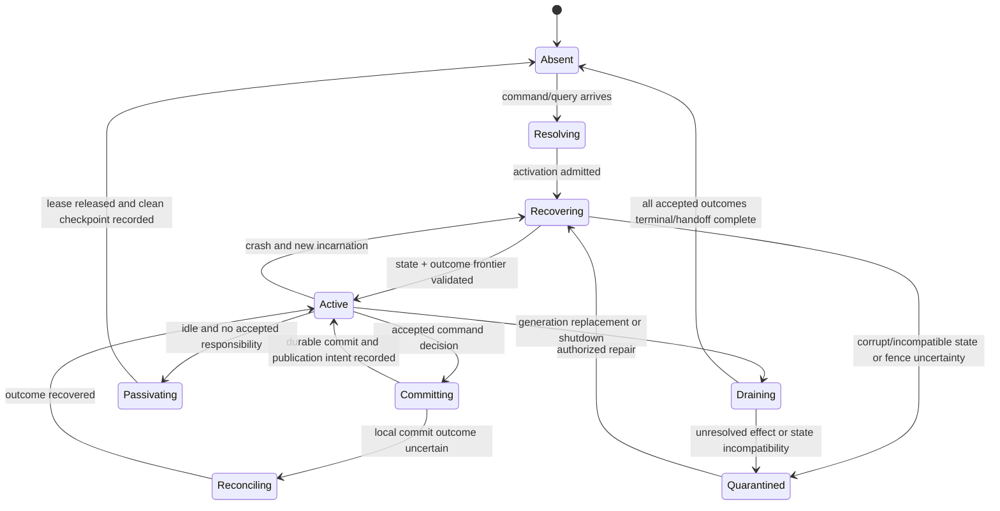

# Durable Domain Identity, Aggregate Actors, and Lifecycle

## Executive decision

Atom OS should identify every durable entity or aggregate with a stable,
tenant-bound `DomainRef` that survives process, runtime, node, service,
presentation, and code-generation replacement. Resolution may activate or
locate an actor that serializes decisions for that reference. The actor PID,
mailbox, heap, scheduler placement, route, and live capability remain
incarnation-specific and are never serialized as semantic identity.

One non-reentrant actor per active aggregate is the preferred initial profile
because it aligns a mailbox-serialization boundary with one invariant boundary.
It is not universal: immutable values need no actor; tiny cold aggregates may
share a host; high-contention aggregates may need partitioning; and distributed
single-writer authority requires Layer 4 leases/fences or consensus beyond
ordinary actor identity.

## Question and operational standard

The component asks: **how can durable domain objects use cheap managed actors
without confusing identity, activation, state, routing, consistency, or
security?**

It succeeds only if:

- a stable domain identity never embeds a PID, pointer, capability selector,
  storage address, node, surface, or provider incarnation;
- at most one actor is authoritative for an aggregate under the declared local
  or distributed policy;
- stale messages and routes are rejected by lifecycle and activation
  generations;
- decision serialization is separated from crash-atomic persistence;
- recovery consults durable state and prior operation outcomes before new work;
- passivation cannot discard accepted but uncommitted responsibility;
- tombstones and key reuse cannot resurrect stale authority or messages;
- reentrancy is disabled for invariant-critical decisions and enabled only
  with an explicit protocol proof;
- mailbox, heap, binary, timer, persistence, and recovery work are accounted;
  and
- the aggregate actor remains an implementation of a domain boundary, not the
  definition of every domain object.

## Evidence and limits

[Evans](../../30-sources/evans-2015-domain-driven-design-reference.md) defines
entity continuity and aggregate roots as invariant boundaries. [Orleans](../../30-sources/bernstein-et-al-2014-orleans.md)
demonstrates stable type-plus-key actor identity over transient activations.
Orleans does not prove a general aggregate mapping, and its platform semantics
are not the BEAM contract.

[Statecharts](../../30-sources/harel-1987-statecharts.md) support explicit
lifecycle modeling. The [managed actor runtime
research](../managed-actor-runtime-components/actor-identity-lifecycle-and-process-state.md)
defines PID incarnation and process-state mechanics below this component. The
Atom OS `DomainRef` and activation protocol remain proposed and unevaluated.

## Identity model

```text
DomainRef {
  bounded_context_id,
  business_tenant_ref | null,
  entity_type_id,
  entity_key,
  lifecycle_generation
}
```

The lifecycle generation changes on semantic destruction/recreation or key
reuse, not on an ordinary crash. An activation receives:

```text
ActivationLease {
  domain_ref,
  activation_incarnation,
  runtime_incarnation,
  service_generation,
  security_realm_binding_id,
  security_realm_binding_generation,
  owner_node_or_domain,
  lease_or_fence | local_single_writer,
  policy_revision,
  expiry,
  resource_account,
  persistence_route
}
```

The domain reference is safe to retain durably as a name. It contains a
business-tenant designation but no mutable security-realm assignment. The
activation lease binds current Layer 4-authenticated realm and binding
generations; the lease and its capability facets are live authority and are not
serializable.

## Aggregate host responsibilities

The host:

- validates target context, tenant, lifecycle generation, protocol, operation
  ID, expected revision, deadline, and invocation facet;
- resolves or recovers authoritative state;
- serializes invariant-critical decisions;
- rejects unexpected reentrancy and stale continuation messages;
- atomically associates the new revision, operation outcome, domain records,
  outbox intents, and workflow starts where the store supports it;
- publishes no event or effect before durable commit evidence;
- returns typed outcomes and reconciliation routes;
- snapshots or passivates only at a declared clean boundary;
- records bounded diagnostics without exposing domain secrets; and
- relinquishes activation authority before another incarnation becomes
  authoritative.

It does not implement the generic store, global registry, node membership,
lease service, supervisor, policy engine, or resource enforcer. Those are
Layer 4/2 services.

## Lifecycle state machine



`Absent` means no activation, not no durable entity. `Quarantined` preserves
state and evidence while denying ordinary commands; an operator or repair
workflow receives only the specific inspect/migrate/reconcile facets.

## Command turn

1. **Admission:** validate envelope and check durable operation-result cache.
2. **Load/recover:** ensure the in-memory revision matches authoritative state.
3. **Decide:** execute deterministic domain logic without blocking external
   calls or permitting invariant-relevant reentrancy.
4. **Commit:** atomically persist state/events, revision, request digest,
   outcome, outbox, and workflow intents.
5. **Publish intent:** notify projection/outbox workers only after commit.
6. **Reply:** return the durable status. If the reply is lost, a retry with the
   same ID and digest recovers the same logical execution and its current
   monotonically progressing status.

If the caller reuses an operation ID with a different digest, the request is a
protocol violation, never a new command. Replay/deduplication guarantees are
scoped to an advertised retention epoch or maximum retry window. After it,
reuse fails closed as
`RejectedBeforeAdmission(operation_identity_expired)` unless a compact
tombstone retains the ID, digest, and terminal outcome for the entity
lifecycle; it never silently becomes a new command.

## Reentrancy and long work

The invariant-critical actor is non-reentrant. A command that requires remote
data or long computation:

- validates and records a proposal or workflow state;
- releases the turn;
- delegates to a bounded worker or adapter;
- receives a generation- and step-bound result; and
- runs a new decision against the current revision.

This avoids holding a mailbox turn across an uncertain effect. Reentrant reads
or commutative commands can be enabled only after the context states the
interleaving invariant and tests every continuation against revision and
generation.

## Activation and placement profiles

| Profile | Use | Required safeguard |
| --- | --- | --- |
| One actor per active aggregate | baseline mutable aggregate | non-reentrant turn + durable commit + bounded mailbox |
| Pooled host for many cold aggregates | constrained memory and high cardinality | per-aggregate state isolation, fair scheduling, no cross-key head-of-line blocking, clean eviction |
| Sharded aggregate | one logical aggregate too hot or large | formal decomposition of invariants or coordinated shard protocol |
| Replicated read activation | high read demand | explicit observed frontier and no mutation authority |
| Leased distributed writer | mobile placement/failover | Layer 4 lease plus monotonically increasing fence checked at store/effect sinks |
| Consensus state machine | critical cross-node availability/ordering | deterministic commands, quorum membership, log and snapshot recovery |

Virtual activation is optional policy above the managed runtime. Base BEAM
semantics retain explicit process incarnation; a resolver may start a new
activation but must not make an expired PID silently refer to it.

## Destruction and key reuse

Deletion commits a tombstone containing final revision, lifecycle generation,
retention policy, outstanding operation/workflow references, and authorization
evidence. A key may be reused only by incrementing lifecycle generation after:

- all live routes and grants for the old generation expire or revoke;
- deduplication/outcome retention can no longer confuse old requests;
- integration and replication tombstones have reached their declared frontier;
- projections cannot interpret the new entity as the old one; and
- external references have an explicit missing/replaced outcome.

## Failure, overload, and security

Mailbox admission rejects work before accepting durable responsibility when
the aggregate's queue or account is full. Deadline-expired queued work is
discarded only if no acceptance commit occurred; otherwise it reconciles.
Hot-key protection combines per-aggregate queue bounds, caller/tenant fairness,
work-cost estimates, and admission tokens from Layer 4.

An actor route authorizes nothing by itself. Invocation requires a scoped
facet for the action and target generation. State snapshots are encrypted or
redacted according to policy; crash evidence never dumps secrets by default.
A supervisor may restart the actor but cannot read or mutate its state unless
given separate capability.

On split brain, both actors may believe they are current. Safety therefore
depends on the persistence and external sinks rejecting the older fence—not on
the directory alone. If the sink cannot fence, exclusive effects remain
unsupported under that placement profile.

## Alternatives considered

| Alternative | Decision |
| --- | --- |
| Persist PID as entity identity | reject; it binds meaning to one incarnation and enables stale-message confusion |
| Runtime transparently recreates any expired PID | reject for base semantics; explicit resolver may return a new route |
| One actor for every value object | reject; immutable values need no lifecycle or mailbox |
| One process per entire application | reject as baseline; unrelated aggregates share failure, mailbox, heap, and authority |
| Fully reentrant aggregate actors | reject by default; only proved commutative/continuation protocols may opt in |
| Actor heap as durable truth | reject; crash and migration require authoritative Layer 4 persistence |

## Staged implementation and verification

1. Implement local `DomainRef` resolution and one non-reentrant aggregate host.
2. Atomically store state revision, operation digest/outcome, and outbox intent.
3. Crash at each admission/decision/commit/reply transition and retry every
   operation.
4. Add idle passivation and force races with arriving messages and timers.
5. Reuse PIDs, storage slots, and entity keys; verify generations reject every
   stale message.
6. Add pooled hosting and compare memory, fairness, latency, and failure
   containment against one actor per aggregate.
7. Add a two-node leased writer and inject partition, pause, clock anomaly, and
   delayed old writes while the storage/effect sinks enforce fences.

The design is falsified if two authoritative activations can commit for one
generation, if passivation loses accepted responsibility, if actor
serialization is presented as durable atomicity, or if a stale PID/capability
can act on a recreated entity.

## Connections

- [Applications and domain services layer](../applications-and-domain-services-layer.md)
- [Actor identity, lifecycle, and process state](../managed-actor-runtime-components/actor-identity-lifecycle-and-process-state.md)
- [Naming, registry, and local discovery](../otp-like-system-services-components/naming-registry-and-local-discovery.md)
- [Distributed membership and authoritative coordination](../otp-like-system-services-components/distributed-membership-discovery-and-authoritative-coordination.md)
- [Invariants, transactions, and concurrency policy](invariants-transactions-and-concurrency-policy.md)

## Sources

- [Domain-Driven Design Reference](../../30-sources/evans-2015-domain-driven-design-reference.md)
- [Orleans](../../30-sources/bernstein-et-al-2014-orleans.md)
- [Statecharts](../../30-sources/harel-1987-statecharts.md)
- [Life beyond Distributed Transactions](../../30-sources/helland-2007-life-beyond-distributed-transactions.md)
- [RIFL](../../30-sources/lee-et-al-2015-rifl.md)
- [The Chubby Lock Service](../../30-sources/burrows-2006-chubby.md)
