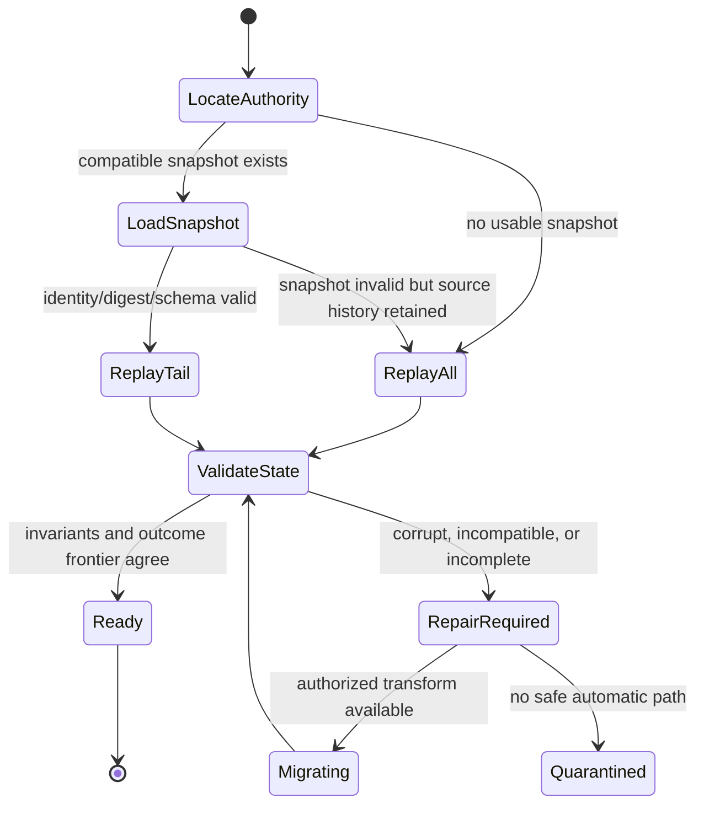

# Durable State, Journals, Snapshots, and Projections

## Executive decision

Layer 5 should own **persistence meaning and policy**, while Layer 4 owns the
generic durable mechanism. A bounded context may choose current-state records,
state plus a selected change log, event-sourced aggregates, or a replicated
operation set. Event sourcing and CQRS are optional and independent; they are
not the Layer 5 default.

Every profile binds durable identity, revision/frontier, schema and code
generation, checksum, operation outcomes, retention, privacy, backup, recovery,
and projection semantics. Snapshots are normally disposable replay
accelerators, not an independent authority. A storage WAL is not a domain event
merely because both are append-only.

## Question and operational standard

The component asks: **what durable record lets an application recover the same
domain truth, explain its history where required, rebuild views, and evolve
without confusing storage mechanics with business facts?**

It succeeds only if:

- the authoritative record type is declared per aggregate/context;
- a state revision or event position is monotonic within its stated stream;
- operation outcomes and unpublished integration intents cannot fall out of
  sync with the domain commit;
- replay performs no uncontrolled external effect;
- every stored event/state/snapshot remains readable through its retention
  window or has a verified transform;
- projection freshness and completeness are visible;
- corrupted, partial, wrong-generation, or unauthorized snapshots fail closed;
- event pruning and privacy erasure have explicit authority and audit;
- unbounded journal, snapshot, outbox, tombstone, and projection growth is
  prevented; and
- host-filesystem or database behavior is not treated as an Atom OS guarantee
  until Layer 4 proves it.

## Evidence and limits

[Event-sourcing industry research](../../30-sources/overeem-et-al-2021-event-sourced-systems.md)
reports benefits alongside concrete evolution, learning, tooling, projection-
rebuild, and privacy costs across 25 engineers and 19 systems. [Fowler's
article](../../30-sources/fowler-2005-event-sourcing.md) provides the
practitioner pattern and replay/external-query cautions. The empirical study is
qualitative and does not establish universal superiority.

[ARIES](../../30-sources/mohan-et-al-1992-aries.md) and [FSCQ](../../30-sources/chen-et-al-2015-fscq.md)
show rigorous storage recovery precedents under their own models. They do not
make the application event model correct. [Durable Functions](../../30-sources/burckhardt-et-al-2021-durable-functions.md)
shows how logged history can support recovery semantics while raising history-
growth and determinism constraints.

## Profile selection

| Profile | Authority | Best fit | Mandatory cautions |
| --- | --- | --- | --- |
| Current state | latest validated aggregate record/revision | ordinary entities where present truth dominates | separate audit/history if required; concurrency and outcome linkage still explicit |
| State + change log | state plus atomically associated selected facts | human explanation and integration without full replay | log/state divergence and retention semantics |
| Event sourced | ordered domain events interpreted by versioned reducer | temporal reconstruction, several projections, domain history intrinsic | evolution, replay determinism, privacy, rebuild time, history growth |
| Replicated operation set | immutable authorized operations plus deterministic interpretation | offline collaboration with suitable semantics | causal metadata, intent, authorization, tombstone GC, invalid operations |

The choice applies at an aggregate or stream boundary. One application can use
current state for a customer profile or domain qualification, event sourcing
for a business ledger, and CRDTs for collaborative annotations if each
contract is explicit. OS authentication credentials, secrets, and trusted
identity remain Layer 4 responsibilities, not application records.

## Current-state record

```text
AggregateStateRecord {
  domain_ref,
  revision,
  schema_version,
  producing_code_generation,
  state_digest,
  encryption_and_retention_class,
  state_payload,
  last_committed_operation_id,
  recovery_metadata
}
```

The record does not contain a live PID, route, capability, secret lease,
surface, focus token, or native pointer. A repository port enforces compare-
and-commit or transactional revision change and returns durable evidence.

## Event-sourced stream

```text
EventStreamRecord {
  stream: DomainRef,
  position,
  event_id,
  event_schema_version,
  producing_code_generation,
  causation_operation_id,
  correlation_id,
  initiating_subject_ref,
  payload_digest,
  payload
}
```

`initiating_subject_ref` identifies the authenticated principal behind the
operation, not the transient PID/actor activation that appended it. Append
checks expected position and operation deduplication. Reducers are pure
with respect to external effects. Nondeterministic values—time, randomness,
identity allocation, external observations—enter as validated command input or
recorded event data. Replay must not send messages, capture payments, actuate
devices, mint grants, or publish integration events again.

### Domain event versus other records

- a WAL block exists to recover storage internals;
- a domain event records a business fact;
- an integration record is a selected public statement derived from a commit;
- an effect intent asks an adapter to do work;
- an audit record accounts for security/policy action; and
- telemetry is lossy operational observation.

One physical log may store several record types, but its API, retention,
authority, and interpretation keep them distinct.

## Snapshots

```text
AggregateSnapshot {
  domain_ref,
  through_position_or_revision,
  event_or_state_schema_profile,
  reader_code_generation_range,
  snapshot_schema_version,
  state_digest,
  source_log_prefix_digest | null,
  created_by_operation,
  payload
}
```

Recovery selects the newest compatible, authenticated snapshot, validates its
identity and digest, then replays later events. If validation fails, it falls
back to an older snapshot or full replay within policy. Snapshot creation runs
under bounded I/O/CPU/memory and never pauses command admission without a
declared budget.

Deleting earlier events changes the snapshot from cache to authority and
requires a migration/pruning transaction, retained verification evidence,
backup coordination, and explicit legal/privacy policy.

## Projections

Each projection is deterministic from a declared input stream/frontier and may
be rebuilt or incrementally updated:

```text
ProjectionCheckpoint {
  projection_id,
  tenant_and_redaction_scope,
  projection_schema_version,
  input_frontiers,
  producer_generation,
  output_digest,
  completeness,
  rebuild_generation
}
```

Queries return the checkpoint frontier and maximum known staleness. A projection
cannot authorize an operation merely because a row appears in it. Sensitive
projections use distinct keys and capability scopes; one broad materialized
view must not leak data among tenants.

Projection workers are restartable and idempotent. If input was pruned before a
valid checkpoint or backup exists, rebuild is impossible and the system must
say so rather than silently claim completeness.

## Atomic commit bundle

Where supported, one local transaction records:

```text
PersistenceCommit {
  expected_aggregate_revision,
  new_state_or_domain_events,
  next_revision_or_position,
  operation_id_and_request_digest,
  durable_operation_outcome,
  integration_outbox_records,
  effect_intents,
  new_or_updated_workflow_records
}
```

Projection offsets, relay acknowledgements, and telemetry usually commit
separately and are recoverable by idempotent replay. External effects are never
inside this bundle unless the endpoint truly participates in the same atomic
protocol.

## Evolution and privacy

Each stored type declares:

- oldest and newest readable schema;
- writer version and unknown-field policy;
- upcaster or copy-transform chain;
- replay fixtures and expected state/outcome digests;
- mixed-code-generation window;
- immutable-history correction model;
- retention, legal hold, export, and deletion authority;
- encryption/key generation and cryptographic-erasure option; and
- projection invalidation/rebuild consequences.

Deleting or redacting historical personal data can conflict with immutable
audit/history claims. Options include envelope encryption with per-subject key
destruction, redaction events plus restricted original store, authorized
copy-transform into a new stream, or a domain that avoids event sourcing for
sensitive data. Each changes what “complete history” means and must be stated
honestly.

## Recovery state machine



Recovery validates pending operation outcomes and outbox/effect intents before
the aggregate accepts new work. Unknown local commit is resolved from the
durable log; unknown external effect moves to its adapter reconciliation path.

## Resource and overload policy

Budgets cover state size, event count/bytes, replay duration, snapshot work,
outbox backlog, projection lag, tombstones, backup traffic, and migration
shadow copies. Admission may reject writes before commit when retention cannot
be guaranteed. It must not accept an event and later drop it as “telemetry.”

Projection updates may coalesce or lag within their declared freshness.
Snapshots, analytics, and speculative rebuilds yield before outcome commit and
recovery. An event stream with no tested compaction/retention path is not ready
for production admission.

## Alternatives considered

| Alternative | Decision |
| --- | --- |
| Event sourcing for all aggregates | reject; evidence shows substantial, context-dependent cost |
| Current state only for every domain | reject as a universal rule; some domains require intrinsic history/replay |
| Database WAL exposed as domain log | reject; storage recovery records do not define business facts |
| Snapshot is always authoritative | reject by default; treat as validated cache until explicit pruning promotes it |
| Rebuild projections indefinitely | reject; bound time, I/O, history retention, and degraded service |
| Immutable means undeletable | reject; define privacy/legal-hold and cryptographic/transform policy explicitly |
| CQRS requires event sourcing | reject; read/write model separation and persistence choice are independent |

## Staged implementation and verification

1. Implement current-state aggregate commits with revision, operation outcome,
   and outbox in one Layer 4 transaction.
2. Add one event-sourced aggregate whose reducer is pure and whose history is
   small enough for full replay.
3. Generate snapshots, corrupt each field, truncate writes, and verify fallback
   or quarantine.
4. Build two projections with independent checkpoints, crash/restart them, and
   expose exact freshness to queries.
5. Run old/new event and snapshot readers over a permanent fixture corpus.
6. Benchmark replay, snapshot, rebuild, migration shadow, retention, and backup
   under constrained target budgets.
7. Execute privacy erasure/legal hold scenarios and verify audit claims remain
   precise rather than absolute.

The design is falsified if replay triggers an external effect, if outcome and
state disagree, if a projection claims freshness beyond its frontier, if old
retained events become unreadable, or if storage growth has no enforceable
bound.

## Connections

- [Applications and domain services layer](../applications-and-domain-services-layer.md)
- [Durable state, transactions, and outcome recovery](../otp-like-system-services-components/durable-state-transactions-and-outcome-recovery.md)
- [Application evolution, schema compatibility, and migration](application-evolution-schema-compatibility-and-migration.md)
- [Offline collaboration, replication, and conflict semantics](offline-collaboration-replication-and-conflict-semantics.md)

## Sources

- [Event-sourced systems and schema evolution](../../30-sources/overeem-et-al-2021-event-sourced-systems.md)
- [Event Sourcing](../../30-sources/fowler-2005-event-sourcing.md)
- [Durable Functions semantics](../../30-sources/burckhardt-et-al-2021-durable-functions.md)
- [ARIES](../../30-sources/mohan-et-al-1992-aries.md)
- [FSCQ](../../30-sources/chen-et-al-2015-fscq.md)
- [An Approach to Persistent Programming](../../30-sources/atkinson-et-al-1983-persistent-programming.md)
- [Transactional Outbox](../../30-sources/richardson-2026-transactional-outbox.md)
