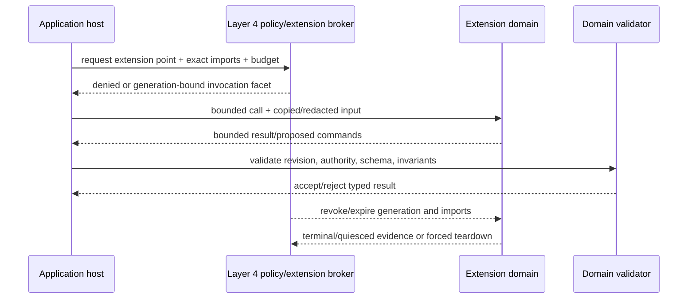

# Extension Points, Plugins, and Live-Tooling Confinement

## Executive decision

Layer 5 extension points should be **narrow versioned domain protocols with
explicit capability imports and enforceable resource budgets**, never ambient
code injection into the application. Pure trusted functions may run in the
host only when their inputs and cost are bounded. Independent trusted callbacks
use separate supervised actor subtrees. Untrusted BEAM, portable bytecode,
native libraries, GPU code, parsers, and live tools run in separate protected
domains according to risk.

BEAM compatibility remains the primary application environment. WASI-style
explicit imports, object-capability language subsets, software fault isolation,
and native process isolation are comparative or optional extension profiles,
not replacements for BEAM semantics. Loaded bytecode is not a security boundary
by itself, and supervision is not memory or authority isolation.

## Question and operational standard

The component asks: **how can users and applications extend a live system
without giving extension code the host's complete state, authority, or failure
scope?**

It succeeds only if:

- every extension point defines inputs, outputs, determinism, effects, versions,
  deadlines, cancellation, and resource ceilings;
- extension identity, package generation, signer/provenance, tenant, and host
  instance are explicit;
- imports are narrow capability facets, never ambient registry/filesystem/
  network/device/secret/debug access;
- untrusted code cannot share mutable host memory or capability tables;
- native code and NIF-like work cannot block or corrupt the managed runtime;
- result validation and domain invariants remain in the host context;
- crashes, hangs, output floods, mailbox floods, and malformed results are
  contained and observable;
- live inspection, tracing, evaluation, editing, migration, publication, and
  external effects are separate powers;
- revocation closes new invocation and drains or kills bounded work safely;
  and
- extension updates use immutable generations and compatibility tests.

## Evidence and limits

[WASI design principles](../../30-sources/wasi-project-2026-design-principles.md)
support explicit resource handles and link-time control. They state design
intent and assume a correct host; they do not supply resource or side-channel
limits.

[Wedge](../../30-sources/bittau-et-al-2008-wedge.md) demonstrates fine-grained,
default-deny application compartments on Linux, and [Capsicum](../../30-sources/watson-et-al-2010-capsicum.md)
demonstrates descriptor-rights attenuation. Neither system is a BEAM actor OS.
[Capability Myths Demolished](../../30-sources/miller-et-al-2003-capability-myths.md)
supports reachable-reference authority and explicit delegation.

The [OTP managed-runtime documentation](../../30-sources/erlang-otp-team-2026-otp-29-0-6-managed-runtime-documentation.md)
records current BEAM/OTP execution and native-code boundaries; existing secure-
coding guidance treats loaded code as trusted. That implementation behavior is
not an unavoidable future BEAM contract, but Atom OS must not promise a sandbox
without a new enforced design and evaluation.

## Extension descriptor

```text
ExtensionDescriptor {
  extension_id,
  immutable_artifact_digest,
  signer_and_provenance,
  code_profile: trusted_beam | isolated_beam | wasi | native | gpu | data_only,
  host_extension_point,
  protocol_versions,
  declared_determinism,
  requested_import_facets[],
  tenant_and_data_scope,
  resource_budget,
  timeout_and_cancellation,
  state_and_schema_profile,
  output_validation,
  failure_and_restart_policy,
  update_and_revocation_policy,
  observability_and_audit_contract
}
```

The application manifest names which extension points are available. Layer 4
authenticates the artifact, validates policy, provisions domains/budgets, and
derives imports. Layer 5 validates domain outputs and decides their meaning.

## Extension classes

| Class | Placement | Permitted power | Typical examples |
| --- | --- | --- | --- |
| Verified pure data/rule | compiled-in reviewed host module from a total, cost-bounded subset, or copied immutable lookup value | no effects; statically or mechanically bounded calculation | bounded formatting/validation table or reviewed finite pricing rule |
| Trusted callback actor | separate subtree in same protection domain | named domain facet and bounded messages | custom projection, notification policy |
| Isolated BEAM extension | separate managed runtime/protected domain | explicit serializable capability protocol | third-party automation or user script |
| WASI/portable module | dedicated extension host/domain | selected host imports only | portable codec or transformation |
| Native/parser/media/GPU | dedicated protected domain and native-work path | bounded buffers/queues plus exact device/service facet | codec, document parser, shader compiler |
| Live tool | separate tool domain | inspect, trace, evaluate, stage, migrate, or publish facets separately | browser, debugger, editor, profiler |

Sharing one protection domain is permitted only among mutually trusted code
whose combined authority, data, failure, and resource scope is acceptable.
“Same tenant” or “same package” alone is not sufficient analysis.

The host-call exception is deliberately narrow. A BEAM function is not safely
contained merely because its interface is called “pure”: it can still loop,
allocate without bound, or crash its caller. If totality and a conservative
cost bound are not established by the admitted subset and artifact checks, the
rule executes through a separately supervised, reduction/heap/deadline-budgeted
worker actor (or an isolated interpreter/domain for untrusted code). The host
never calls an arbitrary extension module synchronously on its invariant turn.

## Host-call model

```text
ExtensionCall {
  extension_instance_and_generation,
  extension_point_and_protocol,
  invocation_id,
  host_object_ref_and_revision,
  deadline_and_cancellation,
  input_budget,
  imported_capability_facets[],
  redacted_input
}

ExtensionResult {
  invocation_id,
  extension_generation,
  status,
  output_digest,
  bounded_output,
  proposed_domain_commands_or_changes[],
  resource_usage,
  diagnostics_reference | null
}
```

An extension proposes results or typed commands; the host revalidates current
revision, authority, and invariants. It never accepts a returned raw capability,
PID, pointer, device address, or arbitrary executable payload as domain data.

## Live-tool capability split

| Facet | Permits | Explicitly excludes |
| --- | --- | --- |
| Inspect | redacted immutable snapshot or semantic projection | mutation, secrets, arbitrary heap traversal |
| Trace | declared probe points and bounded aggregation | authority acquisition or complete audit claim |
| EvaluatePure | bounded pure expression against copied values | I/O, messages, clocks, randomness, mutation |
| StageChange | create typed changeset against exact base generation | publication or live-state mutation |
| ValidateChange | compile/typecheck/model/property test in hermetic realm | production effects |
| MigrateShadow | transform copied/shadow state under budget | source deletion or route publication |
| PublishGeneration | request Layer 4 atomic publication of validated artifact | bypass readiness/policy or mint capabilities |
| RepairEffect | one named operation reconciliation/compensation | general external adapter access |

The same tool need not receive all facets. A normal inspector cannot become an
editor; an editor cannot publish; a publisher cannot read secrets unless the
specific migration requires a separately approved secret facet.

## Invocation and revocation



Revocation closes admission immediately. In-flight pure work may be discarded.
An extension effect that was durably accepted follows the ordinary outcome/
reconciliation protocol; killing the extension is not proof it did nothing.

## State and persistence

Extension-private durable state is namespaced by extension ID, host application
generation, tenant, and schema. Host domain state stores only validated domain
facts, not opaque live extension memory. Extension upgrade declares how its
state transforms or is discarded. Uninstall retains/export/deletes state under
an explicit user and policy decision.

Cached compiled code, render artifacts, indexes, and derived projections are
reconstructible and budgeted separately from user-authored extension data.

## Resource and denial containment

Budgets include reductions/CPU, wall deadline, heap, binary bytes, mailbox,
output size/depth, timers, persistent state, host-call rate, network/device I/O,
trace volume, native threads, GPU submissions, and teardown work. Nested
extension calls consume the initiating budget and have a depth limit.

The host rejects before admission when it cannot reserve bounded execution.
It can shed speculative extensions before core application commands. Recovery,
revocation, audit/outcome, and manual disable paths have independent reserve.

## Security invariants

- An extension package name or signature identifies code; it does not grant a
  filesystem, socket, device, secret, user-data, or debug capability.
- The extension cannot enumerate ambient services or other tenants.
- Host-call tables are immutable per generation and attenuated per instance.
- Input is copied or shared read-only through revocable bounded mappings; no
  host pointers or mutable heaps cross.
- Native crashes and memory corruption remain inside the protected domain.
- Output is treated as untrusted data and revalidated at the domain boundary.
- Trace identifiers and semantic object names are not authority.
- Extension provenance, grant, invocation, output digest, and accepted domain
  change are correlated without treating lossy telemetry as audit truth.

## Alternatives considered

| Alternative | Decision |
| --- | --- |
| Load any BEAM module into host runtime | reject for untrusted code; current loaded-code model assumes trust |
| Signature means trusted and unrestricted | reject; authenticity is not safety or least authority |
| WASM/WASI alone is a complete sandbox | reject; host calls, runtime, budgets, side channels, and native implementation remain |
| One plugin host for every extension | reject for mixed trust/tenant/native risk; can share only after explicit analysis |
| One process per pure callback | unnecessary by default; retain in-process pure profile with strict bounds |
| Generic debug capability | reject; split inspect/trace/evaluate/stage/migrate/publish/effect facets |
| Kill on timeout and call effect failed | reject; reconcile accepted external effects separately |

## Staged implementation and verification

1. Define one pure extension point and a canonical bounded input/output format.
2. Add trusted callback actors with mailbox, reduction, heap, deadline, and
   output limits.
3. Run the same extension protocol in an isolated BEAM domain and WASI-like
   host; compare compatibility, latency, memory, and authority.
4. Add a hostile native/parser extension and fault memory, CPU, output, and
   host-call behavior.
5. Exercise live-tool facets with separate principals and ensure no authority
   composition grants publication/effects accidentally.
6. Revoke during computation, storage write, adapter call, and publication;
   verify outcome reconciliation and teardown.
7. Upgrade/uninstall with state migration, export, retention, and rollback
   tests.

The design is falsified if an extension can enumerate ambient resources, read
another tenant, escape its budget/domain, return an unchecked domain mutation,
or turn inspection into publication or external-effect authority.

## Connections

- [Applications and domain services layer](../applications-and-domain-services-layer.md)
- [Capability-scoped live tools and transactional evolution](../visual-computing-synthesis-components/capability-scoped-live-tools-and-transactional-evolution.md)
- [Native work, ports, and drivers](../managed-actor-runtime-components/native-work-ports-and-drivers.md)
- [Application manifest, composition, and authority envelope](application-manifest-composition-and-authority-envelope.md)
- [Application evolution, schema compatibility, and migration](application-evolution-schema-compatibility-and-migration.md)

## Sources

- [WASI Design Principles](../../30-sources/wasi-project-2026-design-principles.md)
- [Wedge](../../30-sources/bittau-et-al-2008-wedge.md)
- [Capsicum](../../30-sources/watson-et-al-2010-capsicum.md)
- [Capability Myths Demolished](../../30-sources/miller-et-al-2003-capability-myths.md)
- [OTP managed-runtime documentation](../../30-sources/erlang-otp-team-2026-otp-29-0-6-managed-runtime-documentation.md)
- [Mutatis Mutandis](../../30-sources/stoyle-et-al-2005-safe-predictable-dynamic-updating.md)
- [Live Objects All The Way Down](../../30-sources/pimas-et-al-2023-live-objects-all-the-way-down.md)
- [Dynamic Instrumentation of Production Systems](../../30-sources/cantrill-et-al-2004-dtrace.md)
