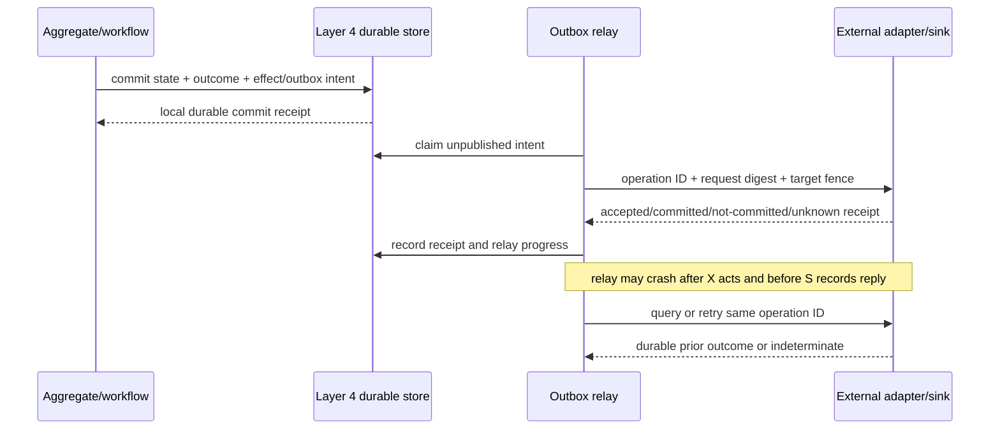

# External Effects, Ports, Adapters, and Reconciliation

## Executive decision

Every Layer 5 interaction with storage, network services, devices, people,
payment rails, notification systems, or other bounded contexts should cross a
**typed semantic port and an independently supervised adapter**. The port must
expose locality, admission, deadlines, backpressure, duplicate behavior,
fencing, stable operation identity, receipts, cancellation, compensation, and
`Indeterminate` outcomes. It must not make a remote or physical effect look
reliably local.

A transactional outbox atomically records domain state and the intent to
publish or perform an effect. It does not prove remote delivery or exactly-once
execution. Exactly-once *semantic effect* is claimed only where the ultimate
sink participates in the same stable operation-ID and durable outcome lookup.
Otherwise the application reconciles, compensates, quarantines, or presents an
honest unknown result.

## Question and operational standard

The component asks: **how can domain logic request effects without coupling to
technology or lying about partial failure?**

It succeeds only if:

- domain code depends on semantic ports, not sockets, paths, drivers, brokers,
  database clients, or GUI toolkits;
- every adapter receives the minimum resource and action capabilities;
- transport acceptance, endpoint acceptance, semantic commit, and observed
  completion are distinct receipts;
- the same logical operation ID and request digest survive retries;
- a timeout or actor crash does not become `NotCommitted` without evidence;
- an old lease, route, device, application, or policy generation fails at the
  actual sink;
- outbox/inbox retention and duplicate behavior are explicit;
- retries are finite, jittered, deadline-aware, and charged to the initiating
  tenant/workflow;
- external effects never occur during event replay or speculative migration;
- adapter crash/restart cannot lose accepted responsibility; and
- domain-specific compensation and reconciliation remain Layer 5 policy while
  generic transport and durable mechanisms remain Layer 4.

## Evidence and limits

[Hexagonal architecture](../../30-sources/cockburn-2005-hexagonal-architecture.md)
supports ports around domain meaning and replaceable adapters. [Parnas](../../30-sources/parnas-1972-decomposing-systems-into-modules.md)
supports hiding volatile implementation decisions. These patterns do not
address partial failure or authority.

[A Note on Distributed Computing](../../30-sources/waldo-et-al-1994-distributed-computing.md)
and [RPC](../../30-sources/birrell-nelson-1984-remote-procedure-calls.md) explain
why remote outcomes cannot be treated as local calls. [RIFL](../../30-sources/lee-et-al-2015-rifl.md)
and [fault tolerance via idempotence](../../30-sources/ramalingam-vaswani-2013-fault-tolerance-via-idempotence.md)
show stronger retry semantics when stable IDs and durable result records
participate. Scope remains critical.

The [transactional outbox](../../30-sources/richardson-2026-transactional-outbox.md)
is authoritative practitioner guidance, not a formal or independently measured
proof. It explicitly retains duplicate relay behavior.

## Port descriptor

```text
DomainPort {
  port_id,
  semantic_operation_family,
  protocol_versions,
  request_and_outcome_types,
  locality_and_failure_profile,
  idempotency_profile,
  ordering_and_concurrency,
  deadline_and_cancellation,
  backpressure_and_admission,
  authority_and_tenant_binding,
  target_generation_and_fencing,
  reconciliation_and_compensation,
  audit_and_retention_obligations
}
```

An adapter translates this contract to one provider. The application manifest
declares acceptable providers and their required outcome profile; Layer 4
resolves and provisions a generation-bound route and capability.

## Effect record

```text
EffectIntent {
  effect_operation_id,
  request_digest,
  originating_context_and_aggregate,
  originating_commit_revision,
  workflow_and_step | null,
  semantic_port_and_version,
  target_resource_and_generation,
  tenant_and_authority_intent,
  deadline,
  retry_budget,
  compensation_or_repair_policy,
  current_outcome
}
```

The record retains no bearer capability. On dispatch, the adapter receives a
fresh attenuated handle and validates current policy. The originating commit
can prove the application accepted responsibility, not that the endpoint
completed the effect.

## Outbox and inbox



The inbox at a participating target atomically associates operation ID,
request digest, state change, and result. Reusing an ID with a different digest
is rejected. Garbage collection requires acknowledgement/lease or a documented
maximum retry horizon; silent early deletion reopens duplicate execution.

## Adapter outcome model

| State | Meaning | Safe next action |
| --- | --- | --- |
| `Unadmitted` | adapter has no durable responsibility | caller may retry or reject |
| `AcceptedPending` | adapter/sink retained responsibility | query same operation; do not create a new one |
| `Committed` | named effect and scope have durable evidence | advance workflow; retain receipt |
| `NotCommitted` | endpoint proves named effect absent or cancelled before commit | retry if deadline/policy allow |
| `Fenced` | route, lease, resource, or policy generation stale | reacquire current route/authority; reassess intent |
| `Indeterminate` | execution cannot currently be established | reconcile/query, compensate only by domain rule, or manual repair |
| `Quarantined` | safety/identity/device state uncertain | no ordinary retry until authorized recovery |

An HTTP 200, TCP acknowledgement, message-broker enqueue, device interrupt, or
actor reply is evidence only for the exact layer and scope it names.

## Adapter classes

### Participating durable service

The strongest profile accepts operation ID and request digest, atomically
stores result with its state, and supports durable lookup. Duplicate delivery
returns the original result. RIFL-like retention/reclamation constraints apply.

### At-least-once message receiver

Use outbox plus receiver inbox/deduplication. Ordering is per declared key, not
global unless a stronger protocol supplies it. A consumer commits its own state
and inbox outcome atomically; downstream effects remain separate.

### Queryable external endpoint

The endpoint may accept a stable idempotency key and later expose status. A
lost reply enters `Indeterminate` until query resolves. Retention windows and
key reuse are part of the contract.

### Nonqueryable endpoint or physical device

Do not claim exactly-once. Use fenced exclusive ownership, observable feedback,
conservative retry rules, compensation, or explicit operator repair. Some
effects—launching a mechanism, sending an irreversible message, human action—
may remain unknowable after failure.

### Human task

Model assignment, acknowledgement, expiry, reassignment, evidence, privacy,
and duplicate action as a workflow step. A notification being delivered is not
proof a person performed the business action.

## Capability and isolation policy

An adapter gets only:

- its one semantic port's target handle;
- bounded buffers/queues and network/device/storage facets;
- access to its own outbox/inbox partitions;
- current tenant/workflow action grant;
- narrow outcome/audit publication facets; and
- recovery/revocation hooks for its resources.

Payment, device, native-code, parser, and untrusted protocol adapters use
separate protected domains. Compromise cannot reach aggregate state directly,
mint new effects, inspect other tenants, or use the composition root as an
ambient deputy.

## Backpressure, retry, and overload

Admission happens before unbounded serialization or allocation. Ports expose
capacity and typed overload outcomes. Accepted intent consumes durable bytes,
retry budget, deadline, and tenant quota. Retry uses exponential backoff with
jitter, honors endpoint guidance, and stops at deadline or policy limit.

Recovery/reconciliation traffic has a separate reserved budget from new effect
admission. When the sink is unavailable, the application enters a declared
degraded mode: reject new effects, accept only bounded durable pending work, or
offer read-only operation. Infinite outbox growth is never a valid mode.

## Replay and migration safety

Domain event replay only rebuilds state and projections. Effect intents are
dispatched by a separate adapter state machine that consults their durable
outcome. Migration may transform intent representation but cannot reissue it
under a new operation ID or change its semantic payload silently.

Shadow/canary adapters receive either synthetic traffic, read-only queries, or
effect requests whose target explicitly supports duplicate shadowing. A canary
must not execute real irreversible effects twice merely to compare versions.

## Alternatives considered

| Alternative | Decision |
| --- | --- |
| Call database/network/device APIs directly from aggregate | reject; couples meaning, authority, blocking, and failure to infrastructure |
| Hide remote failure behind local-looking actor call | reject; contract must expose deadline, ambiguity, and reconciliation |
| Two-phase commit across every provider | reject as default; many endpoints cannot participate and blocking/failure cost is high |
| Outbox means exactly once | reject; relay can duplicate and remote action remains separate |
| Generate a new ID for every retry | reject; it converts one uncertain operation into possible duplicates |
| Treat compensation as automatic inverse | reject; domain-specific, fallible, authorized new action |
| One adapter process holds every external capability | reject; separate by trust, tenant, resource, and recovery coupling |

## Staged implementation and verification

1. Define a port with all outcome states and implement a deterministic fake
   endpoint capable of every loss/duplicate/reorder/crash point.
2. Atomically commit aggregate state, operation result, and outbox intent.
3. Crash the relay before send, after send, after endpoint commit, after reply,
   and before relay acknowledgement.
4. Verify same-ID retry, altered-payload rejection, retention, and result
   lookup.
5. Add a nonqueryable endpoint and prove `Indeterminate` cannot be collapsed.
6. Fence two competing adapter generations at the actual sink.
7. Saturate queues/outbox/storage and verify new work rejects while accepted
   reconciliation makes bounded progress.
8. Compromise an adapter domain and measure the exact capabilities and data it
   can reach.

The design is falsified if timeout is treated as safe nonexecution, if replay
performs an effect, if the relay can duplicate a semantic effect without the
contract saying so, or if an adapter can use authority outside its declared
port.

## Connections

- [Applications and domain services layer](../applications-and-domain-services-layer.md)
- [Workflows, process managers, timers, and compensation](workflows-process-managers-timers-and-compensation.md)
- [Network endpoint and protocol services](../otp-like-system-services-components/network-endpoint-and-protocol-services.md)
- [Device-service policy and management](../otp-like-system-services-components/device-service-policy-and-management.md)
- [Durable state, transactions, and outcome recovery](../otp-like-system-services-components/durable-state-transactions-and-outcome-recovery.md)

## Sources

- [Hexagonal Architecture](../../30-sources/cockburn-2005-hexagonal-architecture.md)
- [On the Criteria To Be Used in Decomposing Systems into Modules](../../30-sources/parnas-1972-decomposing-systems-into-modules.md)
- [A Note on Distributed Computing](../../30-sources/waldo-et-al-1994-distributed-computing.md)
- [Implementing Remote Procedure Calls](../../30-sources/birrell-nelson-1984-remote-procedure-calls.md)
- [RIFL](../../30-sources/lee-et-al-2015-rifl.md)
- [Fault Tolerance via Idempotence](../../30-sources/ramalingam-vaswani-2013-fault-tolerance-via-idempotence.md)
- [Transactional Outbox](../../30-sources/richardson-2026-transactional-outbox.md)
- [End-to-End Arguments](../../30-sources/saltzer-et-al-1984-end-to-end-arguments.md)
- [Exponential Backoff and Jitter](../../30-sources/brooker-2015-exponential-backoff-jitter.md)
