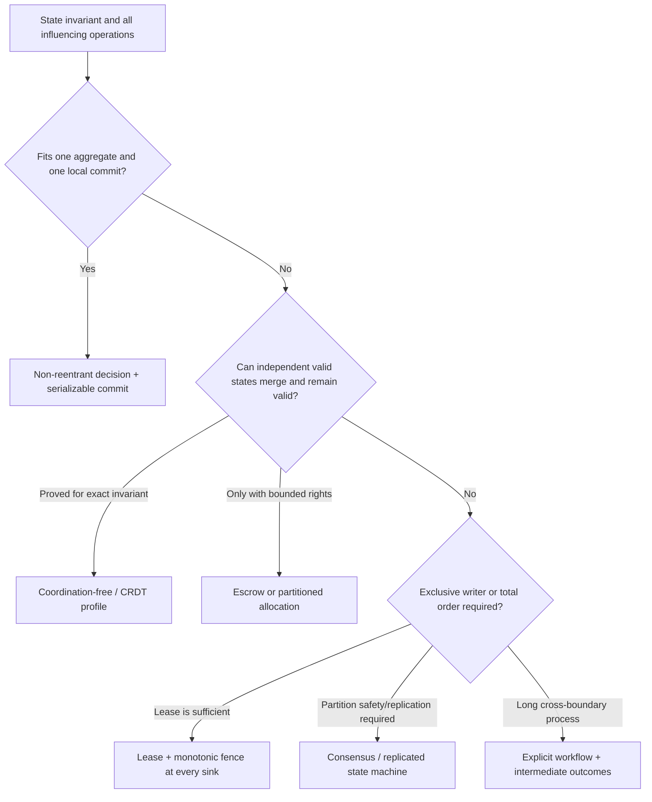

# Invariants, Transactions, and Concurrency Policy

## Executive decision

Atom OS should choose transaction and coordination policy **from explicit
domain invariants**, not from a universal preference for strong consistency,
eventual consistency, actors, CRDTs, or transactions. The conservative native
profile is one non-reentrant aggregate decision followed by one serializable
local commit. Cross-aggregate work is a visible workflow.

Coordination may be removed only where the exact operations and merge rule are
shown to preserve the exact invariant—through an invariant-confluence,
monotonicity, escrow, commutativity, or equivalent argument backed by tests or
proof. Actor turn serialization, snapshot isolation, last-writer-wins, CRDT
convergence, and “eventual consistency” are not substitutes for this analysis.

## Question and operational standard

The component asks: **what must be atomic or coordinated so every accepted
concurrent history preserves the domain's rules?**

It succeeds only if:

- each invariant is written in domain terms, including all state and external
  facts it quantifies;
- the smallest synchronous decision/commit scope is identified;
- isolation level and anomaly tolerance are explicit rather than “ACID” by
  label;
- expected revisions, command deduplication, and durable outcomes are part of
  the same correctness model;
- read projections state their frontier and are never assumed current;
- every coordination-free claim names its merge model and proof/test evidence;
- scarce and exclusive rights use escrow, lease/fence, single-writer, or
  consensus as appropriate;
- cross-aggregate intermediate states are visible to a process manager;
- authorization changes and schema upgrades trigger re-analysis; and
- performance measurements remain attached to their exact workload and
  hardware.

## Evidence and limits

[Gray](../../30-sources/gray-1981-transaction-concept.md) frames a transaction
as a recoverable consistency-preserving state transformation and identifies
limits of flat, long-lived work. [Coordination
avoidance](../../30-sources/bailis-et-al-2014-coordination-avoidance.md) proves
invariant confluence necessary and sufficient for coordination-free execution
under its model. Its 25-fold TPC-C result cannot be transferred to Atom OS.

[Helland](../../30-sources/helland-2007-life-beyond-distributed-transactions.md)
and [Sagas](../../30-sources/garcia-molina-salem-1987-sagas.md) motivate
entity-local transactions plus messages and compensation for long work. Both
expose weaker outer isolation. [RIFL](../../30-sources/lee-et-al-2015-rifl.md)
shows how stable request identity and durable results strengthen retry
semantics within a participating store; it does not cover arbitrary external
sinks.

No source proves the complete Atom OS invariant catalog. The catalog and
profiles below must be validated on real applications.

## Invariant record

```text
InvariantDefinition {
  invariant_id,
  bounded_context_id,
  statement,
  quantified_state_and_external_facts,
  owning_aggregate_or_workflow,
  operations_that_can_affect_it[],
  consistency_profile,
  merge_or_serialization_rule,
  authorization_dependencies,
  schema_and_policy_versions,
  executable_property,
  proof_or_test_evidence,
  known_counterexamples[]
}
```

Examples distinguish materially different needs:

| Invariant | Likely profile | Why |
| --- | --- | --- |
| order total is sum of immutable lines | aggregate-local deterministic decision | all state fits one aggregate and is recomputable |
| username unique within realm | authoritative allocation, consensus, or partitioned namespace | concurrent independent claims can collide |
| inventory never below zero | serialized owner or escrowed rights | scarce quantity cannot be duplicated by merge |
| document preserves all concurrent inserts | CRDT/operation-set with intent policy | mergeable edits can remain available offline |
| no payment captured twice | stable external operation ID plus sink result lookup | local database cannot alone constrain payment rail |
| user may read record only while grant current | sink-side policy epoch/revocation check | convergence or cached projection cannot authorize |
| workflow emits at most one irreversible publication | durable workflow state plus fenced adapter | spans aggregate and nontransactional effect |

## Decision procedure



The analysis includes authorization as an operation constraint. If offline
replicas can accept writes from a revoked principal, the merge may preserve a
numeric invariant but still violate policy.

## Aggregate-local transaction

The preferred commit checks:

1. target lifecycle generation and invocation facet are current;
2. operation ID is new or has the same stored request digest;
3. expected revision matches or the command has an explicit merge/rebase rule;
4. the decision preserves every declared aggregate invariant;
5. write/write and read/write dependencies satisfy the selected isolation;
6. state/events, next revision, operation outcome, outbox intents, and workflow
   starts commit atomically; and
7. publication begins only after durable commit evidence.

Serializable isolation is the default because weaker levels require anomaly-
specific reasoning. Optimistic abort and retry are acceptable only before
external effects and with the same logical operation identity; an application
must budget contention and avoid retry storms.

## Actor serialization is narrower than a transaction

One actor turn gives a local sequential decision order. It does not guarantee:

- the decision reached durable storage before crash;
- two split-brain activations cannot both run;
- a projection read was serializable with the command;
- a worker continuation still applies to the current revision;
- a remote effect ran once;
- an old code generation preserves a new invariant; or
- another aggregate participated atomically.

Every continuation returns with expected revision, workflow/step generation,
and operation ID and is revalidated in a new turn.

## Coordination-free profile

Approval requires a review artifact containing:

- complete invariant predicate;
- initial valid-state set;
- every admitted operation and its precondition;
- replica visibility and causal assumptions;
- merge/interpretation function;
- proof, exhaustive bounded model, or generated counterexample search that
  any independently reachable valid states merge validly;
- authorization and revocation assumptions;
- tombstone/garbage-collection behavior; and
- re-analysis trigger for schema or policy changes.

“It is a CRDT” proves at most convergence conditions for a datatype, not that
the application's invariant or intent holds.

## Escrow, leases, fences, and consensus

| Mechanism | Suitable for | Failure that must remain visible |
| --- | --- | --- |
| Escrow/rights partition | bounded counters and quotas whose rights can be divided | exhausted local rights while global supply exists; transfer/reclamation lag |
| Single local owner | one-machine authoritative aggregate | owner/recovery outage; no partition tolerance claim |
| Lease without sink fence | cache or advisory work only | paused old owner can act after expiry; unsafe for exclusive irreversible effects |
| Lease + monotonic fence | exclusive resource whose sink rejects older epochs | sink unavailable or unable to persist/compare fence |
| Consensus log/state machine | critical replicated order and membership | quorum loss rejects commit; deterministic execution and reconfiguration required |

Layer 5 declares the needed semantic profile. Layer 4 supplies membership,
lease, fence, or consensus services; the actual state/effect sink must enforce
the fence.

## Cross-aggregate invariants

First ask whether the invariant is modeled too broadly. If it genuinely spans
aggregates, choose among:

- move the invariant-relevant state into one aggregate;
- reserve rights locally through escrow;
- place the exclusive decision in one authoritative service;
- coordinate a consensus-backed transaction if justified; or
- express the requirement as a long-running workflow with pending, committed,
  terminated, compensated, and indeterminate states.

A saga cannot recreate isolation: observers may see intermediate commits, and
compensation may fail. The domain must specify which intermediate states are
legal and what users are told.

## Overload and fairness

Contention is itself a resource. The component declares per-aggregate queue
bounds, command cost classes, optimistic retry limits, hot-key admission,
tenant fairness, lock/transaction deadlines, and deadlock/abort evidence.
Layer 4 enforces CPU, mailbox, memory, and persistence budgets.

Under overload, reject before admission, shed derivable reads/projections
before invariant commits, and never let unbounded automatic retries amplify a
hot invariant. Accepted writes retain enough outcome state to reconcile.

## Alternatives considered

| Alternative | Decision |
| --- | --- |
| Strong transactions across everything | reject as default; scope and external participation are unrealistic |
| Eventual consistency everywhere | reject; it says nothing about invariant or conflict meaning |
| Snapshot isolation assumed serializable | reject; analyze anomalies or use serializable profile |
| Actor-per-aggregate means no concurrency bugs | reject; crash, split brain, continuations, projections, and effects remain |
| Last writer wins | allow only where overwriting concurrent intent is the domain rule |
| CRDT for money/inventory by default | reject; use proved bounded/escrow model or coordination |
| Retry until success | reject; budget retries and preserve operation identity/outcome |

## Staged implementation and verification

1. Write an invariant catalog for the first bounded context.
2. Implement one serializable aggregate transaction and inject conflicts and
   crashes at every commit boundary.
3. Generate command histories and compare implementation with a sequential
   reference model.
4. Select one mergeable and one scarce invariant; model both under partitions.
5. Implement escrow or fenced ownership for the scarce case and demonstrate a
   stale owner is rejected at the sink.
6. Saturate one hot aggregate and measure fairness, abort/retry amplification,
   and recovery-path reserve.
7. Change a schema and authorization rule; require the invariant analysis and
   compatibility corpus to update before publication.

The design is falsified if an accepted concurrent history violates a declared
invariant, if the proof omits an admitted operation, if a stale lease holder can
reach the sink, or if retry can duplicate an external effect.

## Connections

- [Applications and domain services layer](../applications-and-domain-services-layer.md)
- [Durable domain identity, aggregate actors, and lifecycle](durable-domain-identity-aggregate-actors-and-lifecycle.md)
- [Offline collaboration, replication, and conflict semantics](offline-collaboration-replication-and-conflict-semantics.md)
- [Distributed membership and authoritative coordination](../otp-like-system-services-components/distributed-membership-discovery-and-authoritative-coordination.md)

## Sources

- [The Transaction Concept](../../30-sources/gray-1981-transaction-concept.md)
- [Coordination Avoidance in Database Systems](../../30-sources/bailis-et-al-2014-coordination-avoidance.md)
- [Life beyond Distributed Transactions](../../30-sources/helland-2007-life-beyond-distributed-transactions.md)
- [Sagas](../../30-sources/garcia-molina-salem-1987-sagas.md)
- [RIFL](../../30-sources/lee-et-al-2015-rifl.md)
- [Conflict-Free Replicated Data Types](../../30-sources/shapiro-et-al-2011-conflict-free-replicated-data-types.md)
- [The Chubby Lock Service](../../30-sources/burrows-2006-chubby.md)
