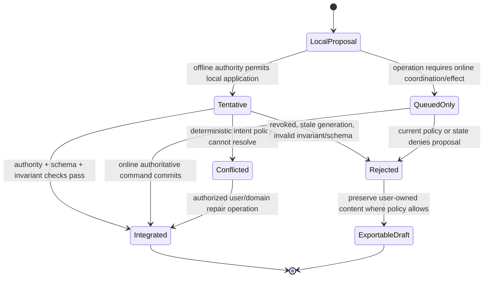

# Offline Collaboration, Replication, and Conflict Semantics

## Executive decision

Offline and collaborative operation should be an **explicit Layer 5 profile
selected per domain type**, not a property inherited automatically from a
replicated store. The application owns operation meaning, conflict detection,
merge or ordering policy, user-intent presentation, authorization, and whether
an effect is legal offline. Layer 4 supplies replication transport, membership,
causal metadata storage, durable logs, identity/policy queries, and resource
governance.

CRDT or operation-set convergence is valuable but narrower than domain
correctness. Convergence does not prove that user intent, invariants,
authorization, privacy, scarce-resource allocation, workflow order, or external
effects are correct. Each type is classified as mergeable, escrow/bounded,
single-writer/leased, consensus-mediated, or nonreplicable external effect.

## Question and operational standard

The component asks: **which application work may proceed while disconnected,
and how is it reconciled without calling byte convergence complete
correctness?**

It succeeds only if:

- every operation or delta admitted for offline integration has stable identity,
  author-subject reference, authority epoch, causal context, schema, and
  deterministic interpretation;
- the application states convergence, invariant, intent, authorization, and
  effect properties separately;
- tentative and committed state are visibly distinguishable where they differ;
- offline grants have bounded scope, time, epoch, delegation, and maximum
  effect;
- revocation and policy changes are checked before post-reconnect integration;
- merge cannot silently turn an unauthorized operation into an accepted fact;
- tombstone and causal-metadata collection has a safe frontier;
- privacy exposure through history and metadata is explicitly analyzed;
- external effects are proposed or escrowed offline unless their sink supports
  the required idempotency/authority contract; and
- conflict resolution produces inspectable evidence and user repair where
  deterministic policy cannot preserve intent.

## Evidence and limits

[Bayou](../../30-sources/terry-et-al-1995-bayou-conflicts.md) demonstrates
application-specific dependency checks, merge procedures, and tentative versus
committed state under weak connectivity. It is historical and application
merge procedures can be wrong.

[CRDT research](../../30-sources/shapiro-et-al-2011-conflict-free-replicated-data-types.md)
establishes convergence conditions under formal models. [Conflict-free
JSON](../../30-sources/kleppmann-beresford-2017-conflict-free-json.md) shows
structured nested data without lost updates under its semantics. [OpSets](../../30-sources/kleppmann-et-al-2018-opsets.md)
demonstrates that convergent list algorithms can still produce surprising
interleavings, motivating a separate intent-level specification.

[Local-First Software](../../30-sources/kleppmann-et-al-2019-local-first-software.md)
argues for offline use and user ownership, while acknowledging important access
and longevity questions. These sources do not justify offline money transfer,
device actuation, identity minting, or arbitrary side effects.

Atom OS therefore distinguishes operation/delta replication from a state-based
CRDT profile. Operation- and delta-based profiles retain the attributable
records below. A state-based merge is supported only when a separate,
authenticated operation/provenance journal supplies equivalent authorization,
revocation, and user-repair evidence; otherwise it is confined to data for
which those properties are explicitly unnecessary. Convergent state alone is
not evidence that every contributing write was authorized or intelligible.

## Correctness dimensions

| Dimension | Question | Evidence needed |
| --- | --- | --- |
| Convergence | Do replicas with the same valid operations reach equivalent state? | CRDT/operation-set proof or exhaustive model |
| Causality | Are happens-before relationships and dependencies preserved? | causal-context protocol and delivery tests |
| User intent | Does the merged result preserve the action's meaning in context? | sequential specification, examples, user repair model |
| Domain invariants | Is every merged state legal? | invariant-confluence, escrow, or coordinated profile |
| Authorization | Was the subject allowed to produce and integrate the operation? | signed/attributable operation, grant epoch, reconnect validation |
| Privacy | What content and relationship metadata is replicated or retained? | data-flow analysis, redaction/encryption/retention tests |
| External effects | Can operation application trigger a real-world action once? | separate online effect workflow and durable outcome lookup |
| Availability | Which reads/writes remain possible during partition? | explicit degraded-mode and measurement |

No single “eventual consistency” label answers this table.

## Replicated operation

```text
ReplicatedOperation {
  operation_id,
  bounded_context_and_type,
  object_or_collection_ref,
  lifecycle_generation,
  author_subject_and_device,
  business_tenant_ref | null,
  authenticated_security_realm_binding,
  authority_intent_and_grant_epoch,
  schema_version,
  causal_context,
  logical_timestamp_or_dot,
  payload_digest,
  payload,
  confidentiality_and_retention_class
}
```

Signature or provenance can attribute an operation but does not automatically
authorize it. Integration re-evaluates subject, scope, lifecycle generation,
revocation, schema, and invariant policy. A rejected operation remains
inspectable under appropriate authority so users can export, reapply, or repair
their work without secretly merging it.

## Type profiles

| Profile | Offline admission | Reconnect behavior | Example fit |
| --- | --- | --- | --- |
| Mergeable CRDT/OpSet | accept operations under bounded offline grant | validate authority, merge, expose intent/conflict policy | text, annotations, tags, some sets/maps |
| Application merge | accept tentative operation with dependency check | deterministic resolver or user-visible conflict | calendar-like reservations where tentative state is acceptable |
| Escrow/bounded rights | accept only within locally delegated quantity/namespace | reconcile rights lineage and unused allocation | quota, limited inventory partitions |
| Single-writer/leased | accept only while current fenced lease is provable; otherwise queue proposal | authoritative writer validates proposal/current state | one mutable workflow or exclusive resource |
| Consensus-mediated | reads may use explicit stale cache; no offline commit | submit after quorum returns | global unique claims or critical order |
| Nonreplicable effect | store proposal/intent only | acquire current authority and execute online by stable ID | payment, actuator command, irreversible publication |

The same user-visible document may combine profiles: mergeable paragraphs,
coordinated ACL changes, escrowed quotas, and online-only publication.

## Tentative and committed state



The UI and API expose which state is local/tentative, which has replicated, and
which is authoritatively committed. “Synced” is not one Boolean if authorization,
indexing, effect execution, and peer convergence have different frontiers.

## Conflict semantics

Each type defines:

- a sequential reference meaning;
- concurrent-operation examples and expected interpretation;
- whether order, grouping, overwrite, add-wins/remove-wins, or explicit
  conflict is intended;
- fields or operations that may merge independently;
- cross-field invariants that forbid structural merge;
- deterministic resolver version and migration behavior;
- when user repair is required and how alternatives are preserved; and
- how rejected or obsolete operations remain attributable without affecting
  current truth.

Last-writer-wins is valid only when discarding one concurrent intention is the
actual domain rule. Wall-clock ordering alone is unsafe under skew and cannot
substitute for causality or authorization.

## Offline authority and revocation

An offline grant contains subject/device, context/type/object scope, actions,
maximum count/value, issuance and expiry, policy/revocation epoch, delegation
lineage, and reconnect obligations. It never includes administrator authority
or unrestricted context access.

On reconnect:

1. authenticate device/workload and operation provenance;
2. obtain current policy, revocation, entity lifecycle, and schema epochs;
3. validate each operation independently and charge the responsible tenant;
4. apply the declared invariant/merge profile;
5. quarantine malformed, duplicated-with-different-payload, or impossible
   causal operations;
6. publish new authoritative frontier and reasoned rejections; and
7. schedule external effects only through the normal online effect protocol.

Revocation cannot make already observed information unknowable. The report
distinguishes stopping future integration/effects from erasing prior replica
data, and treats remote deletion as a separate privacy protocol.

## Tombstones, history, and garbage collection

Removing an object or list element often leaves causal metadata needed to stop
resurrection. Collection requires a stable frontier showing no permitted peer
can later deliver an operation that depends on the tombstone—or a policy that
expires/forgets such peers and rejects their old work.

Budgets cover operation log, causal metadata, tombstones, rejected drafts,
conflict alternatives, indexes, encryption keys, and synchronization traffic.
Compaction preserves operation IDs, attribution, required audit, and semantic
state; it does not rewrite unauthorized work into authorized history.

## Privacy and metadata

Encryption of payloads does not hide object IDs, authors, causal relations,
size, timing, membership, or access patterns automatically. A context declares
which peers receive which fields, how group membership changes rekey, whether
old members retain readable history, and how backups and projections delete.

Access-control state is not treated as an ordinary independently mergeable
document field unless its security semantics have a dedicated proof. Authority
changes normally require coordinated current policy.

## Overload and denial resistance

Peers are bounded by operation count/bytes, causal fan-out, nesting, unresolved
conflicts, signature/validation CPU, and synchronization bandwidth. Admission
can accept a local draft without promising global integration. Malicious peers
cannot force unbounded tombstones, conflict alternatives, or projection rebuild.

Synchronization is resumable by frontier and fair across tenants. Recovery,
revocation, and policy refresh have reserved capacity ahead of bulk history
transfer.

## Alternatives considered

| Alternative | Decision |
| --- | --- |
| CRDT for every domain object | reject; convergence is narrower than invariants/effects/authorization |
| Last-writer-wins default | reject unless overwriting concurrent intent is explicitly correct |
| Server is always sole truth and offline is local cache | valid profile, but does not satisfy local-first ownership goals for selected user data |
| Every offline operation eventually applies | reject; current authority, lifecycle, schema, and invariant checks may deny it |
| ACL itself is an ordinary CRDT | reject as baseline; security changes need dedicated semantics |
| Trigger external effects during merge/replay | reject; schedule separate online operation with stable identity |
| Retain all operations forever | reject; define retention, privacy, compaction, and peer-expiry policy |

## Staged implementation and verification

1. Choose one text-like type and specify a sequential intent model before
   selecting a replication algorithm.
2. Model arbitrary duplicate/reorder/partition histories and prove/test
   convergence separately from intent properties.
3. Add one scarce counter and demonstrate why ordinary merge violates the
   invariant; implement bounded rights or coordination.
4. Issue an offline grant, revoke it during partition, and exercise reconnect
   rejection, exportable draft, and privacy behavior.
5. Model peer expiry and tombstone collection, then deliver ancient operations.
6. Feed malicious nesting, causal fan-out, operation floods, and invalid
   provenance under resource limits.
7. Attach one external effect and verify merge only creates an online intent,
   never a duplicate real-world action.

The design is falsified if convergent state violates a declared invariant, if
revoked operations integrate merely because they are structurally valid, if
tombstone collection resurrects deleted meaning, or if replay performs an
external effect.

## Connections

- [Applications and domain services layer](../applications-and-domain-services-layer.md)
- [Invariants, transactions, and concurrency policy](invariants-transactions-and-concurrency-policy.md)
- [Plural representations and cross-view consistency](../visual-computing-synthesis-components/plural-representations-and-cross-view-consistency.md)
- [Distributed membership and authoritative coordination](../otp-like-system-services-components/distributed-membership-discovery-and-authoritative-coordination.md)

## Sources

- [Managing Update Conflicts in Bayou](../../30-sources/terry-et-al-1995-bayou-conflicts.md)
- [Conflict-Free Replicated Data Types](../../30-sources/shapiro-et-al-2011-conflict-free-replicated-data-types.md)
- [A Conflict-Free Replicated JSON Datatype](../../30-sources/kleppmann-beresford-2017-conflict-free-json.md)
- [OpSets](../../30-sources/kleppmann-et-al-2018-opsets.md)
- [Local-First Software](../../30-sources/kleppmann-et-al-2019-local-first-software.md)
- [Achieving Convergence, Causality, and Intention Preservation](../../30-sources/sun-et-al-1998-cooperative-editing-consistency.md)
- [Access Control for Collaborative Editors](../../30-sources/cherif-et-al-2014-access-control-collaborative-editors.md)
- [Coordination Avoidance](../../30-sources/bailis-et-al-2014-coordination-avoidance.md)
