# Typed Commands, Queries, Events, and Protocol Contracts

## Executive decision

Layer 5 should publish **typed, versioned behavioral protocols**, not loosely
named actor messages. Commands request a state-changing decision; queries
observe without domain mutation; domain events record committed facts; and
integration events are deliberately exported statements. Each carries only
the identity, authority, generation, deadline, causality, and version metadata
its role requires.

Every state-changing protocol uses a stable operation ID and a shared typed
outcome vocabulary that includes `Indeterminate`. Structural decoding is only
the first compatibility gate. Invariants, preconditions, postconditions,
ordering, idempotency, authorization, failure, and mixed-version histories form
the behavioral contract.

## Question and operational standard

The component asks: **what must an application message mean so independently
recovering and evolving actors can interact safely?**

It succeeds only if:

- command, query, event, effect intent, telemetry, and audit roles are distinct;
- all durable and public fields have stable identities and evolution rules;
- an unknown critical variant fails closed rather than being guessed;
- mutable commands bind target lifecycle generation, operation ID, deadline,
  request digest, and action facet;
- queries return observed revision/frontier and freshness;
- events are past-tense immutable facts and never imperative commands in
  disguise;
- the receiver validates authority at the point that knows the effect;
- delivery, acceptance, commit, reply, and observation are separate states;
- machine-readable result types are stable and human prose is non-normative;
- protocol monitors cannot bypass ordinary capability and resource controls;
  and
- compatibility is demonstrated by fixtures, properties, and mixed-version
  histories, not a version string alone.

## Evidence and limits

[Typestate](../../30-sources/strom-yemini-1986-typestate.md) supports exposing
state-constrained operations. [Multiparty session
types](../../30-sources/honda-et-al-2008-multiparty-asynchronous-session-types.md)
show that selected structured conversations can be projected and checked under
formal assumptions. Neither supplies authorization, persistence, overload, or
crash recovery.

[Behavioral subtyping](../../30-sources/liskov-wing-1994-behavioral-subtyping.md)
shows why shape alone is insufficient for substitution. [Protocol Buffers
evolution guidance](../../30-sources/google-2026-protocol-buffers-evolution.md)
and [RFC 9413](../../30-sources/thomson-schinazi-2023-maintaining-robust-protocols.md)
provide concrete structural and robustness lessons. Protocol Buffers is an
example encoding, not an Atom OS selection.

Classic [RPC](../../30-sources/birrell-nelson-1984-remote-procedure-calls.md),
[RIFL](../../30-sources/lee-et-al-2015-rifl.md), and [fault tolerance via
idempotence](../../30-sources/ramalingam-vaswani-2013-fault-tolerance-via-idempotence.md)
motivate stable operation identity. Their delivery/result guarantees apply
only to participating substrates and cannot be extrapolated to arbitrary
external effects.

## Protocol taxonomy

| Kind | Grammatical form | Domain effect | Required response/evidence |
| --- | --- | --- | --- |
| Command | imperative request, such as `ReserveSeat` | may commit one domain transition | typed admission/terminal outcome with operation ID |
| Query | interrogative request, such as `QuoteAvailability` | no domain mutation; accounting/telemetry may occur | value plus observed frontier, freshness, redaction |
| Domain event | past-tense fact, such as `SeatReserved` | records an already committed domain fact | event ID, aggregate revision, schema generation |
| Integration event | published past-tense statement | no authority for receiver action by itself | source context, export schema, source event/outcome link |
| Effect intent | requested adapter operation | not yet proof of external effect | stable operation ID, target generation, reconciliation policy |
| Workflow signal | fact or proposal addressed to one workflow | advances only through workflow decision | workflow/step generation and causation ID |
| Telemetry event | operational observation | no domain authority | best-effort correlation and declared loss policy |
| Audit record | protected accountability evidence | records security/policy action | tamper-evidence and retention contract |

Avoid the ambiguous suffix “event” for commands or transport notifications.
An actor message may carry any of these kinds; the runtime envelope does not
determine domain semantics.

## Command envelope

```text
CommandEnvelope<T> {
  protocol_id,
  protocol_version,
  command_kind,
  target: DomainRef,
  security_realm_binding_id,
  security_realm_binding_generation,
  operation_id,
  request_digest,
  expected_revision | null,
  deadline,
  cancellation_ref | null,
  authority_facet,
  policy_and_revocation_epoch,
  causation_id | null,
  correlation_id | null,
  trace_context | null,
  payload: T
}
```

The request digest prevents one operation ID from being reused for different
payloads. Layer 4 authenticates the separately mutable security-realm binding;
the `DomainRef` supplies only the business-tenant designation. The deadline
says when the result ceases to be useful and limits admission; it does not undo
accepted work. Cancellation is a request with its own authority and outcome,
not a guarantee that an already committed command vanishes.

### Query envelope and result

```text
QueryEnvelope<Q> {
  protocol_id,
  query_kind,
  target_or_scope,
  security_realm_binding_id,
  security_realm_binding_generation,
  accepted_versions,
  required_frontier | null,
  maximum_staleness,
  deadline,
  read_authority,
  page_and_budget,
  payload: Q
}

QueryResult<R> {
  value: R,
  observed_revision_or_frontier,
  projection_generation,
  freshness,
  completeness,
  redaction_policy_revision,
  continuation | null
}
```

Query execution may update metrics, caches, or access audit but does not change
domain truth. A caller using observed data to submit a command carries the
revision/frontier explicitly so the aggregate can reject or reconcile stale
intent.

## Outcome algebra

```text
OperationOutcome =
    RejectedBeforeAdmission(reason)
  | ExpiredBeforeAdmission(evidence)
  | Fenced(generation_evidence)
  | AcceptedPending(operation_id)
  | Committed(receipt, revision_evidence)
  | NotCommitted(evidence)
  | Terminated(reason, compensation_state)
  | Indeterminate(operation_id, reconciliation_route)

OperationStatus = {
  outcome: OperationOutcome,
  deadline_status: active | elapsed,
  observed_at
}
```

The algebra is common; each protocol defines payloads and exact terminality.
`RejectedBeforeAdmission`, `ExpiredBeforeAdmission`, and `NotCommitted` are
safe to retry only when current policy and intent still permit it.
`AcceptedPending` and `Indeterminate` require lookup or reconciliation before a
new logical operation. Once admitted, expiry is not a new execution outcome:
the status retains `AcceptedPending` or `Indeterminate` and reports
`deadline_status: elapsed` until terminal evidence arrives. This prevents a
deadline from erasing accepted responsibility or changing retry safety.

Layer 4's effect-level `Aborted` maps to Layer 5 `NotCommitted` only when its
proof names the same effect and durability scope. Layer 5 `Terminated` is a
domain/workflow result that may include prior visible commits or compensation;
it must never be translated into effect-level `Aborted` merely because the
workflow stopped.

Transport-specific errors map into this algebra only when the endpoint has
enough evidence. Connection reset, actor death, timeout, or lost reply usually
cannot prove `NotCommitted`.

## Protocol state machine

```mermaid
stateDiagram-v2
    [*] --> Constructed
    Constructed --> Rejected: schema, authority, or budget
    Constructed --> ExpiredBeforeAdmission: deadline elapsed; no admission
    Constructed --> Fenced: generation, lease, or policy epoch stale
    Constructed --> Admitted: responsibility accepted durably
    Admitted --> Committed: domain commit evidence
    Admitted --> NotCommitted: endpoint proves no commit
    Admitted --> Pending: asynchronous workflow/effect
    Pending --> Committed: terminal receipt reconciled
    Pending --> Terminated: explicit domain termination
    Pending --> Indeterminate: observation lost or sink uncertain
    Indeterminate --> Committed: lookup proves commit
    Indeterminate --> NotCommitted: lookup proves absence
    Indeterminate --> Terminated: repair/compensation reaches terminal state
    Rejected --> [*]
    ExpiredBeforeAdmission --> [*]
    Fenced --> [*]
    Committed --> [*]
    NotCommitted --> [*]
    Terminated --> [*]
```



No receiver sends `Committed` before its stated durable boundary. A command may
have several receipts—accepted, local commit, exported, external—but each names
its scope so callers never infer more.

## Event schema

```text
DomainEvent<E> {
  event_id,
  bounded_context_id,
  aggregate_ref,
  aggregate_revision,
  event_kind,
  schema_version,
  committed_at_logical_time,
  causation_operation_id,
  correlation_id | null,
  initiating_subject_ref,
  payload: E
}
```

Wall-clock time can aid users and operations but is not automatically a total
order. `initiating_subject_ref` is the authenticated human/service principal
whose intent caused the fact; it is not the PID or actor activation that
executed the decision. An integration event additionally names export policy and source event
or outcome; it omits private fields and may use a different versioned schema.
Consumers do not receive the source application's internal domain objects.

## Versioning and behavioral compatibility

Every protocol change answers:

- Can old readers decode new writers, and new readers decode old writers?
- Are unknown variants optional, critical, or impossible in this profile?
- Do preconditions become stronger or weaker?
- Do outcomes preserve their meaning and terminality?
- Are ordering, duplicate, deadline, and cancellation behaviors unchanged?
- Does an old participant preserve every new invariant it can affect?
- Can old and new workflow participants coexist through all reachable states?
- Can stored commands/events/outcomes still be replayed without external
  effects?
- Are authorization and redaction at least as restrictive?
- What explicit negotiation or translator is used at a context boundary?

Stable numeric field IDs are reserved after removal. Enum values have an
unknown representation. Removed critical meaning becomes an incompatible major
profile, not an ignored field. Human-readable labels are never dispatch keys.

## Optional session-type profile

High-consequence multi-actor protocols may declare a global conversation,
project endpoint automata, and run generated monitors. Suitable candidates
include migration handoff, multi-step authorization, workflow pivot, and
external effect reconciliation. The monitor:

- validates message kind, participant, branch, and protocol generation;
- is separately budgeted and fails closed on impossible transitions;
- does not mint authority or declare durable commit;
- records compact violation evidence; and
- supports explicit old/new monitor coexistence during upgrade.

Ordinary CRUD or one-request/one-response protocols should not absorb the
complexity without evidence. Runtime monitoring cost and recovery semantics
remain experimental.

## Security and overload

The receiver, not an upstream gateway alone, validates target generation and
authority at the actual state/effect boundary. Trace and correlation IDs are
attacker-controlled metadata. Error detail is redacted by caller authority;
stable public reason codes do not reveal secret object existence.

Decoding, validation, and monitoring have size, depth, variant, allocation,
and CPU limits. Oversized or unknown-critical messages are rejected before
admission. Mailbox backpressure produces a typed overload result when no
responsibility was accepted; it never silently drops an accepted command.

## Alternatives considered

| Alternative | Decision |
| --- | --- |
| Arbitrary Erlang tuples as public contract | reject; keep them internally only behind versioned decoders |
| Treat every message as an event | reject; it erases request/fact/effect/audit distinctions |
| Mutation request returns no semantic outcome | reject across failure boundaries; preserve mutation/read separation while returning typed distributed outcomes |
| CQRS means separate infrastructure everywhere | reject; physical split is optional per context |
| “Be liberal in what you accept” | reject for ambiguous critical semantics; use explicit extension points |
| Session types for every message | reject as baseline; reserve for protocols whose risk justifies proof/monitoring cost |
| Exactly-once delivery label | reject; state the participating scope, operation identity, and outcome lookup instead |

## Staged implementation and verification

1. Specify canonical envelopes and outcome algebra with bounded decoders.
2. Generate old/new/unknown/malformed fixtures and property-test round trips.
3. Model delivery, admission, commit, reply loss, cancellation, and retry.
4. Implement one aggregate command and query with stable operation outcomes.
5. Introduce a context translator and verify lossy/unknown mappings fail
   explicitly.
6. Generate a session monitor for one critical workflow and measure mailbox,
   CPU, memory, and upgrade cost.
7. Fuzz sizes, recursion, variants, deadlines, authority epochs, and stale
   generations under overload.

The design is falsified if a decoded message is assumed behaviorally compatible
without tests, if timeout is mapped to `NotCommitted`, if trace context grants
authority, or if an accepted command can disappear without a queryable outcome.

## Connections

- [Applications and domain services layer](../applications-and-domain-services-layer.md)
- [Bounded contexts, domain model, and application services](bounded-contexts-domain-model-and-application-services.md)
- [External effects, ports, adapters, and reconciliation](external-effects-ports-adapters-and-reconciliation.md)
- [Application evolution, schema compatibility, and migration](application-evolution-schema-compatibility-and-migration.md)

## Sources

- [Typestate](../../30-sources/strom-yemini-1986-typestate.md)
- [Multiparty Asynchronous Session Types](../../30-sources/honda-et-al-2008-multiparty-asynchronous-session-types.md)
- [A Behavioral Notion of Subtyping](../../30-sources/liskov-wing-1994-behavioral-subtyping.md)
- [Protocol Buffers evolution guidance](../../30-sources/google-2026-protocol-buffers-evolution.md)
- [Maintaining Robust Protocols](../../30-sources/thomson-schinazi-2023-maintaining-robust-protocols.md)
- [Implementing Remote Procedure Calls](../../30-sources/birrell-nelson-1984-remote-procedure-calls.md)
- [RIFL](../../30-sources/lee-et-al-2015-rifl.md)
- [Fault Tolerance via Idempotence](../../30-sources/ramalingam-vaswani-2013-fault-tolerance-via-idempotence.md)
