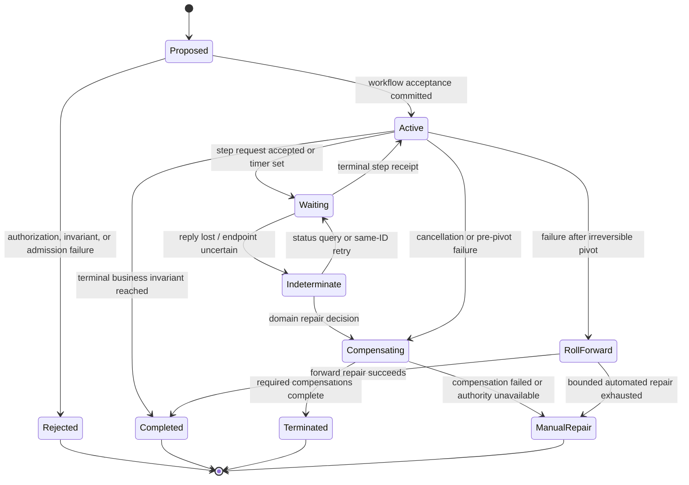

# Workflows, Process Managers, Timers, and Compensation

## Executive decision

Long-running or cross-aggregate business work should be represented by one
**durable process-manager identity per workflow instance**. Its explicit state
machine records accepted responsibility, participants, step generations,
deadlines, timers, receipts, ambiguity, compensation, and terminal business
outcome. A process manager coordinates domain work; it does not enlarge one
aggregate transaction or claim that committed intermediate effects can be
rolled back.

Layer 3 supplies transient actor-lifecycle and timer-delivery mechanisms. Layer
4 supplies durable workflow records, durable-timer scheduling, retry and
application-activation/recovery policy, and outcome storage over those
mechanisms. Layer 5 owns timer meaning, the workflow graph, legal intermediate
states, pivot/irreversibility point, idempotency, cancellation, compensation
meaning, human escalation, and what “complete” means to a user.

## Question and operational standard

The component asks: **how can a business process make bounded progress across
crashes, delays, retries, several aggregates, and nontransactional effects while
remaining semantically honest?**

It succeeds only if:

- accepting responsibility is a durable transition with a stable workflow ID;
- each step has an operation ID, attempt policy, deadline, target generation,
  and queryable outcome;
- waiting is an explicit state, not a blocked aggregate actor turn;
- timeout means “observation did not arrive by a deadline,” not automatic
  proof that the target did nothing;
- timers are generation-bound and late firings are harmless;
- retry and compensation are separate actions with separate authority;
- the irreversible pivot is declared before crossing it;
- cancellation states what can still be stopped and what requires repair;
- mixed code generations retain compatible workflow definitions;
- accepted work cannot disappear during supervisor restart or update; and
- every terminal state includes durable user-visible evidence.

## Evidence and limits

[Workflow Patterns](../../30-sources/van-der-aalst-et-al-2003-workflow-patterns.md)
shows that branching, joining, multiple instances, cancellation, and
synchronization need precise semantics. [Sagas](../../30-sources/garcia-molina-salem-1987-sagas.md)
decompose long work into committed transactions and compensations, explicitly
without full outer isolation. Neither paper supplies capability grants or an
Atom OS actor implementation.

[Durable Functions semantics](../../30-sources/burckhardt-et-al-2021-durable-functions.md)
formalize a replay-backed workflow system under specific determinism
restrictions. [Fault tolerance via
idempotence](../../30-sources/ramalingam-vaswani-2013-fault-tolerance-via-idempotence.md)
connects retries, duplicate requests, and failure-free idempotent composition.
Their platform and store assumptions do not make arbitrary external endpoints
transactional.

## Workflow record

```text
WorkflowRecord {
  workflow_id,
  workflow_type,
  business_tenant_ref | null,
  authenticated_security_realm_binding,
  lifecycle_generation,
  definition_and_code_generation,
  current_state,
  state_revision,
  initiator_and_authority_lineage,
  correlation_id,
  triggering_operation_id,
  participant_domain_refs[],
  active_steps[],
  accepted_step_outcomes[],
  timer_generations[],
  deadlines,
  pivot_state | null,
  compensation_plan_and_state,
  terminal_outcome | null,
  audit_and_retention_class
}
```

Live capabilities are not persisted. The record retains authority intent and
lineage; before a new step or compensation, the workflow asks Layer 4 for a
fresh action facet under current policy. Some already accepted steps may be
allowed to finish after a user's session expires; that choice is an explicit
domain policy, not accidental token caching.

## Step contract

```text
WorkflowStep {
  step_id,
  step_generation,
  target_and_protocol,
  logical_operation_id,
  request_digest,
  precondition_and_expected_revision,
  deadline,
  retry_budget_and_backoff,
  idempotency_and_reconciliation_profile,
  success_outcomes,
  failure_outcomes,
  compensation | none,
  pivot_class: compensable | retryable | irreversible,
  next_state_rules
}
```

An attempt ID distinguishes transport attempts; the logical operation ID stays
constant across retries. Changing payload requires a new logical operation or
an explicit supersession protocol.

## State machine



`ManualRepair` is a durable terminal operational state but may remain an open
business obligation. Its evidence names affected entities, known effects,
unknown effects, available repair facets, and safe next actions without
exposing secrets.

## Timer semantics

Layer 4 provides durable timers; Layer 5 supplies meaning. Each timer carries
workflow ID, state revision, step and timer generation, scheduled logical/wall
time as appropriate, acceptable lateness, and action. On delivery the workflow
rechecks its current state and generation. Duplicate or late timers become
no-ops with evidence.

Time properties are explicit:

- monotonic duration for retry/backoff and local deadlines;
- wall time for human/calendar obligations, with time-zone/rule version;
- no assumption that clocks totally order remote events;
- suspension/reboot behavior and maximum lateness; and
- expiration does not undo an already accepted external request.

## Compensation

A compensation is a new authorized domain operation designed to offset or
repair a prior committed step. It may:

- produce a different visible state rather than erase history;
- be refused because policy or external conditions changed;
- fail, time out, or become indeterminate;
- require the same or stronger human authorization;
- have its own idempotency key and outcome; and
- trigger another compensation or manual repair.

The workflow stores enough old parameters and compatible code/schema to issue
the compensation safely. A generic engine cannot infer that refund reverses
capture, restock reverses shipment, or a published message can be retracted.

## Orchestration versus choreography

| Style | Strength | Risk and policy |
| --- | --- | --- |
| Explicit process manager | one inspectable durable state and decision owner | can become a hotspot; shard by workflow identity and keep no global singleton |
| Pure event choreography | loose coupling and local autonomy | hidden global state machine, hard diagnosis, loops, and incompatible evolution |
| Hybrid | local reactions for simple facts; explicit manager for business obligation | requires clear ownership so both do not drive the same transition |

Atom OS favors explicit process managers for any workflow with money, scarce
resources, irreversible effects, user-visible pending state, or compensation.
Choreography remains suitable for idempotent notifications and projections
whose loss/replay semantics are clear.

## Crash and retry protocol

1. Commit workflow acceptance and first pending step intent.
2. Dispatch through an outbox/adapter using the stable step operation ID.
3. Persist each accepted or terminal receipt before advancing state.
4. On crash, recover workflow record and query any pending operation before
   issuing a new logical effect.
5. If the endpoint supports same-ID retry, resend only within the retry budget.
6. If it cannot distinguish prior execution, enter `Indeterminate` and follow
   the domain repair policy.
7. Advance, compensate, or roll forward through another committed workflow
   transition.

No supervisor restart discards an accepted workflow, resets its attempt count,
or regenerates a logical operation ID.

## Overload and fairness

Budgets include active workflow count, durable bytes, timers, fan-out, attempts,
outbox records, concurrent adapters, age, compensation reserve, and manual-
repair backlog. New workflows reject before acceptance if the system cannot
retain their durable responsibility.

Accepted workflows use deadline/age-aware fair scheduling with tenant quotas.
Recovery and reconciliation have reserved capacity so overload cannot leave
effects permanently unknown. Bulk fan-out is chunked and checkpointed; a
million-child workflow never creates a million simultaneous actors or timers
without admission.

## Update and migration

An in-flight workflow pins or declares compatibility with its definition,
protocol, and compensation code generation. Upgrade choices are:

- finish under retained old code;
- migrate at a named safe state with a tested state transformer;
- hand off through a versioned protocol; or
- quarantine for explicit repair.

Publication of new code does not rewrite past outcomes or reissue external
steps. After the irreversible pivot, rollback of application code cannot imply
rollback of business work.

## Alternatives considered

| Alternative | Decision |
| --- | --- |
| Block aggregate actor until all steps finish | reject; violates responsiveness and creates hidden liveness coupling |
| In-memory coordinator plus supervisor restart | reject for accepted responsibility; state must be durable |
| One global workflow manager | reject; use one logical authority per workflow and partition hosts |
| Retry every timeout | reject; timeout may hide prior completion and retry budget must be finite |
| Compensation equals rollback | reject; compensation is a fallible new effect |
| Event choreography for all business processes | reject where obligation ownership and state become invisible |

## Staged implementation and verification

1. Model a three-step workflow with compensable, retryable, and irreversible
   steps and explicit outcome algebra.
2. Implement durable workflow/timer records using Layer 4 services.
3. Inject crash before and after acceptance, dispatch, target commit, reply,
   receipt commit, timer delivery, pivot, and compensation.
4. Duplicate, reorder, and delay every signal and timer.
5. Lose the external reply while alternately committing and not committing;
   verify the result remains `Indeterminate` until reconciled.
6. Upgrade definitions in every reachable state and test retained old code,
   migration, handoff, and quarantine.
7. Saturate workflow and compensation resources while recovery reserve makes
   bounded progress.

The design is falsified if an accepted workflow disappears, a late timer
changes a new state generation, a retry duplicates a semantic effect, or a
compensation failure is reported as full rollback.

## Connections

- [Applications and domain services layer](../applications-and-domain-services-layer.md)
- [External effects, ports, adapters, and reconciliation](external-effects-ports-adapters-and-reconciliation.md)
- [Durable state, transactions, and outcome recovery](../otp-like-system-services-components/durable-state-transactions-and-outcome-recovery.md)
- [Application evolution, schema compatibility, and migration](application-evolution-schema-compatibility-and-migration.md)

## Sources

- [Workflow Patterns](../../30-sources/van-der-aalst-et-al-2003-workflow-patterns.md)
- [Sagas](../../30-sources/garcia-molina-salem-1987-sagas.md)
- [Durable Functions semantics](../../30-sources/burckhardt-et-al-2021-durable-functions.md)
- [Fault Tolerance via Idempotence](../../30-sources/ramalingam-vaswani-2013-fault-tolerance-via-idempotence.md)
- [Life beyond Distributed Transactions](../../30-sources/helland-2007-life-beyond-distributed-transactions.md)
- [Timing Wheels](../../30-sources/varghese-lauck-1987-timing-wheels.md)
