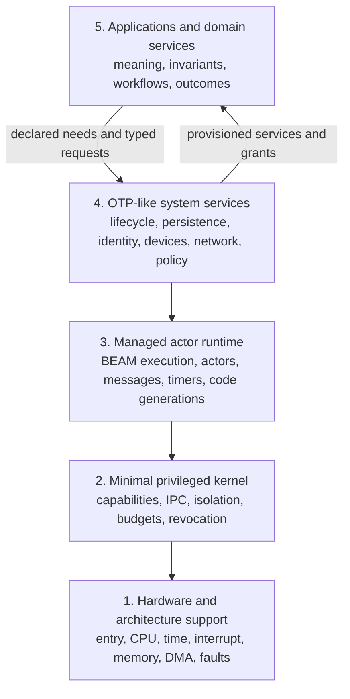
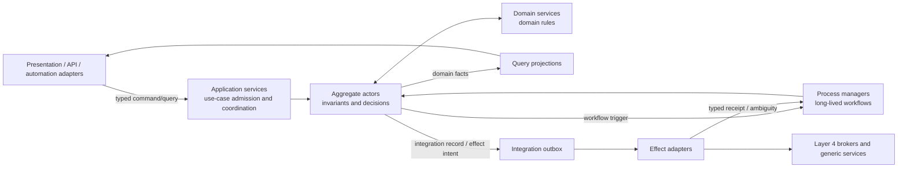
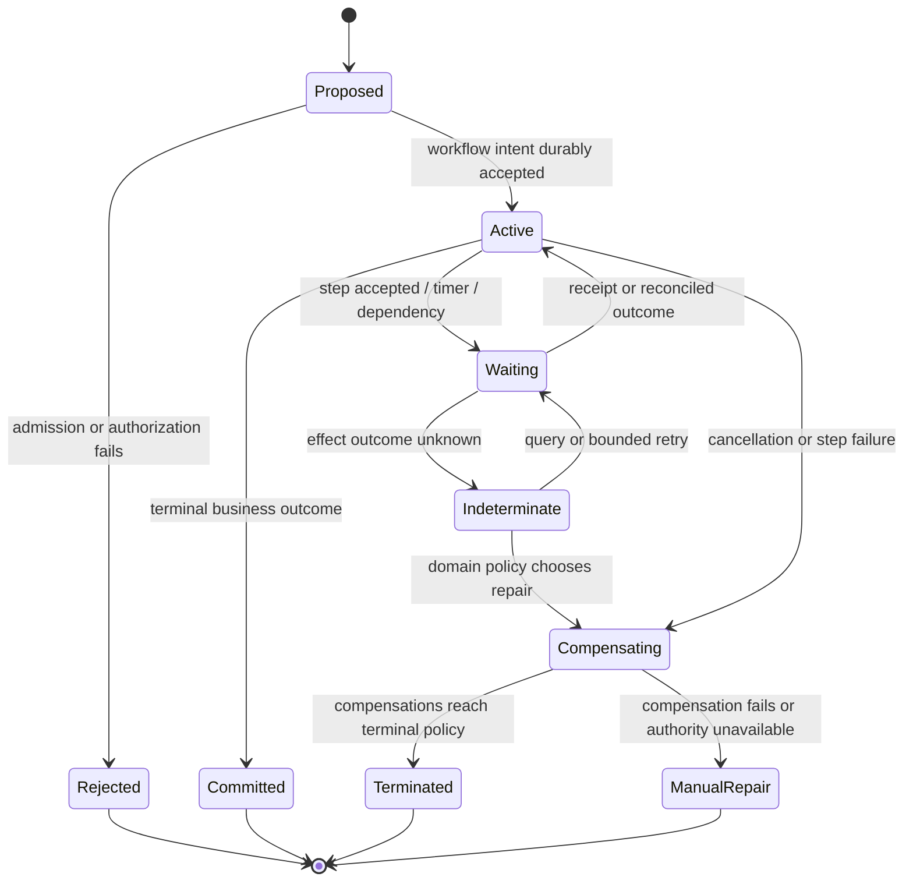

# Applications and Domain Services Layer

## Executive decision

Atom OS Layer 5 should be an **unprivileged application and domain-services
stratum above the four researched foundation layers**. It owns the meaning of
the system's work: bounded contexts, durable domain identities, invariants,
commands, queries, domain events, business workflows, domain-specific external
effects, semantic views, collaboration rules, application compatibility, and
user-visible outcomes. It declares the capabilities, budgets, dependencies,
recovery topology, and lifecycle behavior that this meaning requires.

Layer 5 does **not** mint its own authority, publish itself into discovery,
enforce hard resource limits, implement a second generic durable store, take
over networking or devices, redefine BEAM execution, or treat a supervision
tree as a security boundary. The [OTP-like system services
layer](otp-like-system-services-layer.md) validates and orchestrates
application generations, brokers generic facilities, and records system audit
and durable outcomes. The managed runtime executes actors. The minimal kernel
enforces isolation and authority. The architecture layer supplies hardware
mechanisms.

The central design rule is that six commonly conflated boundaries remain
distinct:

| Boundary | What it controls | What it does not imply |
| --- | --- | --- |
| Bounded context | one domain model and language | one actor, service, package, tenant, or address space |
| Aggregate | one synchronous invariant and transaction boundary | one globally available activation or all workflow state |
| Actor activation | mailbox ordering, serialization, heap, and liveness | durable semantic identity or transactional storage |
| Supervision subtree | restart and escalation policy | confidentiality, integrity, or mutually distrustful isolation |
| Tenant/security binding | relationship between an application-defined business tenant and a Layer 4-authenticated security realm | identical tenant/realm identifiers, one bounded context, or one process |
| Protected domain | kernel-enforced memory, capability, and resource boundary | one actor or one application bundle |

They may coincide in a concrete profile, but only after explicit trust,
invariant, failure, resource, and scaling analysis. An aggregate-per-actor
profile is a strong starting point for many native applications; it is not a
law of DDD or the actor model.

## Question and operational standard

The research asks:

> What architecture lets Atom OS applications express durable domain meaning,
> remain responsive and independently recoverable, use least authority, and
> produce honest outcomes across actor crashes, upgrades, overload, offline
> work, and partial external failure without duplicating lower-layer services?

The proposal succeeds only if:

- domain identity survives actor, node, presentation, and code-generation
  replacement without serializing a PID or bearer capability;
- every invariant names its atomic scope and concurrency policy;
- a lost reply cannot be misreported as a safe failure;
- a committed domain fact, exported integration event, storage log record,
  external-effect intent, telemetry event, and security audit record are never
  silently treated as one thing;
- a desktop, view, adapter, plugin, or application actor may restart without
  corrupting durable domain state or replaying an effect blindly;
- the application declares needed authority and budgets while lower layers
  validate, derive, enforce, revoke, and account them;
- wire decoding, behavioral compatibility, durable-state migration, and
  external-effect reversibility are tested as separate properties;
- overload is finite, deadlines are end-to-end, and the recovery/control path
  retains reserved resources;
- scientific results retain their assumptions, system measurements are not
  transferred to Atom OS, and proposed contracts remain marked unverified; and
- an executable model, property suite, compatibility corpus, and crash/retry
  experiment can falsify every high-consequence guarantee.

## Evidence and its limits

[Evans' DDD reference](../30-sources/evans-2015-domain-driven-design-reference.md)
defines bounded contexts, entities, aggregates, domain services, domain events,
and layered separation. [Parnas](../30-sources/parnas-1972-decomposing-systems-into-modules.md)
supports hiding volatile decisions behind stable modules. Neither work chooses
an actor, supervision, deployment, tenant, or protection boundary. Those are
separate Atom OS decisions.

[Orleans](../30-sources/bernstein-et-al-2014-orleans.md) demonstrates one
practical separation between stable logical actor identity and replaceable
activations. [Helland](../30-sources/helland-2007-life-beyond-distributed-transactions.md)
argues for entity-local transactions and explicit message-mediated work at
scale. These sources do not make one aggregate per actor universally optimal,
establish uniqueness during partition, or turn actor serialization into durable
atomicity.

[Gray](../30-sources/gray-1981-transaction-concept.md), [coordination-
avoidance research](../30-sources/bailis-et-al-2014-coordination-avoidance.md),
[Sagas](../30-sources/garcia-molina-salem-1987-sagas.md), and [durable-function
semantics](../30-sources/burckhardt-et-al-2021-durable-functions.md) establish
useful but differently scoped state and workflow results. [Industry event-
sourcing evidence](../30-sources/overeem-et-al-2021-event-sourced-systems.md)
also records evolution, expertise, projection-rebuild, tooling, and privacy
costs. The synthesis therefore makes event sourcing, CQRS, local-first data,
session types, hot upgrade, and distributed aggregates **opt-in profiles**.

[RIFL](../30-sources/lee-et-al-2015-rifl.md), [fault tolerance via
idempotence](../30-sources/ramalingam-vaswani-2013-fault-tolerance-via-idempotence.md),
classic [RPC](../30-sources/birrell-nelson-1984-remote-procedure-calls.md), and
the [end-to-end argument](../30-sources/saltzer-et-al-1984-end-to-end-arguments.md)
support stable operation identity and endpoint-visible completion. They do not
make a physical device, human institution, payment rail, or arbitrary remote
service participate in one local commit.

The result below is an evidence-backed **architecture proposal**, not an Atom
OS implementation result. No Layer 5 code, storage profile, protocol model,
fault-injection campaign, benchmark, or user study was produced in this
session.

## Position in the five-layer architecture



| Layer | Supplies to Layer 5 | Layer 5 must not claim |
| --- | --- | --- |
| 1. Hardware and architecture | normalized mechanisms for CPU, time, interrupt, MMIO, DMA/IOMMU, reset, ordering, and faults through the lower contracts | direct device ownership or hardware guarantees not exposed above Layer 2/4 |
| 2. Minimal privileged kernel | protected domains, capabilities, IPC, resource accounts, mappings, revocation, teardown, and evidence routes | that an actor name, tenant tag, or supervisor enforces isolation |
| 3. Managed actor runtime | BEAM-compatible actors, mailboxes/signals, reductions, heaps, process-local tracing GC, timers, loader/verifier, code generations, monitors, and native-work ports | that a PID is durable identity, a turn is a disk transaction, or loaded BEAM code is untrusted sandboxed code |
| 4. OTP-like system services | manifest validation, lifecycle, naming, generic persistence, identity/policy, secrets, devices, networking, distribution, updates, admission, overload, telemetry, audit, and operator control | that self-asserted readiness, a local file, raw socket, or self-minted token is sufficient authority |
| 5. Applications and domain services | domain schemas, identities, invariants, use cases, workflows, effects, semantic views, collaboration, compatibility, and business outcomes | lower-layer enforcement or generic infrastructure reimplemented privately |

## Component architecture

| # | Component | Core decision |
| --- | --- | --- |
| 1 | [Application manifest, composition, and authority envelope](applications-and-domain-services-components/application-manifest-composition-and-authority-envelope.md) | A declarative contract and explicit composition root wire recipient-bound terminal or one-shot imports without retaining their union. |
| 2 | [Bounded contexts, domain model, and application services](applications-and-domain-services-components/bounded-contexts-domain-model-and-application-services.md) | Bounded contexts own language; thin application services coordinate use cases; domain services own rules that fit no one aggregate. |
| 3 | [Durable domain identity, aggregate actors, and lifecycle](applications-and-domain-services-components/durable-domain-identity-aggregate-actors-and-lifecycle.md) | Stable `DomainRef` is independent of transient actor activation; an aggregate actor is the baseline serialization profile. |
| 4 | [Typed commands, queries, events, and protocol contracts](applications-and-domain-services-components/typed-commands-queries-events-and-protocol-contracts.md) | Protocols carry versions, generations, deadlines, authority, operation identity, and typed outcomes; compatibility is behavioral. |
| 5 | [Invariants, transactions, and concurrency policy](applications-and-domain-services-components/invariants-transactions-and-concurrency-policy.md) | The invariant determines atomic scope and coordination; coordination freedom requires evidence. |
| 6 | [Durable state, journals, snapshots, and projections](applications-and-domain-services-components/durable-state-journals-snapshots-and-projections.md) | Current-state and event-sourced persistence are selectable profiles with explicit replay, retention, privacy, and projection rules. |
| 7 | [Workflows, process managers, timers, and compensation](applications-and-domain-services-components/workflows-process-managers-timers-and-compensation.md) | Long work has durable process identity, explicit steps, timers, outcomes, pivots, and fallible compensation. |
| 8 | [External effects, ports, adapters, and reconciliation](applications-and-domain-services-components/external-effects-ports-adapters-and-reconciliation.md) | Every effect crosses a typed port that exposes partial failure; outbox is committed intent, not remote completion. |
| 9 | [Presentation sessions, semantic views, and user outcomes](applications-and-domain-services-components/presentation-sessions-semantic-views-and-user-outcomes.md) | Domain/model truth survives disposable visual and nonvisual presentations; user actions return as typed commands. |
| 10 | [Offline collaboration, replication, and conflict semantics](applications-and-domain-services-components/offline-collaboration-replication-and-conflict-semantics.md) | Convergence, intent, invariants, authorization, and effects are separately specified per datatype. |
| 11 | [Extension points, plugins, and live-tooling confinement](applications-and-domain-services-components/extension-points-plugins-and-live-tooling-confinement.md) | Extensions receive explicit imports and budgets; untrusted or native code crosses a protected-domain boundary. |
| 12 | [Application evolution, schema compatibility, and migration](applications-and-domain-services-components/application-evolution-schema-compatibility-and-migration.md) | Immutable generations and compatible intermediate states precede publication; rollback stops at durable/effect irreversibility. |
| 13 | [Semantic observability, testing, and assurance](applications-and-domain-services-components/semantic-observability-testing-and-assurance.md) | User-relevant SLIs, executable models, properties, deterministic schedules, and faults test meaning; telemetry is not audit truth. |
| 14 | [Cross-layer placement, tenancy, overload, and recovery topology](applications-and-domain-services-components/cross-layer-placement-tenancy-overload-and-recovery-topology.md) | Layer 5 declares topology and semantic degradation while Layers 2–4 enforce isolation, budgets, lifecycle, and recovery. |

## Internal application topology



The arrows are protocol dependencies, never ambient access. Application
services do not contain business invariants. Domain services do not become a
miscellaneous infrastructure layer. Adapters do not gain the union of every
capability merely because they sit at an edge.

## Canonical identities and generations

### Durable domain reference

```text
DomainRef {
  bounded_context_id,
  business_tenant_ref | null,
  entity_type_id,
  entity_key,
  lifecycle_generation
}
```

`DomainRef` is durable and contains no live authority or mutable security-realm
assignment. Each invocation separately carries a Layer 4-authenticated
`security_realm_binding_id` and binding generation; a realm or isolation
migration therefore fences access without destroying the domain identity.
Resolution yields a short-lived route such as:

```text
DomainRoute {
  domain_ref,
  activation_incarnation,
  runtime_incarnation,
  service_generation,
  protocol_version,
  route_expiry
}
```

Invocation additionally requires an authorized facet. The resolver may locate
a current activation; it cannot grant an operation the caller was not already
allowed to request. Persistent records may retain authority **intent**, policy
revision, subject/object references, and delegation lineage, but never a
reusable live bearer capability.

### Other identities kept separate

| Identity | Lifetime and use |
| --- | --- |
| Application ID + generation | installed immutable artifact and one admitted running generation |
| Bounded-context ID + model version | semantic vocabulary and compatibility scope |
| Aggregate/domain reference | business identity across activations |
| PID/actor reference | one runtime incarnation and route |
| Operation ID | one logical command/effect across retries |
| Workflow ID + generation | one long-running business process |
| Event ID + stream position | one committed fact and its persistence order |
| Projection ID + frontier | one derived observation and known freshness |
| View/session generation | disposable presentation conversation |
| Capability selector/facet | live invocation authority, never domain identity |
| Business tenant reference | Layer 5 domain identity such as an organization or account; it grants no authority |
| Authenticated security realm/binding | Layer 4 identity, policy, data, authority, and accounting scope bound to the application tenant |

## Command and outcome contract

```text
CommandEnvelope<T> {
  protocol_id,
  protocol_version,
  command_kind,
  target: DomainRef,
  security_realm_binding_id,
  security_realm_binding_generation,
  operation_id,
  request_digest,
  expected_revision | null,
  deadline,
  cancellation_ref | null,
  authority_facet,
  policy_and_revocation_epoch,
  causation_id | null,
  correlation_id | null,
  trace_context | null,
  payload: T
}
```

The trace context is untrusted correlation data, not identity or authority.
Layer 4 authenticates the realm binding separately from the Layer 5 business-
tenant designation in `DomainRef`. The request digest prevents one operation ID
from naming multiple payloads.
The expected revision expresses optimistic concurrency, not a promise that the
sender owns the target. A deadline limits usefulness and admitted work; it does
not roll back an effect that already committed.

The common outcome vocabulary is:

| Outcome | Meaning |
| --- | --- |
| `RejectedBeforeAdmission(reason)` | the operation did not enter the domain transaction/effect protocol |
| `ExpiredBeforeAdmission(evidence)` | the deadline elapsed and the endpoint proves that no operation-specific responsibility was admitted |
| `Fenced(generation_evidence)` | target, authority, route, or lease generation is stale |
| `AcceptedPending(operation_id)` | responsibility is durable but no terminal semantic outcome exists yet |
| `Committed(receipt, revision_evidence)` | the named semantic commit is durably established within its stated scope |
| `NotCommitted(evidence)` | the endpoint can prove the named operation did not commit |
| `Terminated(reason, compensation_state)` | a workflow or use case ended under an explicit domain rule; prior visible steps are described honestly |
| `Indeterminate(operation_id, reconciliation_route)` | the caller cannot yet establish committed versus not committed |

`Indeterminate` is a first-class success/failure alternative, not an internal
exception to convert into `NotCommitted`. Human text can accompany every
result but machine behavior branches only on stable typed codes.

Deadline state is orthogonal after admission: an accepted operation whose
deadline later elapses remains `AcceptedPending` or becomes `Indeterminate`
until terminal evidence is available, with `deadline_status: elapsed` carried
as metadata. Layer 4's effect-level `Aborted` means proof that the named effect
did not commit and maps to Layer 5 `NotCommitted` only when the scopes are
identical. Layer 5 `Terminated` is a business/workflow result and never implies
that earlier visible effects did not occur.

## Domain decision and commit unit

The preferred invariant-critical core is deterministic and non-reentrant:

```text
decide(current_state, validated_command) ->
    reject(domain_reason)
  | accept(new_state, domain_events, effect_intents, obligations)
```

Where one transactional substrate participates, commit the following atomically:

```text
AggregateCommit {
  aggregate_ref,
  previous_revision,
  next_revision,
  persisted_state_or_events,
  operation_id,
  request_digest,
  durable_outcome,
  unpublished_integration_records,
  newly_scheduled_workflow_records
}
```

The application owns the fields' meaning; Layer 4 owns the generic commit,
recovery, retention, quota, and durable-outcome mechanism. Any external sink
outside that transaction receives an intent later and must reconcile by stable
ID.

## Event taxonomy

| Record | Authoritative for | Not proof of |
| --- | --- | --- |
| Domain event | a fact committed under one bounded context's rules | export, delivery, audit retention, or external completion |
| Integration event | a versioned statement intentionally exported across a context boundary | the receiver's action or outcome |
| WAL/storage record | lower-level commit and recovery mechanics | business meaning merely because it was logged |
| Effect intent | durable responsibility to attempt/reconcile an adapter operation | the external effect having completed |
| Telemetry event/span | operational observation and correlation | completeness, nonrepudiation, or domain commit |
| Security audit record | policy/accountability evidence under the audit contract | user-visible business success by itself |

This distinction prevents “event-driven” from collapsing storage, messaging,
effects, observability, and accountability into one untestable bus.

## Choosing consistency from invariants

1. State every invariant in domain terms and identify all state it quantifies.
2. Choose the smallest atomic boundary that can decide it synchronously.
3. Use one non-reentrant aggregate decision and serializable local commit by
   default for non-mergeable invariants.
4. If availability or offline work matters, test whether every concurrent pair
   of valid operations can merge to another valid state under the exact
   invariant and merge procedure.
5. Use escrow/bounded counters, leases/fences, a single writer, or consensus
   for scarce or exclusive claims as required.
6. Move cross-aggregate work into a visible process manager with intermediate
   outcomes; do not silently enlarge a “local” transaction across actors.
7. Re-evaluate the proof when authorization, schema, or domain rules change.

Actor turn serialization prevents two ordinary handlers in one activation
from interleaving. It does not prove crash atomicity, uniqueness under
partition, durable deduplication, serializable reads across aggregates, or
external exactly-once effects. Snapshot isolation likewise does not establish
all invariants. CRDT convergence proves neither user intent nor authority.

## Persistence profiles

| Profile | Appropriate when | Required contract | Principal cost/risk |
| --- | --- | --- | --- |
| Current-state record | current value and ordinary audit are sufficient | revision, checksum, schema generation, durable outcome, backup/recovery | less intrinsic temporal reconstruction |
| State + domain change log | selected history is useful | atomic state/change association, retention and privacy policy | two representations can diverge if not one commit |
| Event-sourced aggregate | history/replay/multiple projections justify it | immutable event schema, reducer determinism, replay fixtures, snapshots, projection frontiers, upcasters, pruning/erasure policy | evolution, expertise, rebuild, tooling, privacy, history growth |
| Replicated operation set / CRDT | offline collaboration and merge semantics are demonstrable | operation identity, causal context, authorization, deterministic interpretation, tombstone/GC policy | convergence can still violate intent or invariants |

Snapshots record aggregate identity, included event position, schema and code
generation, checksum, and creation outcome. Normally they are disposable
accelerators: recover the newest valid snapshot and replay following events.
Promoting a snapshot to the sole authority requires an explicit, auditable
event-pruning and privacy policy.

## Workflow model



One durable workflow identity owns current state, definition/code generation,
correlation and causation IDs, participants, accepted step outcomes, deadlines,
timer generations, compensation plan, required authority, and terminal
evidence. A “central” process manager means one authority for this workflow,
not a global singleton for every application.

A compensation is a new effect that may fail and may require new authority. It
does not reverse history, guarantee isolation from observers, or recreate a
database rollback. An irreversible pivot is declared before execution and
changes cancellation, update, and rollback policy.

## External-effect protocol

Every adapter contract declares:

- whether the endpoint is local, protected-domain, node-remote, human, or
  institution-remote;
- admission, acceptance, commit, and observation points;
- stable operation ID and request digest behavior;
- deadline and cancellation semantics;
- ordering, duplicate, concurrency, and backpressure behavior;
- lease/fence and target generation;
- which receipts are durable and who signs or attests them;
- how to query a previous operation after a lost reply;
- compensation or reconciliation behavior;
- retry and retention windows; and
- conditions producing `NotCommitted` versus `Indeterminate`.

A transactional outbox commits state and **intent to export** together. The
relay may deliver more than once; the receiver needs a durable inbox or
equivalent idempotent operation protocol. If the external sink cannot accept
and later query the same stable operation ID, exactly-once external effect is
not claimed.

## Presentation contract

The durable application model is independent of a window, toolkit, desktop,
accessibility bridge, voice session, or remote client. A view opens with:

```text
OpenView {
  domain_scope,
  projection_kind,
  caller_authority,
  locale_and_accessibility_profile,
  requested_frontier,
  session_generation,
  resource_budget
}
```

The publisher returns a complete typed snapshot and then revisioned deltas.
On any gap or stale generation the consumer requests a fresh snapshot. A
presentation-originated action carries the logical target, action kind,
observed revision/frontier, view and policy generations, a broker-issued
client-action ID, and an appropriately scoped user grant. Renderer state and
focus never become proof that a domain effect committed.

The disposable presentation does not originate the only recovery key. The
Layer 5 admission boundary atomically binds the client-action ID and request
digest to a durable operation ID before effectful dispatch. Fresh authorized
snapshots include relevant unresolved operations, allowing a replacement view
to reconcile a lost admission reply without replaying raw input.

This contract carries forward the [visual-computing
synthesis](alan-kay-smalltalk-visual-interface-and-modern-desktop.md): visual,
accessible, textual, voice, automation, and remote projections can differ
structurally while acting on the same typed semantic objects and domain
outcomes.

## Collaboration policy

Every collaborative type declares one of these profiles:

| Profile | Examples of fit | Offline rule |
| --- | --- | --- |
| Mergeable/coordination-free | sets, text, annotations, or counters with proved merge semantics | accept authorized operations and merge with declared intent policy |
| Escrow or bounded | quotas, reservations, inventory partitions | accept only within locally delegated rights; reconcile lineage |
| Single-writer or leased | one authoritative state machine at a time | queue proposals or operate only under a current fenced lease |
| Consensus-mediated | unique naming, leadership, globally exclusive claims | read cached state if policy allows; do not claim commit while offline |
| Non-replicable external effect | payment, actuator command, irreversible publication | store a proposal/intent; execute after online authorization and reconciliation |

Offline authority includes subject, action, object scope, epoch, expiry,
delegation lineage, and maximum effect. Reconnection first validates policy and
revocation state, then integrates permitted operations. A convergent operation
from revoked authority is not automatically acceptable merely because the CRDT
can merge it.

## Extension and live-tool policy

| Extension class | Default placement | Imports |
| --- | --- | --- |
| Pure trusted domain rule | same actor/module where bounded and reviewed | immutable values and pure functions only |
| Trusted application callback | separate supervised actor subtree | explicit typed facets, deadline, heap/mailbox/reduction budgets |
| Untrusted BEAM extension | separately supervised protected runtime domain | narrow versioned capability handles; no ambient registry or code loading |
| WASI or other portable module | optional isolated extension host/domain | explicit host functions and resource handles only |
| Native/GPU/parser extension | dedicated protected domain and native-work path | minimum buffers, queues, device/service facets, revocation and teardown |
| Live inspector/editor | separate tool domain | redacted snapshots, staging, validation, publication facets kept distinct |

Inspection, tracing, pure evaluation, staging, migration, publication, secret
access, and external effect are different powers. No generic “debug” or
“plugin” capability should combine them. Loading code into an ordinary trusted
BEAM runtime does not itself sandbox hostile code.

## Evolution and compatibility

Each immutable application generation declares a matrix covering:

- artifact and BEAM/OTP compatibility profile;
- provided and required port versions;
- command, query, event, outcome, and projection schemas;
- behavioral invariants and old/new participant combinations;
- durable state/event/snapshot reader and writer generations;
- workflow definitions and retained code needed by in-flight instances;
- adapter and external protocol compatibility;
- migration phases, checkpoints, validation, and irreversible boundary; and
- roll-forward, rollback, drain, and quarantine policy.

```mermaid
stateDiagram-v2
    [*] --> Parsed
    Parsed --> Rejected: invalid artifact, graph, authority, or matrix
    Parsed --> Prepared: private actors, adapters, state shadow, tests
    Prepared --> Rejected: readiness or compatibility evidence fails
    Prepared --> Canary: bounded traffic and shadow validation
    Canary --> Rejected: semantic SLO or invariant failure
    Canary --> QuiescingOld: close old admission for controlled cutover
    QuiescingOld --> Canary: handoff fails; reopen old admission
    QuiescingOld --> Published: accepted writers terminal/handed off; atomically advance writer fence and route
    Published --> DrainingOld: old non-writing cleanup drains
    DrainingOld --> Retired: workflows handed off or completed
    DrainingOld --> RolledBack: rollback preconditions remain true
    DrainingOld --> RollForwardRepair: irreversible boundary crossed
    DrainingOld --> Quarantined: no safe automatic recovery
    Published --> RollForwardRepair: irreversible state/effects crossed
    Published --> RolledBack: old readers and reverse state path remain valid
    Retired --> [*]
    Rejected --> [*]
    RolledBack --> [*]
    RollForwardRepair --> [*]
    Quarantined --> [*]
```



Wire-safe changes can still break business rules. Semantic version labels are
communication metadata, not proof. Hot in-place actor conversion is reserved
for cases with an audited safe point and explicit state transformer; the
default is private new generation, atomic publication by Layer 4, drain, and
retirement.

## Semantic observability and assurance

Applications define indicators at the domain boundary:

- committed-correct outcome rate, separately from transport success;
- pre-admission expiry, accepted-with-elapsed-deadline, fence, termination,
  not-committed, and indeterminate rates by command class;
- admission-to-commit and acceptance-to-terminal latency distributions;
- projection frontier/freshness and resynchronization rate;
- workflow age, timer lateness, compensation, and manual-repair backlog;
- outbox, inbox, and external reconciliation lag;
- tenant-isolation and authorization-denial signals without exposing secrets;
- time spent degraded and fidelity of promised degraded behavior; and
- migration compatibility failures and stale-generation attempts.

Layer 4 may sample, aggregate, export, and alarm on bounded telemetry. It also
holds the separate durable outcome and security-audit services. Trace IDs are
untrusted correlation, never authorization. Missing spans cannot negate a
commit receipt.

The minimum assurance bundle per component is:

1. state-machine or protocol model with explicit safety and liveness claims;
2. property generators, state/history shrinkers, and reference model;
3. deterministic scheduler, time, randomness, message, and retry controls;
4. crash and power-loss injection at every persistence/effect transition;
5. duplicate, loss, reorder, partition, late reply, stale generation, and
   revocation scenarios;
6. old/new wire, state, event, workflow, and projection compatibility corpus;
7. authorization noninterference and least-authority tests;
8. overload experiments including protected control/recovery reserves; and
9. production telemetry assertions that are never treated as formal proof.

## Overload and recovery

Layer 5 chooses semantic admission and graceful degradation: which command
classes may be rejected, which projections may lag, which features become
read-only, which workflows pause, and which effects must never be shed after
acceptance. Layer 4 enforces queue, CPU, heap, mailbox, persistent-byte, I/O,
timer, and telemetry budgets using the lower mechanisms.

Priority ordering is generally:

1. revocation, fencing, audit/outcome commit, and recovery control;
2. accepted invariant-preserving commits and effect reconciliation;
3. interactive commands before their deadlines;
4. workflow progress and projection maintenance;
5. speculative prefetch, rebuild, analytics, and cosmetic presentation.

No accepted operation is silently dropped. If resources cannot retain its
responsibility, it was not accepted. A crashed application is recovered by an
authority holder outside its subtree; durable identities resolve to new
activations, stale routes and grants fail closed, and external operations are
queried by operation ID before retry.

## Security invariants

- Names and `DomainRef` values designate; only live validated capabilities
  authorize.
- Applications define typed resources and actions but cannot mint identities,
  roles, administrator status, or trusted user gestures.
- Persistent state contains no reusable live capability, secret plaintext,
  focus token, surface lease, PID, or native pointer.
- Application services receive only the facets needed by one use case; domain
  rules cannot reach ambient filesystem, network, registry, device, secrets,
  debugger, or update authority.
- Every request binds the application business-tenant reference to a Layer
  4-authenticated security-realm binding, target generation, policy epoch,
  deadline, and operation ID at the effect sink.
- Supervision is recovery policy, not a protection proof.
- Adapters, plugins, parsers, renderers, and native code are isolated according
  to risk and do not inherit the composition root's full authority.
- Compensation and migration use fresh explicit authority and are audited as
  new effects.
- Telemetry is redacted and bounded; durable audit and outcome evidence follow
  their own protected paths.

## Staged implementation program

1. **Protocol model.** Implement `DomainRef`, command/outcome vocabulary,
   aggregate commit, workflow, adapter, and generation models in a deterministic
   simulator before integrating devices or remote services.
2. **One bounded context.** Build current-state persistence, one aggregate actor,
   one query projection, and one application service with no external effect.
3. **Crash-safe outcome.** Atomically retain state revision, operation result,
   and outbox intent; crash at every write boundary and reconcile every retry.
4. **Workflow and adapter.** Add a nonparticipating mock endpoint that loses
   replies, duplicates requests, delays receipts, and returns indeterminate
   outcomes; test compensation and manual repair.
5. **Presentation restart.** Attach two independent projections, restart the
   desktop/view subtree repeatedly, and prove the domain actor and accepted
   operations remain correct.
6. **Collaboration profile.** Add one mergeable datatype and one scarce claim;
   demonstrate why they need different offline policies.
7. **Protected extensions.** Compare trusted BEAM callback, isolated BEAM
   domain, and WASI/native host for authority, latency, failure, and resource
   containment.
8. **Evolution.** Run old/new protocol and state generations concurrently,
   stage a migration, cross an irreversible effect, and verify rollback is
   refused afterward.
9. **Tenant and overload.** Attack one tenant and saturate every account while
   measuring invariant commits, interactive deadlines, outcome/audit paths,
   and recovery reserve.
10. **Second platform.** Repeat on another architecture or host profile and
    record which behavior came from Atom OS versus the prototype host.

## Required falsification experiments

- Reuse PIDs, actor addresses, operation IDs with altered payloads, routes,
  view sessions, workflow timers, and capability slots after restart.
- Crash before and after command admission, state/event write, outcome write,
  outbox write, relay, external acceptance, reply, acknowledgement, snapshot,
  projection checkpoint, migration checkpoint, publication, and drain.
- Partition competing aggregate activations and prove the configured lease/
  fence or consensus profile prevents duplicate authoritative effects.
- Mutate each declared invariant and verify property generators and the model
  find a counterexample; missing invariants are research defects.
- Feed old, new, malformed, unknown-critical, and unknown-optional messages
  through every mixed-version edge.
- Revoke offline and plugin grants, then reconnect stale work; convergence must
  not bypass authorization.
- Exhaust ordinary and tenant-specific budgets while the audit/outcome,
  revocation, reconciliation, and recovery paths remain within their reserved
  ceilings.
- Restart the compositor, presentation session, query projection, aggregate
  actor, adapter, Layer 4 service, and full application generation separately;
  compare the observed recovery group with the manifest.

The architecture is falsified if correct application operation requires
serializing a PID or live capability; if a transport acknowledgement is used
as business commit proof; if outbox is called exactly-once external execution;
if compensation is described as rollback; if all contexts are forced into
event sourcing or CRDTs; if a plugin receives ambient authority; if presentation
restart necessarily restarts domain truth; or if Layer 5 can publish, resource,
or authorize itself without lower-layer mediation.

## Open questions

- Which storage profile can atomically commit aggregate revision, durable
  outcome, outbox records, and new workflow records on the first Atom OS target?
- What actor-host design best balances one-aggregate serialization, heap
  overhead, locality, migration, and protected-domain count?
- Which critical protocols justify session types or model checking, and what
  is the runtime monitoring cost during mixed-version upgrades?
- How should immutable histories support erasure, cryptographic deletion,
  legal hold, provenance, and projection repair without dishonest audit claims?
- Which external endpoints can participate in stable operation-ID queries,
  and which require operator-visible `Indeterminate` repair?
- What offline authorization and tombstone collection policy remains correct
  across long disconnection and revocation?
- How should tenant boundaries map to protected domains on constrained targets
  without abandoning cheap actors?
- What compatibility profile and conformance suite precisely defines supported
  BEAM bytecode and OTP behavior for application bundles?

These remain open because the sources establish principles and precedents, not
an evaluated Atom OS application platform.

## Connections

- [BEAM, ERTS, and OTP principles for a new operating system](beam-erts-and-otp-principles-for-a-new-operating-system.md) —
  defines the five-layer decomposition this report completes.
- [OTP-like system services layer](otp-like-system-services-layer.md) —
  supplies generic service policy and lifecycle below applications.
- [Managed actor runtime layer](managed-actor-runtime-layer.md) —
  supplies BEAM-compatible execution and actor mechanics.
- [Minimal privileged kernel layer](minimal-privileged-kernel-layer.md) —
  supplies generic protection and authority enforcement.
- [Kernel hardware and architecture support layer](kernel-hardware-and-architecture-support-layer.md) —
  supplies architecture mechanisms without domain policy.
- [Authentication and authorization across the five-layer architecture](authentication-and-authorization-across-the-five-layer-architecture.md) —
  defines the identity, policy, grant, revocation, and trusted-interaction
  services applications consume.
- [Alan Kay, Smalltalk, and modern visual interfaces](alan-kay-smalltalk-visual-interface-and-modern-desktop.md) —
  supplies the persistent-model and disposable-presentation synthesis used by
  the presentation component.
- [Applications and domain services inquiry](../40-inquiries/how-should-atom-os-structure-applications-and-domain-services.md) —
  tracks the unresolved implementation and evidence questions.

## Sources

- [Domain-Driven Design Reference](../30-sources/evans-2015-domain-driven-design-reference.md)
- [On the Criteria To Be Used in Decomposing Systems into Modules](../30-sources/parnas-1972-decomposing-systems-into-modules.md)
- [Statecharts](../30-sources/harel-1987-statecharts.md)
- [Orleans](../30-sources/bernstein-et-al-2014-orleans.md)
- [Typestate](../30-sources/strom-yemini-1986-typestate.md)
- [Multiparty Asynchronous Session Types](../30-sources/honda-et-al-2008-multiparty-asynchronous-session-types.md)
- [A Behavioral Notion of Subtyping](../30-sources/liskov-wing-1994-behavioral-subtyping.md)
- [Protocol Buffers evolution guidance](../30-sources/google-2026-protocol-buffers-evolution.md)
- [Maintaining Robust Protocols](../30-sources/thomson-schinazi-2023-maintaining-robust-protocols.md)
- [The Transaction Concept](../30-sources/gray-1981-transaction-concept.md)
- [Coordination Avoidance](../30-sources/bailis-et-al-2014-coordination-avoidance.md)
- [Life beyond Distributed Transactions](../30-sources/helland-2007-life-beyond-distributed-transactions.md)
- [Event-sourced systems and schema evolution](../30-sources/overeem-et-al-2021-event-sourced-systems.md)
- [Workflow Patterns](../30-sources/van-der-aalst-et-al-2003-workflow-patterns.md)
- [Durable Functions semantics](../30-sources/burckhardt-et-al-2021-durable-functions.md)
- [Fault Tolerance via Idempotence](../30-sources/ramalingam-vaswani-2013-fault-tolerance-via-idempotence.md)
- [Hexagonal Architecture](../30-sources/cockburn-2005-hexagonal-architecture.md)
- [A Note on Distributed Computing](../30-sources/waldo-et-al-1994-distributed-computing.md)
- [Transactional Outbox](../30-sources/richardson-2026-transactional-outbox.md)
- [Managing Update Conflicts in Bayou](../30-sources/terry-et-al-1995-bayou-conflicts.md)
- [Conflict-Free Replicated Data Types](../30-sources/shapiro-et-al-2011-conflict-free-replicated-data-types.md)
- [OpSets](../30-sources/kleppmann-et-al-2018-opsets.md)
- [Local-First Software](../30-sources/kleppmann-et-al-2019-local-first-software.md)
- [Asynchronous FRP for GUIs](../30-sources/czaplicki-chong-2013-asynchronous-frp-guis.md)
- [WASI Design Principles](../30-sources/wasi-project-2026-design-principles.md)
- [Wedge](../30-sources/bittau-et-al-2008-wedge.md)
- [Online Schema Change in F1](../30-sources/rae-et-al-2013-online-schema-change-f1.md)
- [QuickCheck](../30-sources/claessen-hughes-2000-quickcheck.md)
- [How AWS Uses Formal Methods](../30-sources/newcombe-et-al-2015-aws-formal-methods.md)
- [Service Level Objectives](../30-sources/jones-et-al-2016-service-level-objectives.md)
- [Architectural Concerns in Multi-Tenant SaaS Applications](../30-sources/krebs-et-al-2012-multi-tenant-saas.md)
