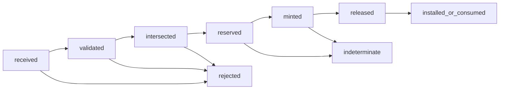

# Grant compiler and issuer

The recommended component is a **narrow decision-to-authority transformer
whose maximum output is fixed before it evaluates a request**. It accepts one
authenticated explicit permit, intersects it with a target-specific issuer
envelope and an already held parent capability, and derives a short-lived local
capability or sender-constrained remote grant. It cannot edit policy or invoke
the protected effect.

This is component 9 of the [authentication and authorization service
set](README.md). The core invariant is:

```text
effective authority =
    kernel parent-capability envelope
  ∩ issuer envelope
  ∩ authenticated PDP permit
  ∩ current policy/relation/attribute/session/epoch state
  ∩ resource-local enforcement constraints
```

No outage, malformed response, retry, or compromise outside an already held
envelope may enlarge that intersection.

## Question, scope, and operational standard

> How can Atom compile rich policy into usable authority without creating a
> universal mint, a confused deputy, replayable bearer token, or a crash window
> in which issuance and lineage accounting disagree?

Acceptance requires:

- every issuer is partitioned by realm and target class and holds only a
  kernel-enforced derive-only parent facet or narrow signing-key facet;
- the envelope fixes objects/classes, actions, maximum lifetime, delegation
  depth, audience, assurance, quota/budget, and revocation scope;
- a child grant is a monotonic subset of parent, envelope, and permit along
  every authority dimension;
- grant fields bind subject, current actor, bounded delegation lineage, exact
  audience/resource generation/action/request, input epochs, proof key,
  idempotency, lifetime, budget, and obligations;
- required issuance/lineage/audit reservation is durable before a grant is
  released;
- retries return the same logical grant and never promise exactly-once external
  effect;
- local grants are unforgeable capability handles rather than serialized
  bearer bytes; and
- remote exchange terminates at a target gateway that performs a fresh local
  decision and capability derivation.

## Evidence and synthesis

[Capability Myths
Demolished](../../30-sources/miller-et-al-2003-capability-myths.md) clarifies
designation-plus-authority, attenuation, confinement, confused deputies, and
revocation by indirection. The [seL4 reference
manual](../../30-sources/sel4-foundation-2026-reference-manual.md) supplies a
concrete capability-space, mint/copy attenuation, derivation, revoke, and
single-use reply precedent; Atom inherits none of seL4's proof automatically.

[Macaroons](../../30-sources/birgisson-et-al-2014-macaroons.md) demonstrate
monotonic caveat attenuation and third-party discharge, but their baseline is
bearer and a verifier with the HMAC root can mint. [OAuth token
exchange](../../30-sources/jones-et-al-2020-oauth-token-exchange.md) preserves
subject versus actor and distinguishes delegation from impersonation, while
leaving token security and trust profiles open. [Mutual-TLS token
binding](../../30-sources/campbell-et-al-2020-oauth-mutual-tls.md) and
[DPoP](../../30-sources/fett-et-al-2023-dpop.md) provide complementary sender-
constraint precedents and expose target, proxy, replay, and canonicalization
obligations.

The exact Atom grant algebra, durable protocol, and capability ABI are
proposals requiring a model and implementation evidence.

## Authority boundary and partitioning

Each issuer holds:

- one scoped kernel-enforced derivation facet whose only operation mints a
  subset capability and cannot invoke the target, or one protected remote-
  signing key facet;
- a static, signed issuer envelope and current epoch snapshot;
- an authenticated channel from one PDP class;
- durable grant ID/lineage/idempotency reservation; and
- audit-append authority.

It holds no ordinary resource-operation capability, policy/relationship/
attribute write right, credential/recovery root, arbitrary target namespace,
resource invocation capability, or raw key.
Separate issuers serve device control, storage, process launch, network,
administration, recovery, and federation. Compromise can deny or misuse only
authority inside that issuer's preinstalled envelope.

## Grant model

```text
Grant {
    grant_id_and_generation,
    issuer_and_envelope_revision,
    subject,
    current_actor,
    bounded_subject_actor_lineage,
    audience_and_target_endpoint,
    resource_id_generation_and_expected_version,
    action_and_bounded_parameters_or_request_digest,
    policy_relation_attribute_session_boot_epochs,
    not_before_and_expiry,
    proof_of_possession_confirmation,
    parent_lineage_and_delegation_budget,
    CPU_memory_IO_rate_and_use_budgets,
    idempotency_or_one_shot_nonce,
    obligations,
    revocation_anchor,
}
```

Subject is the principal on whose behalf work originated; actor is the current
workload exercising authority. Neither authorizes by itself. Lineage is
bounded, integrity-protected provenance for policy and audit, not an ambient
chain of all identities ever seen.

Multi-resource or multi-audience scopes are normalized into separate grants
unless the target operation is intrinsically atomic. This prevents a Cartesian
product of audiences and actions from producing unintended combinations.

## Issuance state machine



Before `reserved`, the issuer loads its preinstalled envelope internally and
verifies PDP authenticity, explicit permit, request digest, all snapshot
revisions/expiries, envelope, parent capability, target profile, proof key, and
obligation support. A caller may assert only the envelope revision it expects;
it cannot supply or widen the envelope. The durable reservation records grant
ID, decision digest, lineage, idempotency, and audit intent.

Local minting asks Layer 2 to derive an attenuated capability from the held
parent. Remote minting creates a target-specific short-lived token bound to a
key and sends it only to the federation gateway. The target resource/gateway
validates the exact request and epochs in the same admission transaction as
the effect or one-shot consumption.

A crash after reservation but before release yields `indeterminate` until
reconciliation. A retry with the same idempotency key returns the same grant or
terminal state; it never creates a second budget/one-shot branch.

## Delegation and remote exchange

A delegated child repeats the intersection against its parent and decrements
depth/use/budget ceilings. A third-party caveat/discharge, if supported, is an
additional constraint and cannot replace audience, generation, expiry, PoP,
or revocation binding.

Remote OAuth/SPIFFE compatibility is confined to a gateway. Token exchange
keeps subject and actor distinct and prefers delegation over impersonation.
Mutual TLS or DPoP demonstrates key possession but does not by itself authorize
the request. DPoP does not bind a body, so Atom's profile includes the canonical
operation digest as a separate required claim/obligation.

## OTP-like protocol and supervision

```text
compile(decision_handle, expected_envelope_revision, target_profile,
        idempotency, deadline)
  -> {ok, grant_handle} | {indeterminate, reconciliation_ref} | typed_error
attenuate(parent_grant, constraints, delegatee_binding)
  -> child_grant | typed_error
status(grant_or_reconciliation_ref) -> typed_state
```

The validator, durable reservation worker, kernel-mint adapter, remote signer,
and audit adapter are separate supervised children. No supervisor restart
replays an unkeyed mint. Revocation/control traffic has reserved queue and
crypto capacity.

## Failure and attack analysis

| Hazard | Required handling |
| --- | --- |
| Overbroad compromised issuer | Static narrow parent/envelope, target partitioning, short TTL |
| Confused deputy/token forwarding | Exact subject/actor/audience/request binding and local capability |
| Child amplifies parent | Mechanical lattice/subset check and property tests |
| Bearer theft/replay | Local opaque handle or remote PoP plus replay/idempotency state |
| Symmetric verifier can mint | Partition root secret; prefer asymmetric target verification or native caps |
| Split-brain quota/one-shot | Durable authoritative reservation and target-side atomic consumption |
| Crash around release/effect | Reconciliation state; do not claim exactly once |
| Proxy/TLS metadata spoof | Target obtains authentic connection binding from trusted transport boundary |
| Emergency/break-glass | Separate threshold-held envelope, narrow TTL/action, mandatory audit; no PDP bypass |

## Verification and evaluation plan

- Property-test that every output dimension is a subset of parent, issuer
  envelope, and decision and that attenuation is monotonic/transitive.
- Tamper with decision/request/resource generation/audience/actor/epochs,
  extend expiry/depth/budget, and remove obligations.
- Crash and power-cut at validation, reservation, mint, release, installation,
  consumption, audit, and effect boundaries; replay identical idempotency keys.
- Concurrently consume one-shot/quota grants across replicas and verify either
  one committed effect or an explicit indeterminate reconciliation state.
- Differential/fuzz-test caveat, token, certificate, DPoP, and canonical request
  parsers; exercise URI normalization, nonce, method, body digest, and TLS proxy.
- Compromise each issuer and inspect the capability graph to measure its maximum
  reachable effect.
- Measure issue/attenuation/validation latency, durable-write amplification,
  revocation traffic, fairness, and maximum live authority.

## Staged implementation

1. Formal grant lattice and single-node local kernel capability derivation.
2. Durable idempotency/lineage and target-side one-shot admission.
3. Separate issuers for two target classes and compromise-containment tests.
4. Proof-key-bound remote token only through the federation gateway.
5. Delegation and offline grants only after revocation/exposure bounds are
   specified.

## Supported decisions and open questions

Supported: issuer maximum authority fixed first; intersect all inputs; subject
and actor separate; local capability preferred; durable reservation before
release; no exactly-once claim.

Open: capability ABI/lattice, signing profile, key custody, lineage scale,
one-shot effect protocol, issuer partitioning, remote body binding, and
break-glass quorum.

## Connections

- [Policy decision point](policy-decision-point.md)
- [Revocation and epoch service](revocation-and-epoch-service.md)
- [Federation gateway](federation-gateway.md)
- [Audit and witness services](audit-and-witness-services.md)
- [Minimal privileged kernel layer](../minimal-privileged-kernel-layer.md)

## Sources

- [Capability Myths Demolished](../../30-sources/miller-et-al-2003-capability-myths.md)
- [seL4 reference manual](../../30-sources/sel4-foundation-2026-reference-manual.md)
- [Macaroons](../../30-sources/birgisson-et-al-2014-macaroons.md)
- [OAuth token exchange](../../30-sources/jones-et-al-2020-oauth-token-exchange.md)
- [OAuth mutual TLS](../../30-sources/campbell-et-al-2020-oauth-mutual-tls.md)
- [DPoP](../../30-sources/fett-et-al-2023-dpop.md)
