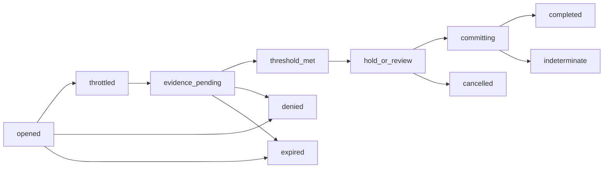

# Recovery coordinator

The recommended component is a **case-based, predeclared, threshold-capable
workflow engine that can reduce authority directly but can create replacement
authority only through other services**. Credential replacement, encrypted-
data-key recovery, platform/firmware recovery, emergency break-glass, and
destructive factory reset are different protocols and powers. They must never
share one universal “recovery token.”

This is component 13 of the [authentication and authorization service
set](README.md).

## Question, scope, and operational standard

> How can Atom recover from lost authenticators, keys, corrupt software, or
operator emergencies without making the recovery path weaker than ordinary
authentication or hiding a universal administrator/decryption key?

Acceptance requires:

- every case names one recovery target, resulting authority ceiling, required
  evidence/independent failure domains, approvals, delay, cancellation,
  notification snapshot, one-shot commit, expiry, and audit trail;
- the coordinator can immediately suspend credentials/sessions but cannot by
  itself bind a replacement authenticator, unwrap a data key, change firmware
  roots, or mint general application authority;
- replacement requires registrar/verifier/trusted-interaction participation and
  is capped by the assurance of the recovery evidence;
- high-entropy recovery codes are stored as protected verifiers, throttled,
  single-use, replacement-generating, and rollback-resistant;
- “two factors” count as independent only when their dependency classes do not
  collapse to the same device, provider, account, household, operator, or
  coercion path;
- notification destinations are frozen from before case initiation and every
  independent channel is notified;
- offline recovery is possible only when provisioned in advance; loss of all
  factors yields denial or explicitly destructive reset, never a secret
  password fallback; and
- concurrent cases, reboot/snapshot, service outage, and partial commits cannot
  create two winners or reuse consumed recovery material.

## Evidence and synthesis

[NIST SP
800-63B-4](../../30-sources/temoshok-et-al-2025-authentication-and-authenticator-management.md)
defines authenticator recovery, saved/issued/contact/reproofing methods,
one-use protected codes, notification, and post-recovery assurance constraints.
[Secrets, Lies, and Account
Recovery](../../30-sources/bonneau-et-al-2015-secrets-lies-account-recovery.md)
provides large-scale empirical evidence that personal-knowledge questions have
a poor security/memorability trade-off and should not be a root recovery method.

[The passkey abusability
study](../../30-sources/daffalla-et-al-2025-passkey-abusability.md) brings
shared-device, synchronization, inventory, removal, and interpersonal threats
into scope. [NIST key-management
guidance](../../30-sources/barker-2020-key-management.md) distinguishes key
purposes: authentication/signing keys can often be replaced, while recovering
stored-data encryption keys is explicitly decryption authority and backups
extend exposure.

[NIST SP
800-193](../../30-sources/regenscheid-2018-platform-firmware-resiliency.md)
places firmware protection, detection, and authenticated recovery in roots
that remain trustworthy when the running OS is compromised. Therefore Layer-4
coordination cannot be the sole platform-recovery root.

## Distinct recovery routes and authority

| Route | Legitimate result | Authority that must remain separate |
| --- | --- | --- |
| Authenticator/account | Bind a replacement, remove lost credentials, revoke sessions | Registrar + verifier + trusted interaction; no data decrypt |
| Encrypted data key | Unwrap/reconstruct named key generation for named dataset | Key service/threshold shares; explicitly decryption authority |
| Platform/firmware | Boot one authenticated recovery image and repair authorized state | Hardware/firmware root below compromised OS |
| Break-glass | One operation-/resource-bound, short-lived emergency grant | Threshold-held issuer envelope plus mandatory audit |
| Factory reset | Destroy designated keys/state and return to bootstrap | Destructive authority; no data recovery or old identity |

Route identifiers are types, not a string parameter accepted by one broad
handler. The coordinator holds case-state write, throttling, notification,
audit, and narrowly scoped suspend/revoke calls. It does not hold the final
creation/decryption/firmware/reset primitives simultaneously.

## Recovery case object

```text
RecoveryCase {
    case_id_and_generation,
    subject_or_device,
    typed_recovery_target_and_generation,
    requested_and_maximum_result_assurance,
    methods_with_dependency_classes,
    evidence_handles,
    initiator_and_source,
    affected_credentials_sessions_keys_or_slots,
    retry_cooldown_and_deadline,
    threshold_approvers,
    frozen_notification_snapshot,
    hold_and_cancel_window,
    one_shot_commit_id,
    audit_and_witness_refs,
}
```

Personally identifying evidence is held by a separately authorized proofing
service when required; the coordinator stores opaque evidence references and
outcomes. No caller-provided notification address replaces the frozen set.

## State machine and commit



For account recovery, the commit transaction:

1. consumes all one-use evidence and approval IDs;
2. activates the registrar's already verified replacement binding;
3. tombstones designated lost credentials;
4. advances session/recovery epochs and requests revocation;
5. invalidates/replaces used recovery-code sets;
6. durably enqueues notification to every frozen destination; and
7. appends the outcome/audit commitment.

Where storage cannot atomically cover all services, a durable coordinator log
and idempotent subtransactions expose progress and `indeterminate` until
reconciled. No retry creates a second replacement.

## Factor independence, delays, and assurance

Methods carry dependency labels such as physical authenticator, same device,
same cloud account, phone number, email provider, institutional operator,
household member, and offline paper/code. Policy requires a threshold over
independent classes, not simply a count.

Cooling-off can provide time for notification/cancellation, but its duration
and emergency exceptions are deployment policy, not proven constants. A
recovered session cannot exceed the weakest evidence path; higher assurance
requires a fresh hardware-backed authenticator binding and possibly an
additional waiting/approval step.

## OTP-like protocol and supervision

```text
open(target, requested_result, initiation_evidence, idempotency, deadline)
  -> case_ref | typed_error
submit(case_ref, method, evidence_handle) -> progress | typed_error
approve(case_ref, approver_cap) -> progress | typed_error
cancel(case_ref, cancellation_evidence) -> cancelled | typed_error
commit(case_ref, interaction_receipt) -> completed | indeterminate | typed_error
status(case_ref, disclosure_cap) -> redacted_progress
```

Route-specific workers, notification adapters, proofing/verifier adapters, and
commit/reconciliation workers are independently supervised. Case state is
durable; untrusted external contact does not run in the authority-bearing
coordinator domain. Restart never skips a delay or repeats a one-shot step.

## Failure, abuse, and overload analysis

| Hazard | Required handling |
| --- | --- |
| Weak recovery defeats strong login | Result assurance capped; high-impact profile needs independent hardware/quorum |
| Nominal factors share failure domain | Typed dependency graph and threshold over independent classes |
| Help-desk/social-engineering compromise | No unilateral commit; scoped operator capability, transcript, delay, audit |
| Attacker-driven lockout/flood | Immediate reduction carefully scoped, per-subject/source limits, owner cancellation |
| Notification redirected | Freeze destinations before case; notify all independent channels |
| Code replay/snapshot rollback | Protected used-set/high-water, boot epoch, replacement code generation |
| Concurrent recovery winners | Per-target serialization, idempotent one-shot commit, epoch compare-and-swap |
| Route confusion | Distinct typed protocols and nonoverlapping final authority |
| Lost all factors offline | Deny or declared destructive reset; no undocumented fallback |

## Verification and evaluation plan

- Reject recovery thresholds whose methods share a modeled dependency; test
  compromised phone/email/sync/help-desk/household combinations.
- Use and replace recovery codes, then reboot/rollback/snapshot/clone and assert
  they stay consumed.
- Race simultaneous cases, cancellation, notification-address changes,
  credential removal, session use, and commit; power-cut at every subtransaction.
- Prove from capability graphs that the coordinator alone can only suspend/
  revoke and cannot bind, decrypt, modify firmware roots, reset, or mint.
- Attempt route confusion among account, data-key, platform, break-glass, and
  destructive reset objects.
- Drill offline/no-clock/no-network cases, all-factor loss, custodian loss,
  quorum replacement, and suspected recovered-key compromise.
- Measure legitimate completion, attacker success, abandonment, false lockout,
  time-to-notification/cancel, service load, and recovery exposure—not only
  cryptographic verification.

## Staged implementation

1. Account recovery using pre-provisioned one-use codes and a second
   authenticator, with no data-key recovery.
2. Durable case log, frozen notification, delay/cancel, concurrency, and
   rollback tests.
3. Institutional threshold and attended reproofing profiles.
4. Separate named-data-key recovery with explicit disclosure of custodians.
5. Platform recovery and break-glass integration only with independent lower-
   layer roots and end-to-end drills.

## Supported decisions and open questions

Supported: no knowledge questions; typed separate recovery powers; coordinator
cannot create authority alone; factor dependency modeling; one-shot durable
commit; no unprovisioned offline fallback.

Open: first-profile methods/quorum/cooldown, proofing authority, encrypted-data
escrow choice, preboot full-disk recovery, platform root, destructive-reset
scope, custodian replacement, and post-recovery assurance.

## Connections

- [Credential registrar and inventory](credential-registrar-and-inventory.md)
- [Trusted-interaction broker](trusted-interaction-broker.md)
- [Key and secret service](key-and-secret-service.md)
- [Revocation and epoch service](revocation-and-epoch-service.md)
- [Audit and witness services](audit-and-witness-services.md)

## Sources

- [NIST SP 800-63B-4](../../30-sources/temoshok-et-al-2025-authentication-and-authenticator-management.md)
- [Secrets, lies, and account recovery](../../30-sources/bonneau-et-al-2015-secrets-lies-account-recovery.md)
- [The abusability of passkeys](../../30-sources/daffalla-et-al-2025-passkey-abusability.md)
- [NIST key-management guidance](../../30-sources/barker-2020-key-management.md)
- [Platform firmware resiliency](../../30-sources/regenscheid-2018-platform-firmware-resiliency.md)
