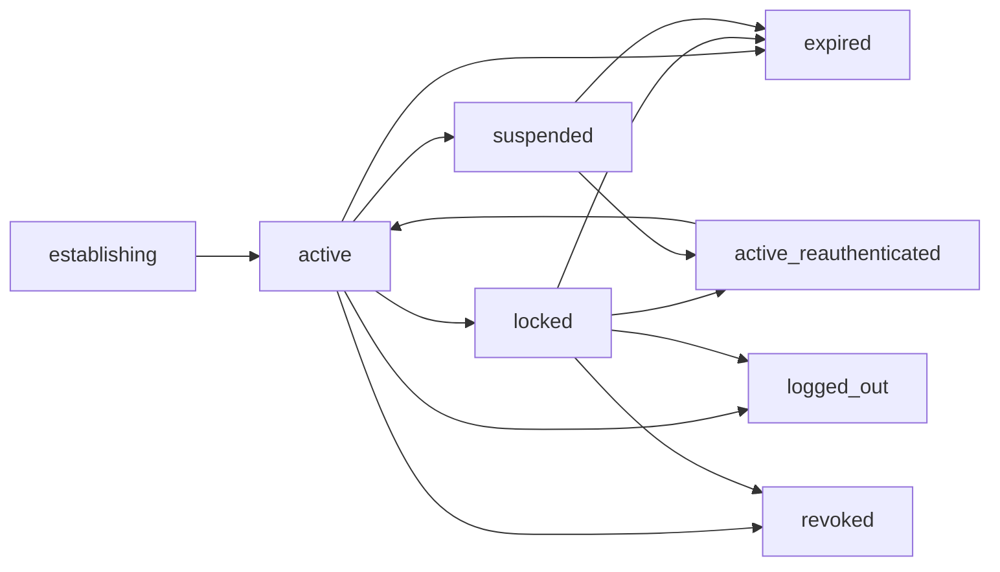

# Session service

The recommended component is a **generation-bound authentication-continuity
service**. It consumes one-use authentication evidence, rotates away any
pre-authentication identifier, optionally binds continuity to a protected
proof key, and exposes an opaque `AuthContext` solely as input to policy. A
session never contains the principal's full possible authority.

This is component 3 of the [authentication and authorization service
set](README.md).

## Question, scope, and operational standard

> What can Atom safely remember after authentication, across process, seat,
> lock, suspend, network, and restart transitions, without turning “logged in”
> into ambient authorization?

The service is acceptable only when:

- session creation atomically consumes audience- and purpose-bound
  authentication evidence and rotates every pre-authentication identifier;
- the record preserves credential provenance, actual authentication time,
  assurance vector/ceiling, authenticated domain/explicit delegatee and seat/
  channel bindings, deadlines, boot epoch, proof-key reference, and revocation
  generation;
- step-up creates a new child/replacement context for a bounded purpose and
  never mutates an old session into universal administrator authority;
- lock, suspend, hibernate, snapshot/restore, process restart, logout, and
  reboot each have a declared state transition rather than inherited behavior;
- idle, absolute, and reauthentication deadlines use trustworthy monotonic
  state and cannot be extended indefinitely by refresh;
- only policy services can read the authentication facts, while applications
  receive opaque handles or derived grants;
- logout and revocation report committed state, propagation watermark, and
  uncertainty separately; and
- session-service outage prevents new continuity or step-up but does not widen
  existing authority beyond its explicit lease.

## Evidence and synthesis

[NIST SP
800-63B-4](../../30-sources/temoshok-et-al-2025-authentication-and-authenticator-management.md)
defines authentication sessions, AAL inheritance, reauthentication, timeout,
binding, logout, and persistence considerations, while warning that an access
token does not prove current human presence. [OAuth Security
BCP](../../30-sources/lodderstedt-et-al-2025-oauth-security-bcp.md) supports
sender-constrained or rotated refresh credentials and token-family invalidation
on reuse. [DPoP](../../30-sources/fett-et-al-2023-dpop.md) provides a concrete
application-layer proof-of-possession precedent with request, nonce, and
replay limitations.

[Formal OpenID Connect
analysis](../../30-sources/fett-et-al-2017-openid-connect-security.md) shows
that authentication, authorization, and session integrity are separate
properties and that issuer, flow, redirect, nonce, and origin composition
matters. [OAuth token
revocation](../../30-sources/lodderstedt-et-al-2013-oauth-token-revocation.md)
makes propagation delay and unsuccessful revocation explicit.

The local process-tree binding and state machine below are Atom proposals, not
claims that OAuth/OIDC should become the native OS session protocol.

## Authority boundary

The service holds session records, authentication-evidence consumption,
proof-key handles, monotonic deadlines, revocation-generation mutation, and
audit append. It can invalidate its own sessions and request downstream
revocation.

It does not store passwords or authenticator private keys, bind credentials,
edit policy, read application data, or hold resource capabilities. An
`AuthContext` designates evidence for a PDP; presenting it to a file, device,
or service endpoint has no effect.

## Session object and assurance

```text
AuthSession {
    session_id_and_generation,
    subject,
    initiating_domain_and_generation,
    explicit_delegatee_binding,
    nonauthoritative_process_tree_provenance,
    seat_and_channel_binding,
    verifier_audience_and_purpose,
    authentication_time,
    credential_id_and_revision,
    assurance_vector_and_ceiling,
    proof_key_handle,
    issued_not_before_idle_absolute_reauth_deadlines,
    parent_and_step_up_scope,
    boot_and_resume_epochs,
    revocation_generation,
    status,
}
```

The kernel-authenticated domain incarnation and explicit delegatee binding can
constrain who may use the session. A PID, actor name, supervisor ancestry, or
process tree is lifecycle and audit provenance only; restarting or moving
within a tree never confers permission.

Assurance is a vector: user presence, user verification, phishing/replay
resistance, hardware protection, key exportability, interaction-path strength,
and freshness. A session can preserve or reduce evidence; it cannot raise it.
Policy chooses which dimensions matter for one action.

## Lifecycle



`locked` ends interactive use and destroys or makes unavailable selected proof
facets. Unlock requires new evidence according to policy; merely receiving
input does not resume. Suspend changes a resume epoch and may require
reauthentication or workload/device attestation. Baseline bearer sessions do
not survive process restart, hibernate, reboot, or VM snapshot.

Step-up records the parent session, exact request digest/purpose, higher
evidence, and a shorter lifetime. It returns a distinct context consumed only
for policy decisions matching that purpose. It never turns the shell into
root.

## Proof of possession and refresh

Where a client can protect an asymmetric session key, every context use is
bound to a nonce, intended service/audience, operation/request digest, and
session generation. DPoP is evidence for the shape, not the native protocol:
Atom additionally binds IPC peer/domain generation and, for effectful calls,
the canonical body/request digest.

Refresh does not reset the original authentication time or absolute/reauth
deadline. Rotation creates a new refresh generation and invalidates the old
one. Reuse of an old generation revokes or quarantines the family. The returned
lifetime, not the requested extension, is authoritative.

## OTP-like protocol and crash behavior

```text
establish(authentication_evidence, recipient_key_proof, deadline)
  -> {ok, auth_context} | typed_error
step_up(parent_context, purpose_digest, evidence)
  -> {ok, scoped_context} | typed_error
lock(session_ref) -> {ok, committed_generation} | typed_error
logout(session_ref) -> {committed, local_generation, propagation_state}
inspect(session_ref, disclosure_cap) -> redacted_status
```

On `establish`, Layer 2 supplies the actual IPC peer domain and generation.
The session service compares that fact, the explicit delegatee, seat/channel,
purpose, audience, and recipient-key proof against the verifier evidence. None
of those authority-bearing fields is accepted as a replacement binding from
the caller.

Commands use idempotency keys and optimistic expected generations. A reply
distinguishes committed local invalidation from downstream propagation. After
a crash, protected generation state wins over cached handles; ambiguous
precommit requests return `indeterminate` for reconciliation, never success.

## Failure and partition semantics

| Event | Required behavior |
| --- | --- |
| Session fixation attempt | Rotate identifier/secret on authentication and step-up |
| Wrong domain generation, delegatee, seat, channel, audience, or proof key | Reject without revealing session details |
| Wall-clock rollback | Use monotonic boot-relative deadlines; invalidate across uncertain resume |
| Snapshot clone | New boot/resume epoch; reject or explicitly rebind protected persistent sessions |
| Logout service partition | Commit local generation; report remote watermark pending |
| Revocation check unavailable | High-risk new grants deny/step-up; lower-risk behavior follows declared lease |
| Session-service crash | No new session; extant grants remain only until their own expiry/epoch checks |
| Refresh storm | Per-session/tenant quotas, randomized renewal, bounded queues, reserved logout lane |

## Verification and evaluation plan

- Test identifier rotation at establishment and step-up and attempt fixation via
  pre-authenticated state.
- Cross session handles among domain generations, explicit delegatees, seats,
  channels, proof keys, audiences, operations, and boot/resume epochs; vary
  process-tree provenance separately and prove it grants no authority.
- Exercise lock, unlock, suspend, hibernate, process restart, reboot, disk
  snapshot, VM clone, migration, and clock rollback as a complete matrix.
- Race logout, refresh, grant request, credential removal, and proof-key
  rotation; check committed generations and downstream watermarks.
- Reuse an old refresh generation and verify family invalidation.
- Prove via the capability graph that `AuthContext` has no resource operation.
- Measure establishment, step-up, validation, logout, and fan-out latency plus
  maximum revocation exposure under partitions.

## Staged implementation

1. In-memory, boot-bound sessions with no persistence and no resource rights.
2. Durable generations, monotonic deadlines, lock/logout, and audit.
3. Protected local proof keys and operation-bound step-up.
4. Distributed invalidation with explicit watermarks.
5. Persistent/resumable sessions only after snapshot and hardware-root policy
   is specified and adversarially tested.

## Supported decisions and open questions

Supported: auth continuity is policy input; no ambient user authority; step-up
is a new scoped context; default no survival across reboot; typed revocation
progress.

Open: first-profile timeout values, proof-key hardware, process-tree and seat
semantics, suspend/hibernate policy, distributed logout protocol, and whether
any persistent session is worth its clone/replay risk.

## Connections

- [Authentication verifier](authentication-verifier.md)
- [Policy decision point](policy-decision-point.md)
- [Revocation and epoch service](revocation-and-epoch-service.md)
- [Grant compiler and issuer](grant-compiler-and-issuer.md)
- [Main authentication and authorization synthesis](../authentication-and-authorization-across-the-five-layer-architecture.md)

## Sources

- [NIST SP 800-63B-4](../../30-sources/temoshok-et-al-2025-authentication-and-authenticator-management.md)
- [OAuth 2.0 Security BCP](../../30-sources/lodderstedt-et-al-2025-oauth-security-bcp.md)
- [DPoP](../../30-sources/fett-et-al-2023-dpop.md)
- [Formal security analysis of OpenID Connect](../../30-sources/fett-et-al-2017-openid-connect-security.md)
- [OAuth token revocation](../../30-sources/lodderstedt-et-al-2013-oauth-token-revocation.md)
