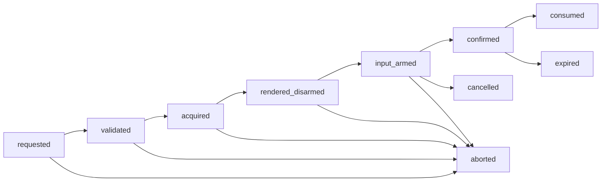

# Trusted-interaction broker

The recommended component is a **small, separately protected Layer-4 broker
backed by a non-bypassable Layer-2 input/display routing mechanism**. It turns
a typed security request into one fully rendered, exclusive, interruptible
ceremony and returns a short-lived, audience-bound, single-consumer receipt.
It does not authenticate a credential, decide policy, or mint resource
authority.

This is component 0 of the [authentication and authorization service
set](README.md). Its most important property is semantic binding: the human
response is evidence about exactly the requester, target, operation,
consequence, destination, and challenge the protected path displayed—not a
generic “user clicked Allow” bit.

## Question, scope, and operational standard

> How can Atom obtain trustworthy evidence of human intent when every ordinary
> application surface, window title, command prompt, and network peer may be
> malicious or misleading?

The broker is acceptable only if tests establish that:

- ordinary applications cannot draw inside, overlay, redirect input to, or
  synthesize input for the trusted path;
- security-critical fields come from authenticated object identities and a
  canonical schema, never only from caller-provided prose;
- the complete request is visible before confirmation becomes armed;
- any focus, route, display, renderer, accessibility-path, seat, or boot-epoch
  change aborts rather than resumes the ceremony;
- a receipt binds the request digest, renderer/schema version, seat/path,
  relying party, purpose, outcome, expiry, and boot epoch;
- only the consumer named in the receipt can consume a confirmation, exactly
  once and within its deadline; allowed consumer classes are verifier,
  credential commit guard, recovery coordinator, and grant issuer;
- crashes, overload, and missing trusted hardware yield `aborted`, `busy`, or
  `unsupported`, never an ordinary-window fallback; and
- prompt floods cannot starve secure attention, cancel, lock, or emergency
  safety paths.

## Evidence and synthesis

[Nitpicker](../../30-sources/feske-helmuth-2005-nitpicker.md) demonstrates a
small trusted GUI that owns composition, input focus, trusted labels, and
client quotas. It supports minimizing the component that mediates views and
input, but its 2005 prototype does not prove a modern multi-display ceremony
usable or unspoofable.

[Operating System
Framed](../../30-sources/bravo-lillo-et-al-2012-operating-system-framed.md)
found that visually strengthened OS password prompts still induced substantial
credential disclosure. The result supports a stronger rule: a secret used on
the trusted path must be technically unusable on an ordinary application path,
not merely accompanied by better chrome.

[Yee's secure-interaction
principles](../../30-sources/yee-2002-user-interaction-design-secure-systems.md)
connect authority to explicit user intent and make the acting parties and
consequences visible. [Android Protected
Confirmation](../../30-sources/android-project-2026-protected-confirmation.md)
provides a contemporary first-party precedent for binding a cryptographic
confirmation token to text rendered through a hardware-protected path and for
aborting incomplete or interrupted presentation.

The Atom state machine and receipt below are a synthesis. None of those
sources proves that a future Atom compositor, device driver, firmware, or
accessibility bridge meets the proposed boundary.

## Trust boundary and authority

The broker holds:

- a scoped lease over trusted display planes and physical input routes;
- authentic kernel facts for caller domain, seat, device, and boot epoch;
- read-only resolution of protected object display names;
- a bounded ceremony queue and a key-service signing facet for receipts; and
- audit-append authority for request, abort, and result metadata.

It must not hold credential records, authenticator private material,
application objects, policy-edit rights, general grant-minting authority,
window-manager administration, or a reusable “act as user” credential.

Separate actors are insufficient if one managed runtime hosts mutually
distrustful code. High-assurance deployments place the broker and its minimal
renderer in a dedicated unprivileged Layer-4 service domain whose memory,
authority, and exclusive device routing Layer 2 creates and enforces. Layer 4
owns ceremony policy and presentation.

## Request and receipt model

```text
InteractionRequest {
    request_id,
    requester_domain_and_generation,
    relying_party,
    seat_and_input_set,
    purpose_enum,
    target_object_and_generation,
    operation,
    bounded_parameters,
    destination,
    consequence_class,
    challenge_digest,
    requested_assurance,
    deadline,
}

InteractionReceipt {
    request_id_and_digest,
    schema_and_renderer_digest,
    requester_and_relying_party,
    target_and_operation,
    seat_and_trusted_path_id,
    outcome,
    issued_at_monotonic,
    expires_at_monotonic,
    boot_epoch,
    single_consumer,
}
```

Free text may explain but cannot redefine a typed operation. Long parameters
are summarized with a protected digest and an inspect action; truncation is
explicit. Bidirectional Unicode, confusable identifiers, invisible text, and
caller-controlled emphasis do not enter security-critical fields.

## Ceremony state machine



`acquired` means every required output and input route is exclusively owned.
The broker first renders in a disarmed state, verifies complete presentation,
then arms physical input. A route or content change after arming invalidates
the request. A restarted supervisor starts a new request; it never reconstructs
a half-finished prompt from mailbox state.

Confirmation is not durable authorization. It is a one-shot evidence object
for a named verifier, credential commit guard, recovery coordinator, or grant
issuer. The consumer atomically records the receipt ID as consumed with the
transition it authorizes.

## OTP-like service contract

The public protocol uses bounded messages and typed outcomes:

```text
begin(request) -> {ok, ceremony_ref}
               | {error, invalid_schema | busy | unsupported_path}
cancel(ceremony_ref) -> ok | {error, stale_ref}
result(ceremony_ref) -> {confirmed, receipt_handle}
                      | cancelled | aborted | expired
```

Calls carry deadlines and cancellation. The queue is partitioned by requester
and purpose, with reserved capacity for secure attention and cancel. A crash
supervisor may restart the broker after releasing routes and incrementing a
broker generation, but callers receive `aborted`; retry is explicit.

Password, PIN, or biometric-activation input is delivered directly into an
authenticated verifier/authenticator channel. The requesting application
never receives the bytes. A biometric match is only local user-verification
evidence from the authenticator, not a portable identity claim.

## Failure, abuse, and availability analysis

| Hazard | Required response |
| --- | --- |
| Overlay, focus steal, or synthetic input | Prevent in Layer 2; abort on any route transition |
| Misleading requester text | Render canonical protected fields separately from bounded explanation |
| Secondary display or remote desktop ambiguity | Select an explicit trusted path or report unsupported |
| Accessibility proxy | Treat as a named trusted bridge with constrained input/output capability and audit |
| Stale prompt or receipt replay | Bind request, audience, boot epoch, deadline, and atomic one-use consumption |
| Broker or renderer crash | Blank/revoke the protected plane, increment generation, return aborted |
| Prompt flood | Per-principal quotas, coalescing, deadlines, fairness, and reserved control lane |
| Shoulder surfing or coercion | Minimize secrets and disclose residual physical-threat assumptions |

The broker cannot prove that a human understood the prompt or was uncoerced.
It can prove only the protected-path and request-binding facts supported by the
chosen hardware/software profile.

## Verification and evaluation plan

- Red-team with a compromised application, compositor peer, runtime actor, and
  remote session attempting overlays, focus changes, synthetic events,
  clipping, Unicode deception, and requester-name substitution.
- Fault-inject display hotplug, input removal, suspend, timeout, renderer crash,
  broker crash, and audit outage at every state transition; assert no receipt.
- Replay receipts across purpose, consumer, seat, target generation, and boot
  epoch; assert atomic single consumption under concurrent callers.
- Prove by capability-graph inspection that an ordinary CLI, browser, or app
  cannot receive the OS-login secret or the trusted input route.
- Measure acquisition latency, full rendering time, cancel latency, queue
  bounds, and fairness under adversarial prompt storms.
- Run user studies for recognition, comprehension, error, accessibility, and
  habituation; cryptographic correctness is not usability evidence.

## Staged implementation

1. Define canonical request schemas and an emulator-only protected surface.
2. Add Layer-2 exclusive route leases and authentic seat/device generations.
3. Implement one-shot receipt consumption with the authentication verifier.
4. Add multi-display, accessibility, suspend, and remote/headless profiles only
   after each has a documented trusted path.
5. Bind high-impact grant and recovery confirmations to exact effect requests.

## Supported decisions and open questions

Supported now: no ordinary-window fallback; canonical typed content; full-
render-before-arm; abort on interruption; one-use audience-bound receipts; no
resource authority in the broker.

Open: the first board's secure-attention hardware, trusted display/input
drivers, accessibility TCB, remote-administration ceremony, safe localization,
and empirically acceptable presentation format.

## Connections

- [Credential registrar and inventory](credential-registrar-and-inventory.md)
- [Authentication verifier](authentication-verifier.md)
- [Recovery coordinator](recovery-coordinator.md)
- [Main authentication and authorization synthesis](../authentication-and-authorization-across-the-five-layer-architecture.md)
- [System-wide security contract inquiry](../../40-inquiries/what-contract-should-system-wide-authentication-and-authorization-provide.md)

## Sources

- [User interaction design for secure systems](../../30-sources/yee-2002-user-interaction-design-secure-systems.md)
- [Operating System Framed](../../30-sources/bravo-lillo-et-al-2012-operating-system-framed.md)
- [A Nitpicker's guide to a minimal-complexity secure GUI](../../30-sources/feske-helmuth-2005-nitpicker.md)
- [Android Protected Confirmation](../../30-sources/android-project-2026-protected-confirmation.md)
