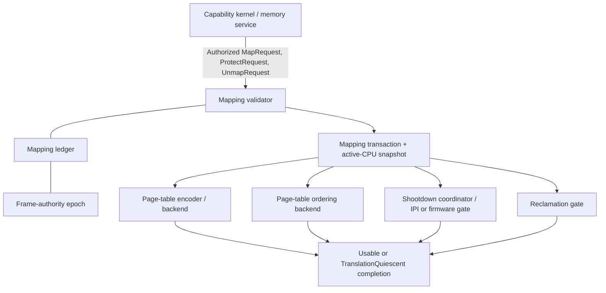
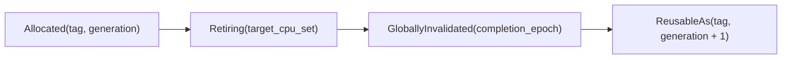
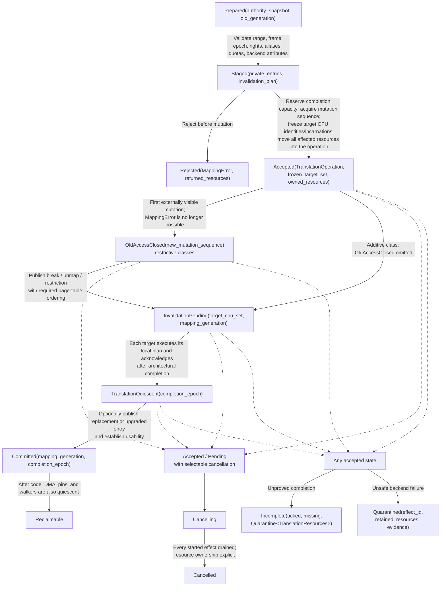

# Address translation and protection transitions

The address-translation component should be a capability-checked transaction
engine, not a collection of page-table helpers. Its externally meaningful
result is a protection transition with a stated completion scope. A page-table
store is only an internal step.

The recommended first implementation uses one kernel-owned page-table
hierarchy per address space, immutable mapping identities, a generation-tagged
ASID/PCID lease, an ordered active-CPU protocol, synchronous acknowledged
shootdown for restrictive changes, and epoch-gated reclamation. Range batching
and conservative CPU targeting are baseline features. Lazy invalidation,
access-bit targeting, and NUMA page-table replication are later optimizations
that may change cost but not the postcondition.

This is a proposed implementation for the architecture developed in [Kernel
hardware and architecture support
layer](../kernel-hardware-and-architecture-support-layer.md), not evidence that
the protocol has been implemented or verified.

## Question, scope, and operational standard

The question is:

> How should an authorized map, protect, replace, or unmap request become an
> architecturally complete protection change on every CPU that could observe
> the old translation?

The component owns:

- encoding and mutating CPU translation structures;
- ASID-, PCID-, or equivalent context-tag allocation and reuse;
- validation of representable permissions, memory types, sizes, and aliases;
- local translation maintenance and remote shootdown;
- coordination between address-space activation and mutation;
- safe lifetime of page-table pages and replaced frames; and
- bounded, fault-recoverable access to user memory from privileged code.

It does not choose physical frames, replacement policy, managed-runtime heap
layout, copy-on-write policy, module authenticity, or which service deserves a
mapping. Those decisions remain in the capability kernel and its user-level
memory or runtime services.

A first implementation is adequate only if it demonstrates all of these
postconditions:

1. A caller cannot create a translation without current authority over both
   the address space and the frame, constrained by each object's rights.
2. A returned restrictive-completion token proves that no online CPU in the
   transition's target set can use the superseded translation.
3. A CPU joining the address space concurrently either participates in the
   transition or observes its completed generation before executing there.
4. An ASID or PCID numeric value cannot connect stale translations to a later
   address-space incarnation.
5. A removed frame, mapping identity, or page-table page cannot be reused
   until translation walkers, CPU translations, executable references, and
   relevant DMA paths are separately quiescent.
6. No persistent writable-and-executable path exists in the baseline.
7. Failure to obtain remote completion produces an explicit contained state;
   it never becomes fabricated success.
8. The same mandatory contract runs unchanged over two materially different
   ISA backends, with differences represented as feature data or backend
   plans.

## What the evidence establishes

The sources support constraints and precedents, not this exact object model.

| Evidence | Supported conclusion | What it does not establish |
| --- | --- | --- |
| [Relaxed virtual memory in Armv8-A](../../30-sources/simner-et-al-2022-relaxed-virtual-memory.md) | Page-table mutation, concurrent walks, barriers, invalidation, and reuse form a protocol; Arm break-before-make has precise preconditions | A portable kernel transaction API or correctness on x86 and RISC-V |
| [Arm A-profile manual](../../30-sources/arm-2026-a-profile-system-architecture-documentation.md), [Intel system-programming manual](../../30-sources/intel-2026-system-programming-documentation.md), and [RISC-V privileged ISA](../../30-sources/risc-v-international-2026-privileged-architecture.md) | Each ISA exposes different entry formats, context identifiers, invalidation scopes, and ordering rules | That one instruction or identical table format can implement the common contract |
| [RISC-V SBI 3.0](../../30-sources/risc-v-international-2025-supervisor-binary-interface.md) | A supervisor may request range- and ASID-scoped remote fences through a fallible higher-privilege interface | That firmware success is timely or sufficient for this kernel's reclamation claim without a pinned platform contract |
| [Linux cache/TLB APIs](../../30-sources/linux-kernel-community-2026-low-level-core-apis.md) | A mature portable kernel specifies caller-visible cache/TLB effects and leaves instruction sequences to ports | That Linux's data structures or compatibility surface are minimal here |
| [Page-access-tracked shootdown](../../30-sources/amit-2017-optimizing-tlb-shootdown.md) | Hardware evidence can eliminate some remote invalidations and materially improve selected workloads | A sound cross-ISA baseline; tracking itself can add cost |
| [Hydra](../../30-sources/gao-et-al-2024-scalable-page-table-tlb.md) | NUMA placement, page-table replication, sharer tracking, and shootdown cost are coupled | That replication belongs in a small first implementation |
| [Least-privilege memory protection](../../30-sources/achermann-et-al-2019-least-privilege-memory-protection.md) | Authority to configure a translator is distinct from authority to access the translated memory | The project's concrete capability types or teardown protocol |
| [L4 lessons](../../30-sources/elphinstone-heiser-2013-l4-lessons.md) and the [seL4 manual](../../30-sources/sel4-foundation-2026-reference-manual.md) | Address spaces and mappings can remain small capability-mediated kernel mechanisms while paging policy stays outside privilege | That similar names transfer seL4's proofs or performance |

Two negative lessons are as important as the positive evidence. Ordinary CPU
cache coherence does not imply translation coherence, and a formal memory
model for ordinary loads and stores does not automatically cover page-table
walkers. The implementation must maintain a claim ledger identifying which
architecture rule justifies each step.

## Recommended component boundary

The portable part should manipulate semantic objects and plans. Only the
backend should construct page-table entries, select invalidation instructions,
or encode architecture-specific attributes.



Drivers, BEAM schedulers, native extensions, and memory servers never receive
a raw page-table pointer. An unprivileged memory service may decide *what* to
map, but an invocation crossing the kernel boundary revalidates authority and
executes the transition. Component 3 has no public operation that grants
execute authority. Component 4 is the sole public executable-code publication
orchestrator and may invoke the private translation effects described below
only with an unforgeable `Authorized<CodePublication>` proof.

## Object model

### `AddressSpace`

An address space records:

- an immutable object identity and incarnation;
- one typed, kernel-owned translation root;
- a backend format and immutable translation-feature profile;
- a mutation sequence and completion epoch;
- an `ActiveCpuSet` with per-CPU observed sequence;
- a `ContextTagLease` containing the numeric ASID/PCID and software generation;
- a mapping ledger indexed by range and mapping identity; and
- state `Constructing`, `Live`, `Closing`, `Quarantined`, or `Dead`.

The object is exclusively attached to one baseline protection domain. Shared
frames are represented by multiple mappings, not by sharing an address-space
root between independently recoverable domains. That keeps domain teardown
and the active-CPU set unambiguous.

### `Mapping`

The capability kernel's existing mapping object is the durable identity for
one relation:

```text
(address_space incarnation,
 virtual range,
 frame identity and offset,
 admitted frame-authority epoch,
 maximum rights,
 effective rights,
 memory type,
 mapping generation)
```

A replacement at the same virtual address creates a new identity. An old
completion token therefore cannot protect, unmap, or release the replacement.
The immutable maximum-rights ceiling prevents a copied attenuated handle from
reconstructing execute or write authority later.

### `PageTablePage`

Page-table memory is a typed kernel object with one owner, level, format, and
generation. It is never writable through an ordinary domain mapping. Its
lifetime is pinned from the first live parent entry until every walker and
cached translation that could reach it is quiescent.

### `ContextTagLease`

Hardware commonly sees only a bounded numeric ASID or PCID; software attaches
an unbounded generation. Reuse follows this rule:



If a backend cannot invalidate one tag reliably, rollover flushes the required
broader scope. Numeric equality is never object identity.

### `MappingTransaction`

A transaction owns the authority snapshot, affected ranges, old and new
mapping identities, page-table locks or ownership, invalidation plan, target
CPU set, and charged work budget. It can batch adjacent changes, but all
entries in one atomic commit must share a failure and rollback strategy.

Preparation may still reject without changing architectural state. Acceptance
freezes the exact target CPU identities and incarnations, moves the transaction,
completion slots, page-table/frame pins, and teardown budget into one
`TranslationOperation`, and reserves the affected mapping generations. Those
resources remain operation-owned until a terminal result returns them or moves
them into a named quarantine; caller timeout does not release them.

## Mapping classes and required completion

Different mutations require different proofs. Treating them alike is correct
only when the strongest path is used.

| Change class | Principal hazard | Minimum returned result |
| --- | --- | --- |
| New mapping into a previously invalid range | A negative translation cache or incomplete page-table publication may delay visibility | `Usable(epoch, scope)` after backend-required publication and any invalidation |
| Permission upgrade | A stale restrictive translation may fault or deny intended access | `Usable(epoch, scope)` before promising the new right |
| Permission reduction | A stale permissive translation can bypass policy | `TranslationQuiescent(epoch, cpu_set)` |
| Unmap | A stale translation can access a frame after logical removal | `TranslationQuiescent`; frame remains pinned until then |
| Physical replacement at one virtual address | Stale translation can reach the wrong frame; some ISAs require break-before-make | Break old mapping, complete required invalidation, then publish new mapping |
| Memory-type or cacheability change | Conflicting aliases can violate architectural rules or corrupt data | Backend-specific alias/cache protocol plus translation completion |
| Add execute permission | Instruction fetch may see stale or partial bytes | No public translation operation; component 4 composes private `WritableTranslationClosed` and `ExecutableMappedButUnreachable` effects into [code publication](ordering-coherence-and-code-publication.md) |
| Page-table-page removal | A concurrent walker may retain or fetch the old table | Walker/translation quiescence before page-table retyping |

The public API must not return a bare Boolean. Submission returns either a
pre-mutation `Rejected` result or an accepted operation naming the exact
mapping generation, effect class, frozen target CPU set, and owned completion
record. Polling that operation yields its exactly-once terminal result and
completion epoch.

## Transaction state machine



An additive mapping can omit `OldAccessClosed`. A restrictive transition
cannot. Rollback after old access has closed is itself a new protection
transition, not restoration of an in-memory word. `Incomplete`, `Quarantined`,
and drained `Cancelled` are terminal operation records, not `MappingError`
aliases. Late acknowledgements may advance a teardown ledger but cannot mutate
that exactly-once terminal record or authorize resource reuse implicitly.

## Race-free CPU activation and shootdown

The subtle race is a CPU entering an address space while a mutator snapshots
its active set. The recommended protocol uses a mutation sequence whose even
values are stable generations and whose odd values mean that a restrictive
transition is in progress:

1. Before loading a user translation root, CPU `c` reads an even stable
   generation, publishes `(c, entering, generation)` with release ordering,
   and rereads the mutation sequence with acquire ordering.
2. If the value changed or is odd, the CPU withdraws or waits in kernel state
   and retries. It cannot execute in the address space during that window.
3. Otherwise it joins `ActiveCpuSet`, rereads once more to close the
   publish-versus-mutation race, performs any catch-up invalidation required by
   its per-CPU observed generation, and only then loads the context tag and
   enters user execution.
4. A mutator acquires the address-space mutation gate and changes the stable
   even sequence to the following odd value before closing old access. New
   activators now wait. It snapshots every `active` or `entering` CPU from the
   preceding stable generation.
5. Each target receives a compact per-CPU shootdown request, executes the
   local plan, records the transition sequence with release ordering, and
   acknowledges after architectural completion.
6. The mutator declares quiescence only after all targets acknowledge or after
   CPU lifecycle supplies stronger evidence that a target can no longer
   execute or retain relevant state. It then publishes the next even stable
   generation with release ordering and releases the mutation gate.
7. A CPU leaves the set only after switching to a translation context that
   cannot use the address space and publishing its observed generation.

The active set may be a bitmap on a small coherent machine and a sharded or
message-owned structure on a larger machine. That representation is not part
of the contract. A false-positive target costs an IPI; a false negative breaks
isolation.

`ActivationGuard` is a CPU-affine, non-transferable witness containing the
address-space incarnation, CPU incarnation, stable mutation generation, and
active-set membership generation. Translation creates it only after step 3.
Component 2 stores the guard in `EntryCpuState` across root load, user
execution, re-entry, and any same-address-space return; ordinary stack
unwinding cannot drop it.

To consume the guard, component 2 first switches to a neutral or replacement
translation context that cannot use the old address space, executes the
required local ordering, and calls `address_space_deactivate`. Translation then
publishes active-set departure and the CPU's observed generation before
returning `ActiveSetDeparture`. CPU offline and migration must drain this same
guard. Destruction without that completion quarantines the address space and
CPU state rather than manufacturing departure.

### Shootdown request format

A bounded request should contain:

```text
ShootdownRequest {
  address_space_id,
  address_space_incarnation,
  context_tag,
  context_tag_generation,
  mapping_generation,
  range_or_context_scope,
  mutation_sequence,
  completion_slot
}
```

CPU-local queues coalesce compatible requests by address space and sequence.
When ranges exceed a measured threshold or a queue would overflow, the backend
may strengthen them to a context-wide invalidation. The hard IPI path never
allocates or waits on the initiating CPU; it performs bounded local work and
records completion.

The initiating operation performs only bounded admission work in ordinary
kernel context and returns a split-phase `TranslationOperation`. A completed
local fast path is represented by an operation whose terminal record is already
available; it does not create a second result convention. The security
postcondition is identical.

## Kernel-facing interface

Instruction-shaped functions remain private. The semantic interface can be
small:

```text
address_space_create(profile, root_frame_authority)
  -> Rejected(MappingError, root_frame_authority) | AddressSpace

mapping_prepare(address_space, virtual_range, frame_authority,
                offset, non_executable_rights, memory_type)
  -> Rejected(MappingError, unchanged_resources)
   | Prepared(MappingTransaction)

mapping_commit_add(transaction)
  -> Rejected(MappingError, transaction)
   | Accepted(TranslationOperation)

mapping_upgrade(mapping, added_non_executable_rights)
  -> Rejected(MappingError, unchanged_mapping)
   | Accepted(TranslationOperation)

mapping_reduce(mapping, reduced_non_executable_rights)
  -> Rejected(MappingError, unchanged_mapping)
   | Accepted(TranslationOperation)

mapping_unmap(mapping)
  -> Rejected(MappingError, unchanged_mapping)
   | Accepted(TranslationOperation)

translation_poll(operation)
  -> Pending(stage, acknowledged_cpu_set)
   | Succeeded(UsableCompletion | TranslationQuiescent)
   | Cancelled(drain_epoch, returned_or_retained_resources)
   | Incomplete(acknowledged_cpu_set, missing_cpu_set,
                Quarantine<TranslationResources>)
   | Quarantined(reason, Quarantine<TranslationResources>)
   | Fatal(ArchitectureFaultRecord)

translation_cancel(operation)
  -> CancellationRequested
   | CancellationNotSelectable(stage)
   | AlreadyTerminal(TranslationTerminal)

address_space_activate(address_space, cpu_context)
  -> ActivationGuard

address_space_deactivate(activation_guard, installed_safe_context)
  -> ActiveSetDeparture | Incomplete(quarantine)

address_space_close(address_space)
  -> Rejected(MappingError, unchanged_address_space)
   | Accepted(TranslationOperation)

private translation_internal::prepare_executable_image_transition(
    Authorized<CodePublication>, Borrowed<SealedCode>, address_space,
    virtual_range, executable_rights, memory_type, publication_generation)
  -> Rejected(MappingError, unchanged_resources)
   | Prepared(ExecutableImageTranslationPlan)

private translation_internal::close_writable_aliases(
    Borrowed<ExecutableImageTranslationPlan>)
  -> TranslationOperation

private translation_internal::map_executable_unreachable(
    Borrowed<ExecutableImageTranslationPlan>, TranslationQuiescent)
  -> TranslationOperation
```

The general map, upgrade, and reduction calls cannot represent execute
permission. Upgrades and reductions are separate because an upgrade may return
`UsableCompletion`, while a reduction must prove `TranslationQuiescent` before
the old access can be treated as closed. Polling retains acknowledged and
missing CPU sets rather than collapsing partial failure into an unexplained
error. Cancellation only selects a desired path: `Cancelled` is published only
after all started page-table and remote effects have drained to its stated
epoch. Once old access closes, cancellation may be nonselectable and the
operation continues toward quiescence or quarantine.

The three `translation_internal` operations are crate-private effects, not
facade calls. Component 4 prepares the entire
`ExecutableImageTranslationPlan`, including capacity and generation
reservations, before it accepts a public `code_publish` operation. Starting
either prepared phase therefore cannot return `MappingError`; a later hardware
or remote-completion problem becomes the encompassing publication operation's
typed `Incomplete`, quarantine, or fatal terminal state. The private plan uses
the canonical `ExecutableImage` typestate view `SealedCode`; there is no
`CodeRegion`, `SealedCodeRegion`, `ExecutableMappingTransaction`, or
translation-produced `PublishedCode` object.

`MappingError` is exclusively a pre-mutation rejection: absent authority,
overlap, unrepresentable attributes, stale generation, admission-time resource
exhaustion, or an unavailable required backend profile. After `Accepted`, the
operation owns its frozen targets and resources and cannot return
`MappingError`. Timeout is observation, not cancellation; it yields a terminal
`Incomplete` record with explicit quarantine ownership when completion cannot
be proved.

### Safe user access

Privileged code should not rely on one ambient direct map of all physical
memory or on raw user pointers. `copy_from_domain` and `copy_to_domain` accept
an address-space guard, checked range, length, direction, and fault-recovery
record. They pin the mapping identity or use a bounded fault-safe window,
perform overflow checks, and return partial-copy evidence explicitly.

Large IPC payloads should use capability-backed buffer leases rather than
holding a page-table lock during arbitrary copying. This keeps fault handling
bounded and avoids turning user-memory probing into a hidden authority path.

## Cross-ISA realization

| Semantic need | x86-64 backend | AArch64 backend | RISC-V supervisor backend |
| --- | --- | --- | --- |
| Context identity | PCID when present, paired with software generation | ASID and translation-regime identity, paired with software generation | `satp` ASID and Sv mode, paired with software generation |
| Local range/context invalidation | `INVLPG`, `INVPCID`, or required control transition selected by feature profile | Correct TLBI operand, shareability scope, and completion barriers | `SFENCE.VMA` with applicable address/ASID operands |
| Remote execution | Kernel IPI through local APIC or stronger discovered mechanism | GIC SGI/IPI path or supported broadcast TLBI scope with explicit completion rules | Kernel IPI, or declared SBI RFENCE dependency |
| Replacement restrictions | Intel-defined invalidation and paging-structure rules | Break-before-make where required, with exact TLBI/barrier sequence | PTE validity and `SFENCE.VMA` rules for the pinned privileged-ISA edition |
| Accessed/dirty state | Hardware behavior and optional software policy | Feature- and configuration-dependent | Svade or fault-based behavior depending on profile |
| Execute-only and memory types | Feature- and page-attribute-dependent | Translation-regime and memory-attribute-dependent | Scheme and extension dependent |

The common layer does not export `invlpg`, `tlbi`, or `sfence.vma`. It exports
`TranslationQuiescent` and retains a backend trace explaining how that effect
was established.

An MPU/PMP-only backend may reuse mapping identity, authority, generation, and
completion vocabulary, but a finite region reprogram is not forced into a
fictional page-table interface. It declares different granularity, capacity,
atomicity, and CPU-locality limits.

## Interaction with the capability microkernel

The [minimal privileged kernel](../minimal-privileged-kernel-layer.md) already
defines `AddressSpace`, `Mapping`, frame-authority epochs, protection-domain
teardown, and quarantine. This component is the architecture-level executor
for those objects:

- capability validation decides whether a transaction may begin;
- the translation component validates backend-representable attributes and
  produces completion evidence;
- the mapping object's generation binds that evidence to one effect;
- the domain teardown ledger retains mappings and frames until completion;
- CPU lifecycle proves whether an offline target still belongs in a target
  set; and
- the DMA component supplies its own IOTLB and in-flight-device quiescence.

CPU translation completion alone never releases a DMA-visible frame. Likewise,
IOMMU invalidation never proves that a CPU's stale PTE is gone.

## Interaction with the managed runtime

A BEAM process is not an address space. One runtime protection domain contains
many lightweight BEAM processes, their process-local tracing collectors, and
a small set of kernel-scheduled runtime threads. The runtime requests and is
charged for pages in batches; ordinary term allocation and garbage collection
do not enter the kernel or mutate page tables per object.

Recommended runtime patterns are:

- grow heap arenas by mapping batches large enough to amortize capability and
  shootdown work;
- preserve guard pages and domain boundaries in kernel mappings while keeping
  actor heap organization in the runtime;
- use immutable `ExecutableImage` instances and component 4's sole public
  code-publication protocol for BeamAsm or another native lowering path; and
- treat a JIT or unsafe native extension fault as a runtime-domain failure, not
  evidence that the failed BEAM actor alone can be restarted safely.

This boundary preserves compiled BEAM compatibility and automatic
process-local tracing collection without placing BEAM heap or collector policy
in privileged code.

## Safety, security, and failure cases

### Unresponsive target CPU

A timeout is diagnostic evidence, not completion. The transition enters
`Quarantined`; removed frames and page-table pages stay pinned. Recovery may
send a stronger stop request, offline or reset the CPU through the CPU
lifecycle component, and accept completion only after that component proves
the CPU cannot resume with the stale context. If the platform cannot establish
that fact, the retained memory is unavailable until machine reset.

### ASID/PCID exhaustion and rollover

Allocation failure is recoverable. Rollover quiesces affected address spaces,
performs the backend-required broad invalidation on every relevant CPU,
increments the software generation, and only then reuses numeric tags. A
generation wrap in software is treated as a full-system lifecycle event, not
ordinary modulo arithmetic.

### Writable/executable aliases

The mapping validator rejects persistent W+X and simultaneous writable and
executable aliases to the same frame in the baseline. Code staging transitions
through a non-executable writable mapping, removes writable access to
completion, and only then creates or activates execute access through the
code-publication component.

### Memory-type aliases

The frame ledger records effective cacheability and device-memory types across
all CPU mappings. An incompatible alias is rejected unless a backend-specific
transition first closes every old alias, completes cache maintenance and TLB
invalidation, and establishes the new type.

### Stale operations and address reuse

Every protect, unmap, accepted operation, and acknowledgement names the address-space
incarnation and mapping generation. Late work for an earlier occupant of a
virtual range can complete the earlier teardown ledger but cannot touch a new
mapping at that address.

### Resource exhaustion

Transaction descriptors, shootdown slots, and completion records are charged
objects. Restrictive unmap must remain possible through a reserved teardown
pool even when the caller has exhausted ordinary quota. If bounded CPU-local
queues fill, compatible requests coalesce or strengthen to a context flush;
they never silently disappear.

### Speculation and side channels

Permission and translation completion enforce architectural access. They do
not alone close speculative, cache, TLB, predictor, or interconnect timing
channels. A stronger time-protection profile composes partition/flush controls
and documents residual hardware assumptions; the baseline does not claim
timing-channel noninterference.

## Verification strategy

### Executable abstract model

Model address-space, mapping, CPU activation, context-tag, and reclamation
state machines before optimizing. Check at least these safety properties:

- no `Reclaimable` state is reachable while a target CPU may use an older
  sequence;
- no mapping gains rights outside both authority ceilings;
- no old operation changes a later mapping generation;
- no numeric context-tag reuse occurs before required invalidation; and
- every post-publication failure ends in completed quiescence or quarantine.

Model checking should inject CPU entry/exit at every mutator step, reordered
acknowledgements, duplicate IPIs, offline transitions, and queue saturation.

### ISA and ordering tests

- Pin the exact Intel, Arm, and RISC-V specification editions and feature
  profiles used by a port.
- Reuse the Arm RelaxedVM tests where applicable and add port-specific
  page-table litmus tests for additive, restrictive, replacement, and
  page-table-page removal sequences.
- Inspect generated code for page-table stores, barriers, local invalidation,
  IPI handlers, and context-switch activation.
- Test emulators for breadth, then real hardware for cache, walker, erratum,
  and remote-completion behavior; an emulator pass is not hardware evidence.

### Adversarial functional tests

- Alternate access and unmap on every CPU while delaying one shootdown.
- Migrate a thread during every mapping transition state.
- Force ASID/PCID rollover with active address spaces.
- Replace a frame at the same virtual address and inject old acknowledgements.
- Remove intermediate page-table pages while other CPUs fault and walk.
- Race domain teardown with page faults, code publication, CPU offline, and
  DMA unmap.
- Fuzz ranges, overflow, alignment, huge-page splits, permissions, and memory
  types through the public validator.

### Performance measurements

Report distributions, not only averages, for:

- map, protect, unmap, and replace of one page and batched ranges;
- one, two, and many active CPUs, including cross-socket targets;
- range invalidation versus context invalidation crossover;
- context switch with and without a retained context tag;
- ASID/PCID rollover;
- fault-safe copy paths; and
- a BEAM runtime growing and returning arenas under allocation, messaging, and
  automatic process-local tracing collection.

The optimization gate is semantic: a faster algorithm is accepted only if the
same model-level postconditions and failure tests pass. Access-bit targeting
must also outperform its tracking overhead on target workloads. Page-table
replication requires separate evidence that mutation-heavy workloads do not
regress unacceptably.

## Staged implementation

### Stage 1: single CPU, one page size

- Implement typed page-table pages, range validation, map/protect/unmap, one
  nonzero context tag, W^X enforcement, and local completion.
- Use a model backend in tests and one real backend in an emulator.
- Exit when stale local translations and page-table reuse tests pass.

### Stage 2: multicore conservative completion

- Add the activation sequence, active-CPU bitmap, preallocated IPI requests,
  synchronous all-active-CPU shootdown, and quarantine on missing completion.
- Compose CPU offline and domain teardown.
- Exit when injected entry/shootdown/offline races cannot release a live
  frame.

### Stage 3: context-tag generations and batching

- Add ASID/PCID leases, rollover, range batching, huge-page split/join, and
  split-phase tickets.
- Measure range versus context flush thresholds per machine profile.

### Stage 4: second ISA and private executable-mapping effects

- Port the unchanged semantic API to a materially different ISA.
- Implement the private, pre-reserved `ExecutableImageTranslationPlan` effects
  used only by component 4, and verify migration during publication.
- Exit when both ports pass the same object/state tests and backend-specific
  litmus suites.

### Stage 5: measured optimizations

- Evaluate access-bit or residency targeting, lazy invalidation for proven
  non-security cases, and partial page-table replication on relevant NUMA
  targets.
- Keep each optimization optional and traceable in the feature profile.

## Alternatives and tradeoffs

### Direct user-managed page tables

Delegating raw tables reduces kernel calls but makes authority, attribute
validation, context-tag reuse, and revocation harder to enforce. A future
protected page-table format or hardware-enforced delegation may justify a
fast path. The baseline retains kernel-owned tables while allowing user-level
policy to submit batched declarative transactions.

### Always-global invalidation

Global flushes are simple but amplify latency and interference across unrelated
runtime and driver domains. They are acceptable as an early correctness path
or rollover fallback, not the permanent common case.

### Lazy shootdown

Deferring invalidation until a CPU next enters an address space can be safe
when the CPU is proven not to execute there and the old mapping's resources
are not reused early. It is unsafe as a generic substitute for acknowledged
permission reduction. The baseline uses eager completion; a later lazy plan
must state the exact exclusion and reclamation proof.

### Page-table replication

Replication can improve NUMA walk locality and target tracking, as Hydra
demonstrates, but multiplies mutation state and failure cases. It remains a
backend-private optimization after a non-replicated implementation establishes
correctness and a workload demonstrates need.

### One giant kernel address space

A permanently shared privileged mapping can make transitions cheap but
increases ambient reach, correlated corruption, and timing interference. The
baseline maps only required kernel objects and uses explicit safe-access
helpers. Any direct map is a declared trusted profile with excluded security
claims.

### Synchronous-only API

Synchronous calls are easy for callers and appropriate for small CPU sets.
They can monopolize a kernel activation on large systems or during recovery.
Representing a completed fast path as an already-terminal split-phase operation
preserves one semantics while allowing bounded kernel work.

## Unresolved questions

- Which two initial ISAs and concrete boards provide the best falsification of
  the common contract?
- What completion guarantee can be trusted from the selected RISC-V SBI and
  firmware implementation, and how is it tested under a stalled hart?
- Can the activation protocol be proved with a simple bitmap and sequence, or
  does CPU hotplug require a more explicit product-state model?
- Which page sizes and mixed-size split/join operations belong in the first
  portable profile?
- How should accessed/dirty state be exposed without leaking architecture
  policy into a user-level pager?
- Can a finite-region MPU/PMP backend satisfy a useful subset without making
  capability callers depend on page-table concepts?
- What batching size best fits BEAM runtime heap growth while preserving
  responsiveness and memory accounting?
- Which translation or cache side channels are acceptable in the baseline,
  and what hardware supports a stronger isolation profile?

## Connections

- [Kernel hardware and architecture support
  layer](../kernel-hardware-and-architecture-support-layer.md) defines this as
  component 3 and supplies its neighboring CPU, ordering, and DMA contracts.
- [Minimal privileged kernel layer](../minimal-privileged-kernel-layer.md)
  supplies the authority-bearing `AddressSpace`, `Mapping`, frame epochs,
  teardown ledger, and quarantine policy consumed here.
- [Ordering, coherence, and code
  publication](ordering-coherence-and-code-publication.md) is the sole public
  executable-code orchestrator; it supplies page-table publication ordering and
  invokes this component's private prepared mapping effects.
- [Interrupt event fabric](interrupt-event-fabric.md) supplies bounded,
  kernel-owned IPI delivery without turning device interrupt bindings into
  shootdown authority.
- [BEAM, ERTS, and OTP principles for a new operating
  system](../beam-erts-and-otp-principles-for-a-new-operating-system.md) explains
  why managed actor heaps and process-local tracing GC remain outside this
  page-granular kernel mechanism.
- [Kernel hardware-contract
  inquiry](../../40-inquiries/what-contract-should-the-kernel-hardware-and-architecture-layer-provide.md)
  remains open until this protocol has two-port experimental evidence.

## Sources

- [Relaxed virtual memory in Armv8-A](../../30-sources/simner-et-al-2022-relaxed-virtual-memory.md)
- [Arm A-profile system architecture documentation](../../30-sources/arm-2026-a-profile-system-architecture-documentation.md)
- [Intel 64 and IA-32 system programming documentation](../../30-sources/intel-2026-system-programming-documentation.md)
- [RISC-V privileged architecture](../../30-sources/risc-v-international-2026-privileged-architecture.md)
- [RISC-V supervisor binary interface](../../30-sources/risc-v-international-2025-supervisor-binary-interface.md)
- [Linux kernel low-level core APIs](../../30-sources/linux-kernel-community-2026-low-level-core-apis.md)
- [Optimizing TLB shootdown with page access tracking](../../30-sources/amit-2017-optimizing-tlb-shootdown.md)
- [Scalable page-table and TLB management on NUMA systems](../../30-sources/gao-et-al-2024-scalable-page-table-tlb.md)
- [A least-privilege memory protection model](../../30-sources/achermann-et-al-2019-least-privilege-memory-protection.md)
- [From L3 to seL4](../../30-sources/elphinstone-heiser-2013-l4-lessons.md)
- [seL4 reference manual](../../30-sources/sel4-foundation-2026-reference-manual.md)
