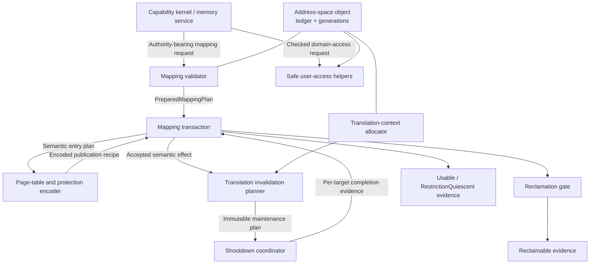
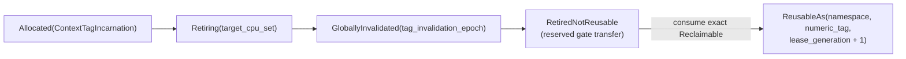
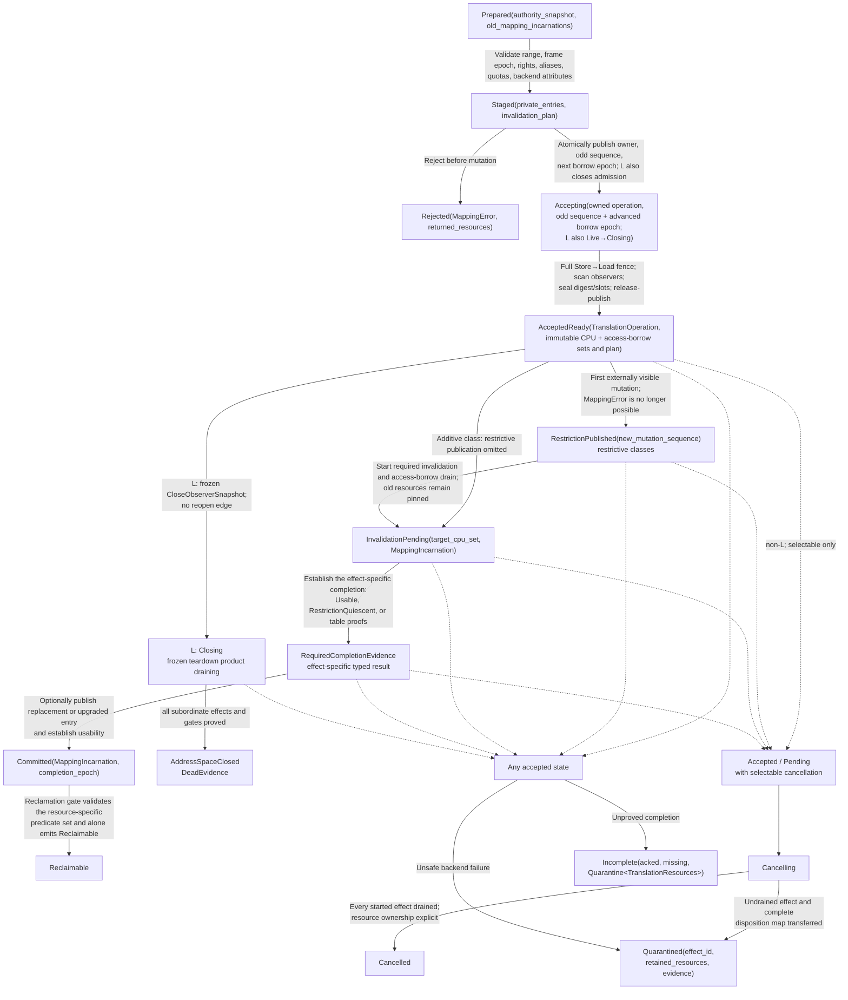

# Address translation and protection transitions

The address-translation component should be a capability-checked transaction
engine, not a collection of page-table helpers. Its externally meaningful
result is a protection transition with a stated completion scope. A page-table
store is only an internal step.

The recommended first implementation uses one semantic, kernel-owned
translation-root bundle per address space—normally one page-table hierarchy,
or a profile-required paired root installed and retired atomically—plus
immutable mapping identities, generation-tagged ASID/PCID leases, an ordered
CPU-activation protocol, eager acknowledged
invalidation for restrictive changes exposed through a split-phase operation,
and reclamation gated by independent CPU-translation, hardware-walker,
software-reader, pin/borrow, DMA/device, and executable-code quiescence.
Range batching and conservative CPU targeting are baseline features. Lazy
invalidation, access-bit targeting, and NUMA page-table replication are later
optimizations that may change cost but not any returned postcondition.

This is a proposed implementation for the architecture developed in [Kernel
hardware and architecture support
layer](../kernel-hardware-and-architecture-support-layer.md), not evidence that
the protocol has been implemented or verified.

## Question, scope, and operational standard

The question is:

> How should an authorized map, protect, replace, or unmap request become an
> architecturally complete protection change on every CPU that could observe
> the old translation, and how may privileged code access domain memory without
> acquiring an ambient or unbounded alias?

The component owns:

- encoding and mutating CPU translation structures;
- ASID-, PCID-, or equivalent context-tag allocation and reuse;
- validation of representable permissions, memory types, sizes, and aliases;
- local translation maintenance and remote shootdown;
- coordination between address-space activation and mutation;
- safe lifetime of page-table pages and replaced frames; and
- bounded, fault-recoverable access to user memory from privileged code.

It does not choose physical frames, replacement policy, managed-runtime heap
layout, copy-on-write policy, module authenticity, or which service deserves a
mapping. Those decisions remain in the capability kernel and its user-level
memory or runtime services.

A first implementation is adequate only if it demonstrates all of these
postconditions:

1. A caller cannot create a translation without current authority over both
   the address space and the frame, constrained by each object's rights.
2. A returned restrictive-completion token proves that every CPU incarnation
   in the frozen may-hold set—including offline-in-progress and unresponsive
   targets—has either reached the required completion class or is covered by
   exact terminal lifecycle-exclusion evidence.
3. A CPU joining the address space concurrently either participates in the
   transition or observes its completed generation before executing there.
4. An ASID or PCID numeric value cannot connect stale translations to a later
   address-space incarnation.
5. A removed frame, mapping identity, or page-table page cannot be reused
   until its resource-specific predicate set is satisfied. That set can include
   CPU translation and privileged-access closure, hardware-walker and software-
   reader quiescence, reference/pin release, executable-code quiescence, DMA
   and device completion, and terminal lifecycle exclusion.
6. No persistent writable-and-executable path exists in the baseline.
7. A private executable leaf can become live before fetch synchronization only
   while a checked suspension prevents every execution and activation of the
   complete target address space; publication and suspension release are one
   terminal commit.
8. Failure to obtain remote completion produces an explicit contained state;
   it never becomes fabricated success.
9. The same mandatory contract runs unchanged over two materially different
   ISA backends, with differences represented as feature data or backend
   plans.

## What the evidence establishes

The sources support constraints and precedents, not this exact object model.

| Evidence | Supported conclusion | What it does not establish |
| --- | --- | --- |
| [Relaxed virtual memory in Armv8-A](../../30-sources/simner-et-al-2022-relaxed-virtual-memory.md) | Page-table mutation, concurrent walks, barriers, invalidation, and reuse form a protocol; Arm break-before-make has precise preconditions | A portable kernel transaction API or correctness on x86 and RISC-V |
| [Arm A-profile manual](../../30-sources/arm-2026-a-profile-system-architecture-documentation.md), [Intel system-programming manual](../../30-sources/intel-2026-system-programming-documentation.md), and [RISC-V privileged ISA](../../30-sources/risc-v-international-2026-privileged-architecture.md) | Each ISA exposes different entry formats, context identifiers, invalidation scopes, and ordering rules | That one instruction or identical table format can implement the common contract |
| [RISC-V SBI 3.0](../../30-sources/risc-v-international-2025-supervisor-binary-interface.md) | A supervisor may request range- and ASID-scoped remote fences through a fallible higher-privilege interface; `SBI_SUCCESS` reports successful request transmission | The SBI return alone does not establish target execution, architectural completion, or reclamation safety |
| [Linux cache/TLB APIs](../../30-sources/linux-kernel-community-2026-low-level-core-apis.md) | A mature portable kernel specifies caller-visible cache/TLB effects and leaves instruction sequences to ports | That Linux's data structures or compatibility surface are minimal here |
| [Page-access-tracked shootdown](../../30-sources/amit-2017-optimizing-tlb-shootdown.md) | Hardware evidence can eliminate some remote invalidations and materially improve selected workloads | A sound cross-ISA baseline; tracking itself can add cost |
| [Hydra](../../30-sources/gao-et-al-2024-scalable-page-table-tlb.md) | NUMA placement, page-table replication, sharer tracking, and shootdown cost are coupled | That replication belongs in a small first implementation |
| [Least-privilege memory protection](../../30-sources/achermann-et-al-2019-least-privilege-memory-protection.md) | Authority to configure a translator is distinct from authority to access the translated memory | The project's concrete capability types or teardown protocol |
| [L4 lessons](../../30-sources/elphinstone-heiser-2013-l4-lessons.md) and the [seL4 manual](../../30-sources/sel4-foundation-2026-reference-manual.md) | Address spaces and mappings can remain small capability-mediated kernel mechanisms while paging policy stays outside privilege | That similar names transfer seL4's proofs or performance |

Two negative lessons are as important as the positive evidence. Ordinary CPU
cache coherence does not imply translation coherence, and a formal memory
model for ordinary loads and stores does not automatically cover page-table
walkers. The implementation must maintain a claim ledger identifying which
architecture rule justifies each step.

## Internal service deep dives

The integrated transition protocol is decomposed into nine internal services:

| Service | Contract contribution |
| --- | --- |
| [Address-space object](address-translation-and-protection-transitions/address-space-object.md) | Binds durable identity, authority, semantic mapping ledger, translation roots, generations, CPU activation, and teardown accounting |
| [Mapping validator](address-translation-and-protection-transitions/mapping-validator.md) | Turns an untrusted declarative request into a completely reserved, generation-bound plan or rejects before visible mutation |
| [Page-table and protection encoder](address-translation-and-protection-transitions/page-table-and-protection-encoder.md) | Solely constructs typed ISA descriptors and returns exact publication, invalidation, and retirement obligations without deciding policy |
| [Mapping transaction](address-translation-and-protection-transitions/mapping-transaction.md) | Owns acceptance, overlapping-mutation serialization, publication, invalidation, retained resources, cancellation, and exactly-once terminal evidence |
| [Translation-context allocator](address-translation-and-protection-transitions/translation-context-allocator.md) | Treats finite ASID/PCID-like values as generation-tagged leases rather than object identity |
| [Translation invalidation planner](address-translation-and-protection-transitions/invalidation-planner.md) | Compiles one accepted semantic effect into an immutable architecture-, revision-, and erratum-specific maintenance plan that may strengthen but never weaken |
| [Shootdown coordinator](address-translation-and-protection-transitions/shootdown-coordinator.md) | Freezes CPU-incarnation-aware targets, executes bounded per-target work, and distinguishes request delivery from architectural completion |
| [Reclamation gate](address-translation-and-protection-transitions/reclamation-gate.md) | Joins separately produced CPU, walker, software-reader, pin, code, IOMMU, and device-drain evidence before reuse |
| [Safe user-access helpers](address-translation-and-protection-transitions/safe-user-access-helpers.md) | Provides checked, bounded, architecture-gated copy and probe operations with explicit partial-fault and snapshot semantics |

These are review and ownership boundaries inside component 3, not nine public
daemons or mutually trusting subsystems. The [component research
index](address-translation-and-protection-transitions/README.md) inventories the
reports. Each report is authoritative for its internal object and local state
machine; this parent note remains authoritative for cross-service ordering,
ownership handoffs, and caller-visible completion semantics.

## Recommended component boundary

The portable part should manipulate semantic objects and plans. Only the
backend should construct page-table entries, select invalidation instructions,
or encode architecture-specific attributes.



Drivers, BEAM schedulers, native extensions, and memory servers never receive
a raw page-table pointer. An unprivileged memory service may decide *what* to
map, but an invocation crossing the kernel boundary revalidates authority and
executes the transition. Component 3 has no public operation that grants
execute authority. Component 4 is the sole public executable-code publication
orchestrator and may invoke the private translation effects described below
only with an unforgeable `Authorized<CodePublication>` proof.

## Object model

### `AddressSpace`

An address space records:

- an immutable object identity and incarnation;
- one typed, kernel-owned `BackendRoots` bundle;
- a backend format and immutable translation-feature profile;
- a mutation sequence and completion epoch;
- an `ActiveCpuSet` with per-CPU observed sequence;
- an immutable, generation-bound translation-catch-up state that owns the
  actual maintenance programs, live binding/root pins, and per-CPU observations
  needed by a CPU behind that sequence;
- a generation-checked execution-admission gate whose owner map composes
  lifecycle close with executable-publication suspensions;
- a reference to component 4's persistent code-publication generation state,
  including each CPU incarnation's observed generation;
- a privileged user-access borrow epoch and live-borrow ledger;
- a bounded `ContextTagBindingSet` containing every scope-specific lease and
  its complete namespace/lease incarnation, root fingerprint, and profile;
- a generation-checked reference-admission anchor and registered lineage/pin
  gates shared by every mapping-reference and grant-template descendant;
- a mapping ledger indexed by range and mapping identity; and
- state `Constructing`, `Live`, `Closing`, `Quarantined`, or `Dead`.

The object has one baseline lifecycle and mutation-owning protection-domain
incarnation. Multiple execution contexts belonging to that domain may share
and activate it; the evidence does not imply one thread per address space.
Shared frames are represented by multiple mappings, not by sharing an address-
space root between independently recoverable principals. That keeps domain
teardown and the active-CPU set unambiguous.

The translation-catch-up state is a persistent object, not a digest-only
annotation. As specified in the [address-space object](address-translation-and-protection-transitions/address-space-object.md),
it owns typed live binding/root records and pins plus either one immutable
profile-specific program proved to dominate every earlier mutation sequence or
the actual retained incremental program chain. Stable-even terminal publication
atomically installs that object and sequence; old objects remain pinned until
no activation reader or lagging CPU can require them.

### `Mapping`

The capability kernel's existing mapping object is the durable identity for
one relation:

```text
(mapping_id,
 mapping_generation,
 address_space incarnation,
 virtual range,
 frame identity/incarnation and offset,
 canonical physical extent and backing lineage,
 admitted frame-authority epoch,
 maximum rights,
 effective rights,
 memory type)
```

`MappingIncarnation` is the nominal pair `(mapping_id, mapping_generation)`;
neither field is valid evidence alone. An authority-bearing `MappingRef` binds
that pair to the address-space incarnation, independently attenuated operation
rights, an immutable `capability_access_ceiling`, and a capability generation.
Derived handles can only remove verbs or lower that access ceiling. `Add` and
`Replace` return a new authorized `MappingRef` so later protect or unmap
requests never identify a relation by range or bare generation.

`MappingRefGrantTemplateIncarnation` is the nominal pair
`(grant_template_id, grant_template_generation)`; a bare generation cannot
identify or replay one template as another. Neither operation invents the new
reference's verbs. Its request carries a generation-checked
`MappingRefGrantTemplate` bound to the address-space incarnation, a nominal
`ReferenceLineageIncarnation`, the observed reference-admission epoch, and an
`authorized_mapping_range`. `Add` requires the relation to
lie within both that range and the `MapWithin` range, then intersects the
template with the `MapWithin` output envelope; `Replace` requires the new
relation to lie within the template range and also intersects it with the old
presented reference. The result mints exactly that admitted verb set and access
ceiling, so add-only or replace-only authority cannot turn into protect,
unmap, inspect, write, or execute authority.
Pre-effect rejection returns the unchanged template. Acceptance consumes it
into a one-shot, operation-owned `AdmittedOutputRefGrant`; a request digest is
only an integrity commitment and cannot itself mint the asynchronous result.

`ReferenceLineageIncarnation = (reference_lineage_id,
reference_lineage_generation)` and `ReferenceGateIncarnation =
(reference_gate_id, reference_gate_generation)` are likewise nominal pairs;
neither member alone is authority or completion evidence. Each `MappingRef` and
grant template carries both exact pairs and the observed admission epoch.

Reference attenuation and grant-template creation are publish-time operations,
not offline copying of capability bits. They prepare a private descendant and
then atomically recheck an address-space `ReferenceAdmissionAnchor` whose state
is `Open(epoch)`. Descendants share the already-registered nominal lineage gate,
so attenuation creates no untracked close obligation. Class `L` changes that
anchor to `Closing(close_operation_id, epoch + 1)` in the same lifecycle-gate
linearization as `Live` → `Closing`. A derivation that won first is covered by
the frozen lineage gate; a derivation that lost cannot publish. A newly mapped
relation uses the output template's already-registered exact lineage/gate. Its
accepted writer atomically transfers the template's reference obligation to the
minted result reference before the terminal becomes visible; it does not create
a second lineage or gate.

The first output template is issued by an explicit root-template transition.
It privately allocates fresh nominal lineage/gate incarnations, then, while
holding the address-space lifecycle gate, rechecks the borrowed
`GrantMappingRefWithin` envelope and `ReferenceAdmissionAnchor == Open(epoch)`.
It atomically inserts the gate and publishes the template carrying that exact
epoch, or publishes neither and returns a typed rejection. Later attenuation
increments/participates in that registered gate and can only narrow the
template; it never bootstraps an unregistered lineage.

Executable target authority is a distinct
`AddressSpaceRef<PublishCodeWithin(range, profile)>` accepted only by component
4's public code lifecycle and borrowed for each admission, so bounded repeated
use remains possible until revocation or close. It grants neither an image nor scheduler eligibility.
Component 4 joins it with exact `SealedCode`—including the complete page-
granular initialized-plus-zeroed extent—and a scheduler-issued, generation-
bound complete `PublicationSetWitness`. Only after revalidating that three-way
join may it mint the crate-private `Authorized<CodePublication>` bound to the
exact image, target space/range/profile, runtime-domain incarnation, and CPU
set. The general translation API cannot mint or accept that witness.

A replacement at the same virtual address creates a new identity. An old
completion token therefore cannot protect, unmap, or release the replacement.
The mapping object's immutable maximum-rights ceiling and the presented
handle's independently attenuated access ceiling together prevent a copied
handle from reconstructing execute or write authority later.

### `PageTablePage`

Page-table memory is a typed kernel object with one owner, level, format, and
generation. It is never writable through an ordinary domain mapping. Its
lifetime is pinned from the first live parent entry until every walker and
cached translation that could reach it is quiescent.

`TablePageIncarnation` is the nominal pair `(table_page_id,
table_generation)`. As with mappings, a bare generation never identifies a
table page or satisfies a detach or reclamation obligation.

`MetadataIncarnation` is likewise the nominal pair `(metadata_object_id,
metadata_generation)` for a software-visible mapping, reverse-map, ownership,
or topology record. Software-reader quiescence is keyed to that exact pair;
neither an address nor a generation counter on its own can discharge the
obligation for a retired record.

### `ContextTagLease`

Hardware commonly sees only a bounded numeric ASID or PCID; software attaches
namespace and per-lease generations. `ContextTagIncarnation` is the nominal
tuple `(namespace_id, namespace_generation, numeric_tag, lease_id,
lease_generation)`, bound to one address-space incarnation, root fingerprint,
scope/regime, and profile. No tuple field alone is reuse evidence. Reuse follows
this rule:

```text
ContextBindingKey =
    PerCpu(cpu_identity, cpu_incarnation, namespace_id) |
    CoherenceDomain(domain_id, domain_generation, namespace_id) |
    SystemWide(namespace_id) |
    VirtualMachine(vm_id, vm_incarnation, namespace_id)

TargetTranslationBinding {
    binding_key: ContextBindingKey,
    address_space: AddressSpaceIncarnation,
    context_tag: ContextTagIncarnation,
    root_fingerprint,
    lease_retirement_epoch,
    profile_id
}

AliasSlotIncarnation = (window_slot_id, slot_generation)
AliasOperationIncarnation = (alias_operation_id, operation_generation)

ObserverTranslationBinding =
    TargetRoot(binding: TargetTranslationBinding) |
    TemporaryAlias {
        target_address_space: AddressSpaceIncarnation,
        cpu: (CpuIdentity, CpuIncarnation),
        alias_slot: AliasSlotIncarnation,
        alias_operation: AliasOperationIncarnation,
        alias_reservation_id,
        private_kernel_context_fingerprint,
        profile_id
    }

ContextTagBindingSet =
    BoundedMap<ContextBindingKey, ContextTagLease>
```

Both temporary-alias identities are nominal pairs: a slot generation or
operation generation without its object ID cannot select an alias or validate
release evidence. The complete observer set—and therefore every plan, request,
completion, and terminal digest—carries both pairs.

The address-space object may therefore hold several simultaneous leases. For a
per-CPU or per-hart namespace, numeric equality on two CPUs does not collapse
those leases into one identity. Activation, invalidation planning, and
shootdown resolve each target-root observer to its exact
`TargetTranslationBinding`. A CPU may instead—or also—retain an operation-owned
temporary alias under a private kernel context. Planning therefore binds a
nonempty bounded set of `ObserverTranslationBinding` values per target CPU:
`TargetRoot` carries the context-tag/root identity, while `TemporaryAlias`
carries the alias slot, operation, reservation, private kernel-context, and
profile identity without inventing an unused address-space tag. Binding
resolution precedes publication of `Entering`, so every frozen activation
record already contributes `TargetRoot`; no target slot fabricates a lease.

Each lease distinguishes current root residency from a cumulative,
generation-bound `may_hold_cpus` set. Installing a root adds the CPU incarnation
to both; switching to a safe root clears current residency but leaves may-hold
membership until an exact profile-required invalidation completes or CPU
lifecycle proves exclusion. Every translation-affecting plan that claims
`Usable`, `CpuTranslationQuiescent`, or `RestrictionQuiescent` freezes that
historical set, union all in-progress install/load/restore/enter states, for
each affected binding; current `Active` membership is not a substitute. Tag
retirement binds the same complete target snapshot to its exact retirement
epoch, so a cleared software slot cannot justify either frame/table reuse or
numeric-tag reuse while stale TLB entries remain.

Publication or ordinary removal of a `ContextTagBindingSet` entry participates
in the same address-space lifecycle/mutation gate as class-`L` close. A numeric
tag may be reserved before that point, but it becomes an installable binding
only after the registrar holds the gate and revalidates the exact live
incarnation, root/profile, and mutation sequence. The linearization therefore
orders every registrar against `Live` → `Closing`: a binding is either visible
to the frozen close snapshot, or the losing registrar must withdraw its
unexposed reservation; uncertain partial publication is transferred to close
or quarantine. No live binding may arrive after the snapshot.



`tag_invalidation_epoch` belongs to the context-lease retirement protocol and
is not the address-space `completion_epoch` assigned when a
`TranslationTerminal` is published.

If a backend cannot invalidate one tag reliably, rollover flushes the required
broader scope and separately advances `namespace_generation`; ordinary lease
retirement advances `lease_generation`. Numeric equality is never object
identity.

### `MappingTransaction`

A transaction owns the authority snapshot, affected ranges, old and new
mapping identities, page-table locks or ownership, invalidation plan, target
CPU set, and charged work budget. It can batch adjacent changes, but all
entries in one atomic commit must share a failure-containment and forward-
completion strategy. Only private pre-acceptance reservations can be unwound;
an accepted live effect proceeds to typed completion or quarantine.

Preparation may still reject without changing architectural state. Acceptance
closes new activation and privileged-access-borrow acquisition when required,
freezes the exact target CPU identities/incarnations and old access-borrow
epoch/set, moves the transaction, completion slots, page-table/frame pins, and
teardown budget into one `TranslationOperation`, and reserves the affected
`MappingIncarnation` values. Those resources remain operation-owned until a terminal
result atomically returns them to the caller, commits them to a live mapping,
transfers them to a reclamation gate, or moves them into a named quarantine;
caller timeout does not release them.

## Mapping classes and required completion

Different mutations require different proofs. Treating them alike is correct
only when the strongest path is used.

| Change class | Principal hazard | Minimum returned result |
| --- | --- | --- |
| New mapping into a previously invalid range | A negative translation cache or incomplete page-table publication may delay visibility | `Usable(epoch, scope)` after backend-required publication and any invalidation |
| Permission upgrade | A stale restrictive translation may fault or deny intended access | `Usable(epoch, scope)` before promising the new right |
| Permission reduction | A stale permissive translation or privileged helper borrow can bypass policy | `RestrictionQuiescent(operation)` |
| Unmap | A stale translation or privileged helper can access a frame after logical removal | `RestrictionQuiescent` completes old-access closure; frame reuse additionally awaits every predicate required by the reclamation gate |
| Physical replacement at one virtual address | Stale translation or helper borrow can reach the wrong frame; some ISAs require break-before-make | Break old mapping, establish `RestrictionQuiescent`, then publish and establish `Usable` for the new mapping |
| Memory-type or cacheability change | Conflicting aliases can violate architectural rules or corrupt data | Close old CPU access with `RestrictionQuiescent`, apply the backend-specific alias/cache protocol, and establish new usability |
| Add execute permission | Instruction fetch may see stale or partial bytes, and a direct branch bypasses runtime dispatch policy | No public translation operation; component 3 first supplies per-address-space CPU-writer restriction plans for `CodeSealQuiescent`. A later `SealedCode`-bound `ExecutableEnablePlan` may install RX only while component 4 holds an exact `AddressSpaceExecutionSuspension<Held>`; that suspension remains held through every CPU's fetch synchronization and is released atomically with `PublishedCode` |
| Page-table-page removal | A hardware or software walker may retain or fetch the old table | `CpuTranslationQuiescent`, `HardwareWalkerQuiescent`, and `SoftwareReaderQuiescent` before the reclamation gate may authorize page-table retyping |
| Address-space close | Activations, helper borrows, tag bindings, roots, mappings, code, DMA, or other references may preserve the dying incarnation | A checked `AddressSpaceClosed(..., DeadEvidence)` product covering every subordinate restriction/table result, all tag retirements, and every code/DMA/reference gate; otherwise quarantine |

The public API must not return a bare Boolean. Submission returns either a
pre-mutation `Rejected` result or an accepted operation naming the exact
mapping incarnations, normalized effect set, frozen target CPU set, and owned
completion record. Polling that operation yields its exactly-once terminal
result and completion epoch.

## Completion vocabulary and implication boundaries

These names are authoritative across the nine service reports. Milestones are
not interchangeable, and only the reclamation gate emits `Reclaimable`:

| Evidence or state | Exact meaning | Does not imply |
| --- | --- | --- |
| `RestrictionPublished` | The restrictive descriptor or detached relation is live and operation-owned | Any CPU, helper, walker, or device has stopped using the old meaning |
| `RequestAccepted` | The coordinator durably owns the complete immutable operation | Notification, delivery, handler entry, local execution, or semantic completion |
| `NotificationSent` | The platform transport accepted/sent a notification attempt to the named target | Delivery, handler entry, local execution, or semantic completion |
| `CpuUserReturnClosed(cpu)` | This CPU incarnation cannot return to the affected user context without passing its pending-generation gate | Privileged helper borrows are drained, or local maintenance ran |
| `LocalMaintenanceComplete(cpu, plan)` | The named CPU incarnation executed the immutable local architecture program | All targets completed, or privileged helper/software/device readers are gone |
| `TargetSetCompleted(operation, per_target_required_class, target_set)` | Every frozen target produced the named per-target class or valid lifecycle-exclusion evidence | `CpuTranslationQuiescent` unless every live target completed the exact translation-maintenance plan; access, walker, DMA, code, reference, or reclamation quiescence |
| `CpuTranslationQuiescent(operation, target_set)` | Every frozen may-hold CPU target completed the required local plan or was terminally excluded, so no cached translation or in-flight leaf walk can later install or use the superseded mapping | Privileged helper borrows, detached table-page walkers, software readers, DMA, code references, or pins are quiescent |
| `CpuAccessQuiescent(operation)` | New privileged user-access borrows are closed and every borrow from the frozen old borrow epoch/set has drained or been terminally excluded | Translation caches, hardware table walkers, software readers, or devices are quiescent |
| `RestrictionQuiescent(operation)` | `CpuTranslationQuiescent` and `CpuAccessQuiescent` both hold for the exact restrictive effect | An old frame, table page, tag, code generation, or device-visible resource is generally reclaimable |
| `Usable(epoch, scope)` | The requested new mapping semantics are observable under the frozen backend profile and declared scope | Old-resource reclamation or stronger security-domain quiescence |
| `HardwareWalkerQuiescent(table)` | After detachment, no hardware page-table walker can still interpret the named table page as translation structure | CPU-translation, ordinary-frame, tag-lease, software-reader, DMA, or code quiescence |
| `SoftwareReaderQuiescent(metadata)` | All pre-existing instrumented kernel readers of the named metadata have exited | Hardware, TLB, device, or code completion |
| `ContextTagRetirementPrepared(binding)` | The exact address-space/root/profile binding is noninstallable; its cumulative generation-bound may-hold CPU set union every installing/loading-root/installed/restoring-safe-context or activation-entering target is discharged; each frozen install attempt is prevented from loading after acknowledgement and is followed by ordered exact-binding invalidation or validated terminal lifecycle exclusion; and the allocator binds a non-reusable old lease to its proposed terminal retirement transfer | Numeric-tag reuse, successor incarnation, reference release, or reclamation of mappings, roots, and frames |
| `DmaQuiescent` / `CodeQuiescent` / `ReferenceQuiescent` | The named device, executable, or explicit ownership domain has discharged its old-generation obligations | Any different predicate domain |
| `CodeSealQuiescent(image, seal_generation)` | Component 4 has joined exact CPU `RestrictionQuiescent`, DMA/device, diagnostic/temporary-alias, frame-write-authority, and final alias-ledger proofs for the complete frozen writer set | Publication/fetch completion, execution quiescence, or general resource reclamation |
| `LifecycleExcluded(agent)` | The exact CPU/device incarnation is proved unable to resume with old state | Completion by any live agent or discharge of unrelated resources |
| `Reclaimable(resource)` | The reclamation gate atomically validated the complete predicate set for this exact resource and incarnation | Safety for any replacement resource or incarnation |

One scalar “completion class” cannot describe a composite change such as
restriction plus table detach. The validator, transaction engine, and planner
therefore pass this typed conjunction:

```text
ContextTagRetirementObligation {
  obligation_id,
  binding: TargetTranslationBinding,
  retirement_epoch
}

CompletionRequirements {
  requirements_id,
  effect_obligations:
      BoundedMap<EffectObligationId, EffectRequirement>,
  per_target_required_class:
      Option<CpuUserReturnClosed | LocalMaintenanceComplete>,
  require_cpu_translation_quiescence,
  require_cpu_access_quiescence,
  hardware_walker_obligations: Set<TablePageIncarnation>,
  software_reader_obligations: Set<MetadataIncarnation>,
  context_tag_retirement_obligations: Set<ContextTagRetirementObligation>,
  usability_scope: Option<UsabilityScope>,
  external_obligations:
      BoundedSet<ExternalCompletionObligation, MAX_EXTERNAL_OBLIGATIONS>,
  checked_refinement_digest
}

EffectRequirement {
  semantic: EffectSemantic,
  existing_relation_authority:
      Option<ExistingRelationAuthorityOrigin>,
  software_reader_obligations: Set<MetadataIncarnation>,
  context_tag_retirement_obligations: Set<ContextTagRetirementObligation>,
  external_obligations: Set<ExternalObligationId>
}

ExistingRelationAuthorityOrigin =
    CallerMappingRef {
      effect_obligation_id,
      source_input_mapping_ref_digest
    } |
    DelegatedAddressSpaceClose {
      parent_close_operation_id,
      close_authority_snapshot_digest,
      frozen_mapping_membership_digest
    } |
    DelegatedCodeSeal {
      code_seal_operation_id,
      executable_image_incarnation,
      writer_alias: MappingIncarnation,
      code_seal_authority_and_alias_set_digest
    }

ExistingRelationAuthorityResult =
    CallerReturned {
      returned_input_mapping_ref_slot: EffectObligationId,
      source_input_mapping_ref_digest
    } |
    CallerConsumed {
      source_input_mapping_ref_digest,
      capability_and_relation_revocation_proof_digest
    } |
    DelegatedEffectCompleted {
      authority_origin_digest,
      parent_operation_and_effect_binding_digest
    }

EffectSemantic =
    Add { proposed_mapping: MappingIncarnation, usability_scope }
  | Upgrade { mapping: MappingIncarnation,
              new_effective_rights,
              usability_scope }
  | Reduce { mapping: MappingIncarnation, new_effective_rights }
  | Unmap { mapping: MappingIncarnation }
  | Replacement { old_mapping: MappingIncarnation,
                  proposed_mapping: MappingIncarnation,
                  usability_scope }
  | TableDetach { table: TablePageIncarnation,
                  require_old_access_closure }
  | MetadataObservation { mapping: MappingIncarnation, confidence }
  | AddressSpaceClose { address_space: AddressSpaceIncarnation,
                        close_operation_id,
                        accepted_mutation_sequence,
                        observer_snapshot:
                            DeferredUntilAcceptance(
                                snapshot_slot_id,
                                bounded_capacity_commitment) |
                            Frozen(close_observer_snapshot_digest,
                                   subordinate_effect_ids) }

ExternalCompletionObligation =
    Code { obligation_id, executable_image_incarnation, required_code_proof }
  | Dma { obligation_id, dma_binding_and_device_incarnations,
          required_iommu_device_transport_proofs }
  | Cache { obligation_id, canonical_physical_extent_and_lineage,
            profile_rule_and_completion_point }
  | Reference { obligation_id,
                address_space: AddressSpaceIncarnation,
                reference_admission_epoch,
                lineage: ReferenceLineageIncarnation,
                gate: ReferenceGateIncarnation,
                required_reference_quiescence }

TranslationSuccess {
  requirements_id,
  results: BoundedMap<EffectObligationId, EffectResultRecord>
}

EffectResultRecord {
  semantic_result: EffectResult,
  software_reader_proofs:
      BoundedMap<MetadataIncarnation, SoftwareReaderQuiescent>,
  context_tag_retirement_proofs:
      BoundedMap<ContextTagRetirementObligation,
                 ContextTagRetirementPrepared>,
  external_completion_proofs:
      BoundedMap<ExternalObligationId, ExternalCompletionProof>
}

EffectResult =
    AddCompleted(new_mapping_ref_slot: EffectObligationId,
                 new_mapping_ref_identity_digest,
                 Usable)
  | UpgradeCompleted(
        authority_result: ExistingRelationAuthorityResult,
        new_effective_rights,
        Usable)
  | ReductionCompleted(
        authority_result: ExistingRelationAuthorityResult,
        new_effective_rights,
        RestrictionQuiescent)
  | UnmapCompleted(retired_mapping: MappingIncarnation,
                   authority_result: ExistingRelationAuthorityResult,
                   RestrictionQuiescent)
  | ReplacementCompleted(old_mapping: MappingIncarnation,
                         authority_result: ExistingRelationAuthorityResult,
                         RestrictionQuiescent,
                         new_mapping_ref_slot: EffectObligationId,
                         new_mapping_ref_identity_digest,
                         Usable)
  | TableDetached(table: TablePageIncarnation,
                  CpuTranslationQuiescent,
                  Option<RestrictionQuiescent>,
                  HardwareWalkerQuiescent,
                  retirement_reservation:
                      RetirementReservationIncarnation,
                  proposed_reclamation_transfer_binding_digest)
  | MetadataObserved(mapping: MappingIncarnation, AccessObservation)
  | AddressSpaceClosed(address_space: AddressSpaceIncarnation,
                       dead_evidence: DeadEvidence)

ContextTagRetirementPrepared {
  binding: TargetTranslationBinding,
  retirement_epoch,
  frozen_may_hold_and_install_state_digest,
  install_load_exclusion_and_ordered_binding_discharge_digest,
  exact_target_completion_or_lifecycle_digest,
  proposed_reclamation_transfer_binding_digest,
  disposition: RetiredNotReusable(
      retirement_reservation: RetirementReservationIncarnation)
}

DeadEvidence {
  address_space: AddressSpaceIncarnation,
  close_operation_id,
  accepted_mutation_sequence,
  close_observer_snapshot_digest,
  activation_drain_digest,
  access_borrow_drain_digest,
  translation_catchup_state_reader_lag_and_pin_disposition_digest,
  mapping_and_root_effect_result_digests,
  context_tag_retirement_proof_digest,
  accepted_operation_and_grant_disposition_digest,
  code_publication_generation_state_disposition_digest,
  code_dma_and_reference_proof_digest,
  final_state: Dead,
  evidence_digest
}

CloseObserverSnapshot {
  address_space: AddressSpaceIncarnation,
  close_operation_id,
  accepted_mutation_sequence,
  frozen_active_and_entering_cpu_incarnations,
  frozen_access_borrow_epoch_and_records,
  frozen_translation_catchup_state_and_observation_sidecar_incarnations,
  frozen_translation_catchup_readers_lagging_cpus_and_owned_binding_root_pins,
  frozen_context_tag_bindings,
  frozen_mapping_and_root_incarnations,
  frozen_prior_non_close_translation_operation_and_admitted_grant_ids,
  frozen_code_publication_operation_incarnations,
  frozen_code_retirement_operation_incarnations,
  frozen_code_publication_generation_state_incarnation_generation_and_digest,
  frozen_code_publication_observation_sidecar_incarnation_and_records,
  frozen_code_publication_version_entries_programs_extent_pins_and_readers,
  frozen_code_and_dma_gate_ids,
  frozen_reference_admission_epoch_and_lineage_pin_gate_incarnations,
  reserved_teardown_recovery_incarnation_and_facets,
  snapshot_digest
}

SubordinateCompensationResult {
  compensation_id,
  parent_operation_id,
  original_effect_obligation_id,
  original_effect_binding_digest,
  selected_forward_effect,
  checked_subordinate_requirements_id,
  parent_admission_token_delegation_digest,
  subordinate_accepted_mutation_sequence,
  frozen_observer_and_borrow_snapshot_digest,
  affected_binding_observer_snapshots_digest,
  subordinate_effect_result_and_proofs,
  final_mapping_state_digest,
  resource_disposition_digest,
  outcome:
      Completed(checked_safe_postcondition_digest) |
      RetainedByQuarantine(quarantine: QuarantineIncarnation),
  proof_digest
}

QuarantineIncarnation = (quarantine_id, quarantine_generation)

TranslationProgress {
  operation_id,
  address_space: AddressSpaceIncarnation,
  requirements_id,
  stage,
  acknowledged_targets,
  missing_targets,
  subordinate_evidence,
  retained_resource_summary
}

IncompleteDetails {
  operation_id,
  requirements_id,
  address_space: AddressSpaceIncarnation,
  affected_mapping_incarnations,
  acknowledged_targets,
  missing_targets,
  last_completed_stage,
  shootdown_incomplete_evidence:
      BoundedMap<(request_id, operation_id), ShootdownIncompleteEvidence>,
  retained_resources,
  retained_resource_quarantine: QuarantineIncarnation
}

CancellationResult {
  effect_dispositions:
      BoundedMap<EffectObligationId, CancellationEffectDisposition>,
  final_mapping_state_digest,
  resource_ownership_digest,
  checked_coverage_digest
}

CancellationEffectDisposition =
    NeverPublished(pre_effect_proof_digest) |
    LeftVisible(result: EffectResultRecord) |
    Compensated {
      subordinate_compensation: SubordinateCompensationResult
    } |
    RetainedByQuarantine {
      original_effect_progress_and_evidence_digest,
      retained_resource_and_authority_set_digest,
      quarantine: QuarantineIncarnation
    }

OutputRefGrantDisposition =
    ReturnedUnconsumed {
      grant_template:
          OneShotReturnSlot<Authorized<MappingRefGrantTemplate>>,
      grant_template_incarnation: MappingRefGrantTemplateIncarnation
    } |
    MintedAndReturned {
      grant_template: MappingRefGrantTemplateIncarnation,
      mapping_ref: OneShotReturnSlot<Authorized<MappingRef>>,
      effect_result_mapping_ref_identity_digest
    } |
    ConsumedByCompensation {
      grant_template: MappingRefGrantTemplateIncarnation,
      mapping: MappingIncarnation,
      compensation_id,
      subordinate_consumption_proof_digest
    } |
    RetainedByQuarantine {
      authority:
          QuarantineOwned<
              Authorized<MappingRefGrantTemplate> |
              Authorized<MappingRef>>,
      grant_template: MappingRefGrantTemplateIncarnation,
      quarantine: QuarantineIncarnation
    }

AcceptedInputMappingRef {
  effect_obligation_id,
  source_mapping_ref: Authorized<MappingRef>,
  source_mapping_ref_digest,
  accepted_for:
      Upgrade(mapping: MappingIncarnation,
              new_effective_rights,
              usability_scope) |
      Reduce(mapping: MappingIncarnation, new_effective_rights) |
      Unmap(mapping: MappingIncarnation) |
      Replacement(old_mapping: MappingIncarnation,
                  proposed_mapping: MappingIncarnation,
                  usability_scope),
  state: OperationOwned
}

InputMappingRefDisposition =
    ReturnedUnchanged {
      mapping_ref: OneShotReturnSlot<Authorized<MappingRef>>,
      source_input_mapping_ref_digest,
      terminal_effect_binding_digest
    } |
    ReturnedAttenuated {
      mapping_ref: OneShotReturnSlot<Authorized<MappingRef>>,
      source_input_mapping_ref_digest,
      requested_attenuation_and_derivation_digest,
      terminal_effect_binding_digest
    } |
    ConsumedByUnmap {
      mapping: MappingIncarnation,
      source_input_mapping_ref_digest,
      capability_and_relation_revocation_proof_digest
    } |
    ConsumedByReplacement {
      mapping: MappingIncarnation,
      source_input_mapping_ref_digest,
      capability_and_relation_revocation_proof_digest
    } |
    ConsumedByCompensation {
      mapping: MappingIncarnation,
      source_input_mapping_ref_digest,
      compensation_id,
      subordinate_result_and_consumption_proof_digest
    } |
    RetainedByQuarantine {
      mapping_ref: QuarantineOwned<Authorized<MappingRef>>,
      source_input_mapping_ref_digest,
      quarantine: QuarantineIncarnation
    }

TranslationTerminal {
  operation_id,
  address_space: AddressSpaceIncarnation,
  requirements_id,
  completion_epoch,
  outcome:
      Succeeded(TranslationSuccess) |
      Cancelled(CancellationResult) |
      Incomplete(IncompleteDetails) |
      Quarantined {
        reason,
        quarantine: QuarantineIncarnation,
        cancellation: Option<CancellationResult>
      },
  address_space_teardown_recovery:
      Option<OneShotReturnSlot<
          Authorized<AddressSpaceTeardownRecoveryRef, Inspect>>>,
  final_mapping_state,
  alias_ledger_disposition:
      RestoredPreEffect(alias_snapshot_digest) |
      Committed(final_alias_entry_set_digest) |
      RetainedByQuarantine(quarantine: QuarantineIncarnation),
  observer_gate_disposition:
      StableEven(
          mutation_sequence,
          translation_catchup_state_incarnation,
          translation_catchup_state_digest) |
      AddressSpaceDead(close_operation_id, dead_evidence_digest) |
      AddressSpaceQuarantined(quarantine: QuarantineIncarnation),
  output_ref_grant_dispositions:
      BoundedMap<EffectObligationId, OutputRefGrantDisposition>,
  input_mapping_ref_dispositions:
      BoundedMap<EffectObligationId, InputMappingRefDisposition>,
  close_authority_disposition:
      NotApplicable |
      ConsumedAtClosing {
        address_space: AddressSpaceIncarnation,
        capability_generation,
        close_operation_id,
        accepted_mutation_sequence,
        consumption_proof_digest
      },
  returned_resources,
  committed_resources,
  retired_resources,
  quarantined_resources,
  ownership_transfer_bundle_digest,
  completion_proofs,
  terminal_digest
}
```

The terminal constructor applies a canonical outcome/effect/gate compatibility
matrix and commits its validation digest in `TranslationTerminalCore` before
bundle sealing. A successful class `L` selects only `AddressSpaceDead` with the
matching close product. A `Quarantined` outcome, or an ownership partition that
transfers the address-space object itself, selects only
`AddressSpaceQuarantined` with the same quarantine incarnation. A resource-only
`IncompleteDetails.retained_resource_quarantine` does not imply address-space
quarantine. Any missing safety-critical translation, privileged-access, install-load-exclusion,
writer-closure, or lifecycle proof forces `AddressSpaceQuarantined`.
`Incomplete + StableEven` is admitted only when a checked fail-closed final
state proves every authority and isolation postcondition and the missing item
affects availability or usability only. It is forbidden for a restriction,
unmap, replacement break, close, or other effect whose missing proof could
preserve old access. Reclamation-gate seal validation rechecks the same matrix
rather than trusting the selected variants independently. The matrix also
requires `Some(exact preallocated one-shot recovery Inspect slot)` for every nonfatal,
non-success class-`L` terminal, and `None` for class-`L` success and every
non-`L` terminal. An actual containing-machine halt is a nonreturning
architecture-fault action outside this published terminal algebra.

A cancellation-originated `Quarantined` carries `Some` of the complete
`CancellationResult`; every original effect appears exactly once and every
unresolved subordinate or authority disposition names the same quarantine.
Other quarantine causes carry `None`. `Cancelled` cannot retain a quarantine
disposition, and cancellation uncertainty cannot select `Incomplete`.
The per-effect `RetainedByQuarantine` alternative is legal only in that
`Quarantined(Some(...))` result and carries the original effect's exact progress,
evidence, resources, and authorities into the same nominal quarantine; it
cannot masquerade as `Compensated`, `LeftVisible`, or `Cancelled`.

A `StableEven` variant is constructible only if the named
`TranslationCatchupGenerationState` is the actual new object installed in the
address space by the same terminal commit, its stable sequence equals the
variant's `mutation_sequence`, its digest recomputes from its owned binding/root
pins and executable program objects, and its program coverage dominates every
sequence that a still-admissible CPU may have observed. A digest without that
owned state cannot reopen the observer gate.

Callers cannot populate this record directly. A checked constructor compiles it
from the validated semantic delta and proves that every obligation has exactly
one matching result variant; `R` requires aggregate CPU-translation and access
quiescence, `X` requires old-access closure plus new usability, and each `T`
entry names one table and its CPU/walker/software-reader obligations. Every
`EffectRequirement` names its own metadata, context-tag retirement, and typed
code/DMA/cache/reference obligations;
the top-level sets are checked unions, and each result record contains exactly
the keyed proofs for its source requirement. A result record whose semantic
result is `TableDetached` therefore carries the complete map of matching
software-reader proofs, not one unbound token. Composite
work such as `X + T` carries multiple map entries and therefore returns a
product of results rather than one ambiguous success tag. Derived Boolean/set
fields must equal the union of their obligation variants.

The authority-origin field is also effect indexed. It is `Some` exactly for
`Upgrade`, `Reduce`, `Unmap`, and `Replacement`, and `None` for every other
semantic. A public effect uses `CallerMappingRef`; its embedded obligation ID
equals the containing map key and its source digest equals the accepted
reference. An internal close or code-seal effect instead uses the matching
delegated variant, bound to the exact parent operation, frozen membership or
alias set, and child effect semantic. Such a delegated effect carries no caller
`MappingRef`, creates no `AcceptedInputMappingRef`, and has no terminal input-
disposition entry.
The checked origin/semantic matrix permits `DelegatedAddressSpaceClose` only
for a `Reduce` or `Unmap` of a mapping in the frozen close membership, and
`DelegatedCodeSeal` only for a `Reduce` that removes every CPU-write right or an
`Unmap` of the exact frozen writer alias. Neither delegation can authorize
`Upgrade` or `Replacement`, and a delegated reduction cannot add any right.

Every completed existing-relation effect has exactly one authority result. For
a `CallerMappingRef` origin, `Upgrade` and `Reduce` use `CallerReturned`, while
`Unmap` and `Replacement` use `CallerConsumed`; the result's source digest and
effect-keyed slot or revocation proof must equal the accepted-input record.
For `Upgrade`, the requested rights, admitted semantic
`new_effective_rights`, completed-result `new_effective_rights`, final mapping
ledger rights, and decoded descriptor rights are exactly equal. For
either delegated origin, the only legal variant is
`DelegatedEffectCompleted`: `authority_origin_digest` equals the canonical
digest of the complete origin variant, and
`parent_operation_and_effect_binding_digest` binds that same parent operation,
the containing effect-obligation ID, and the complete `EffectSemantic`. A
caller result for a delegated origin, a delegated result for a caller origin,
or any omitted or extra authority result makes the completion product
unconstructible.

Context-tag union, equality, and result lookup use the complete
`ContextTagRetirementObligation`—obligation ID, exact
`TargetTranslationBinding`, and retirement epoch—not a numeric tag or
`ContextTagIncarnation` alone. This preserves scope, address-space/root/profile,
and retirement identity and prevents a proof for one binding from being
substituted for another.
Where `ContextTagRetirementPrepared` repeats binding and retirement epoch, its
checked constructor requires byte-for-byte equality with the map key and binds
the key's obligation ID. This preterminal product can express only
`RetiredNotReusable` plus the exact proposed reservation/transfer binding. The
terminal commit activates that reservation; only a later reclamation-gate
product that also includes reference release may let the allocator mint
`ReusableAs` and a successor lease incarnation.

For every `Add` or `Replacement`, the output-grant disposition carries the
exact nominal template incarnation. `ReturnedUnconsumed` places that actual
authorized object in a one-shot return slot. `MintedAndReturned` places the sole
new `Authorized<MappingRef>` in its own one-shot slot; the matching
`AddCompleted` or `ReplacementCompleted` record only names that effect-keyed
slot and its identity digest. The constructor checks the digest against the
slot's authority, admitted template incarnation, reference lineage/gate
incarnations, and admission epoch. The mint revalidates that exact already-
registered tuple and atomically moves the template's pin/obligation to the
result reference while the writer/lifecycle token remains held. Polling exposes
stable slot metadata; extracting authority consumes it once, and later polls
observe `AlreadyClaimed`. Neither a bare generation nor a digest can mint or
duplicate authority.

Acceptance moves each caller-presented `MappingRef` into an operation-owned
bounded map of `AcceptedInputMappingRef` values. Its keys are exactly those
`Upgrade`, `Reduce`, `Unmap`, and `Replacement` obligations whose
`existing_relation_authority` is `CallerMappingRef`. The terminal input-
disposition map has that identical key set and consumes each accepted record
once. A delegated existing-relation effect appears in neither map and instead
must carry the matching `DelegatedEffectCompleted` result described above;
generic resource lists or a digest cannot stand in for either authority path.
For each caller-originated entry, the canonical `source_mapping_ref_digest`
commits to the actual moved reference's address-space and mapping incarnations,
capability generation, verbs, immutable access ceiling, reference-lineage
incarnation, reference-gate incarnation, and observed reference-admission
epoch. Those fields and that digest must equal the prepared authority snapshot,
the accepted-input record, its `CallerMappingRef` origin, and the terminal
disposition; a digest that omits or changes any member cannot join the records.

Caller-originated `Upgrade` has no output-grant template. Its result names a one-shot terminal
slot whose `ReturnedUnchanged` disposition owns the exact presented reference,
including address-space/mapping incarnation, capability generation, verbs, and
immutable access ceiling, reference-lineage/gate incarnations, and observed
reference-admission epoch; it is not a new mint. `Reduce` returns that same
reference or an explicitly requested, checked attenuation in the named slot.
The source digest in either result must equal its accepted input. Extracting a
slot moves its authority once; repeated terminal polls cannot copy it.

Successful or left-visible caller-originated `Unmap` and `Replacement` consume the input and bind
the exact capability-and-relation revocation proof to their result. A
`NeverPublished` cancellation instead returns the actual unchanged authority.
Compensation must prove its exact consumption; uncertainty moves the actual
reference into a non-callable quarantine owner. Rejection, which precedes
operation ownership, returns the untouched input authority.

The observer-gate variant is effect checked: successful class `L` requires
`AddressSpaceDead` bound to the same close operation and `DeadEvidence` as its
`AddressSpaceClosed` result; it can never claim `StableEven`. That dead or
quarantine disposition is sealed into the same terminal-publication commit.
Within that atomic transition the nonactivatable gate state orders terminal
visibility, but no observer can see lifecycle death/quarantine without its
matching terminal, ownership transfer, and evidence record.

`completion_epoch` is allocated from the address-space object's monotonic
terminal-publication sequence and written into the private terminal record.
Before making the selected stable-even/dead/quarantine gate disposition
visible, the constructor seals the exact resource partition, every proposed
reclamation binding/reservation, and the epoch as a
`TerminalOwnershipTransferBundle` covered by the terminal digest. A sealing
failure publishes nothing and leaves the operation owner; recovery corrects the
private bundle or seals an all-resources quarantine disposition. After sealing,
one infallible locked commit advances the address-space `completion_epoch`,
transfers every returned/committed/retired/quarantined resource, activates and
seeds the reclamation records, and release-publishes the matching terminal.
Polling never observes an epoch, resource transfer, or result detached from the
same exactly-once publication.

An `AddressSpaceClose` requirement is admitted only with subordinate effect IDs
for every live mapping and root-table detach, retirement obligations for every
entry of the frozen `ContextTagBindingSet`, closed activation and access-borrow
snapshots, every frozen prior non-close operation/grant disposition, the exact
translation-catch-up states and code-publication generation state with every
reader/lagging-CPU obligation and owned program/binding/root/extent-pin
disposition, and all dependent code, DMA, and reference gates. Its result is
constructible only after those exact results and proofs establish state
`Dead`. Missing evidence retains the address-space incarnation and resources in
a named incomplete or quarantine record; generic mapping success cannot stand
for lifecycle completion.

An `IncompleteDetails` record preserves each coordinator-owned recovery object
as typed `ShootdownIncompleteEvidence`, including the exact request/operation,
plan, slot generations, per-target observer-binding sets, retained dispatch
records, and recovery handle. A target bitmap or generic resource list cannot
stand in for that tuple. The map is covered by the terminal and quarantine
digests, so late evidence can be recorded only in its named subordinate
`ShootdownRecoveryRecord`.
Each outer map key equals the embedded request/operation IDs. The top-level
acknowledged and missing target fields are checked projections of all embedded
typed target/CPU-incarnation/slot-generation partitions; they cannot disagree
with or replace those authoritative recovery records. Every embedded
`operation_id` is the owning mapping operation and, with its address-space
incarnation, must equal the containing `IncompleteDetails` and
`TranslationTerminal`. Requirements linkage is resolved through the exact
bound plan digest. At the atomic recovery cut, every unresolved slot is changed
to `RetainedForRecovery(exact ShootdownRecoveryIncarnation)` and receives a
sidecar with the same dispatch/request/operation/slot tuple. The recovery
handle's recovery, request, operation, address-space, and plan fields must equal
the evidence record byte-for-byte, and the recovery incarnation generation
must equal `recovery_cut_generation`; pre-cut evidence enters the completed
map, while post-cut evidence can update only that same nominal recovery object.
For non-class-`L` operations that update is diagnostic/internal and cannot
release quarantine or mint completion or reuse authority; this baseline defines
no non-`L` recovery capability. For class `L`, the evidence may contribute only
to the separate `AddressSpaceTeardownRecovery` transition described next, and
only through its authorized `Advance` facet.
Every nonfatal, non-success class-`L` terminal carries a stable one-shot slot
for the inspect-only reference to a separate `AddressSpaceTeardownRecovery`
record in the terminal's common recovery field; the designated supervisor
holds its `Advance` facet. Claiming that slot moves the reference once, and
later terminal polls report `AlreadyClaimed` rather than copying it.
Generation-bound late evidence may finish that record and atomically publish
`DeadEvidence` plus `Quarantined -> Dead` without rewriting the original
`Incomplete` or `Quarantined` outcome. A successful close atomically cancels
the preallocated recovery facets, and non-`L` results carry `None`.

The close snapshot is the sole intentionally deferred requirement field.
Preparation reserves its bounded slot and capacity, and preconstructs the
nominal teardown-recovery record plus `Inspect`/`Advance` facets and result
slots, but cannot claim the future
observer set. At the `Live` → `Closing` acceptance linearization, the operation
closes mapping, activation, borrow, reference, and code-publication admission,
advances the reference-admission epoch, publishes the odd/borrow gate, and
fences. It captures both persistent translation/code-publication catch-up
states, including their readers, lagging CPUs, actual program objects, live
version/binding records, owned root/extent pins, and every registered code-
publication or code-retirement operation, in the exact
`CloseObserverSnapshot`, and replaces `DeferredUntilAcceptance` with `Frozen`
before `AcceptedReady`. No descriptor work or teardown dispatch can consume a
requirements object that still contains the deferred variant. All storage,
registry-retention obligations, and encoder-finalization capacity for this
bounded capture are reserved before the close linearizes, so the
`Accepting`-to-`AcceptedReady` transition is infallible by contract and cannot
publish a recoverable class-`L` terminal without a frozen snapshot. An
integrity or machine fault in this path takes only the separate nonreturning
architecture-fault halt path.

The same class-`L` linearization assigns every frozen nonterminal code-
publication and code-retirement participant a close-owned disposition. A
publication with no live RX descriptor takes its preconstructed no-store
cancellation path. A publication with possible RX state, and every retirement
still needing RX removal, transfers its exact subordinate plan, mappings,
aliases, extents, pins, and suspension to the close and receives a one-effect
`AddressSpaceCloseExecutableMutationDelegation`. After the close's frozen
executor set drains, that delegation and
`AddressSpaceCloseExecutionQuiescent` authorize only the corresponding
restrictive store under the close-owned odd sequence. The child operation then
publishes `SubsumedByAddressSpaceClose`; close joins that terminal rather than
waiting for a competing writer token. No executable-enable effect can start
after close wins.

Cancellation uses the same effect-indexed coverage rule. Its map keys must
equal the original `CompletionRequirements.effect_obligations` exactly.
`NeverPublished` is admitted only with proof that the effect never crossed its
publication boundary; `LeftVisible` carries the same checked result record that
success would require for that visible effect; and `Compensated` embeds one
typed subordinate forward effect executed under a delegation of the parent's
still-held admission token. The subordinate result has no independently
admitted `TranslationOperation`, never publishes `StableEven`, and never emits
a `TranslationTerminal`; its complete requirements, proofs, safe postcondition,
and quarantine disposition are folded into the parent's terminal constructor.
If the new mapping became visible while the original operation was ungated,
the parent first atomically changes the current even sequence to odd, advances
the borrow epoch, executes the full two-sided fence, and freezes active,
entering, helper-borrow, cumulative may-hold, and install-state observers. It
then seals the subordinate restriction plan under its pre-reserved capacity.
If that capacity was not reserved, compensation is nonselectable and the
operation must use `LeftVisible` or quarantine. The subordinate accepted
sequence and complete observer snapshots are fields of its result; holding the
writer token alone is not a stale-access proof.
The constructor also checks the final mapping state, alias
ledger, observer gate, and ownership of every returned, committed, retired, or
quarantined resource. A list of operation IDs or an untyped “visible effects”
field is not cancellation evidence.

Every `Add` or `Replacement` effect also has exactly one output-grant
disposition. Success or `LeftVisible` consumes the admitted one-shot grant into
the exact returned `MappingRef`; `NeverPublished` returns it unconsumed;
completed compensation consumes/revokes the unpublished result under the
linked subordinate compensation; and uncertainty retains it in quarantine. No digest alone
authorizes a mint.

The plan digest commits to every field and the checked refinement. The per-target class belongs only to
the local execution lattice; CPU access, aggregate translation, walker,
software-reader, context-tag retirement, usability, code, DMA, cache, and
reference requirements remain
orthogonal obligations that the terminal constructor must join explicitly.

`HardwareWalkerQuiescent` is an additional, orthogonal table-specific predicate
required only when detached page-table memory may be retyped or reused; neither
it nor CPU translation quiescence implies the other. Ordinary data frames and
context-tag leases still need
`CpuTranslationQuiescent`, which already covers an in-flight *leaf* walk that
could later install or use their old mapping; they do not inherit the
additional table-page-retype predicate merely because a walk once consulted a
descriptor.

## Transaction state machine



An additive mapping can omit `RestrictionPublished`. Restrictive publication is
not an access-closure proof; public restrictive success requires
`RestrictionQuiescent`. Rollback after old access has closed is itself a new
protection transition, not restoration of an in-memory word. `Incomplete`, `Quarantined`,
and drained `Cancelled` are terminal operation records, not `MappingError`
aliases. Late acknowledgements are diagnostic/internal for non-class-`L`
operations; class-`L` evidence may advance only the separately authorized
`AddressSpaceTeardownRecovery`. Neither can mutate the exactly-once terminal
record or authorize resource reuse implicitly.

## Race-free CPU activation and shootdown

The subtle race is a CPU entering an address space—or a privileged helper
borrowing its user mappings—while a mutator snapshots possible old users. The
recommended protocol uses a mutation sequence whose even values are stable
generations and whose odd values mean that a transition requiring a stable
activation and access-borrow snapshot is in progress:

1. Before loading a user translation root, CPU `c`, still in a neutral kernel
   context, reads `state == Live`, an even stable mutation generation `s`, and
   an execution-admission gate with no lifecycle-close or publication-
   suspension owner at epoch `e`. Under the paired membership-admission gate it
   also reads component 4's persistent code-publication state incarnation `p`,
   generation `g`, and state digest, and it pins the address space's actual translation-catch-up
   state whose stable sequence is `s`, then resolves this CPU's exact
   `TargetTranslationBinding` through the allocator's
   lifecycle-serialized registrar. The binding is not returned unless its
   lease is `Active` with the current retirement epoch.
2. It publishes `(c, entering, s, e, p, g, binding)` with release ordering, executes
   the profile/compiler's full Store→Load fence, and rereads lifecycle state,
   mutation sequence, execution-admission state/epoch, translation-catch-up
   state/incarnation/digest, code-publication generation/digest, lease state, and
   retirement epoch with acquire ordering. If lifecycle is no longer `Live`,
   the mutation value changed or is odd, the execution gate gained an owner or
   changed from `e`, either pinned catch-up state changed, the publication state
   changed from `(p, g, digest)`, or the
   lease retired, the CPU withdraws or waits in safe kernel state and
   retries only while the object remains live. It cannot execute in the address
   space or acquire a new `UserAccessGuard` borrow during that window.
3. Otherwise it executes the pinned translation-catch-up program or retained
   incremental chain and, before gaining any
   execution edge, runs the exact missed-generation fetch-synchronization
   program—or the reviewed conservative whole-domain program—until this CPU
   incarnation's observed publication generation equals `g`. It release-
   publishes that observation and rechecks the generation-state digest, then
   reserves a nominal
   `ActivationGuardIncarnation`, and obtains the allocator's one-shot
   `ContextInstallGuard<UserActivation>` before publishing `Active`. The
   allocator release-publishes `Installing`, adds current and cumulative
   may-hold membership, fully fences, and rechecks the exact lease retirement,
   rollover, mutation sequence, execution-admission epoch, code-publication
   generation, and pending state. It then constructs the
   `ActivationGuard` and publishes
   `(c, Active, s, ActivationGuardIncarnation)` with release ordering, executes a full
   Store→Load fence, and rereads the mutation sequence, execution-admission
   gate, and persistent code-publication state with acquire ordering. If any
   bound generation or state digest changed, the
   mutation sequence is odd, or a gate owner exists, the CPU consumes the install guard into
   `InstallWithdrawnSafe`, then calls the sole checked
   `address_space_deactivate` transition to atomically consume it with the
   unreturned activation guard and publish `Inactive`. It retries without
   installing the user root.
4. After the stable reread, translation returns both
   `Activated(guard, ContextInstallGuard<Installing>)`. Component 2 stores both
   in `EntryCpuState` **before** installing the user root/tag and rechecks the
   binding, mutation sequence, execution-admission epoch, code-publication
   generation/state digest, retirement, rollover,
   and pending-catch-up state once
   more. It release-publishes `LoadingRoot` before the first root/tag-changing
   instruction, then publishes `Installed` after the load. A trap or ambiguous
   machine result in `LoadingRoot` must run safe-context restoration because
   the target root may already be installed; it can never claim the no-load
   abort proof. Component 2 rechecks pending state again at
   user return and only then enters user execution. If a mutation starts
   after activation, the already-published active membership makes this CPU a
   target and the pending-generation gate prevents an unchecked return.
5. During preparation, the planner marks whether the semantic effect and
   promised result require a stable observer snapshot. The flag is mandatory
   for restriction, replacement, table unlink, address-space close, applicable executable
   retirement, and additive/permission-expansion work whose `Usable` result
   needs active-target maintenance.
6. A mutator acquires the address-space mutation gate and atomically publishes
   a non-dispatchable `Accepting` owner while changing the stable even sequence
   to the following odd value when that flag is set. It advances the user-access
   borrow epoch only when the checked requirements demand
   `CpuAccessQuiescent`; a gated `Add`/`P+` plan leaves the epoch unchanged even
   though the odd sequence temporarily makes new borrows wait. New activators
   and new privileged-access borrows now wait.
   For class `L`, this same linearization changes `Live` to irreversible
   `Closing` and atomically closes/advances the reference-admission anchor;
   rejection is no longer possible, no reference descendant or grant template
   can publish, and no cancellation path may reopen the address space.
   The mutator executes the profile/compiler's full Store→Load fence, then scans
   every `active` or `entering` CPU and every overlapping nonterminal
   `Publishing`, `Live`, or `Draining` access borrow in the current pre-accept
   epoch with acquire semantics. Every borrow contributes its observer
   CPU/bindings to a gated `Usable` plan; only an operation requiring
   `CpuAccessQuiescent` advances the epoch and freezes those records as a drain
   obligation. It
   unions borrow-owning CPU incarnations that may retain a target-root or
   temporary-alias translation into the CPU target set, binds each borrow's
   immutable resolved-mapping set or conservative range obligation, seals the plan/digest,
   and independently unions the allocator's cumulative `may_hold_cpus` plus
   every `Installing`, `LoadingRoot`, `Installed`, `RestoringSafeContext`, and
   binding-matched `Entering` CPU for every affected target-root binding. This
   allocator snapshot applies to all translation-maintenance/usability plans,
   not just class `L` or tag retirement. A currently inactive CPU remains a
   target until exact-binding invalidation or lifecycle exclusion removes it.
   Each frozen nonterminal install generation also requires an
   `InstallLoadExclusion` before its ordered exact-binding invalidation, or a
   validated lifecycle exclusion that destroys/forever excludes retained state;
   an early flush cannot precede a later old-root load.
   For class `L`, allocator lifecycle serialization additionally freezes a
   `RetirementTargetSnapshot` for every scope-specific tag binding, including
   its exact retirement epoch and complete cumulative/install-state/entering
   union, and adds every member as `TargetRoot(binding)`. It then freezes all
   mapping/root incarnations, prior non-close operation/admitted-grant IDs,
   the current and retained translation-catch-up state incarnations plus their
   readers, lagging CPUs, programs, and binding/root pins,
   lifecycle-registered accepted code-publication and code-retirement
   operations, the persistent
   code-publication generation-state incarnation/generation/digest plus its
   version entries, catch-up programs, extent-pin dispositions, and readers,
   dependent code and DMA gates, and the closed reference-admission epoch plus every registered
   lineage/pin gate into the preallocated
   `CloseObserverSnapshot`. It replaces the deferred snapshot slot with the
   frozen digest and subordinate effect IDs, recomputes the final class-`L`
   request and completion-requirements digests, and seals the encoder's final
   `PublicationBinding` from the preallocated provisional payload before
   sealing the plan.
Only then does it release-publish `AcceptedReady`; the public accept call and
workers cannot observe or dispatch the partial state. The closed registries
retain every pre-boundary entry through this bounded scan; after the
linearization the scan, digest construction, and plan finalization have no
recoverable failure edge. A detected integrity or machine fault takes the
nonreturning architecture-fault path rather than constructing an underbound
teardown-recovery record.

The frozen operation/grant registry explicitly excludes the current class-`L`
close owner, which remains in its separate `Accepting` slot until the snapshot
is sealed. It includes every prior non-close `AcceptedReady` or
`EffectInProgress` operation and its admitted grants under a concurrent-writer
profile. This avoids making close completion depend on its own terminal record.
7. Each target receives a compact per-CPU shootdown request, executes the
   local plan, records the transition sequence with release ordering, and
   acknowledges after architectural completion.
8. The mutator declares CPU translation completion only after all targets
   acknowledge or CPU lifecycle supplies stronger evidence that a target can
   no longer execute or retain relevant state. Restrictive success additionally
   waits for all frozen privileged-access borrows to drain, establishing
   `RestrictionQuiescent`. This proof does **not** release the writer gate by
   itself. The accepted operation retains the logical writer/admission token
   through every remaining effect, capability disposition, and terminal
   publication: `R`/unmap finishes its ledger and input-authority disposition;
   `X` continues through make, new-mapping `Usable`, output-reference mint and
   reference-gate registration; `Add` and `P+` likewise finish usability and
   reference disposition. It then constructs the terminal record and exact
   ownership-transfer bundle privately and seals both. A failed seal moves
   nothing and remains operation-owned. After a successful seal it
   atomically commits the next stable even generation and a newly sealed
   translation-catch-up state owning either a program that dominates every
   prior sequence or every still-required incremental program when it used the odd
   observer gate (or the nonactivatable `Dead`/`Quarantined` disposition), the
   completion epoch, every ownership destination, every reserved reclamation
   transfer, and the terminal record as one linearized publication. Only afterward does
   it release the writer token. Thus a visible terminal never claims `StableEven` while the gate is
   still odd. Class `L` never reopens admission. An asynchronous worker
   owns this logical token; this does not require a CPU to spin or hold an
   interrupt-disabled lock while waiting for remote evidence.
9. A CPU that lost the snapshot race pins and digest-validates the actual
   persistent catch-up state, then completes its dominating program or retained
   incremental chain before publishing `Active` or entering user execution. A CPU
   leaves the set only after switching to a translation context that
   cannot use the address space and publishing its observed generation.

The active set may be a bitmap on a small coherent machine and a sharded or
message-owned structure on a larger machine. That representation is not part
of the contract. A false-positive target costs an IPI; a false negative breaks
isolation.

`ActivationGuard` is a CPU-affine, non-transferable witness containing the
exact `AddressSpaceIncarnation`, CPU identity/incarnation,
`observed_mutation_sequence`, translation-catch-up state incarnation/state
digest and executed-program/chain digest,
`observed_execution_admission_epoch`, observed code-publication state
incarnation/generation/program/state digests, exact
`TargetTranslationBinding` (including
scope key, tag incarnation, root fingerprint, lease retirement epoch, and
profile), and nominal `ActivationGuardIncarnation = (activation_guard_id,
activation_guard_generation)`.
Translation constructs it while still in the neutral context in step 3 and
returns it only after the stable reread in step 4. Component 2 stores the guard
in `EntryCpuState` before and across root load, user
execution, re-entry, and any same-address-space return; ordinary stack
unwinding cannot drop it. Every root installation also holds the one-shot
allocator `ContextInstallGuard` described above; a bare check before root load
cannot substitute for its two-sided `Installing` protocol.

To consume the guard, component 2 first publishes the install slot as
`RestoringSafeContext`, switches to the recorded neutral safe translation
context, and executes the required local ordering/maintenance. The baseline has
no replacement-context departure variant. It
then clears current residency to `NoBinding` and consumes
`ContextInstallGuard` to obtain `SafeContextRestored`, a linear proof bound to
the guard/installation generations, CPU and address-space incarnations, exact
binding, safe-context fingerprint, allocator slot, and ordering-completion
digest. Cumulative may-hold membership remains unless that proof also carries
exact binding-invalidation completion. Only afterward may
`address_space_deactivate` consume both `ActivationGuard` and that
`ContextInstallDeparture` proof,
publish active-set departure, and return the CPU's observed generation. CPU
offline and migration must drain
both guards in this order. Destruction without that completion quarantines the
address space and CPU state rather than manufacturing departure.

If the post-return check fails while the install guard is still `Installing`
and no root load occurred, `context_abort_install` clears the slot and returns
`InstallWithdrawnSafe`, bound to the exact activation owner and proof of no
root load. `address_space_deactivate` accepts that alternative but rejects a
helper-owned departure or a proof from another activation incarnation.

### Shootdown operation and per-target request format

The coordinator owns one aggregate operation and derives bounded per-target
requests from it:

```text
ShootdownOperation {
  request_id,
  operation_id,
  address_space: AddressSpaceIncarnation,
  accepted_mutation_sequence,
  mapping_incarnations: Set<MappingIncarnation>,
  plan_digest,
  target_set: Map<(CpuIdentity, CpuIncarnation), CompletionSlotGeneration>,
  target_observer_bindings:
      Map<(CpuIdentity, CpuIncarnation),
          BoundedSet<ObserverTranslationBinding,
                     MAX_OBSERVER_BINDINGS_PER_TARGET>>,
  per_target_required_class:
      CpuUserReturnClosed | LocalMaintenanceComplete,
  state,
  deadline_policy,
  result_record
}

TargetRequest {
  dispatch_id,
  target_cpu: (CpuIdentity, CpuIncarnation),
  combined_program_ref,
  dispatch_digest,
  dominance_certificate_ref,
  covered_operations: BoundedSet<CoveredOperation, MAX_COVERED_PER_DISPATCH>
}

CoveredOperation {
  request_id,
  operation_id,
  address_space: AddressSpaceIncarnation,
  plan_digest,
  target_slot_generation,
  target_observer_bindings:
      BoundedSet<ObserverTranslationBinding,
                 MAX_OBSERVER_BINDINGS_PER_TARGET>,
  per_target_required_class:
      CpuUserReturnClosed | LocalMaintenanceComplete
}

DispatchRecord {
  dispatch_id,
  target_cpu: (CpuIdentity, CpuIncarnation),
  dispatch_digest,
  combined_program,
  frozen_profile_digest,
  covered_operations: BoundedSet<CoveredOperation, MAX_COVERED_PER_DISPATCH>,
  dominance_certificate,
  validation_references,
  state: Building | Sealed | Dispatched | Completed
}

ShootdownRecoveryIncarnation =
    (shootdown_recovery_id, shootdown_recovery_generation)

DispatchRecoveryAssociation {
  dispatch_id,
  request_id,
  operation_id,
  target_slot_generation,
  recovery: ShootdownRecoveryIncarnation
}

ShootdownRecoveryHandle {
  recovery: ShootdownRecoveryIncarnation,
  request_id,
  operation_id,
  address_space: AddressSpaceIncarnation,
  plan_digest
}

TargetExecutionEvidence {
  dispatch_id,
  target_cpu: (CpuIdentity, CpuIncarnation),
  dispatch_digest,
  local_trace_digest,
  covered_completions: BoundedSet<CoveredCompletion,
                                  MAX_COVERED_PER_DISPATCH>
}

CoveredCompletion {
  request_id,
  operation_id,
  address_space: AddressSpaceIncarnation,
  plan_digest,
  target_slot_generation,
  target_observer_bindings_digest,
  per_target_required_class:
      CpuUserReturnClosed | LocalMaintenanceComplete,
  achieved_class
}

LifecycleExclusionEvidence {
  target_cpu: (CpuIdentity, CpuIncarnation),
  lifecycle_operation_id,
  lifecycle_generation,
  exclusion_kind: Stop | Reset | PermanentFence,
  producer_component,
  proof_digest
}

TargetDischargeEvidence =
    TargetExecutionEvidence | LifecycleExclusionEvidence

ShootdownIncompleteEvidence {
  request_id,
  operation_id,
  address_space: AddressSpaceIncarnation,
  accepted_mutation_sequence,
  plan_digest,
  target_set_and_slot_generations,
  per_target_observer_binding_map_digest,
  completed_target_evidence:
      BoundedMap<(CpuIdentity, CpuIncarnation,
                  CompletionSlotGeneration), TargetDischargeEvidence>,
  missing_targets:
      BoundedSet<(CpuIdentity, CpuIncarnation,
                  CompletionSlotGeneration)>,
  recovery: ShootdownRecoveryIncarnation,
  recovery_cut_generation,
  retained_dispatch_and_slot_records,
  coordinator_recovery_handle: ShootdownRecoveryHandle,
  evidence_digest
}
```

The planner's optional per-target requirement is eliminated at this boundary:
`None` bypasses the coordinator and cannot yield `TargetSetCompleted`, while
`Some(C)` constructs a `ShootdownOperation` carrying the concrete class `C`.
The checked constructor enforces `require_cpu_translation_quiescence =>
Some(LocalMaintenanceComplete)` even for an empty frozen target set. In that
case the coordinator immediately emits the exact zero-target
`TargetSetCompleted<LocalMaintenanceComplete>` and
`CpuTranslationQuiescent`; `None` is reserved for products requiring no target-
set proof. No request or acknowledgement carries an optional completion class.

`plan_digest` transitively binds the immutable address-space incarnation,
accepted mutation sequence, mapping incarnations, complete per-target
observer-binding-set map, target set, per-target required class, and local
programs. `dispatch_digest` additionally
binds the exact target CPU incarnation, combined program, frozen profile,
covered-operation set, and checked certificate that the combined program
dominates each original plan. An acknowledgement is accepted only when that
dispatch tuple matches, every covered request/operation/address-space/plan-
digest/slot/target-observer-binding-set tuple matches, and each
`achieved_class` dominates its original
`per_target_required_class` in the frozen profile's checked lattice. A late
matching acknowledgement updates only its subordinate recovery record. It is
diagnostic/internal for non-class-`L` operations and cannot release quarantine;
for class `L` it may contribute only to a separately authorized
`AddressSpaceTeardownRecovery` advance. It cannot rewrite an exactly-once
terminal result or authorize reuse implicitly.
A live target handler emits only `TargetExecutionEvidence`; the CPU-lifecycle
component alone emits the separate incarnation-bound exclusion alternative.

Every covered operation retains either the sealed `DispatchRecord` or an
immutable validation-complete copy of its tuple, program/profile digests,
coverage set, and dominance certificate. An incomplete terminal path transfers
that reference into its recovery record. Mailbox-slot or dispatch-identifier
reuse therefore cannot erase the evidence needed to validate a late
acknowledgement.

CPU-local queues coalesce compatible requests by address space and sequence.
When ranges exceed a measured threshold or a queue would overflow, the backend
may strengthen them to a context-wide invalidation. The hard IPI path never
allocates or waits on the initiating CPU; it performs bounded local work and
records completion. Every coalesced request retains a `CoveredOperation`
`(request_id, operation_id, address_space, plan_digest,
target_slot_generation, target_observer_bindings,
per_target_required_class)` for each original
shootdown operation/target slot; its
acknowledgement returns the corresponding `CoveredCompletion` plus
`achieved_class`, under the validated dispatch digest and dominance
certificate. There is no numeric operation high-watermark unless a proved
contiguous-prefix invariant applies to the identical identity and completion
domain.

The initiating operation performs only bounded admission work in ordinary
kernel context and returns a split-phase `TranslationOperation`. A completed
local fast path is represented by an operation whose terminal record is already
available; it does not create a second result convention. The security
postcondition is identical.

## Kernel-facing interface

Instruction-shaped functions remain private. The semantic interface can be
small:

```text
AddressSpaceSealOperationRef {
  operation_incarnation,
  constructing_space_incarnation,
  intended_owner_domain_and_incarnation,
  terminal_result_slot_set_digest,
  right: Inspect | ClaimTerminalResult,
  capability_generation
}

AddressSpaceSealOperationAccess {
  inspect: Authorized<AddressSpaceSealOperationRef, Inspect>,
  claim: Authorized<AddressSpaceSealOperationRef, ClaimTerminalResult>
}

TranslationOperationRef {
  operation: TranslationOperationIncarnation,
  address_space: AddressSpaceIncarnation,
  terminal_result_slot_set_digest,
  right:
      Inspect |
      RequestCancellation |
      ClaimTerminalResult(intended_owner_domain_and_incarnation),
  capability_generation
}

TranslationOperationAccess {
  inspect: Authorized<TranslationOperationRef, Inspect>,
  cancel: Authorized<TranslationOperationRef, RequestCancellation>,
  claim: Authorized<TranslationOperationRef,
                    ClaimTerminalResult<
                        intended_owner_domain_and_incarnation>>
}

address_space_begin_create(Authorized<DomainRef, CreateAddressSpace>, quota,
                           immutable_profile,
                           Authorized<FrameRef, RetypeAsPageTableRoot>)
  -> Rejected(MappingError, unchanged_domain_quota_profile_and_frame_authority)
   | ConstructingSpace

address_space_seal(ConstructingSpace)
  -> Rejected(MappingError, unchanged_constructing_space)
   | Accepted(AddressSpaceSealOperationAccess)

address_space_seal_poll(
    Borrowed<Authorized<AddressSpaceSealOperationRef, Inspect>>)
  -> Pending(stage)
   | Succeeded(OneShotReturnSlot<Authorized<AddressSpaceRef<Live>>>)
   | Incomplete(
         OneShotReturnSlot<Authorized<Quarantine<AddressSpace>, Inspect>>,
         missing_proof)
   | Quarantined(
         OneShotReturnSlot<Authorized<Quarantine<AddressSpace>, Inspect>>,
         reason)

address_space_seal_claim_terminal_result(
    Borrowed<Authorized<AddressSpaceSealOperationRef, ClaimTerminalResult>>,
    opaque_terminal_result_slot_identity)
  -> Claimed(Authorized<AddressSpaceRef<Live>> |
             Authorized<Quarantine<AddressSpace>, Inspect>)
   | AlreadyClaimed(slot_generation)
   | NotTerminal
   | StaleOrWrongSlot(current_terminal_slot_set_digest)

mapping_ref_grant_template_issue(
    Borrowed<Authorized<AddressSpaceRef, GrantMappingRefWithin(envelope)>>,
    authorized_mapping_range, output_verbs, access_ceiling)
  -> Rejected(MappingError)
   | Issued(Authorized<MappingRefGrantTemplate>)

mapping_ref_grant_template_attenuate(
    Borrowed<Authorized<MappingRefGrantTemplate>>,
    narrower_range, fewer_verbs, lower_access_ceiling)
  -> Rejected(MappingError)
   | Issued(Authorized<MappingRefGrantTemplate>)

mapping_prepare(Borrowed<Authorized<AddressSpaceRef, MapWithin>>, virtual_range,
                Authorized<FrameRef, Map>,
                offset, non_executable_rights, memory_type,
                output_mapping_ref_grant:
                    Authorized<MappingRefGrantTemplate>)
  -> Rejected(MappingError, unchanged_resources)
   | Prepared(MappingTransaction)

mapping_commit_add(transaction)
  -> Rejected(MappingError, transaction)
   | Accepted(TranslationOperationAccess)

mapping_upgrade(Authorized<MappingRef, Protect>,
                new_effective_non_executable_rights)
  -> Rejected(MappingError, unchanged_mapping)
   | Accepted(TranslationOperationAccess)

mapping_reduce(Authorized<MappingRef, Protect>,
               reduced_non_executable_rights,
               returned_ref_authority:
                   Preserve |
                   AttenuateTo(retained_operation_verbs,
                               retained_access_ceiling))
  -> Rejected(MappingError, unchanged_mapping)
   | Accepted(TranslationOperationAccess)

mapping_replace(Authorized<MappingRef, Replace>,
                Authorized<FrameRef, Map>, new_offset,
                new_non_executable_rights, new_memory_type,
                output_mapping_ref_grant:
                    Authorized<MappingRefGrantTemplate>)
  -> Rejected(MappingError,
              unchanged_mapping_frame_authority_and_grant_template)
   | Accepted(TranslationOperationAccess)

mapping_unmap(Authorized<MappingRef, Unmap>)
  -> Rejected(MappingError, unchanged_mapping)
   | Accepted(TranslationOperationAccess)

translation_poll(Borrowed<Authorized<TranslationOperationRef, Inspect>>)
  -> Pending(TranslationProgress)
   | Terminal(TranslationTerminalMetadata,
              opaque_terminal_result_slot_identities)

translation_cancel(
    Borrowed<Authorized<TranslationOperationRef, RequestCancellation>>)
  -> CancellationRequested
   | CancellationNotSelectable(stage)
   | AlreadyTerminal(TranslationTerminalMetadata)

translation_claim_terminal_result(
    Borrowed<Authorized<TranslationOperationRef,
                        ClaimTerminalResult<
                            intended_owner_domain_and_incarnation>>>,
    opaque_terminal_result_slot_identity)
  -> Claimed(authority_bearing_terminal_member)
   | AlreadyClaimed(slot_generation)
   | NotTerminal
   | StaleOrWrongSlot(current_terminal_slot_set_digest)

address_space_activate(Borrowed<Authorized<AddressSpaceRef, Activate>>,
                       cpu_context)
  -> Activated(ActivationGuard, ContextInstallGuard<Installing>)
   | RetryAfter(operation_id, mutation_sequence,
                translation_catchup_state_incarnation,
                execution_admission_epoch,
                code_publication_state_incarnation_and_generation)
   | Rejected(Closing | Stale | Unauthorized | Unsupported | Capacity)

context_restore_safe(
    ContextInstallGuard<LoadingRoot | Installed | RestoringSafeContext>)
  -> SafeContextRestored
   | Incomplete(retained_install_guard_and_cpu_context, missing_proof)

context_abort_install(ContextInstallGuard<Installing>)
  -> InstallWithdrawnSafe
   | Incomplete(retained_install_guard_and_cpu_context, missing_proof)

address_space_deactivate(activation_guard,
                         ContextInstallDeparture:
                             SafeContextRestored | InstallWithdrawnSafe)
  -> ActiveSetDeparture | Incomplete(quarantine)

address_space_close(Authorized<AddressSpaceRef, Close>)
  -> Rejected(MappingError, unchanged_address_space)
   | Accepted(TranslationOperationAccess)

address_space_teardown_recovery_poll(
    Borrowed<Authorized<AddressSpaceTeardownRecoveryRef, Inspect>>)
  -> Collecting(missing_typed_proofs)
   | Finalized(DeadEvidence)
   | RetainedInQuarantine(reason)

address_space_teardown_recovery_advance(
    Authorized<AddressSpaceTeardownRecoveryRef, Advance>,
    typed_generation_bound_evidence)
  -> Collecting(Authorized<AddressSpaceTeardownRecoveryRef, Advance>)
   | AddressSpaceDead(DeadEvidence)
   | RetainedInQuarantine(
         Authorized<AddressSpaceTeardownRecoveryRef, Advance>, reason)

private translation_internal::prepare_code_seal_transitions(
    Authorized<CodeSeal>, Borrowed<CodeWriteLease>, initialized_range,
    frozen_writable_aliases, seal_generation)
  -> Rejected(MappingError, unchanged_resources)
   | Prepared(CodeSealCpuRestrictionSet<Prepared> {
         per_address_space:
             BoundedMap<AddressSpaceIncarnation, CodeSealTranslationPlan>
     })

private translation_internal::start_code_seal_cpu_restrictions(
    CodeSealCpuRestrictionSet<Prepared>)
  -> CodeSealCpuRestrictionSet<Started> {
       per_address_space:
           BoundedMap<AddressSpaceIncarnation, TranslationOperation>
     }

private translation_internal::prepare_executable_image_transition(
    Authorized<CodePublication>, Borrowed<SealedCode>, address_space,
    virtual_range, executable_rights, memory_type,
    code_publication_generation_state_incarnation,
    base_code_publication_generation, generation_state_digest,
    proposed_code_publication_generation,
    execution_suspension: AddressSpaceExecutionSuspensionIncarnation)
  -> Rejected(MappingError, unchanged_resources)
   | Prepared(ExecutableEnablePlan<Prepared>)

private translation_internal::enable_executable_while_suspended(
    ExecutableEnablePlan<Prepared>,
    Borrowed<Authorized<AddressSpaceExecutionSuspension<Held>>>,
    Borrowed<CodePublicationOperation>)
  -> ExecutableEnableSuboperation

private translation_internal::executable_enable_poll(
    Borrowed<CodePublicationOperation>, ExecutableEnableSuboperation)
  -> Pending(exact_descriptor_and_visibility_progress)
   | Completed(ExecutableEnableSubordinateResult)
   | Failed(ExecutableEnableSubordinateFailure)

ExecutableEnableSubordinateResult {
  suboperation_id,
  parent_code_publication_operation: CodePublicationOperationIncarnation,
  external_plan_id,
  address_space: AddressSpaceIncarnation,
  suspension: AddressSpaceExecutionSuspensionIncarnation,
  code_publication_generation_state_incarnation,
  base_and_proposed_code_publication_generations,
  generation_state_digest,
  mapping: MappingIncarnation,
  pending_alias_binding_digest,
  published_descriptor_and_translation_usability_evidence,
  ownership_disposition: RetainedByParentCodePublication,
  proof_digest
}

ExecutableEnableSubordinateFailure {
  suboperation_id,
  parent_code_publication_operation: CodePublicationOperationIncarnation,
  address_space: AddressSpaceIncarnation,
  suspension: AddressSpaceExecutionSuspensionIncarnation,
  code_publication_generation_state_incarnation,
  base_and_proposed_code_publication_generations,
  generation_state_digest,
  descriptor_and_translation_progress,
  retained_mapping_and_alias_state,
  ownership_disposition:
      RetainedByParentForRollbackOrPublicationQuarantine,
  proof_digest
}

AddressSpaceCloseExecutableMutationDelegation {
  close_operation_id,
  address_space: AddressSpaceIncarnation,
  accepted_odd_mutation_sequence,
  frozen_child_code_operation_incarnation,
  exact_published_or_prospective_code_incarnation,
  exact_rx_mapping_alias_and_extent_set_digest,
  permitted_effect: RemoveProspectiveRx | RemovePublishedRx,
  close_observer_snapshot_digest,
  delegation_generation_and_digest
}

AddressSpaceCloseExecutionQuiescent {
  close_operation_id,
  address_space: AddressSpaceIncarnation,
  frozen_execution_observer_set_digest,
  exact_drain_or_lifecycle_exclusion_evidence,
  proof_digest
}

ExecutableRollbackAuthority =
    ParentPublication {
      operation: Borrowed<CodePublicationOperation>,
      suspension:
          Borrowed<Authorized<AddressSpaceExecutionSuspension<Held>>>
    } |
    ClosingAddressSpace {
      delegation:
          Borrowed<Authorized<AddressSpaceCloseExecutableMutationDelegation,
                              RemoveProspectiveRx>>,
      execution_quiescent:
          Borrowed<Authorized<AddressSpaceCloseExecutionQuiescent>>
    }

private translation_internal::start_executable_enable_rollback(
    ExecutableEnableSubordinateResult,
    ExecutableRollbackAuthority)
  -> ExecutableEnableRollbackSuboperation

private translation_internal::executable_enable_rollback_poll(
    Borrowed<CodePublicationOperation>,
    ExecutableEnableRollbackSuboperation)
  -> Pending(exact_restriction_progress)
   | Completed(ExecutableEnableRollbackResult {
         parent_code_publication_operation,
         original_enable_suboperation_id,
         exact_mapping_alias_and_generation_state_binding,
         restriction_quiescent: RestrictionQuiescent,
         ownership_disposition: RetainedByParentCodePublication,
         proof_digest
     })
   | Failed(ExecutableEnableRollbackFailure {
         parent_code_publication_operation,
         original_enable_suboperation_id,
         retained_mapping_alias_suspension_and_progress,
         ownership_disposition:
             RetainedByParentForPublicationQuarantine,
         proof_digest
     })

private translation_internal::prepare_executable_retirement_transition(
    Borrowed<Authorized<CodeRetirementRef, StartRetirement>>,
    Borrowed<PublishedCode>,
    parent_retirement_operation: CodeRetirementOperationIncarnation,
    exact_executable_mappings_aliases_and_extents,
    code_publication_generation_state_incarnation,
    code_publication_generation_state_digest)
  -> Rejected(MappingError, unchanged_resources)
   | Prepared(ExecutableRetirePlan<Prepared>)

private translation_internal::start_executable_retirement(
    ExecutableRetirePlan<Prepared>,
    executable_removal_authority:
        ParentRetirement {
          operation: Borrowed<CodeRetirementOperation<ExecutorQuiescent>>,
          quiescence:
              Borrowed<Authorized<ExecutableVersionExecutionQuiescent,
                                  RemoveExecutableMappingsForExactVersion>>
        } |
        ClosingAddressSpace {
          delegation:
              Borrowed<Authorized<
                  AddressSpaceCloseExecutableMutationDelegation,
                  RemovePublishedRx>>,
          execution_quiescent:
              Borrowed<Authorized<AddressSpaceCloseExecutionQuiescent>>
        })
  -> ExecutableRetireSuboperation

private translation_internal::executable_retirement_poll(
    Borrowed<CodeRetirementOperation>, ExecutableRetireSuboperation)
  -> Pending(exact_restriction_and_visibility_progress)
   | Completed(ExecutableRetireSubordinateResult)
   | Failed(ExecutableRetireSubordinateFailure)

ExecutableRetireSubordinateResult {
  suboperation_id,
  parent_retirement_operation: CodeRetirementOperationIncarnation,
  published_code: PublishedCodeIncarnation,
  code_publication_generation_state_incarnation,
  code_publication_generation_state_digest,
  executable_version_execution_quiescent_proof_digest,
  exact_retired_mapping_alias_and_extent_set,
  restriction_quiescent: RestrictionQuiescent,
  ownership_disposition: RetainedByParentCodeRetirement,
  proof_digest
}

ExecutableRetireSubordinateFailure {
  suboperation_id,
  parent_retirement_operation: CodeRetirementOperationIncarnation,
  published_code: PublishedCodeIncarnation,
  code_publication_generation_state_incarnation,
  code_publication_generation_state_digest,
  executable_version_execution_quiescent_proof_digest,
  exact_descriptor_translation_and_alias_progress,
  retained_mapping_alias_and_extent_state,
  ownership_disposition:
      RetainedByParentForRetirementQuarantine,
  proof_digest
}
```

Every authority-bearing `AddressSpaceSealOperation` and
`TranslationOperation` terminal output resides in a stable one-shot extraction
slot. Repeated polling returns immutable metadata and the same slot identity;
the first successful claim moves the authority and every later claim reports
`AlreadyClaimed`. A digest or previously observed terminal value cannot mint a
second address-space, mapping, template, or recovery capability.
Both operation families expose a borrowed inspect facet and a separate
intended-owner claim facet. A seal poll cannot extract the live address-space or
quarantine handle; `address_space_seal_claim_terminal_result` must validate the
operation, owner, terminal-slot-set digest, and slot generation before moving
either authority once.

`MapWithin` and `Activate` are reusable address-space rights and are borrowed,
not moved into an operation. The mapping-preparation borrow ends before return;
the trusted plan carries a bounded internal admission intent and commit still
revalidates the referenced capability generation and envelope. The activation
borrow ends on every activated, retry, or rejected result. By contrast,
`AddressSpaceRef<Close>` is deliberately linear: the prepared class-`L` plan
owns the actual facet, rejection returns it, and `Live -> Closing` atomically
consumes it into a terminal-bound consumption proof.

The private writable-alias close prepares and lifecycle-registers exactly one
bounded plan/accepted suboperation per affected address-space incarnation;
each suboperation owns only that space's mappings, gate, and roots. It produces
only CPU-translation `RestrictionQuiescent` results. Component 4 must join those
results with the other writer domains in `CodeSealQuiescent`; component 3
cannot certify DMA, device, diagnostic, temporary-alias, or frame-authority
closure.

The general map, upgrade, and reduction calls cannot represent execute
permission. Upgrades and reductions are separate because an upgrade may return
`Usable`, while a reduction must prove `RestrictionQuiescent` before the old
access can be treated as closed. `mapping_replace` is one authorized class-`X`
operation with one physical-extent reservation and break-before-make result;
an unmap followed by an add is not equivalent. `address_space_close` constructs
the class-`L` product, and its only success result is
`AddressSpaceClosed(..., DeadEvidence)` for the exact incarnation. Polling retains acknowledged and
missing CPU sets rather than collapsing partial failure into an unexplained
error. Cancellation only selects a desired path: a cancellation outcome is published only
after all started page-table and remote effects have drained and its terminal
record names final mapping state, observer-gate disposition, and the returned,
committed, retired, or quarantined destination of every resource. Before a
descriptor effect, it must also remove or restore every operation-owned
`PendingAdd` or `RetiringOldAccess` entry under the shared reservation and
record `RestoredPreEffect` before reopening the even gate; a mismatch transfers
the address space and reservation to quarantine. Every
terminal path either publishes a safe even mutation sequence with its actual
generation-bound catch-up-state object and executable programs already visible,
publishes `AddressSpaceDead` for successful class `L`,
or makes the address space nonactivatable under a named quarantine. Once old
access closes, cancellation may be nonselectable and the
operation continues toward quiescence or quarantine. If the architecture-fault
component instead completes a containing-machine halt, control takes the
nonreturning `machine_halt(ArchitectureFaultRecord) -> !` path and no terminal
or ownership bundle is published afterward.

For class `L`, the `Live` → `Closing` acceptance transition is irreversible.
Cancellation after that point is nonselectable; teardown reaches
`AddressSpaceClosed` or retains the complete incarnation under an incomplete or
quarantined owner, never compensates back to `Live`.

The effect-indexed result constructors prevent a subordinate proof from being
mistaken for a terminal result. `TranslationSuccess.results` contains exactly
one keyed result for every checked requirement, so multiple table detaches and
composite `X + T` work cannot be truncated to one success variant. Each
`TableDetached` contains the complete selected CPU, optional old-access,
hardware-walker, and software-reader evidence for that table, but still does
not make it `Reclaimable`; only the reclamation gate can join remaining
reference and provenance-selected predicates and emit that token.

The three `translation_internal` plan families are crate-private effects, not
facade calls. Before accepting `code_seal`, component 4 prepares the complete
bounded `CodeSealCpuRestrictionSet<Prepared>`, including every per-address-space write-
denial, restriction, observer, and evidence capacity; its accepted seal
operation invokes
the consuming `start_code_seal_cpu_restrictions`; its
`RestrictionQuiescent` is only the CPU-translation
subproof. Component 4 creates `SealedCode` only after joining the complete
frozen CPU and non-CPU writer set into `CodeSealQuiescent`. Separately,
component 4 prepares the entire `ExecutableEnablePlan<Prepared>`, including RX
mapping capacity, generation reservations, and an exact future execution-
suspension incarnation, before it accepts public `code_publish`. Preparation
may construct only unlinked descriptors or invalid/NX target leaves; it does
not create an executable translation. The accepted publication operation first
closes execution admission and drains the target address space. Component 3
may consume the plan only after checking a borrowed
`Authorized<AddressSpaceExecutionSuspension<Held>>` for the same address-space,
publication, suspension, base/proposed publication generations, and persistent
generation-state digest. The returned enable suboperation is
strictly subordinate to `CodePublicationOperation`: it borrows and pins the
held object until RX installation and translation visibility complete, emits
only `ExecutableEnableSubordinateResult` or its typed failure, and cannot
construct an independent `TranslationTerminal` or alias disposition. Both
results state that every mapping, pending-alias entry, reservation, and proof
remains owned by the parent code-publication operation for final publish,
rollback, or quarantine.

The RX mapping is then live only while the entire target address space remains
execution-suspended. Component 4 retains the suspension through instruction-
cache maintenance and every frozen CPU's fetch synchronization, then atomically
publishes `PublishedCode` and releases the suspension. Runtime dispatch-table
absence is not treated as a hardware reachability proof. Cancellation after RX
installation must first remove it to `RestrictionQuiescent`; incomplete removal
transfers the mapping and suspension into the same address-space quarantine.
Suspension release consumes only this publication's generation-bound closure
contribution; it cannot reopen activation after a class-`L` close or another
suspension owner has closed the address space.
The code-publication operation owns `SealedCode`; the plan is immutably bound to
that view and consumed once, but never owns or returns it. It never closes a
writable alias. Each start consumes a one-shot prepared typestate, so duplicate
suboperation or RX-map starts are unrepresentable. Starting either accepted phase
cannot return `MappingError`; later hardware or remote-completion failure
becomes the encompassing seal/publication operation's typed `Incomplete`,
quarantine, or the separate nonreturning machine-halt path. The publication plan uses the canonical
`ExecutableImage` typestate view `SealedCode`; there is no
`CodeRegion`, `SealedCodeRegion`, `ExecutableMappingTransaction`, or
translation-produced `PublishedCode` object.

Before public `code_retire` can be accepted, component 4 also prepares the
complete one-shot `ExecutableRetirePlan<Prepared>` with the exact
`PublishedCodeIncarnation`, retirement-operation incarnation, RX mappings,
aliases, physical extents, stable-observer capacity, and persistent code-
generation-state incarnation/digest. The runtime's authorized no-new-dispatch
commit makes retirement cancellation nonselectable but does not authorize RX
removal: the old version remains mapped while every frozen exact-version
executor drains or is terminally excluded. Component 4 may start the plan only
after it holds both `CodeRetirementOperation<ExecutorQuiescent>` and the exact
version/source/dispatch-epoch-bound
`ExecutableVersionExecutionQuiescent` authority. The encoder revalidates those
objects, the retirement operation, generation state, RX mapping/alias/extent
set, and operation-owned odd sequence before its first restrictive descriptor
store. The subordinate operation then executes the ordinary
class-`R` mutation-sequence, activation, helper-borrow, invalidation, and
`RestrictionQuiescent` protocol, but returns its mappings, reservations,
evidence, and failure state only to `CodeRetirementOperation`; it cannot publish
a general `TranslationTerminal`. Success therefore gives component 4 the typed
proof required to mark the version `Removed` and transfer its pins to the
reclamation gate. A failed or ambiguous removal leaves the exact state with the
parent for retirement quarantine—there is no untyped executable unmap path.
If class `L` wins first, the disjoint `ClosingAddressSpace` authority path uses
the close's stronger whole-address-space execution-quiescence proof and exact
child-bound mutation delegation; it cannot be constructed by the runtime or by
a different close operation.
Before that subordinate start, cancellation merely removes the operation-owned
`RetiringOldAccess` intention and restores the unchanged still-live RX ledger
entry; it never has to re-enable an executable descriptor.

The public `Accepted(TranslationOperationAccess)` result denotes post-
linearization operation ownership. Before returning, the operation reaches either the fully
immutable, release-published `AcceptedReady` state or a `Terminal` reached only
after that state by subsequent work; it never exposes internal `Accepting` and
can no longer return `MappingError`. The bounded `Accepting` finalization has no
recoverable terminal edge.
`MappingError` is exclusively a pre-mutation rejection: absent authority,
overlap, unrepresentable attributes, stale generation, admission-time resource
exhaustion, or an unavailable required backend profile. After `Accepting` linearizes, the
operation owns its frozen targets and resources and cannot return
`MappingError`. Deadline expiry is observation, not cancellation: polling
returns the current `TranslationProgress` and ownership is unchanged. Only a
separate, typed recovery-policy decision that completion cannot be proved may
publish terminal `Incomplete` with explicit quarantine ownership.

The three operation facets are separately attenuable. Poll and cancellation
borrow `Inspect` and `RequestCancellation`; neither can extract returned
authority or consume the operation handle. A stable terminal exposes only
non-authority metadata and opaque slot identities. The intended-owner
`ClaimTerminalResult` facet is required to move each authority-bearing slot
once, and cross-operation, stale-generation, duplicate, or wrong-slot claims
return typed nonmovement results.

### Safe user access

Privileged code must not rely on raw user pointers or an ambient supervisor
alias of user-owned physical memory. Every helper first validates a
nonwrapping, canonical domain range, then opens the architecture's user-access
gate only around one bounded copy or probe and closes it on every success,
fault, and cancellation exit. Results state the exact byte count transferred
and a typed fault; callers may not infer all-or-nothing completion.

Authorization, lengths, discriminants, offsets, and other control data are
copied once into kernel-owned immutable storage and validated from that
snapshot. Pinning a mapping protects identity or backing lifetime; it does not
make mutable bytes stable and is not a substitute for snapshot semantics.
Partial pinning and partial copying are explicit results.

Large IPC payloads use capability-backed buffer leases with bounded borrow and
revocation rules rather than holding a page-table lock or privileged-access
window during arbitrary processing. The detailed contract is in [Safe
user-access helpers](address-translation-and-protection-transitions/safe-user-access-helpers.md).

## Cross-ISA realization

| Semantic need | x86-64 backend | AArch64 backend | RISC-V supervisor backend |
| --- | --- | --- | --- |
| Context identity | PCID when present, bound by `ContextTagIncarnation` | ASID and translation-regime identity, bound by `ContextTagIncarnation` | `satp` ASID and Sv mode, bound by `ContextTagIncarnation` |
| Local range/context invalidation | `INVLPG`, `INVPCID`, or required control transition selected by feature profile | Correct TLBI operand, shareability scope, and completion barriers | `SFENCE.VMA` with applicable address/ASID operands |
| Remote execution | Kernel IPI through local APIC or stronger discovered mechanism | GIC SGI/IPI path or supported broadcast TLBI scope with explicit completion rules | Kernel/SBI IPI may notify an Atom target handler that executes and acknowledges its local fence; standard RFENCE `SBI_SUCCESS` reports transmission only, so firmware execution needs a causally ordered, request- and hart-incarnation-bound platform completion primitive |
| Replacement restrictions | Intel-defined invalidation and paging-structure rules | Break-before-make where required, with exact TLBI/barrier sequence | PTE validity and `SFENCE.VMA` rules for the pinned privileged-ISA edition |
| Accessed/dirty state | Hardware behavior and optional software policy | Feature- and configuration-dependent | Svade or fault-based behavior depending on profile |
| Execute-only and memory types | Feature- and page-attribute-dependent | Translation-regime and memory-attribute-dependent | Scheme and extension dependent |
| Privileged user access | SMAP normally closed, with bounded `STAC`/`CLAC` windows and speculation controls | PAN normally asserted, with a profile-approved unprivileged-access sequence | SUM normally clear, enabled only for one bounded helper operation |

The common layer does not export `invlpg`, `tlbi`, or `sfence.vma`. It exports
typed `CpuTranslationQuiescent`, `CpuAccessQuiescent`, and
`RestrictionQuiescent` evidence and retains backend traces explaining how each
claimed effect was established.

An MPU/PMP-only backend may reuse mapping identity, authority, generation, and
completion vocabulary, but a finite region reprogram is not forced into a
fictional page-table interface. It declares different granularity, capacity,
atomicity, and CPU-locality limits.

## Interaction with the capability microkernel

The [minimal privileged kernel](../minimal-privileged-kernel-layer.md) already
defines `AddressSpace`, `Mapping`, frame-authority epochs, protection-domain
teardown, and quarantine. This component is the architecture-level executor
for those objects:

- capability validation decides whether a transaction may begin;
- the translation component validates backend-representable attributes and
  produces completion evidence;
- the exact `MappingIncarnation`, operation ID, and requirements/plan digest
  bind that evidence to one effect;
- the domain teardown ledger retains mappings and frames until completion;
- CPU lifecycle proves whether an offline target still belongs in a target
  set; and
- the DMA component supplies its own IOTLB and in-flight-device quiescence.

`CpuTranslationQuiescent` proves only the CPU-translation predicate named by
its scope. `RestrictionQuiescent` additionally proves privileged user-access
borrow closure, but neither proves detached table-page hardware walkers,
software readers, general pins and references, old executable references,
IOMMU/device-TLB entries, or in-flight device accesses are quiescent.
Conversely, IOMMU invalidation or a device drain does not prove that a CPU's
stale translation is gone. The reclamation gate joins the predicates required
by the exact object being retired.

## Interaction with the managed runtime

A BEAM process is not an address space. One runtime protection domain contains
many lightweight BEAM processes, their process-local tracing collectors, and
a small set of kernel-scheduled runtime threads. The runtime requests and is
charged for pages in batches; ordinary term allocation and garbage collection
do not enter the kernel or mutate page tables per object.

Recommended runtime patterns are:

- grow heap arenas by mapping batches large enough to amortize capability and
  shootdown work;
- preserve guard pages and domain boundaries in kernel mappings while keeping
  actor heap organization in the runtime;
- use immutable `ExecutableImage` instances and component 4's sole public
  code-publication protocol for BeamAsm or another native lowering path; and
- treat a JIT or unsafe native extension fault as a runtime-domain failure, not
  evidence that the failed BEAM actor alone can be restarted safely.

This boundary preserves compiled BEAM compatibility and automatic
process-local tracing collection without placing BEAM heap or collector policy
in privileged code.

## Safety, security, and failure cases

### Unresponsive target CPU

A timeout is diagnostic evidence, not completion or terminalization. It yields
the current `TranslationProgress(acknowledged, missing, deadline_observed)`
while the operation keeps ownership. A separate authorized recovery-policy
decision may later publish
`Incomplete(acknowledged, missing, Quarantine<TranslationResources>)` and
transfer every resource dependent on the missing proof into the named
quarantine. Recovery may request a stronger stop, offline, or reset
through CPU lifecycle, but completion advances only after incarnation-matched
evidence proves the target cannot resume with the stale context. A later
acknowledgement may update the teardown ledger without rewriting the terminal
record. If the platform cannot establish exclusion, the retained resources
remain unavailable until a stronger reset boundary. The distinct
`Quarantined` result is reserved for an unsafe backend state, corrupt evidence,
or another failure where ordinary completion recovery is inadmissible.

### ASID/PCID exhaustion and rollover

Allocation failure is recoverable. Rollover quiesces affected address spaces,
performs the backend-required broad invalidation on every relevant CPU,
advances the namespace generation, creates fresh lease incarnations, and only
then reuses numeric tags. A
generation wrap in software is treated as a full-system lifecycle event, not
ordinary modulo arithmetic.

### Writable/executable aliases

The mapping validator rejects persistent W+X and any executable physical extent
that remains writable through a CPU, DMA/device, or diagnostic alias, including
partially overlapping extents represented by different frame objects. Code
staging transitions through a non-executable writable mapping, removes every
writable access to completion, and only then creates or activates execute
access through the code-publication component. Seal acceptance takes exclusive
extent reservations, advances or revokes the relevant frame-write authority
epochs, and installs operation-owned admission-deny/`RetiringOldAccess` state.
Only after every frozen writer closes and `CodeSealQuiescent` holds does the
same operation publish the persistent physical-extent/backing-lineage
`SealedWriteDeny` and return `SealedCode`. Every alias validator consults the
transient or persistent state even while no RX mapping exists; otherwise a
stale frame capability could modify sealed bytes between seal and publication.

### Memory-type aliases

The canonical physical-extent ledger records effective cacheability and device-
memory types across all CPU and device mappings. An incompatible overlapping
alias is rejected unless a backend-specific transition first closes every old
alias, completes cache maintenance and translation invalidation, and
establishes the new type.

### Stale operations and address reuse

Every protect, unmap, accepted operation, and acknowledgement names the
address-space incarnation and `MappingIncarnation`. Late work for an earlier
occupant of a virtual range can complete the earlier teardown ledger but
cannot touch a new mapping at that address.

### Resource exhaustion

Transaction descriptors, shootdown slots, and completion records are charged
objects. Restrictive unmap must remain possible through a reserved teardown
pool even when the caller has exhausted ordinary quota. If bounded CPU-local
queues fill, compatible requests coalesce or strengthen to a context flush;
they never silently disappear.

### Speculation and side channels

Permission and translation completion enforce architectural access. They do
not alone close speculative, cache, TLB, predictor, or interconnect timing
channels. A stronger time-protection profile composes partition/flush controls
and documents residual hardware assumptions; the baseline does not claim
timing-channel noninterference.

## Verification strategy

### Executable abstract model

Model address-space, mapping, CPU activation, context-tag, and reclamation
state machines before optimizing. Check at least these safety properties:

- no `Reclaimable` state is reachable while a target CPU may use an older
  sequence;
- every mapping's effective rights remain within the intersection of its
  mapping, frame-authority, address-space, and profile ceilings;
- no old operation changes a later `MappingIncarnation`;
- no numeric context-tag reuse occurs before required invalidation; and
- every post-publication failure ends in completed quiescence or quarantine.

Model checking should inject CPU entry/exit at every mutator step, reordered
acknowledgements, duplicate IPIs, offline transitions, and queue saturation.

### ISA and ordering tests

- Pin the exact Intel, Arm, and RISC-V specification editions and feature
  profiles used by a port.
- Reuse the Arm RelaxedVM tests where applicable and add port-specific
  page-table litmus tests for additive, restrictive, replacement, and
  page-table-page removal sequences.
- Inspect generated code for page-table stores, barriers, local invalidation,
  IPI handlers, and context-switch activation.
- Test emulators for breadth, then real hardware for cache, walker, erratum,
  and remote-completion behavior; an emulator pass is not hardware evidence.

### Adversarial functional tests

- Alternate access and unmap on every CPU while delaying one shootdown.
- Migrate a thread during every mapping transition state.
- Force ASID/PCID rollover with active address spaces.
- Replace a frame at the same virtual address and inject old acknowledgements.
- Remove intermediate page-table pages while other CPUs fault and walk.
- Race domain teardown with page faults, code publication, CPU offline, and
  DMA unmap.
- Fuzz ranges, overflow, alignment, huge-page splits, permissions, and memory
  types through the public validator.

### Performance measurements

Report distributions, not only averages, for:

- map, protect, unmap, and replace of one page and batched ranges;
- one, two, and many active CPUs, including cross-socket targets;
- range invalidation versus context invalidation crossover;
- context switch with and without a retained context tag;
- ASID/PCID rollover;
- fault-safe copy paths; and
- a BEAM runtime growing and returning arenas under allocation, messaging, and
  automatic process-local tracing collection.

The optimization gate is semantic: a faster algorithm is accepted only if the
same model-level postconditions and failure tests pass. Access-bit targeting
must also outperform its tracking overhead on target workloads. Page-table
replication requires separate evidence that mutation-heavy workloads do not
regress unacceptably.

## Staged implementation

### Stage 1: single CPU, one page size

- Implement typed page-table pages, range validation, map/protect/unmap, one
  nonzero context tag, W^X enforcement, and local completion.
- Use a model backend in tests and one real backend in an emulator.
- Exit when stale local translations and page-table reuse tests pass.

### Stage 2: multicore conservative completion

- Add the activation sequence, active-CPU bitmap, preallocated IPI requests,
  synchronous all-active-CPU shootdown, and quarantine on missing completion.
- Compose CPU offline and domain teardown.
- Exit when injected entry/shootdown/offline races cannot release a live
  frame.

### Stage 3: context-tag incarnations and batching

- Add ASID/PCID leases, rollover, range batching, huge-page split/join, and
  split-phase tickets.
- Measure range versus context flush thresholds per machine profile.

### Stage 4: second ISA and private executable-mapping effects

- Port the unchanged semantic API to a materially different ISA.
- Implement the private, pre-reserved `CodeSealCpuRestrictionSet<Prepared>` of per-space
  `CodeSealTranslationPlan` values and
  `ExecutableEnablePlan<Prepared>` effects used only by component 4, and verify
  writer/alias races during seal plus execution-suspension, direct-branch, and
  migration races during publication.
- Exit when both ports pass the same object/state tests and backend-specific
  litmus suites.

### Stage 5: measured optimizations

- Evaluate access-bit or residency targeting, lazy invalidation for proven
  non-security cases, and partial page-table replication on relevant NUMA
  targets.
- Keep each optimization optional and traceable in the feature profile.

## Alternatives and tradeoffs

### Direct user-managed page tables

Delegating raw tables reduces kernel calls but makes authority, attribute
validation, context-tag reuse, and revocation harder to enforce. A future
protected page-table format or hardware-enforced delegation may justify a
fast path. The baseline retains kernel-owned tables while allowing user-level
policy to submit batched declarative transactions.

### Always-global invalidation

Global flushes are simple but amplify latency and interference across unrelated
runtime and driver domains. They are acceptable as an early correctness path
or rollover fallback, not the permanent common case.

### Lazy shootdown

Deferring invalidation until a CPU next enters an address space can be safe
when the CPU is proven not to execute there and the old mapping's resources
are not reused early. It is unsafe as a generic substitute for acknowledged
permission reduction. The baseline uses eager completion; a later lazy plan
must state the exact exclusion and reclamation proof.

### Page-table replication

Replication can improve NUMA walk locality and target tracking, as Hydra
demonstrates, but multiplies mutation state and failure cases. It remains a
backend-private optimization after a non-replicated implementation establishes
correctness and a workload demonstrates need.

### One giant kernel address space

A permanently accessible all-RAM supervisor mapping creates an alternate
privileged name for user-controlled frames and can bypass protections expressed
only at the user virtual address. The baseline therefore excludes user-owned
frames from any routine supervisor direct map, or makes their supervisor
aliases inaccessible and non-executable until a capability-bound temporary
mapping is opened. SMAP, PAN, or SUM does not justify a simultaneously
accessible physmap alias. A general all-RAM direct map is a nonbaseline profile
with explicit lost security claims, not something made safe merely by declaring
it trusted.

### Synchronous-only API

Synchronous calls are easy for callers and appropriate for small CPU sets.
They can monopolize a kernel activation on large systems or during recovery.
Representing a completed fast path as an already-terminal split-phase operation
preserves one semantics while allowing bounded kernel work.

## Unresolved questions

- Which two initial ISAs and concrete boards provide the best falsification of
  the common contract?
- What completion guarantee can be trusted from the selected RISC-V SBI and
  firmware implementation, and how is it tested under a stalled hart?
- Can the activation protocol be proved with a simple bitmap and sequence, or
  does CPU hotplug require a more explicit product-state model?
- Which page sizes and mixed-size split/join operations belong in the first
  portable profile?
- How should accessed/dirty state be exposed without leaking architecture
  policy into a user-level pager?
- Can a finite-region MPU/PMP backend satisfy a useful subset without making
  capability callers depend on page-table concepts?
- What batching size best fits BEAM runtime heap growth while preserving
  responsiveness and memory accounting?
- Which translation or cache side channels are acceptable in the baseline,
  and what hardware supports a stronger isolation profile?

## Connections

- [Address-translation internal-service
  research](address-translation-and-protection-transitions/README.md) develops
  the nine separately reviewable object, admission, representation,
  transaction, tag, invalidation, shootdown, reclamation, and safe-access
  contracts composed by this note.
- [2026-09-04 address-translation and protection-transitions deep
  dive](../../50-journal/2026-09-04-address-translation-and-protection-transitions-deep-dive.md)
  records the expanded search, exact new and reused source provenance,
  cross-service conclusions, falsifiers, and remaining evidence gaps.
- [Kernel hardware and architecture support
  layer](../kernel-hardware-and-architecture-support-layer.md) defines this as
  component 3 and supplies its neighboring CPU, ordering, and DMA contracts.
- [Minimal privileged kernel layer](../minimal-privileged-kernel-layer.md)
  supplies the authority-bearing `AddressSpace`, `Mapping`, frame epochs,
  teardown ledger, and quarantine policy consumed here.
- [Ordering, coherence, and code
  publication](ordering-coherence-and-code-publication.md) is the sole public
  executable-code orchestrator; it supplies page-table publication ordering and
  invokes this component's private prepared mapping effects.
- [Interrupt event fabric](interrupt-event-fabric.md) supplies bounded,
  kernel-owned IPI delivery without turning device interrupt bindings into
  shootdown authority.
- [BEAM, ERTS, and OTP principles for a new operating
  system](../beam-erts-and-otp-principles-for-a-new-operating-system.md) explains
  why managed actor heaps and process-local tracing GC remain outside this
  page-granular kernel mechanism.
- [Kernel hardware-contract
  inquiry](../../40-inquiries/what-contract-should-the-kernel-hardware-and-architecture-layer-provide.md)
  remains open until this protocol has two-port experimental evidence.

## Sources

- [Relaxed virtual memory in Armv8-A](../../30-sources/simner-et-al-2022-relaxed-virtual-memory.md)
- [Arm A-profile system architecture documentation](../../30-sources/arm-2026-a-profile-system-architecture-documentation.md)
- [Intel 64 and IA-32 system programming documentation](../../30-sources/intel-2026-system-programming-documentation.md)
- [RISC-V privileged architecture](../../30-sources/risc-v-international-2026-privileged-architecture.md)
- [RISC-V supervisor binary interface](../../30-sources/risc-v-international-2025-supervisor-binary-interface.md)
- [Linux kernel low-level core APIs](../../30-sources/linux-kernel-community-2026-low-level-core-apis.md)
- [Optimizing TLB shootdown with page access tracking](../../30-sources/amit-2017-optimizing-tlb-shootdown.md)
- [Scalable page-table and TLB management on NUMA systems](../../30-sources/gao-et-al-2024-scalable-page-table-tlb.md)
- [A least-privilege memory protection model](../../30-sources/achermann-et-al-2019-least-privilege-memory-protection.md)
- [From L3 to seL4](../../30-sources/elphinstone-heiser-2013-l4-lessons.md)
- [seL4 reference manual](../../30-sources/sel4-foundation-2026-reference-manual.md)
- [TLB consistency: a software approach](../../30-sources/black-et-al-1989-tlb-consistency.md)
- [Don't shoot down TLB shootdowns](../../30-sources/amit-et-al-2020-dont-shoot-down-tlb-shootdowns.md)
- [TLB shootdown liveness case study](../../30-sources/padon-et-al-2018-reducing-liveness-to-safety.md)
- [Linux virtual-memory implementation contracts](../../30-sources/linux-kernel-community-2026-virtual-memory-implementation-contracts.md)
- [Midas](../../30-sources/bhattacharyya-et-al-2022-midas.md)
- [SafeFetch](../../30-sources/duta-et-al-2024-safefetch.md)
- [ret2dir](../../30-sources/kemerlis-et-al-2014-ret2dir.md)
