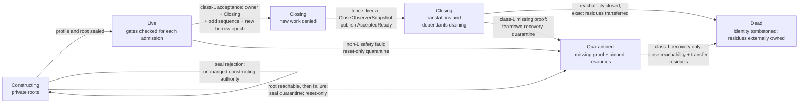

# Address-space object

The address-space object should be the kernel's durable identity for one CPU
translation regime, not a pointer to a page-table root. It should bind the
capability authority, immutable backend profile, owned translation-root bundle,
semantic mapping ledger, context-tag binding set, CPU-activation protocol, mutation
sequence, completion history, and teardown account that together make a
translation meaningful.

The baseline should attach one address space to one protection-domain
incarnation and use one semantic `BackendRoots` bundle whose baseline form is
one kernel-owned table hierarchy. A profile-required paired user/kernel root
is installed and retired atomically as that one bundle. Shared memory is
represented by separate authorized mappings of the same frame. Per-CPU or
NUMA-replicated tables remain backend-private optimizations only after they can
refine the same object contract.

“One protection domain” names the lifecycle and mutation owner, not one
exclusive executing thread. Several execution contexts belonging to that
domain may activate the same address space and therefore participate in its
CPU-set protocol. [seL4, for example, permits threads to share a
VSpace](../../../30-sources/sel4-foundation-2026-reference-manual.md); the
evidence does not support a stronger one-thread/one-root rule. Sharing one root
between independently recoverable principals remains outside the baseline and
would need explicit co-ownership and teardown semantics.

This is a proposed Atom architecture, not an implemented or verified object.

## Question, scope, and operational standard

The question is:

> Which state must remain inseparable so that a page-table root cannot outlive
> its authority, be confused with a later address space, or race a CPU entering
> while an activation-gated mapping transition is in progress?

The object owns translation identity and lifecycle. It does not select frames,
choose paging policy, lay out BEAM heaps, authenticate a caller, or decide that
one service deserves access. Those decisions arrive as authority-bearing
requests from the capability kernel and unprivileged memory policy.

A candidate object is adequate only if all of these can be demonstrated:

1. No usable root exists before its table pages, immutable feature profile,
   owner, kernel exclusions, and initial mapping ledger have been validated.
2. A raw root address, numeric ASID/PCID, virtual address, or CPU number is
   insufficient to name or operate on the object.
3. Every activation names both the address-space incarnation and a stable
   mutation generation, and cannot enter user execution across an odd/in-
   progress activation-gated transition.
4. One durable semantic ledger remains authoritative even if a backend uses
   several hardware roots or materializes entries lazily.
5. Mapping, tag, CPU, and completion generations cannot discharge one
   another's obligations merely because their numeric values match.
6. `Closing` prevents new mappings and activations before teardown begins.
7. `Dead` is reachable only after the address-space incarnation can admit or
   expose no further translation or access, and every detached root, tag, code,
   DMA, and software-reference residue has a generation-bound retirement or
   quarantine owner. It does not imply that those separately owned resources
   are already physically reclaimable.
8. Incomplete CPU exclusion or invalidation leaves the object and dependent
   resources in a named quarantine, not a reusable state.

## Evidence and limits

| Evidence | Supported conclusion | Limit on the inference |
| --- | --- | --- |
| [Mach machine-independent VM](../../../30-sources/rashid-et-al-1987-machine-independent-virtual-memory.md) | Semantic VM objects and policy can be separated from one machine-dependent mapping module across materially different architectures | Historical portability experience is not a proof for modern walkers, weak ordering, or many-core systems |
| [SVR4.2 HAT layer](../../../30-sources/balan-gollhardt-1992-scalable-virtual-memory-hat-layer.md) | Context load/unload and active-processor accounting belong to the VM/MMU boundary | Its small-SMP locking and lazy-shootdown choices do not transfer automatically |
| [RadixVM](../../../30-sources/clements-et-al-2013-radixvm.md) | Mapping metadata, hardware tables, sharer tracking, shootdown, and physical-reference release are coupled scalability paths | Per-core tables add memory and fault costs and were evaluated only on one x86 research system |
| [Least-privilege memory protection](../../../30-sources/achermann-et-al-2019-least-privilege-memory-protection.md) | Authority to configure a translation and authority to access its target are distinct | The paper does not define Atom's capability types or lifecycle |
| [Asterinas page-table verification](../../../30-sources/asterinas-community-2025-practical-page-table-verification.md) | Mode-specific tables, typed table pages, range cursors, and tree-to-flat refinement are practical assurance units | The report is work in progress and does not prove concurrent hardware completion |
| [seL4 reference manual](../../../30-sources/sel4-foundation-2026-reference-manual.md) | VSpace roots, paging structures, frames, and mapping relations can be capability-mediated; a Page capability carries frame authority and mapping state when mapped | seL4 does not establish Atom's distinct `Mapping` object/`MappingRef`, and its proofs do not transfer |
| [Linux arm64 ASID management](../../../30-sources/linux-kernel-community-2026-arm64-asid-context-management.md) and current [Intel](../../../30-sources/intel-2026-system-programming-documentation.md), [Arm](../../../30-sources/arm-2026-a-profile-system-architecture-documentation.md), and [RISC-V](../../../30-sources/risc-v-international-2026-privileged-architecture.md) architecture documentation | Hardware context identifiers are finite, profile-specific values whose interpretation is coupled to roots and translation controls, so software must manage reuse explicitly | Linux supplies one implementation strategy; the manuals do not establish Atom's object identity, generation scheme, or lifecycle protocol |

The evidence justifies an explicit object boundary. The exact fields, eleven
generation domains, odd/even activation protocol, and quarantine state below
are cross-source synthesis that still require a model and two ISA ports.

## Proposed object boundary

The public handle should be a sealed capability reference:

```text
AddressSpaceRef {
    object_id,
    incarnation,
    rights,              // InspectMappings | Activate | MapWithin(envelope) |
                         // GrantMappingRefWithin(envelope) |
                         // PublishCodeWithin(envelope) | Close
    capability_generation
}
```

`MappingIncarnation` is the nominal pair `(mapping_id, mapping_generation)`,
and `TablePageIncarnation` similarly pairs a table-page identity with its
generation. No validation, completion, or teardown API accepts either
generation without its identity.

Throughout these component reports, `AddressSpaceIncarnation` is a nominal
compound value `(object_id, incarnation_generation)`, never the generation
alone. Pseudocode fields typed as `AddressSpaceIncarnation` therefore retain
both stable object identity and reuse generation.

`QuarantineIncarnation` is likewise the nominal pair
`(quarantine_id, quarantine_generation)`; a bare numeric ID never selects a
current quarantine owner or recovery cycle.

The handle never contains a table-base physical address. Kernel lookup resolves
it to the following protected record:

```text
AddressSpace {
    id,
    incarnation,
    owner_domain: (domain_id, domain_incarnation),
    state:
        Constructing | Live | Closing |
        Quarantined {
            quarantine: QuarantineIncarnation,
            originating_terminal_digest,
            owner_domain_and_incarnation,
            recovery_kind:
                ClassLTeardown(AddressSpaceTeardownRecoveryIncarnation) |
                ResetOnly(reason)
        } |
        Dead,

    profile: TranslationProfile,          // immutable after seal
    roots: BackendRoots,                   // typed, kernel-owned
    kernel_exclusion: KernelRangePolicy,   // immutable baseline
    ledger: MappingLedger,

    mutation_sequence,                    // even stable, odd activation-gated transition
    translation_catchup_state:
        TranslationCatchupGenerationState,
    active_cpus: map<(CpuIdentity, CpuIncarnation), ActivationRecord>,
    user_access_borrow_epoch,
    active_user_access_borrows: map<BorrowId, UserAccessBorrowRecord>,
    context_tag_bindings:
        BoundedMap<ContextBindingKey, ContextTagLease>,
    reference_admission_anchor: ReferenceAdmissionAnchor,
    accepted_code_publication_operations:
        BoundedMap<CodePublicationOperationIncarnation,
                   LifecycleParticipationRecord>,
    accepted_code_retirement_operations:
        BoundedMap<CodeRetirementOperationIncarnation,
                   LifecycleParticipationRecord>,
    execution_admission_gate: ExecutionAdmissionGate,
    code_publication_generation_state_ref:
        CodePublicationGenerationStateIncarnation,
    teardown_recovery_reservation:
        Option<(AddressSpaceTeardownRecoveryIncarnation,
                InspectFacet, AdvanceFacet, result_slots)>,
    completion_epoch,

    mutation_gate,
    quota_account,
    teardown_reserve,
    claim_ledger,
    diagnostic_trace
}

ReferenceAdmissionAnchor {
    address_space: AddressSpaceIncarnation,
    epoch,
    state: Open | Closing(close_operation_id) | Closed,
    lineage_gates:
        BoundedMap<ReferenceLineageIncarnation, ReferenceGateIncarnation>
}

ExecutionAdmissionGate {
    address_space: AddressSpaceIncarnation,
    epoch,
    lifecycle_close_owner: Option<close_operation_id>,
    publication_suspension_owners:
        BoundedMap<AddressSpaceExecutionSuspensionIncarnation,
                   Closing | Held>,
    gate_digest
}

TranslationCatchupGenerationStateIncarnation =
    (translation_catchup_state_id, generation)

TranslationCatchupGenerationState {
    state: TranslationCatchupGenerationStateIncarnation,
    address_space: AddressSpaceIncarnation,
    stable_mutation_sequence,
    live_context_bindings_and_root_pins:
        QuotaChargedPersistentMap<
            ContextBindingKey, CatchupBindingAndRootRecord>,
    programs:
        UniversalFromAnyEarlierSequence(
            BoundedMap<ArchitectureProfileId,
                       Authorized<TranslationCatchupProgram,
                                  ExecutePrivileged>>) |
        RetainedIncrementalChain(
            QuotaChargedPersistentMap<MutationSequence,
                                      TranslationCatchupProgramSet>),
    cpu_observation_sidecar:
        TranslationCatchupCpuObservationStateIncarnation,
    state_digest
}

TranslationCatchupCpuObservationStateIncarnation =
    (translation_catchup_observation_state_id, generation)

TranslationCatchupCpuObservationState {
    sidecar: TranslationCatchupCpuObservationStateIncarnation,
    catchup_state: TranslationCatchupGenerationStateIncarnation,
    observations:
        BoundedMap<(CpuIdentity, CpuIncarnation),
                   CpuTranslationCatchupObservation>,
    observation_gate
}

CpuTranslationCatchupObservation {
    catchup_state: TranslationCatchupGenerationStateIncarnation,
    observed_stable_mutation_sequence,
    executed_program_or_chain_digest,
    observed_catchup_state_digest
}

TranslationCatchupProgram {
    program_incarnation,
    architecture_profile_id,
    address_space: AddressSpaceIncarnation,
    covered_from_sequence,
    covered_through_sequence,
    exact_binding_and_root_operands_or_checked_parameterization,
    exact_ordered_local_invalidation_barrier_and_fence_operations,
    completion_validation_rule,
    program_digest
}
```

The catch-up state owns executable maintenance programs and the typed binding/
root records and pins needed to run or instantiate them; `state_digest` is only
an equality commitment. A backend may publish one validated conservative
context-wide program that dominates every change before the current stable
sequence, or retain an actual ordered incremental chain until every CPU that
may return has advanced beyond it. It may not discard history while retaining
only a digest. Terminal publication installs the next immutable state
atomically with the stable even sequence, and prior states remain pinned until
all activation readers and lagging CPU incarnations are discharged. CPU
identity reuse begins with no observed sequence.
The immutable state's digest binds its nominal observation sidecar but excludes
the sidecar's mutable map contents. A CPU updates only a complete
`CpuTranslationCatchupObservation` under the observation gate, so its progress
does not replace the catch-up state or invalidate unrelated activation guards.

Execution entry is admissible only while the address space is `Live`, the
lifecycle-close owner is absent, and the suspension-owner map is empty. A code-
publication acceptance inserts one preallocated `Closing` suspension under the
same lifecycle/mutation gate that registers its participation record; drainage
changes only that entry to `Held`. Its terminal commit removes only its exact
generation-bound entry. It never writes a free-standing `Open` bit, so a
concurrent class-`L` close or another suspension owner cannot be accidentally
reopened. These suspension types and their complete executor-drain evidence are
owned by [ordering, coherence, and code
publication](../ordering-coherence-and-code-publication.md); this object owns
their admission and composition point.

On a profile where a privileged data helper could also fetch instructions
through the target root, helper-guard acquisition must observe this same epoch
and owner map before and after publishing its borrow. Publication acceptance
advances/closes that admission and the borrow epoch atomically, and `Held`
requires every frozen activation-guard borrow and fetch-capable helper borrow
to drain. A profile may omit that extra closure only with an independently
validated `DataOnlyBorrow` mode that makes privileged instruction fetch
unrepresentable.

Code-retirement acceptance is serialized under that same lifecycle/mutation
gate and registers its own nominal participation record before changing any
version/pin disposition. If close wins, retirement rejects unchanged; if
retirement wins, class `L` freezes and discharges or transfers that exact
record. Publication, retirement, and close take the lifecycle/mutation and
code-membership gates in one reviewed global order.

The generation-state reference names component 4's persistent
`CodePublicationGenerationState` for this runtime-domain/address-space pair.
Activation, migration, user return, scheduler eligibility changes, and code-
publication commit all join its membership-admission gate. It is not replaced
by an operation's frozen acknowledgement set: a later CPU must catch up to its
current committed generation before this execution gate can admit that CPU.

`BackendRoots` may hold a profile-required atomic pair, such as separate user
and kernel roots, but this is not visible to a caller. Every root carries its
format, level, owner, and exact `TablePageIncarnation`. Per-CPU or NUMA replication is
a later refinement of this bundle, not part of the baseline object.

`ContextBindingKey` distinguishes `PerCpu`, `CoherenceDomain`, `SystemWide`,
and `VirtualMachine` namespaces, including the relevant CPU/domain/VM
incarnation and namespace identity. The address space can therefore own several
live `ContextTagLease` values. Resolving a CPU produces one exact
`TargetTranslationBinding(binding_key, AddressSpaceIncarnation,
ContextTagIncarnation, root_fingerprint, lease_retirement_epoch, profile_id)`;
neither the numeric tag nor a lease chosen for another scope is interchangeable
with it. A pre-issued binding also becomes stale when its lease retirement
epoch changes.

Mutation/lifecycle admission also serializes every `ContextTagBindingSet`
insertion, installable-state transition, and ordinary removal. A tag may be
reserved privately first, but publishing its binding requires holding that
gate and rechecking the exact live incarnation, root/profile, and mutation
sequence. Consequently a class-`L` close either freezes a binding that became
installable before `Live` changed to `Closing`, or forces the losing registrar
to withdraw its unexposed reservation; an uncertain partial publication is
close-owned or quarantined. This makes the frozen set a complete lifecycle
snapshot rather than a best-effort allocator scan.

### Eleven non-interchangeable generations

| Generation | Protects against | Advanced by |
| --- | --- | --- |
| Address-space incarnation | Reuse of the whole object identity | Destroy and recreate |
| Capability generation | Stale handles to the same object | Revocation or slot replacement |
| Mapping generation | Old work at a reused virtual range | Map, replace, or remove that relation |
| Mutation sequence | Activation racing any operation whose promised completion needs a stable observer set | Accepted restrictive transaction, or additive/upgrade usability work when its backend profile requires active-target maintenance |
| Translation-catch-up state incarnation | ABA substitution or premature release of the actual maintenance program/root-pin state for a stable mutation sequence | Atomic stable-even publication; old incarnations retire only after readers and lagging CPUs discharge |
| User-access borrow epoch | Guard acquisition racing old-access or privileged-fetch closure | Accepted restrictive transaction, fetch-capable-helper publication suspension, or borrow-era rollover |
| Context-tag incarnation (namespace and lease generations) | Numeric ASID/PCID reuse | Allocator rollover or lease replacement |
| Reference-admission epoch | Reference/template publication racing address-space close | Close admission or an explicit reference-anchor rollover |
| Execution-admission epoch | Activation, migration, or user return racing lifecycle close or an executable-publication suspension | Any insertion, typestate change, or checked removal of a close/suspension owner |
| Code-publication generation | A later eligible CPU missing fetch synchronization for an already published executable version | Atomic component-4 publication commit; observed per-CPU state advances only after catch-up |
| Completion epoch | Ordering terminal publication/history and detecting stale diagnostic snapshots | Terminal operation publication |

These values may share an integer representation internally, but the type
system must prevent comparison across columns. Wraparound is a lifecycle event
requiring a broad invalidation and absence proof, not ordinary modulo
arithmetic.

## Construction and sealing

Construction is intentionally not activation-capable:

1. `address_space_begin_create` consumes an authorized domain reference with
   `CreateAddressSpace`, charged quota, an immutable requested profile, and an
   authorized root-frame/retype input, then returns `ConstructingSpace`.
2. The backend checks implemented virtual-address width, page sizes, root
   alignment, context-tag capabilities, memory types, user/kernel split, and
   any required errata profile.
3. The root authority and charged kernel-object memory become typed table
   pages. They are inaccessible through ordinary domain mappings.
4. Required kernel-entry mappings or deliberately empty user roots are built
   privately. A verifier decodes the root and checks it against the initial
   flat ledger.
5. `address_space_seal` freezes the profile and exclusion policy and starts the
   backend's ordered root publication. Its typed seal operation is the only
   route to the first `Authorized<AddressSpaceRef<Live>>`; a
   `ConstructingSpace` never satisfies an activation or mapping interface.

The public facade is therefore a typed begin/seal pair. Pre-publication seal
rejection returns the unchanged constructing object. Once root reachability is
possible, failure is represented by the accepted seal operation's retained or
quarantined terminal result, never by returning a generic activatable
`AddressSpace`.

An accepted seal returns separate `AddressSpaceSealOperationRef` facets for
borrowed inspection and intended-owner terminal-result claim. Repeated polling
reveals only immutable metadata and opaque stable slot identities. Only the
claim facet can move the sole `AddressSpaceRef<Live>` or quarantine-inspection
authority; duplicate, foreign-operation, or stale-generation claims return
`AlreadyClaimed` or `StaleOrWrongSlot` without minting another handle.

Failure before `seal` returns all unexposed resources. Failure after any root
became reachable enters controlled teardown; it cannot be reported as a
pre-effect allocation rejection.

The baseline rejects a profile that cannot enforce its claims. For example, a
backend without a reliable way to keep user-owned frames out of a privileged
alias cannot silently advertise the no-ambient-alias security profile.

## Mapping ledger and hardware refinement

The ledger is the semantic source of truth:

```text
MappingRecord {
    mapping_id,
    mapping_generation,
    virtual_range,
    frame_id,
    frame_incarnation,
    canonical_physical_extent,
    backing_lineage,
    frame_authority_epoch,
    frame_offset,
    maximum_rights,
    effective_rights,
    memory_type,
    page_granularity,
    lifecycle,
    last_completion_epoch
}
```

Hardware entries refine this relation; they do not replace it. A test backend
must be able to decode all reachable leaf descriptors into a flat view and
compare that view with the ledger, modulo documented transient states owned by
an accepted transaction. Orphan hardware entries and ledger entries with no
permitted transient explanation are invariant violations.

An authority-bearing `MappingRef` names the exact `(mapping_id,
mapping_generation)` and address-space incarnation while carrying three
independent constraints: operation verbs, an immutable
`capability_access_ceiling`, and its own capability generation. Derivation may
only remove verbs or lower the ceiling. Consequently, the wider
`MappingRecord.maximum_rights` is never by itself authority to restore access
that a delegated reference omitted.

Creation of a reference is separately authorized.
`MappingRefGrantTemplateIncarnation = (grant_template_id,
grant_template_generation)` is nominal one-shot identity; neither field alone
authorizes minting. A generation-checked `MappingRefGrantTemplate` is bound to
this address-space incarnation, a nominal `ReferenceLineageIncarnation`, the
address space's observed reference-admission epoch, and an
`authorized_mapping_range`, and caps both output verbs and access. A
`MapWithin` envelope includes a ceiling for such templates; addition requires
the relation to lie within both range envelopes, and replacement requires the
new relation to lie within the template range while also intersecting the
template with the old reference's verbs and access ceiling. The new reference
contains exactly that intersection, so mutation authority does not implicitly
confer authority over the resulting mapping.

`ReferenceLineageIncarnation = (reference_lineage_id,
reference_lineage_generation)` and `ReferenceGateIncarnation =
(reference_gate_id, reference_gate_generation)` are nominal compound
identities. A bare ID or generation from either pair cannot derive authority,
close a lineage, or prove reference quiescence.

Every `MappingRef` descendant shares its lineage's registered
`ReferenceGateIncarnation`; attenuation does not create an untracked close
obligation. Derivation and template creation first prepare a private child,
then publish it only through `ReferenceAdmissionAnchor` while atomically
rechecking `state == Open`, the exact address-space incarnation, and the
unchanged epoch. Class-`L` close changes the anchor to
`Closing(close_operation_id)` and advances the epoch in the same lifecycle-gate
linearization that changes `Live` to `Closing`. If publication won first, its
already-registered lineage gate is in the frozen set; if close won, publication
fails and the private child is destroyed or returned. No descendant or grant
template can become usable between the close linearization and its reference
snapshot. A new mapping consumes the output template's already-registered
lineage/gate: while the accepted writer still owns the lifecycle gate, it
atomically transfers the template's pin/obligation to the minted result
reference before terminal publication. It cannot create a second gate outside
the close snapshot.

Bootstrap is explicit: `mapping_ref_grant_template_issue` borrows an authorized
`AddressSpaceRef<GrantMappingRefWithin(envelope)>`, privately allocates fresh
nominal lineage/gate incarnations, and then takes the lifecycle gate. It
revalidates the full envelope plus `ReferenceAdmissionAnchor == Open(epoch)` and
atomically inserts that gate and publishes the first template carrying the
same epoch. If close or revocation won, neither object is published. Template
or `MappingRef` attenuation shares and participates in that exact registered
gate while only narrowing authority; no generic capability copy can create a
new lineage outside this transition.

The ledger contributes to a kernel-wide alias index keyed by normalized
physical extents, not only frame-object identifiers. The frame allocator must
either prevent overlap among live frame objects or record explicitly derived
subframes under one canonical backing lineage. Partial physical overlap across
CPU, IOMMU, device, or diagnostic namespaces is therefore found even when two
capabilities use different object identities. The validator uses this index to
reject conflicting memory types and executable mappings whose bytes remain
writable through any CPU or device alias. A mapping identity survives neither
physical replacement nor address-space recreation.

## Activation protocol

`ActivationGuardIncarnation = (activation_guard_id,
activation_guard_generation)` is nominal per-attempt identity; neither field
alone identifies an entry attempt. An `ActivationGuard` is a linear kernel token proving that one CPU incarnation
may install the root and enter this address space at one stable sequence:

```text
ActivationGuard {
    guard: ActivationGuardIncarnation,
    address_space: AddressSpaceIncarnation,
    cpu_identity,
    cpu_incarnation,
    observed_mutation_sequence,
    translation_catchup_state: TranslationCatchupGenerationStateIncarnation,
    translation_catchup_state_digest,
    observed_translation_catchup_program_or_chain_digest,
    observed_execution_admission_epoch,
    code_publication_generation_state:
        CodePublicationGenerationStateIncarnation,
    observed_code_publication_generation,
    observed_code_publication_program_digest,
    code_publication_generation_state_digest,
    context_binding_key: ContextBindingKey,
    context_tag: ContextTagIncarnation,
    lease_retirement_epoch,
    root_fingerprint,
    profile_id
}
```

Baseline activation uses an odd/even mutation sequence:

1. With interrupts and migration constrained by the CPU-context contract and
   while still in a neutral kernel translation context, the CPU reads
   `state == Live`, an even sequence `s`, and an execution-admission gate with
   no close or suspension owner at epoch `e`. Under the paired membership-
   admission gate it also reads persistent code-publication state incarnation
   `p`, generation `g`, and state digest, and pins the translation-catch-up state whose stable
   sequence is `s`. It resolves the CPU's exact
   `TargetTranslationBinding` through the allocator's lifecycle-serialized
   registrar, including `Active` lease state and the current retirement epoch.
2. It publishes
   `Entering(s, e, p, g, cpu_identity, cpu_incarnation, binding)` into the active set
   with release ordering and executes the profile/compiler's full Store→Load
   fence.
3. It rereads lifecycle state, sequence, execution-admission state/epoch,
   translation-catch-up state/digest, code-publication generation/digest,
   lease state, and retirement epoch with
   acquire ordering. If state is no longer
   `Live`, the sequence is odd or not `s`, the execution gate has any owner or
   is not epoch `e`, either pinned state changed, publication state is no
   longer `(p, g, digest)`, or the lease retired, it withdraws with release ordering and waits or
   retries only while the object remains live. Every visible `Entering` record
   therefore already has an exact target-root observer binding. Otherwise it
   pins and validates the actual `TranslationCatchupGenerationState`, then
   performs its program or incremental chain if the CPU's observed sequence is
   old and,
   while still unable to execute the target, runs component 4's exact missed-
   generation fetch program (or conservative whole-domain program) if its
   observed code-publication generation is older than `g`. It release-
   publishes the resulting observation and rereads `(g, digest)` before it
   reserves `ActivationGuardIncarnation`, and obtains a one-shot allocator
   `ContextInstallGuard<UserActivation>` in `Installing`: the allocator records
   current/cumulative may-hold membership, fully fences, and rechecks sequence,
   execution admission, code-publication generation, lease retirement,
   rollover, and pending state. It then constructs the
   `ActivationGuard` and publishes
   `Active(s, ActivationGuardIncarnation)` with release ordering.
4. It executes a full Store→Load fence and rereads the sequence and execution-
   admission gate plus code-publication generation state with acquire ordering.
   If any bound generation or digest changed, the sequence is odd, or a close/
   suspension owner exists, it consumes the install guard into
   `InstallWithdrawnSafe`, then atomically consumes it with the unreturned
   activation guard through `address_space_deactivate` and publishes
   `Inactive`; it retries without loading the user root.
5. On a stable reread, it returns
   `Activated(guard, ContextInstallGuard<Installing>)`. Component 2 stores both
   in `EntryCpuState`, rechecks every bound sequence/execution-admission/lease/
   publication-generation/pending fact, then
   release-publishes `LoadingRoot` before the first root/tag-changing
   instruction. It loads the root, publishes `Installed`, checks pending state
   again, and enters user execution. A failure still in `Installing` consumes
   the guard into `InstallWithdrawnSafe`; any interruption or ambiguity from
   `LoadingRoot` instead follows safe-context restoration because the target
   root may already be installed.
6. Deactivation publishes `RestoringSafeContext`, installs the recorded safe
   kernel context, executes required local ordering/maintenance, clears current
   residency to `NoBinding`, and consumes `ContextInstallGuard` to obtain a
   linear `SafeContextRestored` proof bound to both guard/install generations,
   CPU and address-space incarnations, exact binding, safe-context fingerprint,
   allocator slot, and ordering completion. Only
   `address_space_deactivate(ActivationGuard, ContextInstallDeparture)` may then
   publish `Inactive` and consume both proofs. The departure must carry
   `UserActivation` for this exact `ActivationGuardIncarnation`;
   `InstallWithdrawnSafe` is accepted only with proof that no root load
   occurred. Cumulative may-hold membership remains unless exact
   binding-invalidation completion removed it.

`context_restore_safe` accepts `LoadingRoot`, `Installed`, or an interrupted
`RestoringSafeContext`. From the first two states it atomically publishes
`RestoringSafeContext` before the safe-root switch; from the third it resumes
idempotently using the same guard/install generation and recorded neutral-root
fingerprint. It never reissues a guard or treats an ambiguous target-root load
as a no-load abort.

A privileged helper acquires a `UserAccessGuard` borrow with the same two-sided
shape. It reads `state == Live`, an even mutation sequence, and the current
borrow epoch, publishes a generation-bound `UserAccessBorrowRecord` with
release ordering, executes the profile/compiler's full Store→Load fence, and
rereads lifecycle, sequence, and epoch with acquire ordering before it may open
an architecture access window. If either generation changed or the mutation
sequence is odd, it withdraws with release ordering and retries without
dereferencing user memory. If lifecycle is `Closing`, `Quarantined`, or `Dead`,
it withdraws and returns that terminal admission failure rather than retrying
into the object. Releasing the linear guard removes the
record with release ordering only after the final possible old-mapping access;
the mutator observes release/drain with acquire semantics. A bare counter is
insufficient unless its wrap and publish-versus-freeze proof is equivalent.

A transaction whose prepared plan says
`requires_stable_observer_snapshot = true` atomically publishes an internal
operation owner and changes even `s` to odd `s + 1`. It advances the
user-access borrow epoch **only** when the checked requirements demand
`CpuAccessQuiescent`; a gated additive/permission-expansion usability operation
leaves the epoch unchanged, although the odd sequence temporarily blocks new
borrows. After the full Store→Load fence it acquire-scans the exact `Active`
and `Entering` CPU incarnations and every overlapping nonterminal `Publishing`,
`Live`, or `Draining` borrow in the current pre-accept epoch. All such borrows
contribute observer CPUs and root/alias bindings needed for `Usable`; only when
access quiescence is required are the advanced epoch and those records also a
frozen drain obligation. Borrow-owning CPU incarnations that
may retain a target-root or temporary-alias translation are unioned into the
invalidation target set. The flag is mandatory for
restriction, replacement, table unlink, address-space close, applicable
executable retirement, and
any additive/permission-expansion operation whose promised `Usable` result
depends on active-target maintenance. New activators and access guards wait.
For a restrictive effect, `CpuAccessQuiescent` is emitted only after the frozen
old borrows have drained with acquire-observed release, or their owning CPU
incarnations are terminally excluded. On completion the operation atomically
publishes even `s + 2` with a newly sealed
`TranslationCatchupGenerationState` that owns either a program dominating all
earlier sequences or the still-required incremental chain; a CPU that observed
an older accepted mutation sequence must pin, validate, and execute that actual
catch-up state before
becoming `Active` or entering user execution.

The full fences close the store-buffering outcome in which an entrant misses
the odd sequence while the mutator misses `Entering` or the borrow publication.
The exact memory-order, interrupt, compiler, and fence mappings must be
expressed in the executable model and tested as a two-observer litmus on each
backend; prose ordering alone is not accepted as proof.

## Lifecycle and state machine



Closing linearizes in one class-`L` acceptance step that publishes the
operation owner, changes `Live` to `Closing`, makes the mutation sequence odd,
advances the user-access borrow epoch, and changes the reference-admission
anchor from `Open(epoch)` to `Closing(close_operation_id, epoch + 1)`: no new
mapping transaction, activation, privileged user-access borrow, reference
derivation, grant-template publication, or `PublishCodeWithin`/code-publication
admission may be accepted afterward. The same linearization records the close
as `execution_admission_gate.lifecycle_close_owner`; later removal of a
publication-suspension entry cannot clear it. After
the full Store→Load fence, the operation freezes the exact active/entering,
borrow, tag-binding, mapping/root, every lifecycle-registered accepted code-
publication and code-retirement operation, code/DMA gate, and registered
reference-lineage and pin gate at the closed anchor before
`AcceptedReady`, including any accepted translation operation and admitted
output-grant IDs admitted by a future concurrent-writer profile. In the
baseline, the single logical writer token is held through terminal capability
mint/registration and publication, so an older writer cannot overlap close.
All snapshot storage and registry-retention capacity is reserved before the
close linearizes. The bounded `Closing` snapshot/seal transition therefore has
no recoverable failure edge: it reaches `AcceptedReady`, or an integrity/machine
fault takes the separate nonreturning architecture-fault halt path. Every
nonfatal non-success close terminal is consequently bound to a complete frozen
snapshot.
Existing activations, access borrows, accepted translation transactions, and
accepted code-publication or code-retirement operations remain object-owned and must reach a typed
terminal state. The object retains
its ledger, root pages, complete `ContextTagBindingSet` and every scope-specific
lease, all current/retained translation-catch-up state objects and their
readers, lagging CPUs, programs, and binding/root pins, and the exact persistent
code-publication generation state with its version records, program objects,
extent-pin dispositions, and readers. It also retains its diagnostic trace and
teardown reserve until every required gate is
discharged as an address-space lifecycle blocker or accepts an exact ownership
transfer into a retirement or quarantine record.

The public close call is therefore a class-`L` `TranslationOperation`, not a
generic “all mappings removed” Boolean. Its only success variant is
`AddressSpaceClosed` carrying `DeadEvidence` for the exact incarnation: all
mapping restrictions and root-table detaches, activation and helper-borrow
drains, every context binding made noninstallable and atomically transferred
as `RetiredNotReusable` to its reserved reclamation-gate record, and every
accepted code, DMA, and reference lifecycle participant either discharged as
an address-space observer or transferred its retained residue to a named
retirement or quarantine owner. The same product cancels or transfers every
translation-catch-up state and reader/lagging-CPU obligation and accounts for
every code-publication generation-state entry, program, reader, and pin owner.
This includes closure of the exact frozen
reference-admission epoch and every registered lineage/pin gate. Any missing
proof needed for these address-space closure and ownership-transfer facts leaves
the object and its reserves in the named incomplete or quarantined owner.
`DeadEvidence` proves lifecycle closure and an exhaustive handoff; it is not a
`Reclaimable` token. A transferred root, tag, frame, code generation, or
metadata object may remain `Collecting` or `Quarantined` in its own reclamation
record until that resource's remaining predicates are satisfied.
There is no `Closing` → `Live` edge: cancellation after the linearization is
nonselectable and recovery may only finish teardown or retain quarantine.

`Quarantined` is not an error flag on an otherwise reusable object. It is an
ownership state with an effect identifier, missing target set, last known
generations, retained resources, escalation history, and admissible recovery
actions. Reopening a quarantined address space is not a baseline operation.
The state stores the exact nominal quarantine, originating terminal, owner, and
recovery kind. Only `ClassLTeardown` may take the authorized recovery edge to
`Dead`. A non-`L` mapping fault and an accepted seal failure after root
reachability use `ResetOnly`; their inspect facets support diagnosis but cannot
mint teardown authority or resume/reopen the address space. Platform reset or
a separately designed containing-domain destruction protocol is required.

Every nonfatal, non-success close completion uses a separate, nominal recovery
object rather than mutating the close operation's exactly-once terminal:

```text
AddressSpaceTeardownRecoveryIncarnation =
    (teardown_recovery_id, teardown_recovery_generation)

AddressSpaceTeardownRecovery {
    recovery: AddressSpaceTeardownRecoveryIncarnation,
    address_space: AddressSpaceIncarnation,
    close_operation_id,
    original_close_terminal_digest,
    quarantine: QuarantineIncarnation,
    frozen_close_observer_snapshot_digest,
    retained_subordinate_recovery_handles,
    state: Collecting | Finalized(DeadEvidence) | RetainedInQuarantine,
    recovery_digest
}

AddressSpaceTeardownRecoveryRef {
    recovery: AddressSpaceTeardownRecoveryIncarnation,
    address_space: AddressSpaceIncarnation,
    close_operation_id,
    quarantine: QuarantineIncarnation,
    rights: Inspect | Advance,
    capability_generation
}

address_space_teardown_recovery_poll(
    Borrowed<Authorized<AddressSpaceTeardownRecoveryRef, Inspect>>)
  -> Collecting(missing_typed_proofs)
   | Finalized(DeadEvidence)
   | RetainedInQuarantine(reason)

address_space_teardown_recovery_advance(
    Authorized<AddressSpaceTeardownRecoveryRef, Advance>,
    typed_generation_bound_evidence)
  -> Collecting(Authorized<AddressSpaceTeardownRecoveryRef, Advance>)
   | AddressSpaceDead(DeadEvidence)
   | RetainedInQuarantine(
         Authorized<AddressSpaceTeardownRecoveryRef, Advance>, reason)
```

Every nonfatal, non-success close terminal gives its caller a stable one-shot
slot containing the preconstructed inspect-only reference; the first claim
moves that reference and later claims return `AlreadyClaimed`. The designated
kernel supervisor retains the
independently authorized `Advance` facet. These are out-of-band lifecycle-
control capabilities reserved and registered with the close operation before
`Live -> Closing`, not post-close reference derivations. Success atomically
cancels both facets; failure publishes them from their reserved slots without
allocation. An authorized advance call can move `RetainedInQuarantine` back to
`Collecting` when new admissible evidence or a typed recovery action exists.
Once the same frozen close product proves that address-space reachability is
closed and every subordinate residue is discharged or transferred to a named,
generation-bound retirement or quarantine owner, one locked transition
consumes the advance facet,
publishes `DeadEvidence`, changes the exact object from `Quarantined` to `Dead`,
and finalizes the recovery record. It neither rewrites the original terminal
nor reopens admission, and mismatched recovery, close, address-space, or
quarantine incarnations cannot participate.

## Authority model

The proposed capability rights are deliberately separate:

| Right | Permitted effect |
| --- | --- |
| `InspectMappings` | Read a redacted semantic ledger and completion state |
| `Activate` | Create an activation guard for the bound owner domain |
| `MapWithin(envelope)` | Submit additive maps bounded by range/frame/rights constraints and an explicit output-`MappingRef` grant ceiling |
| `GrantMappingRefWithin(envelope)` | Mint or attenuate a generation-checked output-reference template bounded by verbs, range, and access ceiling |
| `PublishCodeWithin(envelope)` | Let component 4 request an executable mapping only inside the exact range/profile envelope after joining independent sealed-image and scheduler-set authority |
| `Close` | Irreversibly stop admission and start teardown |

Possessing `MapWithin` does not imply `Activate` or `Close`. Every mapping
request that introduces a frame must additionally prove current frame
authority. Operations on an existing relation are authorized by the exact
`MappingRef` verb (`Protect`, `Replace`, `Unmap`, or relation inspection), not
by a second ambient address-space mutation right; the protected object still
enforces its address-space, frame, mapping-maximum, and profile ceilings. There is no public
right for raw table mutation or executable publication; executable transitions
are private effects of the neighboring code-publication component.
`PublishCodeWithin` is not accepted by the general mapping API and does not by
itself authorize a byte image or CPU eligibility set. Component 4 may mint the
internal `Authorized<CodePublication>` witness only after revalidating that
right against exact `SealedCode` extent/profile and a scheduler-issued complete
`PublicationSetWitness` for the same address-space/runtime-domain incarnation.

## Cross-ISA realization

| Object field | x86-64 | AArch64 | RISC-V supervisor |
| --- | --- | --- | --- |
| Root profile | paging mode, physical/linear width, CR3 and optional split-root policy | translation granule, level count, VA/PA size, TTBR regime | `satp` mode, level count, implemented VA/PA and extension profile |
| Numeric context | optional PCID | ASID plus regime | `satp.ASID` |
| Kernel exclusion | U/S and root-layout policy; KPTI-like split if selected | EL0/EL1 permissions, PAN profile, possible TTBR split | U bit, SUM discipline, root-layout policy |
| Table-page ownership | typed physical pages reachable only through paging structures and backend access | same semantic rule despite descriptor differences | same semantic rule despite PTE differences |
| Activation completion | CR3/PCID and required serializing/invalidation behavior | TTBR/ASID, TLBI and synchronization sequence | `satp`, local `SFENCE.VMA`, and remote-fence protocol |

The common object records capabilities and semantic effects. It does not claim
that roots, tags, or invalidation instructions are interchangeable. An MPU/PMP
backend can implement the same identity/lifecycle interface only if it declares
finite-region capacity, granularity, and atomicity limits honestly.

## Failure and security analysis

### Root corruption or ledger mismatch

An encoder decode check, page-table fault, or periodic scrub that finds an
unexplained descriptor cannot repair policy by guessing. It freezes new
activation, records raw and decoded evidence, and quarantines the address
space. Existing CPU and DMA paths are contained according to the layer's fault
policy before table memory is examined or reused.

### Owner-domain restart

A restarted domain has a new incarnation. It receives no implicit reference to
the prior address space. Recovery may create a fresh space or be explicitly
delegated a constrained teardown capability; it cannot resume old mapping or
activation handles.

### CPU identity reuse

The active set keys on stable CPU identity plus CPU incarnation. A late
deactivation or shootdown acknowledgement from an earlier incarnation can
advance only that earlier teardown record. It cannot remove or discharge the
new CPU occupant.

### Resource exhaustion

Construction and ordinary mapping consume charged quota. A separately bounded
teardown reserve covers the descriptors, target snapshots, completion records,
nominal recovery object, `Inspect`/`Advance` facets, and their result slots
necessary to close existing authority. Exhausting ordinary quota must
not make `Close` impossible. Exhausting the reserve before acceptance is a
typed rejection; losing it after acceptance is an invariant breach and
quarantine.

### Side-channel claim boundary

The object enforces architectural translation and permission state. It does
not by itself partition TLBs, caches, predictors, memory controllers, or
interconnects. A time-protection profile must add those resources and state its
residual hardware assumptions separately.

## Verification and evaluation

### Executable model

Model at least `state`, eleven generation domains, mapping ledger, active CPU
product state, current root refinement, complete tag-binding set, accepted operations, and
quarantine ownership. Check these invariants:

- no CPU reaches user execution with an odd or superseded mutation sequence;
- each reachable hardware leaf is ledger-authorized or part of one named
  accepted transient;
- every ledger `effective_rights` set is a subset of the mapping, frame-
  authority, address-space, and profile ceilings, so exceeding any one ceiling
  is forbidden;
- no old handle, activation, tag, or acknowledgement affects a newer
  incarnation or generation;
- `Dead` implies an empty active set, no live mappings, noninstallable roots and
  tags, and exactly one generation-bound retirement or quarantine owner for
  every residue; it does not imply that every resource-specific reclamation
  predicate is already satisfied; and
- every accepted operation's resources are owned by one terminal or pending
  record, never lost between caller and object.

Inject activation/deactivation before and after every mutator step, duplicate
and delayed acknowledgements, generation rollover, CPU offline/restart,
allocator failure, and sequence wrap.

### Refinement and differential tests

- Generate legal and illegal flat ledgers, encode them with each backend,
  decode all reachable tables, and compare the result.
- Run one shared state-machine suite over a model backend and at least x86-64
  plus one materially different ISA backend.
- Inspect generated assembly around active-set publication, sequence reads,
  root installation, barriers, and user return.
- Run continuous access while replacing, protecting, closing, and recreating
  an address space at reused identifiers and virtual ranges.

### Measurements

Measure create/seal/close distributions, activation and context-switch cost,
mapping-ledger memory per mapping, active-set contention, conservative versus
precise target fanout, retained memory after delayed targets, and the cost of
decode/refinement checks. Report core count, topology, page sizes, feature
profile, firmware, and errata status with every result.

## Staged implementation

1. Implement a model-only object with one page size, one CPU, separate
   incarnation/mapping/completion types, and a flat ledger.
2. Add one real root backend, typed table pages, decode-to-ledger checks, and
   single-CPU activation.
3. Add odd/even multicore activation, frozen target sets, CPU incarnations,
   close/quarantine, and fault injection.
4. Add generation-tagged context leases and forced-small-namespace rollover.
5. Port the unchanged semantic object to a second ISA.
6. Only then evaluate range locks, lazy materialization, split roots, per-CPU
   tables, or NUMA replication behind the same refinement relation.

## Alternatives and trade-offs

### Page-table root as the public identity

This is compact but makes physical addresses ambient authority, loses owner
and generation information, and couples callers to one table format. It is
rejected for the baseline.

### One system-wide address space

It reduces root switches but conflates independently recoverable domains and
increases ambient privileged reach. Shared kernel mechanisms can use explicit
global mappings without making all user domains one object.

### Per-CPU page tables from the start

RadixVM shows their scalability potential, but they multiply roots, transient
states, memory use, and fault/reconciliation paths. Start with one hierarchy so
the semantic contract can be falsified before adding replication.

### Reusing a numeric context tag as object identity

Finite hardware tags necessarily repeat. Without an object incarnation and
namespace and lease generations, a stale TLB entry or late operation can attach
to a later
space. Numeric tags remain leases, never identities.

## Unresolved questions

- Should the first profile use separate kernel and user roots to reduce
  privileged aliases, and what is the measured entry/exit cost?
- Can the odd/even activation algorithm be proven with the planned CPU-hotplug
  state machine, or is an explicit activation transaction simpler?
- Which semantic mapping data must stay in the privileged object and which
  read-mostly indices can be served by an unprivileged pager?
- How are mixed page-size split/join transients represented so decode-to-ledger
  comparison remains unambiguous?
- What bounded diagnostic state is retained when a root is quarantined?
- Does an MPU/PMP profile merit the same object type or an explicit sibling
  `ProtectionSpace` type sharing only lifecycle vocabulary?

## Connections

- [Parent translation component](../address-translation-and-protection-transitions.md)
- [Mapping validator](mapping-validator.md)
- [Mapping transaction](mapping-transaction.md)
- [Translation-context allocator](translation-context-allocator.md)
- [Shootdown coordinator](shootdown-coordinator.md)
- [Reclamation gate](reclamation-gate.md)
- [Minimal privileged kernel layer](../../minimal-privileged-kernel-layer.md)
- [Kernel hardware-contract inquiry](../../../40-inquiries/what-contract-should-the-kernel-hardware-and-architecture-layer-provide.md)

## Sources

- [Machine-independent virtual memory management](../../../30-sources/rashid-et-al-1987-machine-independent-virtual-memory.md)
- [SVR4.2 HAT layer](../../../30-sources/balan-gollhardt-1992-scalable-virtual-memory-hat-layer.md)
- [RadixVM](../../../30-sources/clements-et-al-2013-radixvm.md)
- [Least-privilege memory protection](../../../30-sources/achermann-et-al-2019-least-privilege-memory-protection.md)
- [Asterinas page-table verification report](../../../30-sources/asterinas-community-2025-practical-page-table-verification.md)
- [seL4 reference manual](../../../30-sources/sel4-foundation-2026-reference-manual.md)
- [Linux arm64 ASID context management](../../../30-sources/linux-kernel-community-2026-arm64-asid-context-management.md)
- [Intel system-programming documentation](../../../30-sources/intel-2026-system-programming-documentation.md)
- [Arm A-profile system architecture documentation](../../../30-sources/arm-2026-a-profile-system-architecture-documentation.md)
- [RISC-V privileged architecture](../../../30-sources/risc-v-international-2026-privileged-architecture.md)
