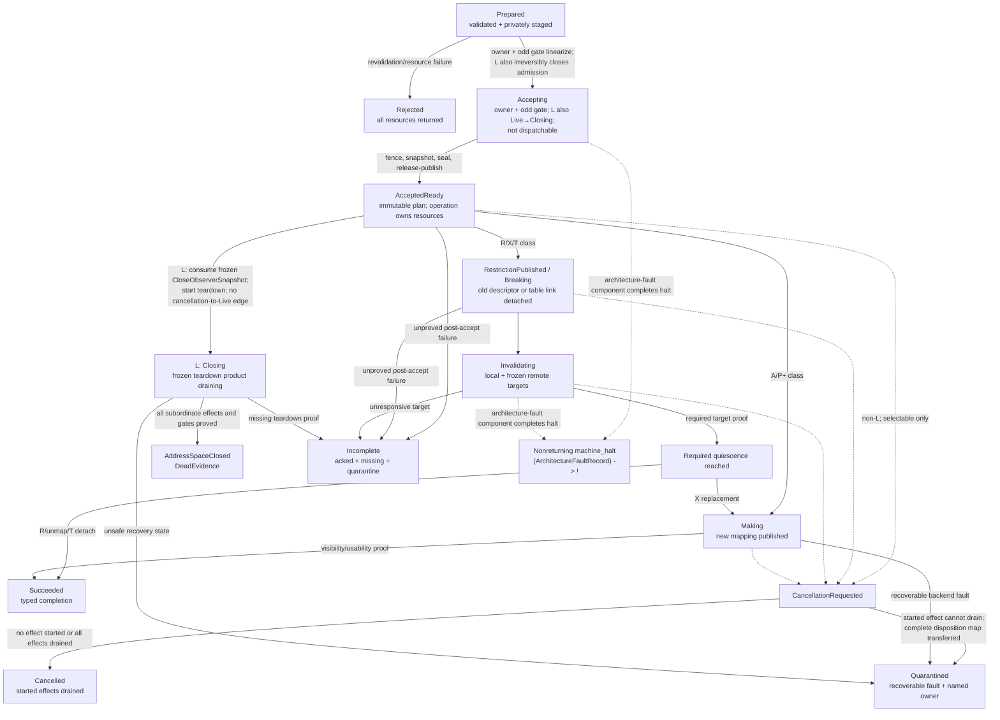

# Mapping transaction

A mapping transaction should own the whole interval between validated intent
and a typed terminal result. It should freeze the affected object generations,
reserve table and completion resources, serialize overlapping mutations,
publish descriptors through the encoder, execute the planned invalidations,
retain every replaced object, and emit either the requested completion proof
or an explicit incomplete/quarantine record.

Transaction does not mean that several CPUs observe an instantaneous atomic
page-table switch. It means there is one semantic acceptance point, one owner
for every transient, one declared visibility protocol for the change class,
and no gap in authority or resource ownership. Once old access has been closed,
putting old bits back is another translation transition, not rollback of a
private write.

This is a proposed state machine. It has not been executed or proved.

## Question, scope, and operational standard

The question is:

> How should a prepared map, protect, replace, split, or unmap plan cross from
> rejectable intent into an architecturally visible effect without leaking
> partial state or freeing resources that a CPU may still reach?

The transaction owns:

- the acceptance point and immutable operation record;
- mutation/range locks and the odd address-space sequence;
- old/new mapping identities and table topology transients;
- private descriptor plans and all reserved table pages;
- the complete frozen observer/may-hold target snapshot and invalidation plan;
- pins on old frames, mappings, and table pages;
- cancellation selection and deadline observation; and
- exactly-once publication of terminal evidence.

It delegates representation to the encoder, local/remote maintenance to the
planner and shootdown coordinator, and reuse to the reclamation gate. It never
chooses frame allocation or application policy.

A baseline passes only if:

1. `Rejected` is possible only before the first externally visible mutation
   and returns all caller/reservation ownership unchanged.
2. The public `Accepted` result denotes that the linearization transferred every
   resource needed for success, failure recording, forward recovery, or
   quarantine to one operation object. The returned handle is already either
   immutable `AcceptedReady` or exactly-once `Terminal`, never internal
   `Accepting`.
3. Overlapping ranges and table ancestry cannot be mutated by two operations
   under incompatible assumptions.
4. Each semantic effect class gets at least the backend-required publication,
   invalidation, access-drain, and walker-drain sequence.
5. Restriction, unmap, replacement, and table removal never return success
   while a target CPU may use superseded state.
6. Cancellation and timeout never discard a started hardware or remote effect.
7. Batching can coalesce work without merging mapping identities, authority,
   terminal results, or reclamation obligations.
8. Every accepted operation eventually reaches a terminal record under stated
   fairness assumptions, or remains safely pinned/quarantined when those
   assumptions fail.

## Evidence and limits

| Evidence | Supported conclusion | Limit |
| --- | --- | --- |
| [Relaxed virtual memory](../../../30-sources/simner-et-al-2022-relaxed-virtual-memory.md) | Page-table stores, walks, invalidations, barriers, and Arm break-before-make are a protocol, not one memory write | Arm-specific model with documented exclusions |
| [Intel system-programming documentation](../../../30-sources/intel-2026-system-programming-documentation.md) | Cached translations and paging-structure information can survive table edits; restrictive changes require invalidation before reuse | x86-specific and profile/erratum dependent |
| [Arm A-profile documentation](../../../30-sources/arm-2026-a-profile-system-architecture-documentation.md) | Descriptor publication, break-before-make, TLBI scope, and completion barriers are profile-dependent stages of one mapping transition | The reused source currently follows Arm's mutable `latest` manual and must be pinned before it can support a reproducible profile |
| [RISC-V privileged architecture](../../../30-sources/risc-v-international-2026-privileged-architecture.md) | Invalid entries may be cached, `SFENCE.VMA` scope matters, and leaf/nonleaf replacement needs ordered fencing | Remote completion is outside the local instruction |
| [SVR4.2 HAT layer](../../../30-sources/balan-gollhardt-1992-scalable-virtual-memory-hat-layer.md) | Mapping mutation, context activation, and active-processor accounting require one coordinated VM/MMU boundary | Its small-SMP design and lazy choices are not a modern proof |
| [TLB consistency](../../../30-sources/black-et-al-1989-tlb-consistency.md) | Restrictive and expansive changes have different stale-state hazards, and remote work needs explicit target acknowledgement | Historical machines omit current walkers, tags, and weak virtual memory |
| [RadixVM](../../../30-sources/clements-et-al-2013-radixvm.md) | Ordered range locking, target collection, page-table removal, acknowledgement, and delayed physical-reference release can scale for nonoverlapping ranges | Research kernel, one x86 machine, per-core tables |
| [Don't shoot down TLB shootdowns](../../../30-sources/amit-et-al-2020-dont-shoot-down-tlb-shootdowns.md) | Batching and early/deferred acknowledgement are conditional and user-return/uaccess paths must enforce pending work | Linux 5.2.8/x86 evaluation |
| [Linux VM implementation contracts](../../../30-sources/linux-kernel-community-2026-virtual-memory-implementation-contracts.md) | Table teardown follows unhook → invalidate → free, and software walkers add a distinct lifetime obligation | Implementation precedent, not portable proof |
| [TLB shootdown liveness case study](../../../30-sources/padon-et-al-2018-reducing-liveness-to-safety.md) | Safety and liveness need separate proof; a small missing critical section or unstated fairness assumption matters | Abstract protocol omits real hardware and failed CPUs |

The precise effect taxonomy, acceptance algebra, and operation-resource model
below are Atom synthesis. Architecture sources establish hazards, not a common
transaction API.

## Semantic effect classes

Classify by what stale observers could do, not by the syntax of a request:

| Class | Semantic change | Primary hazard | Required result |
| --- | --- | --- | --- |
| `A` | Invalid → valid/additive mapping | Negative translation caches or unpublished descendants can delay usability | `Usable` under the selected backend profile |
| `P+` | Permission expansion | Stale restrictive entries can produce spurious denial | `Usable`; a profile may permit delayed completion only if the API exposes it |
| `R` | Permission reduction or unmap | Stale permissive translation or privileged helper borrow bypasses policy | `RestrictionPublished`, then `RestrictionQuiescent` |
| `X` | Output frame, page size, memory type, globality, root, or descriptor-kind replacement | Old/new incoherence or wrong-frame access | Break, establish `RestrictionQuiescent`, then make and establish `Usable`; no promised fault-free instant |
| `T` | Nonleaf unlink or table-page removal | Hardware/software walker reaches freed/retyped memory | `CpuTranslationQuiescent`, `HardwareWalkerQuiescent`, and `SoftwareReaderQuiescent` before retype |
| `M` | Accessed/dirty observation or clear | Cleared metadata may not reflect later accesses | `AccessObservation` with backend-defined confidence |
| `E` | Executable mapping publication or retirement | Stale data/I-cache/pipeline/code references | Private effect composed by component 4, never a public map class |
| `L` | Address-space lifecycle close | Activations, helper borrows, tags, roots, mappings, code, DMA, or references retain the old incarnation | Checked `AddressSpaceClosed(..., DeadEvidence)` product or retained quarantine |

An operation with dimensions in several classes uses the strongest union of
their obligations. `A` is not portably “no flush”: current RISC-V permits
invalid PTEs to be cached unless a feature such as Svvptc changes the profile,
while the documented Arm profile does not cache several translation faults.

That union is represented explicitly rather than collapsed into a scalar:

`MetadataIncarnation` below means the nominal pair `(metadata_object_id,
metadata_generation)` used by the parent contract; its identity is distinct
from every mapping and table-page incarnation.

```text
ContextTagRetirementObligation {
    obligation_id,
    binding: TargetTranslationBinding,
    retirement_epoch
}

CompletionRequirements {
    requirements_id,
    effect_obligations:
        BoundedMap<EffectObligationId, EffectRequirement>,
    per_target_required_class:
        Option<CpuUserReturnClosed | LocalMaintenanceComplete>,
    require_cpu_translation_quiescence,
    require_cpu_access_quiescence,
    hardware_walker_obligations: Set<TablePageIncarnation>,
    software_reader_obligations: Set<MetadataIncarnation>,
    context_tag_retirement_obligations: Set<ContextTagRetirementObligation>,
    usability_scope: Option<UsabilityScope>,
    external_obligations:
        BoundedSet<ExternalCompletionObligation, MAX_EXTERNAL_OBLIGATIONS>,
    checked_refinement_digest
}

EffectRequirement {
    semantic: EffectSemantic,
    existing_relation_authority:
        Option<ExistingRelationAuthorityOrigin>,
    software_reader_obligations: Set<MetadataIncarnation>,
    context_tag_retirement_obligations: Set<ContextTagRetirementObligation>,
    external_obligations: Set<ExternalObligationId>
}

ExistingRelationAuthorityOrigin =
    CallerMappingRef {
        effect_obligation_id,
        source_input_mapping_ref_digest
    } |
    DelegatedAddressSpaceClose {
        parent_close_operation_id,
        close_authority_snapshot_digest,
        frozen_mapping_membership_digest
    } |
    DelegatedCodeSeal {
        code_seal_operation_id,
        executable_image_incarnation,
        writer_alias: MappingIncarnation,
        code_seal_authority_and_alias_set_digest
    }

ExistingRelationAuthorityResult =
    CallerReturned {
        returned_input_mapping_ref_slot: EffectObligationId,
        source_input_mapping_ref_digest
    } |
    CallerConsumed {
        source_input_mapping_ref_digest,
        capability_and_relation_revocation_proof_digest
    } |
    DelegatedEffectCompleted {
        authority_origin_digest,
        parent_operation_and_effect_binding_digest
    }

EffectSemantic =
    Add { proposed_mapping: MappingIncarnation, usability_scope }
  | Upgrade { mapping: MappingIncarnation,
              new_effective_rights,
              usability_scope }
  | Reduce { mapping: MappingIncarnation, new_effective_rights }
  | Unmap { mapping: MappingIncarnation }
  | Replacement { old_mapping: MappingIncarnation,
                  proposed_mapping: MappingIncarnation,
                  usability_scope }
  | TableDetach { table: TablePageIncarnation,
                  require_old_access_closure }
  | MetadataObservation { mapping: MappingIncarnation, confidence }
  | AddressSpaceClose { address_space: AddressSpaceIncarnation,
                        close_operation_id,
                        accepted_mutation_sequence,
                        observer_snapshot:
                            DeferredUntilAcceptance(
                                snapshot_slot_id,
                                bounded_capacity_commitment) |
                            Frozen(close_observer_snapshot_digest,
                                   subordinate_effect_ids) }

ExternalCompletionObligation =
    Code { obligation_id, executable_image_incarnation, required_code_proof }
  | Dma { obligation_id, dma_binding_and_device_incarnations,
          required_iommu_device_transport_proofs }
  | Cache { obligation_id, canonical_physical_extent_and_lineage,
            profile_rule_and_completion_point }
  | Reference { obligation_id,
                address_space: AddressSpaceIncarnation,
                reference_admission_epoch,
                lineage: ReferenceLineageIncarnation,
                gate: ReferenceGateIncarnation,
                required_reference_quiescence }

TranslationSuccess {
    requirements_id,
    results: BoundedMap<EffectObligationId, EffectResultRecord>
}

EffectResultRecord {
    semantic_result: EffectResult,
    software_reader_proofs:
        BoundedMap<MetadataIncarnation, SoftwareReaderQuiescent>,
    context_tag_retirement_proofs:
        BoundedMap<ContextTagRetirementObligation,
                   ContextTagRetirementPrepared>,
    external_completion_proofs:
        BoundedMap<ExternalObligationId, ExternalCompletionProof>
}

EffectResult =
    AddCompleted(new_mapping_ref_slot: EffectObligationId,
                 new_mapping_ref_identity_digest,
                 Usable)
  | UpgradeCompleted(
        authority_result: ExistingRelationAuthorityResult,
        new_effective_rights,
        Usable)
  | ReductionCompleted(
        authority_result: ExistingRelationAuthorityResult,
        new_effective_rights,
        RestrictionQuiescent)
  | UnmapCompleted(retired_mapping: MappingIncarnation,
                   authority_result: ExistingRelationAuthorityResult,
                   RestrictionQuiescent)
  | ReplacementCompleted(old_mapping: MappingIncarnation,
                         authority_result: ExistingRelationAuthorityResult,
                         RestrictionQuiescent,
                         new_mapping_ref_slot: EffectObligationId,
                         new_mapping_ref_identity_digest,
                         Usable)
  | TableDetached(table: TablePageIncarnation,
                  CpuTranslationQuiescent,
                  Option<RestrictionQuiescent>,
                  HardwareWalkerQuiescent,
                  retirement_reservation:
                      RetirementReservationIncarnation,
                  proposed_reclamation_transfer_binding_digest)
  | MetadataObserved(mapping: MappingIncarnation, AccessObservation)
  | AddressSpaceClosed(address_space: AddressSpaceIncarnation,
                       dead_evidence: DeadEvidence)

ContextTagRetirementPrepared {
    binding: TargetTranslationBinding,
    retirement_epoch,
    frozen_may_hold_and_install_state_digest,
    install_load_exclusion_and_ordered_binding_discharge_digest,
    exact_target_completion_or_lifecycle_digest,
    proposed_reclamation_transfer_binding_digest,
    disposition: RetiredNotReusable(
        retirement_reservation: RetirementReservationIncarnation)
}

DeadEvidence {
    address_space: AddressSpaceIncarnation,
    close_operation_id,
    accepted_mutation_sequence,
    close_observer_snapshot_digest,
    activation_drain_digest,
    access_borrow_drain_digest,
    translation_catchup_state_reader_lag_and_pin_disposition_digest,
    mapping_and_root_effect_result_digests,
    context_tag_retirement_proof_digest,
    accepted_operation_and_grant_disposition_digest,
    code_publication_generation_state_disposition_digest,
    code_dma_and_reference_proof_digest,
    final_state: Dead,
    evidence_digest
}

CloseObserverSnapshot {
    address_space: AddressSpaceIncarnation,
    close_operation_id,
    accepted_mutation_sequence,
    frozen_active_and_entering_cpu_incarnations,
    frozen_access_borrow_epoch_and_records,
    frozen_translation_catchup_state_and_observation_sidecar_incarnations,
    frozen_translation_catchup_readers_lagging_cpus_and_owned_binding_root_pins,
    frozen_context_tag_bindings,
    frozen_mapping_and_root_incarnations,
    frozen_prior_non_close_translation_operation_and_admitted_grant_ids,
    frozen_code_publication_operation_incarnations,
    frozen_code_retirement_operation_incarnations,
    frozen_code_publication_generation_state_incarnation_generation_and_digest,
    frozen_code_publication_observation_sidecar_incarnation_and_records,
    frozen_code_publication_version_entries_programs_extent_pins_and_readers,
    frozen_code_and_dma_gate_ids,
    frozen_reference_admission_epoch_and_lineage_pin_gate_incarnations,
    reserved_teardown_recovery_incarnation_and_facets,
    snapshot_digest
}

SubordinateCompensationResult {
    compensation_id,
    parent_operation_id,
    original_effect_obligation_id,
    original_effect_binding_digest,
    selected_forward_effect,
    checked_subordinate_requirements_id,
    parent_admission_token_delegation_digest,
    subordinate_accepted_mutation_sequence,
    frozen_observer_and_borrow_snapshot_digest,
    affected_binding_observer_snapshots_digest,
    subordinate_effect_result_and_proofs,
    final_mapping_state_digest,
    resource_disposition_digest,
    outcome:
        Completed(checked_safe_postcondition_digest) |
        RetainedByQuarantine(quarantine: QuarantineIncarnation),
    proof_digest
}
```

Callers cannot build this record. Its checked constructor derives it from the
validated semantic delta and proves that every obligation has one matching
result variant; `R`, `X`, and `T` imply their required proof fields, every
detached table has a distinct keyed obligation, and every requirement carries
its own metadata, context-tag retirement, and typed code/DMA/cache/reference
obligations. Every derived
Boolean/set equals their checked union. The corresponding result record carries
exactly those keyed software-reader and external proofs; a `TableDetached`
record therefore cannot substitute one unbound reader token. Its digest-bound fields tell each producer
exactly which orthogonal facts it must supply. The result is a keyed product,
so `X + T` or multiple table detaches cannot collapse into one success tag.
The per-target class cannot stand in for access, walker, software-reader,
context-tag retirement, code, DMA, cache, reference, or usability evidence.

`existing_relation_authority` is `Some` exactly for `Upgrade`, `Reduce`,
`Unmap`, and `Replacement`, and `None` for every other semantic. A public effect
uses `CallerMappingRef`; its obligation ID equals the containing effect key and
its source digest equals the actual accepted reference. An internal close or
code-seal effect uses the matching delegated variant, bound to the exact parent
operation, frozen membership or alias set, and complete child semantic. It
carries no caller `MappingRef`, produces no `AcceptedInputMappingRef`, and has
no terminal input-disposition entry.
The checked origin/semantic matrix permits `DelegatedAddressSpaceClose` only
for a `Reduce` or `Unmap` of a mapping in the frozen close membership, and
`DelegatedCodeSeal` only for a `Reduce` that removes every CPU-write right or an
`Unmap` of the exact frozen writer alias. Neither delegation can authorize
`Upgrade` or `Replacement`, and a delegated reduction cannot add any right.

The result matrix covers both paths exactly. A caller-originated `Upgrade` or
`Reduce` has `CallerReturned`; a caller-originated `Unmap` or `Replacement` has
`CallerConsumed`; and either delegated origin has only
`DelegatedEffectCompleted`. Caller result fields equal the accepted-input key,
source digest, and return slot or revocation proof. For `Upgrade`, the request's
`new_effective_rights`, accepted semantic, completed-result
`new_effective_rights`, final mapping-ledger rights, and decoded descriptor
rights are exactly equal. For a delegated result,
`authority_origin_digest` equals the canonical digest of the complete origin
variant, while `parent_operation_and_effect_binding_digest` binds the same
parent operation, containing effect key, and complete `EffectSemantic`.
Missing, cross-key, cross-parent, or opposite-origin results are rejected.

Context-tag union/equality and result lookup use the complete
`ContextTagRetirementObligation`—obligation ID, exact
`TargetTranslationBinding`, and retirement epoch—not a tag incarnation alone.
This prevents completion for another scope, root/profile interpretation, or
retirement attempt from satisfying the requirement.
The checked value constructor requires its repeated `binding` and
`retirement_epoch` to equal the map key byte-for-byte and binds the key's
obligation ID. It can carry only `RetiredNotReusable` and the exact proposed
reservation/transfer binding before terminal publication. The terminal commit
activates that reservation; `ReusableAs` is exclusively a later allocator
result after the reclamation gate also proves reference release and emits the
exact `Reclaimable<ContextTagLease>` product.

The same constructor enforces
`per_target_required_class == None` only when plan targets, observer bindings,
local programs, and operation completion slots are all empty. It also enforces
`require_cpu_translation_quiescence => per_target_required_class ==
Some(LocalMaintenanceComplete)`. This remains true for an empty frozen target
set: the coordinator produces a tuple-bound vacuous zero-target aggregate, so a
required `CpuTranslationQuiescent` proof is constructible without abusing
`None`. The latter denotes that no target-set proof belongs to the terminal
product.

Every `AddCompleted` or `ReplacementCompleted` record points to the matching
effect-keyed one-shot output slot and binds its mapping-reference identity
digest. The `MintedAndReturned` disposition in that slot owns the only
`Authorized<MappingRef>`; it names a relation within the template's authorized
mapping range and contains exactly the operation verbs and immutable access
ceiling from the generation-checked output-grant template. Acceptance consumes
that actual address-space/range-bound template into a one-shot
`AdmittedOutputRefGrant` owned by the operation; `request_digest` commits to it
but is not itself mint authority. The transaction cannot mint a default or
wider handle while publishing its terminal result, and repeated polling cannot
copy either a returned template or a minted reference.

Caller-originated `Upgrade` has no output-grant template and mints no capability. Acceptance
moves the exact presented `MappingRef` into the operation. The checked
`UpgradeCompleted` record names the matching terminal input-reference slot and
source digest; that slot, rather than a second copy in the effect result, moves
the same address-space and mapping incarnation, capability generation, verb
set, and immutable access ceiling back to the caller. A cancellation whose
upgrade effect is `LeftVisible` uses the same checked result-to-slot binding.
Rejection returns the pre-acceptance authority unchanged, while uncertainty
retains the exact authority in the named operation or quarantine disposition.

Caller-originated `Reduce` also moves the exact presented `MappingRef` into the operation. Its
checked `ReductionCompleted` result names the sole terminal slot that returns
either that same reference or an explicitly requested attenuation, binding the
source capability generation, verbs, ceiling, digest, and exact new effective
rights. The attenuation consumes the source authority; it cannot leave both
the original and attenuated references live. Caller-originated `Unmap` consumes the accepted
reference, revokes the relation generation, and records its exact input digest
in `UnmapCompleted`; returning a live reference to that retired relation is
unrepresentable. Caller-originated `Replacement` likewise consumes the old relation's accepted
reference and binds that digest in `ReplacementCompleted`; its new reference
comes only from the separately admitted output grant. Rejection returns any
input unchanged, while post-acceptance uncertainty keeps its actual authority
operation-owned or transfers it to the named quarantine.

An internal close or code-seal subeffect does not manufacture a `MappingRef` to
fit this caller path. Its checked existing-relation result is instead the exact
`DelegatedEffectCompleted` value bound to its parent and effect, and the parent
retains or consumes the underlying authority according to that parent
protocol.

For class `L`, the constructor requires subordinate results for every live
mapping and root table, a retirement proof for every frozen scope-specific
context binding, drained activation and helper-borrow snapshots, every frozen
prior non-close operation/grant disposition, the frozen translation-catch-up
states and code-publication generation state with exact reader/lagging-CPU and
program/binding/root/extent-pin dispositions, and all dependent code, DMA, and
reference proofs. Only a result whose `DeadEvidence`
matches that complete product may report `AddressSpaceClosed`; otherwise the
address-space incarnation and all dependent resources remain incomplete or
quarantined.

Preparation can reserve only a `DeferredUntilAcceptance` close-snapshot slot
and its bounded capacity; it also preconstructs the nominal teardown-recovery
record, `Inspect`/`Advance` facets, and terminal result slots. Those out-of-band
lifecycle controls are registered with the close operation before the
reference-admission anchor closes. The class-`L` acceptance linearization closes
admission first, then captures and seals the exact observer/dependency set into
the `Frozen` variant. `AcceptedReady`, descriptor work, and teardown dispatch
are impossible while the deferred variant remains. This post-linearization
capture is an infallible protected-state transition by contract: all storage,
registry retention, and encoder-finalization capacity are reserved before
closing admission. A recoverable class-`L` terminal cannot be published from
`Accepting`; an integrity or machine fault in this tiny path transfers control
only to the separate nonreturning architecture-fault halt path.

## Operation object and resource ownership

```text
TranslationOperation {
    operation_id,
    request_digest,
    state: Prepared | Accepting | AcceptedReady | EffectInProgress | Terminal,
    address_space: AddressSpaceIncarnation,
    accepted_mutation_sequence,
    requires_stable_observer_snapshot,
    frozen_user_access_borrow_epoch,
    frozen_user_access_borrows,
    affected_ranges,
    old_mapping_incarnations: Set<MappingIncarnation>,
    proposed_mapping_incarnations: Set<MappingIncarnation>,
    admitted_output_ref_grants:
        BoundedMap<EffectObligationId, AdmittedOutputRefGrant>,
    accepted_input_mapping_refs:
        OperationOwned(
            BoundedMap<EffectObligationId, AcceptedInputMappingRef>) |
        Terminalized(input_mapping_ref_disposition_map_digest),
    close_authority_state:
        NotApplicable |
        OperationOwned(Authorized<AddressSpaceRef, Close>) |
        ConsumedAtClosing {
            address_space: AddressSpaceIncarnation,
            capability_generation,
            close_operation_id,
            accepted_mutation_sequence,
            consumption_proof_digest
        },
    frame_and_table_pins,
    alias_extent_reservations_and_states,
    encoding_state:
        Sealed(EncodedPrivatePlan) |
        ProvisionalCloseEncoding(provisional_payload_digest,
                                 reserved_finalization_capacity),
    frozen_cpu_targets: Set<(CpuIdentity, CpuIncarnation)>,
    frozen_context_tag_bindings_and_retirement_slots,
    dependent_code_dma_and_reference_gate_records,
    invalidation_plan: InvalidationPlan,
    completion_requirements: CompletionRequirements,
    completion_slots:
        Map<(CpuIdentity, CpuIncarnation), CompletionSlotGeneration>,
    budget_and_deadline,
    cancellation_request,
    evidence_log,
    terminal_record
}

TranslationOperationIncarnation = (operation_id, operation_generation)

TranslationOperationRef {
    operation: TranslationOperationIncarnation,
    address_space: AddressSpaceIncarnation,
    terminal_result_slot_set_digest,
    right:
        Inspect |
        RequestCancellation |
        ClaimTerminalResult(intended_owner_domain_and_incarnation),
    capability_generation
}

TranslationOperationAccess {
    inspect: Authorized<TranslationOperationRef, Inspect>,
    cancel: Authorized<TranslationOperationRef, RequestCancellation>,
    claim:
        Authorized<TranslationOperationRef,
                   ClaimTerminalResult<intended_owner_domain_and_incarnation>>
}

AdmittedOutputRefGrant {
    effect_obligation_id,
    grant_template_incarnation: MappingRefGrantTemplateIncarnation,
    grant_template_address_space: AddressSpaceIncarnation,
    reference_lineage: ReferenceLineageIncarnation,
    reference_gate: ReferenceGateIncarnation,
    admitted_reference_admission_epoch,
    authorized_mapping_range,
    admitted_operation_verbs,
    admitted_access_ceiling,
    authority_state:
        OperationOwnedTemplate(
            Authorized<MappingRefGrantTemplate>) |
        OperationOwnedMintedRef(
            Authorized<MappingRef>, mapping_ref_identity_digest) |
        Terminalized(output_ref_grant_disposition_digest)
}

AcceptedInputMappingRef {
    effect_obligation_id,
    source_mapping_ref: Authorized<MappingRef>,
    source_mapping_ref_digest,
    accepted_for:
        Upgrade(mapping: MappingIncarnation,
                new_effective_rights,
                usability_scope) |
        Reduce(mapping: MappingIncarnation, new_effective_rights) |
        Unmap(mapping: MappingIncarnation) |
        Replacement(old_mapping: MappingIncarnation,
                    proposed_mapping: MappingIncarnation,
                    usability_scope),
    state: OperationOwned
}
```

Here and throughout this bundle, `AddressSpaceIncarnation` is the nominal
compound `(object_id, incarnation_generation)` defined by the [address-space
object](address-space-object.md#proposed-object-boundary), never a generation
number without its stable object identity. Frozen CPU targets likewise contain
both CPU identity and CPU-incarnation generation.

The operation record is allocated before acceptance from charged quota or a
protected teardown reserve. It is nonforgeable and referenceable after caller
timeout. Its resources remain operation-owned until a terminal record moves
them either to the committed mapping, a reclamation gate, the returned caller
set, or an explicit quarantine.

The operation-owned accepted-input map has exactly the keys whose
`EffectSemantic` is `Upgrade`, `Reduce`, `Unmap`, or `Replacement` and whose
`existing_relation_authority` is `CallerMappingRef`; delegated existing-
relation effects and `Add`, `TableDetach`, `MetadataObservation`, and
`AddressSpaceClose` have no entry. Each key equals both the origin's and the
accepted record's embedded `effect_obligation_id`, `accepted_for` equals the
complete matching semantic, and the source digest equals both the origin field
and a commitment to the actual moved reference's address-space and mapping
incarnation, capability generation, verbs, immutable access ceiling, exact
`ReferenceLineageIncarnation`, exact `ReferenceGateIncarnation`, and observed
reference-admission epoch. Every one of those fields and the canonical digest
must equal the prepared authority snapshot, accepted-input record,
`CallerMappingRef` origin, and terminal disposition; omitting or changing one
member makes the join invalid.
Acceptance rejects duplicate source authority or one source bound to more than
one effect. A digest is only an equality commitment: the `source_mapping_ref`
field is the authority owned by the accepted operation.
The atomic terminal transfer replaces the whole `OperationOwned` variant with
`Terminalized`; it cannot leave a second live copy of an authority that moved
to a return or quarantine slot.

Exactly-once applies to the terminal record, not to every physical message.
IPIs, local invalidations, and acknowledgements may be retried or duplicated if
they are generation-bound and idempotent.

## Preparation and acceptance

### Prepared

The [mapping validator](mapping-validator.md) creates an immutable plan with
no live table mutation. The transaction layer may allocate and initialize
private table pages, build replacement subtrees, and reserve queue and evidence
capacity. It may reject a plan whose affected entries cannot share one failure
and completion strategy. Before acceptance, the planner's pure classification
records whether the requested result needs a stable observer snapshot; this
choice depends on semantic effect and machine profile, not on a mutable CPU
set.

### Acceptance linearization

Acceptance uses the cross-component total order shared by CPU translation,
code seal/publication, IOMMU/DMA, device, temporary, and diagnostic-alias
admission: acquire generation-bound canonical physical-extent/backing-lineage
reservations in key order; then all affected protected-object lifecycle/mutation
gates in `(object_kind, object_identity, incarnation)` order; then virtual or
IOVA range intents in address order; and finally table ancestors root-to-leaf.
Preparation is optimistic outside this set, and acceptance revalidates only
after the complete ordered set is held:

1. Revalidate object, capability, frame, mapping, alias, code/DMA, profile, and
   resource generations.
2. Resolve concurrent operations and acquire every remaining gate, range, and
   table intent in that total order. This
   prevents two address spaces from concurrently admitting conflicting W^X or
   memory-type aliases after independent validation snapshots.
3. Populate an unpublished `TranslationOperation` candidate and move every
   reservation, accepted input mapping reference, borrow, frame/table pin,
   per-CPU completion slot, teardown budget, cancellation record, and sealed
   ordinary encoding—or provisional class-`L` encoding plus reserved
   finalization capacity—into it. While still private, failure returns that
   complete ownership set to the prepared request.
4. Atomically under the mutation gate publish the operation as internal,
   non-dispatchable `Accepting` and, when
   `requires_stable_observer_snapshot` is true, change stable even sequence `s`
   to odd `s + 1`. Advance `user_access_borrow_epoch` only if the checked
   requirements demand `CpuAccessQuiescent`; a gated `Add`/`P+` usability plan
   leaves it unchanged, while its odd sequence still makes new borrows wait.
   This is the
   acceptance linearization point: an owner is visible before the odd gate, and
   new user activation and new `UserAccessGuard` acquisition are blocked. For
   class `L`, the same atomic step additionally changes the address space from
   `Live` to irreversible `Closing` and changes its reference-admission anchor
   from `Open(epoch)` to `Closing(close_operation_id, epoch + 1)`; a non-`Live`
   object rejects before this point, and no later reference/template derivation
   can publish. The same atomic transition consumes the actual operation-owned
   `Authorized<AddressSpaceRef, Close>` and replaces it with the bound
   `ConsumedAtClosing` proof; the prepared authority snapshot is never used as
   a substitute for that capability.
5. Execute the profile/compiler's full Store→Load fence, then acquire-scan every
   `Active` and `Entering` CPU identity/incarnation from stable sequence `s`
   into the pre-capacity-bounded slots. Acquire-scan every overlapping
   nonterminal `Publishing`, `Live`, or `Draining` borrow from the current
   pre-accept epoch and union its observer CPU/bindings even for a gated
   `Add`/`P+` usability plan. When `CpuAccessQuiescent` is required, the epoch
   was advanced and those records are additionally frozen for drain; otherwise
   the epoch is unchanged and no borrow-drain result may be claimed. Union every
   observed borrow-owning CPU that
   may retain a target-root or temporary-alias translation into the invalidation
   target set and bind each borrow's immutable
   `ResolvedForWholeBorrow(mapping_incarnations)` or
   `UnresolvedRange(normalized_range, observed_sequence)` obligation plus its
   installation mode. Later diagnostic resolution cannot change the sealed
   obligation. For every affected target-root binding, independently freeze and
   union the allocator's cumulative `may_hold_cpus` plus every
   `Installing`, `LoadingRoot`, `Installed`, `RestoringSafeContext`, and
   binding-matched `Entering` CPU. This is required for any plan that performs
   CPU translation maintenance or claims `Usable`, `CpuTranslationQuiescent`,
   or `RestrictionQuiescent`, not only for tag retirement: current active state
   cannot exclude an inactive CPU retaining an old tagged translation. Every
   frozen nonterminal install generation additionally requires an exact
   `InstallLoadExclusion` ordered before binding invalidation, or a validated
   lifecycle exclusion whose profile destroys/forever excludes retained state.
   Class
   `L` also freezes every scope-specific context binding. Under allocator
   lifecycle serialization it creates a `RetirementTargetSnapshot` for each
   such binding, containing the exact retirement epoch and the complete
   cumulative/install-state/entering target union, and adds every member as
   `TargetRoot(binding)` before sealing. It then freezes every
   live mapping/root incarnation, prior non-close operation/admitted-grant ID,
   the current and retained translation-catch-up states with their readers,
   lagging CPUs, programs, and binding/root pins, every accepted code-
   publication and code-retirement operation incarnation, and the persistent
   code-publication generation state with its incarnation/generation/digest,
   version entries, programs, extent-pin dispositions, and readers, every
   dependent code and DMA gate, and the closed reference-admission epoch plus
   every registered reference-lineage/pin gate
   into its preallocated `CloseObserverSnapshot`. The closed registries retain
   every pre-boundary entry until this scan commits, so concurrent terminal
   progress cannot remove an item from the snapshot. This bounded scan and seal
   cannot return a recoverable error after step 4.
6. Commit the reserved global alias-ledger changes as `PendingAdd` or
   `RetiringOldAccess`, transfer their reservations into the operation, seal the
   target/borrow sets, per-target programs, completion slots, and plan digest.
   For class `L`, atomically replace the sole
   `DeferredUntilAcceptance(snapshot_slot_id, capacity_commitment)` field with
   `Frozen(close_observer_snapshot_digest, subordinate_effect_ids)`, verify
   complete coverage, recompute the final request and requirements digests, and
   seal the final `PublicationBinding`/`EncodedPrivatePlan` from the committed
   provisional payload. Then release-publish
   `AcceptedReady`. Workers cannot dispatch and the public accept call cannot
   return while the operation is `Accepting`.

The accepted operation's `frozen_cpu_targets` and `completion_slots` key set
are checked projections of `InvalidationPlan.target_set`. The plan's observer-
binding and local-program maps have those exact keys, and its requirements ID
and digest equal `completion_requirements`. Coordinator construction must copy
the same keys plus the pre-reserved slot generations into
`ShootdownOperation.target_set`; additions, omissions, or a separately derived
target set are invariant violations.

   The accepted-operation/grant scan excludes this class-`L` operation, whose
   owner lives in the distinct `Accepting` slot until sealing. It includes all
   prior non-close `AcceptedReady`/`EffectInProgress` operations and admitted
   grants in any future concurrent-writer profile, preventing self-dependency
   while preserving complete coverage.
7. Publish the first live descriptor store only after `AcceptedReady` and its
   complete immutable plan are visible.

Until step 4, failure is `Rejected` and no architectural state or odd sequence
is visible. From step 4 through release-publication of `AcceptedReady`, the
bounded snapshot/finalization transition is infallible by the accepted
contract; it publishes no recoverable `Incomplete` or `Quarantined` terminal.
An integrity or machine fault takes only the separate nonreturning halt path.
After `AcceptedReady`, a crash, unexpected target state, backend fault, or
missing CPU belongs to the accepted operation's forward-recovery or quarantine
record and never returns `MappingError`. There is therefore no window in which
observers see an odd sequence without an owner, or public code sees
`AcceptedReady` without an immutable target set and plan.

## State machine



Some transitions are omitted by class. Public `Accepted` means ownership has
linearized and the returned handle observes either release-published
`AcceptedReady` or an already-published terminal/quarantine record. It never
exposes internal `Accepting`. `A` can go from `AcceptedReady` to `Making`;
`R` does not make a new leaf; `X` requires break/invalidate/make; `T` waits for
hardware-walker and software-reader quiescence before table memory leaves the
reclamation gate. `RestrictionPublished` is an intermediate descriptor/ledger
state, not a completion proof. A correct Arm
break-before-make replacement may expose a transient translation fault, so
`Succeeded` promises final semantics, not uninterrupted access.

## Publication protocol

### Additive and expansion classes

Initialize descendants privately, publish them from child to parent, then
publish the leaf. The backend plan decides whether a negative translation
cache must be invalidated before returning `Usable`. The baseline public API
represents only `Usable`, requiring maintenance to the declared scope before
success, so callers do not inherit ISA-specific fault behavior.
`PublishedMayFault` is a possible future profile but is deliberately
unrepresentable in the current `EffectSemantic`/`EffectResult` algebra; adding
it requires a distinct keyed requirement/result and caller-visible contract.
When `Usable` needs maintenance on the complete frozen observer/may-hold target set,
the prepared plan requires the same odd/even activation gate used by
restrictive work; otherwise a CPU joining after the snapshot could retain an
old negative or restrictive translation after success.

### Restriction and unmap

Publish the restrictive or invalid leaf with the required page-table ordering,
then record `RestrictionPublished` and execute the invalidation plan on every
frozen target. The first live store detaches the old relation from the address-
space mapping view for new walks but moves its global-alias entry to
`RetiringOldAccess`; it does not erase the old effective write/execute or
memory-type hazard. The operation retains the canonical-extent reservation,
frame, mapping identity, and table path. The validator treats `PendingAdd` and
`RetiringOldAccess` alias states as conflicts just like live aliases. Only the
effect's required `RestrictionQuiescent` plus applicable code, cache,
IOMMU/DMA, device, and other `CompletionRequirements`-selected predicates may
replace or release that hazard entry. `CpuTranslationQuiescent` proves that every frozen may-hold CPU
completed the required architecture program or was terminally excluded, so no
cached translation or in-flight leaf walk can later install or use the old
mapping. In parallel, the odd mutation sequence blocks new `UserAccessGuard`
borrows and the operation waits for every borrow in its frozen epoch/set to
drain before emitting `CpuAccessQuiescent`. Only their conjunction,
`RestrictionQuiescent`, closes the public restrictive effect. Other
resource-specific reclamation predicates may still remain.

### Replacement and topology change

For a frame, size, type, or leaf/nonleaf change requiring break-before-make:

1. publish an invalid break entry;
2. order the break;
3. invalidate the architecture-required scope and wait for completion;
4. establish `RestrictionQuiescent` and retain detached tables/frames behind
   the proper gates;
5. publish the new table link or leaf; and
6. perform any maintenance needed to establish usability.

There is no point at which old and new valid encodings are intentionally
mixed. If make fails after break, the operation owns an invalid range and must
either publish a prevalidated fallback through a new forward transition or end
`Incomplete`, named quarantine, or actual machine halt; silently restoring the old word would itself require the
same ordered publication analysis.

### Accessed/dirty observation

`M` operations do not change authority. They atomically sample or clear the
backend-owned state, perform the invalidation/order needed to make a subsequent
clear meaningful, and return the observed generation. They do not reuse the
permission-upgrade success type.

## Concurrency control

The first implementation should use one writer mutation gate per address
space. Read-only ledger inspection uses versioned snapshots. This intentionally
simple baseline makes the CPU-activation/mutation proof tractable.

Acceptance transfers this gate as a logical operation-owned admission token;
no CPU spins or remains interrupt-disabled while remote work completes. The
operation keeps it through its full terminal construction, not merely through
`RestrictionQuiescent`. In particular, `X` retains it through make, `Usable`,
output-reference mint and reference-gate registration; `Add` and `P+` retain it
through their usability/input-reference dispositions; and `R`/unmap retains it
through final ledger and input-authority disposition. It builds the terminal
record and exact ownership-transfer bundle privately and seals both. A failed
seal moves nothing and remains operation-owned. After a successful seal one
atomic publication commits the stable even sequence (or a nonactivatable
dead/quarantine disposition), completion epoch, every ownership destination,
every reserved reclamation transfer, and that terminal. Only then
does it release the writer token. A visible terminal therefore never
asserts `StableEven` while the gate remains odd. Class `L` never reopens
admission. This prevents a close snapshot from missing a
reference minted by an older accepted writer.

A later range-concurrent implementation may use ordered half-open interval
locks like RadixVM, but must also serialize shared table ancestors, huge-page
split/join, frame alias changes, and context-wide invalidations. Two disjoint
virtual ranges are not independent when they share:

- a nonleaf descriptor that will be removed or replaced;
- one frame's W^X or memory-type invariant;
- one context-tag rollover or all-ASID invalidation;
- one code or DMA lifecycle; or
- bounded per-CPU shootdown queue capacity.

The lock graph and acquisition order are part of the executable model. A
failed try-lock before acceptance rejects or retries under caller budget;
blocking after acceptance is operation-owned and bounded by stated fairness.

## Batching and coalescing

A batch is admissible only when entries share compatible:

- address-space incarnation and acceptance sequence;
- authority and frame-epoch snapshot lifetime;
- normalized effect set and backend publication recipe;
- frozen CPU target semantics;
- cancellation selectability and deadline policy; and
- failure/quarantine owner.

Per-mapping identities and results remain distinct inside the operation. The
invalidation planner may merge adjacent ranges, widen a range to a context
flush, or combine several operations in one per-CPU request if the resulting
plan dominates each input. The request carries an explicit
`covered_operations` set whose entries are `(request_id, operation_id,
address_space, plan_digest, target_slot_generation,
target_observer_bindings, per_target_required_class)`; the
acknowledgement carries corresponding `CoveredCompletion` entries with
`achieved_class`. Both are bound by a dispatch digest and checked dominance
certificate. Each entry is tuple-validated and completed independently. A
numeric high-watermark is forbidden unless a separate proof establishes a
contiguous, gap-free prefix for exactly the same identity and completion
domain.

Queue exhaustion never drops work. It conservatively strengthens to a context
or broader flush using preallocated capacity. Batches have limits on entries,
ranges, table pages, target CPUs, retained bytes, and CPU time so a malicious
request cannot monopolize the kernel.

Do not assume batching always improves performance: the cited Linux/x86
evaluation found workload-dependent results, including cases where aggressive
batching was not helpful. Thresholds are machine-profile tuning, not protocol
truth.

## Cancellation, timeout, and terminal results

Submission returns either `Rejected` or an accepted operation handle.
Cancellation is a request to select a safe path:

```text
translation_cancel(
    Borrowed<Authorized<TranslationOperationRef, RequestCancellation>>) ->
    CancellationRequested
  | CancellationNotSelectable(stage)
  | AlreadyTerminal(TranslationTerminalMetadata)
```

- Before a live descriptor store, a `NeverPublished` disposition can return
  private resources only after atomically removing/restoring every operation-owned
  `PendingAdd` or `RetiringOldAccess` ledger entry under its reservation.
- After any live make—additive, permission expansion, or replacement—
  cancellation either leaves the exact new mapping state explicitly live as a
  `LeftVisible(EffectResultRecord)` after completing its promised usability,
  or records a `Compensated` disposition containing a typed subordinate forward
  restriction/unmap. That effect executes under a delegation of the parent's
  still-held writer/admission token, through completion or quarantine; it is
  not independently admitted and has no public terminal. Cancellation cannot
  pretend the new mapping was never visible or restore a replaced relation by
  rewriting old bits.
  Offering this choice requires preparation to reserve the subordinate plan,
  observer/borrow snapshot, target slots, proof records, and teardown capacity.
  If the original effect did not already hold an odd observer gate, the parent
  atomically changes the current even sequence to odd and advances the borrow
  epoch, performs the full fence, and freezes active/entering, overlapping
  helper-borrow, cumulative may-hold, and install-state observers before the
  compensation's first restrictive store. The subordinate result binds that
  accepted sequence and both snapshot digests. Without reserved capacity the
  choice is nonselectable; use `LeftVisible` or quarantine.
- After break, the operation normally continues to its class-indexed safe
  completion; restoring the old mapping is a new forward transition.
- After class-`L` changes `Live` to `Closing`, cancellation is nonselectable:
  the operation must finish the frozen teardown product or retain the entire
  incarnation in quarantine. No compensation or recovery edge reopens it as
  `Live`.
- `Cancelled` is published only after every started local/remote effect has
  drained to its named accepted mutation sequence and every resource has a
  declared non-quarantine destination. If a started compensation or other
  cancellation effect cannot drain safely, the only terminal path is
  `Quarantined` with the complete `CancellationResult`; every unfinished effect
  and authority is atomically transferred to that same quarantine.

Every terminal record has the same ownership skeleton:

```text
QuarantineIncarnation = (quarantine_id, quarantine_generation)

TranslationProgress {
    operation_id,
    address_space: AddressSpaceIncarnation,
    requirements_id,
    stage,
    acknowledged_targets,
    missing_targets,
    subordinate_evidence,
    retained_resource_summary
}

CancellationResult {
    effect_dispositions:
        BoundedMap<EffectObligationId, CancellationEffectDisposition>,
    final_mapping_state_digest,
    resource_ownership_digest,
    checked_coverage_digest
}

CancellationEffectDisposition =
    NeverPublished(pre_effect_proof_digest) |
    LeftVisible(result: EffectResultRecord) |
    Compensated {
        subordinate_compensation: SubordinateCompensationResult
    } |
    RetainedByQuarantine {
        original_effect_progress_and_evidence_digest,
        retained_resource_and_authority_set_digest,
        quarantine: QuarantineIncarnation
    }

OutputRefGrantDisposition =
    ReturnedUnconsumed {
        grant_template:
            OneShotReturnSlot<Authorized<MappingRefGrantTemplate>>,
        grant_template_incarnation: MappingRefGrantTemplateIncarnation
    } |
    MintedAndReturned {
        grant_template: MappingRefGrantTemplateIncarnation,
        mapping_ref:
            OneShotReturnSlot<Authorized<MappingRef>>,
        effect_result_mapping_ref_identity_digest
    } |
    ConsumedByCompensation {
        grant_template: MappingRefGrantTemplateIncarnation,
        mapping: MappingIncarnation,
        compensation_id,
        subordinate_consumption_proof_digest
    } |
    RetainedByQuarantine {
        authority:
            QuarantineOwned<
                Authorized<MappingRefGrantTemplate> |
                Authorized<MappingRef>>,
        grant_template: MappingRefGrantTemplateIncarnation,
        quarantine: QuarantineIncarnation
    }

InputMappingRefDisposition =
    ReturnedUnchanged {
        mapping_ref:
            OneShotReturnSlot<Authorized<MappingRef>>,
        source_input_mapping_ref_digest,
        terminal_effect_binding_digest
    } |
    ReturnedAttenuated {
        mapping_ref:
            OneShotReturnSlot<Authorized<MappingRef>>,
        source_input_mapping_ref_digest,
        requested_attenuation_and_derivation_digest,
        terminal_effect_binding_digest
    } |
    ConsumedByUnmap {
        mapping: MappingIncarnation,
        source_input_mapping_ref_digest,
        capability_and_relation_revocation_proof_digest
    } |
    ConsumedByReplacement {
        mapping: MappingIncarnation,
        source_input_mapping_ref_digest,
        capability_and_relation_revocation_proof_digest
    } |
    ConsumedByCompensation {
        mapping: MappingIncarnation,
        source_input_mapping_ref_digest,
        compensation_id,
        subordinate_result_and_consumption_proof_digest
    } |
    RetainedByQuarantine {
        mapping_ref:
            QuarantineOwned<Authorized<MappingRef>>,
        source_input_mapping_ref_digest,
        quarantine: QuarantineIncarnation
    }

TranslationTerminal {
    operation_id,
    address_space: AddressSpaceIncarnation,
    requirements_id,
    completion_epoch,
    outcome:
        Succeeded(TranslationSuccess) |
        Cancelled(CancellationResult) |
        Incomplete(IncompleteDetails) |
        Quarantined {
            reason,
            quarantine: QuarantineIncarnation,
            cancellation: Option<CancellationResult>
        },
    address_space_teardown_recovery:
        Option<OneShotReturnSlot<
            Authorized<AddressSpaceTeardownRecoveryRef, Inspect>>>,
    final_mapping_state,
    alias_ledger_disposition:
        RestoredPreEffect(alias_snapshot_digest) |
        Committed(final_alias_entry_set_digest) |
        RetainedByQuarantine(quarantine: QuarantineIncarnation),
    observer_gate_disposition:
        StableEven(
            mutation_sequence,
            translation_catchup_state_incarnation,
            translation_catchup_state_digest) |
        AddressSpaceDead(close_operation_id, dead_evidence_digest) |
        AddressSpaceQuarantined(quarantine: QuarantineIncarnation),
    output_ref_grant_dispositions:
        BoundedMap<EffectObligationId, OutputRefGrantDisposition>,
    input_mapping_ref_dispositions:
        BoundedMap<EffectObligationId, InputMappingRefDisposition>,
    close_authority_disposition:
        NotApplicable |
        ConsumedAtClosing {
            address_space: AddressSpaceIncarnation,
            capability_generation,
            close_operation_id,
            accepted_mutation_sequence,
            consumption_proof_digest
        },
    returned_resources,
    committed_resources,
    retired_resources,
    quarantined_resources,
    ownership_transfer_bundle_digest,
    completion_proofs,
    terminal_digest
}
```

The checked constructor evaluates a canonical outcome/effect/observer-gate
compatibility matrix whose digest is part of `TranslationTerminalCore` and is
revalidated by terminal-transfer sealing. A successful class `L` can select
only matching `AddressSpaceDead`. A `Quarantined` outcome, or any ownership
partition that transfers the address-space object itself, requires
`AddressSpaceQuarantined` with the same quarantine incarnation. By contrast,
`IncompleteDetails.retained_resource_quarantine` names the owner of particular
retained resources; it does not itself assert that the address space is
quarantined. Missing safety-critical translation, privileged-access, install-
load-exclusion, writer-closure, or lifecycle evidence forces
`AddressSpaceQuarantined`.
`Incomplete + StableEven` is legal only for a checked fail-closed final state
where every authority/isolation predicate holds and the missing evidence is
availability/usability-only. It is never legal for a restriction, unmap,
replacement break, close, or any unresolved old-access path.
It additionally requires the exact preallocated one-shot recovery `Inspect`
slot for
every non-success class-`L` terminal, and no such facet for class-`L` success or
any non-`L` terminal. An actual containing-machine halt is a nonreturning
architecture-fault action outside this published terminal algebra.

A cancellation-originated `Quarantined` outcome must carry `Some` of the
complete `CancellationResult`, whose key set equals every original effect and
whose unresolved subordinate and authority dispositions all name that same
quarantine. A non-cancellation quarantine carries `None`. `Cancelled` cannot
contain `RetainedByQuarantine`, and a cancelling operation has no terminal edge
to `Incomplete`; inability to drain selects the fully accounted quarantine
path.
The per-effect `RetainedByQuarantine` variant is legal only inside that
`Quarantined(Some(...))` result. It represents an original live or started
effect that neither reached the promised `LeftVisible` completion nor completed
its prepared compensation; its progress/evidence and complete authority/resource
set move to the same nominal `QuarantineIncarnation`. It is never a successful
compensation or a `Cancelled` disposition.

`StableEven` additionally requires the actual
`TranslationCatchupGenerationState` installed by this terminal commit. Its
stable sequence and incarnation must equal the result fields, its digest must
recompute from the owned live binding/root pins and executable program objects,
and its universal program or retained incremental chain must cover every
sequence still observable by an admissible CPU. A digest-only placeholder
cannot reopen the gate.

The checked terminal constructor requires the cancellation map to cover every
original effect obligation exactly once. `NeverPublished` proves no effect
crossed its publication boundary; `LeftVisible` carries that obligation's full
effect result and keyed proofs; and `Compensated` binds the typed subordinate
result to the original effect and safe postcondition. The child is constructed
from a parent-token delegation, cannot contend for the parent's address-space
gate, and can neither publish `StableEven` nor construct a separate
`TranslationTerminal`; its proofs and resource disposition are consumed by this
parent constructor. It additionally verifies final mapping state, alias-ledger and
observer-gate disposition, and ownership of every resource. Bare compensation
IDs or an untyped list of visible effects cannot form a terminal result.

Its observer-gate variant is effect checked. A successful class-`L`
`AddressSpaceClosed` result requires `AddressSpaceDead` carrying the identical
close operation and `DeadEvidence` digest; class `L` can never select
`StableEven`. The gate disposition is an ordered field of the same atomic
terminal-publication commit, so no observer can see a reopened/dead/quarantined
gate without the matching terminal, evidence, and ownership disposition.

The constructor reserves the address space's next monotonic
`completion_epoch`, builds the exact resource partition and proposed
reclamation bindings, and seals their `TerminalOwnershipTransferBundle` digest
into the private terminal. A sealing failure moves nothing and leaves the
operation owner while recovery corrects the draft or builds a fully specified
quarantine bundle. After successful sealing, one locked publication commit
atomically applies the selected gate disposition, advances the address-space
`completion_epoch`, commits every
returned/committed/retired/quarantined ownership destination (including every
reserved retirement), seeds the activated reclamation records, and
release-publishes that exact terminal. The commit is infallible after sealing;
the epoch, ownership partition, and result are one exactly-once observation.

Each `Add` or `Replacement` effect must also consume exactly one admitted grant
into `MintedAndReturned`, return it as `ReturnedUnconsumed`, bind its revocation
to a completed compensation, or retain it in quarantine. Success and
`LeftVisible` use the same effect-keyed one-shot slot named by the result; the
`MintedAndReturned` identity digest is checked equal to the sole
`Authorized<MappingRef>` owned by that slot, its originating template incarnation, exact
reference lineage/gate incarnations, and admitted reference epoch. Minting
revalidates that operation-owned, already-registered tuple under the still-held
lifecycle/writer token and atomically transfers the template's pin/obligation
to the result reference; it does not create a second lineage or gate. A
`NeverPublished`/returned path moves the exact authorized template object back
to a one-shot extraction slot, not a free-standing generation number. A
terminal digest never substitutes for the operation-owned mint authority.
Terminal polling returns stable slot identities and metadata; claiming a slot
moves its authority once and later polls observe `AlreadyClaimed`.

The input-disposition map has exactly the same key set as the preterminal
`OperationOwned` map committed by `accepted_input_mapping_refs`, and therefore
exactly the caller-originated `Upgrade`, `Reduce`, `Unmap`, and `Replacement`
effect obligations—no more and no fewer. Delegated existing-relation effects
have no entry in either map and are covered by their effect result's exact
`DelegatedEffectCompleted` equality checks. Sealing the terminal ownership-transfer
bundle consumes every
`AcceptedInputMappingRef` record once into the disposition at the identical
key; the embedded source digest and semantic mapping must match that accepted
record. Neither the general returned/committed resource lists nor a digest may
stand in for this map. Duplicate keys, a disposition for an input-free effect,
or an accepted input without a disposition make the terminal unconstructible.

`ReturnedUnchanged` owns the exact accepted `Authorized<MappingRef>` in a
one-shot return slot. `ReturnedAttenuated` linearly consumes that source and
puts only the checked, requested attenuation in its one-shot slot; the source
and returned authority must retain the same address-space and mapping
incarnations, and the result cannot gain a verb or exceed the immutable access
ceiling. Terminal polling exposes the stable slot identity and metadata, not a
copyable capability; extracting the slot moves its authority once, and later
polls observe it as already claimed. `RetainedByQuarantine` instead moves the
actual accepted authority into a kernel-only, non-callable quarantine owner
with the terminal's same `QuarantineIncarnation`.

The checked outcome/effect matrix admits only these input dispositions:

- A successful or `LeftVisible` caller-originated `Upgrade` uses `ReturnedUnchanged`; its
  `UpgradeCompleted` slot is the same map key, its source digest is equal, and
  its reported new rights equal the accepted semantic, final mapping ledger,
  and decoded descriptor rights.
- A successful or `LeftVisible` caller-originated `Reduce` uses `ReturnedUnchanged` or
  `ReturnedAttenuated` exactly as requested; `ReductionCompleted` names that
  same key and digest and binds the same resulting rights.
- A successful or `LeftVisible` caller-originated `Unmap` uses `ConsumedByUnmap`, and a
  successful or `LeftVisible` caller-originated `Replacement` uses
  `ConsumedByReplacement`. Their mapping incarnations and source digests equal
  the matching effect results, and their proofs establish that both the input
  capability generation and retired relation generation can no longer
  authorize access.
- Caller-originated `NeverPublished` uses `ReturnedUnchanged` because no accepted
  effect consumed or attenuated the input. `ConsumedByCompensation` is legal only when the
  typed subordinate result for that same effect proves it consumed the source
  authority; otherwise the disposition follows the actual final visible state
  above or retains the authority in quarantine.
- An `Incomplete` or `Quarantined` outcome returns an input only if the checked
  final state proves that exact authority safe and live. Any unresolved
  capability or relation state uses `RetainedByQuarantine` with the same
  quarantine ID.

A delegated existing-relation effect has no input disposition. Its successful
or `LeftVisible` effect result must be `DelegatedEffectCompleted` with exact
origin/parent/effect equality. `NeverPublished` leaves the delegated authority
with its parent; compensation may consume it only through the typed parent-
bound subordinate result. No delegated path may select a caller-return or
caller-consumption result merely because a digest matches.

`ConsumedByUnmap`, `ConsumedByReplacement`, and
`ConsumedByCompensation` carry evidence of an already performed linear
consumption, never a live authority. They cannot be selected merely because a
digest was recorded: terminal sealing must consume the actual operation-owned
source object and bind its generation disposition to the unmap, replacement,
or subordinate result in the same atomic ownership transfer.

`RestoredPreEffect` is selectable only while no descriptor effect was
published. Under the still-held global reservation, the transaction validates
the acceptance snapshot, removes its `PendingAdd` entries, restores any
operation-owned `RetiringOldAccess` entries to their exact prior state, and
records that disposition before it release-publishes `StableEven`. A mismatch
cannot be guessed through: the address space and ledger reservation move to
`RetainedByQuarantine`.

No terminal path leaves an unexplained odd mutation sequence. It either
release-publishes a stable even sequence with the exact generation-bound
catch-up-state incarnation already visible and owning its actual executable
program/binding objects, release-publishes `AddressSpaceDead` for successful class `L`, or
makes the whole address space nonactivatable and transfers its resources to a
named quarantine. Every recoverable architecture fault names a quarantine
owner. A completed containing-machine halt instead transfers control to
`machine_halt(ArchitectureFaultRecord) -> !` and publishes no later terminal or
ownership bundle.

A caller deadline controls waiting and policy escalation, not operation
ownership. Expiration yields a current progress snapshot. If the kernel's
recovery policy decides completion cannot be proved, it publishes:

```text
IncompleteDetails {
    operation_id,
    requirements_id,
    address_space: AddressSpaceIncarnation,
    affected_mapping_incarnations,
    acknowledged_targets,
    missing_targets,
    last_completed_stage,
    shootdown_incomplete_evidence:
        BoundedMap<(request_id, operation_id), ShootdownIncompleteEvidence>,
    retained_resources,
    retained_resource_quarantine: QuarantineIncarnation
}
```

Each `ShootdownIncompleteEvidence` value retains the exact accepted mutation
sequence, plan digest, target/slot generations, per-target observer-binding-set
digest, completed evidence, missing targets, dispatch records, and coordinator
recovery handle. The terminal and quarantine digests cover the full map; an
acknowledged/missing bitmap alone cannot recover or discharge the old request.
The outer map key must equal the embedded request/operation IDs, and each
embedded completed/missing set is a disjoint exact partition of its frozen
CPU-incarnation/slot-generation target map. Top-level acknowledged/missing
fields are checked projections only. Each evidence record's `operation_id` is
this containing mapping operation—not a coordinator-local identity—and its
address-space incarnation must also equal the container. Its plan digest
resolves the matching requirements linkage.

Late acknowledgements update only their nominal subordinate shootdown-recovery
record. For non-class-`L` operations that state is diagnostic/internal and
cannot release quarantine or mint completion or reuse authority; this baseline
defines no non-`L` recovery capability. They cannot rewrite the exactly-once
terminal result or authorize unrelated resource reuse.
For class `L`, that evidence is consumed only through the separate nominal
`AddressSpaceTeardownRecovery` named by the inspect-only reference in the
terminal's common one-shot recovery slot; the designated supervisor holds its
`Advance` facet. Claiming that slot moves the reference once, and later polls
report `AlreadyClaimed` rather than duplicating it.
Completing the exact frozen close product atomically publishes `DeadEvidence`
and changes the quarantined address space to `Dead` without changing this
operation's immutable `Incomplete` or `Quarantined` terminal. Every nonfatal,
non-success class-`L` result carries that handle; success atomically cancels the
preallocated facets, and non-class-`L` results carry none.

## Kernel-facing interface

```text
translation_prepare(Authorized<MappingRequest>) ->
    Rejected(MappingError, unchanged_resources)
  | PreparedMappingPlan

translation_accept(PreparedMappingPlan) ->
    Rejected(StaleOrCapacityError, returned_resources)
  | Accepted(TranslationOperationAccess)

translation_poll(
    Borrowed<Authorized<TranslationOperationRef, Inspect>>) ->
    Pending(TranslationProgress)
  | Terminal(TranslationTerminalMetadata,
             opaque_terminal_result_slot_identities)

translation_claim_terminal_result(
    Borrowed<Authorized<TranslationOperationRef,
                        ClaimTerminalResult<
                            intended_owner_domain_and_incarnation>>>,
    opaque_terminal_result_slot_identity)
  -> Claimed(authority_bearing_terminal_member)
   | AlreadyClaimed(slot_generation)
   | NotTerminal
   | StaleOrWrongSlot(current_terminal_slot_set_digest)
```

Poll and cancel borrow their facets and never transfer operation ownership.
Only the intended-owner claim facet can extract an authority-bearing member
from a stable terminal slot; the slot generation and complete set digest bind
it to this operation and terminal. Repeated or foreign claims cannot race an
inspect-only observer into obtaining a returned capability. Non-authority
terminal evidence remains freely inspectable.

`TranslationProgress` is the canonical progress record. The effect-indexed `EffectResult`
variants are the only members accepted in `TranslationSuccess`, and its keyed
result map must cover every requirement exactly once.
Subordinate proofs remain visible as progress evidence, but a restrictive
operation cannot terminate with CPU translation alone, and a table detach
cannot terminate with one walker token while its required CPU, access, or
software-reader predicates remain absent. Each detached table has its own map
entry, so multiple table removals and `X + T` return a product rather than a
truncated single result. `TableDetached` still does not mean
the table page is `Reclaimable`: the reclamation gate independently joins
reference and any additional provenance-selected predicates before retype.

Convenience calls may prepare and accept in one bounded kernel entry, but must
return the same operation and terminal algebra. A fast synchronous operation
is represented as an already-terminal handle rather than a different semantic
path.

## Cross-ISA realization

| Transition | x86-64 | AArch64 | RISC-V supervisor |
| --- | --- | --- | --- |
| Invalid → valid | Selected cases may omit invalidation with possible stale fault behavior | Documented translation faults are not cached in the base guide, subject to exact profile | Baseline may cache invalid PTEs; fence or explicit lazy-fault contract unless Svvptc profile applies |
| Restriction/unmap | Update plus applicable local/remote invalidation before reuse | Store, ordering, TLBI scope, completion barriers | PTE update plus local/remote `SFENCE.VMA` protocol |
| Valid replacement | Clear-present/invalidate/make pattern for affected cases | Break-before-make where required; legal transient fault interval | Clear then all-address fence for leaf/nonleaf kind replacement; exact scope by change |
| Batch | `INVLPG`/`INVPCID`/context strategies | range TLBI only in feature profiles; otherwise leaf/range or broader scope | repeated `SFENCE.VMA` or Svinval pipeline when implemented |
| Metadata clear | Preserve hardware A/D and invalidate as required for observation | AF/dirty-management profile | A/D hardware-update or fault-managed profile |

The transaction records semantic stages; the backend supplies the exact
recipe. In the standardized [SBI RFENCE
interface](../../../30-sources/risc-v-international-2025-supervisor-binary-interface.md),
`SBI_SUCCESS` establishes
successful request transmission to the targeted harts, not their execution of
the fence. Atom may instead use an IPI to invoke its own target handler, which
executes and acknowledges the local fence. If firmware executes RFENCE, the
platform must supply completion causally after that exact fence and bind it to
the request and hart incarnation; an unrelated OS acknowledgement is not
evidence. An adapter cannot reinterpret the SBI return value.

## Failure and recovery cases

### CPU joins during acceptance

For every operation whose plan requires a stable observer snapshot, changing
the mutation sequence to odd before the target snapshot makes new activators
and `UserAccessGuard` borrowers wait. A CPU already in
`Entering(old_sequence, execution_admission_epoch,
code_publication_state_incarnation, code_publication_generation,
exact_binding)` is included—binding resolution precedes
entry publication—and every nonterminal `Publishing`,
`Live`, or `Draining` privileged-access borrow from the preceding borrow epoch
is frozen. A CPU that loses
the race must observe the odd/new generation; after the operation publishes the
next even sequence, it pins and validates the published catch-up-state object
and executes its dominating program or complete retained incremental chain
before it may publish `Active` or enter user execution. This rule covers
restriction, replacement, table unlink, address-space close, applicable
executable retirement, and
`A`/`P+` operations whose `Usable` promise needs active-target maintenance.
It must be model checked with CPU hotplug and incarnation reuse.

### Backend fault after break

The affected range remains inaccessible and all old resources pinned. Capture
the raw descriptor, decoded expectation, profile, CPU, operation stage, and
completed target set. Recovery may finish quiescence and install a separately
validated mapping, or quarantine/terminate the domain. Availability never
overrides old-access closure.

### Reboot or warm restart

The baseline does not claim accepted transactions survive machine power loss.
A warm kernel-recovery profile must either reset translation hardware to a
known root before reusing memory or preserve and authenticate enough operation
and allocation state to reconstruct every transient. Otherwise use machine
reset and treat volatile operations as lost without reusing uncertain frames.

### Resource exhaustion during teardown

All required records and conservative queue fallback were reserved before
acceptance. If an implementation nonetheless allocates after acceptance and
fails, that is a contract violation, not `OutOfMemory`; freeze admission and
quarantine affected state.

## Verification strategy

### Executable state machine

Model effect classes, prepared reservations, acceptance, activation, live
descriptor states, per-target progress, cancellation, timeout, context
rollover, table/frame ownership, and terminal records. Check:

- no `Rejected` path contains a live descriptor change;
- every live descriptor is owned by the committed ledger or exactly one
  accepted transient;
- no resource has zero or two owners at any step;
- no `R`, `X`, or `T` success precedes its required target/walker proofs;
- cancellation after visibility is modeled as draining or a new transition;
- late/duplicate acknowledgements cannot discharge a newer generation; and
- under stated delivery/lock fairness and no failed CPU, every operation
  reaches a terminal; without those assumptions safety still holds through
  quarantine.

### ISA and concurrency tests

- Run litmus tests for every effect class and allowed publication recipe on
  real hardware.
- Alternate load/store/execute attempts with protect/unmap/replace on every CPU
  while delaying individual IPI handlers.
- Force faults during the legal break-before-make window and verify callers do
  not mistake them for permanent failure.
- Race range-overlapping and table-ancestor operations, huge-page split/join,
  frame aliases, code publication, DMA unmap, and context rollover.
- Inject allocation, store, readback, local invalidation, remote delivery,
  acknowledgement, CPU-offline, and cancellation failures at every stage.
- Differentially compare operation traces with a simple serial reference
  model and decode the final hardware tables to the flat ledger.

### Measurements

Report prepare and acceptance time separately; lock-hold time; one-page and
batched map/protect/unmap/replace latency; target count/topology; range versus
context crossover; queue coalescing; retained bytes and duration; legal fault
window; cancellation drain time; and BEAM runtime arena growth/release under
load. Use distributions and worst observed pauses, not only throughput means.

## Staged implementation

1. Model the full terminal algebra, then implement single-CPU `A`, `R`, and
   `X` with one page size and no cancellation optimization.
2. Add table topology and `T`, strict resource reservation, fault injection,
   and decode-to-ledger checking.
3. Add conservative multicore target snapshots, synchronous acknowledged
   shootdown, CPU activation/hotplug product state, and quarantine.
4. Add context tags, forced rollover, mixed page sizes, bounded batching, and
   split-phase polling/cancellation.
5. Port the same semantic traces to a second ISA before introducing range
   concurrency, early acknowledgement, lazy usability, or table replication.

## Alternatives and trade-offs

### Page-table helper calls with caller-managed order

They reduce central code but distribute the hardest correctness protocol and
make post-effect ownership unreviewable. They are rejected.

### Database-style all-or-nothing rollback

Hardware observers can see breaks, stale entries, and invalidations. Once an
effect is visible, rollback is another effect. Use forward recovery and
quarantine rather than promise atomic invisibility the hardware cannot supply.

### One giant address-space lock forever

It gives a strong baseline and may be acceptable for small systems. It can
limit many-core shared-space workloads. Preserve the transaction abstraction
so measured range concurrency can replace only the locking strategy later.

### Always asynchronous completion

It complicates common small operations. Returning an already-completed
operation preserves one API while allowing synchronous fast paths and bounded
split-phase work when targets or failures demand it.

## Unresolved questions

- Which transitions need transient-fault-free semantics for the first BEAM
  runtime, and can they be implemented without weakening the safe baseline?
- Is one address-space writer gate sufficient through the first two-ISA port,
  or do measured arena workloads require range locking earlier?
- How should a batch expose partial per-mapping success when its invalidation
  work is coalesced but one make phase fails?
- What fairness assumptions are defensible for interrupt delivery and kernel
  locks, and when should recovery publish `Incomplete`?
- Which state, if any, must survive a warm kernel restart?
- How are code-publication and DMA lifecycle transactions composed without a
  global cross-component lock?

## Connections

- [Parent translation component](../address-translation-and-protection-transitions.md)
- [Mapping validator](mapping-validator.md)
- [Page-table and protection encoder](page-table-and-protection-encoder.md)
- [Invalidation planner](invalidation-planner.md)
- [Shootdown coordinator](shootdown-coordinator.md)
- [Reclamation gate](reclamation-gate.md)
- [Address-space object](address-space-object.md)
- [Ordering, coherence, and code publication](../ordering-coherence-and-code-publication.md)
- [Protected I/O and DMA ownership](../protected-io-and-dma-ownership.md)

## Sources

- [Relaxed virtual memory in Armv8-A](../../../30-sources/simner-et-al-2022-relaxed-virtual-memory.md)
- [Intel system-programming documentation](../../../30-sources/intel-2026-system-programming-documentation.md)
- [Arm A-profile system architecture documentation](../../../30-sources/arm-2026-a-profile-system-architecture-documentation.md)
- [RISC-V privileged architecture](../../../30-sources/risc-v-international-2026-privileged-architecture.md)
- [RadixVM](../../../30-sources/clements-et-al-2013-radixvm.md)
- [SVR4.2 HAT layer](../../../30-sources/balan-gollhardt-1992-scalable-virtual-memory-hat-layer.md)
- [TLB consistency](../../../30-sources/black-et-al-1989-tlb-consistency.md)
- [Don't shoot down TLB shootdowns](../../../30-sources/amit-et-al-2020-dont-shoot-down-tlb-shootdowns.md)
- [Linux VM implementation contracts](../../../30-sources/linux-kernel-community-2026-virtual-memory-implementation-contracts.md)
- [TLB shootdown liveness case study](../../../30-sources/padon-et-al-2018-reducing-liveness-to-safety.md)
- [RISC-V supervisor binary interface](../../../30-sources/risc-v-international-2025-supervisor-binary-interface.md)
