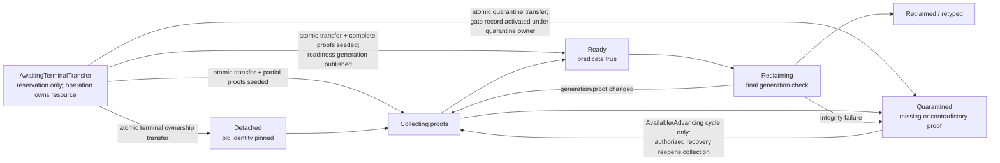

# Translation reclamation gate

The reclamation gate should be the only component allowed to convert a
logically retired translation resource into reusable memory, identifiers, or
authority. It should require a conjunction of typed, generation-bound proofs
selected for the exact resource: CPU translation completion, hardware and
software walker quiescence, privileged-access closure, code quiescence, DMA
quiescence, reference release, and lifecycle exclusion are independent facts.

A shootdown acknowledgement is therefore not a generic “safe to free” token.
The safest baseline is detach first, retain every dependency in a charged
retirement record, collect each required proof independently, and reuse only
when a resource-specific predicate evaluates true. Missing proof produces
quarantine, not optimistic reclamation.

This is proposed Atom architecture. Neither its proof-token algebra nor its
resource-lifecycle model has been implemented.

## Question, scope, and operational standard

The question is:

> After a mapping or table link has been removed, what exact evidence permits
> reuse of each mapping identity, frame, table page, translation tag, and code
> or DMA resource without a stale CPU, walker, device, or software reader
> reaching its new meaning?

The gate owns:

- retired-resource records and their dependency sets;
- proof-token validation and anti-replay generations;
- quarantine, bounded retention, accounting, and pressure policy;
- final retyping, zeroing, identifier recycling, and capability release; and
- an auditable explanation of why reuse became legal.

It does not detach mappings, execute invalidations, stop CPUs, drain devices,
or determine executable-code policy. Those components contribute evidence.
The gate passes only if:

1. Every live-to-retired transition is tied to an accepted mapping operation
   and the exact old resource incarnations.
2. No raw Boolean, elapsed grace period, or untyped acknowledgement can satisfy
   a proof obligation.
3. Required predicates are chosen from decoded use and provenance, including
   aliases, table ancestry, code history, and device reachability.
4. A CPU translation proof cannot satisfy DMA, code, software-reader, or table-
   walker obligations, and vice versa.
5. Late evidence is accepted only when its complete generation-bound tuple
   matches a still-existing retirement record; mismatched evidence or evidence
   whose record is gone is rejected, and no old proof can satisfy a replacement
   object or operation.
6. Retired resources remain owned, charged, inaccessible to new mappings, and
   inspectable until reuse or explicit quarantine resolution.
7. Memory pressure cannot weaken the predicate; exhaustion backpressures new
   work or escalates isolation/reset policy.
8. Reuse, retype, and capability reissue occur only after an atomic final
   recheck of all predicates and generations.

## Evidence and limits

| Evidence | Supported conclusion | Limit |
| --- | --- | --- |
| [Linux VM implementation contracts](../../../30-sources/linux-kernel-community-2026-virtual-memory-implementation-contracts.md) | Page-table teardown distinguishes unlinking, TLB invalidation, delayed freeing, and software walkers; user-copy and pinning have separate semantics | Linux implementation rules are not a formal portable contract |
| [RadixVM](../../../30-sources/clements-et-al-2013-radixvm.md) | Table unlink, remote invalidation acknowledgement, and release of physical references form an ordered lifetime protocol | Per-core-table design and evaluation are x86-specific |
| [Practical page-table verification](../../../30-sources/asterinas-community-2025-practical-page-table-verification.md) | Treating table pages and mapping states as typed objects supports local reasoning about ownership and deallocation | Work in progress; hardware/software concurrent reclamation is not fully proved |
| [RCU](../../../30-sources/mckenney-slingwine-1998-read-copy-update.md) | A grace period can prove that pre-existing software read-side critical sections have ended | It does not flush TLBs, stop hardware walkers, or drain devices |
| [Hazard pointers](../../../30-sources/michael-2004-hazard-pointers.md) | Explicitly published software hazards can prevent reclamation while lock-free readers retain an object | Uninstrumented hardware and DMA agents do not publish hazard pointers |
| [Arm SMMUv3](../../../30-sources/arm-2025-smmuv3-architecture.md) | Device translation invalidation and command/event completion are separate from CPU translation maintenance | Platform integration and a specific device's outstanding transactions remain system-specific |
| [Intel VT-d](../../../30-sources/intel-2024-vt-d-architecture.md) | IOMMU invalidation and queued completion can be required before remapping/reusing device-visible memory | Intel-specific and does not itself prove a device stopped DMA |
| [RISC-V IOMMU](../../../30-sources/risc-v-international-2026-iommu-architecture.md) | Device translation caches and `IOFENCE.C`-style completion participate in protected-I/O lifecycle | Implementation/platform compliance must still be verified |
| [Arm instruction fetch semantics](../../../30-sources/simner-et-al-2020-arm-instruction-fetch.md) | Publishing or retiring executable memory has instruction-fetch and synchronization obligations beyond data translation | Arm-focused formal model with bounded scope |
| [Don't shoot down TLB shootdowns](../../../30-sources/amit-et-al-2020-dont-shoot-down-tlb-shootdowns.md) | Early CPU acknowledgement is insufficient before freeing a page-table page because speculative or in-progress walkers may retain it | Linux/x86 evidence does not supply a general hardware-walker completion primitive |
| [Secure memory management](../../../30-sources/achermann-et-al-2020-secure-memory-management.md) | Safe retype must account for every mediated translation engine and the typed name-resolution paths by which it can reach memory | The model does not instantiate Atom's multi-domain reclamation token or failure policy |

These sources show why several lifetime domains exist. The common proof schema,
dependency matrix, and quarantine policy below are Atom synthesis.

## Logical retirement is not physical reuse

A restrictive operation has at least three distinct moments:

1. **Detached:** the live translation structure no longer advertises the old
   relation to new walkers after the prescribed publication step.
2. **Inaccessible under one domain:** for example, all targeted CPUs have
   completed the translation/access protocol.
3. **Reclaimable:** every agent and software reference relevant to this exact
   resource has become unable to use its old meaning.

Only the third authorizes reuse. A logically absent mapping can still have a
cached CPU translation; a detached table page can still be held by a hardware
or lock-free software walker; a CPU-clean frame can still be a DMA target; and
retired executable memory can still be referenced by instruction-side state or
an in-flight execution context.

## Retired resource record

```text
RetirementReservationIncarnation =
    (retirement_reservation_id, retirement_reservation_generation)

RetirementRecordIncarnation =
    (retirement_record_id, retirement_record_generation)

QuarantineIncarnation = (quarantine_id, quarantine_generation)

RetirementFacetDeliveryClass =
    ResourceOwner |
    ProofProducer<exact_predicate_and_scope> |
    QuarantineRecoverySupervisor<
        exact_quarantine_owner_and_incarnation>

RetirementFacetDeliverySlotIdentity<FacetPayload> =
    OpaqueSlotIdentity<FacetPayload> bound_to
        (RetirementRecordIncarnation,
         RetirementFacetDeliveryClass,
         exact_facet_scope_and_generation_digest,
         intended_recipient_domain_and_incarnation,
         nonwrapping_delivery_generation)

RetirementFacetDeliverySlotSet {
    retirement: RetirementRecordIncarnation,
    owner_facets:
        RetirementFacetDeliverySlotIdentity<
            Atomic<(
                Authorized<RetirementRecordRef, Inspect>,
                Authorized<RetirementRecordRef,
                           ClaimReclaimable<
                               intended_owner_domain_and_incarnation>>)>>,
    producer_facets:
        BoundedMap<PredicateObligationIdentity,
                   RetirementFacetDeliverySlotIdentity<
                       Authorized<RetirementRecordRef,
                                  SubmitProof<exact_predicate_and_scope>>>>,
    recovery_facet:
        None |
        RetirementFacetDeliverySlotIdentity<
            Authorized<RetirementRecordRef,
                       AdvanceQuarantineRecovery<
                           exact_quarantine_owner_and_generation>>>
}

RetirementProducerOperation =
    TranslationOperation(operation_id) |
    CodeRetirementOperation(CodeRetirementOperationIncarnation)

RetirementRecordRef {
    retirement: RetirementRecordIncarnation,
    resource_set_and_provenance_digest,
    right:
        Inspect |
        ClaimReclaimable(intended_owner_domain_and_incarnation) |
        SubmitProof {
            predicate_kind,
            authorized_producer_incarnation,
            exact_resource_and_scope
        } |
        AdvanceQuarantineRecovery {
            quarantine: QuarantineIncarnation,
            quarantine_owner_incarnation,
            recovery_generation
        },
    capability_generation
}

ReservedRetirement {
    reservation: RetirementReservationIncarnation,
    proposed_retirement_record: RetirementRecordIncarnation,
    resource_set_and_provenance_digest,
    owner_and_quota,
    preallocated_facets_and_recipient_bound_delivery_slots,
    embedded_reclaimable_and_recovery_result_slots,
    state: AwaitingTerminalTransfer
}

RetiredResource {
    retirement: RetirementRecordIncarnation,
    source_reservation: RetirementReservationIncarnation,
    producer_operation: RetirementProducerOperation,
    resource_kind,
    resource_identity_and_incarnation,
    address_space: AddressSpaceIncarnation,
    mapping_incarnations: Set<MappingIncarnation>,
    table_page_incarnations: Set<TablePageIncarnation>,
    detached_at_mutation_sequence,
    provenance_and_alias_snapshot,
    required_predicates,
    satisfied_proofs,
    retained_dependencies,
    current_facet_delivery_slot_set,
    reclaimable_readiness_generation_and_result_slot,
    quarantine_recovery_state:
        NotQuarantined(next_recovery_generation) |
        Available {
            quarantine: QuarantineIncarnation,
            quarantine_owner_incarnation,
            recovery_generation,
            advance_facet_delivery_slot_identity
        } |
        Advancing {
            quarantine: QuarantineIncarnation,
            quarantine_owner_incarnation,
            recovery_generation
        } |
        Permanent {
            quarantine: QuarantineIncarnation,
            quarantine_owner_incarnation,
            reason
        },
    terminal_transfer_binding: Proposed(binding) | Committed(binding),
    owner_and_quota,
    state: AwaitingTerminalTransfer | Detached | Collecting | Ready |
           Reclaiming | Reclaimed | Quarantined,
    audit_digest
}

TerminalOwnershipTransferBundle {
    producer_operation: RetirementProducerOperation,
    address_space: AddressSpaceIncarnation,
    completion_epoch,
    terminal_outcome_digest,
    terminal_core_digest,
    ownership_entries:
        BoundedMap<ResourceIdentityAndIncarnation,
                   ReturnedToCaller(return_slot) |
                   CommittedToMapping(mapping: MappingIncarnation) |
                   TransferredToRetirement {
                       retirement_reservation: RetirementReservationIncarnation,
                       proposed_terminal_transfer_binding,
                       initial_satisfied_proof_digests
                   } |
                   TransferredToQuarantine {
                       quarantine: QuarantineIncarnation,
                       retirement_reservation:
                           RetirementReservationIncarnation,
                       proposed_terminal_transfer_binding,
                       initial_satisfied_proof_digests
                   }>,
    reservation_dispositions:
        BoundedMap<RetirementReservationIncarnation,
                   ActivatedForRetirement(resource_set_digest) |
                   CancelledAndQuotaReleased |
                   ActivatedInQuarantine(quarantine: QuarantineIncarnation,
                                         resource_set_digest,
                                         proposed_terminal_transfer_binding_digest)>,
    exact_resource_partition_digest,
    bundle_digest
}

TerminalSealIncarnation = (terminal_seal_id, terminal_seal_generation)

SealedTerminalTransfer {
    seal: TerminalSealIncarnation,
    terminal_core,
    ownership_bundle,
    final_terminal_digest
}

CodeRetirementTransferCore {
    producer_operation: CodeRetirementOperationIncarnation,
    published_code: PublishedCodeIncarnation,
    address_space: AddressSpaceIncarnation,
    code_publication_generation_state_incarnation,
    base_and_next_code_publication_generations,
    generation_state_transition_digest,
    executable_version_execution_quiescent_proof_digest,
    exact_restriction_quiescent_mapping_alias_and_extent_set,
    operation_owned_backing_pin_bundle_digest,
    proposed_retirement_and_quarantine_bindings,
    exact_resource_partition_digest,
    transfer_core_digest
}

CodeRetirementOwnershipTransferBundle {
    producer_operation: CodeRetirementOperationIncarnation,
    published_code: PublishedCodeIncarnation,
    address_space: AddressSpaceIncarnation,
    generation_state_transition_digest,
    transfer_core_digest,
    ownership_entries:
        BoundedMap<ResourceIdentityAndIncarnation,
                   TransferredToRetirement {
                       retirement_reservation: RetirementReservationIncarnation,
                       proposed_terminal_transfer_binding,
                       initial_satisfied_proof_digests
                   } |
                   TransferredToQuarantine {
                       quarantine: QuarantineIncarnation,
                       retirement_reservation: RetirementReservationIncarnation,
                       proposed_terminal_transfer_binding,
                       initial_satisfied_proof_digests
                   }>,
    reservation_dispositions,
    exact_resource_partition_digest,
    bundle_digest
}

SealedCodeRetirementTransfer {
    seal: TerminalSealIncarnation,
    transfer_core: CodeRetirementTransferCore,
    ownership_bundle: CodeRetirementOwnershipTransferBundle,
    final_transfer_digest
}
```

Preparation creates only an `AwaitingTerminalTransfer` reservation. The
reservation fixes one fresh nominal `RetirementRecordIncarnation`; terminal
activation may create only that record, and neither bare ID is accepted by an
API. It also fixes the resource-owner, proof-producer, and recovery-supervisor
delivery destinations. Those destinations are domain-and-incarnation-bound
mailboxes authorized independently of this retirement record; the record does
not solve delivery by placing a newly minted claim right behind the same
one-shot slot. The
accepted operation places every resource in one sealed
`TerminalOwnershipTransferBundle`. To avoid a digest cycle without permitting
mix-and-match, `TranslationTerminalCore` is the canonical terminal record with
both `ownership_transfer_bundle_digest` and its self-referential
`terminal_digest` omitted. The bundle commits to `terminal_core_digest`, and
the final digest is `H(terminal_core_digest || bundle_digest)` over a
domain-separated canonical encoding. The bundle's proposed retirement bindings
and reservation IDs are therefore bound before either object is published. One infallible, locked publication commit advances the address-
space completion epoch, transfers every returned/committed/retired/quarantined
resource, activates and seeds the matching retirement records, and publishes
that exact terminal. There is no digest cycle, ownerless gap, or preterminal
gate claim.
The bundle's `producer_operation`, `address_space`, `completion_epoch`, and
`terminal_outcome_digest` are checked projections of that exact terminal core,
not independent inputs. Its `exact_resource_partition_digest` is derived from
the same core's returned, committed, retired, and quarantined resource fields.
Any unequal projection or partition makes sealing fail while the operation
retains ownership.
Sealing enforces the partition in both directions. Every
`TransferredToRetirement` entry references exactly one
`ActivatedForRetirement` reservation; the reservation's resource set is
exactly the reverse image of the ownership entries that reference it, and each
proposed binding matches. A cancelled reservation is referenced by no
retirement entry. Every `TransferredToQuarantine` entry references exactly one
`ActivatedInQuarantine` reservation; both name the same quarantine owner and
proposed binding, and the reservation set is the exact reverse image of those
resource entries. Thus neither an unowned resource nor an activated
empty or extra retirement record can be hidden in either map.
For both retirement and quarantine, every initial proof digest is validated
against the same terminal core, current resource incarnation, and generated
predicate obligation before it seeds the activated record; quarantine never
forgets already-valid partial evidence.
For a table result or `ContextTagRetirementPrepared`, the matching ownership
entry must use the identical reservation incarnation and proposed transfer
binding carried by that result, and seed the exact result/proof digest for that
same resource. A prepared proof for reservation A can never activate
reservation B.
Each retained dependency—frame pin, table page, mapping identifier, tag lease,
DMA binding, code-generation record, or software-reader node—is typed and
generation-bound. The record itself is allocated from pre-reserved teardown
capacity so low memory cannot erase the evidence needed to recover safely.

## Independent proof tokens

```text
QuiescenceProof {
    producer_component,
    resource_identity_and_incarnation,
    address_space: AddressSpaceIncarnation,
    producer_operation: RetirementProducerOperation,
    obligation_generation,
    profile_digest,
    evidence_digest,
    predicate: QuiescencePredicate
}

QuiescencePredicate =
    CpuTranslation {
        token: CpuTranslationQuiescent<
            TargetSetCompleted<LocalMaintenanceComplete>>
    }
  | CpuAccess {
        frozen_borrow_epoch,
        frozen_borrow_ids_and_cpu_incarnations,
        drain_or_lifecycle_discharge_digest
    }
  | Restriction {
        cpu_translation_proof_id,
        cpu_access_proof_id
    }
  | HardwareWalker {
        token: HardwareWalkerQuiescent
    }
  | SoftwareReader {
        metadata_identity_and_incarnation,
        reader_scheme_and_epoch,
        hazard_or_grace_period_digest
    }
  | Dma {
        dma_mapping_and_device_incarnations,
        iommu_device_and_transport_completion_digest
    }
  | Code {
        executable_image_incarnation,
        frozen_executor_set_or_epoch,
        execution_and_fetch_completion_digest
    }
  | Reference {
        address_space: AddressSpaceIncarnation,
        reference_admission_epoch,
        lineage: ReferenceLineageIncarnation,
        gate: ReferenceGateIncarnation,
        released_reference_set_digest
    }
  | LifecycleExcluded {
        agent_identity_and_incarnation,
        lifecycle_operation_and_generation,
        exclusion_kind_and_proof_digest
    }
```

The embedded tokens are authoritative; the gate does not accept caller-
repeated projections of their plan, target-slot, observer-binding, discharge,
table, or walker-obligation fields. Its checked constructor compares direct
fields wherever the canonical token carries them—CPU operation/address/plan and
walker operation/table/obligation digest. It checks the outer resource identity
and gate-obligation generation against the current `RetiredResource`, then
derives profile, address-space, and resource coverage through the immutable
plan or walker obligation named by the token digest. It never demands a fake
common field that one token type does not contain. This removes a second,
potentially mismatched source of proof identity while preserving typed
provenance.

Every other proof variant is likewise checked against the exact generated
predicate obligation in the current `RetiredResource`, not merely against its
variant tag. `CpuAccess` must match resource, operation, obligation generation,
profile, frozen borrow epoch, and borrow set. `Restriction` must reference CPU-
translation and CPU-access proofs with the same outer resource, operation,
generation, and profile. `SoftwareReader`, `Dma`, `Code`, and
`LifecycleExcluded` identities and epochs must equal the provenance-selected
obligation, and the duplicate address-space field in `Reference` must equal the
outer token and retirement record. A same-kind proof for another object or
epoch is rejected.

At minimum, keep these proof kinds distinct:

- `CpuTranslationQuiescent`: all frozen may-hold CPU incarnations executed the
  required invalidation or were terminally excluded;
- `CpuAccessQuiescent`: new privileged `UserAccessGuard` borrows are closed and
  every old-generation helper borrow that could use the mapping has drained or
  its owning CPU incarnation is terminally excluded;
- `RestrictionQuiescent`: the exact operation has both
  `CpuTranslationQuiescent` and `CpuAccessQuiescent`;
- `HardwareWalkerQuiescent`: page-table walkers can no longer reach a detached
  descriptor/table under the profile's completion rules;
- `SoftwareReaderQuiescent`: pre-existing kernel readers of the ledger/table
  metadata left their RCU epoch or released explicit hazards;
- `DmaQuiescent`: device translation caches and outstanding transactions for
  the frame/binding are drained or the device is terminally fenced;
- `CodeQuiescent`: no execution context or instruction-side state can use the
  retired executable generation;
- `ReferenceQuiescent`: capabilities, pins, borrows, and operation references
  required by the object's ownership contract are released; and
- `LifecycleExcluded`: a failed or removed CPU/device incarnation is proved
  unable to resume with old state.

The tagged payload makes cross-kind substitution structurally invalid; for
example, a CPU target-set digest cannot populate a DMA or table-walker proof.
Tokens can be aggregated for storage, but aggregation records the members; it
does not merge predicate variants. The gate asks a producer to reissue evidence
when its format/profile changes rather than guessing equivalence.

## Resource-specific predicate matrix

| Retired resource | Required baseline predicates | Why |
| --- | --- | --- |
| Mapping identity/ledger node | Validated terminal resource disposition or effect result that transfers this exact incarnation to the gate, software readers, reference release | A merely terminal operation may have left the mapping visible or quarantined; a reader or stale capability must not see the identifier with a new meaning |
| Ordinary CPU-only data frame | CPU translation, CPU access, software readers, reference release | A stale virtual translation or pin could access a reallocated object |
| Page-table page | CPU translation, hardware walker, software readers, reference release | The page may be interpreted as descriptors after retype |
| ASID/PCID/tag lease | Exact retirement epoch and allocator-frozen cumulative `may_hold_cpus ∪ Installing ∪ LoadingRoot ∪ Installed ∪ RestoringSafeContext ∪ binding-matched Entering` snapshot; allocator-slot-, install-, guard-, and owner-incarnation-matched install-load exclusion for every nonterminal slot followed by exact-binding invalidation/lifecycle discharge for every member; typed nonreusable disposition; reference release | Old cached entries could acquire the new address-space meaning even after a CPU clears its current software slot, and an interrupted installer could load an old tuple after an early flush |
| Device-visible frame | All data-frame predicates plus IOMMU/device translation and DMA quiescence | CPU TLB completion says nothing about device access |
| Executable frame or code generation | Data-frame predicates plus code quiescence and code-policy proof | Old code can execute after data translation is closed |
| Mixed page-size ancestor | CPU-translation and hardware-walker quiescence for the whole covered ancestry, plus software-reader/reference proofs before retype | A stale large-page/nonleaf interpretation can bypass leaf-local reasoning |
| Kernel table/metadata object | Software-reader proof plus any hardware-walker proof from its provenance | Lock-free lookup and hardware walk lifetimes differ |

This table is computed from a provenance/use ledger. A “never device visible”
claim must be recorded from authoritative binding history; absence of a current
IOMMU mapping is not sufficient if DMA was not already drained.

## Gate state machine



Before terminal transfer, the reservation exists but the accepted mapping
operation still owns the resource and the gate accepts no proof or reclaim
request. Before `Ready`, the resource is absent from all allocators. During
`Reclaiming`, the gate serializes with new proof-invalidating lifecycle events,
revalidates every tuple, removes residual aliases, applies required zeroing or
poisoning, and atomically transfers the resource to its next typed owner.

There is no transition from `Quarantined` to `Reclaimed` based only on memory
pressure or administrator assertion. Recovery supplies the missing proof,
terminally fences the agent, or resets a containing trust domain under a
documented policy. A quarantined reservation remains a nominal, generation-
bound gate record owned and charged to the quarantine; it can accept tuple-
matching late evidence, but cannot become `Ready` until an authorized recovery
action moves it back to `Collecting` and revalidates the complete predicate set.
`Permanent` quarantine has no such edge and accepts evidence only for protected
diagnostics; counter exhaustion is never repaired by wrap.

## CPU translation and table-walker completion

The [shootdown coordinator](shootdown-coordinator.md) produces per-target
local-maintenance evidence and the typed
`CpuTranslationQuiescent<TargetSetCompleted<LocalMaintenanceComplete>>`
aggregate. The access-
borrow registry and mapping transaction separately produce
`CpuAccessQuiescent`. The gate verifies the exact plan, target/slot generations,
and complete per-target `ObserverTranslationBinding`-set digest against the
retired resource's provenance and may-hold snapshot, including activation
catch-up records. Equal CPU sets with a different tag/root/alias binding cannot
satisfy the predicate.
An early acknowledgement that only closes user return is inadequate for a
table page or tag lease.

Hardware-walker completion is profile-specific. Atom must determine whether
the ISA's prescribed invalidation plus barriers drains pre-existing walkers,
or whether an additional architecturally proved walker-retirement event or
bounded interval with observable, generation-bound completion is required.
Elapsed wall time alone is never evidence. Until that claim is supported for a
profile, detached table pages remain in a conservative epoch that cannot be
reused as arbitrary data.

When a profile requires that additional event, the planner names its authorized
producer, table/operation and generation binding, ordering rule, and evidence
format. The resulting event digest is carried in the tagged
`HardwareWalker` payload and validated by the gate. A profile without such a
validated interface cannot reclaim table pages; timeout does not fill the
field.

The boundary is intentional. `CpuTranslationQuiescent` already proves that no
cached translation or in-flight *leaf* walk can later install or use the old
mapping; it is sufficient for the CPU-translation part of ordinary-frame and
context-tag retirement. `HardwareWalkerQuiescent(table)` is an additional,
orthogonal table-specific claim that no walk can still interpret a detached
table page as translation structure, and is required only before that table
memory is retyped or reused. Neither proof implies the other, and the table-page
gate requires both. The hardware-walker predicate is not silently added to
ordinary frames or tag leases.

Software readers participate separately. A table inspector, fault diagnostic,
or lock-free ledger reader enters a declared RCU-like epoch or publishes an
explicit hazard. Ending all pre-existing software reads does not imply a TLB
flush, and a TLB flush does not end a software critical section.

## DMA and protected-I/O composition

For a device-reachable frame, the gate consumes evidence from the protected-
I/O lifecycle:

1. deny new device bindings and submissions for the binding generation;
2. detach or restrict the IOMMU/device translation;
3. perform the architecture-required IOTLB/device-cache invalidation;
4. wait for command completion with correct ordering;
5. drain or cancel outstanding DMA transactions, or fence/reset the device;
6. discharge bounce buffers, queued descriptors, and device-owned references;
   and
7. publish `DmaQuiescent` for the exact frame and device incarnations.

An Arm SMMU command-sync, VT-d invalidation completion, or RISC-V `IOFENCE.C`
may be necessary, but none alone proves arbitrary device transactions have
ended. The platform/device adapter defines that stronger lifecycle.

## Executable-code composition

Executable retirement consumes a `CodeQuiescent` proof from the executable-
code component. It can require:

- removal of executable and conflicting writable aliases;
- CPU translation and instruction-cache/pipeline maintenance;
- passage of every execution context that could hold the old code generation;
- invalidation of patch/JIT metadata and callable capabilities; and
- release of unwind, tracing, probe, or breakpoint references.

A data-side unmap acknowledgement cannot stand in for these obligations.
Conversely, instruction-side synchronization does not release a frame still
reachable through an old writable data mapping.

## Epochs, RCU, and hazard pointers

Epochs are useful implementation mechanisms, not universal safety facts. One
retirement record may wait on several independent clocks:

```text
translation_epoch,
software_reader_epoch,
code_epoch,
device_epoch,
cpu_lifecycle_epoch
```

The gate may use the maximum completed epoch *within one domain* to batch
resources. It must not compare numeric values across domains or infer that one
advanced because another did. RCU is well suited to stable, instrumented
software readers; hazard pointers may fit rare lock-free retained references.
Neither observes hardware walkers, TLBs, or DMA engines.

Every epoch includes a boot/lifecycle incarnation and has an explicit wrap
protocol. A late proof from a previous boot era is invalid even if counters
match.

## Memory pressure, quotas, and quarantine

Retired bytes remain charged to the operation's owner or a bounded system
teardown reserve. Policy may:

- throttle further mapping churn by that domain;
- prioritize completion processing;
- request CPU/device lifecycle escalation;
- reject new allocations before acceptance; or
- isolate/reset a failed containment domain when already authorized.

Policy may not hand an unproved frame to another principal. Global exhaustion
caused by an unresponsive physical agent is a platform availability failure,
not permission to violate isolation. Quarantine records survive diagnostics
and preserve enough identity to accept later valid evidence. Generation-
matching late evidence may advance only the still-existing retirement record
named by its full tuple. It is rejected after that record is gone, on any tuple
mismatch, and for every replacement incarnation; it never rewrites an
operation's exactly-once terminal result.

## API shape

```text
RetirementFacetInboxRef<AcceptedDeliveryClass> {
    recipient_domain_and_incarnation,
    accepted_delivery_class: AcceptedDeliveryClass,
    right: InspectOwnDeliveries | ClaimOwnDelivery,
    capability_generation
}

reserve_retirement(prepared_plan, resource_set, provenance_snapshot,
                   facet_delivery_destinations)
  -> ReservedRetirement | PreAcceptanceError

seal_terminal_transfer_bundle(TranslationTerminalCore,
                              exact_resource_partition,
                              Set<ReservedRetirement>)
  -> SealedTerminalTransfer
   | TransferNotSealed(OperationRetainsOwnership, validation_error)

publish_terminal_with_transfer(SealedTerminalTransfer)
  -> TerminalPublished(
         TranslationTerminal,
         RetiredResourceSet,
         BoundedMap<RetirementRecordIncarnation,
                    RetirementFacetDeliverySlotSet>)

seal_code_retirement_transfer_bundle(
    CodeRetirementTransferCore,
    exact_resource_partition,
    Set<ReservedRetirement>)
  -> SealedCodeRetirementTransfer
   | TransferNotSealed(CodeRetirementOperationRetainsOwnership,
                       validation_error)

publish_code_retirement_transfer(SealedCodeRetirementTransfer)
  -> CodeRetirementTransferPublished(
         code_retirement_operation,
         RetiredResourceSet,
         BoundedMap<RetirementRecordIncarnation,
                    RetirementFacetDeliverySlotSet>)

retirement_facet_delivery_status(
    Borrowed<Authorized<
        RetirementFacetInboxRef<accepted_delivery_class>,
        InspectOwnDeliveries>>,
    RetirementRecordIncarnation)
  -> AwaitingTerminalTransfer
   | NoUnclaimedDelivery(current_recipient_delivery_generations)
   | Available(BoundedSet<opaque_recipient_bound_delivery_slot_identity>)

claim_retirement_owner_facets(
    Borrowed<Authorized<RetirementFacetInboxRef<ResourceOwner>,
                        ClaimOwnDelivery>>,
    opaque_owner_facet_delivery_slot_identity)
  -> Claimed(
         Authorized<RetirementRecordRef, Inspect>,
         Authorized<RetirementRecordRef,
                    ClaimReclaimable<
                        intended_owner_domain_and_incarnation>>)
   | AlreadyClaimed(delivery_generation)
   | NotPublished
   | StaleOrWrongSlot(current_recipient_slot_identities)

claim_retirement_proof_facet(
    Borrowed<Authorized<
        RetirementFacetInboxRef<
            ProofProducer<exact_predicate_and_scope>>,
        ClaimOwnDelivery>>,
    opaque_proof_facet_delivery_slot_identity)
  -> Claimed(Authorized<RetirementRecordRef,
                        SubmitProof<exact_predicate_and_scope>>)
   | AlreadyClaimed(delivery_generation)
   | NotPublished
   | StaleOrWrongSlot(current_recipient_slot_identities)

claim_retirement_recovery_facet(
    Borrowed<Authorized<
        RetirementFacetInboxRef<
            QuarantineRecoverySupervisor<
                exact_quarantine_owner_and_incarnation>>,
        ClaimOwnDelivery>>,
    opaque_recovery_facet_delivery_slot_identity)
  -> Claimed(Authorized<RetirementRecordRef,
                        AdvanceQuarantineRecovery<
                            exact_quarantine_owner_and_generation>>)
   | AlreadyClaimed(delivery_generation)
   | NotPublished
   | StaleOrWrongSlot(current_recipient_slot_identities)

submit_proof(
    Borrowed<Authorized<RetirementRecordRef,
                        SubmitProof<exact_predicate_and_scope>>>,
    QuiescenceProof)
  -> ProofAccepted | Duplicate | WrongGeneration | Insufficient | Contradiction

resume_quarantined_retirement(
    Authorized<RetirementRecordRef,
               AdvanceQuarantineRecovery<
                   exact_quarantine_owner_and_generation>>)
  -> Collecting(RetirementRecordIncarnation, RecoveryFacetConsumed)
   | StillQuarantined(
         reason,
         Authorized<RetirementRecordRef,
                    AdvanceQuarantineRecovery<
                        exact_quarantine_owner_and_generation>>)

Reclaimable {
    retirement: RetirementRecordIncarnation,
    resource_identity_and_incarnation,
    readiness_generation,
    proof_set_digest
}

poll(Borrowed<Authorized<RetirementRecordRef, Inspect>>)
  -> Collecting(missing_predicates)
   | Ready(opaque_reclaimable_result_slot_identity, readiness_generation)
   | Quarantined(reason)

claim_reclaimable(
    Borrowed<Authorized<RetirementRecordRef,
                        ClaimReclaimable<
                            intended_owner_domain_and_incarnation>>>,
    opaque_reclaimable_result_slot_identity)
  -> NotReady(current_readiness_generation)
   | Claimed(Reclaimable)
   | AlreadyClaimed(readiness_generation)
   | StaleOrWrongSlot(current_slot_identity, current_readiness_generation)

PreparedReclaimDestination {
    destination_type,
    intended_owner_domain_and_incarnation,
    authority: Authorized<RetypeTo<destination_type>>
}

ReclaimedDestination {
    destination_type,
    resource_identity_and_new_incarnation,
    authority: Authorized<DestinationRef<destination_type>>
}

reclaim(Reclaimable, destination: PreparedReclaimDestination)
  -> Rejected(
         WrongDestinationOwner,
         unchanged_reclaimable,
         unchanged_prepared_destination)
   | Reclaimed(ReclaimedDestination)
   | StillWaiting(
         retirement: RetirementRecordIncarnation,
         destination:
             OneShotReturnSlot<PreparedReclaimDestination>)
   | Quarantined(
         retirement: RetirementRecordIncarnation,
         reason,
         destination:
             OneShotReturnSlot<PreparedReclaimDestination>)

claim_returned_reclaim_destination(
    Borrowed<Authorized<RetirementRecordRef,
                        ClaimReclaimable<
                            intended_owner_domain_and_incarnation>>>,
    opaque_destination_return_slot_identity)
  -> Claimed(PreparedReclaimDestination)
   | AlreadyClaimed(return_slot_generation)
   | NotAvailable
   | StaleOrWrongSlot(current_destination_return_slot_identity)
```

Only the gate emits `Reclaimable` and holds `reclaim`. An `Inspect` facet can
observe status and an opaque result-slot identity, but cannot extract or spend
the result. Extraction requires the borrowed, intended-owner-bound
`ClaimReclaimable` facet for the same record and slot. The facet is stable
authority to claim this record's results, not the result itself. Each
transition into `Ready` advances a nonwrapping readiness generation and
publishes exactly one new linear token in the record's embedded one-shot slot.
The first successful claim for that generation moves the token and later
claims report `AlreadyClaimed`; a `NotReady` result moves nothing. The token is
incarnation- and readiness-generation-bound and consumed by the final
locked generation/proof recheck. If that recheck no longer holds, the stale
token is cancelled and the record returns to `Collecting`; if integrity fails,
the resource moves to `Quarantined`. In both cases the exact unconsumed
`PreparedReclaimDestination`, including its authority, is placed in a stable
one-shot return slot. A failed reclaim therefore loses neither destination
authority nor resource ownership and cannot accidentally reuse a now-stale
`Reclaimable`; if the record becomes `Ready` again, `poll` exposes a new slot
identity and readiness generation that the still-valid borrowed claim facet can
claim. Readiness-generation exhaustion permanently quarantines the record
rather than wrapping.
An old, cancelled, foreign-record, or wrong-generation slot returns
`StaleOrWrongSlot` with current non-authority metadata and moves neither the
claim facet nor any token.

`OneShotReturnSlot<PreparedReclaimDestination>` likewise denotes only an
opaque, record- and return-generation-bound identity. The stable
`ClaimReclaimable<intended_owner_domain_and_incarnation>` facet is also the
only authority that can call `claim_returned_reclaim_destination`; a successful
call moves the entire prepared destination, including its `RetypeTo` authority,
exactly once. A repeated, foreign-owner, foreign-record, or stale identity
moves nothing. `reclaim` checks the prepared destination's owner against the
record before consuming either input; an owner mismatch synchronously returns
both unchanged. The success path does not use a slot: `Reclaimed`
synchronously returns the newly minted, intended-owner-bound destination
authority. Thus every outcome accounts for the consumed destination authority
without making polling or possession of a slot identity sufficient to extract
it.

Quarantine recovery is cycle-specific. Its facet binds the exact record,
resource/provenance digest, quarantine ID and owner incarnation, and current
recovery generation. `StillQuarantined` returns that same authority;
`Collecting` consumes and revokes it. If the record later re-enters quarantine,
the gate advances the nonwrapping recovery generation and publishes a fresh
facet through an embedded, pre-reserved one-shot delivery slot to the
designated supervisor. The slot identity appears both in the publication's
initial delivery-slot set when quarantine is the initial state and in
`retirement_facet_delivery_status` after any later rotation. Only the bound
recovery-supervisor inbox can claim it. A stale facet or slot from any earlier
quarantine cycle cannot advance the record; generation exhaustion retains
permanent quarantine.

`SubmitProof` is likewise a borrowed facet scoped to one predicate kind,
authorized producer incarnation, and exact resource/obligation scope. A bare
producer name or incarnation is never submission authority, and a valid
producer cannot use its facet to satisfy another predicate or retirement
record. Duplicate, rejected, and accepted submissions leave the borrowed facet
available for retry or later evidence from that producer.

The terminal-transfer commit activates the reservation's preallocated facets
and publishes each through a stable one-shot delivery slot: `Inspect` and the
owner-bound `ClaimReclaimable` facet go to the designated resource owner, and
predicate-specific `SubmitProof` facets go to their named producers. If the
initial state is quarantined, the exact cycle-specific
`AdvanceQuarantineRecovery` facet goes only to the designated recovery
supervisor. Both publication APIs return the complete map of non-authority slot
identities, and `retirement_facet_delivery_status` lets each already-authorized
recipient rediscover only its own unclaimed identities. The three claim
operations equality-check the record, facet class and scope, intended recipient
domain/incarnation, capability generation, and delivery generation before
moving a facet. The owner pair is atomic, so `Inspect` cannot be split from its
matching owner-bound claim facet; a failed claim leaves both in the slot. The
recipient inbox capabilities are pre-existing delivery authority supplied by
the named domains and services, not values minted into these slots.

The embedded readiness, destination-return, and recovery slots plus their
generation counters are part of the sealed bundle, so later slot rotation is
an infallible record-state transition rather than authority allocation or owner
selection. Losing a copied slot identity is recoverable through the matching
recipient's delivery-status call. Losing an inbox or ordinary observer handle
cannot manufacture a claim or recovery right; every undelivered authority
remains owned by its slot and the resource remains retained rather than
implicitly reclaimable.

Executable retirement uses the dedicated code-transfer seal rather than
forging a `TranslationTerminal`. Its core binds the parent retirement
operation, exact published version and persistent generation-state transition,
the execution-quiescence and RX-restriction evidence, the actual backing-pin
bundle, and the same exhaustive resource partition consumed by its dedicated
`CodeRetirementOwnershipTransferBundle`. The seal checks the bundle's
producer-operation, published-code, address-space, generation-state transition,
transfer-core digest, reservation reverse images, and proposed gate/quarantine
bindings before an infallible atomic publication transfers the mappings,
extents, pins, and proof-producer facets. Component 4 retains only typed
non-owning progress and the owner-bound inspect/claim facets; it later returns
`ReclaimableExecutableImage` only after using those facets to obtain the gate's
linear token. Thus the private RX-removal suboperation need not—and cannot—
publish a general translation terminal, while the reclamation gate still
receives an authenticated terminal producer and complete ownership handoff.
The code bundle has no fabricated translation completion epoch or translation-
terminal outcome. Its final digest is the domain-separated hash of the exact
code core and code bundle; neither can be paired with a translation core or a
bundle from another retirement.

Retirement-record allocation and every expected attachment capacity
are fallible only during preparation. After mapping acceptance, bundle sealing
validates the complete resource partition, proposed transfer bindings,
reservation generations, initial proof set, terminal outcome, next completion
epoch, the outcome/effect/observer-gate compatibility matrix, and the canonical
terminal-core digest while
the draft remains private and the operation remains the
sole owner. A sealing mismatch returns `TransferNotSealed`; it transfers
nothing and publishes neither epoch nor terminal. Its operation-retains-
ownership value is returned synchronously; there is no unpublished authority
slot to discover, and facet claims report `NotPublished`. Recovery must either
correct the private bundle or seal a distinct quarantine terminal whose
resource entries all name that quarantine. Once sealed, the locked publication commit is
an infallible state transition consuming one linear `SealedTerminalTransfer`;
the nominal seal prevents pairing a core and bundle from different sealing
attempts. The bundle exhaustively partitions both the resource set and every
reserved-retirement incarnation. Thus a returned/committed resource cancels its
unused reservation and releases quota, a retired resource activates exactly
one reservation, and a quarantined resource activates the same preallocated
gate record under the exact quarantine owner. The commit applies the sealed observer-gate disposition,
changes every matching record from
`AwaitingTerminalTransfer` to `Detached`/`Collecting` (or `Ready` when all
predicates are already seeded), or to `Quarantined` for the matching quarantine
partition; it commits every other ownership destination,
advances the address-space `completion_epoch`, and release-publishes the exact
terminal. Until that event the operation remains owner and proof/reclaim calls
are rejected. A quarantine commit transfers ownership to quarantine; it never
simultaneously claims that the operation remains owner: every reservation
referenced by a `TransferredToQuarantine` entry is atomically activated as a
preserved `Quarantined` gate record with the exact quarantine owner. It cannot
become `Ready` or collectible until
authorized recovery reopens collection and all predicates validate. Ordinary allocators receive
a resource after the final transition, never a pointer plus advice to “wait
long enough.” Bulk interfaces preserve per-resource identities and failure
results.

## Verification and fault injection

- Model each resource class and prove that `Reclaimed` implies every selected
  predicate for its old incarnation.
- Generate cross-domain token swaps, generation wrap, duplicate/late proof,
  partial target sets, and object-ID reuse.
- Delay one CPU, software reader, code context, IOMMU completion, DMA device,
  and capability reference independently; only the relevant resources wait.
- Reuse a freed table page immediately as adversarial writable data in a test
  backend and assert the model never permits a stale walker to reach it.
- Stress huge-page split/join and table collapse while diagnostic readers hold
  RCU/hazard references.
- Inject out-of-order IOMMU completion and a device that continues DMA after
  translation invalidation.
- Force tiny retirement quotas and ensure backpressure/quarantine never turns
  into early reuse.
- Measure retired-byte high watermarks, time per predicate, quarantine age,
  batching efficiency, and false retention by resource kind.

## Staged implementation

1. Implement CPU-only mappings with synchronous translation/access completion,
   one conservative table-walker epoch, and no immediate table-page reuse.
2. Add instrumented software-reader RCU/hazards, proof validation, quarantine,
   and the adversarial reuse test backend.
3. Integrate executable-code retirement as a separate predicate.
4. Integrate protected I/O one IOMMU/device profile at a time; device-visible
   frames remain unreclaimable through this path until then.
5. Optimize batching and epochs only after resource-specific implications are
   model-checked and measured.

## Alternatives and tradeoffs

- **Never reclaim table pages** is a useful bring-up mode and safety oracle,
  but cannot sustain a long-lived system.
- **One global grace period** is simple but conflates agents and causes
  unrelated failures to retain all memory.
- **Reference counting alone** manages explicit software owners, not hidden
  translation or device caches.
- **Immediate reuse after shootdown ack** is efficient only if the ack's type
  really includes every walker and access obligation; a generic Boolean does
  not establish that fact.

## Unresolved questions

- Which architecture operations establish hardware-walker quiescence strongly
  enough for immediate table-page retype on each supported CPU?
- Can page-table memory use a protected allocator whose delayed reuse makes
  walker uncertainty cheap enough for the first system?
- What precise device lifecycle evidence is available on each target platform,
  beyond IOMMU command completion?
- How are persistent-memory or accelerator references represented in the
  predicate matrix?
- Which executable states—return addresses, JIT call sites, probes, unwind
  metadata—belong in `CodeQuiescent`?
- How should quarantine survive partial system restart without accepting old
  proof tokens into a new boot era?

## Connections

- [Address translation and protection transitions](../address-translation-and-protection-transitions.md)
- [Mapping transaction](mapping-transaction.md)
- [Invalidation planner](invalidation-planner.md)
- [Shootdown coordinator](shootdown-coordinator.md)
- [Translation-context allocator](translation-context-allocator.md)
- [Safe user-access helpers](safe-user-access-helpers.md)
- [Ordering, coherence, and code publication](../ordering-coherence-and-code-publication.md)
- [Protected I/O and DMA ownership](../protected-io-and-dma-ownership.md)

## Sources

- [Linux VM implementation contracts](../../../30-sources/linux-kernel-community-2026-virtual-memory-implementation-contracts.md)
- [RadixVM](../../../30-sources/clements-et-al-2013-radixvm.md)
- [Practical page-table verification](../../../30-sources/asterinas-community-2025-practical-page-table-verification.md)
- [RCU](../../../30-sources/mckenney-slingwine-1998-read-copy-update.md)
- [Hazard pointers](../../../30-sources/michael-2004-hazard-pointers.md)
- [Arm SMMUv3](../../../30-sources/arm-2025-smmuv3-architecture.md)
- [Intel VT-d](../../../30-sources/intel-2024-vt-d-architecture.md)
- [RISC-V IOMMU](../../../30-sources/risc-v-international-2026-iommu-architecture.md)
- [Arm instruction fetch semantics](../../../30-sources/simner-et-al-2020-arm-instruction-fetch.md)
- [Don't shoot down TLB shootdowns](../../../30-sources/amit-et-al-2020-dont-shoot-down-tlb-shootdowns.md)
- [Secure memory management](../../../30-sources/achermann-et-al-2020-secure-memory-management.md)
