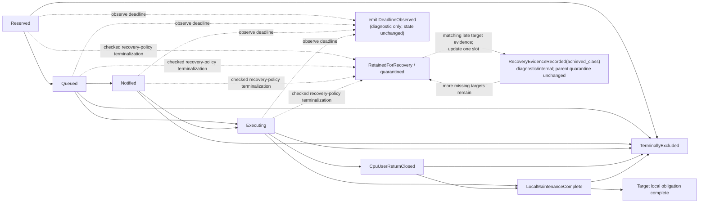

# Translation shootdown coordinator

The shootdown coordinator should turn one immutable invalidation plan into
durable, generation-bound local work on every required CPU incarnation and
return exactly the completion evidence that was requested. Its protocol must
make ownership accepted, notification sent, target handler entered, user return
closed, and local maintenance executed distinct. Aggregate CPU-translation
quiescence is separate again, and privileged-access-borrow closure is supplied
outside this coordinator. None is inferred from elapsed time or from a firmware
call returning success.

The baseline should use preallocated per-CPU mailboxes, idempotent requests,
bounded nonblocking interrupt handlers, conservative coalescing, and a CPU
lifecycle handshake. It should favor a protocol whose safety and liveness can
be modeled over one that depends on scheduler folklore.

This is a proposed Atom protocol. It has not yet been proved against weak
memory, nested interrupts, CPU hotplug, or real platform firmware.

## Question, scope, and operational standard

The question is:

> After a restrictive page-table change becomes visible, how can the kernel
> prove that every CPU which might use the superseded interpretation has run
> the required local program—or has irreversibly lost the ability to do so?

The coordinator owns:

- accepted request records and completion-slot generations;
- per-target enqueue, notification, execution, acknowledgement, and exclusion;
- IPI delivery adapters and local interrupt-handler discipline;
- coalescing, duplicate delivery, bounded queue overflow, and retry;
- activation/user-return/uaccess gates required by any deferred mode;
- interaction with CPU start, stop, suspend, failure, and reset; and
- typed completed and incomplete subordinate evidence.

It does not select an invalidation instruction, decide that a mapping change is
restrictive, free resources, or pronounce a CPU dead from a timeout. A
candidate coordinator passes only if:

1. A request is durably owned before publication can depend on it.
2. Its target set contains exact CPU identities and incarnations frozen under
   the address-space activation protocol.
3. Each aggregate operation binds the address-space incarnation, mapping and
   context generations, accepted mutation sequence, frozen targets, and
   per-target required class into its plan digest; each acknowledgement names that digest,
   operation/request identity, target CPU incarnation, completion-slot
   generation, and achieved completion class.
4. Duplicate, late, reordered, or forged acknowledgements cannot satisfy a
   different operation or stronger class.
5. Queue exhaustion strengthens work without dropping an obligation.
6. Interrupt handlers allocate nothing, wait on no remote CPU, and have a
   statically bounded work budget.
7. CPU entry races resolve so that the mutator observes the entering CPU or
   the CPU observes the new mutation sequence and catches up before user use.
8. Timeout produces a missing-target set and retained coordinator recovery
   ownership, never a fabricated completion proof or a parent resource
   disposition.
9. Under explicit delivery, scheduling, and CPU-progress fairness assumptions,
   every accepted request reaches completed or retained-recovery coordinator
   state; the owning mapping transaction controls its own terminal record.

## Evidence and limits

| Evidence | Supported conclusion | Limit |
| --- | --- | --- |
| [TLB consistency](../../../30-sources/black-et-al-1989-tlb-consistency.md) | A practical multiprocessor protocol can queue address work per target, notify once, wait for acknowledgement, and upgrade overflow to a full flush | Historical machines had simpler CPU and memory-order behavior |
| [SVR4.2 HAT layer](../../../30-sources/balan-gollhardt-1992-scalable-virtual-memory-hat-layer.md) | Per-address-space processor accounting can restrict shootdown to CPUs that may hold the context, provided activation and mutation share one protocol | Its small-SMP design and lazy decisions are not a modern completion proof |
| [Intel system-programming documentation](../../../30-sources/intel-2026-system-programming-documentation.md) | Every logical processor that may use modified structures must participate before affected pages are reused; stale translation state can affect speculative accesses | Intel documents local mechanisms, not Atom's interprocessor protocol |
| [RISC-V privileged architecture](../../../30-sources/risc-v-international-2026-privileged-architecture.md) | `SFENCE.VMA` orders and invalidates only on the executing hart | Platform interrupt and firmware completion semantics remain external |
| [RISC-V SBI](../../../30-sources/risc-v-international-2025-supervisor-binary-interface.md) | RFENCE provides standardized remote-fence request interfaces whose `SBI_SUCCESS` reports successful transmission to targeted harts | The standard return alone does not establish target execution or architectural completion |
| [Optimizing TLB shootdown](../../../30-sources/amit-2017-optimizing-tlb-shootdown.md) | Tracking can omit targets only when its evidence proves they cannot cache the translation; otherwise the conservative target set remains necessary | The technique relies on x86 page-access behavior and does not prove safe reuse after an unresponsive CPU |
| [Don't shoot down TLB shootdowns](../../../30-sources/amit-et-al-2020-dont-shoot-down-tlb-shootdowns.md) | Early/deferred acknowledgement can work only with explicit user-return, interrupt, and privileged user-access constraints | It does not make detached table pages reclaimable and was evaluated on Linux/x86 |
| [TLB shootdown liveness case study](../../../30-sources/padon-et-al-2018-reducing-liveness-to-safety.md) | Shootdown correctness includes liveness and depends on accurately modeled atomic regions and fairness | The verified protocol abstracts real ISA instructions and failed hardware |
| [Unreliable failure detectors](../../../30-sources/chandra-toueg-1996-failure-detectors.md) | Timing can provide suspicion useful for progress policy, but not proof that a participant cannot later act | Distributed process failures are an analogy, not a CPU-hotplug specification |
| [RadixVM](../../../30-sources/clements-et-al-2013-radixvm.md) | Precise per-range CPU tracking can reduce fanout, while unmap still waits for every selected response before releasing references | Its research-kernel protocol couples concerns that Atom assigns to separate coordinator and reclamation services |
| [Linux VM implementation contracts](../../../30-sources/linux-kernel-community-2026-virtual-memory-implementation-contracts.md) | TLB rendezvous, lockless software-reader lifetime, and secondary-MMU notification are distinct implementation obligations | Linux precedent does not prove Atom's completion classes or a portable CPU protocol |
| [HATRIC](../../../30-sources/yan-et-al-2017-hatric.md) | Hardware coherence can replace some software IPI traffic while preserving the need for a precisely specified completion boundary | HATRIC is a simulated design rather than an available baseline mechanism |

The sources justify explicit remote execution, activation exclusion, and
liveness modeling. The request tuple, acknowledgement lattice, and mailbox
protocol below are Atom synthesis.

## Accepted request and target slots

```text
ShootdownOperation {
    request_id,
    operation_id,
    address_space: AddressSpaceIncarnation,
    accepted_mutation_sequence,
    mapping_incarnations: Set<MappingIncarnation>,
    plan_digest,
    target_set: Map<(CpuIdentity, CpuIncarnation), CompletionSlotGeneration>,
    target_observer_bindings:
        Map<(CpuIdentity, CpuIncarnation),
            BoundedSet<ObserverTranslationBinding,
                       MAX_OBSERVER_BINDINGS_PER_TARGET>>,
    per_target_required_class:
        CpuUserReturnClosed | LocalMaintenanceComplete,
    state,
    deadline_policy,
    result_record
}

TargetRequest {
    dispatch_id,
    target_cpu: (CpuIdentity, CpuIncarnation),
    combined_program_ref,
    dispatch_digest,
    dominance_certificate_ref,
    covered_operations: BoundedSet<CoveredOperation,
                                   MAX_COVERED_PER_DISPATCH>
}

CoveredOperation {
    request_id,
    operation_id,
    address_space: AddressSpaceIncarnation,
    plan_digest,
    target_slot_generation,
    target_observer_bindings:
        BoundedSet<ObserverTranslationBinding,
                   MAX_OBSERVER_BINDINGS_PER_TARGET>,
    per_target_required_class:
        CpuUserReturnClosed | LocalMaintenanceComplete
}

DispatchRecord {
    dispatch_id,
    target_cpu: (CpuIdentity, CpuIncarnation),
    dispatch_digest,
    combined_program,
    frozen_profile_digest,
    covered_operations: BoundedSet<CoveredOperation,
                                   MAX_COVERED_PER_DISPATCH>,
    dominance_certificate,
    validation_references,
    state: Building | Sealed | Dispatched | Completed
}

ShootdownRecoveryIncarnation =
    (shootdown_recovery_id, shootdown_recovery_generation)

DispatchRecoveryAssociation {
    dispatch_id,
    request_id,
    operation_id,
    target_slot_generation,
    recovery: ShootdownRecoveryIncarnation
}

ShootdownRecoveryHandle {
    recovery: ShootdownRecoveryIncarnation,
    request_id,
    operation_id,
    address_space: AddressSpaceIncarnation,
    plan_digest
}

TargetSlot {
    cpu_identity,
    cpu_incarnation,
    slot_generation,
    target_observer_bindings:
        BoundedSet<ObserverTranslationBinding,
                   MAX_OBSERVER_BINDINGS_PER_TARGET>,
    state,
    achieved_class,
    local_trace_digest
}
```

The coordinator reserves operation, per-target request, target-slot, dispatch,
and late-evidence-validation memory before the mapping transaction's acceptance
point. It publishes the complete immutable aggregate record before any
notification with release ordering; a target must acquire-claim that sealed
dispatch before reading its program or covered operations. `plan_digest`
transitively binds the immutable operation fields,
including mapping incarnations, the complete per-target observer-binding-set
map, target set, per-target required class, and local programs. The map's key
set must equal the target set and every value is nonempty. Each `TargetRoot`
member carries the exact scope key, context-tag incarnation, root fingerprint,
retirement epoch, and profile for that CPU; each `TemporaryAlias` member
carries its alias-slot, operation, reservation, private kernel-context, and
profile identity. Alias-only CPUs therefore need no invented address-space
tag, while binding resolution before `Entering` ensures every frozen activation
already contributes `TargetRoot`. The same numeric CPU can occur
in a later request, but its incarnation and slot generation make an old
acknowledgement harmless.

`ShootdownOperation.target_set` has exactly the keys of the immutable
`InvalidationPlan.target_set` and the mapping operation's reserved completion-
slot map. `target_observer_bindings` is a checked copy of the plan map, and the
coordinator dispatches the canonical per-target program from that same plan.
No coordinator-local target discovery may add or omit a CPU or substitute a
program after acceptance.

The coordinator is constructed only from planner output
`Some(per_target_required_class)`. Planner output `None` bypasses this service,
and is valid only with empty target, observer, local-program, and completion-
slot maps. It creates no target slots and yields no `TargetSetCompleted`;
consequently no
request, coverage entry, or acknowledgement contains an optional class.
`Some(LocalMaintenanceComplete)` with an exact empty target map is distinct:
it is a valid operation, allocates no target slots, sends no notification, and
immediately constructs the tuple-bound empty
`TargetSetCompleted<LocalMaintenanceComplete>` plus
`CpuTranslationQuiescent`. The constructor still binds operation,
address-space incarnation, accepted sequence, plan digest, and empty
observer-binding map, so vacuity cannot be replayed for another operation.

For a coalesced dispatch, `dispatch_digest` additionally binds the exact target
CPU incarnation, combined local program, frozen machine profile, complete
`covered_operations` set, and a checked certificate that the combined program
dominates every original plan. A one-operation dispatch uses the identical
schema with a singleton set; singular operation fields never ambiguously stand
for a coalesced batch.

Every covered operation retains either a reference to that sealed
`DispatchRecord` or an immutable validation-complete copy of its tuple,
program/profile digests, coverage set, and dominance certificate. A completed
operation may release it only when no recovery or quarantine record can still
accept late evidence. An `Incomplete` operation transfers the reference to its
recovery record. Reusing a mailbox slot or dispatch identifier never destroys
the evidence needed to reject a delayed or forged acknowledgement.

## Per-target state machine



Not every plan needs every state, and their order can be backend-specific.
`TerminallyExcluded` is accepted only from the CPU-lifecycle protocol proving
that this exact incarnation cannot execute or retain relevant state. The
dashed deadline edges emit an observation while leaving the source state and
all ownership unchanged; a timeout is neither terminalization nor an edge to
exclusion. Only a separately authorized, checked recovery-policy decision may
publish an immutable `Incomplete` parent result and transfer the live target
record to `RetainedForRecovery`. Matching late target-discharge evidence may
update only that retained recovery record
through `RecoveryEvidenceRecorded`. This is a subordinate
`ShootdownRecoveryRecord`, not the mapping operation's exactly-once
`TranslationTerminal`; late evidence cannot move or rewrite that parent result.
For class `L`, matching late evidence may advance only the separate nominal
`AddressSpaceTeardownRecovery` record and may release address-space quarantine
only through that record's authorized `Advance` facet after the same full
validation and predicate joins as an on-time acknowledgement. For every
non-`L` operation, late evidence remains diagnostic or internal subordinate
state and cannot release mapping or address-space quarantine absent a
separately specified nominal recovery capability; this baseline specifies no
such non-`L` capability.

The aggregate operation emits
`TargetSetCompleted(operation, per_target_required_class, target_set)` when every frozen
target has achieved a class that dominates its per-target required class or has a valid
terminal-exclusion proof. It additionally emits
`CpuTranslationQuiescent(operation, target_set)` only when every live target
has supplied `LocalMaintenanceComplete` for the exact translation plan (or the
target has valid lifecycle-exclusion evidence). A user-return-only aggregate
can therefore complete without being cast into translation quiescence. A
weaker acknowledgement remains useful evidence but cannot decrement a stronger
completion count. This coordinator does not emit `CpuAccessQuiescent`,
`RestrictionQuiescent`, or `Reclaimable`.

## Activation race protocol

The [address-space object](address-space-object.md) provides the two-sided
invariant. A CPU entering address space `S`:

1. while still neutral, reads `state == Live`, an even mutation sequence,
   an owner-free execution-admission gate at epoch `e`, and—under the paired
   membership-admission gate—the persistent code-publication state incarnation
   `p`, generation `g`, and state digest. It also pins the exact persistent
   translation-catch-up state for that stable sequence, then resolves an exact, active
   `TargetTranslationBinding` through the
   lifecycle-serialized allocator registrar;
2. publishes `Entering(sequence, e, p, g, cpu_incarnation, binding)` with release
   ordering;
3. executes a full Store→Load fence and rereads lifecycle, sequence, execution-
   admission epoch/owners, translation-catch-up state/incarnation/digest,
   code-publication state/incarnation/generation/digest, lease state, and
   retirement epoch with acquire ordering, withdrawing or waiting in a neutral
   kernel context if the object ceased to be live, the sequence changed/became
   odd, any gate owner appeared, either bound generation changed, or the lease
   retired;
4. executes the actual pinned translation catch-up program or retained
   incremental chain and, while still neutral, completes the exact
   missed code-publication fetch program (or conservative whole-domain
   program) until this CPU's observed generation equals `g`; after a release
   publication and acquire recheck, it reserves `ActivationGuardIncarnation`, obtains an
   allocator `ContextInstallGuard<UserActivation>` that publishes `Installing`
   and completes its fenced retirement/rollover recheck, then constructs the
   `ActivationGuard` and publishes `Active` with release ordering;
5. executes a second full Store→Load fence and final acquire reread of sequence,
   execution-admission, and publication-generation state, withdrawing and
   consuming the guard on change/odd/mismatch; and
6. only after the stable reread returns both guards so component 2 can store
   them, recheck retirement/rollover/sequence, execution-admission, and
   code-publication-generation state, release-publish
   `LoadingRoot` before the first root/tag-changing instruction, load the root,
   publish `Installed`, and recheck pending state before user mode. Any trap or
   ambiguous result from `LoadingRoot` follows safe-context restoration and can
   never claim the no-root-load abort proof. Departure publishes
   `RestoringSafeContext`, installs and orders the safe root, clears the
   allocator slot, and consumes the install guard into a generation-, CPU-,
   binding-, and safe-context-bound `SafeContextRestored` proof. Only
   `address_space_deactivate` may consume that proof—or an exact
   `InstallWithdrawnSafe` proof from an aborted pre-load attempt—with the same
   `ActivationGuardIncarnation` and publish active-set departure.

Any operation whose prepared plan requires a stable observer snapshot changes
the sequence to odd while atomically publishing acceptance, then freezes
`Active` and `Entering` records. This includes restrictions, replacements,
table unlinks, applicable executable retirement, and additive/permission-
expansion work when `Usable` requires active-target maintenance.
Consequently either the coordinator targets the CPU or that CPU observes the
odd/new sequence and completes catch-up before becoming active or entering
user execution. The exact memory-order, interrupt masking, and migration
boundaries must be modeled; “read the active mask” alone is not a proof.

Deactivation first installs a safe kernel context incapable of user-memory
access, then removes membership. Clearing the bit before the context switch
would create a missed target.

## Per-CPU mailbox

Each CPU has a bounded, kernel-protected mailbox with:

- one monotonically versioned producer/consumer state;
- fixed request descriptors or references to immutable requests;
- a summary slot able to represent the profile's broadest safe plan;
- a notification-pending bit; and
- a local completion publication area.

Producers append under the mailbox's reviewed synchronization primitive. When
capacity would be exceeded, they combine pending work into a summary program
that dominates it—normally context-wide or broader—and preserve an explicit
`covered_operations` set containing one entry for every original shootdown
operation/target slot,
`(request_id, operation_id, address_space, plan_digest,
target_slot_generation, target_observer_bindings,
per_target_required_class)`. Completion returns the corresponding
`CoveredCompletion` entries with achieved classes under the dispatch digest and
dominance certificate. The summary slot itself is preallocated. No oldest-
entry eviction is legal, and no numeric high-watermark substitutes for the set
unless a separate proof shows a contiguous gap-free prefix in the identical
completion domain.

`MAX_COVERED_PER_DISPATCH` is a reviewed static bound. Each operation reserves
its coverage entry before acceptance. A full summary dispatch is sealed and a
second preallocated bounded dispatch is queued; exhaustion backpressures new
admission but cannot drop already accepted work. The interrupt handler never
claims more than one sealed dispatch per entry and therefore never iterates
beyond that bound; if another dispatch remains, it rearms or self-notifies
before returning. Chained dispatches retain explicit per-covered-operation coverage
and do not replace it with a watermark. The handler WCET model is consequently
bounded by one dispatch envelope plus `MAX_COVERED_PER_DISPATCH` local
obligations.

Only the transition from no pending notification to pending sends an IPI.
Further producers coalesce without an IPI storm. A race in which the consumer
clears the bit while a producer appends must guarantee either that the handler
observes the work or the producer sends another notification.

## Interrupt-handler contract

The target handler:

1. enters through the reviewed interrupt/trap prologue and records the CPU
   incarnation;
2. acquire-claims exactly one release-published sealed dispatch containing at most
   `MAX_COVERED_PER_DISPATCH` covered-operation entries;
3. validates every request tuple and skips only already-dominated duplicate
   work;
4. for every frozen nonterminal context-install slot, first establishes its
   exact generation-bound `InstallLoadExclusion`—forced pre-load abort,
   withdrawal, safe-context restoration, or lifecycle exclusion—then runs the
   planner-provided local ordering/invalidation program;
5. establishes any required local access gate or context switch;
6. writes its trace/evidence and release-publishes achieved completion in the
   exact slot generation; and
7. rearms or self-notifies if bounded work remains.

It must not allocate memory, take a lock held by the requesting CPU, wait for a
different target, fault on pageable memory, or invoke an unbounded callback.
The plan and trace slots were reserved before acceptance. The handler may
strengthen a local program, never weaken it.

In particular, invalidating and acknowledging while an interrupted
`Installing`/`LoadingRoot` path can later load the old root/tag is forbidden.
The completion trace binds the frozen allocator-slot generation, install
generation, install-guard incarnation and owner, exclusion proof, and subsequent
exact-binding invalidation order.

Nested interrupts, NMI-like paths, and machine-check contexts need explicit
rules. If any can dereference the old user mapping after ordinary interrupt
entry, `CpuAccessQuiescent` has not been established merely by blocking return
to user mode or by executing TLB maintenance.

## Acknowledgement types

```text
TargetExecutionEvidence {
    dispatch_id,
    target_cpu: (CpuIdentity, CpuIncarnation),
    dispatch_digest,
    local_trace_digest,
    covered_completions: BoundedSet<CoveredCompletion,
                                    MAX_COVERED_PER_DISPATCH>
}

CoveredCompletion {
    request_id,
    operation_id,
    address_space: AddressSpaceIncarnation,
    plan_digest,
    target_slot_generation,
    target_observer_bindings_digest,
    per_target_required_class:
        CpuUserReturnClosed | LocalMaintenanceComplete,
    achieved_class
}

LifecycleExclusionEvidence {
    target_cpu: (CpuIdentity, CpuIncarnation),
    lifecycle_operation_id,
    lifecycle_generation,
    exclusion_kind: Stop | Reset | PermanentFence,
    producer_component,
    proof_digest
}

AdditionalWalkerEvidence {
    table: TablePageIncarnation,
    operation_id,
    authorized_producer,
    event_kind,
    observed_generation_or_sequence,
    profile_digest,
    evidence_digest
}

TargetDischargeEvidence =
    TargetExecutionEvidence | LifecycleExclusionEvidence

TargetSetCompleted {
    operation_id,
    address_space: AddressSpaceIncarnation,
    plan_digest,
    target_set_and_slot_generations,
    per_target_observer_binding_map_digest,
    per_target_required_class:
        CpuUserReturnClosed | LocalMaintenanceComplete,
    target_discharge_evidence_digest
}

CpuTranslationQuiescent {
    operation_id,
    address_space: AddressSpaceIncarnation,
    exact_translation_plan_digest,
    target_set_completion:
        TargetSetCompleted<LocalMaintenanceComplete>
}

HardwareWalkerQuiescent {
    table: TablePageIncarnation,
    operation_id,
    walker_obligation_digest,
    detachment_evidence_digest,
    exact_target_local_completion_digest,
    additional_walker_evidence_digest: Option<Digest>,
    profile_derivation_digest
}
```

The nested `TargetSetCompleted<LocalMaintenanceComplete>` is authoritative for
operation, address-space, and plan identity. The
`CpuTranslationQuiescent` constructor accepts no independently supplied copies;
its displayed outer fields are checked projections that must equal the nested
token byte-for-byte. An implementation may omit those redundant projections
from storage.

`achieved_class` forms a checked lattice, not a flag:

- `CpuUserReturnClosed`
- `LocalMaintenanceComplete`

`HandlerEntered`, `NotificationSent`, and `RequestAccepted` are observable
transport/progress milestones, not completion classes. Only the frozen planner
and backend profile define which completion classes dominate another for a
given operation. For example, switching to a safe context may establish
`CpuUserReturnClosed` before local TLB invalidation, while table-page retyping
still requires aggregation of completed maintenance into the profile's
additional, orthogonal `HardwareWalkerQuiescent(table)` plus an independent
software-reader proof. Neither CPU-translation nor hardware-walker quiescence
implies the other. A
single per-target acknowledgement never claims global table-walker quiescence.

`LifecycleExclusionEvidence` is not in the target-handler class lattice. A live
handler cannot attest its own irreversible nonreturn; only the CPU-lifecycle
component can produce that alternative, bound to the exact target incarnation
and stop/reset/fence generation. The aggregate consumes either target execution
evidence or lifecycle exclusion for each frozen slot, never a cast between them.

For a plan carrying `HardwareWalkerObligation`, the coordinator may emit
`HardwareWalkerQuiescent(table)` only after it validates the exact table-
detachment evidence, every required target's `LocalMaintenanceComplete` or
separate lifecycle exclusion, and the planner's frozen profile rule and
aggregate derivation. It also revalidates the obligation's exact target/slot
coverage and canonical-program dominance digest against the accepted plan;
an independently supplied table program is not evidence. When the obligation carries
`required_additional_walker_evidence`, it must also validate matching
`AdditionalWalkerEvidence` from the named producer and bind that evidence
digest into the hardware-walker token. If the event is absent, stale, or
cannot be validated, the table remains incomplete or quarantined. This is a
distinct output beside
`CpuTranslationQuiescent`, not a stronger per-target acknowledgement.

The requester first acquire-observes completion in the exact slot generation,
then validates the dispatch tuple/digest and dominance
certificate, then consumes each covered-operation/slot pair at most once. It
validates exact request/operation/address-space/plan-digest/target/slot tuples
including the target's complete observer-binding-set digest, and accepts
`achieved_class` when it equals or dominates—not merely equals—the
associated `per_target_required_class`. A duplicate acknowledgement is harmless. A late
acknowledgement fails against any replacement live slot/operation, but its
operation/recovery identity may route it to a still-existing old teardown
record, where the full old tuple is validated before that record alone can
advance. If the old record is gone or any generation differs, it is rejected.
An acknowledgement from a different CPU incarnation is diagnostic evidence
only.

## Synchronous baseline

The first Atom implementation should be synchronous for restrictive changes:

1. reserve the complete request and every target slot;
2. enqueue work and notify all remote targets;
3. execute the local target program directly if the requester is included;
4. wait in a kernel-safe state while still servicing inbound shootdowns;
5. aggregate exact completion evidence; and
6. return either the requested proof or a nonterminal `ShootdownProgress`
   snapshot with completed/missing target tuples. The parent mapping transaction
   may keep polling without changing slot ownership. Only when its separately
   authorized recovery policy selects terminal `Incomplete` does it request the
   atomic recovery cut that creates `ShootdownIncompleteEvidence` and transfers
   unresolved slots. The parent alone owns every mapping/frame/table
   disposition and publishes the terminal.

The wait graph must preclude two CPUs holding locks needed by each other's IPI
handlers. Simultaneous shootdowns are handled by always draining inbound work
while waiting and by keeping handlers independent of mutation locks.

## Deferred and early acknowledgement profile

The optimization described by Amit et al. can be considered later as a
separate profile. A target may acknowledge `CpuUserReturnClosed` before local
invalidation only if all of the following hold:

- it is in a kernel context that cannot return to affected user execution
  without passing a pending-generation gate;
- every privileged user-access helper checks or drains that gate;
- interrupt, NMI, debug, and exception paths cannot access the range outside
  the gate;
- no table page, context tag, or physical frame is reclaimed from this weaker
  acknowledgement; and
- the pending work survives scheduling, CPU idle, suspend, and hotplug.

The type system must prevent this token from satisfying
`LocalMaintenanceComplete`, `CpuAccessQuiescent`,
`CpuTranslationQuiescent`, or `HardwareWalkerQuiescent`. This profile is an
optimization of user-return closure, not a general shootdown bypass.

## Firmware, hypervisor, and broadcast adapters

An SBI RFENCE call, paravirtual hypercall, or architecture broadcast TLBI is
wrapped by a profile-specific adapter. For standardized SBI RFENCE,
`SBI_SUCCESS` means the request was successfully transmitted to the targeted
harts; it does not prove that they executed the requested fence. The adapter
documents and tests:

- which harts/processing elements are in scope;
- whether the call reports acceptance, delivery, or remote execution;
- ordering relative to page-table stores and requester continuation;
- behavior for sleeping, powered-off, or delegated CPUs;
- error and partial-completion reporting; and
- the virtualization layer at which completion is observed.

Atom may use SBI IPI only as transport to an Atom target handler that executes
and acknowledges the local fence. If firmware itself executes RFENCE, completion
must be emitted causally after that exact fence and bind the request and hart
incarnation through a separately specified platform primitive. An unrelated OS
acknowledgement cannot close the causal gap, and an adapter cannot reinterpret
the standardized SBI return value as remote execution. The same rule applies
to any other interface that documents only acceptance or transmission.

## CPU offline, suspend, and failure

Stopping a CPU is a terminal protocol:

1. prevent new activation and shootdown target acquisition for that
   incarnation;
2. force it into a safe kernel translation context;
3. drain its mailbox and perform every pending local maintenance program;
4. publish final translation/tag epochs and discard architecturally retained
   state as the platform requires;
5. execute the platform power-off handshake; and
6. publish `LifecycleExcluded(target_cpu)` only after nonreturn is guaranteed.

A CPU that stops responding before step 6 remains a target. Atom may isolate
it through a platform reset/fencing mechanism that gives equivalent evidence;
otherwise dependent operations and memory enter quarantine. A failure detector
can choose when to escalate but cannot create the safety fact.

On restart, a new incarnation begins with no inherited completion claims and
must run the boot/profile-required broad invalidation before joining address-
space activation.

## Liveness assumptions and deadlock discipline

The model states rather than hides these assumptions:

- notifications to a running target are eventually delivered;
- a target eventually exits longer masked regions or reaches a reviewed safe
  point;
- the handler and mailbox operations themselves terminate;
- a CPU-stop authority eventually supplies success or explicit failure; and
- requesters waiting for completion continue servicing inbound work.

Padon et al. show why atomic-region details can change a liveness proof. Atom's
TLA+/Ivy-style model should include simultaneous requests, bounded queues,
notification-bit races, activation, deactivation, timeout observation, CPU
stop/start, duplicate delivery, and unfair executions. Safety must hold even
without fairness; fairness is used only to prove eventual completion.

## Failure results and observability

```text
ShootdownProgress {
    request_id,
    operation_id,
    address_space: AddressSpaceIncarnation,
    plan_digest,
    observed_completed_and_missing_target_slots,
    observation_sequence,
    progress_digest
}

ShootdownIncompleteEvidence {
    request_id,
    operation_id,
    address_space: AddressSpaceIncarnation,
    accepted_mutation_sequence,
    plan_digest,
    target_set_and_slot_generations,
    per_target_observer_binding_map_digest,
    completed_target_evidence:
        BoundedMap<(CpuIdentity, CpuIncarnation, CompletionSlotGeneration),
                   TargetDischargeEvidence>,
    missing_targets:
        BoundedSet<(CpuIdentity, CpuIncarnation, CompletionSlotGeneration)>,
    recovery: ShootdownRecoveryIncarnation,
    recovery_cut_generation,
    retained_dispatch_and_slot_records,
    coordinator_recovery_handle: ShootdownRecoveryHandle,
    evidence_digest
}

shootdown_poll(Borrowed<ShootdownOperationRef<Inspect>>)
  -> Pending(ShootdownProgress)
   | Completed(TargetSetCompleted,
               Option<CpuTranslationQuiescent>,
               Set<HardwareWalkerQuiescent>,
               target_discharge_evidence)

cut_for_parent_incomplete(
    Authorized<ShootdownOperationRef, CutForParentIncomplete>,
    parent_terminal_intent_digest)
  -> Cut(ShootdownIncompleteEvidence)
   | AlreadyCompleted(completion_result_slot_identity)
```

The completed and missing key sets are disjoint and their union equals the
frozen `target_set_and_slot_generations` exactly. Every completed value passes
the full request/plan/slot/observer-binding/class validation; a merely received
notification cannot move a key from missing to completed.
Constructing `ShootdownProgress` takes no recovery cut and moves no slot. Before
freezing an incomplete partition, the coordinator takes the operation/slot lock
and atomically allocates a fresh `ShootdownRecoveryIncarnation` whose generation
equals the advanced `recovery_cut_generation`, changes every unresolved slot to
`RetainedForRecovery(that_recovery)`, publishes a preallocated,
separately synchronized `DispatchRecoveryAssociation` sidecar for each of this
operation's unresolved slots and its matching covered-operation tuple, and then
captures the maps. The sealed dispatch itself remains
immutable, reference-counted, and usable by independently live covered
operations; it has no one global recovery state. Any `TargetDischargeEvidence`
(`TargetExecutionEvidence` or `LifecycleExclusionEvidence`) that linearizes
before the cut appears
in `completed_target_evidence`; one that linearizes after the cut is routed to
that exact recovery incarnation through the same sidecar and per-slot CAS. The
CAS accepts either evidence variant on only one side. The checked incomplete-
evidence constructor requires every sidecar retained by this incomplete record
to carry its same recovery/request/operation identity and a slot from its
`missing_targets`. It requires the recovery handle's recovery/request/operation/
address-space/plan fields to equal the record byte-for-byte, and requires the
recovery incarnation's generation to
equal `recovery_cut_generation`. The evidence digest binds that whole identity,
so no target-discharge evidence can be lost between snapshots or counted twice.
Throughout this component, `operation_id` is the owning mapping transaction's
operation ID; the coordinator does not introduce a second operation identity.

The coordinator's internal result to its owning mapping transaction is one of:

- `Completed(TargetSetCompleted,
  Option<CpuTranslationQuiescent>, Set<HardwareWalkerQuiescent>,
  target_discharge_evidence)`;
- `Pending(ShootdownProgress)` while normal completion remains joinable; or
- `CutIncomplete(ShootdownIncompleteEvidence)` only after the parent supplies
  its terminal-incomplete intent and consumes the cut authority.

After `CutIncomplete`, normal polling cannot produce a completion result for
that parent operation. Late evidence is routed only to the named recovery
record under the class-specific rules above. This makes “keep polling” and
“publish terminal Incomplete” disjoint choices rather than two interpretations
of the same already-cut result.

Every recoverable platform violation remains subordinate evidence with a named
coordinator recovery owner; only `MappingTransaction` constructs and publishes
`TranslationTerminal` while it still owns the writer token and mapping
resources. If the architecture-fault component completes a containing-machine
halt, control instead takes `machine_halt(ArchitectureFaultRecord) -> !`; a
post-halt coordinator result is not part of this algebra.

Metrics include plan/request IDs, target and achieved classes, enqueue-to-entry
and entry-to-completion latency, coalescing/strengthening count, IPI count,
maximum masked interval encountered, timeout suspicion, CPU lifecycle action,
and retained bytes. Addresses and ownership are exposed only under diagnostic
authority.

## Verification and fault injection

- Model the activation/shootdown product state under weak memory and all
  notification-bit interleavings.
- Generate stale operation, slot, CPU, tag, and address-space generations and
  assert that none discharge current work.
- Force mailbox capacity to one and prove overflow strengthening preserves all
  operations.
- Delay, reorder, duplicate, and drop notifications in a simulator; safety
  must hold and missing targets must remain named.
- Run simultaneous mutual shootdowns while both CPUs hold ordinary kernel
  locks; the handler must still progress.
- Hot-unplug a target at each state transition, including immediately before
  acknowledgement.
- Test firmware adapters with deliberately weak “accepted only” behavior.
- Measure median and tail completion latency, IPI amplification, time in
  quarantine, and scheduler interference per CPU count.

## Staged implementation

1. One global address-space mutation gate, synchronous broadcast, broad local
   flushes, and no early acknowledgement.
2. Preallocated bounded mailboxes, exact target slots, hotplug protocol, model,
   and fault injection.
3. Plan coalescing and duplicate-IPI suppression with dominance tests.
4. Precise active-target pruning after the activation invariant is verified.
5. Optional deferred-access and hardware/firmware broadcast profiles, each
   with separate completion types and measurements.

## Alternatives and tradeoffs

- **Stop-the-world** offers a useful bring-up oracle but magnifies unrelated
  latency and still needs a real stop/completion proof.
- **One IPI per page** is conceptually direct but creates interrupt storms;
  bounded coalescing preserves semantics with less traffic.
- **Lazy invalidation on next schedule** avoids IPIs only when every possible
  old-access path is gated and no resource needs stronger completion.
- **Hardware coherence/broadcast** may simplify software, but the hardware
  contract must expose target and completion semantics at Atom's boundary.

## Unresolved questions

- Which local handler steps are sufficient to claim hardware walker
  quiescence on each ISA and microarchitecture?
- Can the activation protocol avoid a global mutation gate without making its
  proof intractable?
- What platform mechanisms can terminally fence a physically failed CPU?
- Which NMI/debug/machine-check paths can touch user frames, and how are they
  brought under the access-closed predicate?
- Can the first RISC-V platform supply a separately specified remote-execution
  primitive beyond standard RFENCE transmission, or must Atom always layer its
  own incarnation-bound target acknowledgement?
- What bounded handler budget avoids starvation while keeping teardown
  progress acceptable under adversarial mapping churn?

## Connections

- [Address translation and protection transitions](../address-translation-and-protection-transitions.md)
- [Address-space object](address-space-object.md)
- [Mapping transaction](mapping-transaction.md)
- [Invalidation planner](invalidation-planner.md)
- [Translation-context allocator](translation-context-allocator.md)
- [Reclamation gate](reclamation-gate.md)
- [Safe user-access helpers](safe-user-access-helpers.md)
- [Interrupt event fabric](../interrupt-event-fabric.md)
- [Logical CPU coordination and lifecycle](../logical-cpu-coordination-and-lifecycle.md)
- [Privileged entry, exit, and execution context](../privileged-entry-exit-and-execution-context.md)

## Sources

- [TLB consistency](../../../30-sources/black-et-al-1989-tlb-consistency.md)
- [SVR4.2 HAT layer](../../../30-sources/balan-gollhardt-1992-scalable-virtual-memory-hat-layer.md)
- [Intel system-programming documentation](../../../30-sources/intel-2026-system-programming-documentation.md)
- [RISC-V privileged architecture](../../../30-sources/risc-v-international-2026-privileged-architecture.md)
- [RISC-V supervisor binary interface](../../../30-sources/risc-v-international-2025-supervisor-binary-interface.md)
- [Optimizing TLB shootdown](../../../30-sources/amit-2017-optimizing-tlb-shootdown.md)
- [Don't shoot down TLB shootdowns](../../../30-sources/amit-et-al-2020-dont-shoot-down-tlb-shootdowns.md)
- [TLB shootdown liveness case study](../../../30-sources/padon-et-al-2018-reducing-liveness-to-safety.md)
- [Unreliable failure detectors](../../../30-sources/chandra-toueg-1996-failure-detectors.md)
- [RadixVM](../../../30-sources/clements-et-al-2013-radixvm.md)
- [Linux VM implementation contracts](../../../30-sources/linux-kernel-community-2026-virtual-memory-implementation-contracts.md)
- [HATRIC](../../../30-sources/yan-et-al-2017-hatric.md)
