# Translation-context allocator

The translation-context allocator should treat an ASID, PCID, or equivalent
numeric field as a finite hardware cache tag leased to an address-space
incarnation—not as an address-space identity. Every lease should bind a numeric
tag to a nominal namespace/lease incarnation, sharing domain, root/profile
fingerprint, owner, and lifecycle. Reuse becomes legal only after the required scope has stopped
using the old binding and completed the backend's invalidation protocol.

The baseline should support three honest modes: generation-tagged leases,
flush-on-switch when useful tags are unavailable, and an explicitly unsupported
profile. It should not manufacture isolation by assuming all CPUs interpret a
numeric tag globally or by wrapping a counter silently.

This is proposed architecture. Linux supplies strong implementation precedent,
but no Atom allocator has been modeled or measured.

## Question, scope, and operational standard

The question is:

> How can a bounded, architecture-scoped translation tag be reused indefinitely
> without connecting stale cached translations to a later address-space or CPU
> incarnation?

The allocator owns:

- discovery and validation of tag width and sharing scope;
- namespace geometry and reserved values;
- lease allocation, installation, retirement, rollover, and quarantine;
- namespace and lease generations plus wrap policy;
- per-CPU installed/reserved/pending-flush records;
- interaction with CPU start/stop and address-space activation; and
- capacity policy needed to guarantee forward progress.

It does not create mappings, choose an invalidation range, or claim a CPU is
offline. It requests broader invalidation through the planner/coordinator and
uses evidence from [logical CPU coordination and
lifecycle](../logical-cpu-coordination-and-lifecycle.md).

A candidate passes only if:

1. Numeric tag equality alone can never authorize activation, mapping access,
   acknowledgement, or reuse.
2. Every installed binding is identified by its exact address-space and
   `ContextTagIncarnation`, sharing domain, and root/profile fingerprint.
3. A CPU installs a new-generation lease only after completing all pending
   invalidation required in its domain.
4. Rollover cannot race context activation such that a CPU misses both the old
   retirement and the new generation.
5. A tag is not returned to the free set while an online, entering, offline-in-
   progress, or unproved failed CPU may retain its old meaning.
6. Capacity rules leave enough tags or a safe flush-on-switch fallback for all
   CPUs to make progress.
7. Software generation wrap triggers a system-wide absence protocol or boot-
   era change; it is never ordinary integer wrap.
8. Forced tiny namespaces, CPU hotplug, delayed targets, and rapid object reuse
   pass the same safety tests as realistic widths.

## Evidence and claim boundary

| Evidence | Supported conclusion | Limit |
| --- | --- | --- |
| [Linux arm64 ASID context management](../../../30-sources/linux-kernel-community-2026-arm64-asid-context-management.md) | A mature kernel combines finite ASIDs with a global generation, allocation bitmap, per-CPU active/reserved tags, and pending flush on rollover | Linux/AArch64 code is precedent, not a portable proof or API |
| [Intel system-programming documentation](../../../30-sources/intel-2026-system-programming-documentation.md) | PCID and INVPCID/CR3 behavior distinguish address/context/global invalidation cases | Available features and virtualization behavior vary by CPU profile |
| [Arm A-profile documentation](../../../30-sources/arm-2026-a-profile-system-architecture-documentation.md) | ASID width, translation regime, CnP/sharing, TLBI scope, and barriers determine tag meaning and reuse | Exact rules depend on architecture revision and configured regime |
| [RISC-V privileged architecture](../../../30-sources/risc-v-international-2026-privileged-architecture.md) | ASID length can be zero, is probed, is bounded by mode, and `SFENCE.VMA` is local with ASID-scoped forms | Platform and SBI behavior still determine remote completion |
| [RISC-V supervisor binary interface](../../../30-sources/risc-v-international-2025-supervisor-binary-interface.md) | RFENCE supplies remote-fence request transport, but its success result alone does not prove that every target executed the fence | A platform-specific adapter may offer stronger evidence only if it specifies and validates that causal completion |
| [Linux low-level core APIs](../../../30-sources/linux-kernel-community-2026-low-level-core-apis.md) | CPU hotplug is an ordered lifecycle with callbacks, failures, and rollback rather than a Boolean online/offline fact | Linux's lifecycle is implementation precedent, not Atom's incarnation or retained-tag proof |
| [Address-space object evidence](address-space-object.md#evidence-and-limits) | Object identity, active membership, hardware representation, and tags are distinct state | The proposed lease schema and wrap policy remain Atom synthesis |

The sources establish that tags are finite and context-dependent. The exact
state machine, root fingerprint, quarantine, and capacity invariant below are
proposed for Atom.

### Evidence gap

A targeted search did not find a primary paper that specifies and validates
the complete finite ASID/PCID allocation problem modeled here: multiple
hardware sharing scopes, rollover, concurrent installation, CPU hotplug,
failure quarantine, and safe eventual reuse in one protocol. The Linux
implementations and architecture manuals are therefore implementation and ISA
precedent, not proof of this allocator. Atom should treat the protocol as a
research hypothesis until its state machine is model-checked and exercised
under deliberately tiny namespaces and adversarial lifecycle schedules.

## Namespace and lease model

```text
ContextTagNamespace {
    namespace_id,
    scope: PerCpu | CoherenceDomain | SystemWide | VirtualMachine,
    regime_or_stage,
    usable_numeric_tags,
    reserved_numeric_tags,
    namespace_generation,
    allocation_bitmap,
    per_cpu_state,
    pending_flush_set,
    rollover_state,
    profile_id
}

ContextTagLease {
    tag: ContextTagIncarnation,
    address_space: AddressSpaceIncarnation,
    root_fingerprint,
    profile_id,
    state,
    installed_cpus: Set<(cpu_identity, cpu_incarnation)>,
    may_hold_cpus: Set<(cpu_identity, cpu_incarnation)>,
    retirement_epoch
}

ContextTagIncarnation {
    namespace_id,
    namespace_generation,
    numeric_tag,
    lease_id,
    lease_generation
}

ContextBindingKey =
    PerCpu(cpu_identity, cpu_incarnation, namespace_id) |
    CoherenceDomain(domain_id, domain_generation, namespace_id) |
    SystemWide(namespace_id) |
    VirtualMachine(vm_id, vm_incarnation, namespace_id)

TargetTranslationBinding {
    binding_key: ContextBindingKey,
    address_space: AddressSpaceIncarnation,
    context_tag: ContextTagIncarnation,
    root_fingerprint,
    lease_retirement_epoch,
    profile_id
}

PerCpuTagState =
    NoBinding |
    Installing(TargetTranslationBinding, install_generation) |
    LoadingRoot(TargetTranslationBinding, install_generation) |
    Installed(TargetTranslationBinding, install_generation) |
    RestoringSafeContext(TargetTranslationBinding, install_generation)

ContextInstallGuard {
    guard_id,
    guard_generation,
    install_owner:
        UserActivation(activation_guard: ActivationGuardIncarnation) |
        UserAccessBorrow(borrow_id),
    target_address_space: AddressSpaceIncarnation,
    cpu: (CpuIdentity, CpuIncarnation),
    binding: TargetTranslationBinding,
    neutral_safe_context_fingerprint,
    allocator_slot_generation,
    install_generation,
    lease_retirement_epoch_at_issue,
    execution_admission_binding:
        UserActivationEpoch(execution_admission_epoch) |
        DataOnlyBorrow(privileged_instruction_fetch_denied_profile_digest),
    state: Installing | LoadingRoot | Installed | RestoringSafeContext | Released
}

SafeContextRestored {
    install_guard_id,
    install_guard_generation,
    install_generation,
    install_owner:
        UserActivation(activation_guard: ActivationGuardIncarnation) |
        UserAccessBorrow(borrow_id),
    target_address_space: AddressSpaceIncarnation,
    cpu: (CpuIdentity, CpuIncarnation),
    binding: TargetTranslationBinding,
    neutral_safe_context_fingerprint,
    allocator_slot_generation,
    local_ordering_and_maintenance_completion_digest,
    may_hold_disposition:
        RetainedForLaterInvalidation |
        RemovedByExactBindingInvalidation(completion_digest)
}

InstallWithdrawnSafe {
    install_guard_id,
    install_guard_generation,
    install_generation,
    install_owner:
        UserActivation(activation_guard: ActivationGuardIncarnation) |
        UserAccessBorrow(borrow_id),
    target_address_space: AddressSpaceIncarnation,
    cpu: (CpuIdentity, CpuIncarnation),
    binding: TargetTranslationBinding,
    allocator_slot_generation,
    proof_no_root_load_and_slot_no_binding,
    withdrawal_ordering_digest
}

ContextInstallDeparture = SafeContextRestored | InstallWithdrawnSafe

InstallLoadExclusion {
    binding: TargetTranslationBinding,
    cpu: (CpuIdentity, CpuIncarnation),
    allocator_slot_generation,
    install_guard_and_owner:
        (install_guard_id, install_guard_generation,
         UserActivation(ActivationGuardIncarnation) |
         UserAccessBorrow(borrow_id)),
    frozen_slot_state:
        Installing(install_generation) |
        LoadingRoot(install_generation) |
        Installed(install_generation) |
        RestoringSafeContext(install_generation),
    disposition:
        Withdrawn(InstallWithdrawnSafe) |
        Restored(SafeContextRestored) |
        ForcedPreLoadAbort {
            install_generation,
            abort_generation,
            proof_installing_to_loading_transition_disabled
        } |
        LifecycleExcluded,
    ordered_binding_discharge:
        ExactBindingInvalidation(digest) |
        LifecycleExclusion(proof_digest)
}
```

Only nonterminal install/load/restore slots produce this object; `NoBinding`
needs no install-load exclusion and is absent from the snapshot map. The
checked constructor matches all fields, including allocator-slot
generation, against any `InstallWithdrawnSafe`, `SafeContextRestored`, or
forced-abort proof. Reusing or wrapping an allocator slot is forbidden while a
proof naming its old slot/guard incarnation can still be accepted.

The complete `ContextTagIncarnation` is nominal identity. Neither the numeric
tag, namespace generation, nor lease generation is meaningful alone. The
address-space incarnation, root fingerprint, scope/regime, and profile bind
that identity to one interpretation and are committed with it in activation,
invalidation, retirement, and evidence digests.

The root fingerprint identifies the exact roots and interpretation profile
whose cached translations use the tag. It is diagnostic and validation state,
not a substitute for the address-space object. A backend with separate user
and kernel roots or paired tags records the pair atomically in one lease.

An address space holds a bounded `ContextTagBindingSet` keyed by
`ContextBindingKey`, not one universal lease. Resolving an activation,
shootdown target, or privileged target-root borrow produces the exact
`TargetTranslationBinding` for that CPU and scope. In a `PerCpu` namespace,
two equal numeric tags on different CPU incarnations remain distinct bindings.
The `Installing` state is published with the same two-sided protocol as
ordinary activation, so concurrent rollover must either observe and reserve
the old binding or the installer must observe the new generation and retry.
The binding also carries the lease retirement epoch. Installation requires
`ContextTagLease.state == Active` and an unchanged epoch after the full fence;
namespace-generation equality alone cannot authorize a root load.
Activation resolves and lifecycle-registers this binding before publishing its
`Entering` record, and that record carries the exact binding. Thus a close or
restrictive snapshot never has to assign a fictional lease to an entering CPU.

The secure baseline serializes publication and removal of entries in that set
with the same address-space lifecycle/mutation gate used by class-`L` close.
The allocator may reserve a numeric tag outside the gate, but it cannot publish
the address-space binding or change `Reserved` to installable `Active` until it
holds the gate and revalidates `state == Live`, the exact address-space
incarnation, root fingerprint, profile, and expected mutation sequence. If the
registrar wins, its complete binding is visible before close can freeze the
set. If close wins, the registrar observes `Closing`, withdraws the unexposed
reservation, and cannot publish; uncertainty transfers the reservation to the
close operation or quarantine rather than freeing it. Ordinary binding removal
uses the same gate, while class-`L` retirement is owned by the close operation.
Thus every binding is either frozen in `CloseObserverSnapshot` or proved never
installable—there is no post-snapshot `Active` arrival.

`scope` comes from the profile. Before Arm's common-not-private promise, an
ASID's interpretation may be processing-element local; RISC-V specifies ASID
meaning locally to a hart; x86 implementations may use per-CPU PCID slots or a
stronger feature-dependent global strategy. The common allocator must not
silently assume one scope.

## Lease state machine

```mermaid
flowchart LR
  free["Free(namespace, numeric tag)"]
  reserved["Reserved<br/>not installable"]
  active["Active<br/>bound + installable"]
  retiring["Retiring<br/>new installs denied"]
  flushing["AwaitingInvalidation<br/>target incarnations"]
  reusable["Reusable<br/>old binding absent"]
  quarantined["Quarantined<br/>missing proof"]

  free -->|"bind address-space + root/profile"| reserved
  reserved -->|"publish current generation"| active
  reserved -->|"pre-install failure"| free
  active -->|"deny installs + advance retirement epoch;<br/>space close / rollover / rebind"| retiring
  retiring -->|"freeze Installing, LoadingRoot, Installed,<br/>RestoringSafeContext, and activation-Entering CPUs"| flushing
  flushing -->|"exact reclamation-gate product;<br/>all selected predicates"| reusable
  flushing -->|"unproved target"| quarantined
  reusable -->|"increment lease generation"| free
  quarantined -->|"authorized recovery + exact gate product;<br/>all selected predicates"| reusable
```



`Reserved` prevents two concurrent allocators from selecting the same tuple.
The tag cannot be installed until the binding and address-space record agree.
Before a root load, the installer adds its exact CPU incarnation to the lease's
generation-bound `may_hold_cpus` and current `installed_cpus` under the
installation handshake. Leaving the root removes current residency from
`installed_cpus`, but **does not** remove `may_hold_cpus`: a TLB may retain that
tag's old meaning. A CPU leaves `may_hold_cpus` only after it performs the
profile-required invalidation for this exact binding and publishes matching
completion, or CPU lifecycle supplies terminal exclusion. Deactivation may
choose that eager flush or leave the historical membership for later
retirement; clearing a software slot alone is never absence evidence.
Retirement atomically denies new installs and advances `retirement_epoch`,
executes the profile/compiler's full Store→Load fence, then snapshots the exact CPU
incarnations in the cumulative `may_hold_cpus` set, unioned with every current
`Installing`, `LoadingRoot`, `Installed`, or `RestoringSafeContext` state and ordinary
address-space `Entering` activation for the binding. Every member requires an
exact matching invalidation completion or lifecycle-exclusion proof before
`ContextTagRetirementPrepared` or reuse. A successful local flush from a different CPU
incarnation does not discharge that target.

The normal `AwaitingInvalidation -> Reusable` edge consumes the reclamation
gate's exact, linear `Reclaimable<ContextTagLease>` product for this retirement
tuple, not merely a target bitmap plus a lease-generation increment. The gate
has already joined the typed allocator disposition, every target/install-load
discharge, and reference release selected for the lease. Quarantine recovery
must produce the same product. Only after consuming it may the allocator enter
`Reusable` and increment the lease generation on the transition to `Free`.

A plain local invalidation cannot discharge a snapshotted install slot that can
still load the old tuple afterward. Each target therefore yields an exact
`InstallLoadExclusion` bound to the frozen slot state and install generation.
For `Installing`, the handler may atomically publish a forced-abort generation
that makes the `Installing` → `LoadingRoot` compare-and-transition fail, or it
waits for matching `InstallWithdrawnSafe`. For `LoadingRoot`, `Installed`, or
`RestoringSafeContext`, it must obtain matching `SafeContextRestored` (or
terminal CPU-lifecycle exclusion) because a root load may have occurred. The
old-binding invalidation is ordered after that exclusion/restoration. A
terminal lifecycle proof may substitute only when its profiled stop/reset/fence
semantics destroy or forever exclude all retained translation state; the token
then carries `LifecycleExclusion`, not a fabricated local-invalidation digest. A
subsequent installer must use a new install/lease generation and pass the
ordinary pending-state checks. Both tag retirement and any mapping operation
that claims translation quiescence bind these exclusions into their target
completion evidence.

A quarantined lease becomes reusable only when evidence matches its preserved
address-space and lease incarnations/generations, complete target CPU-
incarnation set, request/plan/slot tuples or lifecycle-exclusion alternatives,
and reference obligations. Unrelated later terminal evidence cannot discharge
or recycle the numeric tag.

## Fast-path activation

After `Entering` succeeds but before activation publishes `Active`, translation
reserves `ActivationGuardIncarnation` and asks the allocator for a one-shot
`ContextInstallGuard<UserActivation>` bound to it and the neutral safe context.
Before any root load, the allocator release-publishes
`Installing(binding, install_generation)`, records this CPU incarnation in the
lease's current and cumulative may-hold sets, executes the full Store→Load
fence, and then compares:

1. address-space incarnation;
2. current accepted address-space mutation sequence;
3. for `UserActivation`, the exact still-open execution-admission epoch with no
   lifecycle-close or publication-suspension owner;
4. exact `ContextTagIncarnation`, including namespace and lease generations;
5. `ContextTagLease.state == Active` and the unchanged retirement epoch;
6. local installed lease identity and root fingerprint; and
7. any pending rollover or address-space invalidation epoch.

If all match, component 2 release-publishes the guard/slot as `LoadingRoot`
before the first instruction that can change the hardware root or tag. It then
performs the profile-allowed no-flush/context-preserve install and publishes
`Installed`. `LoadingRoot` conservatively means that the target root may
already be live: interruption, trap, or ambiguous machine outcome from that
state must run `context_restore_safe`, never `context_abort_install`, and the
retirement scanner includes it. Otherwise the allocator
consumes the `Installing` guard into exact `InstallWithdrawnSafe` in the neutral
context or runs the
required local catch-up invalidation before the final root/tag install and user
return. A check performed before publishing `Installing` is insufficient.
`UserActivationEpoch` must equal the activation guard's observed admission
epoch and is rechecked again before root load and user return. A
`UserAccessBorrow` instead carries `DataOnlyBorrow`; it is legal only under a
pinned profile that denies privileged instruction fetch from that target
mapping independently of the data-access window. A profile without that
hardware guarantee must make publication suspension close and drain those
borrows as additional execution observers.

Before active-set departure, `context_restore_safe` accepts a guard in
`LoadingRoot`, `Installed`, or an interrupted `RestoringSafeContext`. From the
first two it release-publishes `RestoringSafeContext`; from the third it resumes
idempotently under the same install generation and neutral-context fingerprint.
It installs the recorded neutral context, executes all
profile-required local ordering/maintenance, clears current residency to
`NoBinding`, and consumes the `ContextInstallGuard` to obtain the linear
`SafeContextRestored` proof above. Cumulative may-hold
membership remains unless that maintenance included and proved the exact
binding invalidation. Only after the allocator slot release may translation
validate that exact proof, publish active-set departure, and consume
`ActivationGuard`. A context label or Boolean cannot substitute for the
guard/CPU/binding/safe-context/ordering tuple.

Only a guard that remained `Installing` and proves that no root load occurred
may use `context_abort_install` and become `InstallWithdrawnSafe`.

The per-CPU record is updated with an atomic two-sided protocol: activation
must either observe the new generation/pending-flush state, or a concurrent
rollover must observe and reserve the old installed binding. A simple load-
then-store without this handshake is unsafe.

The fast path must remain bounded and allocation-free. Slow allocation and
rollover run before the CPU commits to user entry.

## Allocation and capacity

Allocation order for the baseline:

1. Reuse the address space's current-generation lease if its namespace,
   profile, and root fingerprint still match.
2. Select a free numeric tag in the relevant namespace, excluding architecture
   and kernel-reserved values.
3. If none is free, attempt a safe retired lease whose target invalidations are
   complete.
4. Otherwise start/cooperate with one namespace rollover rather than several
   competing rollovers.
5. If progress cannot be guaranteed, use the declared flush-on-switch profile
   or return capacity failure before activation.

Pinned or non-evictable leases must be capped. Reserve enough identifiers for
every CPU or scope that can require a temporary binding during rollover, plus
the implementation's emergency/kernel needs. Linux's exact thresholds are not
portable, but the forward-progress invariant is.

Allocation policy may prefer locality or recent reuse, but security does not
depend on LRU accuracy. Reusing a tag without proof is never a pressure
fallback.

## Rollover protocol

Rollover changes the namespace generation and makes every old
binding stale:

1. Serialize rollover and release-publish
   `RolloverInProgress(old_namespace_generation)`, then execute the profile's
   full Store-to-Load fence before reading any per-CPU install slot;
   every allocation/activation fast path must observe this state and stop before
   installing a tag. This is the rollover half of the two-sided handshake: an
   installer first publishes `Installing`, executes the same class of full
   fence, and only then rechecks rollover state, while rollover publishes its
   gate, fully fences, and only then scans `Installing`, `LoadingRoot`,
   `Installed`, and `RestoringSafeContext` slots. A release store alone is not
   sufficient.
   Each captured nonterminal slot creates the exact `InstallLoadExclusion`
   obligation above; no old-generation tag is released merely because a
   handler invalidated before an interrupted installer could resume.
2. Freeze the participating CPU-incarnation set and select a fresh
   `new_namespace_generation` after checking for wrap, without publishing it
   yet.
3. Preserve numeric tags currently installed or reserved so they are not
   simultaneously reassigned while a CPU still publishes the old tuple.
4. Clear the next-generation ordinary allocation bitmap and initialize
   `FlushPending(new_namespace_generation)` for every relevant CPU while the new
   generation remains hidden.
5. Release-publish the new generation and complete pending-flush set as one
   install-visible state. No observer can see a new generation without its
   required marker.
6. Permit a CPU to install any new-generation lease only after it performs the
   required broad local invalidation and publishes the observed generation.
7. Release preserved tags as their old CPU bindings are replaced or discharged.
8. Complete the rollover when all targets are current, safely offline, or
   explicitly quarantined with their unavailable tags retained.

The rollover need not synchronously interrupt every CPU if a CPU proven unable
to enter the namespace must execute a local flush before its next activation.
It may not reassign that CPU's old tag to a context the CPU could confuse in the
interim.

### Software generation wrap

Use a width large enough to make accidental wrap implausible, but still define
the proof. On impending wrap:

- stop new leases in the namespace;
- establish a new boot/translation era or complete a broad invalidation and
  absence proof across every CPU incarnation that ever shared the namespace;
- clear persistent or diagnostic state that compares old generations; and
- restart at a nonconflicting value only after the proof is recorded.

If a target cannot be excluded, the machine cannot safely recycle the wrapped
namespace without reset.

## CPU lifecycle interaction

CPU numeric identifiers are not incarnations. An empty software installed-tag
table says nothing about microarchitectural state retained across warm hotplug.
Before a new CPU incarnation installs any tagged user context, it must perform
the profile-required unconditional local translation sanitization or consume
exact reset evidence proving the relevant retained state absent; it must also
complete every namespace-wide pending flush. Only then may it participate. On
stop:

- the CPU first installs a safe kernel context or otherwise proves it cannot
  use user translations;
- it publishes final per-namespace observations and clears active leases;
- [logical CPU coordination and
  lifecycle](../logical-cpu-coordination-and-lifecycle.md) supplies a terminal
  stop/offline proof; and
- only then may the allocator discharge that CPU incarnation from retirement.

A timeout, firmware status query, or old `offline` Boolean is suspicion, not
proof. If the platform cannot prove a stopped CPU will not resume with stale
state, retain its leases and dependent memory in quarantine until machine
reset.

CPU hotplug and namespace rollover form one product-state protocol and need a
shared lock/order model. Starting a CPU after the target snapshot cannot give
it an inherited old tag table.

## Cross-ISA profiles

### x86-64 PCID

The profile records CR4.PCIDE, PCID width, INVPCID availability and types,
global mapping policy, CR3 no-flush semantics, virtualization, split-root or
KPTI-like pairing, and any newer broadcast/global-ASID feature separately.

A portable lease may map to a per-CPU PCID slot: the same numeric value on two
CPUs is then not one global security identity. Switching may preserve entries
only when the saved `ContextTagIncarnation`, root fingerprint, and
accepted address-space mutation sequence all match. Otherwise choose the profile's single-context or
broader invalidation before reuse.

### AArch64 ASID

The profile records implemented ASID width, translation regime, TTBR
association, CnP/shareability promises, KPTI-like pairing, relevant
virtualization stage, TLBI scopes, and CPU errata. Linux arm64 demonstrates one
generation/bitmap/reserved-active design, but Atom must map it to its own CPU
lifecycle and completion semantics.

An ASID cannot be interpreted apart from the root and translation controls.
Changing granule, address size, MAIR interpretation, or regime is not merely
allocating the same ASID again.

### RISC-V ASID

Probe `ASIDLEN` as specified; it may be zero. For Sv39/Sv48/Sv57 the field can
architecturally hold up to 16 bits, but the implementation may support fewer.
`SFENCE.VMA` is local and its ASID operand excludes global translations, so
rollover involving global ancestry may require all-ASID scope.

Because ASID meaning is hart-local, a per-hart namespace is a natural baseline
unless the platform declares stronger sharing. In standardized SBI RFENCE,
`SBI_SUCCESS` proves successful request transmission to the targeted harts, not
their execution of the fence. Reuse therefore requires either an Atom target
handler invoked by IPI that executes and acknowledges its own local fence, or a
separately specified platform completion causally emitted after the exact
RFENCE and bound to request plus hart incarnation. An unrelated OS
acknowledgement cannot close that causal gap, and an adapter cannot reinterpret
the SBI return. With no ASIDs, use a declared root-switch plus full local
invalidation path.

## Nested and secondary contexts

Guest/host VMID, stage-2 identifiers, IOMMU process/address-space IDs, and
device PASIDs are different namespaces with different completion paths. They
may share a generic lease library only if the types prevent one namespace's
generation or fence from discharging another's.

One high-level domain teardown can wait on several lease retirements, but a
CPU PCID flush never proves an IOMMU PASID or device translation cache is
quiescent. Each context carries its translator identity and stage.

## Failure and security cases

### Tag exhaustion

Exhaustion is recoverable pressure, not permission to alias live meanings.
Attempt safe reclamation or rollover; otherwise block/reject before activation
under a charged deadline or use the explicitly supported flush-on-switch
fallback. Reserve capacity for teardown and kernel recovery.

### Interrupted rollover

The namespace stays in the new generation with a durable in-memory target and
pending-flush ledger. CPUs cannot install new leases until their local record
is current. A supervisor restart does not reset this state unless a new kernel
boot establishes a known translation baseline.

### Stale local slot

If a local slot's software identity or root fingerprint disagrees with the
lease, invalidate before install and record the mismatch. Repeated unexplained
mismatch suggests corruption and quarantines the CPU or namespace rather than
being hidden as a cache miss.

### Side channels

ASIDs/PCIDs reduce flush frequency and can retain microarchitectural state
between domains. Functional tag correctness does not establish time
noninterference. A stronger isolation profile may partition or flush additional
state and should measure the context-tag policy as part of that claim.

## Verification strategy

### Model

Use deliberately tiny namespaces—two or three numeric tags—and arbitrary CPU
incarnations so rollover is frequent. Model activation, address-space mutation,
lease allocation/retirement, rollover, CPU start/stop/failure, delayed local
flush, duplicate acknowledgements, and software-generation wrap.

Check:

- no CPU can use one `(numeric_tag, local_scope)` for two live address-space
  incarnations without an intervening required invalidation;
- every active installation matches the current lease, root, profile, and
  accepted mutation sequence;
- a retired tag enters `Free` only after all old target incarnations are
  discharged;
- a CPU cannot cross user return with a pending namespace or mapping flush;
- generation and CPU-ID wrap/reuse cannot satisfy an old equality check; and
- allocator safety holds even when liveness assumptions fail and quarantine
  grows.

### Differential and hardware tests

- Compare the production allocator with a simple always-flush reference under
  randomized switches and mutations.
- Force rollover continuously while migrating threads and hotplugging CPUs.
- Reuse address-space object IDs, CPU numbers, and numeric tags aggressively;
  inject late local records and shootdown acknowledgements.
- Run on real hardware with tags disabled, minimum observed width, and normal
  width; virtual machines are a separate profile.
- Inspect assembly for atomic publication, generation comparisons, root
  installation, and pending-flush barriers.
- Verify global mappings and split-root pairs cannot escape the namespace
  invalidation selected by the profile.

### Measurements

Report hit/miss/rollover distributions; switch latency; flush count and scope;
rollover pause and retained tags; contention per namespace; active address
spaces per CPU; KPTI/split-root cost; CPU hotplug interaction; and impact on
BEAM scheduler migrations. Separate tag-policy benefit from mapping and
shootdown cost.

## Staged implementation

1. Begin with no-tag/full-flush-on-switch semantics and a model namespace so
   object identity never depends on hardware tags.
2. Add per-CPU generation-tagged leases on one ISA with tiny-namespace tests.
3. Add multicore rollover, active/reserved slots, CPU lifecycle, quarantine,
   and failure injection.
4. Add the second ISA, including a zero-ASID or feature-disabled profile.
5. Only after measurement, add pinned leases, paired roots, coherence-domain or
   global allocation, and newer broadcast features.

## Alternatives and trade-offs

### Never use context tags

Full invalidation on every switch is simple and a valuable reference backend,
but can be costly. Keep it correct and available for unsupported or suspect
hardware.

### Global allocator for every ISA

It simplifies bookkeeping but falsely assumes identical tag meaning and
sharing. Use an explicit namespace scope selected by the profile.

### Per-address-space monotonically increasing tag

Hardware fields are finite; wrapping without a generation and invalidation is
unsafe. The durable monotonic value belongs in software, while the numeric tag
is a lease.

### Evict least-recently-used tags without synchronous proof

LRU can pick a victim but cannot prove old translations are gone. Eviction
still runs retirement and invalidation; pressure never weakens it.

## Unresolved questions

- Should the first x86 implementation use per-CPU PCID slots or a simpler
  address-space-wide lease, and how does the selected CPU share TLB state?
- Which Arm CnP and sharing assumptions are safe on the first platform?
- What incarnation-bound target acknowledgement should the first RISC-V port
  layer over SBI RFENCE transmission, or can its platform supply a separately
  specified stronger remote-execution primitive?
- How much tag capacity must remain unpinned to prove forward progress under
  the maximum supported CPU count?
- Can generation wrap rely solely on machine reset, or must a live broad-
  absence protocol be specified and tested?
- How are nested-translation and device tag namespaces exposed without one
  unsafe generic integer API?

## Connections

- [Parent translation component](../address-translation-and-protection-transitions.md)
- [Address-space object](address-space-object.md)
- [Mapping transaction](mapping-transaction.md)
- [Invalidation planner](invalidation-planner.md)
- [Shootdown coordinator](shootdown-coordinator.md)
- [Logical-CPU coordination and lifecycle](../logical-cpu-coordination-and-lifecycle.md)

## Sources

- [Linux arm64 ASID context management](../../../30-sources/linux-kernel-community-2026-arm64-asid-context-management.md)
- [Intel system-programming documentation](../../../30-sources/intel-2026-system-programming-documentation.md)
- [Arm A-profile system architecture documentation](../../../30-sources/arm-2026-a-profile-system-architecture-documentation.md)
- [RISC-V privileged architecture](../../../30-sources/risc-v-international-2026-privileged-architecture.md)
- [RISC-V supervisor binary interface](../../../30-sources/risc-v-international-2025-supervisor-binary-interface.md)
- [Linux low-level core APIs](../../../30-sources/linux-kernel-community-2026-low-level-core-apis.md)
