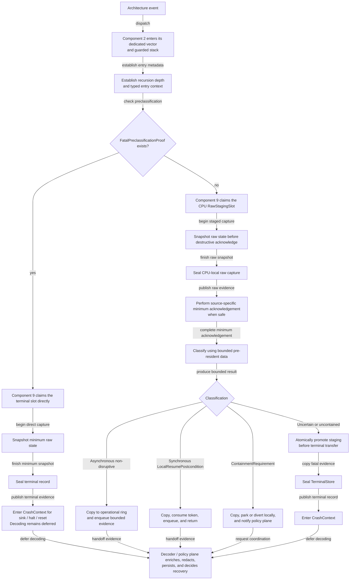

# Architecture faults and diagnostics

## Conclusion

The best implementation for component 9 is a **two-plane fault system**:

1. a tiny architecture-owned capture plane that is always resident, bounded,
   preallocated, per-CPU, nesting-aware, and able to preserve raw evidence
   without locks, allocation, ordinary logging, or another CPU; and
2. a typed policy plane outside hard entry that decodes versioned records,
   establishes the strongest defensible containment claim, redacts and persists
   evidence, and asks the minimal privileged kernel or an external recovery
   service to isolate a domain, CPU, memory extent, or device.

The capture plane must never equate “the handler returned” with “the machine is
safe.” Synchronous resume is permitted only for a small, enumerated class whose
architecture backend supplies a sealed `LocalResumePostcondition`. Work that
needs coordinated isolation is represented separately by a
`ContainmentRequirement` and later `CoordinatedContainmentCompletion`.
Everything else is escalated or terminal. This is intentionally stricter than
a general purpose kernel's pressure to continue after an uncertain machine
check.

For a first implementation, use a safe systems language for record management,
decoding, and routing. Component 1 owns the compiled audited assembly/unsafe
leaf for each entry class; component 2 configures the vectors and stacks,
selects and invokes that leaf, and owns entry/nesting state. Rust `no_std` is
the strongest current fit for expressing sealed
record states and exclusive ownership, but the wire record and state machine
must remain language-independent. The recommendation is an implementation
choice, not a new kernel ABI or a dependency of compiled BEAM code.

## Question and operational standard

This component answers:

> What is the smallest architecture-level mechanism that can preserve
> trustworthy fault evidence, avoid making corruption worse, and tell policy
> exactly which recovery claims remain justified?

It succeeds only if tests demonstrate all of the following:

- first-fault raw state is retained even when ordinary allocation, logging,
  scheduling, or one CPU is unavailable;
- recursive entry cannot overwrite the only useful record or recurse without
  bound;
- every normalized field is traceable to retained raw evidence, backend
  metadata, or an explicitly marked inference;
- recovery classification describes scope, precision, confidence, and required
  postconditions independently;
- no frame, CPU, interrupt, or device is returned to service on the strength of
  an unverified label;
- crash capture has a bounded terminal path when its own assumptions fail;
- secrets and user payload are not exported without diagnostic authority; and
- equivalent semantic tests run on at least two materially different ISA
  backends and on a fault-injecting fake backend.

Passing these tests would validate a mechanism, not prove that arbitrary
hardware corruption is recoverable.

## Exact boundary

### This component owns

- fault-specific raw status acquisition after component 2 has established a
  bounded architecture-entry context, including capture before destructive
  acknowledgement;
- fixed CPU-local raw-staging, operational, and terminal capture slots;
- a versioned normalized `ArchitectureFaultRecord` envelope that retains raw
  blocks;
- architecture-specific containment facts and recovery preconditions;
- a crash-safe bounded sink and terminal transfer operation; and
- typed escalation to the minimal privileged kernel.

### This component does not own

- exception vectors, emergency stacks, entry nesting, or raw-frame layout,
  which belong to component 2;
- privileged register and acknowledgement leaf operations, which belong to
  component 1;
- ordinary user page faults, illegal instructions, or process exceptions once
  the architecture entry layer has normalized them as
  `EntryFrame::UserFaultFrame` values;
- supervisor policy, service restart, BEAM links and monitors, or OTP behaviours;
- device-protocol recovery, persistent-state reconciliation, or application
  checkpointing;
- a promise that firmware, a hypervisor, or failing silicon reports truthfully;
- symbolization, rich formatting, network upload, or unbounded crash dumps in
  hard-entry context; or
- correction of arbitrary memory, cache, interconnect, or CPU corruption.

The boundary is the distinction between **evidence and mechanism** below and
**recovery decision and system policy** above.

## Evidence and synthesis

Current x86-64, Arm A-profile, and RISC-V manuals show that trap state, error
reporting, precision, and optional extensions differ materially. The [Linux RAS
documentation](../../30-sources/linux-kernel-community-2026-ras-documentation.md)
shows why source, severity, latching, correction, and containment should not be
collapsed into one exception number. It also shows the practical value of
preserving both standardized and vendor-specific evidence.

[Kdump](../../30-sources/goyal-et-al-2005-kdump.md) demonstrates a useful
independence principle: prepare memory, metadata, and an alternate capture
environment before failure, then avoid depending on the failed kernel for bulk
collection. Its limits are equally important. A second kernel still assumes
that enough CPU, memory, firmware, and device state survives and that
outstanding DMA cannot corrupt its reservation.

The [seL4 verification](../../30-sources/klein-et-al-2014-comprehensive-sel4-verification.md)
and [CertiKOS](../../30-sources/gu-et-al-2016-certikos.md) work support explicit
state and narrow trusted mechanisms, while their documented hardware, boot,
device, DMA, timing, and fault assumptions prevent treating a functional proof
as a machine-failure proof. [Chandra and Toueg](../../30-sources/chandra-toueg-1996-failure-detectors.md)
supplies the crucial conceptual distinction between observed failure evidence
and suspicion caused by missing progress.

No reviewed work proves the complete design below. The two-plane structure,
record schema, recovery gates, and cross-component epochs are this archive's
synthesis.

## Fault taxonomy

A single severity enum is insufficient. Classify a fault on independent axes:

| Axis | Representative values | Why it matters |
| --- | --- | --- |
| Origin | CPU core, cache, memory, interconnect, interrupt controller, IOMMU, device, firmware, hypervisor, invariant checker | Identifies the backend and possible control authority |
| Delivery | synchronous trap, asynchronous error, NMI-like entry, polled record, firmware event | Determines entry constraints and instruction attribution |
| Precision | exact instruction/address, bounded window, component only, unknown | Bounds rollback and resume claims |
| Correction | corrected, consumed poison, uncorrected, unknown | Separates hardware action from OS containment |
| Scope | thread, address space, domain, CPU, memory extent, requester set, machine, unknown | Defines the smallest possible quarantine |
| Integrity confidence | intact, suspect, lost, unknown | States whether kernel invariants and evidence can be trusted |
| Persistence | transient, sticky until clear, repeatable, permanent, unknown | Shapes acknowledgement and resource retirement |
| Disposition | observe, resume with postcondition, quarantine, escalate, terminal | Records mechanism outcome, not supervisor policy |

The record must permit `unknown`. Inventing precision is more dangerous than
admitting that the machine-wide scope is unresolved.

## Recommended object model

### `RawFaultBlock`

An immutable byte block with:

- architecture and mechanism identifier;
- format/version and enabled-feature profile;
- declared byte order and register width;
- capture CPU and lifecycle generation;
- source-specific validity bits;
- original raw register or firmware-record bytes; and
- a bounded integrity check over the stored block.

Raw blocks are never rewritten during normalization. A later decoder may derive
a better interpretation without destroying the evidence used by the earlier
one.

### `ArchitectureFaultRecord`

The common envelope contains:

- monotonically increasing CPU-local sequence and boot/crash generation;
- `FaultOrigin`, `DeliveryMode`, `Precision`, and `IntegrityConfidence`;
- current protection-domain, address-space, thread, and execution-context IDs;
- CPU, mapping, interrupt-binding, DMA, device, and lifecycle epochs when they
  can be read safely;
- affected address/range/requester set with validity and provenance bits;
- correction and containment facts;
- local-resume postcondition or containment-requirement identifier, if one
  exists (diagnostic identity only, never the capability token);
- redaction class and diagnostic authority required to disclose each payload;
- one or more immutable raw blocks; and
- capture-state and persistence-state checksums.

An identifier in this record is diagnostic evidence, not live authority. It
cannot be used as a capability to control the named object.

### Staging, operational, and terminal capture stores

Each logical CPU receives bounded stores in memory excluded from ordinary
allocation. Every ordinary first-level architecture event initially claims the
generation-tagged `RawStagingSlot` reserved for that CPU. It is independent of
the drainable operational ring, so a ring full of corrected reports cannot
prevent capture and promotion of the first fatal event:

```mermaid
flowchart TD
  subgraph staging["RawStagingSlot"]
    free["Free"] -->|"claim staging slot"| writing["WritingRaw"]
    writing -->|"finish raw copy"| rawSealed["RawSealed"]
    rawSealed -->|"begin bounded classification"| classifying["Classifying"]
    classifying -->|"classify nonterminal"| copying["CopyingOperational"]
    copying -->|"seal operational copy"| operationalCopied["OperationalCopied"]
    operationalCopied -->|"release staging"| nextFree["Free<br/>(next generation)"]
    classifying -->|"classify fatal"| promoting["Promoting<br/>(first fatal generation)"]
    promoting -->|"copy sealed record"| terminalCopied["TerminalCopied"]
    terminalCopied -->|"publish terminal copy"| promoted["Promoted"]
    promoted -->|"release staging"| nextFree
    writing -->|"fail to seal raw copy"| torn["Torn"]
    torn -->|"promote torn capture"| promoting
  end

  subgraph ring["OperationalRing&lt;M&gt; slot"]
    ringFree["Free"] -->|"claim ring slot"| writingCopy["WritingCopy"]
    writingCopy -->|"finish record copy"| sealed["Sealed"]
    sealed -->|"copy to policy queue"| exported["Exported"]
    exported -->|"release ring slot"| ringNext["Free<br/>(next slot generation)"]
  end
```

- `WritingRaw` is established before raw state is copied, and `RawSealed` is
  published with the architecture/compiler ordering needed by a crash reader.
- Classification reads only the sealed staging slot and bounded immutable
  profile data. It never chooses operational versus terminal storage before
  the source-specific validity and severity fields have been captured.
- A second entry never reuses the staging slot. An entry nested after capture
  begins is handled by the separately reserved recursive terminal path.
- A nonterminal classification copies the sealed staging record into a free
  `OperationalRing` slot before releasing staging. Export then copies that
  operational record into an independently owned policy queue before returning
  the ring slot to `Free`; sequence and slot generation reject a delayed
  reader.
- If the operational ring is full, a separate overflow counter,
  first-dropped sequence, and sticky policy notice preserve loss evidence
  without overwriting an active slot. A containment case remains parked even if
  its detailed event cannot be queued. The staging slot can then be released;
  ring fullness never blocks terminal promotion.

`TerminalStore` contains a first-fatal slot and a smaller recursive-fault slot.
To promote a classified fatal record, component 9 atomically claims
`first_fatal` from `Free` to `Writing`, copies the already sealed raw block and
classification with their staging generation and checksum, and release-
publishes `Sealed` or `Torn`. The staging slot remains nonreusable until that
publication completes. “Atomic promotion” refers to this indivisible ownership
and publication decision, not to an unrealistically single-instruction record
copy. If a first-fatal record already exists, it is never overwritten; a
bounded additional-fatal counter is advanced when safe.

Direct capture into a terminal slot is allowed only when component 2 presents a
sealed `FatalPreclassificationProof` minted from a pinned vector/profile rule
whose fatal disposition is knowable before any source-status read. The proof is
bound to the entry class, raw-frame revision, CPU incarnation, profile
generation, and nesting depth. Recursive entry after capture has begun is the
baseline example. A vector number, an NMI-like delivery mode, or a caller's
severity guess cannot manufacture the proof. Terminal slots are never reused
within the boot/crash generation. Initial ring and record sizes must follow
burst and worst-case architecture measurements rather than an aesthetic
constant.

### Local resume and coordinated containment

`LocalResumePostcondition` is a sealed backend-defined token for a bounded,
CPU-local transition that is safe in the capture context, such as:

- guarded user-memory access abandoned before kernel state mutation;
- corrected event acknowledged with architectural evidence that poisoned data
  was not consumed.

Generic code cannot manufacture this token. Absence means that returning from
the low-level handler does not authorize synchronous resumption. A corrected or
informational report may return without this token only when a pinned classifier
rule marks its delivery as asynchronous and non-disruptive: the report did not
arise from the interrupted instruction, architectural state needed for return
was not consumed or poisoned, and acknowledgement has its own proved
postcondition. “Corrected” by itself is not that proof.

Actions requiring another CPU, mapping change, DMA/device quiescence, domain
stop, or CPU offlining are emitted as a `ContainmentRequirement`. The capture
path parks or terminally diverts the affected execution and returns control to
the policy plane; only that plane may coordinate the split-phase components and
construct a `CoordinatedContainmentCompletion`. A requirement is not a recovery
postcondition, and its completion cannot be substituted for a
`LocalResumePostcondition` in the original hard-entry path. A higher-level
kernel transition may consume the coordinated completion to resume, restart,
or retire the parked execution according to its explicit scope.

### `CrashSink`

A crash sink is provisioned at boot and reports a capability profile:

- fixed reserved-memory ring only;
- persistent firmware/NVRAM record with a strictly bounded write primitive;
- serial or debug port proven safe for terminal use; or
- transfer to a separately reserved capture environment.

The baseline requires reserved memory. Other sinks are optional and must never
be necessary for sealing the local record.

## Capture state machine

No capture-plane branch waits for another CPU. The policy plane may start
cross-CPU evidence or containment work after the local record is sealed; it
records acknowledged and missing sets and keeps the resource quarantined when
completion is unavailable.

## Entry and recursion design

### Contract with privileged entry

Component 2 owns separate guarded stacks for ordinary architecture errors and
the final recursive-fault path. It switches stacks before calling code that
could depend on a corrupted current stack and maintains the nesting bound. It
passes component 9 a bounded raw-frame view plus exactly one non-widening
context token: `HardEntryContext` for ordinary hard entry, `NmiContext` for an
NMI-like path, or `FatalCaptureContext` for a preclassified/recursive terminal
path. Only after component 9 seals terminal evidence may terminal control mint a
`CrashContext` for crash-sink, halt, or reset operations. Component 9 owns all
staging, operational, and terminal slots; component 2 holds only typed
references to them.

### Entry-stub contract

Component 1 owns the compiled first-level vector leaf and every irreducible
unsafe spill, stack-switch, register-read, and return/halt sequence. Component 2
owns vector configuration, selects and invokes the leaf, supplies the stack and
CPU-local operands it may use, constructs the raw frame, and advances the
semantic entry state. Component 9 is called only after component 2 has
established the appropriate typed context:

1. mask only the event classes whose masking is defined and safe;
2. switch to component 2's emergency stack without trusting caller-controlled
   state;
3. save component 2's fixed architectural register frame;
4. increment component 2's bounded nesting counter and ask component 9 to
   reserve a staging slot, or a terminal slot only with a
   `FatalPreclassificationProof`;
5. call component 9's nonallocating capture routine; and
6. follow a returned disposition that cannot select an unverified resume path.

Instrumentation, stack probes, sanitizers, tracing hooks, lazy context restore,
and ordinary lock-debug code are disabled in this path unless specifically
proven safe.

### Recursive failure

Depth one uses the normal capture path. Depth two uses the recursive terminal slot and
omits decoding. Any further entry executes the smallest backend reset/halt loop
after storing one recursion counter when possible. This policy intentionally
trades rich evidence for a finite failure path.

## Containment classifier

The classifier is a table generated for a pinned architecture and platform
profile, not a collection of optimistic conditional branches. Each rule names:

- source and required validity bits;
- precision and integrity prerequisites;
- state already modified by hardware or firmware;
- required CPU, mapping, cache, interrupt, or DMA actions;
- a time/work bound and failure fallback;
- the scope that must be stopped or quarantined; and
- whether the delivery is an asynchronous non-disruptive report, a sealed
  `LocalResumePostcondition` may be returned, a `ContainmentRequirement` must be
  emitted, or terminal promotion is mandatory.

Rules are conservative and monotonic: additional uncertainty may widen the
scope or force terminal handling, but cannot silently narrow it.

The upper recovery service receives `ArchitectureFaultRecord` plus a capability
to act on a preauthorized failure scope. It does not receive authority merely
because an identifier appeared in the record. This preserves the capability
design in the [minimal privileged kernel](../minimal-privileged-kernel-layer.md).

## Cross-architecture implementation

### x86-64 profile

The backend must distinguish synchronous exceptions, machine-check delivery,
NMI, double fault, and virtualization exits. Machine Check Architecture banks
and their validity/overflow/status bits are raw blocks. A reported corrected or
recoverable condition is not sufficient: the backend must state whether the
instruction retired, whether data was consumed, what logical processor or
memory range is implicated, and which vendor recovery contract is pinned.

The first prototype should treat uncorrected kernel-context machine checks and
unknown-significance asynchronous events as terminal. Page retirement may be
added only after translation shootdown, DMA revocation, poisoning, and domain
stop compose into one tested postcondition.

### AArch64 profile

The backend distinguishes synchronous exceptions, SError, debug/watchdog-like
entry, and optional RAS records. ESR/FAR and RAS error-record registers retain
their architectural validity and precision information. Because asynchronous
SError may not identify the instruction that caused the condition, generic
resume is forbidden unless a pinned extension and platform contract establishes
a safe containment case.

The capture stub follows the selected exception-level and vector-stack model
and records feature and firmware mediation. Platform error records delivered by
firmware are preserved as separate raw blocks rather than rewritten as if they
were CPU-originated.

### RISC-V profile

The mandatory privileged architecture supplies traps but not a universal
cross-platform RAS taxonomy equivalent to every x86 MCA or Arm RAS facility.
The backend therefore declares `ras = none`, a platform-specific record
profile, or a pinned firmware/SBI profile. Generic code must remain correct
when only synchronous trap state and a terminal watchdog/reset mechanism exist.

This truthful absence is preferable to a fabricated portable severity mapping.

## Diagnostics and confidentiality

Fault evidence is a protected resource. Register state, addresses, code bytes,
page contents, capability identities, and BEAM heap fragments can expose keys,
messages, or user data.

Use three representations:

1. **capture record** — minimal raw state in protected reserved memory;
2. **operational event** — redacted type, scope, epoch, and disposition for
   supervision; and
3. **forensic export** — authorized encrypted or physically controlled output,
   optionally including memory and extended raw blocks.

Redaction must not modify the sealed capture record. It creates a derived view
whose policy/version is recorded. Crash storage should be authenticated against
stale-boot replay and encrypted where the threat profile includes physical
access.

## Interaction with BEAM and OTP principles

An architecture fault is not a BEAM process exit. The component supports the
larger reliability model by providing bounded, typed evidence and by refusing
to disguise machine corruption as an ordinary signal.

- A contained user-domain fault may become a runtime/domain exit after the
  minimal kernel proves that native execution, mappings, DMA, and outstanding
  invocations are fenced.
- A CPU or device event may cause supervisor-driven degradation or replacement,
  but the recovery service remains independently resourced.
- A fatal integrity loss bypasses ordinary OTP-like supervision and enters the
  prepared crash/reboot path.
- Required process-local tracing garbage collection remains runtime work. A
  damaged heap can be abandoned with its domain; this layer never scans BEAM
  terms or attempts collector recovery.

## Concurrency and ordering

- CPU-local record reservation uses an operation valid in the entry context;
  the design does not assume general atomic progress after machine corruption.
- Raw registers are captured before an acknowledgement that may clear them.
- Slot sealing uses release ordering appropriate to the crash reader; the
  reader validates state, generation, length, and checksum with acquire
  semantics.
- Cross-CPU requests, if policy initiates them, begin only after local sealing
  and return an acknowledged, missing, and failed CPU set; the capture path
  never waits for them.
- A memory or CPU quarantine is complete only after translation, cache, DMA,
  interrupt, and lifecycle components report their own required epochs.
- The capture path never takes the normal console, allocator, scheduler,
  mapping, or driver locks.

## Failure analysis

| Failure during fault handling | Required response |
| --- | --- |
| Operational ring full | Keep raw staging independent, increment bounded loss metadata, set the sticky policy notice, and keep containment parked; a fatal classification can still promote to terminal storage |
| Fault while writing raw staging | Mark staging `Torn`, atomically claim terminal storage, and copy only fields whose validity survived; do not parse partial fields as complete |
| Decoder rejects raw format | Preserve raw block; classify scope/precision unknown |
| Another CPU does not respond | Record missing CPU set; never block terminal capture |
| Persistent sink fails | Retain reserved-memory record and halt/reset according to profile |
| Crash environment fails to enter | Use final bounded firmware reset/halt path |
| DMA may target crash reservation | Do not claim reliable bulk capture; reset/quarantine if independently possible |
| Containment operation times out | Widen quarantine or stop the machine; never reuse the resource |
| Redaction/export service fails | Preserve protected record; availability does not override confidentiality |

## Verification plan

### Executable model

Model raw staging, operational-ring copies, terminal promotion, direct-terminal
proofs, recursion, record sealing, quarantine completion, and terminal transfer.
Check that:

- operational-ring exhaustion cannot prevent first-fatal promotion;
- first sealed terminal evidence is never overwritten;
- no torn record is accepted as complete;
- synchronous resume requires an unforgeable `LocalResumePostcondition` from a
  permitted rule, while the no-token path is reachable only for a proved
  asynchronous non-disruptive report;
- `ContainmentRequirement` cannot be consumed as either local resume or
  `CoordinatedContainmentCompletion`;
- direct terminal capture is reachable only with a current
  `FatalPreclassificationProof` and `FatalCaptureContext`, and `CrashContext`
  is unreachable before terminal sealing;
- unknown completion prevents resource reuse; and
- every path terminates within a configured number of local transitions.

### Fake backend

Inject every raw validity combination, nested fault point, clear-on-read
register, full operational ring, promotion race, stale/direct-proof mismatch,
delayed/missing CPU, sink failure, generation wrap, and decoder version
mismatch. Make allocation, locks, logging, and the ordinary stack fail while
confirming that a bounded record survives.

### ISA and emulator tests

- Trigger representative synchronous, asynchronous where available, NMI-like,
  double/recursive, and firmware-mediated events.
- Inspect disassembly and unwind assumptions for every capture stub.
- Verify the precise register values and acknowledgement order against the
  pinned manual and errata profile.
- Corrupt ordinary page tables and stacks in controlled emulation and confirm
  use of reserved mappings/stacks.
- Inject errors during CPU offline, mapping invalidation, interrupt rebinding,
  and DMA revocation.

### Hardware fault injection

Where supported, use platform error injection, ECC test modes, IOMMU fault
injection, watchdog/NMI triggers, and external reset observation. Emulator
success is not evidence about cache, interconnect, firmware, or silicon RAS
behavior.

### Metrics

Record capture latency, maximum local work, stack high-water mark, bytes per
record, first-fault retention under storms, recursion behavior, cross-CPU
collection completion sets, sink success rate, and time to terminal reset.
Measure distributions and worst observed values under the exact feature and
virtualization profile.

## Implementation sequence

1. Define the language-independent record schema, raw-block envelope, and
   containment vocabulary.
2. Build a fake backend and model the slot/recursion/terminal state machine.
3. Implement reserved memory, CPU-local stacks, one synchronous fatal entry,
   and a memory-only crash sink on the first ISA.
4. Add versioned decoder and redacted operational events outside hard entry.
5. Add a prepared independent crash environment or persistent sink and test its
   DMA/firmware assumptions.
6. Add corrected and contained cases one at a time, each classified explicitly
   as asynchronous non-disruptive reporting, local resume with a sealed
   `LocalResumePostcondition`, or coordinated containment with a
   `ContainmentRequirement`, plus a fault-injection suite.
7. Port to a second materially different ISA without changing the common
   semantic tests.
8. Only then consider richer memory retirement, CPU offlining, or continued
   operation after hardware errors.

## Alternatives considered

### Log through the ordinary kernel and reboot

Simple, but the console, allocator, locks, driver, or filesystem may be the
failed dependency. It also provides no stable raw record or bounded recursion
path.

### Always boot a capture kernel

Useful as an optional bulk sink, but too strong as the only mechanism. Some
targets lack the memory or platform handoff, and arbitrary hardware failure can
prevent entry. A tiny local sealed record remains mandatory.

### Normalize immediately and discard raw state

Smaller records, but it makes decoder bugs irreversible and loses vendor or
future fields. Preserve bounded raw blocks and derive normalized views.

### Recover whenever hardware marks an event recoverable

Hardware correction or architectural returnability does not establish that
kernel invariants, shared state, DMA, or the affected instruction are safe.
Synchronous local return needs `LocalResumePostcondition`; wider recovery needs
a completed, scope-matched `CoordinatedContainmentCompletion` produced from the
original `ContainmentRequirement`.

### Put recovery policy in the architecture handler

This entangles ISA code with service topology and OTP-like policy and expands
hard-entry work. The architecture layer should report facts and enforce only
the minimum local safety transition.

## Decisions and open questions

This research recommends:

- the two-plane design;
- immutable raw evidence inside a versioned normalized envelope;
- fixed CPU-local slots, dedicated stacks, and a terminal recursion record;
- conservative table-driven classification with sealed
  `LocalResumePostcondition`, `ContainmentRequirement`, and
  `CoordinatedContainmentCompletion` types;
- a mandatory reserved-memory sink and optional independent bulk capture; and
- capability-authorized, redacted diagnostic export.

Open questions remain:

- Which first ISA and emulator expose the most useful deterministic fault
  injection without making their RAS profile the portable baseline?
- Is a second capture kernel justified on the first target, or is a small
  append-only persistent record a better initial sink?
- Which memory-poison and CPU-offline cases can compose with the minimal
  kernel's domain-stop and DMA-quiescence contract without a machine reboot?
- How much raw state is sufficient for each pinned platform while retaining a
  hard upper bound?
- What cryptographic and physical-access model governs forensic export?

## Connections

- [Kernel hardware and architecture support layer](../kernel-hardware-and-architecture-support-layer.md) —
  defines component 9 in the full architecture decomposition.
- [Typed kernel-facing architecture facade](typed-kernel-facing-architecture-facade.md) —
  exposes `ArchitectureFaultRecord`, `CrashSink`, and their completion
  semantics to the minimal privileged kernel.
- [Minimal privileged kernel layer](../minimal-privileged-kernel-layer.md) — turns
  proven containment facts into authorized domain, CPU, device, and recovery
  actions.
- [Kernel hardware and architecture support map](../../10-maps/kernel-hardware-and-architecture-support.md) —
  places the component in the wider evidence trail.
- [Kernel hardware-contract inquiry](../../40-inquiries/what-contract-should-the-kernel-hardware-and-architecture-layer-provide.md) —
  retains cross-ISA and fault-injection criteria as open work.

## Sources

- [Linux reliability, availability, and serviceability documentation](../../30-sources/linux-kernel-community-2026-ras-documentation.md)
- [Kdump](../../30-sources/goyal-et-al-2005-kdump.md)
- [Intel 64 and IA-32 system programming documentation](../../30-sources/intel-2026-system-programming-documentation.md)
- [Arm A-profile system architecture documentation](../../30-sources/arm-2026-a-profile-system-architecture-documentation.md)
- [RISC-V privileged architecture](../../30-sources/risc-v-international-2026-privileged-architecture.md)
- [Linux low-level core API documentation](../../30-sources/linux-kernel-community-2026-low-level-core-apis.md)
- [Comprehensive formal verification of an OS microkernel](../../30-sources/klein-et-al-2014-comprehensive-sel4-verification.md)
- [CertiKOS](../../30-sources/gu-et-al-2016-certikos.md)
- [Unreliable failure detectors for reliable distributed systems](../../30-sources/chandra-toueg-1996-failure-detectors.md)
