# Architecture faults and diagnostics

## Conclusion

The best implementation for component 9 is a **two-plane fault system**:

1. a tiny architecture-owned capture-and-disposition plane that is always
   resident, bounded, preallocated, per-CPU, and nesting-aware; it preserves raw
   evidence and runs the generated return/park/terminal gate without locks,
   allocation, ordinary logging, or another CPU; and
2. a typed policy plane outside hard entry that decodes versioned records,
   coordinates or conservatively widens the already selected containment
   requirement, redacts evidence, establishes explicitly qualified custody or
   persistence when available, and asks the minimal privileged kernel or an
   external recovery service to isolate a domain, CPU, memory extent, or device.

The capture plane must never equate “the handler returned” with “the machine is
safe.” Synchronous resume is permitted only for a small, enumerated class whose
architecture backend supplies a sealed `LocalResumePostcondition`. Work that
needs coordinated isolation is represented separately by a
`ContainmentRequirement` and later `CoordinatedContainmentCompletion`.
Everything else is escalated or terminal. This is intentionally stricter than
a general purpose kernel's pressure to continue after an uncertain machine
check.

For a first implementation, use a safe systems language for record management,
decoding, and routing. Component 1 owns the compiled audited assembly/unsafe
leaf for each entry class; component 2 configures the vectors and stacks,
selects and invokes that leaf, and owns entry/nesting state. Rust `no_std` is
the strongest current fit for expressing sealed
record states and exclusive ownership, but the wire record and state machine
must remain language-independent. The recommendation is an implementation
choice, not a new kernel ABI or a dependency of compiled BEAM code.

## Internal service research

The component is now decomposed into six separately reviewable services. Their
local [research index](architecture-faults-and-diagnostics/README.md) preserves
the full route through evidence, contracts, state machines, failure modes, and
verification obligations:

- [Bounded capture routine](architecture-faults-and-diagnostics/bounded-capture-routine.md) —
  executes a generated, architecture-profiled, fixed-work capture program and
  truthfully records overwrites, missing fields, and loss.
- [Fault decoder](architecture-faults-and-diagnostics/fault-decoder.md) — runs in
  the policy plane and derives append-only, provenance-carrying views from
  immutable raw evidence without creating recovery authority or changing the
  earlier entry decision.
- [Containment classifier and promotion](architecture-faults-and-diagnostics/containment-classifier-and-promotion.md) —
  is the tiny generated capture-time decision function over raw/profile facts
  and acknowledgement state; it separates local resume from coordinated
  containment and preserves the first successfully promoted fatal record.
- [Crash-safe sink](architecture-faults-and-diagnostics/crash-safe-sink.md) —
  seals a mandatory reserved-memory first record before attempting optional
  firmware, capture-environment, debug, or forensic adapters.
- [Escalation channel](architecture-faults-and-diagnostics/escalation-channel.md) —
  retains evidence and requests at least once within a declared surviving
  memory domain, promotes that claim to a named durable domain only after its
  persistence transition succeeds, and keeps diagnostic identifiers separate
  from action capabilities.
- [Double-fault guard](architecture-faults-and-diagnostics/double-fault-guard.md) —
  gives recursive entry one independent terminal opportunity and then follows
  a finite architecture- and platform-profiled halt/reset path.

## Question and operational standard

This component answers:

> What is the smallest architecture-level mechanism that can preserve
> trustworthy fault evidence, avoid making corruption worse, and tell policy
> exactly which recovery claims remain justified?

It succeeds only if tests demonstrate all of the following:

- the first successfully published software observation is retained even when
  ordinary allocation, logging, scheduling, or one CPU is unavailable, while
  hardware overwrite/loss flags prevent it from being mislabeled as the first
  physical error;
- recursive entry cannot overwrite the only useful record or recurse without
  bound;
- every normalized field is traceable to retained raw evidence, backend
  metadata, or an explicitly marked inference;
- recovery classification describes scope, precision, confidence, and required
  postconditions independently;
- no frame, CPU, interrupt, or device is returned to service on the strength of
  an unverified label;
- crash capture has a bounded terminal path when its own assumptions fail;
- secrets and user payload are not exported without diagnostic authority; and
- equivalent semantic tests run on at least two materially different ISA
  backends and on a fault-injecting fake backend.

Passing these tests would validate a mechanism, not prove that arbitrary
hardware corruption is recoverable.

## Exact boundary

### This component owns

- fault-specific raw status acquisition after component 2 has established a
  bounded architecture-entry context, including per-attempt capture before a
  separate destructive acknowledgement except for explicitly profiled
  observation-is-acknowledgement sources;
- fixed CPU-local raw-staging, operational, and terminal capture slots;
- a versioned immutable `ArchitectureFaultRecord` graph and linkage projections
  that retain protected references to sealed raw blocks;
- architecture-specific containment facts and recovery preconditions;
- a crash-safe bounded sink and terminal transfer operation; and
- typed escalation to the minimal privileged kernel.

### This component does not own

- exception vectors, emergency stacks, entry nesting, or raw-frame layout,
  which belong to component 2;
- privileged register and acknowledgement leaf operations, which belong to
  component 1;
- ordinary user page faults, illegal instructions, or process exceptions once
  the architecture entry layer has normalized them as
  `EntryFrame::UserFaultFrame` values;
- supervisor policy, service restart, BEAM links and monitors, or OTP behaviours;
- device-protocol recovery, persistent-state reconciliation, or application
  checkpointing;
- a promise that firmware, a hypervisor, or failing silicon reports truthfully;
- symbolization, rich formatting, network upload, or unbounded crash dumps in
  hard-entry context; or
- correction of arbitrary memory, cache, interconnect, or CPU corruption.

The boundary is the distinction between **evidence and mechanism** below and
**recovery decision and system policy** above.

## Evidence and synthesis

Current x86-64, Arm A-profile, and RISC-V manuals show that trap state, error
reporting, precision, and optional extensions differ materially. The [Linux RAS
documentation](../../30-sources/linux-kernel-community-2026-ras-documentation.md)
shows why source, severity, latching, correction, and containment should not be
collapsed into one exception number. It also shows the practical value of
preserving both standardized and vendor-specific evidence.

[Kdump](../../30-sources/goyal-et-al-2005-kdump.md) demonstrates a useful
independence principle: prepare memory, metadata, and an alternate capture
environment before failure, then avoid depending on the failed kernel for bulk
collection. Its limits are equally important. A second kernel still assumes
that enough CPU, memory, firmware, and device state survives and that
outstanding DMA cannot corrupt its reservation.

The primary architecture records make capture ordering a generated platform
contract rather than a portable register loop. Intel MCA has validity,
overflow, and context-corruption state plus an explicit read-before-clear
sequence; [Arm RAS](../../30-sources/arm-2019-ras-specification.md) has its own
ordering, overwrite, and write-one-to-clear rules; and optional [RISC-V
RERI](../../30-sources/risc-v-international-2024-ras-error-record-interface.md)
defines a versioned record protocol whose invalidate-and-recheck result can
expose overwrite during capture. All three can lose an earlier physical event,
so “first fatal” below means the first successfully promoted software record,
never an unsupported claim about chronology inside failing hardware.

[Machine-check recovery experience](../../30-sources/luck-2003-machine-check-recovery-itanium.md),
[Linux hardware poisoning](../../30-sources/kleen-2009-hwpoison.md),
and production memory-error studies from [Facebook](../../30-sources/meza-et-al-2015-revisiting-memory-errors.md)
and [Li et al.](../../30-sources/li-et-al-2010-realistic-memory-error-evaluation.md)
show why correction, consumption, precision, recurrence, and containment scope
must remain independent facts. They do not establish that Atom can safely
resume any concrete case; every such rule still needs a pinned target profile
and its own falsification evidence.

Crash-path studies and current [pstore backend
contracts](../../30-sources/linux-kernel-community-2026-pstore-crash-backends.md)
support preallocation, independent execution resources, and reclaim-after-copy,
but not a universal persistence guarantee. The sink therefore reports sealing,
acceptance, reset survivability, durability, authenticity, confidentiality, and
freshness as separate claims. Escalation begins with generation-lifetime
retained-at-least-once delivery and claims durable at-least-once only after a
named persistence transition succeeds. As
[Helland](../../30-sources/helland-2007-life-beyond-distributed-transactions.md)
explains, a crash between durable action and acknowledgement creates an
unavoidable retry unless effect and receipt share one transaction.

The [seL4 verification](../../30-sources/klein-et-al-2014-comprehensive-sel4-verification.md)
and [CertiKOS](../../30-sources/gu-et-al-2016-certikos.md) work support explicit
state and narrow trusted mechanisms, while their documented hardware, boot,
device, DMA, timing, and fault assumptions prevent treating a functional proof
as a machine-failure proof. [Chandra and Toueg](../../30-sources/chandra-toueg-1996-failure-detectors.md)
supplies the crucial conceptual distinction between observed failure evidence
and suspicion caused by missing progress.

No reviewed work proves the complete design below. The two-plane structure,
record schema, recovery gates, and cross-component epochs are this archive's
synthesis.

## Fault taxonomy

A single severity enum is insufficient. Classify a fault on independent axes:

| Axis | Representative values | Why it matters |
| --- | --- | --- |
| Origin | CPU core, cache, memory, interconnect, interrupt controller, IOMMU, device, firmware, hypervisor, invariant checker | Identifies the backend and possible control authority |
| Delivery | synchronous trap, asynchronous error, NMI-like entry, polled record, firmware event | Determines entry constraints and instruction attribution |
| Precision | exact instruction/address, bounded window, component only, unknown | Bounds rollback and resume claims |
| Correction | corrected, consumed poison, uncorrected, unknown | Separates hardware action from OS containment |
| Scope | thread, address space, domain, CPU, memory extent, requester set, machine, unknown | Defines the smallest possible quarantine |
| Integrity confidence | intact, suspect, lost, unknown | States whether kernel invariants and evidence can be trusted |
| Persistence | transient, sticky until clear, repeatable, permanent, unknown | Shapes acknowledgement and resource retirement |
| Disposition | observe, resume with postcondition, quarantine, escalate, terminal | Records mechanism outcome, not supervisor policy |

The record must permit `unknown`. Inventing precision is more dangerous than
admitting that the machine-wide scope is unresolved.

## Recommended object model

### `RawFaultBlock`

An immutable byte block with:

- architecture and mechanism identifier;
- format/version and enabled-feature profile;
- declared byte order and register width;
- capture CPU and lifecycle generation;
- source-specific validity bits;
- original raw register or firmware-record bytes; and
- a bounded integrity check over the stored block.

Raw blocks are never rewritten during normalization. A later decoder may derive
a better interpretation without destroying the evidence used by the earlier
one.

### `ArchitectureFaultRecord`

This name denotes a linked immutable object graph, not one mutable envelope that
duplicates fields as interpretation evolves:

- a complete-evidence record has a sealed per-attempt `RawFaultBlock` set that
  owns original bytes, source/attempt identity, validity, loss, and canonical
  digests; a loss-only record instead has a closed `OperationalLossRoot`,
  preserves only logical identities/digests plus an immutable compact loss
  proof, explicitly marks raw bytes unavailable, and cannot be decoded;
- a sealed `EntrySnapshot` owns the capture-bound frame, CPU/domain/address-
  space/lifecycle epochs, mutation phase, and external-effect status that were
  safe to copy at entry;
- the sealed capture-disposition decision encodes the exact return, park/
  containment, or terminal result and raw-rule hash;
- semantic `ArchitectureFaultRecordCore` content-addresses only capture/profile,
  logical raw/source-result digests, entry-snapshot semantic identity/digest,
  and decision semantic ID/digest—never a reusable storage pointer;
- an immutable `ArchitectureFaultRecordCorePublication` binds that semantic
  core to the accepted decision/root and exactly one closed evidence-custody
  variant: immediate operational ring, operational queue, immutable loss-only
  transfer, held requirement witness, terminal promotion, or independently
  receipted destination;
- append-only `DecodedFaultView` objects carry full provenance-bearing
  normalized facts, conflicts, associations, and decoder identity for
  raw-authorized diagnostics;
- a validator-minted result attestation and trusted fixed-schema declassifier
  may publish a redacted `OperationalFaultView`; and
- each `ArchitectureFaultRecord` version is only a fixed linkage projection to
  the same core, an optional decoded-view ID plus protected publication
  reference/ID, and an optional opaque operational handle plus protected
  publication reference/ID, with predecessor
  lineage outside the semantic view.

An identifier in this record is diagnostic evidence, not live authority. It
cannot be used as a capability to control the named object.

The canonical lifecycle has an immutable semantic
`ArchitectureFaultRecordCore`—logical raw/source/entry/decision identities and
digests—plus bounded, preallocated `FaultRecordPublicationGraphSlot`s. Each
sealed slot contains one rematerialized decision publication, one custody-root core
wrapper, an optional graph-owned decoded-view/result-attestation/operational-
view closure, and one record projection. It publishes strictly decision → core
→ optional derived closure → projection → aggregate root. When custody moves, a fresh graph slot reproduces
the complete closed decision body and acceptance root, binds the same semantic
`core_id` to the replacement receipt/destination, and seals a complete rehome
witness before the source graph can drain and clear. The core itself never
changes and no new core points to an old graph's decision. Exact-generation
graph borrows, revoke/drain, verified clear/rekey, checked nonwrap, and explicit
pool exhaustion make storage lifetime finite without dangling references. The deferred decoder can add a
new provenance-carrying view over the same core; escalation, custody, and policy
bind the exact version they consumed. Nothing rewrites the core or changes the
original return/park/terminal decision.

#### Bounded borrow-count contract

Every `BoundedBorrowCount<MAX>` in this component uses a fixed unsigned atomic
field with `MAX` strictly below its largest representable value, and boot
admission proves the bounded issuer/holder population cannot exceed that
profile-specific maximum. Acquire may CAS `n → n+1` only when `n < MAX`; at
`MAX` it fails closed without returning a pointer, token, claim, or action
authority. Exactly one generation-bound holder token authorizes exactly one
decrement in `Open` or `Revoking`; underflow, double release, unknown holder, or
generation mismatch is a terminal integrity fault and can never be repaired by
setting the count to zero. Revocation preserves the exact count, blocks new
issuance, and only the atomic tuple with state `Revoking` and count zero may
advance to `Drained`. Count and epoch generations use checked nonwrapping
arithmetic. Exhaustion retires the object. Thus neither authorized request
flooding nor a stale/double release can wrap a live-holder count and authorize
reuse.

The semantic count is not an unauditable scalar. It contains a fixed
`live_holder_bitmap`, a count equal to that bitmap's population count, and a
generation-bound immutable table assigning each admitted holder/token ID to
one bit. Registration and count change occur in the **same** target-supported
atomic word as the borrow state and generation; release clears that same bit
and decrements the count in one CAS. The complete word must fit a native atomic
primitive in every admitted ISA profile. A profile that needs more holders
uses independently closeable fixed shards whose complete local words each fit;
it may not emulate this hard-fault cut with a lock or multiword CAS. A
preallocated hold may therefore publish an acquisition frontier before a
borrow CAS and recovery can determine exactly whether that holder bit was
installed. The audit digest covers the immutable assignment table and every
successful terminal bitmap, but is not itself the linearization point.

### Staging, operational, and terminal capture stores

Each logical CPU receives bounded stores in memory excluded from ordinary
allocation: raw staging, entry snapshots, local-resume tokens, operational
ring slots, requirement/completion slots, publication-graph slots, terminal
promotion, and recursive records. Every ordinary first-level architecture event initially claims the
generation-tagged `RawStagingSlot` reserved for that CPU. It is independent of
the drainable operational ring, so a ring full of corrected reports cannot
prevent capture and promotion of the first fatal event:

```mermaid
flowchart TD
  subgraph staging["RawStagingSlot atomic lifecycle"]
    free["Free"] -->|"claim staging slot"| writing["WritingRaw"]
    writing -->|"seal attempt 0"| attemptsOpen["AttemptsOpen"]
    attemptsOpen -->|"bounded acknowledge/retry;<br/>seal every appended attempt"| rawSetSealed["RawSetSealed"]
    rawSetSealed -->|"classify async/local;<br/>exact-generation claim"| copying["CopyingOperational"]
    copying -->|"sealed substrate + graph; ReadyToAccept;<br/>Complete hold; accepted-bit CAS; Live"| stagingClearing["Clearing<br/>clear/rekey + verify"]
    stagingClearing -->|"increment generation; publish last"| nextFree["Free<br/>(next generation)"]
    copying -->|"eligible async ring full; sealed compact loss root;<br/>ReadyToAccept + Complete hold + accepted bit + Live"| stagingClearing
    copying -->|"bounded nontrapping copy/loss failure;<br/>exact-generation terminalize"| heldTerminal
    copying -->|"nested fault/execution cut;<br/>retain interrupted state"| recursiveCopy["Independent recursive terminal record"]
    rawSetSealed -->|"containment admission + fence succeeds;<br/>exact-generation claim"| heldContainment["HeldForContainment"]
    heldContainment -->|"custodian wins same-word outcome gate"| containmentCommitting["ContainmentCommitting"]
    containmentCommitting -->|"requirement Sealed → Held;<br/>publish exact witness"| containmentAccepted["ContainmentAccepted"]
    containmentAccepted -->|"cancel untouched terminal fallback reservation"| stagingClearing
    heldContainment -->|"terminal fallback wins same-word outcome gate"| heldTerminal
    containmentCommitting -->|"only after requirement Sealed → Abandoned;<br/>no Held acceptance"| heldTerminal
    heldContainment -->|"nested cut: before Held no outer decision;<br/>after Held preserve accepted obligation"| recursiveContain["Independent recursive terminal record<br/>(separate event)"]
    rawSetSealed -->|"fatal or containment admission/fence fails;<br/>exact-generation claim"| heldTerminal["HeldForTerminal"]
    writing -->|"nested fault before raw seal"| recursive["WritingRaw remains incomplete<br/>independent recursive terminal record"]
    attemptsOpen -->|"nested fault during acknowledge/retry"| recursiveOpen["AttemptsOpen remains incomplete<br/>sealed attempts retained"]
  end

  subgraph ring["Restricted RawOperationalRing&lt;M&gt; slot"]
    ringFree["Empty"] -->|"claim exact generation"| writingCopy["Writing"]
    writingCopy -->|"finish root publication"| sealed["Sealed"]
    sealed -->|"exclusive export claim"| exporting["Exporting"]
    exporting -->|"separate milestone: seal queue copy"| queueCopy["Queue copy Sealed<br/>(separate publication)"]
    queueCopy -->|"separate milestone: bind both roots"| queueReceipt["Queue receipt Sealed<br/>(separate publication)"]
    queueReceipt -->|"rehome every live graph/binding;<br/>close and drain source dependencies"| graphRehome["Transfer control Committed<br/>(complete rehome witness)"]
    graphRehome -->|"ring lifecycle transition after commit"| exported["Exported"]
    exported -->|"clear/rekey + verify"| ringClearing["Clearing"]
    ringClearing -->|"increment generation; publish last"| ringNext["Empty<br/>(next slot generation)"]
  end

  heldTerminal --> promotionAction["Global terminal-promotion action<br/>(slot remains HeldForTerminal)"]
  promotionAction -->|"winning sealed promotion"| winnerSink["Winner alone mints one-shot CrashContext<br/>and owns the normal capsule writer"]
  promotionAction -->|"claim already owned"| followerLeaf["Nonwriting CPU-local halt/park leaf<br/>retain evidence; never wait or reset"]
```

- `WritingRaw` is established before raw state is copied. Every raw attempt is
  sealed before its following destructive acknowledgement; `RawSetSealed` is
  published only after the bounded acknowledgement/retry program selects and
  seals the final attempt set.
- Classification reads only the sealed attempt set and bounded immutable
  profile data. It never chooses operational versus terminal storage before
  the source-specific validity and severity fields have been captured.
- A second entry never reuses the staging slot. An entry nested after capture
  begins is handled by the separately reserved recursive terminal path.
- An asynchronous/local-return classification remains a candidate while it
  copies the sealed staging record
  into a free restricted `RawOperationalRing` slot before releasing staging.
  Export then copies that raw record into an independently owned restricted
  decoder/evidence queue, seals a receipt binding both publication identities,
  rehomes the whole publication graph from `OperationalRingRoot` to
  `OperationalQueueRoot`, enters `Exported`, and only then clears/rekeys,
  verifies, increments the slot generation, and publishes `Empty` last. Once
  the ring evidence substrate validates, the reserved slot publishes its one
  decision → core → `CaptureOnly` → projection → aggregate root; only after
  that root seals, its entry reaches `ReadyToAccept`, component 2's
  reservation-bound continuation hold is `Complete`, and the same-word
  accepted-bit CAS wins may the entry publish `Live`; that accepted-bit CAS is
  custody/decision acceptance. For local resume, component 2 first atomically
  installs the immutable return-arm build descriptor and seals and validates
  the generation-bound `ReturnArmed` record. Only that sealed destination may
  consume the exact protected one-shot token; only after the token is consumed
  may the continuation hold move `Complete → Transferring → Transferred`
  into that already sealed arm. Component 2 then executes the architecture
  return. Hold release and depth reset occur only when a later protected
  entry/context-switch proves that the target context was reached.
  An asynchronous-nondisruptive candidate may instead seal a compact
  `OperationalLossRoot`; local resume never may. A nontrapping copy or required
  loss-transfer failure replaces the candidate with one terminal product
  before any decision graph seals. The one atomic lifecycle/generation
  word and exact-generation borrows reject delayed readers. General recovery policy receives
  only a bounded capture-decision notice and, later, a sealed declassified
  `OperationalFaultView`, never ambient raw evidence.
- A containment plan pre-reserves a dedicated requirement slot, establishes
  and verifies the minimum access fence before spending the evidence-copy
  interval, writes the bounded full evidence plus candidate decision/core into
  one envelope. Its custodian and terminal fallback first arbitrate on the
  source staging word: only `HeldForContainment → ContainmentCommitting` permits
  the validated requirement `Sealed → Held` CAS, while the competing
  `HeldForContainment → HeldForTerminal` selects terminal fallback. The `Held`
  CAS remains the transaction's acceptance event. It then mints a fixed protected witness for that exact CAS
  and embeds it in accepted decision/core publications. Only the Held slot plus
  that witness and cancellation of the untouched terminal-fallback graph
  reservation permit staging release. A digest-only
  or dangling staging reference is not sufficient custody.
- If the operational ring is full, a separate overflow counter,
  first-dropped sequence, and sticky policy notice preserve loss evidence
  without overwriting an active slot. Staging recycles only after this bounded
  loss-ownership transfer publishes; transfer failure goes terminal. A
  containment case never depends on the
  operational ring: failure of its dedicated evidence reservation/copy/fence
  makes the effective decision terminal. Ring fullness never blocks terminal
  promotion.
- Before terminal promotion, staging retention becomes `HeldForTerminal`.
  Neither the winner nor a losing CPU's sealed evidence is recycled during the
  boot/crash generation.

`TerminalStore` contains one system-wide first-fatal slot and one smaller
CPU-indexed recursive-fault slot for every admitted CPU.
To promote a classified fatal record, component 9 atomically claims
`first_fatal` from `Free` to `Writing`, then copies a fixed-capacity evidence
payload containing the sealed raw set, ordered per-source result/
acknowledgement set, entry snapshot, and exact capture-disposition decision.
It binds their lengths and canonical payload/body digests before release-
publishing `Sealed`. The staging slot remains nonreusable until that
publication completes. “Atomic promotion” refers to this indivisible ownership
and publication decision, not to an unrealistically single-instruction record
copy. The promotion is the evidence substrate and therefore seals **before**
any `TerminalPromotionRoot` decision/core/projection graph is materialized. A
reserved graph may seal afterward and becomes acceptable only when its exact
accepted bit is set and dependency entry is `Live` (terminal graphs require no
continuation hold); a cut is recovered through the promotion's bounded
dependency set. The mandatory sink does not wait for that graph: the winning
sealed promotion alone authorizes its one-shot `CrashContext`. Staging may be
treated as no longer the sole logical evidence owner, but its
`HeldForTerminal` bytes remain physically nonreusable for the rest of this
boot/crash generation and are ingested after reset. Reset is not a free:
source reuse requires a full-extent `RawStagingAttempt` custody receipt,
separate current `CrashReclaim`, fenced old CPU/writer, drained staging
borrows, and either proof that no disposition was accepted or complete rehome
of every accepted graph, requirement, terminal, and recursive dependency.
Promotion reclamation later
requires the full dependency, receipt, `CrashReclaim`, and borrow-drain
protocol. No graph is constructed over a not-yet-sealed
promotion. A trapping copy remains visibly `Writing`; the separate recursive record
names its incomplete phase rather than assuming the outer writer can return and
mark it torn. If a first-fatal record already exists, it is never overwritten;
a separately owned best-effort bounded additional-fatal counter is advanced
when safe. That counter is outside the sealed/checksummed record. The winner is
the first successful software publication among contenders. Hardware `OVER`,
multiple-error, record-during-invalidation, and equivalent loss indicators
remain attached because the source may already have replaced an earlier
physical event.

The compare/exchange observation gives every loser a bounded, nonwaiting exit.
If it observes `Sealed`, it retains its CPU-local staging, optionally updates
the separate collision summary, and enters a nonwriting CPU-local
terminal-follower halt/park leaf. If it observes `Writing`, an invalid state,
or a coherence/access failure, it does not wait for the claimant; it retains
staging and enters the same leaf. Only the winning capture whose own
publication reaches `Sealed` can mint and consume the one-shot normal
`CrashContext` and write the normal capsule. A loser neither touches the shared
sink nor requests reset before that mandatory write; an explicitly provisioned
external watchdog remains the bounded fallback if the winner never completes.
A loser needs no recursive proof merely to stop—recursive capture is reserved
for an actual nested entry or a fault in the winning outer transaction.

The baseline bypasses normal staging only for a depth-two recursive entry.
Component 2 presents an immutable, protected, `Available`
`FatalPreclassificationProofPublication` bound to the pinned
recursive route, entry class, raw-frame revision, CPU incarnation, profile
generation, outer capture phase, and observed depth. That proof authorizes only
the independent `RecursiveFaultRecord`; it cannot claim or replace
`first_fatal`. The guard must claim and consume the `Available` proof while
claiming that exact recursive slot; only the resulting successfully `Sealed`
`RecursiveFaultRecord` may mint `RecursiveCrashContext`. A vector
number, an NMI-like delivery mode, or a caller's severity guess cannot
manufacture the proof. Terminal slots are never reused within the boot/crash
generation. Initial ring and record sizes must follow
burst and worst-case architecture measurements rather than an aesthetic
constant.

### Local resume and coordinated containment

`LocalResumePostcondition` is a sealed backend-defined token for a bounded,
CPU-local transition that is safe in the capture context, such as:

- guarded user-memory access abandoned before kernel state mutation;
- corrected event acknowledged with architectural evidence that poisoned data
  was not consumed.

Generic code cannot manufacture this token. Absence means that returning from
the low-level handler does not authorize synchronous resumption. A corrected or
informational report may return without this token only when a pinned classifier
rule marks its delivery as asynchronous and non-disruptive: the report did not
arise from the interrupted instruction, architectural state needed for return
was not consumed or poisoned, and acknowledgement has its own proved
postcondition. “Corrected” by itself is not that proof.

Actions requiring another CPU, mapping change, DMA/device quiescence, domain
stop, or CPU offlining are emitted as a `ContainmentRequirement`. The capture
path parks or terminally diverts the affected execution and returns control to
the policy plane. That plane may coordinate the split-phase components and
collect their generation-bound owner tokens, but only the kernel-owned release
gate validates and consumes the exact conjunction and constructs a
`CoordinatedContainmentCompletion`. A requirement is not a recovery
postcondition, and its completion cannot be substituted for a
`LocalResumePostcondition` in the original hard-entry path. A higher-level
kernel transition may consume the coordinated completion to resume, restart,
or retire the parked execution according to its explicit scope.

### `CrashSink`

A crash sink is provisioned at boot as one mandatory first-record mechanism and
zero or more optional adapters:

- a fixed reserved-memory terminal store, required on every profile;
- persistent firmware/NVRAM or ACPI ERST only when every access has a
  defensible target response bound, with a finite poll/work budget;
- a serial or debug port with a fixed byte and takeover budget; or
- transfer to a separately reserved capture environment whose code, stacks,
  page tables, metadata, and device plan were prepared while healthy.

Every adapter declares maximum input, work, and retries; allowed entry classes;
allocation/lock/interrupt/DMA dependencies; memory-order and persistence-domain
recipe; reset-survival class; and explicit failure outcome. The baseline
reserved-memory seal cannot depend on another adapter. A consumer accepts a
record only after bounds, version, generation, commit state, and integrity
checks agree.

The sink reports distinct claims: `sealed`, `accepted_by_adapter`,
`survives_reset(class)`, `durable(power_model)`, `origin_authenticated`,
`confidential`, and `freshness_verified`. A checksum proves none of the last
three. A sealed record becomes reclaimable only after an authenticated durable
receipt covers every byte being relinquished **and** a separate generation-
current `CrashReclaim` authority approves that exact record; custody acceptance
alone, an attempted send, or a volatile acknowledgement is insufficient.

## Capture state machine

```mermaid
flowchart TD
  event["Architecture event"] -->|"dispatch"| vector["Component 2 enters its dedicated vector<br/>and guarded stack"]
  vector -->|"establish entry metadata"| context["Establish recursion depth<br/>and typed entry context"]
  context -->|"check recursion route"| fatal{"Valid depth-two FatalPreclassificationProof?"}

  fatal -->|"yes"| claimRecursive["Claim independent RecursiveFaultRecord"]
  claimRecursive -->|"begin fixed recursive capture"| rawMinimum["Snapshot recursive minimum"]
  rawMinimum -->|"finish minimum snapshot"| sealRecursive["Seal recursive record"]
  sealRecursive -->|"publish recursive evidence"| recursiveCrash["Enter restricted RecursiveCrashContext"]
  recursiveCrash --> recursiveSink["Commit CPU-indexed independent recursive capsule slot"]
  recursiveSink --> terminalLeaf["Finite terminal leaf / attempted halt-reset"]

  fatal -->|"no"| claimStaging["Component 9 claims the CPU RawStagingSlot"]
  claimStaging -->|"bind capture incarnation"| entrySnapshot["Component 2 seals bounded EntrySnapshot<br/>frame, incarnations, epochs, mutation/effect phase"]
  entrySnapshot -->|"begin staged capture"| snapshot["Read raw source; normally snapshot before destructive acknowledge<br/>(profiled clear-on-read is observation-as-ack exception)"]
  snapshot -->|"finish first snapshot"| sealAttempt["Seal raw attempt 0"]
  sealAttempt -->|"publish attempt"| acknowledge["Perform bounded acknowledge/retry program<br/>sealing every appended attempt"]
  acknowledge -->|"publish result and final set"| sealSet["Seal immutable RawSet"]
  sealSet --> classify["Plan total bounded rule"]
  classify -->|"produce bounded result"| afdClassificationChoice{"Classification"}
  afdClassificationChoice -->|"Asynchronous non-disruptive candidate"| operational["Copy to restricted raw ring or stable loss record;<br/>seal graph → ReadyToAccept → Complete hold → accepted bit → Live"]
  afdClassificationChoice -->|"Synchronous local-resume candidate"| resume["Seal protected token; copy raw evidence;<br/>seal graph → ReadyToAccept → Complete hold → accepted bit → Live"]
  afdClassificationChoice -->|"Containment candidate"| contain["Reserve requirement slot; establish/verify fence;<br/>write evidence + decision/core candidates"]
  contain -->|"seal requirement; custodian wins staging outcome gate"| containmentCommit["RawStaging HeldForContainment → ContainmentCommitting"]
  containmentCommit -->|"exact requirement Sealed → Held CAS"| heldRoot["Requirement publication Held<br/>(single acceptance event)"]
  heldRoot -->|"mint protected fixed witness"| heldWitness["Held-acceptance witness"]
  heldWitness -->|"seal witness-rooted graph; ReadyToAccept;<br/>Complete graph/root/requirement hold; accepted-bit CAS; Live"| acceptedContain["Accepted containment graph<br/>component 2 still owns continuation; access fenced"]
  acceptedContain -->|"install destination hold; copy graph, requirement,<br/>witness, context, fence, custodian, and both holds"| parkHandoff["Seal ParkHandoffPublication"]
  parkHandoff -->|"custodian CAS Sealed → Parked;<br/>source hold transfers then releases"| parkedContain["Execution parked under custodian<br/>component 2 may reset entry depth"]
  contain -->|"terminal staging gate wins before containment commit"| promote
  containmentCommit -->|"prove requirement never Held;<br/>Sealed → Abandoned, then terminal staging gate"| promote
  afdClassificationChoice -->|"Uncertain or uncontained;<br/>select terminal candidate"| promote["Claim and copy fixed terminal-promotion slot"]
  operational -->|"copy/loss-transfer failure before graph seal"| promote
  resume -->|"copy/loss-transfer failure before graph seal;<br/>revoke unused token"| promote
  promote -->|"copy fatal evidence"| sealedStore["Seal TerminalPromotionPublication"]
  sealedStore -->|"materialize from existing promotion root"| terminalGraph["Seal terminal decision→core→projection graph<br/>set accepted bit; publish matching Live entry"]
  sealedStore -->|"winner-only sink authority;<br/>graph not required by sink"| crashPromoted["Enter CrashContext"]

  operational -->|"raw authority required"| evidenceQueue["Restricted decoder/evidence queue"]
  resume -->|"raw authority required"| evidenceQueue
  operational -->|"capture-time decision notice"| policy
  resume -->|"capture-time decision notice"| policy
  parkedContain -->|"request coordination"| policy
  crashPromoted -->|"winner-only sink authority"| normalSink["Commit mandatory normal capsule section 0<br/>then finite terminal leaf"]
  normalSink -->|"after reset or independent handoff"| recoveryDecode["Next-boot or independent capture/recovery decoding"]
```

No capture-plane branch waits for another CPU. The policy plane may start
cross-CPU evidence or containment work after the local record is sealed; it
records acknowledged and missing sets and keeps the resource quarantined when
completion is unavailable.

## Escalation and custody

The hard path submits a bounded reference to already sealed evidence; it does
not call a general message service or wait for a receiver. The event schema is
a closed variant. A capture-time event or validated-decoder event exposes only
its opaque scoped handle and permitted bounded routing/policy fields while a
protected sealed binding carries exact record/evidence identities; a decoder-
untrusted notice contains only a trusted constant widening disposition and
deadline-policy ID. Event and slot generations remain protected envelope
bindings, not ambient identifiers copied into every public variant. All exposed
fields are data, not authority. Sending, containing, resetting, releasing
quarantine, and exporting forensic content require separate scoped
capabilities.

The custody handoff state distinguishes a volatile starting claim from a
profile-qualified durable one:

`RecordedVolatile → [RecordedDurable(domain)] → Offered →`
`Claimed(recovery_epoch, lease)`. A delivery-only event can then record an exact
no-action receipt. An action event follows `Acting → ActionCommitted →`
`ReceiptPersisted → Reclaimable`; uncertainty follows `Acting →`
`ReconcileRequired`, then only fenced reconciliation back to `Acting`, a
durably receipted `ObligationTransferred`, or absorbing `HistorySaturated` with
quarantine held. The bracketed transition is optional only in the sense that a
same-generation receiver may consume retained volatile work; it is mandatory
before claiming survival across the named reset or power-loss domain and before
any non-idempotent or persistent effect whose uncertainty can outlive the
volatile record. An unresolved effect may transfer with continuing quarantine
to a broader durable ledger, but that does not mint containment completion or
make the affected resource reusable.

Wakeups are hints; a restarted recovery service scans pending records that
survived in their declared retention or durability domain. The default is
bounded at-least-once delivery within that exact domain, with stable-ID
deduplication and idempotent or generation-fenced actions. Exactly-once may be
claimed only when the action and consumed/dedup receipt commit atomically in
the same durability domain. External reset, device power control, and network
effects normally do not satisfy that condition.

If the recovery service, queue, or optional sink is unavailable, evidence stays
sealed and the affected scope remains conservatively parked or quarantined.
Loss is represented by sticky counters and sequence intervals; it is never
silently converted into a healthy signal.

## Entry and recursion design

### Contract with privileged entry

Component 2 owns separate guarded stacks for ordinary architecture errors and
the final recursive-fault path. It switches stacks before calling code that
could depend on a corrupted current stack and maintains the nesting bound. It
passes component 9 a bounded raw-frame view plus exactly one non-widening
context token: `HardEntryContext` for ordinary hard entry, `NmiContext` for an
NMI-like path, or `FatalCaptureContext` for a preclassified/recursive terminal
path. Only after component 9 seals terminal evidence may terminal control mint a
normal `CrashContext` for crash-sink, halt, or reset operations. A sealed
recursive record instead permits only `RecursiveCrashContext`, which can commit
that record and an explicitly suspect outer prefix before the final leaf; it
cannot certify incomplete outer promotion or run rich adapters. Component 9
owns all staging, operational, and terminal slots; component 2 holds only typed
references to them.

### Entry-stub contract

Component 1 owns the compiled first-level vector leaf and every irreducible
unsafe spill, stack-switch, register-read, and return/halt sequence. Component 2
owns vector configuration, selects and invokes the leaf, supplies the stack and
CPU-local operands it may use, constructs the raw frame, and advances the
semantic entry state. Component 9 is called only after component 2 has
established the appropriate typed context:

1. mask only the event classes whose masking is defined and safe;
2. switch to component 2's emergency stack without trusting caller-controlled
   state;
3. save component 2's fixed architectural register frame;
4. increment component 2's bounded nesting counter and ask component 9 to
   reserve normal staging at depth one, or the independent recursive record at
   depth two only with a matching `FatalPreclassificationProof`;
5. call component 9's nonallocating capture routine; and
6. follow a returned disposition that cannot select an unverified resume path.

Instrumentation, stack probes, sanitizers, tracing hooks, lazy context restore,
and ordinary lock-debug code are disabled in this path unless specifically
proven safe.

### Recursive failure

Depth one uses the normal capture path. Where the ISA actually routes a second
entry to software, depth two uses the CPU-indexed recursive terminal slot and
omits decoding. Some hardware-terminal cases bypass software entirely—for
example, another x86 machine check while `MCG_STATUS.MCIP=1` enters processor
shutdown—so no recursive record is promised and only independently observed
watchdog/service-processor/reset evidence may describe the outcome. Any further
software entry executes the smallest backend reset/halt loop after storing one
recursion counter when possible. This policy intentionally trades rich evidence
for a finite failure path.

The [double-fault guard](architecture-faults-and-diagnostics/double-fault-guard.md)
profiles that finite path rather than pretending every ISA has an x86 “triple
fault.” x86 uses dedicated IST resources and treats `#DF` as terminal; processor
shutdown still needs a platform reset policy. Arm uses its selected exception-
level stack strategy and optional double-fault routing. RISC-V uses hart-local
scratch state plus discovered double-trap/RNMI extensions, or a platform
critical-error path when those extensions do not preserve a recoverable state.

## Containment classifier

The entry-time `CaptureDispositionClassifier` is a table generated for a pinned
architecture and platform profile, not a collection of optimistic conditional
branches. It consumes only sealed raw/profile facts, separately published
acknowledgement state, and entry-safe snapshots; the richer policy-plane decoder
is deliberately absent. Each rule names:

- source and required validity bits;
- precision and integrity prerequisites;
- state already modified by hardware or firmware;
- required CPU, mapping, cache, interrupt, or DMA actions;
- a time/work bound and failure fallback;
- the scope that must be stopped or quarantined; and
- whether the delivery is an asynchronous non-disruptive report, a sealed
  `LocalResumePostcondition` may be returned, a `ContainmentRequirement` must be
  emitted, or terminal promotion is mandatory.

Rules are conservative and monotonic: additional uncertainty may widen the
scope or force terminal handling, but cannot silently narrow it.

The later decoder can append a richer raw-authorized diagnostic
`DecodedFaultView` and fixed linkage `ArchitectureFaultRecord` projection, but
neither enters action policy directly. Decoder-derived operational claims pass
through the trusted attestation and fixed-schema declassifier into a sealed
`OperationalFaultView`; that view can trigger later policy review but cannot
retroactively authorize a return already accepted or rejected by this table.

The upper recovery service receives the sealed `OperationalFaultView` (or the
independent capture-time requirement/decision) plus a separately held
capability to act on a preauthorized failure scope. It does not receive
authority merely because an identifier appeared in any diagnostic record. This
preserves the capability design in the [minimal privileged kernel](../minimal-privileged-kernel-layer.md).

## Cross-architecture implementation

### x86-64 profile

The backend must distinguish synchronous exceptions, machine-check delivery,
NMI, double fault, and virtualization exits. Machine Check Architecture banks
and their validity/overflow/status bits are raw blocks. A reported corrected or
recoverable condition is not sufficient: the backend must state whether the
instruction retired, whether data was consumed, what logical processor or
memory range is implicated, and which vendor recovery contract is pinned.

The first prototype should treat uncorrected kernel-context machine checks and
unknown-significance asynchronous events as terminal. Page retirement may be
added only after translation shootdown, DMA revocation, poisoning, and domain
stop compose into one tested postcondition.

### AArch64 profile

The backend distinguishes synchronous exceptions, SError, debug/watchdog-like
entry, and optional RAS records. ESR/FAR and RAS error-record registers retain
their architectural validity and precision information. Because asynchronous
SError may not identify the instruction that caused the condition, generic
resume is forbidden unless a pinned extension and platform contract establishes
a safe containment case.

The capture stub follows the selected exception-level and vector-stack model
and records feature and firmware mediation. Platform error records delivered by
firmware are preserved as separate raw blocks rather than rewritten as if they
were CPU-originated.

### RISC-V profile

The mandatory privileged architecture supplies traps but not a universal
cross-platform RAS taxonomy equivalent to every x86 MCA or Arm RAS facility.
The ratified optional RAS Error Record Interface (RERI) v1.0 does, however,
standardize versioned error-record banks, severity/containability fields, and a
coherent invalidate-and-recheck protocol. The backend therefore declares
`ras = none`, `ras = reri-v1.0`, a platform-specific record profile, or a
pinned firmware/SBI profile. Generic code must remain correct when only
synchronous trap state and a terminal watchdog/reset mechanism exist.

RERI's `containable` bit says that an error may be containable; it does not prove
that software has performed the translation, DMA, cache, CPU, or device actions
needed for safe recovery. Similarly, the privileged architecture's optional
double-trap and resumable-NMI extensions determine what recursive entry state
survives and must be recorded in the feature profile.

This truthful absence is preferable to a fabricated portable severity mapping.

## Diagnostics and confidentiality

Fault evidence is a protected resource. Register state, addresses, code bytes,
page contents, capability identities, and BEAM heap fragments can expose keys,
messages, or user data.

Use three representations:

1. **capture record** — minimal raw state in protected reserved memory;
2. **operational event** — redacted type, scope, epoch, and disposition for
   supervision; and
3. **forensic export** — authorized encrypted or physically controlled output,
   optionally including memory and extended raw blocks.

Redaction must not modify the sealed capture record. It creates a derived view
whose policy/version is recorded. Crash storage should be authenticated and
independently freshness-checked against stale-boot replay using a protected
anchor or external witness, and encrypted where the threat profile includes physical
access. Authentication, confidentiality, and freshness remain distinct:
[authenticated encryption](../../30-sources/dworkin-2007-gcm-gmac.md) can bind
ciphertext and metadata but does not itself prevent replay, while
[Memoir](../../30-sources/parno-et-al-2011-memoir.md) shows why freshness needs
protected state continuity. If no monotonic or externally witnessed anchor
survives the failure, the record must say `freshness = unverified` rather than
infer it from a valid tag or boot-supplied timestamp.

## Interaction with BEAM and OTP principles

An architecture fault is not a BEAM process exit. The component supports the
larger reliability model by providing bounded, typed evidence and by refusing
to disguise machine corruption as an ordinary signal.

- A contained user-domain fault may become a runtime/domain exit after the
  minimal kernel proves that native execution, mappings, DMA, and outstanding
  invocations are fenced.
- A CPU or device event may cause supervisor-driven degradation or replacement,
  but the recovery service remains independently resourced.
- A fatal integrity loss bypasses ordinary OTP-like supervision and enters the
  prepared crash/reboot path.
- Required process-local tracing garbage collection remains runtime work. A
  damaged heap can be abandoned with its domain; this layer never scans BEAM
  terms or attempts collector recovery.

## Concurrency and ordering

- CPU-local record reservation uses an operation valid in the entry context;
  the design does not assume general atomic progress after machine corruption.
- Raw registers are captured before a separate acknowledgement that may clear
  them. An explicitly profiled clear-on-read source is the exception:
  observation itself is acknowledgement, and the record says that no pre-ack
  software publication was possible.
- Slot sealing uses release ordering appropriate to the crash reader; the
  reader validates state, generation, length, and canonical digest with acquire
  semantics.
- Cross-CPU requests, if policy initiates them, begin only after local sealing
  and return an acknowledged, missing, and failed CPU set; the capture path
  never waits for them.
- Escalation publication is bounded and nonblocking. Recovery epochs fence a
  stale consumer, while durable receipts—not wakeups—govern reclamation.
- A memory or CPU quarantine is complete only after translation, cache, DMA,
  interrupt, and lifecycle components report their own required epochs.
- The capture path never takes the normal console, allocator, scheduler,
  mapping, or driver locks.

## Failure analysis

| Failure during fault handling | Required response |
| --- | --- |
| Operational ring full | For an eligible safe report, publish an exact-generation sticky loss transfer before recycling staging; keep any containment requirement/park in its dedicated slot; transfer failure is terminal and fatal classification can still promote independently |
| Fault while writing raw staging | Leave staging `WritingRaw`; the independent recursive record identifies the outer phase and no reader accepts the partial payload as sealed |
| Fault during acknowledgement/retry | Preserve individually sealed attempts, leave the outer set `AttemptsOpen` and acknowledgement incomplete/unknown, and take the recursive terminal path |
| Deferred decoder rejects raw format | Preserve raw block and prior entry decision; later policy keeps or widens scope/precision uncertainty |
| Another CPU does not respond | Record missing CPU set; never block terminal capture |
| Persistent sink fails | Retain reserved-memory record and halt/reset according to profile |
| Crash environment fails to enter | Enter the final bounded terminal leaf; report CPU exclusion/reset as unproved unless independently observed |
| Escalation queue or recovery service is unavailable | Keep evidence sealed and scope quarantined; publish explicit overflow/loss metadata and widen recovery rather than release |
| DMA may target crash reservation | Do not claim reliable bulk capture; reset/quarantine if independently possible |
| Containment operation times out | Widen quarantine or stop the machine; never reuse the resource |
| Redaction/export service fails | Preserve protected record; availability does not override confidentiality |

## Verification plan

### Executable model

Model raw staging, operational-ring copies, terminal promotion, recursive-only
direct-terminal proofs, recursion, record sealing, escalation custody, recovery
epochs, quarantine completion, and terminal transfer.
Check that:

- operational-ring exhaustion cannot prevent first-fatal promotion;
- first sealed terminal evidence is never overwritten;
- no `WritingRaw`, `AttemptsOpen`, incomplete terminal, or torn capsule section
  is accepted as complete;
- synchronous resume requires an unforgeable `LocalResumePostcondition` from a
  permitted rule, while the no-token path is reachable only for a proved
  asynchronous non-disruptive report;
- `ContainmentRequirement` cannot be consumed as either local resume or
  `CoordinatedContainmentCompletion`;
- the same raw-staging word arbitrates containment against terminal fallback:
  every interleaving reaches at most one accepted disposition, and a
  `ContainmentCommitting` fallback first proves requirement `Abandoned`;
- recursive direct-terminal capture is reachable only with a current
  `FatalPreclassificationProof` and `FatalCaptureContext`, targets only the
  independent recursive record, and mints no normal `CrashContext`, while
  normal `CrashContext` is unreachable before outer terminal sealing and
  `RecursiveCrashContext` is reachable only after the independent recursive
  record seals and cannot certify the outer prefix;
- unknown completion prevents resource reuse; and
- reset never implicitly frees raw staging, entry snapshots, recursive source
  pairs, run plans, requirements, park groups, or escalation groups. An
  incomplete or crash-retained variant needs its exact full-extent receipt,
  generation-current reclaim, and source-specific no-authority or complete-
  rehome predicate. An already accepted normal variant instead follows only
  its own closed protocol—for example, a prepared decoder plan must finish its
  run, while a same-boot snapshot/requirement/park release must present its
  exact internal rehome or completion/transfer proof. If reset interrupts such
  a path, the object remains held until its specified next-boot receipt/reclaim
  or deterministic accepted-operation recovery arm applies; reset itself is
  never authority; and
- no attempted send, stale recovery generation, or action without a matching
  capability can make evidence reclaimable or release quarantine; and
- every hard-entry/local transition sequence reaches return, a finite terminal
  leaf, a validated `ParkHandoff` `Parked` state with the source continuation
  hold `Released` and safe depth reset, or a retained nonreturning
  terminal/manual-custody state such as `HistorySaturated` within its
  configured bound. Global recovery need not terminate without receiver/target
  fairness; indefinite conservative quarantine is an allowed safety outcome.

### Fake backend

Inject every raw validity combination, nested fault point, clear-on-read
register, full operational ring, promotion race, stale/direct-proof mismatch,
delayed/missing CPU, sink failure, generation wrap, and decoder version
mismatch. Make allocation, locks, logging, and the ordinary stack fail while
confirming that a bounded record survives. Inject torn sink commits, stale and
replayed records, forged evidence identifiers, unauthorized actions, lost
acknowledgements, recovery-service restart, and a crash at every custody-state
transition.

### ISA and emulator tests

- Trigger representative synchronous, asynchronous where available, NMI-like,
  double/recursive, and firmware-mediated events.
- Inspect disassembly and unwind assumptions for every capture stub.
- Verify the precise register values and acknowledgement order against the
  pinned manual and errata profile.
- Corrupt ordinary page tables and stacks in controlled emulation and confirm
  use of reserved mappings/stacks.
- Inject errors during CPU offline, mapping invalidation, interrupt rebinding,
  and DMA revocation.

### Hardware fault injection

Where supported, use platform error injection, ECC test modes, IOMMU fault
injection, watchdog/NMI triggers, and external reset observation. Emulator
success is not evidence about cache, interconnect, firmware, or silicon RAS
behavior.

### Metrics

Record capture latency, maximum local work, stack high-water mark, bytes per
record, first-successful-software-publication retention and source overwrite/
loss indicators under storms, recursion behavior, cross-CPU collection
completion sets, sink success rate, and time to terminal reset.
Measure distributions and worst observed values under the exact feature and
virtualization profile.

## Implementation sequence

1. Define the language-independent record schema, raw-block envelope, and
   containment vocabulary.
2. Build a fake backend and model the slot/recursion/terminal state machine.
3. Implement reserved memory, CPU-local stacks, one synchronous fatal entry,
   and a memory-only crash sink on the first ISA.
4. Add versioned decoder and redacted operational events outside hard entry.
5. Add a prepared independent crash environment or persistent sink and test its
   DMA/firmware assumptions.
6. Add corrected and contained cases one at a time, each classified explicitly
   as asynchronous non-disruptive reporting, local resume with a sealed
   `LocalResumePostcondition`, or coordinated containment with a
   `ContainmentRequirement`, plus a fault-injection suite.
7. Port to a second materially different ISA without changing the common
   semantic tests.
8. Only then consider richer memory retirement, CPU offlining, or continued
   operation after hardware errors.

## Alternatives considered

### Log through the ordinary kernel and reboot

Simple, but the console, allocator, locks, driver, or filesystem may be the
failed dependency. It also provides no stable raw record or bounded recursion
path.

### Always boot a capture kernel

Useful as an optional bulk sink, but too strong as the only mechanism. Some
targets lack the memory or platform handoff, and arbitrary hardware failure can
prevent entry. A tiny local sealed record remains mandatory.

### Normalize immediately and discard raw state

Smaller records, but it makes decoder bugs irreversible and loses vendor or
future fields. Preserve bounded raw blocks and derive normalized views.

### Recover whenever hardware marks an event recoverable

Hardware correction or architectural returnability does not establish that
kernel invariants, shared state, DMA, or the affected instruction are safe.
Synchronous local return needs `LocalResumePostcondition`; wider recovery needs
a completed, scope-matched `CoordinatedContainmentCompletion` produced from the
original `ContainmentRequirement`.

### Put recovery policy in the architecture handler

This entangles ISA code with service topology and OTP-like policy and expands
hard-entry work. The architecture layer should report facts and enforce only
the minimum local safety transition.

## Decisions and open questions

This research recommends:

- the two-plane design;
- immutable raw evidence inside a versioned core-and-projection graph;
- fixed CPU-local slots, dedicated stacks, and a terminal recursion record;
- conservative table-driven classification with sealed
  `LocalResumePostcondition`, `ContainmentRequirement`, and
  `CoordinatedContainmentCompletion` types;
- a mandatory reserved-memory sink, explicit per-adapter persistence claims,
  and optional independent bulk capture;
- retained at-least-once escalation with stable IDs, a separately established
  named durability domain, recovery-generation fencing, and receipt-gated
  reclamation; and
- separately capability-authorized containment, reset, quarantine release,
  and redacted diagnostic export.

Open questions remain:

- Which first ISA and emulator expose the most useful deterministic fault
  injection without making their RAS profile the portable baseline?
- Is a second capture kernel justified on the first target, or is a small
  append-only persistent record a better initial sink?
- Which memory-poison and CPU-offline cases can compose with the minimal
  kernel's domain-stop and DMA-quiescence contract without a machine reboot?
- How much raw state is sufficient for each pinned platform while retaining a
  hard upper bound?
- What cryptographic and physical-access model governs forensic export?
- Which reset classes actually preserve the first sink on each target, and
  which trusted monotonic source, if any, can establish record freshness?
- Which recovery actions can commit with their deduplication receipt, and which
  must remain explicitly at-least-once external effects?

## Connections

- [Architecture-fault internal service index](architecture-faults-and-diagnostics/README.md) —
  routes through the six detailed service studies and their shared protocol.
- [Kernel hardware and architecture support layer](../kernel-hardware-and-architecture-support-layer.md) —
  defines component 9 in the full architecture decomposition.
- [Typed kernel-facing architecture facade](typed-kernel-facing-architecture-facade.md) —
  exposes `ArchitectureFaultRecord`, `CrashSink`, and their completion
  semantics to the minimal privileged kernel.
- [Minimal privileged kernel layer](../minimal-privileged-kernel-layer.md) — turns
  proven containment facts into authorized domain, CPU, device, and recovery
  actions.
- [Kernel hardware and architecture support map](../../10-maps/kernel-hardware-and-architecture-support.md) —
  places the component in the wider evidence trail.
- [Kernel hardware-contract inquiry](../../40-inquiries/what-contract-should-the-kernel-hardware-and-architecture-layer-provide.md) —
  retains cross-ISA and fault-injection criteria as open work.

## Sources

- [Linux reliability, availability, and serviceability documentation](../../30-sources/linux-kernel-community-2026-ras-documentation.md)
- [Linux entry/exit handling](../../30-sources/linux-kernel-community-2026-entry-exit-handling.md)
- [Linux hardware memory-error recovery](../../30-sources/kleen-2009-hwpoison.md)
- [Linux pstore/blk](../../30-sources/linux-kernel-community-2026-pstore-crash-backends.md)
- [Ramoops](../../30-sources/iordache-2021-ramoops.md)
- [Kdump](../../30-sources/goyal-et-al-2005-kdump.md)
- [Evaluating Linux kernel crash dumping mechanisms](../../30-sources/vazquez-cao-2006-evaluating-linux-crash-dumping.md)
- [Intel 64 and IA-32 system programming documentation](../../30-sources/intel-2026-system-programming-documentation.md)
- [Machine-check handling on Linux](../../30-sources/kleen-2004-machine-check-handling-linux.md)
- [Machine-check recovery on Itanium](../../30-sources/luck-2003-machine-check-recovery-itanium.md)
- [Arm A-profile system architecture documentation](../../30-sources/arm-2026-a-profile-system-architecture-documentation.md)
- [Arm RAS specification](../../30-sources/arm-2019-ras-specification.md)
- [RISC-V privileged architecture](../../30-sources/risc-v-international-2026-privileged-architecture.md)
- [RISC-V RAS Error Record Interface](../../30-sources/risc-v-international-2024-ras-error-record-interface.md)
- [UEFI 2.11 and CPER](../../30-sources/uefi-forum-2024-uefi-2-11.md)
- [ACPI 6.6 and APEI](../../30-sources/uefi-forum-2025-acpi-6-6.md)
- [Linux low-level core API documentation](../../30-sources/linux-kernel-community-2026-low-level-core-apis.md)
- [Linux lockless ring-buffer design](../../30-sources/rostedt-2009-lockless-ring-buffer-design.md)
- [Scrash](../../30-sources/broadwell-et-al-2003-scrash.md)
- [Recovery domains](../../30-sources/lenharth-et-al-2009-recovery-domains.md)
- [FATE and DESTINI](../../30-sources/gunawi-et-al-2011-fate-destini.md)
- [Revisiting memory errors in large-scale systems](../../30-sources/meza-et-al-2015-revisiting-memory-errors.md)
- [Realistic evaluation of memory hardware errors](../../30-sources/li-et-al-2010-realistic-memory-error-evaluation.md)
- [Life beyond distributed transactions](../../30-sources/helland-2007-life-beyond-distributed-transactions.md)
- [GCM and GMAC](../../30-sources/dworkin-2007-gcm-gmac.md)
- [Memoir](../../30-sources/parno-et-al-2011-memoir.md)
- [Comprehensive formal verification of an OS microkernel](../../30-sources/klein-et-al-2014-comprehensive-sel4-verification.md)
- [seL4 reference manual](../../30-sources/sel4-foundation-2026-reference-manual.md)
- [CertiKOS](../../30-sources/gu-et-al-2016-certikos.md)
- [Unreliable failure detectors for reliable distributed systems](../../30-sources/chandra-toueg-1996-failure-detectors.md)
- [Gray failure](../../30-sources/huang-et-al-2017-gray-failure.md)
- [Recovering device drivers](../../30-sources/swift-et-al-2004-recovering-device-drivers.md)
- [Crash-only software](../../30-sources/candea-fox-2003-crash-only-software.md)
