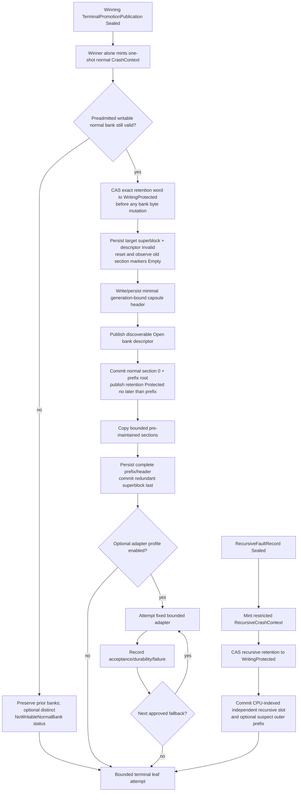

# Crash-safe architecture-fault sink

The mandatory `CrashSink` should be a small boot-provisioned reserved-memory
capsule that accepts the already sealed terminal record without allocation,
ordinary locks, scheduling, interrupt-driven completion, DMA, firmware, devices,
filesystems, or networks. Its required guarantee ends at a structurally checkable locally
committed prefix. Persistent NVRAM/ERST, polled storage, serial/debug output,
and a separately reserved capture environment are optional post-seal adapters,
each with its own deadline, persistence domain, trust assumptions, result, and
fallback.

A capture kernel is valuable for bulk evidence, but it is not the first-record
mechanism. If transition, memory, CPU, firmware, controller, or DMA state is
damaged, the small local capsule may be the only defensible evidence.

This is a proposed Atom architecture. It has not survived reset, power loss, or
fault injection on any target.

## Question, scope, and operational standard

The question is:

> After terminal evidence is sealed, what is the smallest custody protocol
> that preserves a structurally checkable record with explicit provenance,
> trust, completeness, and freshness claims, without depending on the failed
> subsystem or overstating durability, confidentiality, or integrity?

The service owns:

- a boot-reserved fixed capsule and distinct post-seal `CrashContext`/
  `RecursiveCrashContext` write protocols;
- ordered section admission, payload-first commit markers, and valid-prefix
  recovery;
- sink profiles for optional persistence and capture-environment adapters;
- custody state, per-adapter outcomes, reset-class survival, and next-boot
  recovery;
- field/section sensitivity and authorized forensic export hooks; and
- a finite transfer/fallback program ending in a bounded terminal leaf attempt.

It does not recapture architecture registers, classify recovery, claim CPU or
DMA quiescence, symbolicate, compress without a prevalidated fixed algorithm,
choose retention policy, upload over a normal network stack, or authorize
continued operation.

A sink passes only if:

1. normal `CrashContext` is constructible only after the terminal slot publishes
   `Sealed`; restricted `RecursiveCrashContext` requires a separately sealed
   recursive record and treats any outer `Writing` prefix as suspect;
2. normal section zero copies the sealed terminal state before enrichment,
   while recursive evidence uses a physically/logically separate one-shot slot;
3. every section has fixed capacity and publishes payload before a small commit
   marker; a reader accepts only a consecutive validated prefix;
4. the mandatory local commit calls no fallible external service;
5. each optional adapter states maximum bytes, polls/cycles, allowed contexts,
   mappings, persistence class, trust root, DMA/device assumptions, and
   fallback;
6. sink acceptance, media durability, reset survival, cryptographic integrity,
   confidentiality, authenticity, freshness, and custody receipt remain
   distinct results;
7. missing CPUs/pages, active or unknown DMA, source loss, truncation, and
   persistence uncertainty are recorded rather than hidden;
8. no crash-retained, incomplete, terminal, or out-of-domain evidence source is
   reclaimed on “send attempted”; its closed source protocol requires an
   authenticated durable receipt for the complete reclaimed content and a
   distinct current `CrashReclaim` decision. A same-boot ephemeral source may
   instead use its explicitly specified internal-rehome receipt plus protected
   component release authority, but only when it never entered crash retention
   and no asynchronous or external custody claim is used;
9. confidentiality failure never causes unauthorized plaintext export; and
10. every path reaches the configured terminal leaf within bounded software
    work even if all optional sinks fail; successful CPU exclusion or reset is
    a separate observed result, not guaranteed by reaching the leaf.

## Evidence and limits

| Evidence | Supported conclusion | Limit |
| --- | --- | --- |
| [Kdump](../../../30-sources/goyal-et-al-2005-kdump.md) | Preloading a capture kernel and metadata in reserved memory reduces dependence on the crashed kernel and separates collection from analysis | CPU/memory/device state and outstanding DMA can still defeat or contaminate capture |
| [Crash-dump evaluation](../../../30-sources/vazquez-cao-2006-evaluating-linux-crash-dumping.md) | Dump success, accuracy, and completeness must be tested under stack, interrupt, DMA, load, and device-state failures | Historical Linux/x86 evaluation |
| [Linux pstore/blk](../../../30-sources/linux-kernel-community-2026-pstore-crash-backends.md) and [ramoops](../../../30-sources/iordache-2021-ramoops.md) | Panic-time storage and reserved RAM use fixed preallocated buffers; block panic writes forbid allocation, sleeping, ordinary locks, and interrupt-driven completion | A returned write count proves adapter acceptance, not power-loss durability; neither source provides general authenticity or corrupt-hardware proof |
| [UEFI 2.11](../../../30-sources/uefi-forum-2024-uefi-2-11.md) | CPER and `HwErrRec####` provide a versioned cross-boot firmware record path | Capacity, latency, reentry, firmware correctness, and base-variable protection remain platform assumptions |
| [ACPI 6.6](../../../30-sources/uefi-forum-2025-acpi-6-6.md) | BERT retrieves prior-boot errors; ERST defines begin/execute/status/end persistence operations over NVRAM, firmware, service processor, or network-backed implementations | Busy polling and “success” do not give a universal time/trust bound |
| [Scrash](../../../30-sources/broadwell-et-al-2003-scrash.md) | Dumps can contain passwords and unrelated secrets; a distinct cleaning phase can overwrite selected sensitive regions before release | It does not demonstrate retention of an unmodified protected source, authorization-derived views, or complete leak prevention |
| [Memoir](../../../30-sources/parno-et-al-2011-memoir.md) | A cryptographically valid old state can be replayed; freshness/continuity needs an independent protected anchor and crash-safe protocol | Protected-module/TPM model is not a fatal-path sink |
| [NIST authenticated encryption guidance](../../../30-sources/dworkin-2007-gcm-gmac.md) | Confidentiality and integrity can cover payload plus metadata, while nonce uniqueness is a critical precondition and replay is a protocol concern | Does not supply keys, nonces, authorization, persistence, or target availability |

The sources support the independent first record and optional adapter model.
The capsule schema, evidence lattice, and custody protocol below are Atom
synthesis.

## Sink profile

```text
SinkProfile {
    profile_id,
    profile_hash,
    sink_kind: ReservedRam | RetainedRam | PersistentMemory |
               FirmwareVariable | AcpiErst | PolledDevice |
               ServiceProcessor | SerialDebug | CaptureEnvironment,
    permitted_contexts,
    fixed_destination,
    maximum_bytes,
    maximum_operations,
    maximum_polls_or_cycles,
    mapping_and_memory_attributes,
    write_atomicity,
    payload_ordering_recipe,
    commit_marker_recipe,
    cache_persistence_recipe,
    reset_survival: EntryOnly | WarmReset | PlatformReset | ColdReset |
                    PowerLoss | Unknown,
    cpu_memory_dma_device_assumptions,
    firmware_or_external_trust,
    crypto_profile: Option<CryptoProfile>,
    failure_fallback
}
```

Profiles are validated during boot while the system is healthy. A runtime sink
cannot discover a controller, allocate a buffer, parse a new ACPI method, ask
the network for a key, or switch to an unmeasured adapter after failure.

`reset_survival` is empirical/normative evidence for one reset class. Reserved
DRAM is never called power-loss persistent because it survived a warm watchdog
reset. Firmware or service-processor storage is not called independent without
enumerating shared power, memory, interconnect, and code dependencies.

## Mandatory reserved-memory capsule

The capsule reconciles component 9 with the higher [observability and crash
evidence](../../minimal-privileged-kernel-components/observability-and-crash-evidence.md)
contract:

```text
CrashCapsuleArena {
    normal_superblock[2] {
        superblock_generation,
        bank_index,
        state: Invalid | Writing | Committed,
        capsule_header_digest,
        checksum
    },
    normal_bank[2]: CrashCapsule,
    recursive_slot[MAX_CPUS]: RecursiveCrashCapsule,
    normal_retention[2]: Atomic<(
        Unused | WritingProtected | Protected | Retained | Reclaimable |
        Revoking | Clearing | Cleared,
        compact_retention_identity_descriptor_index,
        retention_generation
    )>,
    recursive_retention[MAX_CPUS]: Atomic<(
        Unused | WritingProtected | Protected | Retained | Reclaimable |
        Revoking | Clearing | Cleared,
        compact_retention_identity_descriptor_index,
        retention_generation
    )>,
    retention_identity_descriptor[fixed_per_bank_or_slot_count]:
        CrashRetentionIdentityDescriptor
}

CrashRetentionIdentityDescriptor {
    descriptor_index_and_generation,
    target: NormalBank | RecursiveSlot,
    exact_bank_or_recursive_record_identity,
    capsule_or_slot_boot_and_storage_generations,
    expected_header_layout_and_bounds_digest,
    next_dependency_and_borrow_epoch_identities,
    source_reclaim_registration_cell_identity_and_generation,
    canonical_descriptor_digest
}

CrashCapsule {
    attempt_descriptor {
        state: Invalid | Open,
        bank_index,
        capsule_generation,
        boot_generation,
        layout_hash,
        capsule_header_digest,
        fixed_section_count,
        section_layout_and_bounds_hash,
        descriptor_digest
    },
    magic,
    format_version,
    bank_index,
    capsule_generation,
    boot_generation,
    layout_hash,
    fixed_section_count,
    capsule_header_digest,
    section[fixed_section_count]: CrashCapsuleSectionPublication,
    prefix_root[fixed_section_count]: CrashCapsulePrefixRootPublication,
    terminal_summary,
    optional_footer
}

CrashCapsuleSectionPublication {
    bank_index,
    capsule_generation,
    boot_generation,
    attempt_descriptor_digest,
    section_type,
    sequence,
    state: Empty | Writing | Committed | Torn,
    producer_component,
    sensitivity_class,
    payload_length,
    truncation_and_loss_flags,
    canonical_header_and_payload_digest,
    section_publication_id: Hash(canonical_encoding({
        intended_terminal_state: Committed | Torn,
        bank_index,
        capsule_generation,
        boot_generation,
        sequence,
        canonical_header_and_payload_digest
    })),
    payload[fixed_capacity]
}

CrashCapsulePrefixRootPublication {
    state: Empty | Writing | Sealed,
    bank_index,
    capsule_generation,
    boot_generation,
    attempt_descriptor_digest,
    prefix_length,
    prefix_publication_id: Hash(canonical_encoding({
        intended_state: Sealed,
        bank_index,
        capsule_generation,
        boot_generation,
        attempt_descriptor_digest,
        ordered_section_publication_ids,
        canonical_prefix_digest
    })),
    ordered_section_publication_ids,
    canonical_prefix_digest
}

RecursiveCrashCapsule {
    state: Empty | Writing | Committed | Clearing,
    slot_generation,
    boot_crash_generation,
    cpu_identity_and_incarnation,
    source_recursive_record_publication_ref_and_id,
    recursive_capsule_publication_id: Hash(canonical_encoding({
        intended_state: Committed,
        slot_generation,
        boot_crash_generation,
        cpu_identity_and_incarnation,
        source_recursive_record_publication_ref_and_id,
        canonical_header_record_and_prefix_digest
    })),
    recursive_record_length,
    suspect_outer_prefix_length,
    sensitivity_and_loss_flags,
    canonical_header_record_and_prefix_digest,
    sealed_recursive_record,
    optional_suspect_outer_prefix
}
```

Section zero is owned by the lower architecture-fault component and contains
the sealed normal terminal promotion publication, including its
`promotion_publication_id`. Once section zero and its immutable length-one
`CrashCapsulePrefixRootPublication` are sealed, an authenticated
`CustodyReceiptPublication` with the
closed `TerminalPromotion` source variant may bind the exact promotion
publication/generation/body digest, logical raw/source digests, complete copied
manifest, and exact section-zero plus prefix-root destination publication IDs.
Each additional committed section may seal the next fixed prefix-root slot; no
prefix root is rewritten. A partial-current capsule with only section zero
therefore has an unambiguous destination publication even without a final
superblock. Before the source promotion slot
can be rearmed, the record graph is rematerialized with
`IndependentCustodyRoot` over that receipt; a copied section without this
receipt cannot release the source. The separately provisioned
CPU-indexed `recursive_slot[cpu_index]` contains that CPU incarnation's sealed
recursive-fault record plus, when safely
available, an explicitly suspect bounded prefix of an outer `Writing` record.
The source record ID and destination capsule ID are distinct. The capsule's
canonical digest binds the exact source recursive-record publication ID,
CPU/incarnation, boot/crash and recursive-slot generations, lengths, and
sensitivity/loss fields, while excluding the destination capsule ID and mutable
lifecycle word. `recursive_capsule_publication_id` then binds intended
`Committed`, the destination slot/boot/CPU generations, that source reference,
and the canonical digest; there is no digest/ID cycle.
it never reuses a normal bank, section, or interrupted writer. Later normal
sections are fixed bounded copies of already maintained
kernel evidence: boot/profile hashes, per-CPU event tails/loss, domain/call/
mapping/device state, and missing-participant sets. The higher component does
not recapture architecture state or invent a second fatal store.

For every section:

1. claim its fixed slot and publish `Writing`;
2. copy no more than capacity from an already admitted source;
3. record length, provenance, sensitivity, and truncation, then compute one
   canonical digest over those header fields and the payload;
4. apply the profile's memory-order operation;
5. publish the smallest supported `Committed` marker last, including the
   section publication ID; publish `Torn` only
   for a bounded non-trapping short-copy result that can safely return to this
   writer; then seal the fixed prefix-root slot for the resulting consecutive
   prefix after validating all named section publications. An architectural nested exception leaves `Writing`, and the
   recursive path records the interruption.

The reader validates the attempt descriptor, layout/generation, and each
canonical header-plus-payload digest, then accepts the longest consecutive
committed and bounds-valid prefix. The first `Empty`, `Writing`, `Torn`,
integrity-invalid, or wrong-generation section terminates the prefix. Metadata
damage—including type, producer, sensitivity, sequence, length, or loss—fails
closed rather than inheriting a less restrictive interpretation from corrupt
bytes. The reader recomputes each section publication ID using the observed
terminal marker as `intended_terminal_state`; prefix roots may name only
`Committed` sections, never `Torn`. A footer can summarize but never be required to recover preceding
sections.

Checksums expose some torn/accidental corruption; they are not MACs, signatures,
or proof that a compromised producer told the truth. The descriptor digest and
each section digest cover their canonical metadata and payload, but authenticity
requires the separately declared MAC/signature profile.

The descriptor digest is the canonical digest of every descriptor field with
`descriptor_digest` omitted and `state = Open`; the capsule-header digest
likewise omits its own field. Every section digest covers bank, capsule and boot
generations, the exact descriptor digest, type, sequence, publication state,
producer, sensitivity, declared length, loss flags, and payload with its own
digest field omitted. It is computed while the physical marker remains
`Writing` but over the intended terminal state (`Committed`, or `Torn` only for
the admitted nontrapping short-copy case); that terminal marker is then
published last. The recursive-slot digest uses the same intended-`Committed`
rule. A prefix root's `canonical_prefix_digest` covers intended `Sealed`, exact
bank/capsule/boot generations, attempt-descriptor digest, prefix length, and
the ordered section publication IDs. It omits its own digest and
`prefix_publication_id` and excludes the mutable physical marker; the outer
prefix ID then hashes that digest and the same immutable identity fields, so
verification is acyclic. A normal superblock checksum is computed with its checksum omitted and
its intended state `Committed`, then the physical `Committed` marker publishes
last. Thus a post-publication reader recomputes exactly the sealed digest, and a
valid section from an older bank generation cannot be relabeled by a new
descriptor.

### Reuse and crash-consistent generation change

Before enabling architecture-fault sources, boot admission must prove at least
one normal bank is authorized and physically ready for the next generation;
the other may remain committed for custody. Retention policy cannot consume
both banks indefinitely while still claiming the mandatory next-fault sink. It
must first obtain the required receipt and verified clear/rekey for one bank,
provision another generation bank, or refuse/fail closed the fault-source
profile. The crash path nevertheless rechecks the preadmitted bank state. If no
writable bank remains, it preserves every old complete/partial record, records
`NoWritableNormalBank` only in a distinct already-safe status cell when
possible, makes no new local-commit claim, and enters the terminal leaf without
overwrite.

A profile claiming reuse across its persistence domain uses the two arena
banks and redundant superblocks; it never overwrites the only committed bank in
place. While healthy or in a permitted crash context it:

1. selects the non-current bank and validates the immutable
   `CrashRetentionIdentityDescriptor` named by exact
   `(Unused, descriptor_index, r)`, including the intended bank/capsule/boot/
   header identity and already initialized next dependency/borrow epochs. It
   then performs the sole native retention-word CAS
   `(Unused, descriptor_index, r) →
   (WritingProtected, descriptor_index, r)` and revalidates the descriptor;
   `Cleared` is never writer-eligible, and no header, payload, section marker,
   active-attempt descriptor, or superblock byte may be mutated before this CAS
   succeeds;
2. publishes and
   persists/observes that superblock and the bank descriptor as `Invalid`, then
   resets and persists/observes every reused section marker to `Empty` (at
   minimum section zero) so no old committed marker can validate under the new
   attempt;
3. writes and persists/observes the minimal new capsule header—bank, boot and
   capsule generations, layout/count, and canonical header digest; that digest
   covers the parsing-critical static header fields with its own field and the
   attempt descriptor omitted;
4. writes a new-generation descriptor bound to that exact header digest,
   fixed section count, and section layout/bounds hash and atomically
   publishes/persists its digest-protected `Open` state, making the in-progress
   bank discoverable before any new section payload;
5. builds sections whose digests bind that descriptor and generation,
   publishing section zero first; immediately after the descriptor/header and
   section-zero prefix root validate, it CASes the exact retention word
   `WritingProtected → Protected` before that prefix is exposed as accepted,
   then publishes later per-section commit markers;
6. persists/observes the complete capsule header and section prefix according
   to the target recipe; and
7. publishes/persists the target normal superblock as `Writing`, writes and
   persists its immutable fields plus checksum computed for intended state
   `Committed`, and atomically publishes/persists/observes `Committed` last.

The `WritingProtected → Protected` CAS changes neither identity nor
generation and occurs no later than publication of the first accepted partial
prefix; the final superblock commit requires and preserves that exact
`Protected` word. Recursive commit uses the same preclaim and publishes
`Protected` no later than its first accepted complete record. A cut after the
preclaim leaves `WritingProtected`: readers may conservatively inspect a
validated partial or complete attempt, but no writer treats the target as
unused and no recovery rolls the word back. If recovery validates the unique
descriptor/header/section-zero prefix and the same intended identity, it may
finish the one idempotent `WritingProtected → Protected` CAS; otherwise the
bytes remain protected until an explicit custody/reclaim procedure can account
for them. Ambiguous or malformed bytes never become writable. The atomic word
contains only compact state, generation, and descriptor index; that entire
tuple must fit one target-supported native CAS. The cryptographic identity and
complete immutable facts live in the indexed descriptor, which is validated
before and after every CAS. Lock-based or multiword emulation is not conforming
on this crash path. These words—not the descriptive `SinkEvidence` field—are
the source-side retention authority. A bank or recursive slot is writable only
after its matching fully initialized `Unused` descriptor word for the exact
provisioned next identity has been won by the one `WritingProtected` preclaim;
`Cleared` is never writer-eligible. Readers recheck descriptor, content, and
retention generations.

The reader first classifies each redundant superblock by its independently
published state marker. It may skip `Invalid` or `Writing` successors, but it
reports the highest fully valid `Committed` superblock only when all
recognizable higher-generation committed markers also validate. A
higher-generation `Committed` marker with a bad checksum, malformed immutable
field, missing bank, or invalid referenced capsule is `SuperblockCorrupt` and
makes current custody/freshness indeterminate; an older complete capsule is
retained and labelled forensic-prior only, never silently promoted to latest
or used to authorize reuse. If the corrupt committed copy's generation cannot
itself be trusted, a separate trusted monotonic anchor must prove it older than
the selected valid head or recovery remains indeterminate. The reader also scans digest-valid
`Open` descriptors, accepting one only when its digest for intended `Open`
state binds the exact header digest, section count, and layout/bounds used to
parse every section. Equal-highest fully valid committed superblocks with
different bank/header/chain content are indeterminate rather than tie-broken.
A recognizable newer `Open` descriptor whose descriptor/header digest,
bounds, or generation fails validation is `AttemptDescriptorCorrupt`: that
bank remains nonwritable, the older complete capsule is labelled
forensic-prior, and recovery does not treat the attempted write as absent. A higher-generation bank with that binding and a valid
committed section zero is surfaced as a partial-current capsule, not discarded merely because
the final superblock was never published. The older complete bank and the
partial current prefix can both be retained; their freshness/order remains
qualified by the available anchor. The old bank is reusable only after the new
bank commits, an authenticated complete custody receipt covers every byte being
relinquished, a separate generation-current `CrashReclaim` decision authorizes
that exact bank, every local/export/adapter/DMA borrow is revoked and proven
drained, and the required erase/rekey verification reaches `Cleared`.
A retention-policy label alone never makes a bank reusable or permits its
descriptor to be invalidated. Boot admission therefore calls a bank writable
only when this conjunction completed before the crash or the bank is provably
unused in the current provisioned lifetime. If the platform cannot make
descriptor invalidation/publication and final-superblock publication atomic in
the claimed failure domain, that profile is single-use for the boot generation
and reports durability unconfirmed; it cannot rely on an old commit marker over
partially new payload. Capsule, superblock, descriptor, section,
recursive-slot, borrow, receipt, and reclaim generations use checked
nonwrapping arithmetic. Exhaustion retires the identity permanently until a
fresh protected, nonrepeating boot/sink incarnation provisions new storage; it
never wraps, aliases an old token, or relabels retained bytes. Exact atomic
widths, flushes, fences, and top-level
redundancy remain target-specific Atom synthesis to test, not properties of
ordinary reserved DRAM.

Each CPU's recursive slot is independent and single-use for the boot/crash
generation. `RecursiveCrashContext` is bound to one CPU incarnation and may
write only that indexed slot even when a normal bank, section zero, or
superblock is `Writing`; it never overwrites either normal bank or another
CPU's recursive slot. If that CPU's recursive slot is already occupied or its write faults, the path proceeds
directly to the terminal leaf and preserves whatever state was previously
published.

A recursive slot is not automatically reset to `Empty` at boot. A surviving
`Committed`, `WritingProtected`, `Writing`, `Revoking`, or `Clearing` slot remains unavailable until next-boot
ingestion records its exact state and the full source-rearm gate succeeds: a
separately authorized generation-current `CrashReclaim` joins a complete
authenticated custody receipt; the slot's `EvidenceGraphDependencySet` closes,
enumerates, and reaches `Drained` after every graph/binding is rehomed or
revoked; retention reaches `Reclaimable → Revoking`; and the exact reader/
adapter/DMA borrow epoch reaches `Drained`. Only then does retention publish
`Clearing`, perform and verify the fixed erase/rekey recipe, increment the
checked-nonwrapping `slot_generation`, initialize the next dependency and
borrow generations, and publish `Empty` last. A crash at any
rearm cut leaves the slot nonreusable; a new recursive failure must fail closed
to the terminal leaf or use a separately provisioned generation bank. It never
overwrites prior evidence merely to restore the promised opportunity.

## Separate evidence claims

```text
SinkEvidence {
    local_seal: Complete | ValidPrefix | RecursiveComplete |
                WritingIncomplete | Torn | Malformed | Missing,
    adapter_acceptance: Accepted | Rejected | TimedOut | NotAttempted,
    durability: ConfirmedTo(profile_domain) | Unconfirmed | Unsupported,
    reset_survival: Observed(reset_class) | NotObserved | Unknown,
    completeness: CompleteForDeclaredSections | Truncated | MissingSets,
    accidental_integrity: CheckPassed | CheckFailed | Unavailable,
    origin_authenticity: Verified(root_id) | Unverified,
    confidentiality: Encrypted(profile_id) | PhysicallyControlled | Unprotected,
    freshness: Verified(anchor_id) | BootCorrelated | Unverified,
    custody: LocalCommitted | Offered | Claimed | ReceiptDurable,
    local_slot_retention: WritingProtected | Protected | Retained |
                          Reclaimable | Revoking | Clearing | Cleared
}

CustodyReceiptBody {
    sealed_record_identity:
      NormalCapsule {
          boot_generation,
          bank_index,
          capsule_generation,
          capsule_header_digest,
          promotion_publication_ref_and_id
      }
    | RecursiveCapsule {
          boot_crash_generation,
          cpu_identity_and_incarnation,
          slot_generation,
          source_recursive_record_publication_ref_and_id,
          recursive_capsule_publication_id,
          canonical_header_record_and_prefix_digest
      }
    | RecursiveFaultSourceSealed {
          boot_crash_generation,
          cpu_identity_and_incarnation,
          source_slot_generation,
          recursive_source_publication_ref_and_id,
          exact_source_body_bounds_schema_and_digest,
          destination_recursive_capsule_publication_ref_and_id
      }
    | RequirementEvidence {
          requirement_publication_ref_and_id,
          requirement_held_acceptance_witness_digest,
          requirement_slot_and_generation,
          exact_requirement_body_digest
      }
    | OperationalQueueGraph {
          incoming_queue_receipt_publication_ref_and_id,
          queue_root_publication_ref_and_id,
          raw_block_set_publication_ref_and_id,
          source_result_and_acknowledgement_set_publication_ref_and_id,
          queue_owner_and_generation,
          exact_queue_root_body_digest
      }
    | OperationalLossTransfer {
          loss_transfer_publication_ref_and_id,
          loss_transfer_slot_and_generation,
          original_operational_transfer_descriptor_ref_generation_and_digest,
          exact_immutable_semantic_body_and_canonical_digest,
          sticky_loss_summary_generation_descriptor_owner_and_digest,
          dependency_and_borrow_generations,
          destination_independent_custody_publication_ref_and_id
      }
    | EscalationEventGroup {
          escalation_event_id_slot_and_generation,
          committed_terminal_or_quiescence_head_generation_sequence_and_digest,
          exact_event_binding_hold_transition_evidence_head_append_borrow_extent_manifest,
          complete_group_content_digest,
          destination_independent_custody_publication_ref_and_id
      }
    | TerminalPromotion {
          promotion_publication_ref_and_id,
          promotion_owner_and_generation,
          exact_promotion_body_digest,
          logical_raw_and_source_set_digests
      }
    | FaultRecordPublicationGraph {
          graph_publication_ref_and_id,
          graph_storage_owner_and_generation,
          decision_core_derived_closure_and_record_publication_manifest,
          evidence_custody_root,
          source_dependency_set_and_entry_identity_and_generation,
          canonical_graph_digest
      }
    | IncompleteCrashAttempt {
          source_attempt:
              CrashStorageAttempt {
                  attempt_kind: NormalBank | RecursiveCapsuleSlot,
                  retention_identity_descriptor_and_generation
              }
            | TerminalPromotionWriting {
                  recovery_case:
                    InitialCleanup {
                        promotion_slot_generation_descriptor_owner_and_capture,
                        observed_lifecycle_state: Writing
                    }
                  | CleanupResume {
                        original_promotion_generation_descriptor_owner_and_capture,
                        observed_lifecycle_state:
                            Reclaimable | Clearing | FreeNextGeneration,
                        original_receipt_reclaim_and_cleanup_frontier
                    }
              }
            | RecursiveFaultSourceAttempt {
                  cpu_identity_and_incarnation,
                  recursive_source_slot_and_generation,
                  recovery_case:
                    InitialPairReclaim {
                        fatal_preclassification_proof_ref_id_generation_and_state:
                            Writing | Available | Claimed | Consumed,
                        observed_source_lifecycle_state: Empty | Writing
                    }
                  | PairCleanupResume {
                        original_proof_source_generations_and_descriptor_tag,
                        observed_pair_state:
                            SourceReclaimCommittedProofPending
                          | BothReclaimable
                          | SourceClearingProofReclaimable
                          | BothClearing
                          | ProofHeldSourceClearing
                          | ProofHeldSourceRearmed
                          | PairRearmed,
                        original_receipt_reclaim_and_cleanup_frontier
                    }
              }
            | ParkHandoffAbortGroup {
                  recovery_case:
                    InitialCleanup {
                        handoff_ref_generation_abort_owner_and_observed_state: Aborted,
                        source_hold_ref_generation_descriptor_owner_complete_state_frontier_and_bitmap,
                        destination_observation:
                            NeverClaimedReservedEmpty | ClaimedReleased,
                        preallocated_cleanup_barrier_observed_descriptor_free_empty,
                        accepted_requirement_graph_witness_and_obligation_rehome_binding,
                        exact_member_pool_reservation_bits
                    }
                  | CleanupResume {
                        original_handoff_source_destination_barrier_generations_and_descriptor,
                        cleanup_phase:
                          MembersAdmissionBlocked {
                              barrier_state_frontier_and_completion_bitmap:
                                  Claimed | MembersReleasing |
                                  MembersClearing | MembersRearmed,
                              source_destination_handoff_old_or_next_states,
                              exact_member_pool_reservation_word_and_bits_installed
                          }
                        | MembersAdmissionReleased {
                              barrier_state_and_frontier:
                                  Released | Clearing | EmptyNextGeneration,
                              exact_member_pool_reservation_word_observed_released,
                              old_member_slots_no_longer_read_or_constrained
                          },
                        accepted_obligation_rehome_receipt_and_reclaim_refs,
                        exact_old_and_next_member_and_barrier_generations
                    }
              }
            | RequirementEvidenceAttempt {
                  recovery_case:
                    InitialCleanup {
                        requirement_slot_generation_descriptor_owner_and_observed_state:
                            Writing | Sealed | Abandoned,
                        source_staging_ref_generation_and_outcome_gate_state,
                        no_held_tuple_witness_or_dependency_acceptance_proof
                    }
                  | CleanupResume {
                        original_slot_generation_descriptor_owner_and_capture,
                        observed_state:
                            Reclaimable | Clearing | FreeNextGeneration,
                        original_receipt_reclaim_and_cleanup_frontier
                    }
              }
            | EscalationIncompleteAdmissionGroup {
                  recovery_case:
                    InitialCleanup {
                        event_slot_generation_admission_descriptor_owner_and_observed_state:
                            Writing | Sealed,
                        binding_hold_and_append_authority_states_and_frontiers,
                        absence_of_committed_genesis_head_and_event_borrows
                    }
                  | CleanupResume {
                        original_event_generation_descriptor_owner_and_event_id,
                        event_state: Clearing | EmptyNextGeneration,
                        append_hold_and_group_member_cleanup_frontier,
                        original_receipt_reclaim_and_old_next_generations
                    }
              }
            | RawStagingAttempt {
                  cpu_identity_and_incarnation,
                  capture_and_staging_slot_generation,
                  observed_lifecycle_state:
                      WritingRaw | AttemptsOpen | RawSetSealed |
                      CopyingOperational | HeldForContainment |
                      ContainmentCommitting | ContainmentAccepted |
                      HeldForTerminal,
                  source_attempt_acknowledgement_and_copy_frontier_manifest,
                  accepted_graph_requirement_terminal_and_recursive_binding_manifest
              }
            | OperationalTransferAttempt {
                  transfer_kind: StagingToRing | RingToQueue | StagingToLoss,
                  transfer_descriptor_ref_generation_digest_and_protected_owner,
                  transfer_control_ref_generation_and_observed_state:
                      CommitmentWriting | SourceCommitted | SourceClosing |
                      SourceExportExclusive | DestinationWriting |
                      DestinationSealed | ReceiptWriting | ReceiptSealed |
                      GraphsRehoming | Committed | Cancelling,
                  source_commitment_evidence:
                      Validated(identity_generations_and_digest)
                    | WritingIncomplete(observed_frontier_and_authoritative_source_identity)
                    | AbsentByCommittedUntouchedCancellation(cancel_decision_and_source_identity),
                  descriptor_named_source_destination_receipt_graph_loss_and_control_extent_manifest,
                  observed_member_lifecycle_generation_descriptor_owner_and_frontier_manifest,
                  source_destination_dependency_borrow_and_holder_bit_manifest,
                  accepted_destination_receipt_and_graph_bitmap
              }
            | OperationalLossSummaryUpdating {
                  recovery_case:
                    InitialCleanup {
                        loss_summary_slot_generation_update_descriptor_and_owner,
                        observed_lifecycle_state: Updating,
                        complete_prior_stable_summary_and_new_delta_plan,
                        no_pending_publication_or_accepted_loss_transfer_for_this_generation
                    }
                  | CleanupResume {
                        original_loss_generation_descriptor_owner_and_observed_state:
                            Reclaimable | Clearing | EmptyNextGeneration,
                        original_complete_extent_receipt_reclaim_and_cleanup_frontier
                    }
              }
            | EntrySnapshotAttempt {
                  snapshot_slot_generation_and_compact_owner_tag,
                  capture_and_observed_lifecycle_state: Writing | Sealed,
                  dependency_registration_and_borrow_state_manifest
              }
            | DecoderRunPlanWriting {
                  plan_slot_and_generation,
                  compact_plan_owner_and_admission_descriptor,
                  intended_run_generation_and_observed_run_word
              }
            | DecoderInputWriting {
                  input_slot_generation_owner_and_build_descriptor,
                  observed_build_frontier_and_registered_source_holder_bitmap,
                  source_graph_evidence_and_dependency_manifest
              }
            | PersistentBindingHoldPlanWriting {
                  hold_slot_and_generation,
                  compact_owner_and_prevalidated_plan_descriptor,
                  event_binding_and_graph_holder_frontier_manifest
              }
            | ClassifierSidecarWriting {
                  sidecar_kind:
                      LocalResumeToken | ParkedSchedulerResumeRecord |
                      ParkedContinuationReleaseProof,
                  sidecar_slot_generation_owner_and_build_descriptor,
                  source_destination_custody_and_authority_state_manifest
              }
            | ReturnArmTerminalGroup {
                  return_arm_slot_generation_descriptor_and_owner,
                  recovery_case:
                    UnreturnedTerminal {
                        arm_observation:
                            PlannedButUnclaimed {
                                arm_slot_generation_observed_descriptor_free_empty,
                                return_commit_cut_build_descriptor,
                                hold_observed_complete
                            }
                          | ClaimedArm {
                                observed_state: Writing | Armed
                            },
                        old_return_context_and_finalizer_fence_evidence,
                        no_accepted_return_completion_proof,
                        completion_proof_slot_observed_descriptor_free_empty,
                        return_leaf_frame_and_exit_control_nonexecutable_proof
                    }
                  | SuccessfulFinalizerCut {
                        observed_state: Armed | Finalizing | Consumed | Clearing,
                        completion_proof_evidence:
                            WritingObservation {
                                proof_slot_generation_observation_tag_owner_and_frontier
                            }
                          | PublishedProof {
                                proof_ref_id_generation_and_digest,
                                observed_state: Sealed | Claimed | Consumed
                            },
                        proved_reached_target_context_and_cookie_generation,
                        exact_hold_release_frontier_and_cleared_bit_manifest
                    }
                  | FinalizerCleanupMarkerCut {
                        state_view_evidence:
                          StableReturnFinalizerCompletingMarker(generation_and_digest)
                        | ValidatedSuccessorNonreference(generation_and_digest),
                        original_arm_proof_hold_target_and_gate_descriptor_binding,
                        observed_arm_state:
                            Consumed | Clearing | EmptyNextGeneration,
                        observed_completion_proof_state:
                            Consumed | Clearing | EmptyNextGeneration,
                        observed_hold_state:
                            Released | Clearing | EmptyNextGeneration,
                        observed_reuse_gate_state:
                            ArmReserved | FinalizerCompleting | PairRearmed |
                            StateViewFolded | Clearing,
                        exact_cleanup_frontier_and_old_next_generations
                    }
                  | CleanupResume {
                        cleanup_variant:
                          UnreturnedCleanup {
                              observed_arm_state:
                                  Reclaimable | Clearing | EmptyNextGeneration,
                              proof_observed_descriptor_free_empty_at_original_generation
                          }
                        | SuccessfulReturnCleanup {
                              pair_observation:
                                  ArmReclaimableProofConsumed
                                | ArmConsumedProofEmptyNextGeneration
                                | ArmClearingProofConsumed
                                | BothClearing
                                | ArmClearingProofEmptyNextGeneration
                                | PairEmptyNextGeneration
                          },
                        observed_hold_state:
                            Released | Clearing | EmptyNextGeneration,
                        original_receipt_reclaim_and_cleanup_frontier
                    },
                  continuation_hold_ref_generation_state_frontier_and_bitmap,
                  completion_proof_slot_generation_descriptor_owner_and_extent,
                  return_arm_reuse_gate_ref_generation_descriptor_owner_state_frontier_and_complete_extent,
                  accepted_graph_evidence_token_and_return_cookie_manifest
              },
          source_attempt_identity_and_generation,
          fixed_storage_extent_identity_bounds_and_layout_hash,
          descriptor_header_section_and_marker_state_manifest,
          complete_byte_for_byte_extent_digest_manifest,
          missing_extent_set: Empty,
          source_attempt_integrity_and_disposition:
              WritingIncomplete | Malformed | Torn | ExplicitlyAbandoned |
              SealedNeverAccepted | SealedAcceptedAndRehomed
      },
    exact_accepted_content_manifest_and_digest,
    missing_or_rejected_section_set,
    destination_identity_and_generation,
    destination_content_publication_ref_and_id,
    custodian_identity_and_generation,
    durability_domain_and_observation_evidence,
    freshness_anchor_and_generation,
    receipt_sequence
}

CustodyReceiptPublication {
    lifecycle_word: Atomic<(
        Empty | Writing | Sealed | Rehoming | Reclaimable | Clearing,
        receipt_slot_and_generation,
        compact_metadata_build_descriptor_index_and_generation_or_none,
        compact_builder_owner_tag_or_none
    )>,
    receipt_id: Hash(canonical_encoding({intended_state: Sealed,
                                        receipt_slot_and_generation,
                                        metadata_build_descriptor_digest,
                                        compact_builder_owner_tag,
                                        canonical_body_digest,
                                        signer_identity_and_generation,
                                        authority_binding})),
    canonical_body_digest,
    metadata_build_descriptor_digest,
    signer_identity_and_generation,
    authority_binding: ProtectedCustodianHandle |
                       AuthenticatedDestinationEnvelope,
    body: CustodyReceiptBody,
    borrow_word: Atomic<(
        Open | Revoking | Drained,
        receipt_borrow_generation,
        live_graph_reclaim_and_reader_count:
            BoundedBorrowCount<MAX_RECEIPT_BORROWS>,
        registered_reclaim_holder_bitmap:
            BoundedBitmap<MAX_RECLAIMS_PER_RECEIPT>
    )>
}

CrashReclaimPublication {
    lifecycle_word: Atomic<(
        Empty | Writing | Available | Claimed | Consumed | Clearing,
        reclaim_slot_and_generation,
        compact_metadata_build_descriptor_index_and_generation_or_none,
        compact_builder_owner_tag_or_none,
        build_or_cleanup_frontier:
            None | ReceiptBorrowPending | ReceiptBorrowHeld |
            SourceRegistrationPending | SourceRegistered | BodyComplete |
            ReceiptReleasePending | ReceiptReleased
    )>,
    reclaim_publication_id: Hash(canonical_encoding({
        intended_state: Available,
        reclaim_slot_and_generation,
        metadata_build_descriptor_digest,
        compact_builder_owner_tag,
        exact_source_record_identity_and_generation,
        custody_receipt_publication_ref_and_id,
        source_reclaim_registry_manifest_ref_id_and_assignment_entry,
        source_reclaim_registration_cell_ref_and_generation,
        receipt_borrow_generation_preallocated_token_id_and_holder_bit,
        exact_destination_content_manifest_and_publication_id,
        retention_policy_and_issuer_generation,
        authority_binding,
        canonical_body_digest
    })),
    exact_source_record_identity_and_generation:
      NormalBank(bank_index, capsule_generation, boot_generation)
    | RecursiveSlot(cpu_identity_and_incarnation, slot_generation,
                    boot_crash_generation)
    | RecursiveFaultSource(cpu_identity_and_incarnation,
                           recursive_source_slot_generation,
                           recursive_publication_ref_and_id)
    | TerminalPromotion(promotion_publication_ref_and_id,
                        terminal_generation)
    | OperationalLossTransfer(loss_transfer_publication_ref_and_id,
                              loss_transfer_slot_and_generation)
    | EscalationEventGroup(escalation_event_id,
                           escalation_slot_generation,
                           complete_group_extent_manifest_digest)
    | FaultRecordPublicationGraph(graph_publication_ref_and_id,
                                  graph_slot_and_generation,
                                  complete_graph_manifest_digest)
    | RequirementEvidence(requirement_publication_ref_and_id,
                          requirement_slot_and_generation,
                          exact_requirement_body_digest)
    | OperationalQueueGraph(queue_root_publication_ref_and_id,
                            queue_owner_and_generation,
                            complete_queue_root_children_receipt_manifest_digest)
    | IncompleteCrashAttempt(source_attempt_identity_and_generation,
                             complete_extent_manifest_digest),
    custody_receipt_publication_ref_and_id,
    source_reclaim_registry_manifest_ref_id_and_assignment_entry,
    source_reclaim_registration_cell_ref_and_generation,
    receipt_borrow_generation_preallocated_token_id_and_holder_bit,
    exact_destination_content_manifest_and_publication_id,
    retention_policy_and_issuer_generation,
    authority_binding: ProtectedCrashReclaimAuthority |
                       AuthenticatedRetentionAuthorityEnvelope,
    metadata_build_descriptor_digest,
    canonical_body_digest
}

SourceReclaimRegistrationCell {
    registration_word: Atomic<(
        Empty | Publishing | Registered | Claimed | Consumed | Clearing,
        registration_cell_generation,
        exact_source_identity_descriptor_tag_or_none,
        reclaim_slot_generation_and_build_descriptor_tag_or_none
    )>,
    immutable_cell_identity_and_source_generation_assignment,
    source_reclaim_registry_manifest_ref_and_id,
    registered_reclaim_publication_ref_and_id_or_none
}

SourceReclaimRegistryManifestPublication {
    manifest_id: Hash(canonical_encoding({
        intended_state: Sealed,
        machine_evidence_profile_and_boot_crash_generation,
        fixed_source_pool_identity_and_bounds,
        complete_source_generation_to_registration_cell_schedule,
        injectivity_and_current_next_disjointness_certificate,
        canonical_body_digest
    })),
    state: Sealed,
    machine_evidence_profile_and_boot_crash_generation,
    fixed_source_pool_identity_and_bounds,
    complete_source_generation_to_registration_cell_schedule,
    injectivity_and_current_next_disjointness_certificate,
    canonical_body_digest
}

SinkMetadataBuildDescriptor =
    CustodyReceiptBuild {
        descriptor_index_and_generation,
        receipt_slot_and_generation,
        exact_source_identity_extent_and_generation,
        exact_destination_content_publication_identity_and_digest,
        custodian_signer_authority_and_generation,
        durability_freshness_and_receipt_sequence_plan,
        protected_builder_identity_and_generation,
        canonical_descriptor_digest
    }
  | CrashReclaimBuild {
        descriptor_index_and_generation,
        reclaim_slot_and_generation,
        exact_source_identity_extent_and_generation,
        source_reclaim_registry_manifest_ref_id_and_assignment_entry,
        source_reclaim_registration_cell_identity_and_generation,
        custody_receipt_publication_ref_id_and_generation,
        receipt_borrow_generation_preallocated_token_id_and_holder_bit,
        destination_manifest_retention_policy_and_issuer_generation,
        protected_reclaim_builder_identity_and_generation,
        canonical_descriptor_digest
    }

SinkMetadataWritingCleanupPredicate {
    publication_kind: CustodyReceipt | CrashReclaim,
    slot_generation_owner_and_build_descriptor,
    exact_builder_fence_evidence,
    observed_lifecycle_state: Writing,
    no_sealed_or_available_publication_for_this_generation,
    reference_cleanup:
      ReceiptBuildNoReferences {
          zero_borrow_or_reference_registration
      }
    | ReclaimBuildCleanup {
          observed_build_frontier,
          exact_preallocated_receipt_holder_bit_observed_absent_or_installed,
          exact_source_registration_cell_observed_empty_publishing_or_registered,
          descriptor_bound_idempotent_registration_and_holder_release_plan
      },
    proof_no_source_reclaim_cas_can_have_used_this_publication,
    protected_metadata_cleanup_authority_and_generation
}

EvidenceBorrowEpoch {
    record_identity,
    borrow_word: Atomic<(
        Open | Revoking | Drained,
        borrow_generation,
        live_borrow_count: BoundedBorrowCount<MAX_EVIDENCE_BORROWS>
    )>,
    borrower_set_audit_digest
}

EvidenceBorrowToken {
    record_identity,
    borrow_generation,
    borrower_identity_and_generation,
    access_class: LocalReader | ForensicExporter | Adapter | DmaOrIo,
    token_id_and_kernel_authority
}
```

All `BoundedBorrowCount<MAX_*>` fields use the parent component's checked
nonwrapping contract. Admission proves a finite issuer bound, rejects acquire
at `MAX` before exposing bytes or authority, and requires one exact-generation
token per decrement; underflow, double release, saturation ambiguity, or wrap
holds the evidence and can never authorize `Drained` or reuse.

Receipt and reclaim metadata cannot depend on another receipt for their own
partial publication. Before either body is touched, its trusted builder
validates the matching immutable `SinkMetadataBuildDescriptor`; the native-
atomic `Empty → Writing` CAS installs that descriptor index/generation and
compact owner tag in the lifecycle word. A receipt builder then follows the
simple descriptor-bound path to `Sealed`. A reclaim builder has two additional
predeclared acquisitions. It first publishes frontier `ReceiptBorrowPending`
and atomically installs its unique descriptor-assigned holder bit in the
receipt's authoritative bitmap while incrementing the matching count, then
publishes `ReceiptBorrowHeld`. It next publishes
`SourceRegistrationPending` and claims the exact source-generation's unique
`SourceReclaimRegistrationCell` from descriptor-free `Empty` to `Publishing`,
installing source, reclaim-slot, generation, and build-descriptor tags in that
same word. It constructs and validates the body, installs the resulting reclaim
publication identity in that cell, publishes cell `Registered`, records
`SourceRegistered|BodyComplete`, and only then release-publishes reclaim
`Available`. The publication ID does not hash the mutable cell state, so this
ordering is acyclic.

One authenticated `SourceReclaimRegistryManifestPublication` is sealed during
healthy boot before any component-9 source pool becomes writer-eligible. Its
complete bounded table maps the canonical tuple `(source object kind, pool
identity, slot index, source generation)` to exactly one registration cell and
proves injectivity across every simultaneously live or retained generation.
The source tuple's existing immutable identity/build-descriptor field is
domain-separated with this manifest ID and assignment entry; this rule applies
uniformly to raw staging, operational transfer, entry-snapshot, decoder,
sticky operational-loss summary, compact operational-loss transfer,
requirement, terminal-promotion, recursive source/proof, return-arm, park,
crash bank/slot, and escalation descriptors even where their pseudotypes
abbreviate it as `source identity`. A reclaim descriptor must reproduce and validate that
lookup rather than choose a cell. Rearm prepares the manifest's distinct next-
generation cell before exposing the next source; exhaustion retires the source
or requires a fresh nonrepeating manifest/boot identity, never modulo reuse.
Thus two builders for one target race the same native-atomic
`Empty → Publishing` CAS; at most one can ever reach `Available`. Claim moves
reclaim `Available → Claimed`, then the matching cell `Registered → Claimed`,
before the owning source's reclaim CAS. A cut between those steps is resolved
from the cell's unique reclaim tags. Once the source CAS wins, recovery finishes
that same cell and reclaim to `Consumed`; another claimed token cannot be
mistaken for the winner.

The completed body must reproduce the descriptor and its digest before
`Sealed` or `Available` publishes. A cut in `Writing` therefore has a closed
nonrecursive path: recovery validates only the atomic descriptor and frontier,
fences its builder, inspects the one assigned receipt bit and registration cell,
and proves that no sealed/available identity or source reclaim CAS exists.
It either deterministically finishes those exact acquisitions/publication or,
under `SinkMetadataWritingCleanupPredicate`, clears an installed registration,
releases exactly that receipt bit once, and only then CASes exact `Writing →
Clearing`. It clears and verifies the entire fixed metadata extent, advances
checked generations, and publishes descriptor-free `Empty` last. It may not
redirect the partial slot. Any ambiguity retires the metadata slot.

The complete receipt and reclaim lifecycle tuples—including state,
nonwrapping generation, descriptor tag, owner tag, and reclaim frontier—and
each receipt borrow/holder-bitmap tuple and registration-cell tuple
must fit a target-supported native atomic operation. Fixed independent shards
are used where necessary; locks or emulated multiword compare/exchange are not
publication linearization.

These dimensions cannot be collapsed into `saved = true`:

- an adapter can accept bytes that never reach a failure-protected domain;
- a record can survive reset but be unauthenticated;
- a MAC-valid record can be stale;
- an encrypted record can be incomplete;
- a complete dump can contain untrusted firmware claims; and
- a durable remote copy does not itself authorize deletion or disclosure.

## Optional adapters

### Retained or persistent RAM

Use a fixed region excluded from normal allocation and every feasible DMA
requester. State its mapping/atomic behavior and warm/platform/cold-reset
retention. Optional ECC improves detection/correction of some damaged bytes but
does not authenticate them. If cache cleaning is required for the retention
domain, the exact target operation and its failure behavior belong in the
profile.

### UEFI hardware-error variables and ACPI ERST/BERT

Convert or wrap the bounded record as CPER only after local seal. Preserve the
original raw block and Atom schema rather than losing fields to the firmware
format. Firmware/ERST execution is optional and strictly budgeted; busy, full,
unavailable, failed, reentered, or timed-out results leave the local capsule
authoritative. On next boot, BERT/ERST/`HwErrRec` data enters as a separate
producer/custodian record and is checked for previous-session, simulated,
identity, and length fields, then assessed for independent freshness evidence.
Absent a protected anchor or external witness, freshness remains `Unverified`;
CPER, BERT, ERST, and variable identity do not create cryptographic freshness.

### Polled storage or debug port

All buffers, mappings, controller state, and maximum byte/poll counts are
prepared in advance. The adapter allocates nothing, sleeps never, takes no
ordinary lock, and avoids DMA unless an independent crash-safe DMA contract
exists. Controller reset can itself destroy evidence or affect other devices;
it is a profile operation, not a generic fallback. Serial output is bounded and
never a prerequisite for local commit.

### Independent capture environment

Preload code, page tables, guarded stacks, descriptors, keys, destination
configuration, CPU transition data, and a minimal device plan. The handoff
record states which CPUs entered/stopped, which pages were readable, whether
IOMMU/DMA state was known, which controllers reset, and which privilege mode
was available. If DMA cannot be excluded from capture code/evidence, label the
bulk image contaminated/incomplete and retain the small CPU-written record.

The capture environment may run a richer decoder, compression, encryption,
and exporter, but remains vulnerable to common CPU, memory, firmware,
interconnect, device, and power failures.

## Confidentiality, integrity, and freshness

Use three representations:

- protected capture capsule: maximum diagnostic evidence, never automatically
  readable by ordinary services;
- operational event: redacted type, scope class, profile/rule hash, loss, and
  custody/progress; and
- forensic export: separately authorized selected raw sections or memory,
  encrypted/authenticated where the profile supports safe key use.

Any encryption material needed in crash context is provisioned before failure.
Nonce allocation binds boot generation, capsule generation, sink identity, and
sequence and must remain unique across concurrent CPUs and rollback. Header
fields such as format/profile, the exact capsule/section identity tuple,
generation, length, sensitivity,
and destination are authenticated metadata.

Encryption happens after the mandatory seal. Missing key, nonce continuity,
crypto implementation integrity, or budget means “retain locally and do not
export plaintext,” not “skip confidentiality to improve availability.”

Freshness requires a protected monotonic/history anchor or external
corroboration. Without one, a record is at most `BootCorrelated` or
`Unverified`; a valid tag does not upgrade it. Record keys and retained memory
are cleared/rekeyed before physical pages or devices are reassigned.

## Custody and reclamation

```mermaid
stateDiagram-v2
  state Custody {
    [*] --> LocalCommitted
    LocalCommitted --> Offered: retained/failure-domain-qualified offer metadata
    Offered --> Claimed: current custodian lease/epoch
    Claimed --> ReceiptDurable: destination commits bytes + digest
    Claimed --> Offered: claim expires / custodian fails
  }
  state LocalSlotRetention {
    [*] --> Unused: boot initializes controls + immutable identity descriptor
    Unused --> WritingProtected: native compact-index CAS before first byte mutation
    WritingProtected --> Protected: validated content commit
    WritingProtected --> Reclaimable: complete fixed-extent receipt + current CrashReclaim
    Protected --> Retained: policy keeps local copy
    Retained --> Reclaimable: matching complete receipt + current CrashReclaim decision
    Reclaimable --> Revoking: close graph/reader/adapter/DMA admission
    Revoking --> Clearing: every dependency rehomed/revoked + exact borrows drained
    Clearing --> Cleared: erase/rekey verification
    Cleared --> Unused: initialize next epochs/descriptor; publish Unused last
  }
  ReceiptDurable --> Retained
  ReceiptDurable --> Reclaimable: matching complete receipt + current CrashReclaim decision
```



Wakeups and transport acknowledgements are not custody. `ReceiptDurable`
requires a `CustodyReceiptPublication` privately built under `Writing` and
accepted only after canonical body digest, `Sealed` state, current trusted
destination/custodian generations, protected handle or authenticated signer,
freshness anchor, and named durability evidence validate. The body binds the
exact normal-capsule, recursive-slot, requirement-evidence, operational-
queue-graph, terminal-promotion, complete fault-record-publication-graph, or
incomplete-crash-attempt
identity tuple shown above, the
accepted-content manifest/digest,
the exact sealed destination-content publication, destination, custodian,
durability claim, receipt sequence, and every missing
set. A
partial destination receipt can permit retransmission or policy retention but
not destruction of unacknowledged sections.

`RecursiveCapsule` describes the independently retained destination capsule;
it does not, by itself, name or release the component-9 source slot. Reclaiming
that distinct source requires the closed `RecursiveFaultSourceSealed` arm,
whose source publication identity/body digest and destination recursive-
capsule publication are both exact, plus a separate
`CrashReclaim(RecursiveFaultSource)`. A receipt for one destination capsule
therefore cannot be replayed against another per-CPU source generation.

`WritingProtected` is never silently rolled back. If a unique valid first
prefix exists, recovery may complete the exact idempotent transition to
`Protected`. Otherwise reuse requires the closed `IncompleteCrashAttempt`
receipt variant: it copies the **entire fixed physical bank or recursive-slot
extent byte for byte**, including every descriptor/header/section marker,
untouched-looking region, and malformed or indeterminate byte, under its exact
retention identity/generation and layout bounds. Its missing set must be empty,
and the destination publication/manifest must own that whole copy. A matching
current `CrashReclaim` can then target only that extent manifest. A partial
prefix or list of apparently touched offsets never authorizes reuse; without
the full-extent receipt the storage is permanently retired.

The same closed receipt family can preserve an incomplete, explicitly
abandoned, or sealed-and-independently-rehomed protected source owned by another
service, but does not invent that source's reclaim transition.
`TerminalPromotionWriting`, `RecursiveFaultSourceAttempt`,
`ParkHandoffAbortGroup`, `RequirementEvidenceAttempt`,
`EscalationIncompleteAdmissionGroup`, `RawStagingAttempt`,
`OperationalTransferAttempt`, `OperationalLossSummaryUpdating`,
`EntrySnapshotAttempt`,
`DecoderRunPlanWriting`, `DecoderInputWriting`, and
`PersistentBindingHoldPlanWriting`, `ClassifierSidecarWriting`, and
`ReturnArmTerminalGroup` each bind the source report's exact
lifecycle/generation, control frontiers, associated authority objects, and
complete provisioned extent. Their owning protocol must separately prove its
writer/consumer fenced, no accepted head/graph/context was created where
prohibited, all authoritative holder bits drained or rehomed, and then consume
a matching `CrashReclaim` before its own verified clear/rekey.
If either the complete-copy receipt or that source-specific proof is missing,
the source group stays retired.

A sealed compact `OperationalLossTransfer` is not an incomplete transfer
attempt and is not interchangeable with the mutable sticky summary. Its
dedicated receipt variant authenticates the complete immutable semantic body,
canonical digest, exact slot/generation, original transfer descriptor, and an
independent destination publication. Its dedicated `CrashReclaim` target uses
the boot-sealed registry assignment for that exact compact source generation.
Only their conjunction, plus complete dependency rehome and borrow drain, may
authorize the source protocol's `Sealed → Reclaimable`; reference revocation
without a surviving complete custody root never suffices.

Receipt storage is itself a bounded custody object. Every dependent graph,
reclaim token, or reader acquires its exact receipt/borrow generations and
rechecks after increment. A receipt may enter `Rehoming` only after a complete
authenticated destination copy/witness has sealed and all dependent bindings
move to it; it then closes admission, drains exact `Revoking → Drained`, enters
`Reclaimable → Clearing`, clears/rekeys and verifies body/authority/control
metadata, initializes checked-nonwrapping next receipt/borrow generations, and
publishes `Empty` last. A live `IndependentCustodyRoot` or `CrashReclaim`
reference prevents this transition. Exhaustion retires the receipt slot until a
fresh protected sink identity domain.

For `TerminalPromotion`, completeness covers the whole promotion body and its
logical raw/source evidence manifest, and the destination publication is the
sealed capsule section/root that owns those copied bytes. The promotion
source's exact-generation borrow/revoke/drain and clear/rekey protocol is still
required after the replacement independent-custody graph publishes; receipt
creation alone never rearms it.

Within this sink-managed crash-retention protocol, `Reclaimable` requires the
conjunction of that authenticated durable receipt
covering every section/byte to be reclaimed and a separately authorized,
generation-current `CrashReclaimPublication`. Its self-excluding ID and body
bind one closed source target/generation, the exact receipt, destination
publication/content manifest, retention policy/issuer generation, and protected
or authenticated reclaim authority. Neither alone suffices.
An intentional discard without another copy would require a separate explicit
`AuthorizedDiscard` authority/audit protocol; this baseline does not infer it
from ordinary retention policy.

This rule does not silently redefine every service-local `Reclaimable` token.
Entry snapshots, operational queue graphs, requirement records, and derived
fault-record graphs may have a closed same-boot internal-rehome transition in
their owning report; that transition must bind a complete replacement, drain
all source dependencies and borrows, use a protected same-boot release
authority, and never cite transport success or external durability. If reset,
crash retention, or an out-of-domain handoff intervenes, the exception ends and
the applicable complete receipt plus registered `CrashReclaim` arm is required.

Before source rearm, the holder also closes the source evidence root's bounded
`EvidenceGraphDependencySet` from `Open` to `Closing`, waits for every
reservation to settle, and enumerates every entry. Each `Live` graph and each
headed operational/escalation binding rooted in this capsule or persistent
destination must be rematerialized under sealed replacement evidence and
marked `Rehomed`, or be authoritatively revoked where the contract permits;
each `Reserved` entry must be completed or conservatively held. The source
cannot advance while one graph, child binding, or graph borrow can still
dereference its bytes. A single copied core, record projection, or receipt is
not proof that this complete dependency set moved.

The rearm holder validates the whole tuple and claims it with exact
`(Available, r, descriptor, owner, BodyComplete) → (Claimed, r, descriptor,
owner, BodyComplete)` before attempting the matching source's
atomic retention-word CAS from exact `(Protected|Retained, source_identity,
retention_generation)` to `(Reclaimable, same identity/generation)`. In the
physical word, `source_identity` means its compact immutable descriptor index;
the gate validates that descriptor's complete identity/digest before and after
the CAS. It also requires the unique source registration cell to name this
reclaim slot/generation/build descriptor and to have completed its exact
`Registered → Claimed` transition. That cell, not a scan of claimed reclaim
objects, is the authoritative winner identity across reset. The only additional
crash-storage source form is exact `(WritingProtected,
incomplete_descriptor_index, generation) → (Reclaimable, same
descriptor/generation)`, and it is enabled only
by the complete fixed-extent `IncompleteCrashAttempt` receipt and its matching
reclaim target above. This CAS
is the sole source-side reclaim linearization; two reclaim tokens cannot both
win because only the cell's unique registered reclaim may attempt it. A claimed token is never valid
for another target and cannot return to `Available`; recovery may only resume
or conservatively hold that exact target. Non-storage incomplete sources use
the equally exact reclaim CAS defined by their owning service, never this
retention word. Once the source transition commits, recovery advances the same
registration cell `Claimed → Consumed` and the reclaim publication from exact
`(Claimed, r, descriptor, owner, BodyComplete)` to `(Consumed, r, descriptor,
owner, BodyComplete)`; either inter-CAS cut is completed only toward that uniquely
registered winner. This conjunction authorizes revocation, not immediate erasure. Every local
reader, forensic exporter, sink adapter, mapping, and DMA/I/O path must first
hold a kernel-issued `EvidenceBorrowToken` for the exact record identity and
borrow generation; consumers may instead retain a separately sealed validated
copy, never a pointer into the bank. To acquire, a consumer validates the
record identity/generation, compare/exchanges exact `(Open, g, n)` to
`(Open, g, n+1)` only when `n < MAX_EVIDENCE_BORROWS`; saturation returns no
mapping, token, or DMA authority. It then rechecks both the record state and borrow word; a changed
state/generation forces a decrement without dereference. Release decrements the
exact same generation in either `Open` or `Revoking`.

Rearm first changes the exact source retention word from `Reclaimable` to
`Revoking` and compare/exchanges borrow `(Open, g, n)` to `(Revoking, g, n)`,
which closes local-reader admission before observing drain, then revokes
mappings and adapter/DMA access. It also requires the graph dependency set to
have reached exact `Drained` after the complete enumeration above.
After extant holders release or are provably fenced, only a successful CAS from
exact `(Revoking, g, 0)` to `(Drained, g, 0)`, followed by the source-retention
CAS `Revoking → Clearing`, permits any erase; no separately read count or
audit digest is a linearization point. Failure or ambiguity retains the bank in
`Revoking` and forbids writes. The erase/rekey recipe then
verifies the bytes and invalidates the old epoch. The consumed reclaim
publication and its referenced receipt remain immutable and generation-held
through target clearing **and through the target's final writer-eligible
next-generation publication**. Merely preparing the next controls is not
sufficient: every owning cleanup-resume predicate may still need the old
receipt/reclaim pair after a cut immediately before that final publication.
The retention word advances through verified `Cleared` to the new
`Unused`/identity generation only as part of that ordering; a cut leaves it
nonwritable.
While the bank/slot remains
unreadable, it clears and verifies the holder audit, derives the next borrow
generation bound to the next capsule or recursive-slot identity, and
compare/exchanges exact `(Drained, g, 0)` to `(Open, g + 1, 0)`. It refuses
wrap. Only after this control word, a fresh empty dependency set, and the
immutable next `CrashRetentionIdentityDescriptor` all validate does retention
release-publish `(Unused, next_descriptor_index,
next_retention_generation)` **last**. Descriptor/record bytes are not
writer-eligible before that publication. Every reader rechecks both
identities/generations after acquiring a borrow. Thus a reader that validated old `Committed` state cannot
race erasure or observe a later occupant through an old token.

Only after the owning target protocol has published that final
`Free|Empty|Unused(next generation)` state—or, for an aborted park group, the
descriptor-free next-generation `ParkAbortGroupCleanupBarrier` `Empty` after
all member reservation bits were atomically released—may the holder CAS the complete
descriptor/owner-tagged reclaim lifecycle tuple
`(Consumed, reclaim_generation, metadata_descriptor, builder_owner,
BodyComplete) → (Clearing, reclaim_generation, metadata_descriptor,
builder_owner, ReceiptReleasePending)`. While that tagged tuple remains
`Clearing`, it advances the exact registration cell
`Consumed → Clearing → Empty(next registration generation)`, atomically clears
its one descriptor-assigned bit from the receipt bitmap while decrementing the
matching count, and publishes reclaim frontier `ReceiptReleased`. Only then
does it clear/rekey and verify the reclaim body. A cut in reclaim `Clearing`
resumes these idempotent descriptor/frontier-selected steps; it never replays
target revocation, pair arbitration, or another holder's release. After
verified clear and a checked nonwrapping reclaim-generation advance, the holder
publishes `(Empty, next_reclaim_generation, None, None, None)` last. The receipt
remains sealed and generation-held until that publication removes the last reclaim reference; it
may then follow its independent borrow/dependency/rehome-and-clear protocol.
For a source owned by another service, that service's final next-generation
publication is the same release gate. Therefore raw-staging transfer
cancellation, requirement, promotion, recursive source/proof, return-arm,
decoder, park, and escalation cleanup can always recover a pre-final cut from
the still accepted old receipt/reclaim pair, while a post-reclaim-clear cut has
an already reusable target and requires no source cleanup authority.

Default delivery is at least once. Deduplication uses stable identity and
digest. A sink claims exactly-once custody only if byte commit and receipt/
consumed state are one atomic operation in the same durability domain; external
uploads generally do not satisfy this.

`Offered` never upgrades the local record's persistence claim. Its metadata
states `EntryOnly`, retained-RAM/reset-qualified, or durable in an explicitly
named failure domain; only the last may be described as durable. `Reclaimable`
and `Cleared` refer to the evidence slot, not to a quarantined resource or an
unresolved containment obligation.

## Terminal sink program



The program contains no retry-until-success loop. A profile may try each
adapter once or a fixed number of times. Failure metadata is committed locally
only while the capsule still has an available fixed section; inability to
record an optional failure never recurses into ordinary fault handling.
An adapter that performs MMIO, firmware, or device access is admitted only when
the platform profile supplies a defensible response bound; a fixed poll count
cannot bound an access that never returns.

## Failure analysis

| Failure | Required response |
| --- | --- |
| Section copy returns a bounded short/error result | Publish `Torn`; retain earlier committed prefix and lower terminal record |
| Section copy raises a nested architecture exception | Leave section `Writing`; seal the independent recursive record and enter `RecursiveCrashContext` without blessing the prefix |
| Reserved memory not retained | Next boot reports missing; never describe profile as reset-persistent without evidence |
| Optional sink full/busy | Record bounded failure when possible; try configured fallback; never spin indefinitely |
| No writable normal bank | Preserve all prior complete/partial banks, make no new local-commit claim, optionally mark a distinct safe status cell, and enter terminal leaf without overwrite |
| Firmware reentry/failure | Abandon adapter at budget; retain local capsule and enter the terminal leaf |
| Controller or DMA state unknown | Do not use unsafe adapter or claim bulk integrity |
| Capture environment cannot enter | Preserve local record and execute final platform terminal leaf |
| Encryption initialization/nonce unavailable | No plaintext forensic export; keep physically protected local record |
| MAC/checksum invalid on read | Preserve bytes as suspect evidence; do not parse as complete or erase automatically |
| Stale valid record replayed | Reject when anchor exists; otherwise mark freshness unverified and correlate conservatively |
| Custodian crashes after commit before ack | Redeliver by stable ID; destination deduplicates or returns prior receipt |
| Erase interrupted | Page/device remains in protected retention state until clear/rekey verification |

## Verification and falsification

### Crash-consistency model

Interrupt execution before and after descriptor invalidation, `Open`
publication, old-section-marker invalidation, minimal-header publication,
every payload/header-digest write, section-zero and later commit
markers, final superblock publication, recursive-slot write, adapter call,
persistence operation, claim, receipt, and erase. The recovered reader must
surface a validated partial-current section-zero prefix when the final
superblock is absent, never accept uncommitted bytes, and never reclaim without
a matching durable receipt and policy action.

For every CPU-indexed recursive slot, also interrupt next-boot ingestion and
each `Committed/Writing/Clearing → Empty` rearm step. No cut may expose old
bytes as a fresh generation, lose unreceipted evidence, or permit reuse before
verified clear/rekey.

For every normal bank and recursive slot, inject around the exact retention
word transitions `Unused → WritingProtected → Protected → Retained →
Reclaimable → Revoking → Clearing → Cleared`, the next descriptor
initialization, and publication of next-generation `Unused`. A
`WritingProtected` cut must either finish the same identity's protection or
remain nonwritable; `Cleared` must never be accepted as writer eligibility.
Exercise `IncompleteCrashAttempt` custody over the complete fixed storage
extent, including unwritten and malformed bytes, and reject any receipt whose
extent manifest or missing set is incomplete. Finally corrupt a recognizable
higher-generation `Committed` superblock or `Open` descriptor while retaining
a valid older capsule: recovery must report indeterminate/current corruption,
retain the older evidence as forensic-prior, and never roll authority back to
the older generation.

Exercise every non-storage source arm as well: terminal-promotion writing,
recursive proof/source pairs, aborted park groups, never-held requirements,
unheaded escalation admission, raw staging, entry snapshots, decoder plans,
and persistent binding holds. Cross-substitute source kinds, lifecycle states,
owner/generation descriptors, frontier manifests, destination publications,
and `CrashReclaim` targets. A destination-only `RecursiveCapsule` receipt must
never reclaim `RecursiveFaultSource`; a sealed accepted raw/snapshot source
must prove complete dependency rehome, and a partial extent must retire its
source regardless of how plausible the copied prefix looks.

### Reset and power matrix

Test warm reset, watchdog, platform reset, CPU reset, firmware reset, cold boot,
and power loss separately. Vary cache state, memory-controller failure, IOMMU/
DMA activity, storage/controller state, privilege mode, and capture-environment
entry. A result from one reset class does not generalize to another.

### Adversarial security tests

Plant canary credentials, cryptographic keys, capability-like identifiers,
addresses, BEAM terms, and user messages in memory. Verify that ordinary events
and unauthorized exports contain none. Mutate, truncate, reorder, replay, and
cross-boot substitute records; reuse nonces; rotate keys; fail the crypto
service; and attempt export, clear, or custody receipt without the exact
capability.

### Metrics

Measure first-section commit rate and worst cycles/stack/bytes; valid-prefix
length; adapter acceptance and durability by failure/reset class; capture-
environment entry and page/CPU completeness; DMA-contamination flags; torn,
check-fail, auth-fail, and replay-detected rates; time to durable custody;
duplicate deliveries/effects; and unauthorized disclosure/reclamation rate.

## Staged implementation

1. Implement and model the fixed reserved-memory capsule and next-boot prefix
   reader without encryption or optional adapters.
2. Connect the existing lower terminal record and higher pre-maintained
   evidence sections; prove ownership and no recapture.
3. Test recursion, stack corruption, all write cut points, and multiple reset
   classes on the first target.
4. Add one retained/persistent RAM or polled sink profile with exact ordering
   and deadline.
5. Add authorized encrypted forensic export outside the fatal path, including
   freshness labels and custody receipts.
6. Add a capture environment only after DMA, CPU, privilege, and device
   assumptions can be measured and reported.

## Alternatives rejected

- **Use only a capture kernel.** Transition or shared hardware failure can
  prevent entry; the first local capsule remains necessary.
- **Write directly to filesystem/network.** Allocator, locks, scheduler,
  driver, DMA, and remote dependencies are unacceptable before local seal.
- **One trailing capsule checksum.** A late torn write can make every earlier
  valid section appear lost; per-section commit preserves a prefix.
- **Call every available sink until one succeeds.** Unbounded or unprofiled
  firmware/device work can prevent terminal progress.
- **Encrypt synchronously before local commit.** Key/nonce/crypto failure could
  erase the only evidence; mandatory sealing precedes optional protection and
  export.
- **Erase after transport acknowledgement.** Ack may not mean durable complete
  custody and can be lost after a committed destination write.

## Unresolved questions

- What reset/power retention and cache-flush contract can the first target
  actually demonstrate for reserved RAM?
- Can the IOMMU and requester lifecycle exclude all DMA from the capsule and
  capture environment after a catastrophic fault?
- Is UEFI/ERST callable within a defensible cycle budget and reentry profile on
  the selected firmware, or should it be next-boot only?
- What protected key/nonce/freshness anchor, if any, remains safely usable after
  terminal kernel failure?
- Which fields maximize diagnostic utility under a strict no-user-payload
  operational export policy?

## Connections

- [Architecture faults and diagnostics](../architecture-faults-and-diagnostics.md)
- [Containment classifier and promotion](containment-classifier-and-promotion.md)
- [Escalation channel](escalation-channel.md)
- [Double-fault guard](double-fault-guard.md)
- [Observability and crash evidence](../../minimal-privileged-kernel-components/observability-and-crash-evidence.md)
- [Protected I/O and DMA ownership](../protected-io-and-dma-ownership.md)
