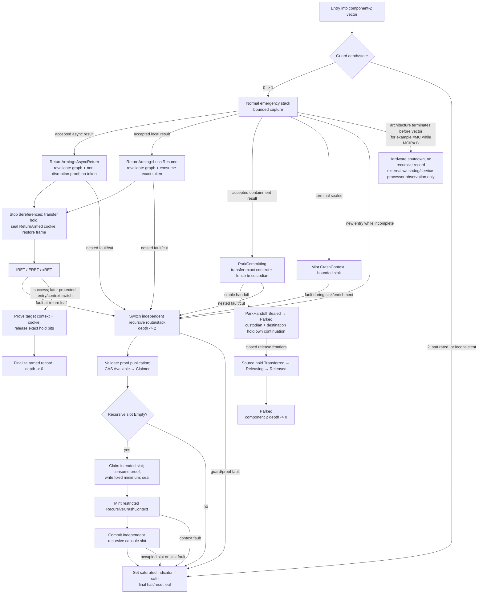

# Architecture double-fault and recursive-capture guard

The double-fault guard should be the smallest independently provisioned path in
the kernel: distinct architecture entry route where available, distinct
prevalidated stack, distinct code/data mapping, one fixed recursive terminal
slot, and a fixed final halt/reset leaf. Depth one uses normal bounded capture;
depth two records only the outer capture identity, new cause/frame minimum,
recursion phase, and integrity/loss flags, then becomes terminal; depth three
or an already occupied recursive slot performs no formatting or general
capture and invokes the platform terminal leaf.

“Double fault” is a portable semantic name for failure while the protected
entry/capture transaction is incomplete. It is not one uniform ISA exception.
x86, Arm, and RISC-V route and preserve different state, so the guard is a
common finite state machine realized by explicit feature profiles.

This is proposed Atom architecture. It has not been proved at instruction
boundaries or exercised on hardware.

## Question, scope, and operational standard

The question is:

> When the mechanism intended to preserve fault evidence faults again, what
> minimum independent path can retain one useful relationship and guarantee a
> finite transition to a terminal leaf—while reporting whether exclusion/reset
> actually succeeded—without trusting the failed path?

The guard owns:

- validation of component 2's published recursion depth, route, and capture
  phase for the component-9 transaction;
- a one-shot `FatalPreclassificationProofPublication` for exact pinned recursive vectors/
  phases, never for a caller's severity guess;
- the separate recursive terminal slot and minimum record schema;
- the transition from `FatalCaptureContext` to post-seal
  `RecursiveCrashContext`; and
- the architecture/profile-specific final halt, platform critical-error, or
  reset leaf.

Component 2 owns vector configuration, raw frame layout, physical stack
selection/switch, and the authoritative entry-nesting state. Component 1 owns
the assembly leaves. The guard validates/consumes their tokens and owns only the
component-9 recursive record/disposition. The crash sink may copy the recursive
record after it is sealed but cannot invoke rich enrichment recursively.

A guard passes only if:

1. recursion is detected before re-entering the normal staging, decoder,
   classifier, logger, or sink-enrichment path;
2. depth two cannot use the interrupted normal stack, staging slot, terminal
   payload, or ordinary per-CPU scratch state;
3. its direct-terminal proof binds vector/entry class, CPU incarnation, raw-
   frame revision, profile generation, outer capture, phase, and depth;
4. only one writer can own the recursive payload and it is never reused during
   the boot/crash generation;
5. depth two executes a fixed straight-line/bounded program with no remote
   wait, allocation, lock, retry loop, firmware parser, or symbolizer;
6. depth three, recursive-slot collision, or guard-internal failure performs no
   further general write and reaches the terminal leaf;
7. the design never promises return from an architectural abort or corrupt
   entry state;
8. ISA-specific saved-state loss and platform-reset uncertainty are explicit;
9. final shutdown/reset does not overwrite the first-fatal record when the
   platform can avoid it; and
10. every instruction boundary is covered by a model or injection test, with
    untestable hardware windows recorded as assumptions.

## Evidence and limits

| Evidence | Supported conclusion | Limit |
| --- | --- | --- |
| [Intel system-programming documentation](../../../30-sources/intel-2026-system-programming-documentation.md) | x86-64 IST can select known stacks; `#DF` is an abort and saved state may be undefined; specified contributory/page-fault combinations while invoking `#DF`, and a new machine check while `MCG_STATUS.MCIP=1`, enter processor shutdown | Not every fault after a handler starts has that behavior; platform response to shutdown is not universally an automatic reset |
| [RISC-V privileged architecture](../../../30-sources/risc-v-international-2026-privileged-architecture.md) | Early nested traps can overwrite `xepc`/cause; optional Smdbltrp, Ssdbltrp, and Smrnmi route double traps or enter critical-error state with limited saved evidence | Extensions are optional and final platform signal/reset behavior is external |
| [Arm A-profile documentation](../../../30-sources/arm-2026-a-profile-system-architecture-documentation.md) | Vector selection, exception-level routing, stack state, SError synchronization, and optional double-fault behavior require an exact Arm feature profile | No x86-like universal per-vector IST assumption can be imported |
| [Linux entry/exit handling](../../../30-sources/linux-kernel-community-2026-entry-exit-handling.md) | NMI-like machine-check/double-fault entry is nonordinary, may nest, and needs non-instrumentable early/late phases | Linux implementation discipline is not proof of Atom's path |
| [Linux crash-dump evaluation](../../../30-sources/vazquez-cao-2006-evaluating-linux-crash-dumping.md) | Stack overflow, corrupt stack-derived CPU identity, recursive faults, NMI delivery, and damaged dump handoff defeat naive crash paths | Historical x86/Linux evidence |
| [Ramoops](../../../30-sources/iordache-2021-ramoops.md) and [Linux pstore/blk](../../../30-sources/linux-kernel-community-2026-pstore-crash-backends.md) | Fixed reserved records and preinitialized mappings support minimal post-fault preservation | Reserved RAM can still be corrupt, incorrectly mapped, overwritten, or lost on reset; adapter success is not durability |
| [FATE and DESTINI](../../../30-sources/gunawi-et-al-2011-fate-destini.md) | Compound failures and explicit intermediate/terminal specifications reveal recovery bugs missed by a single injected crash | Distributed service evaluation, not instruction-level nested traps |

The evidence establishes that the guard must be minimal, independent, and
profile-specific. No reviewed work proves survivability when the guard's own
CPU, cache, memory, interconnect, or reset controller is the failed component.

## Semantic state and token contract

```text
FaultEntryStateView {  // owned and published by component 2
    publication_word: Atomic<(Updating | Stable, state_view_generation)>,
    canonical_state_view_digest,
    boot_crash_generation,
    cpu_identity_and_incarnation,
    profile_generation,
    depth: 0 | 1 | 2 | Saturated,
    outer_capture: Option<FaultCaptureIncarnation>,
    outer_phase: Idle | Entering | EntrySnapshotWriting |
                 EntrySnapshotReclaiming | WritingRaw |
                 AttemptsOpen | RawSetSealedClassifying |
                 LocalResumeTokenWriting | CopyingOperational |
                 OperationalTransferControlling |
                 OperationalLossTransferring | RecordGraphMaterializing |
                 GraphDependencyRegistering | RecordGraphRehoming |
                 PreacceptHoldInstalling |
                 RequirementWriting | RequirementSealedAwaitingHeld |
                 RequirementHeldMaterializing | EscalationPublishing |
                 TerminalPromoting | CrashSinking | StagingClearing |
                 ReturnArming | ReturnArmed | ReturnFinalizerCompleting |
                 ParkCommitting | Parked,
    outer_object_locator: Option<PhaseObjectLocator>,
    normal_stack_guard,
    recursive_stack_guard,
    recursive_slot_state,
    final_leaf_id
}

PhaseObjectLocator =
    SingleObject {
        object_kind: EntrySnapshot | RawStaging | OperationalRing |
                     OperationalEvidenceTransferControl |
                     OperationalLossSummary | OperationalLossTransfer |
                     LocalResumeToken | FaultRecordPublicationGraph |
                     RequirementEvidence | ProtectedEscalationBinding |
                     EscalationEvent | EscalationTransitionEvidence |
                     EscalationCustodyTransition | EscalationLedgerHead |
                     EscalationAppendAuthority | TerminalPromotion |
                     CrashCapsule | ContinuationCustodyHold |
                     ReturnArmedRecord | ReturnCompletionProof | ParkHandoff,
        object_slot_or_ref,
        object_generation,
        observed_publication_state
    }
  | EntrySnapshotCleanupCut {
        snapshot_slot_and_original_generation,
        snapshot_lifecycle_descriptor_owner_and_observed_state:
            Reclaimable | Clearing | EmptyNextGeneration,
        borrow_word_old_or_next_generation_state_and_holder_count,
        dependency_set_old_or_next_generation_state_reservation_and_accepted_bitmaps,
        complete_rehome_or_incomplete-writing_receipt_and_reclaim_refs,
        cleanup_descriptor_and_published_frontier,
        exact_next_snapshot_borrow_dependency_and_slot_generations
    }
  | OperationalTransferCut {
        transfer_control_slot_generation_descriptor_owner_state_and_frontier,
        source_root_identity_generation_state_and_borrow_or_hold,
        current_destination_receipt_graph_or_loss_member_identity_generation_state,
        destination_accepted_bitmap_and_dependency_state,
        exact_forward_or_cancel_variant_and_cleanup_frontier
    }
  | GraphDependencyCut {
        dependency_set_identity_generation_state_reservation_and_accepted_bitmaps,
        dependency_entry_index_generation_owner_graph_and_state,
        graph_slot_generation_and_observed_state_or_none,
        evidence_root_identity_generation_and_state,
        closed_graph_product_kind,
        preaccept_hold_ref_id_generation_and_state_or_not_required,
        hold_operation_frontier_and_acquired_token_bitmap,
        graph_evidence_and_requirement_source_holder_bit_observations
    }
  | ReturnCommitCut {
        contract: ReturnCommitContract,
        exact_graph_and_live_dependency_binding,
        continuation_hold_ref_id_generation_state_and_token_bitmap,
        token_state_and_generation:
            None
          | LocalResumeToken {
                token_ref_id_owner_generation_and_body_digest,
                observed_state: Available | Consumed | Revoked
            },
        return_frame_ref_generation_and_restore_frontier,
        architecture_exit_control_ref_generation_and_substate,
        return_armed_record_ref_generation_cookie_and_state,
        return_completion_proof_ref_generation_descriptor_owner_and_state_or_none:
            None | Writing | Sealed | Claimed | Consumed | Clearing |
            EmptyNextGeneration,
        return_arm_reuse_gate_ref_generation_descriptor_owner_state_and_frontier,
        observed_execution_location: ReturnLeaf | ProvenReturnedContext
    }
  | ParkCommitCut {
        exact_containment_graph_and_requirement_binding,
        parked_context_ref_and_generation,
        park_handoff_publication_ref_id_generation_and_state,
        source_continuation_hold_ref_generation_and_token_bitmap,
        replacement_continuation_hold_ref_generation_and_token_bitmap,
        fence_custodian_and_hold_transfer_frontier
    }

FatalPreclassificationProofPublication {
    lifecycle_word: Atomic<(
        Empty | Writing | Available | Claimed | Consumed | Reclaimable |
        Clearing | RearmedHeld,
        proof_slot_generation,
        compact_proof_build_descriptor_index_and_generation_or_none
    )>,
    publication_id: Hash(canonical_encoding({
        intended_state: Available,
        proof_slot_generation,
        compact_proof_build_descriptor_index_and_generation,
        prevalidated_build_descriptor_digest,
        intended_recursive_slot_identity_and_generation,
        canonical_body_digest,
        protected_component_2_authority_id_and_generation
    })),
    intended_recursive_slot_identity_and_generation,
    prevalidated_build_descriptor_digest,
    canonical_body_digest,
    protected_component_2_authority_id_and_generation,
    body: FatalPreclassificationProofBody
}

FatalPreclassificationProofBuildDescriptor {
    descriptor_index_and_generation,
    cpu_identity_and_incarnation,
    profile_and_route_generation,
    proof_slot_and_generation,
    intended_recursive_slot_identity_and_generation,
    protected_component_2_builder_authority_and_generation,
    canonical_descriptor_digest
}

FatalPreclassificationProofBody {
    cpu_identity_and_incarnation,
    profile_generation,
    entry_class,
    raw_frame_layout_revision,
    outer_capture,
    outer_phase,
    outer_object_locator,
    state_view_generation_and_digest,
    observed_depth: 2,
    route_rule_id,
    one_shot_generation,
    intended_recursive_slot_identity_and_generation
}

ReturnCommitContract =
    AsyncReturnCommit {
        continuation_custody_hold_id_and_token_generations,
        exact_decision_publication_ref_id_and_digest,
        exact_graph_publication_ref_id_generation_and_digest,
        live_dependency_set_entry_identity_and_generation,
        asynchronous_non_disruption_and_return_frame_proof_digest
    }
  | LocalResumeCommit {
        continuation_custody_hold_id_and_token_generations,
        exact_decision_publication_ref_id_and_digest,
        exact_graph_publication_ref_id_generation_and_digest,
        live_dependency_set_entry_identity_and_generation,
        local_resume_token_ref_id_owner_generation_and_body_digest
    }

ReturnArmedRecord {
    lifecycle_word: Atomic<(
        Empty | Writing | Armed | Finalizing | Consumed | Reclaimable |
        Clearing,
        return_arm_slot_generation,
        compact_return_arm_build_descriptor_index_and_generation_or_none,
        compact_return_arm_owner_tag_or_none,
        compact_return_completion_proof_tag_or_none
    )>,
    publication_id: Hash(canonical_encoding({
        intended_state: Armed,
        return_arm_slot_generation,
        return_arm_build_descriptor_digest,
        compact_return_arm_owner_tag,
        cpu_identity_and_incarnation,
        outer_capture,
        return_commit_contract_digest,
        continuation_hold_ref_id_generation_and_token_bitmap,
        return_leaf_code_range_and_exact_return_instruction_pc,
        expected_target_privilege_context_and_frame_digest,
        return_cookie_and_context_generation,
        architecture_exit_control_terminal_substate,
        canonical_body_digest
    })),
    cpu_identity_and_incarnation,
    outer_capture,
    return_arm_build_descriptor_digest,
    return_commit_contract_and_digest,
    continuation_hold_ref_id_generation_and_token_bitmap,
    return_leaf_code_range_and_exact_return_instruction_pc,
    expected_target_privilege_context_and_frame_digest,
    return_cookie_and_context_generation,
    architecture_exit_control_terminal_substate,
    canonical_body_digest
}

ReturnArmBuildDescriptor {
    descriptor_index_and_generation,
    return_arm_slot_and_generation,
    cpu_identity_and_incarnation,
    outer_capture,
    exact_return_commit_contract_and_continuation_hold_plan,
    accepted_graph_evidence_requirement_and_optional_token_manifest,
    return_frame_exit_control_cookie_and_expected_target_plan,
    preallocated_return_completion_proof_slot_generation_acyclic_seed_and_schema,
    preallocated_return_arm_reuse_gate_cell_generation_and_descriptor,
    protected_component_2_builder_identity_and_generation,
    canonical_descriptor_digest
}

ReturnArmReuseGateDescriptor {
    descriptor_index_and_generation,
    gate_cell_identity_and_generation,
    return_arm_slot_and_generation,
    return_completion_proof_slot_and_generation,
    return_arm_build_descriptor_digest,
    arming_state_view_generation,
    exact_successor_state_view_nonreference_condition,
    protected_component_2_owner_identity_and_generation,
    canonical_descriptor_digest
}

ReturnArmReuseGate {
    gate_word: Atomic<(
        Free | ArmReserved | FinalizerCompleting | PairRearmed |
        StateViewFolded | Clearing,
        gate_generation,
        compact_gate_descriptor_index_and_generation_or_none,
        compact_gate_owner_tag_or_none,
        cleanup_frontier:
            None | ProofClearAuthorized | ProofRearmed |
            ArmClearAuthorized | ArmRearmed |
            StateViewFoldObserved | GateClearAuthorized
    )>
}

ReturnCompletionProofPublication {
    lifecycle_word: Atomic<(
        Empty | Writing | Sealed | Claimed | Consumed | Clearing,
        completion_proof_slot_and_generation,
        compact_completion_observation_tag_or_none,
        compact_finalizer_owner_tag_or_none
    )>,
    publication_id: Hash(canonical_encoding({
        intended_state: Sealed,
        completion_proof_slot_and_generation,
        completion_observation_tag_and_digest,
        compact_finalizer_owner_tag,
        return_armed_publication_ref_and_id,
        canonical_body_digest
    })),
    completion_observation_tag_and_digest,
    body: ReturnCompletionProof,
    canonical_body_digest
}

ReturnCompletionObservationTag {
    observation_tag_index_and_generation,
    completion_proof_slot_and_generation,
    return_armed_slot_generation_build_descriptor_and_publication_id,
    matched_expected_target_context_frame_cookie_and_generation,
    protected_finalizer_identity_and_generation,
    canonical_observation_digest
}

ReturnCompletionProof {
    return_armed_publication_ref_and_id,
    next_entry_or_context_switch_frame_digest,
    observed_source_privilege_and_context_generation,
    matched_return_cookie,
    proof_that_execution_reached_expected_target_not_return_leaf,
    protected_finalizer_authority_and_generation,
    canonical_completion_digest
}

`canonical_completion_digest` is the self-excluding digest of the immutable
inner completion proof. The publication's separate `canonical_body_digest`
binds that complete inner body, while `publication_id` binds the sealed wrapper
and its accepted observation and owner tags; none of the three hashes includes
itself or points cyclically to a value that does.

ReturnArmRecoveryPredicate =
    UnreturnedTerminalGroup {
        return_arm_observation:
            PlannedButUnclaimed {
                arm_slot_and_generation_observed_descriptor_free_empty,
                prevalidated_arm_build_descriptor_from_return_commit_cut,
                continuation_hold_observed_complete
            }
          | ClaimedArm {
                arm_slot_generation_descriptor_owner_and_observed_state:
                    Writing | Armed
            },
        exact_old_cpu_context_return_leaf_and_finalizer_fence_evidence,
        no_accepted_return_completion_proof,
        preallocated_completion_proof_slot_observed_descriptor_free_empty,
        exact_return_frame_exit_control_and_cookie_generation_retired,
        accepted_graph_evidence_requirement_token_and_hold_manifest,
        return_arm_reuse_gate_ref_generation_descriptor_owner_state_and_frontier,
        complete_terminal_custody_rehome_receipts_for_every_accepted_source_and_continuation_obligation,
        complete_return_arm_terminal_group_receipt_ref_and_id,
        matching_current_crash_reclaim_ref_and_id,
        protected_next_boot_cleanup_authority_and_generation
    }
  | SuccessfulFinalizerCut {
        return_arm_slot_generation_descriptor_owner_and_observed_state:
            Armed | Finalizing | Consumed | Clearing,
        completion_proof_evidence:
            WritingObservation {
                proof_slot_generation_observation_tag_owner_and_frontier
            }
          | PublishedProof {
                proof_ref_id_generation_and_digest,
                observed_state: Sealed | Claimed | Consumed
            },
        exact_proved_target_context_cookie_and_generation,
        exact_hold_release_frontier_bitmap_and_authoritative_source_bits,
        accepted_graph_evidence_requirement_and_token_disposition_manifest,
        return_arm_reuse_gate_ref_generation_descriptor_owner_state_and_frontier,
        complete_return_arm_terminal_group_receipt_ref_and_id,
        matching_current_crash_reclaim_ref_and_id,
        protected_next_boot_cleanup_authority_and_generation
    }
  | SameBootFinalizerCleanup {
        state_view_evidence:
          ReturnFinalizerCompletingMarker {
              exact_stable_state_view_generation_and_marker_digest
          }
        | ValidatedSuccessorNonreference {
              exact_stable_successor_state_view_generation_and_digest,
              proof_successor_no_longer_names_old_return_group
          },
        original_return_arm_proof_hold_and_target_context_binding,
        observed_arm_state: Consumed | Clearing | EmptyNextGeneration,
        observed_completion_proof_state:
            Consumed | Clearing | EmptyNextGeneration,
        observed_hold_state: Released | Clearing | EmptyNextGeneration,
        return_arm_reuse_gate_observed_state:
            ArmReserved | FinalizerCompleting | PairRearmed |
            StateViewFolded | Clearing,
        cleanup_frontier:
            ProofClearing | ProofRearmed | ArmClearing | ArmRearmed |
            StateViewReleasePending,
        same_boot_cpu_context_and_protected_finalizer_authority,
        no_new_arm_admission_for_the_reserved_slot
    }
  | CleanupResume {
        original_return_arm_slot_generation_descriptor_owner_and_publication_id,
        cleanup_variant:
          UnreturnedCleanup {
              observed_arm_state:
                  Reclaimable | Clearing | EmptyNextGeneration,
              preallocated_proof_slot_observed_descriptor_free_empty_at_original_generation
          }
        | SuccessfulReturnCleanup {
              pair_observation:
                ArmReclaimableProofConsumed
              | ArmConsumedProofEmptyNextGeneration
              | ArmClearingProofConsumed
              | BothClearing
              | ArmClearingProofEmptyNextGeneration
              | PairEmptyNextGeneration
          },
        observed_hold_state:
            Released | Clearing | EmptyNextGeneration,
        original_complete_return_arm_group_receipt_ref_and_id,
        original_reclaim_publication_ref_id_and_state:
            Claimed | Consumed | Clearing,
        return_arm_reuse_gate_ref_generation_descriptor_owner_state_and_frontier,
        exact_arm_hold_proof_old_and_next_generations_and_cleanup_frontier,
        protected_next_boot_cleanup_authority_and_generation
    }
```

Component 2 publishes the view with a generation-tagged seqlock-like protocol.
It compare/exchanges exact `Stable(s)` to `Updating(s + 1)`, fills the complete
depth/phase/locator tuple, computes its self-excluding canonical digest, and
release-publishes `Stable(s + 1)`. A nested entry accepts only two identical
acquire reads of `Stable` around a copied body and recomputed digest. `Updating`,
generation wrap, digest mismatch, or two different reads saturates directly to
the terminal leaf; it never combines new depth with an old locator. Component
2 increments and release-publishes its entry nesting state before
component 9 can claim normal storage. It provides a reference, not ownership,
to the guard state. On depth two, a pinned route validates exact profile and
frame facts and a preinitialized immutable
`FatalPreclassificationProofBuildDescriptor` naming the proof slot, recursive
slot, route, CPU, and protected builder. Its native-atomic
`Empty → Writing` claim installs that compact descriptor index/generation in
the same CAS before any proof byte changes. That claim is eligible only after
an acquire validation of the intended recursive source as descriptor-free
`Empty` at the exact paired generation and absence of an old pair-cleanup
reservation; after winning, component 2 rechecks that source before touching
the proof body. A mismatch leaves a descriptor-owned `Writing` proof for the
closed recovery path and cannot authorize recursive capture. It then fills the closed body and
protected authority binding and release-publishes `Available` while retaining
the descriptor tag.
That proof publication and `FatalCaptureContext` bind the exact stable
state-view generation/digest and intended recursive slot/generation. The guard
must validate its publication ID, canonical body digest, authority, route, and
slot before CASing exact `Available → Claimed`. That proof CAS retains the
descriptor tag; only after the intended recursive slot's atomic
`(Empty, slot_generation, None) → (Writing, slot_generation,
compact_claimed_proof_tag)` claim succeeds does it publish proof
`Consumed`, before the first recursive payload byte. A cut at `Claimed` remains
one-shot and cannot authorize another slot; mismatch or replay takes the final
leaf. Terminal proof/slot state is retained for the crash generation and may be
rearmed only after the recursive-record custody/reclaim protocol, verified
clear/rekey, and checked next generations. A vector
number, NMI-like classification, decoder result, or caller parameter cannot
construct this proof.

The generated entry path defines a total mapping from every hard-entry cut to
one `outer_phase` value and updates the typed object locator/generation before
the first operation that can fault in that phase. `EntrySnapshotWriting`
names its separate generation-bound publication;
`EntrySnapshotReclaiming` uses `EntrySnapshotCleanupCut` to carry exact snapshot
`Reclaimable|Clearing|Empty(next)`, its cleanup descriptor/frontier, the old or
next borrow/dependency words, source receipt/reclaim authority, and old/next
generations before any revoke, clear, or rearm operation.
`OperationalTransferControlling` begins before the transfer
control's descriptor claim and precedes every later control-word mutation.
It uses `OperationalTransferCut`, which carries the control plus the exact
current source, destination/receipt/graph/loss member, acceptance bitmap, and
forward-or-cancel frontier. `CopyingOperational` covers a member copy under
that same composite locator, while `OperationalLossTransferring` distinguishes
the sticky summary and immutable loss-transfer slot without dropping the
controlling transaction. `RecordGraphMaterializing`
uses the aggregate graph locator and its exact child phase
(`ReservationWriting`, `Reserved`, `WritingDecision`, `DecisionSealed`, `WritingCore`, `CoreSealed`,
`WritingDerivedClosure`, `DerivedClosureSealed`, `WritingProjection`, or root
`Sealed`) as the observed state, so a recursive record identifies the
publication bundle that owns the actually mutated child.
`GraphDependencyRegistering` names both the exact dependency set and entry and
covers reservation-bit claim, entry `Claiming → Reserved`, the root-`Sealed`/
entry-`Reserved` cut, and `Reserved → ReadyToAccept`.
`PreacceptHoldInstalling` begins before the first continuation-hold token CAS
and covers `Prepared → Acquiring → Complete`, every graph/evidence/
requirement acquisition frontier and source holder bit, the accepted-bit CAS,
and `ReadyToAccept → Live`. The composite `GraphDependencyCut` carries both
bitmaps and the hold/source observations. On a nested cut with no accepted bit,
recovery fences the hold owner, releases exactly the source bits actually
installed, and abandons/revokes the graph. With an accepted bit, only a
fully validated `Complete` hold is admissible: the accepted outer disposition
and its hold survive, recovery finishes `Live` or custody transfer, and the
nested fault is a separate recursive terminal event. It never reports that no
outer decision was accepted. The same locator covers abandonment cancellation
and set `Closing → Drained`. `RecordGraphRehoming` names graph `Rehoming`,
`Abandoned`, `Reclaimable`, or `Clearing` and its corresponding dependency
entry `Live`, `Rehomed`, or `Revoked`; the state view changes locator before
the next object can be touched. These use the composite
`GraphDependencyCut`, so set, both bitmaps, entry, optional graph, evidence
root, hold frontier, and exact source-holder observations are one digested
state-view value rather than impossible simultaneous claims by a scalar
locator. The three requirement phases distinguish an
incomplete body, a sealed but unaccepted envelope, and accepted custody while
the held witness and graph inputs are prepared. Before the first graph-child
write the path changes uniquely to `RecordGraphMaterializing`; the two phases
never overlap. `EscalationPublishing` names the exact protected binding, event,
transition-evidence, transition, redundant head, or append-authority object and
its generation/state before each possibly faulting operation.
`ReturnArming` publishes one closed `ReturnCommitContract`. The async
variant revalidates the exact accepted decision/graph/dependency pair,
non-disruption proof, and return frame and has no token. The local variant does
the same and additionally names and one-shot consumes its exact resume token.
Before the return instruction, both stop all evidence dereferences, transfer
the exact continuation hold into a generation-bound `ReturnArmedRecord`, and
publish `ReturnArmed` while retaining depth and the active locator. The
`ReturnCommitCut` composite carries the contract, graph/dependency binding,
hold, optional local token, frame restore frontier, exit-control substate, and
return cookie plus the preallocated completion-proof slot and its exact
descriptor/owner/state and the exact reuse-gate state/frontier in one
generation-tagged digest; async uses the explicit `None` token variant. A fault
at `IRET`/`ERET`/`xRET` therefore re-enters at depth one
and terminalizes with the hold intact. A successful return has no privileged
post-instruction epilogue: the next entry/context-switch finalizer proves the
expected target context and cookie, then releases the hold and resets depth.
The arming leaf first validates one immutable `ReturnArmBuildDescriptor`. Its
descriptor preassigns a distinct `ReturnArmReuseGate` cell and immutable gate
descriptor for the exact arm/proof generations. Before the arm claim, component
2 CASes that gate exact
`(Free, gate_generation, None, None, None) → (ArmReserved,
gate_generation, gate_descriptor, component_2_owner, None)` and then republishes
the `ReturnArming` state view with the reserved gate. Arm-pool admission requires
both a descriptor-free arm `Empty` and its assigned gate `Free`; it never
examines or claims an arm whose gate is held. A cut after gate reservation but
before the arm claim is therefore the `PlannedButUnclaimed` arm, not an orphaned
reservation. The arm's native-atomic claim is exact
`(Empty, arm_generation, None, None, None) → (Writing, arm_generation,
descriptor, owner, None)` before the first record byte changes. It
fills the immutable record, proves that its contract, hold, accepted sources,
frame, exit-control, cookie, and target reproduce that descriptor, validates
the self-excluding digest, and release-publishes `Armed` while retaining both
tags.
It then publishes the hold's `TransferCommitted → Transferred` frontier; only
that exact armed-record/hold pair permits frame restoration to reach the return
instruction. The arm descriptor preallocates only the proof slot/generation
and an acyclic seed/schema; it does not name a later observation tag or expected
arm publication ID. After the arm has sealed, the next-entry finalizer first
validates the current privilege/context generation, frame, and cookie against
that immutable arm. Its first authoritative mutation is one native-atomic
proof claim that installs a compact `ReturnCompletionObservationTag` binding
the now-existing arm ID, the exact matched target generation, and protected
finalizer in that one direction:
`(Empty, proof_generation, None, None) → (Writing, proof_generation,
completion_observation_tag, finalizer_owner)`. That atomic tag—not partial
proof bytes—is the accepted observation that the target was reached. The
finalizer deterministically fills and seals a
`ReturnCompletionProofPublication`, and claims it `Sealed → Claimed`. Only then
may it CAS the exact arm
`(Armed, arm_generation, arm_descriptor, arm_owner, None) → (Finalizing,
arm_generation, arm_descriptor, arm_owner, completion_proof_tag)`. A cut after
the proof claim but before this CAS is completed from the descriptor-tagged
proof and preallocated arm identity; it can no longer use the unreturned arm.
Fenced recovery of exact `Writing` revalidates the observation tag, arm, and
old finalizer and deterministically reproduces the single canonical proof body
before sealing; a tag mismatch or noncanonical body retires the group. The
finalizer then CASes the hold `Transferred → Releasing`,
publishes each exact release frontier before clearing the corresponding source
holder bit, verifies all planned bits absent, and publishes hold `Released`.
Only then does it publish the armed record `Consumed` and the proof `Consumed`.
Before either record can clear, component 2 release-publishes a stable
`ReturnFinalizerCompleting` state view whose `ReturnCommitCut` retains the full
arm/proof/hold/target binding, the gate descriptor, and the first cleanup
frontier. It then CASes the gate `ArmReserved → FinalizerCompleting` with
`ProofClearAuthorized`. The owner CASes the exact proof tuple `Consumed →
Clearing` before changing that extent, clears/rekeys and verifies it, advances
its generation without wrap, and publishes proof descriptor-free
`Empty(next)`. It advances the gate frontier to `ProofRearmed`, then
`ArmClearAuthorized`, CASes the complete arm tuple `Consumed → Clearing`, and
only then changes the arm extent. After verified clear/rekey it publishes arm
descriptor-free `Empty(next)` and advances the gate to `PairRearmed` with
`ArmRearmed`. The pair is physically empty but remains ineligible for a new
writer because its gate is not `Free`.

Component 2 next folds the arriving context into a new stable depth-one entry,
or to stable `Idle`, that no longer names the old return group. After acquire-
validating that exact successor state view, it advances the gate through
`StateViewFolded(StateViewFoldObserved) → Clearing(GateClearAuthorized)` and
publishes descriptor-/owner-free `Free(next_gate_generation)` last. Every
frontier change is one exact native-atomic gate CAS and retains the old
descriptor and owner until `Free`. If the finalizer is interrupted after pair
rearm, a same-boot protected recovery scanner uses the gate descriptor plus the
old marker, or the validated successor state view, to finish only the remaining
gate steps; it never reads a reused arm body because reuse is still impossible.
A nested terminal fault copies this marker and the complete gate extent into
the return-group crash receipt for next-boot recovery. A cut in `Writing`,
`Finalizing`, `Clearing`, or a held gate is therefore represented. A return-leaf
fault retains `Armed`, its hold, and its gate for the crash generation; none can
be recycled to relieve pool pressure.

That same-generation retention has a closed next-boot disposition; reset does
not clear the pair. For the `UnreturnedTerminalGroup` arm, recovery uses only
the atomically installed build descriptor, or for descriptor-free arm `Empty`
the exact prevalidated descriptor in `ReturnCommitCut`, plus the published
hold/frontier—not an unsealed record body—to fence the old CPU, return context,
leaf, and finalizer.
It must prove that no return-completion observation was accepted by checking
the preallocated proof slot is exact descriptor-free `Empty`, retire the old
frame/exit control/cookie so no instruction can resume it, and preserve the
complete arm/hold/proof extent in
`IncompleteCrashAttempt(ReturnArmTerminalGroup)` plus a matching current
`CrashReclaim`. This does **not** claim that the return instruction physically
never succeeded before reset; it means no completion authority was accepted.
The old context is fenced and all accepted obligations move to nonreturning
terminal custody, so that uncertainty cannot authorize replay or resume.

Before releasing one source bit from an unreturned hold, recovery closes and
drains every accepted graph/evidence/requirement dependency and seals complete
independent terminal custody plus a nonreturning continuation-obligation
receipt. It completes every required graph/evidence rehome first, then follows
the hold's published frontier to release exactly the installed bits. Only the
closed `ReturnArmRecoveryPredicate` may CAS exact descriptor-tagged
`Writing|Armed → Reclaimable` with no completion-proof tag; after the hold reaches `Released`, the arm CASes
`Reclaimable → Clearing`, both arm and hold are verified clear/rekeyed, and
their generations advance without wrap. Because this no-return arm has no
accepted completion proof, its preallocated proof slot remains exact `Empty`;
the hold reaches its next `Empty` under its descriptor-bound release, and the
arm publishes its next descriptor-free `Empty` only after those companion
postconditions validate. The recovery state view is then folded away and the
same assigned reuse gate advances through `StateViewFolded → Clearing →
Free(next)` last. The retired continuation is never resumed.
For `PlannedButUnclaimed`, exact arm/proof `Empty` remain untouched; after the
same terminal rehome, the hold alone follows its descriptor-bound release and
rearm; the held gate is released only after the state-view successor no longer
names the plan. No recovery path fabricates an arm publication merely to clean
it.

The disjoint `SuccessfulFinalizerCut` arm requires either exact `Writing` with
a valid atomic `ReturnCompletionObservationTag`, or a valid
`ReturnCompletionProofPublication` in exact `Sealed|Claimed|Consumed`, proving
the target context and cookie. Its slot, generation, acyclic seed, and schema
were preallocated by the arm; its observation tag was installed only after the
arm sealed and binds the arm ID one-way. A `Writing` proof is completed
canonically from that tag and arm before this arm proceeds. An `Armed` arm with
a sealed or claimed proof first completes
the exact proof claim and proof-tagged `Armed → Finalizing` CAS. It may then
resume an exact partial release from `Finalizing`, or verify already completed
release in `Consumed`; its frontier and authoritative source bits select each
idempotent step. At next boot, its complete fixed-extent receipt and current
reclaim still protect reuse. Exact tagged
`Finalizing|Consumed → Reclaimable → Clearing` performs verified rearm; an
already authorized `Clearing` cut resumes clearing directly under the same
descriptor/proof. The proof remains generation-held until the arm has
entered the descriptor-bound cleanup protocol. Recovery then changes proof
exact `Consumed → Clearing`,
verifies and rekeys both extents, publishes
`(Empty, next_proof_generation, None, None)` while the arm remains old-
generation `Clearing`, and publishes arm
`(Empty, next_arm_generation, None, None, None)` while the assigned reuse gate
remains held. It then proves the successor state view no longer names the old
group and publishes gate `Free(next)` last. `SameBootFinalizerCleanup` covers
the ordinary finalizer's retained marker/gate cuts; `CleanupResume` covers the
same extents after a reset under the complete group receipt and current
reclaim. New arm admission therefore cannot race unfinished proof, state-view,
or gate cleanup. A `Writing` proof without the exact observation tag, a tag that does not
name this arm, or any ambiguous target-context observation authorizes neither recovery arm and
retires the group. It never uses the terminal/no-return arm. The complete arm
and proof lifecycle tuples must each fit one target-supported native atomic
operation or a fixed per-CPU shard assigned before admission; a multiword
reconstruction is not a recovery linearization point.
`ParkCommitting`/`Parked` uses the analogous
`ParkCommitCut` and names the exact
containment handoff, including source/replacement hold token generations and
the transfer frontier. Only exact handoff `Sealed → Parked` moves ownership;
then source hold `Transferred → Releasing → Released` clears each planned
bit under its published frontier before component 2 may safely reset depth.
Any cut is recovered from the handoff, both holds, and source words rather than
from the transient instruction PC. `StagingClearing` covers rearm before next-
generation `Free`. The recursive path copies the already published tuple and
never infers a safer phase from partial target bytes. Unknown, inconsistent, or
unrepresentable tuples saturate to the terminal leaf.

The proof allows only `capture_recursive_minimum`; it does not allow ordinary
fault capture or arbitrary terminal record replacement. It is consumed before
the first recursive payload write.

## Hardware-protected early-entry window

A software depth word cannot protect the instructions that execute before that
word is reached and published. Every profile therefore names an
`early_entry_window`, the hardware rule that constrains reentry during vector
selection, architectural frame creation, CPU-local-state discovery, and the
first depth store. If no such rule covers an instruction, the profile records
the window as unprotected and cannot claim instruction-boundary survivability.

- **x86-64:** exception-pair rules may redirect selected delivery failures to
  `#DF`, while NMI blocking constrains another NMI until `IRET`. IST chooses a
  stack before software runs, but reusing the same IST on an allowed nested
  route can overwrite its top; separate vector/IST choices and exact exception-
  pair behavior must be pinned.
- **AArch64:** the profile states the exception-level/vector route, selected
  `SP_ELx` state, masking/error-synchronization behavior, and any optional
  double-fault/NMI feature that protects the handoff to the recursive stack.
  Otherwise that handoff is an explicit assumption.
- **RISC-V:** the profile relies on the discovered `MDT`/`SDT` double-trap state
  and, where present, RNMI state before software scratch/depth publication. A
  base profile without those extensions marks the overwrite window rather than
  simulating hardware protection in software.

The finite state model starts at architectural delivery, not at the first C or
Rust instruction. Tests can exercise observable windows, but uninjectable
microarchitectural delivery behavior remains a documented hardware assumption.

## Independent resources

For every online CPU/hart, boot reserves:

- normal architecture-error stack with guard regions;
- recursive/final stack with distinct guard and no shared writable frames;
- CPU-local pointer reachable by the architecture's earliest safe mechanism;
- recursive terminal slot and a separate single-word saturated recursion
  indicator;
- independently reserved recursive crash-capsule slot that shares neither
  payload nor commit marker with the normal capsule banks;
- pinned direct-map-free code and immutable profile constants;
- final halt/reset instruction sequence and optional watchdog fallback; and
- mappings whose privilege, cacheability, atomic, and reset-retention behavior
  was validated before enabling the fault source.

The recursive stack's upper bound is derived from linked disassembly. It has no
unwinder metadata dependency, sanitizer, stack probe, lazy extended-state use,
or compiler helper outside the approved set. Guard pages detect ordinary
overflow but cannot be the only defense: if translation itself is suspect, the
target profile needs the strongest available fixed mapping/physical mode or
must admit that the guard can fail.

## Minimal recursive record

```text
RecursiveFaultRecordBody {
    boot_crash_generation,
    cpu_identity_and_incarnation,
    profile_id_and_generation,
    fatal_preclassification_proof_ref_id_and_generation,
    outer_capture,
    outer_phase,
    outer_object_locator,
    observed_depth,
    entry_class,
    profile_defined_register_sets: BoundedArray<{
        role: OuterFirstTrap | RecursiveTransfer | RecursiveNmi |
              CurrentExecution | OtherProfileDefined,
        fields: BoundedArray<{
            register_id,
            value,
            validity: Valid | ArchitecturallyUnavailable | ReadFailed | Unknown,
            provenance: OuterSavedFrame | RecursiveEntryHardware |
                        RecursiveHandlerSnapshot | ProfileConstant
        }, MAX_RECURSIVE_REGISTER_FIELDS>
    }, MAX_RECURSIVE_REGISTER_SETS>,
    stack_identity_and_guard_status,
    terminal_slot_state_observed,
    source_loss_flags,
    first_unfinished_outer_operation,
    payload_length
}

RecursiveFaultRecordPublication {
    lifecycle_word: Atomic<(
        Empty | Writing | Sealed | Reclaimable | Clearing,
        recursive_slot_generation,
        compact_claimed_proof_tag_or_none
    )>,
    recursive_publication_id: Hash(canonical_encoding({
        intended_state: Sealed,
        recursive_slot_generation,
        cpu_identity_and_incarnation,
        boot_crash_generation,
        fatal_preclassification_proof_ref_id_and_generation,
        body_bounds_and_schema,
        canonical_body_digest
    })),
    recursive_slot_generation,
    cpu_identity_and_incarnation,
    boot_crash_generation,
    body_bounds_and_schema,
    canonical_body_digest,
    body: RecursiveFaultRecordBody,
    borrow_word: Atomic<(
        Open | Revoking | Drained,
        recursive_source_borrow_generation,
        live_sink_ingest_and_forensic_reader_count:
            BoundedBorrowCount<MAX_RECURSIVE_SOURCE_BORROWS>
    )>,
    holder_set_audit_digest
}

RecursiveSourcePairReclaimPredicate {
    cpu_identity_and_incarnation,
    boot_crash_generation,
    proof_slot_generation_and_observed_state:
        Writing | Available | Claimed | Consumed,
    proof_build_descriptor_index_generation_and_digest,
    recursive_source_slot_generation_and_observed_state:
        Empty | Writing | Sealed,
    exact_old_route_writer_and_reader_fence_evidence,
    source_resolution:
      SealedSourceCopied {
          recursive_fault_source_sealed_receipt_ref_and_id,
          destination_recursive_capsule_publication_ref_and_id
      }
    | IncompletePairCopied {
          complete_recursive_fault_source_attempt_receipt_ref_and_id,
          no_recursive_crash_context_or_accepted_source_publication
      },
    matching_current_crash_reclaim_ref_and_id,
    exact_source_borrow_epoch_observed_or_drained,
    protected_pair_cleanup_authority_and_generation
}

RecursiveSourcePairCleanupResumePredicate {
    cpu_identity_and_incarnation,
    boot_crash_generation,
    original_proof_and_source_slot_generations_and_descriptor_tag,
    pair_observation:
      SourceReclaimCommittedProofPending {
          source_state: Reclaimable,
          proof_state: Writing | Available | Claimed | Consumed
      }
    | BothReclaimable {
          source_state: Reclaimable,
          proof_state: Reclaimable
      }
    | SourceClearingProofReclaimable {
          source_state: Clearing,
          proof_state: Reclaimable
      }
    | BothClearing {
          source_state: Clearing,
          proof_state: Clearing
      }
    | ProofHeldSourceClearing {
          source_state: Clearing,
          proof_state: RearmedHeldNextGeneration
      }
    | ProofHeldSourceRearmed {
          source_state: EmptyNextGeneration,
          proof_state: RearmedHeldNextGeneration
      }
    | PairRearmed {
          source_state: EmptyNextGeneration,
          proof_state: EmptyNextGeneration
      },
    original_source_specific_receipt_ref_and_id,
    original_reclaim_publication_ref_id_and_state:
        Claimed | Consumed | Clearing,
    exact_source_borrow_dependency_and_pair_cleanup_frontier,
    exact_old_and_next_source_proof_and_borrow_generations,
    protected_pair_cleanup_authority_and_generation
}
```

The register-set bounds, allowed roles, register identifiers, access order, and
validity rules are generated from the pinned entry profile. They can therefore
represent more than one related architectural frame without pretending it is a
single PC/status/cause tuple—for example Ssdbltrp's M-mode transfer state plus
the preserved S/VS first-trap CSRs, or Smrnmi's `mnepc`/`mncause` plus the
earlier `mepc`/`mcause`. Every field carries its own validity and provenance;
missing `mtval`/`mtval2` information remains explicitly unavailable.

Only values already in the component-2 frame or a tiny architecture-approved
register set are copied. The guard does not enumerate MCA/RAS banks, clear the
outer source, decode, unwind, query topology, collect other CPUs, or invoke an
optional persistent adapter.

The writer claims its CPU-local publication as `Writing`, copies fixed fields,
and computes a canonical digest over the body and its bounds before
release-publishing `Sealed`. `recursive_publication_id` binds intended `Sealed`
state, recursive-slot generation, CPU/incarnation, boot/crash generation,
body bounds/schema, and the canonical body digest with its own ID omitted.
Publication state is outside the immutable body,
so changing `Writing` to `Sealed` cannot invalidate the digest. An acquire
reader accepts the record only when state, CPU/boot generations, length, and
body digest all validate. If a field access faults and the architecture still transfers
control, the next entry sees depth three/occupied state and executes the final
leaf; it does not try to mark an arbitrarily torn payload safe. A crash reader
may use the `Writing` prefix only as explicitly suspect bytes.

## Finite state machine



This software state machine applies only when the architecture successfully
delivers another entry. A hardware terminal transition may bypass component 2,
the guard, and every recursive record; that no-entry outcome is explicit in the
ISA profile and relies on external shutdown/reset observation rather than
invented software evidence.

Depth is semantic, not a counter that can wrap. Any value outside the valid
state set is saturated/terminal. The return leaf never tries to execute a
post-return cleanup instruction. It publishes the closed `ReturnArmed` record,
transfers the exact continuation hold, and retains depth one before executing
the architecture return. `LocalResumeCommit` additionally consumes its
one-shot token; `AsyncReturnCommit` proves non-disruption and has no token. A
fault whose saved execution location is still the return leaf takes the
recursive terminal path. Only a later protected entry/context-switch finalizer
whose saved mode/context and generation-bound cookie prove that the target was
reached may release the hold, consume the armed record, and reset depth before
classifying that later entry. Missing or ambiguous proof leaves it armed and
terminalizes rather than confusing a new event with successful return. A
containment path reaches depth zero only after `ParkCommitting` transfers the
exact parked context, fence, and continuation obligation to its stable
custodian; merely sealing a requirement does not suffice. A nested entry before
either handoff observes depth one and the exact return/park locator. Terminal
paths never decrement and resume.

## ISA realizations

### x86-64

Use separate TSS IST entries for NMI, machine check, and double/recursive fault
where the selected profile and vector design require them. IST selection gives
a known stack but not unbounded nesting safety; separate guard state prevents
reusing the same top blindly.

Treat architectural `#DF` conservatively as an abort. Saved CS/IP or other
state may be undefined, so the minimum record marks every field's validity and
never constructs a return envelope. Intel specifies processor shutdown when a
contributory exception or page fault occurs while the processor is attempting
to invoke the `#DF` handler; it does not license the broader claim that every
fault at every instruction inside an already running handler has identical
behavior. Documentation and UI should say “processor shutdown where the
architectural exception-pair rule applies; platform-specific terminal
response,” not promise an automatic “triple-fault reset.” Configure a
watchdog/reset controller only as an explicit platform fallback.

Machine check has another hardware-terminal case. Component 9 keeps
`MCG_STATUS.MCIP` set until a committed #MC return leaf; if a new machine check
occurs while MCIP is already one, Intel specifies processor shutdown rather
than delivery to Atom's depth-two guard. No recursive record is promised for
that path. A service processor, watchdog, or next-boot observer may report that
shutdown/reset only under its own measured provenance; absence of a software
record is not proof that no second error occurred.

NMI blocking/unblocking and `IRET` behavior are part of the pinned entry
profile. The final path does not attempt `IRET` from corrupt state merely to
release NMI blocking.

### AArch64

AArch64 vector selection depends on current/lower exception level, exception
type, and stack selection; it does not supply a universally independent stack
per vector like x86 IST. Component 2 must begin on a validated `SP_ELx` strategy
and switch early to a distinct CPU-local recursive stack before calling the
guard.

The profile records current architecture issue, exception level, firmware
routing, FEAT_RAS, error-synchronization behavior, and any supported double-
fault/NMI extensions. Under Atom's conservative baseline policy, a second SError
or synchronous abort while handling a RAS event is terminal; this is not stated
as a universal AArch64 architectural mandate. ELR/SPSR and syndrome values are
copied before a higher-priority exception can overwrite them; absent validity
is recorded rather than reconstructed.

### RISC-V

Use `sscratch`, `mscratch`, or `mnscratch` according to the exact privilege
profile to reach hart-local state before general memory access. The earliest
trap instructions save `xepc`, `xcause`, and `xtval` before enabling events or
performing operations that can trap.

The saved state depends on the exact extension combination:

| Profile | Unexpected-trap result relevant to capture |
| --- | --- |
| `Ssdbltrp` supervisor path | An unexpected S/VS-mode trap is delivered to M-mode with `mcause = 16`; `mtval2` carries the cause value the unexpected trap would have written, while other M-mode trap CSRs are written for that transfer; the machine monitor owns the next policy |
| `Smdbltrp + Smrnmi` | RNMI state `mnepc`/`mncause` describes the unexpected trap while the first trap's `mepc`/`mcause` remains separately available; `mtval`/`mtval2` are not supplied for the unexpected trap |
| `Smdbltrp` without usable RNMI, or exception in RNMI | The hart enters critical-error state and signals the platform; software return and platform reset behavior are not implied |

Atom records the discovered extension set and platform response; it never
assumes the supervisor can implement a machine-mode guard it does not own.
For an admitted `Ssdbltrp` M-mode recursive path, the fixed frame snapshots
`mtval2` and the still-available first-trap S/VS CSRs separately, with explicit
validity and provenance. Because `mtval2` is repurposed to report the unexpected
trap's cause in this case, a guest-page-fault guest physical address that would
normally use `mtval2` is unavailable and must be marked missing rather than
reconstructed.

## Relationship to first-fatal and crash sink

The recursive record never overwrites `TerminalPromotionPublication`. If the outer
path already sealed first-fatal evidence, the recursive record explains the
later failure and the sink preserves both. If recursion happened while raw
staging or promotion was incomplete, the recursive record names the outer
incarnation, phase, and last completed operation so a reader can distinguish
an incomplete primary from a complete recursive terminal reason.

After recursive record sealing, terminal control may mint a restricted
`RecursiveCrashContext`. Unlike normal `CrashContext`, it does not require or
certify a sealed outer promotion record. Its sink profile permits only
committing the sealed recursive record to the independently reserved recursive
capsule slot, adding an explicitly suspect bounded prefix of the outer
`Writing` record when available, and then executing the terminal leaf. It never
reuses a normal capsule section or bank. Rich higher-level enrichment and
optional adapters are skipped: they are part of the suspected failing path.

The source recursive slot and one-shot fatal proof have one paired, bounded
next-boot rearm; the independently reserved recursive capsule is only their
destination copy. A sink/forensic reader of a source record first installs an
exact-generation bit in its native-atomic bounded borrow word, then rechecks
`Sealed`, publication identity, slot generation, and borrow `Open` before
dereference. A complete `RecursiveFaultSourceSealed` custody receipt—not the
destination-only `RecursiveCapsule` arm—must bind the exact source publication,
every record byte, and the destination capsule publication, and a separate current
`CrashReclaim(RecursiveFaultSource)` must authorize that source generation.
Only then may recovery close source borrow admission, drain exact
`Revoking,0 → Drained`, and CAS source `Sealed → Reclaimable`.

A proof left `Writing`, or a proof left `Available` without a source claim, is
also an incomplete pair: recovery uses its atomically installed immutable
build descriptor to fence the exact route/CPU and identify the only possible
target slot rather than interpreting partial proof bytes. A source left
`Writing` has no valid publication and can never mint `RecursiveCrashContext`.
These cuts are reusable only after an
`IncompleteCrashAttempt(RecursiveFaultSourceAttempt)` receipt copies the entire
fixed proof/record extent—including partial, apparently untouched, and invalid
bytes—under the exact CPU/boot/slot/proof generations, a matching current
`CrashReclaim` is consumed, the old writer/CPU incarnation is fenced, and no
reader or context exists. Missing or ambiguous extent is retired. The same
rule covers a consumed proof paired with the incomplete source; a claimed proof
that never won its target slot uses the same complete receipt and exact no-write
proof.

The complete `RecursiveSourcePairReclaimPredicate` is the only pair-arbitration
authority. For an incomplete source, recovery CASes exact
`(Writing, source_generation, proof_tag) → Reclaimable`. When the proof is
`Writing`, `Available`, or `Claimed` and the source never changed, recovery
first reserves that exact generation against a late writer with
`(Empty, source_generation, None) → (Reclaimable, source_generation,
proof_tag)`; it may not clear the proof first. A sealed source instead follows
the sealed-copy arm above. These CASes are mutually exclusive with the only
writer claim and make `Reclaimable` an explicit state even for the no-write
cut.

For every eligible arm, recovery changes the paired proof
`Writing|Available|Claimed|Consumed → Reclaimable` only after the source
reservation wins. A cut between those two CASes is the explicit
`SourceReclaimCommittedProofPending` cleanup-resume arm; recovery does not
repeat pair arbitration or request a new reclaim. After the exact source borrow
word is closed/drained, it changes source `Reclaimable → Clearing`, then proof
`Reclaimable → Clearing`, before changing either extent. Each inter-CAS cut is
one of the closed pair observations above. After both clears
verify, it advances proof, source-slot, and borrow generations with checked
nonwrap and initializes the next source `Open` zero-holder borrow word and empty
dependency controls. It first publishes proof
`(RearmedHeld, next_proof_generation, None)`, which is not writer-eligible,
while source remains old-generation `Clearing`. After every next proof/borrow/
dependency identity agrees, it publishes source
`(Empty, next_slot_generation, None)`. Recursive-source admission still fails
because no matching `Available|Claimed` proof exists. Finally, with the cleanup
frontier already advanced past source publication, it changes proof
`RearmedHeld → Empty`; a cut before that CAS finishes it, while a cut afterward
has a complete next pair and needs no old cleanup authority. Proof writer
eligibility therefore never precedes paired-source readiness.

A cut after the source reclaim linearization uses only
`RecursiveSourcePairCleanupResumePredicate`, the original source-specific
receipt and reclaim state, the old/next generations, and the published cleanup
frontier. It accepts exactly the seven ordered pair observations above,
including proof `RearmedHeld(next)` with source `Clearing|Empty(next)`; it never requests a
second reclaim or re-enters initial arbitration. Only the already complete pair
may be observed as both `Empty(next)`. Any cut in `Reclaimable`, `Revoking`, or `Clearing`
resumes from the exact atomic words; no old reader can alias a later occupant.
Both complete
lifecycle tuples must fit a target-supported native atomic operation, or the
profile must use fixed per-CPU shards whose complete local words fit; locks and
multiword CAS are not conforming in this path.

## Failure analysis

| Failure | Required response |
| --- | --- |
| Normal capture faults | Switch to independent route/stack and record outer identity/phase |
| Recursive stack guard already violated | Do not call language code; final leaf immediately |
| Recursive slot already `Writing`/`Sealed` | Preserve it, set saturating bit when one safe store exists, final leaf |
| Profile/token mismatch | No direct capture through an unverified layout; final leaf |
| Cannot determine CPU identity | Use architecture-fixed CPU-local pointer if validated; otherwise final leaf with no false record claim |
| Terminal store partly written | Recursive record names observed state; never complete or overwrite outer payload |
| Sink faults after outer seal | Capture one minimum recursive record, skip enrichment/adapters, final leaf |
| Halt does not stop CPU | Execute configured bounded retry/watchdog/reset fallback; record that terminal exclusion is unproved |
| Reset controller unavailable | Enter architecture-defined stopped/critical-error loop; external platform recovery required |
| Recursive storage/cache corrupt | No further write amplification; final leaf; record absence cannot be interpreted as no fault |

## Verification and falsification

### Instruction-boundary injection

Generate an injection point before/after every instruction from vector entry to
normal seal, acknowledgement, classification, promotion, sink section commit,
recursive seal, and terminal leaf. For each point, assert either a valid normal
result, a sealed/identifiable recursive result, or finite arrival at the final
leaf. Repeat with stack overflow, invalid stack pointer, missing mapping,
corrupt CPU-local identity, invalid guard state, and occupied slots.
Cover every total `outer_phase` value explicitly, including entry-snapshot
publication; both sides of operational copy and compact loss transfer;
local-token creation/consumption; every aggregate graph reservation-header write,
decision/core/derived/projection/root seal and `Rehoming` cut; dependency-set
reservation- and accepted-bit changes, entry `Claiming → Reserved →
ReadyToAccept → Live`, every preaccept hold plan/acquisition/source-holder-bit/
release cut, sealed-but-unaccepted abandonment, `Closing`, and `Drained` cuts; requirement
`Writing`, outer `Sealed`, `Held` CAS and witness/materialization; protected
escalation binding/event/genesis-head publication; staging `Clearing`; every
return-arm publication, hold transfer, frame restore, exit-control/MCIP-clear,
return-instruction fault, successful-target proof and next-entry finalization
cut; and every park-handoff/source-to-replacement-hold transfer cut through
stable `Parked`. Verify that the
recorded object kind/ref/generation names the actually interrupted object and
that every inconsistent phase/object tuple takes the saturated terminal leaf.

Separately inject every paired proof/source cut: proof descriptor claim and
`Writing → Available → Claimed`, source `Empty → Writing`, proof `Consumed`,
each recursive-record byte, `Sealed`, source borrow, source-specific receipt,
reclaim CAS, drain, and paired clear. For proof `Writing|Available|Claimed`
with source still `Empty`, require the cleanup owner to win the exact
`Empty → Reclaimable` reservation before changing proof state; a late writer
must lose. Cross-substitute a destination-only `RecursiveCapsule` receipt for
the required `RecursiveFaultSourceSealed` receipt, and substitute CPU, proof,
source, boot/crash, and destination generations independently; every case must
retain the pair without reuse.

### State and memory model

Model component-2 nesting plus component-9 staging/terminal/recursive states.
Check that normal and recursive writers never own one payload; sealed terminal
data is immutable; depth cannot wrap; normal `CrashContext` follows a sealed
outer publication while `RecursiveCrashContext` follows a sealed recursive
record and cannot bless the outer prefix; no terminal path returns; and every
software transition count is bounded without fairness or another CPU.

### ISA/emulator and hardware tests

- x86: page/stack faults during exception entry, NMI nesting, machine-check
  injection, `#DF`, a second machine check while MCIP is one, no-recursive-record
  processor-shutdown observation, and platform reset response;
- Arm: synchronous abort and SError nesting at selected exception levels,
  stack corruption, error synchronization, and optional double-fault feature
  behavior;
- RISC-V: nested supervisor/machine traps with each Ssdbltrp/Smdbltrp/Smrnmi
  profile, scratch corruption, RNMI exception, and critical-error signal;
- all: watchdog failure, reset failure, capsule mapping damage, and simultaneous
  faults on multiple CPUs.

Emulator/register injection validates control flow; it does not prove behavior
under corrupt caches, memory controllers, interconnects, or real silicon.

### Binary and timing audit

Reject recursive code containing unapproved calls, indirect branches,
allocation, locks, instrumentation, stack probes, unwinders, pageable symbols,
or vector/FP use. Record exact code/data/stack bytes, maximum instructions and
cycles, terminal-leaf latency, and reset observation for each profile.

## Staged implementation

1. Model the depth/slot/token machine with a fake final leaf.
2. Implement two distinct stacks and slots on the first ISA; inject recursion
   at every C/assembly boundary before adding real RAS collection.
3. Add terminal-store integration with distinct normal `CrashContext` and
   restricted `RecursiveCrashContext`; make recursive sink work section-zero-
   only.
4. Exercise the architecture's real double-trap/abort mechanism and observe
   the platform terminal response.
5. Port to a materially different stack/routing architecture before treating
   the semantic interface as stable.
6. Add optional watchdog/reset fallback only with independent failure and
   destructive-effect tests.

## Alternatives rejected

- **Reuse the normal emergency stack.** Stack overflow/corruption or nested
  overwrite is a primary reason the guard exists.
- **Try full capture again at depth two.** The same source read, decoder, or
  sink dependency can recurse indefinitely.
- **Use a counter and keep nesting.** A finite critical path needs a semantic
  saturated state and terminal-leaf attempt, not eventual stack exhaustion.
- **Call a general reboot routine.** It may lock, allocate, invoke drivers or
  firmware, and fail recursively.
- **Describe every architecture as triple fault.** x86 shutdown, Arm routing,
  and RISC-V critical-error/RNMI behavior have different saved state and
  platform consequences.

## Unresolved questions

- Which first target gives externally observable evidence that the final
  halt/reset leaf worked when normal serial/logging is unavailable?
- What minimal CPU identity retrieval remains safe if the current stack and
  ordinary per-CPU base are corrupted?
- Which Arm double-fault features and firmware routing will the initial profile
  require or deliberately omit?
- Does the selected RISC-V supervisor own machine-mode double-trap/RNMI setup,
  or is it a firmware dependency with only terminal signaling?
- Can the recursive record's cache line and stack be placed in a different
  fault/retention domain from normal terminal storage on available hardware?

## Connections

- [Architecture faults and diagnostics](../architecture-faults-and-diagnostics.md)
- [Bounded capture routine](bounded-capture-routine.md)
- [Crash-safe sink](crash-safe-sink.md)
- [Privileged entry, exit, and execution context](../privileged-entry-exit-and-execution-context.md)
- [Unsafe architecture-primitives capsule](../unsafe-architecture-primitives-capsule.md)
