# Architecture-fault escalation channel

The escalation channel should be a preprovisioned, bounded bridge from sealed
architecture evidence to an independently resourced recovery service. Its
mandatory fixed-memory stage provides generation-lifetime retained custody only
while that memory/coherence domain survives; durable at-least-once delivery
begins only after an explicit persistence transition reports its durability
domain. The event carries facts, required predicates, stable
incarnation-bound designators, and loss/progress state. It carries no authority
to stop, reset, resume, inspect raw memory, or release quarantine. Those powers
come from separately provisioned capabilities joined at the policy side.

Hard entry does not perform general IPC. It publishes into a dedicated fixed
slot or marks a sticky pending bit after raw capture and classification; a
wakeup is only a hint. Once a containment requirement is accepted, custody and
quarantine survive receiver crash, duplicate delivery, queue pressure, and
recovery-service replacement.

This is proposed Atom architecture. It has not been modeled with the kernel
object lifecycle or tested under receiver failure.

## Question, scope, and operational standard

The question is:

> How can a fault request higher policy and cross-component containment without
> blocking exceptional entry, converting evidence into authority, losing work
> when the receiver fails, or mistaking notification for recovery completion?

The channel owns:

- fixed event slots, stable event IDs, loss accounting, and nonblocking publish;
- typed retained/durable custody and receiver claim/lease/generation fencing;
- delivery deduplication and an explicit failure-domain-qualified at-least-once
  contract;
- joins between a requirement and independently held action capabilities;
- progress, completion, indeterminate-effect, and durable receipt records; and
- escalation receiver takeover when a policy service incarnation fails.

It does not classify the fault, execute component-specific containment by
itself, manufacture action authority, convert timeout to failure proof, promise
exactly-once external effects, or handle terminal machine-integrity loss through
ordinary IPC. Terminal events go through the crash sink and may be recovered on
the next boot.

A channel passes only if:

1. publish is bounded and never waits for receiver scheduling or space;
2. an accepted containment requirement has a non-overwritable owner until
   completion or explicit machine-terminal disposition;
3. event identity binds a kernel-minted current-boot epoch, CPU, capture,
   requirement, slot, and object incarnations, while protected recovery-epoch
   continuity prevents delayed replay against replacements;
4. record identifiers and requested action names cannot grant authority;
5. duplicate, late, reordered, or forged messages cannot repeat a
   non-idempotent effect silently or release quarantine;
6. receiver restart/takeover uses a monotonic recovery generation and fences
   stale claimants;
7. timeout yields progress/suspicion and missing sets, never terminal exclusion;
8. queue overflow remains visible and never drops a unique containment/fatal
   obligation;
9. exactly-once is claimed only for state and receipt committed atomically in
   one durability domain; and
10. failure of policy or transport leaves evidence sealed and quarantine at
    least as broad as before.

## Evidence and limits

| Evidence | Supported conclusion | Limit |
| --- | --- | --- |
| [seL4 reference manual](../../../30-sources/sel4-foundation-2026-reference-manual.md) | Structured fault IPC suspends a thread and relies on capabilities plus one-shot reply authority; a badge/record is not the capability | Thread exceptions are not fatal hardware RAS and seL4's exact IPC need not be copied |
| [Life beyond distributed transactions](../../../30-sources/helland-2007-life-beyond-distributed-transactions.md) | Crash between effect and acknowledgement yields duplicate delivery; stable identity, durable history, and idempotence are required outside one atomic transaction | Application messaging argument, not hard-entry implementation |
| [Crash-only software](../../../30-sources/candea-fox-2003-crash-only-software.md) | Restartable components need external authoritative state, idempotent/retryable requests, leases, and timeouts | Architectural position paper, not a kernel proof |
| [FATE and DESTINI](../../../30-sources/gunawi-et-al-2011-fate-destini.md) | Recovery needs explicit behavioral specifications and systematic compound-failure schedules | Evaluated distributed Java services, not silicon faults |
| [Unreliable failure detectors](../../../30-sources/chandra-toueg-1996-failure-detectors.md) and [gray failure](../../../30-sources/huang-et-al-2017-gray-failure.md) | Timeouts and one healthy observation do not prove another path or participant is dead | Conceptual analogy; CPU/device lifecycle requires its own proof |
| [Recovery domains](../../../30-sources/lenharth-et-al-2009-recovery-domains.md) | Narrow rollback depends on bounding shared state and committed output | Software-fault prototype only |
| [Linux hwpoison](../../../30-sources/kleen-2009-hwpoison.md) | Hard context can queue an address-bearing event while VM/process containment runs later and may fail | Linux's queue and signal policy are not an Atom contract |
| [Recovering device drivers](../../../30-sources/swift-et-al-2004-recovering-device-drivers.md) | Some device effects are safe to replay, while accepted-with-lost-completion operations can remain indeterminate | Device-class-specific historical prototype |

These sources support typed suspension, external recovery state, at-least-once
delivery, and explicit uncertainty. The event/custody/capability protocol below
is Atom synthesis.

## Objects and identities

```text
EscalationEventId =
    KernelMintedOpaqueId(kernel_boot_epoch, producer_incarnation,
                         escalation_slot_identity,
                         escalation_slot_generation)

EscalationEventBody {
    event_id,
    escalation_slot_identity_and_generation,
    source:
      CaptureTimeEvent {
          opaque_capture_handle,
          protected_capture_binding_publication_ref_and_id,
          disposition_class,
          opaque_requirement_handle: Option<OpaqueRequirementHandle>,
          affected_designators,
          requested_action_classes,
          initial_park_and_access_fence_proof,
          evidence_integrity_and_loss,
          external_effect_status,
          deadline_policy,
          sensitivity_class
      }
    | ValidatedDecoderEvent {
          opaque_operational_view_handle,
          protected_validated_decoder_binding_publication_ref_and_id,
          permitted_fixed_schema_declassified_evidence,
          disposition_class,
          affected_designators,
          requested_action_classes,
          evidence_integrity_and_loss,
          deadline_policy,
          sensitivity_class
      }
    | DecoderUntrustedNotice {
          trusted_kernel_invocation_status: DecoderUntrusted,
          fixed_disposition: AllDecodedAxesUnknownAndMonotonicWiden,
          deadline_policy_id
      }
}

PersistentGraphBindingHoldPublication {
    hold_word: Atomic<(
        Empty | PlanWriting | Prepared | Acquiring | Complete |
        Transferring | Releasing | Released | Clearing,
        hold_slot_generation,
        compact_owner_tag,
        compact_prevalidated_plan_descriptor_index_and_generation_or_none,
        acquisition_or_release_frontier,
        graph_holder_bit_installed
    )>,
    hold_id_and_protected_kernel_authority,
    event_id_and_binding_generation,
    graph_publication_ref_id_and_generation,
    graph_borrow_generation_preallocated_token_id_and_holder_bit,
    live_dependency_set_entry_identity_and_generation,
    exact_readable_evidence_root_identity_generation_and_state,
    holder_use: CaptureEventBinding | ValidatedDecoderEventBinding,
    prevalidated_plan_descriptor_digest,
    canonical_hold_plan_and_manifest_digest
}

PersistentGraphBindingHoldPlanDescriptor {
    descriptor_index_and_generation,
    hold_slot_and_generation,
    prospective_event_id_and_binding_generation,
    graph_publication_ref_id_and_generation,
    graph_borrow_generation_preallocated_token_id_and_holder_bit,
    live_dependency_set_entry_identity_and_generation,
    exact_readable_evidence_root_identity_generation_and_state,
    holder_use,
    protected_builder_identity_and_generation,
    canonical_descriptor_digest
}

PersistentGraphBindingHoldCancellationPredicate {
    hold_slot_generation_owner_and_prevalidated_descriptor,
    observed_hold_state: PlanWriting | Prepared | Acquiring,
    exact_old_builder_fence_evidence,
    no_sealed_or_headed_binding_references_this_hold,
    authoritative_graph_holder_bit_and_frontier_observation,
    complete_persistent_binding_hold_attempt_receipt_ref_and_id_if_plan_writing,
    matching_current_crash_reclaim_ref_and_id_if_plan_writing,
    protected_cancellation_authority_and_generation
}

ProtectedCaptureEventBindingBody {
    event_id_and_slot_generation,
    event_source_payload_digest_excluding_binding_ref_and_id,
    predecessor_binding_identity: Option<BindingId>,
    fault_record_graph_publication_ref_and_id,
    persistent_graph_binding_hold_ref_id_and_generation,
    architecture_fault_record_core_publication_ref_and_id,
    capture_disposition_decision_publication_ref_and_id,
    capture_binding:
      DirectDecisionNoRequirement {
          logical_capture_evidence_digest,
          initial_evidence_custody_root
      }
    | HeldRequirement {
          requirement_publication_identity_and_body_digest,
          requirement_held_acceptance_witness,
          logical_capture_evidence_digest,
          initial_evidence_custody_root
      }
}

ProtectedCaptureEventBindingPublication {
    state: Empty | Writing | Sealed,
    binding_generation,
    binding_id: Hash(canonical_encoding({
        intended_state: Sealed,
        binding_generation,
        canonical_body_digest,
        authority_binding
    })),
    canonical_body_digest,
    authority_binding: ProtectedKernelBindingAuthority,
    body: ProtectedCaptureEventBindingBody
}

ProtectedValidatedDecoderEventBindingBody {
    event_id_and_slot_generation,
    event_source_payload_digest_excluding_binding_ref_and_id,
    predecessor_binding_identity: Option<BindingId>,
    fault_record_graph_publication_ref_and_id,
    persistent_graph_binding_hold_ref_id_and_generation,
    architecture_fault_record_core_publication_ref_and_id,
    capture_disposition_decision_publication_ref_and_id,
    decoded_record_semantic_id,
    graph_local_record_publication_ref_and_id,
    sealed_operational_view_publication_ref_and_id,
    protected_operational_source_binding_digest,
    protected_result_attestation_ref_and_id
}

ProtectedValidatedDecoderEventBindingPublication {
    state: Empty | Writing | Sealed,
    binding_generation,
    binding_id: Hash(canonical_encoding({
        intended_state: Sealed,
        binding_generation,
        canonical_body_digest,
        authority_binding
    })),
    canonical_body_digest,
    authority_binding: ProtectedKernelBindingAuthority,
    body: ProtectedValidatedDecoderEventBindingBody
}

EscalationEventPublication {
    lifecycle_word: Atomic<(
        Empty | Writing | Sealed | Clearing,
        escalation_slot_generation,
        compact_event_operation_descriptor_index_and_generation_or_none,
        compact_event_operation_owner_tag_or_none,
        group_cleanup_frontier_and_member_completion_bitmap:
            None | HoldsReleasing | HoldsReleased | AppendClearing |
            ChildrenClearing(bitmap) | ChildrenRearmed(bitmap) |
            ControlsRearmed | EventClearAuthorized | EventBodyVerifiedEmpty
    )>,
    event_id,
    event_admission_descriptor_digest,
    body_digest,
    body: EscalationEventBody
}

EscalationEventAdmissionDescriptor {
    descriptor_index_and_generation,
    event_slot_identity_generation_and_preallocated_event_id,
    exact_source_graph_decision_core_view_and_disposition_binding,
    persistent_hold_and_protected_binding_slots_and_generations,
    genesis_transition_evidence_head_and_append_descriptor_reservations,
    preallocated_event_cleanup_descriptor_slot_generation_and_variant_seeds,
    fixed_event_body_bounds_schema_and_expected_digest,
    publisher_recovery_incarnation_and_protected_authority,
    canonical_descriptor_digest
}

EscalationEventCleanupDescriptor {
    lifecycle_word: Atomic<(
        Empty | Writing | Prepared | Installed | Clearing,
        cleanup_descriptor_slot_and_generation,
        compact_cleanup_variant_seed_tag_or_none,
        compact_cleanup_builder_owner_tag_or_none,
        event_slot_and_generation_or_none
    )>,
    cleanup_descriptor_publication_id: Hash(canonical_encoding({
        intended_state: Prepared,
        cleanup_descriptor_slot_and_generation,
        cleanup_variant_seed,
        event_slot_old_and_next_generation_and_event_id,
        canonical_descriptor_digest
    })),
    descriptor_index_and_generation,
    event_slot_old_and_next_generation_and_event_id,
    cleanup_variant:
      IncompleteAdmission {
          original_admission_descriptor_ref_generation_and_digest,
          complete_no_committed_head_proof_digest,
          complete_incomplete_admission_group_receipt_ref_and_id,
          matching_current_crash_reclaim_ref_and_id
      }
    | QuiescenceRearm {
          exact_quiescence_proof_ref_generation_and_digest,
          committed_quiescence_head_generation_sequence_and_digest,
          latest_binding_and_released_persistent_hold_manifest,
          drained_borrow_generation_and_zero_holder_digest,
          authenticated_complete_escalation_event_group_custody_receipt_ref_and_id,
          matching_generation_current_crash_reclaim_ref_and_id
      },
    complete_event_binding_hold_transition_evidence_head_append_and_borrow_extent_manifest,
    exact_old_next_member_generations_clear_rekey_and_verification_plan,
    protected_cleanup_owner_identity_and_generation,
    canonical_descriptor_digest
}

EscalationEventCleanupDescriptorRecoveryPredicate {
    cleanup_descriptor_slot_generation_variant_seed_owner_and_event_binding,
    observed_state: Writing | Prepared | Installed | Clearing |
                    EmptyNextGeneration,
    event_observation:
        OriginalWritingOrSealed | ClearingWithThisDescriptor |
        DescriptorFreeEmptyNextGeneration,
    exact_variant_inputs_and_authority_or_installed_event_cleanup_frontier,
    action: CompletePrepared | RetainInstalled |
            ClearVerifyAndPublishEmptyNextGeneration,
    no_group_member_or_event_admission_while_descriptor_nonempty,
    protected_descriptor_recovery_authority_and_generation
}

EscalationCustodyTransitionBody {
    event_id,
    body_digest,
    transition_sequence: BoundedInt<MAX_CUSTODY_TRANSITIONS>,
    previous_transition_digest: Option<Digest>,
    transition_kind:
        CustodyStateChange
      | EvidenceBindingRehome {
            preserved_predecessor_custody_state,
            replacement_binding_id_and_generation,
            custody_rehome_evidence_id
        },
    custody_state: RecordedVolatile | RecordedDurable | Offered | Claimed |
                   Acting | ActionCommitted | ReconcileRequired |
                   ObligationTransferred | ReceiptPersisted | Reclaimable |
                   QuiescenceProved | HistorySaturated,
    retention_or_durability_claim:
      VolatileRetention { profile_id, observed_generation }
    | DurableRetention {
          domain_and_profile_id,
          durability_proof_ref: DurabilityProofRef
      },
    recovery_incarnation,
    transition_evidence:
        None
      | LocalEvidencePublicationRefAndId
      | ObligationTransferReceiptPublicationRefAndId,
    external_effect_status,
    append_authorization: {
        append_kind: Genesis | Ordinary | EffectOutcome,
        append_token_id_and_authority,
        append_authority_generation,
        owner_recovery_incarnation,
        exact_predecessor_head_generation_sequence_and_digest_or_none,
        reserved_transition_and_evidence_slot_index_and_generation,
        reserved_destination_binding_hold_slot_and_generation_or_none,
        effect_invocation_result_binding:
            None
          | ExactInvocationResult {
                acting_head_generation_sequence_and_digest,
                invocation_identity_and_generation,
                result_and_external_effect_status,
                result_authority_and_digest
            }
    }
}

DurabilityProofRef =
    StandaloneObservation {
        durability_observation_evidence_ref_and_id
    }
  | CompoundRehomeObservation {
        custody_rehome_evidence_ref_and_id,
        durable_replacement_observation_arm_digest
    }

EscalationCustodyTransitionPublication {
    state: Empty | Writing | Sealed,
    transition_slot_index_and_generation,
    publication_id: Hash(canonical_encoding({
        intended_state: Sealed,
        transition_slot_index_and_generation,
        event_id,
        transition_sequence,
        canonical_transition_digest
    })),
    event_id,
    transition_sequence,
    canonical_transition_digest,
    body: EscalationCustodyTransitionBody
}

EscalationLedgerHead[2] {
    state: Invalid | Writing | Committed,
    event_id,
    body_digest,
    head_generation,
    last_transition_sequence_and_digest,
    checksum
}

EscalationAppendAuthority {
    append_word: Atomic<(
        Unbound | GenesisAppending | Open | Appending | EffectFenced |
        AppendingOutcome | Recovering | Clearing,
        escalation_slot_generation,
        append_authority_generation,
        compact_append_authority_descriptor_index,
        compact_event_cleanup_descriptor_index_and_generation_or_none,
        group_cleanup_frontier_and_member_completion_bitmap
    )>,
    descriptor_table: FixedArray<AppendAuthorityDescriptorSlot,
                                 MAX_APPEND_AUTHORITY_DESCRIPTORS>
}

AppendAuthorityDescriptorSlot {
    lifecycle_word: Atomic<(
        Empty | Writing | Prepared | Clearing,
        descriptor_slot_generation,
        compact_reservation_owner_tag
    )>,
    phase_assignment: Unbound | Genesis | OrdinaryAppend | SuccessorOpen |
                      EffectFence | EffectOutcome | Recovery,
    body: AppendAuthorityDescriptor
}

AppendAuthorityDescriptor =
    UnboundNextGeneration {
        descriptor_index_and_generation,
        next_escalation_slot_generation,
        append_authority_generation,
        event_binding: None,
        current_head: None,
        owner: None,
        canonical_descriptor_digest
    }
  | BoundEventAppend {
        descriptor_index_and_generation,
        event_id_and_slot_generation_and_body_digest,
        append_authority_generation,
        current_head_generation_sequence_and_digest_or_none,
        owner_recovery_incarnation,
        append_kind: Genesis | Ordinary | EffectOutcome,
        reserved_transition_evidence_pair,
        effect_invocation_result_binding_or_none,
        canonical_descriptor_digest
    }

EscalationAppendToken {
    event_id_and_slot_generation,
    append_authority_generation,
    exact_predecessor_head_generation_sequence_and_digest_or_none,
    owner_recovery_incarnation,
    append_kind: Genesis | Ordinary | EffectOutcome,
    reserved_transition_and_evidence_slot_index_and_generation,
    reserved_destination_binding_hold_slot_and_generation_or_none,
    effect_invocation_result_binding: None | ExactInvocationResult,
    token_id_and_kernel_authority
}

HeadedSuccessorRecoveryPredicate {
    event_id_and_slot_generation,
    stale_append_kind_authority_generation_owner_and_predecessor_or_genesis_none,
    unique_committed_successor_head_generation_sequence_and_digest,
    successor_transition_ref_id_body_digest_and_closed_state,
    predecessor_or_genesis_and_append_token_binding_digest,
    old_writer_and_actuator_fence_evidence,
    invocation_status: ProvedImpossible | MayHaveOccurred
}

RecoveryIncarnation =
    (recovery_service_id, recovery_generation)

EscalationClaim {
    event_id_and_slot_generation_and_body_digest,
    claim_generation,
    claimant: RecoveryIncarnation,
    lease_deadline: {
        clock_domain,
        clock_era,
        deadline_token_id_and_generation,
        preallocated_deadline_terminal_slot_ref_and_generation,
        continuity_evidence
    },
    capability_join_digest
}

HeadedEscalationClaimBinding {
    event_id_and_slot_generation_and_body_digest,
    claim_generation_and_claimant_recovery_incarnation,
    claim_evidence_publication_ref_id_and_digest,
    claim_transition_publication_ref_id_sequence_and_digest,
    committed_claim_head_generation_sequence_and_digest,
    observed_custody_state: Claimed
}

LeaseExpiryEvidence {
    headed_claim_binding: HeadedEscalationClaimBinding,
    clock_domain_and_era,
    deadline_token_id_and_generation,
    source_deadline_terminal_publication_id_at_copy,
    copied_fired_deadline_terminal_body_and_canonical_digest,
    terminal_clock_source_and_programming_generations,
    continuity_evidence
}

EscalationBorrowEpoch {
    event_id_and_slot_generation,
    protected_binding_generations,
    borrow_word: Atomic<(
        Open | Revoking | Drained,
        borrow_generation,
        live_reader_claim_action_count:
            BoundedBorrowCount<MAX_ESCALATION_BORROWS>
    )>,
    holder_set_audit_digest
}

EscalationBorrowToken {
    event_id_and_slot_generation,
    protected_binding_generations,
    borrow_generation,
    holder_identity_and_generation,
    use_class: Reader | Claimant | Actuator,
    token_id_and_kernel_authority
}

ReclaimQuiescenceProof {
    event_id_and_slot_generation,
    protected_binding_generations,
    borrow_generation,
    revoked_handle_resolution_generation,
    zero_live_reader_claim_action_set_digest,
    kernel_release_authority
}

EscalationIncompleteAdmissionCleanupPredicate {
    event_slot_generation_and_observed_state:
        Writing
      | SealedAndNoCommittedHead {
            atomic_event_state: Sealed,
            complete_no_committed_head_proof_digest
        },
    compact_event_admission_descriptor_publisher_and_genesis_owner_fence_evidence,
    append_word_descriptor_and_frontier:
        Unbound | GenesisAppending | RecoveringWithoutCommittedHead,
    protected_binding_publication_state_and_generation,
    persistent_binding_hold_ref_generation_state_frontier_and_bitmap,
    authoritative_graph_holder_bit_observation,
    transition_evidence_and_head_slot_state_manifest,
    event_borrow_word_observed_zero,
    complete_incomplete_admission_group_custody_receipt_ref_and_id,
    matching_current_crash_reclaim_ref_and_id,
    prevalidated_incomplete_admission_cleanup_descriptor_and_owner,
    protected_cleanup_authority_and_generation
}

EscalationEventCleanupResumePredicate {
    original_event_slot_generation_cleanup_descriptor_owner_and_event_id,
    cleanup_variant:
      IncompleteAdmission {
          original_no_head_proof_group_receipt_and_reclaim_refs
      }
    | QuiescenceRearm {
          original_quiescence_proof_head_binding_hold_and_drained_borrow_binding,
          complete_group_custody_receipt_and_current_or_consumed_reclaim_refs
      },
    observed_event_state: Clearing | EmptyNextGeneration,
    observed_append_authority_state:
      IncompleteAdmissionAppend {
          state: Unbound | GenesisAppending |
                 RecoveringWithoutCommittedHead | Clearing |
                 UnboundNextGeneration
      }
    | QuiescenceRearmAppend {
          state: OpenAtQuiescenceHead | Clearing | UnboundNextGeneration
      },
    binding_hold_transition_evidence_head_and_descriptor_cleanup_frontier,
    exact_old_and_next_member_generations_and_states,
    incomplete_variant_reclaim_state_if_applicable:
        Claimed | Consumed | Clearing | NotApplicable,
    protected_cleanup_authority_and_generation
}

EscalationTransitionEvidenceBody =
    ClaimEvidence {
        claim: EscalationClaim
    }
  | ActionPlanAndResultEvidence {
        headed_claim_binding: HeadedEscalationClaimBinding,
        exact_action_plan_targets_and_incarnations,
        required_capability_join_digest,
        pre_effect_fence_and_durability_evidence,
        invocation_identity_and_generation,
        result_and_external_effect_status,
        result_authority_and_digest
    }
  | OwnerCompletionJoinEvidence {
        requirement_publication_ref_and_id,
        owner_completion_token_copies_and_digests,
        source_completion_publication_id_at_copy,
        copied_coordinated_completion_body_and_canonical_digest,
        completion_acceptance_witness
    }
  | NoActionDeliveryReceiptEvidence {
        event_id_and_body_digest,
        receiver_identity_and_generation,
        delivery_dedup_generation,
        no_action_required_rule_id,
        receipt_digest
    }
  | LeaseExpiryEvidenceBody {
        lease_expiry: LeaseExpiryEvidence
    }
  | CompletionOrReclaimReceiptEvidence {
        exact_completion_or_custody_publication_ref_and_id,
        accepted_object_identity_and_generation,
        acceptance_scope_and_digest
    }
  | DurabilityObservationEvidence {
        event_publication_ref_and_id_and_body_digest,
        protected_source_binding_publication_refs_ids_and_digests,
        fault_record_publication_graph_root_ref_and_id,
        closed_evidence_dependency_and_full_predecessor_chain_manifest_and_digest,
        durability_domain_and_profile_id,
        persist_fence_readback_and_observation_proof,
        observed_storage_and_recovery_generations,
        observer_authority_and_generation
    }
  | ReclaimQuiescenceEvidenceBody {
        proof: ReclaimQuiescenceProof
    }
  | CustodyRehomeEvidence {
        prior_graph_publication_ref_and_id,
        replacement_graph_publication_ref_and_id,
        graph_rehome_witness_and_digest,
        prior_protected_event_binding_identity,
        authenticated_replacement_binding_inline: {
            binding_kind: Capture | ValidatedDecoder,
            binding_generation,
            binding_id,
            canonical_body_digest,
            authority_binding,
            complete_bounded_binding_body
        },
        authenticated_complete_custody_receipt_ref_and_id,
        destination_evidence_publication_ref_and_id,
        logical_evidence_digests,
        dependent_view_attestation_and_operational_binding_disposition,
        durability_preservation:
            VolatileOrNoStrongerClaim
          | DurableReplacementObservation {
                complete_durability_observation_evidence_body_and_digest,
                replacement_graph_binding_and_full_predecessor_chain_manifest,
                durability_domain_profile_fence_readback_and_generation,
                observer_authority_and_generation
            }
    }

EscalationTransitionEvidencePublication {
    state: Empty | Writing | Sealed,
    transition_slot_index_and_generation,
    evidence_owner_and_generation,
    evidence_id: Hash(canonical_encoding({
        intended_state: Sealed,
        transition_slot_index_and_generation,
        evidence_owner_and_generation,
        event_id_and_body_digest,
        evidence_variant,
        canonical_body_digest,
        authority_binding
    })),
    event_id_and_body_digest,
    evidence_variant,
    canonical_body_digest,
    authority_binding: ProtectedKernelEvidenceAuthority |
                       AuthenticatedOwnerEnvelope,
    body: Bounded<
        EscalationTransitionEvidenceBody,
        MAX_TRANSITION_EVIDENCE_BYTES
    >
}

ObligationTransferReceiptBody {
    event_id_and_body_digest,
    requirement_handle_and_protected_binding_digest,
    source_and_recovery_generations,
    unresolved_external_effect_state_and_plan_digest,
    continuing_quarantine_predicate_and_target_incarnations,
    broader_ledger_identity_and_generation,
    durability_domain_and_observation_evidence,
    freshness_anchor_and_generation,
    receipt_sequence
}

ObligationTransferReceiptPublication {
    state: Empty | Writing | Sealed,
    receipt_id: Hash(canonical_encoding({intended_state: Sealed,
                                        canonical_body_digest,
                                        signer_identity_and_generation,
                                        authority_binding})),
    canonical_body_digest,
    signer_identity_and_generation,
    authority_binding: ProtectedLedgerHandle |
                       AuthenticatedLedgerEnvelope,
    body: ObligationTransferReceiptBody
}
```

For `EscalationEventCleanupDescriptor`, `canonical_descriptor_digest` hashes
only the immutable variant seed/body, event old-and-next identity, variant
authority, complete group extent manifest, member-generation teardown plan,
and protected cleanup owner. It omits the mutable lifecycle word,
`cleanup_descriptor_publication_id`, and the digest field itself. The outer ID
is computed afterward from intended `Prepared` and that digest; later
`Installed|Clearing` transitions therefore neither recurse into nor change the
descriptor identity.

`escalation_slot_identity` is the immutable pool identity plus fixed slot index,
not a reusable address inferred from the lifecycle word. The protected allocator
proves that no two slots in one pool share it, and a new pool incarnation gets a
new identity. Consequently two slots owned by the same producer at the same
numeric generation still mint different `EscalationEventId` values; every body,
binding, transition, head, claim, deduplication key, and receipt that carries
`event_id` transitively carries that slot identity. Slot generation continues to
prevent reuse within one identity and remains checked and nonwrapping.

Every `BoundedBorrowCount<MAX_*>` here uses the parent component's checked
nonwrapping contract: the issuer population is statically bounded, acquire is
rejected at `MAX`, each exact-generation token decrements at most once, and
underflow, saturation ambiguity, or generation mismatch holds the event rather
than ever authorizing `Drained` or slot reuse.

`affected_designators` contain object IDs and incarnations only for lifecycle
validation. They are not pointers, capabilities, or authority-bearing handles.
The policy service resolves each through a kernel lookup that requires its own
inspection/action capability and rejects stale or mismatched generations.
The immutable event body is built privately under `Writing` and accepted only
after a release-published `Sealed` state and canonical body digest validate.
Custody state never mutates that body: every change is a separately sealed,
append-only transition publication whose self-excluding digest binds the
event body, sequence, predecessor, retention/durability strength, recovery
generation, and claim/action/receipt evidence. Before building a non-genesis successor, a
writer must compare/exchange the exact `EscalationAppendAuthority.append_word`
from `Open` at the compact descriptor for the currently committed head to
`Appending` at a newly prevalidated immutable descriptor containing that exact
head generation/sequence/digest, recovery incarnation, reserved pair, append
kind, and fresh checked-nonwrapping authority generation. Trusted code
validates both descriptor digests and all event/head/generation bindings before
and after the CAS. The physical word contains state, slot generation,
authority generation, append-descriptor index, optional compact event-cleanup
descriptor index/generation, and the bounded group-cleanup frontier/bitmap;
the entire tuple must fit one target-supported native atomic operation. If its
bounded bitmap does not fit, the boot profile assigns the complete event group
to one immutable independently atomic cleanup shard before admission; no event
or child spans shards. A lock, emulated multiword CAS, or
digest stuffed into the word is not conforming. That descriptor-switch CAS is
the sole append linearization point; only
its generation-bound `EscalationAppendToken` may fill the exact pre-reserved
transition/evidence slot pair named in the token. The token binds kind
`Ordinary` (or the separately constrained `EffectOutcome` path below),
authority generation, owner, and exact predecessor head. The
writer builds the body under `Writing`. If it references local evidence, the writer first release-publishes
that inline evidence `Sealed` and, for a durable transition, persists and
observes the evidence in the claimed domain. It then release-publishes the
transition `Sealed` and persists/observes it in that same domain before
advancing the redundant head. To advance, it selects the
noncurrent head copy, publishes/persists `Invalid`, publishes/persists
`Writing`, writes its immutable fields and checksum computed with the checksum
omitted and intended state `Committed`, persists/observes them, then atomically
publishes/persists `Committed` last. For a non-effect transition the owner then
compare/exchanges the same exact `Appending` descriptor index to `Open` at a
prevalidated descriptor carrying the new head tuple. A mismatch cannot be repaired by blindly publishing another
head. Two successors of one predecessor, or two head copies claiming the same
generation with different content, are indeterminate authority and force
reconciliation/terminal handling.

Descriptor capacity is part of transition admission, not a second fallible
allocator. The table assigns a fixed worst-case group of phase slots to every
transition index, plus one rearm `Unbound` slot. The generated bound covers
ordinary `Appending` and successor `Open`, the `EffectFenced`/
`AppendingOutcome` path, and every permitted `Recovering`/reconciliation
descriptor; unused phases remain reserved. Before any descriptor can be named
by `append_word`, its owner CASes its exact slot `Empty → Writing`, writes the
closed body, validates the self-excluding digest and deterministic phase/index
assignment, and release-publishes `Prepared`. A cut in `Writing` cannot change
authority because the word still names the previous prepared descriptor. No
descriptor slot is rewritten during the event generation. Claim/action
admission—especially before a possibly external effect—proves that the
transition/evidence/hold triple **and** every worst-case phase descriptor for
its success, outcome, and recovery are reserved. Whole-event rearm alone
changes prepared or orphan descriptor slots to `Clearing`, verifies/rekeys
them, advances checked generations, and returns them to `Empty`; descriptor
exhaustion can therefore reject admission but cannot strand an invoked effect
without an outcome-authority path.

Every transition body copies the token's append kind, token authority,
authority generation, owner, predecessor-head tuple, and reserved pair, and
its canonical transition digest commits those fields. The publication slot
must equal the reserved transition half, while its colocated evidence must
equal the reserved evidence half and the transition's evidence ID. Head
validation follows that committed body. A transition therefore proves its
association with one append token; recovery never infers it from adjacency.

A committed successor and the append-authority word are two publications, so
recovery also handles the cut between them. If authority still contains the
exact old `Appending` or `AppendingOutcome` descriptor index/generation,
recovery validates its immutable authority-generation/owner/predecessor tuple,
fences that writer, and validates the separately
kernel-minted matching token. It then
validates one and only one fully valid committed successor whose
transition binds that token and predecessor, and evaluates the closed
`HeadedSuccessorRecoveryPredicate`. This is a recomputed guarded predicate,
not a separately allocated or allegedly sealed sidecar: its inputs are already
authenticated by the stale authority word, token-bound transition, committed
head, and writer-fence evidence. For an ordinary non-effect successor, or an
effect-outcome successor whose authenticated result is already committed, one
CAS from that exact stale append tuple to `Open` with the successor's current
head tuple adopts it without appending, recommitting, or invoking. For an
ordinary append whose successor is `Acting`, recovery first CASes the exact stale tuple to `Recovering`
under a fresh recovery incarnation. It may then CAS to `EffectFenced` with the
already committed `Acting` head and fresh owner only when the proof shows that
invocation was impossible—the old owner is fenced and no matching
`EffectFenced` generation or invocation boundary could have existed. If an
effect may have occurred, `Recovering` authorizes only a reserved
`ReconcileRequired` successor; it never replays or reoffers the action.
If recovery cuts after entry into `Recovering`, the next recovery recomputes
the same predicate over the retained exact old/new tuple and can perform only
the same adoption or reconciliation branch. Malformed, absent, or competing committed successors leave authority
indeterminate and terminally held. These are exact compare/exchanges over the
compact word plus validation of its immutable descriptor before and after the
CAS, so recovery cannot adopt a head created by another token.

Readers first classify each redundant head by its independently published
state marker. They may skip `Invalid` or `Writing` successors when selecting
authority. Among fully valid `Committed` heads they select the highest
generation only when every immutable field, checksum, referenced sealed
predecessor chain, and evidence publication validates. Any recognizable
higher-generation `Committed` marker that fails full validation—including a
bad checksum, malformed immutable field, missing transition, or invalid
evidence—is `HeadCorrupt`: the older chain remains forensic evidence only and
must never become current authority, authorize reoffer, or justify replay. If
the failed committed copy cannot be proven older by a separate trusted
monotonic anchor, recovery likewise treats ordering as indeterminate instead
of trusting an apparently older valid copy. A
target may replace this two-copy recipe only with a proved whole-head atomic
write in the claimed failure domain; a torn successor is never treated as
current.

Every non-`None` local transition-evidence reference resolves to an immutable
`EscalationTransitionEvidencePublication`. The log accepts it only after
`Sealed` state, owner generation, event/body binding, closed variant tag,
canonical body digest, evidence ID, and protected/authenticated authority all
validate. Action plans/results include exact targets, capability join, effect
fence/durability premise, invocation generation, outcome, and effect status;
claims, lease expiry, no-action delivery, completion joins, reclaim receipts,
and quiescence use their corresponding closed bodies. The separately defined
obligation-transfer receipt remains its own authenticated publication. No bare
pointer or mutable object behind a stable-looking reference can advance the
head.

This publication does not allocate from an unbounded side log. Each of the
fixed `MAX_CUSTODY_TRANSITIONS` slots contains space for exactly one bounded
local-evidence publication plus its transition publication and one colocated
destination-binding-hold slot used only by `EvidenceBindingRehome`; all bind
the same transition-slot index/generation. Admission budgets that whole triple, even when
the evidence variant is `None` or a separately stored authenticated transfer
receipt. Evidence seals first, the transition binds its ID, and the head alone
makes the pair authoritative. A crash leaving evidence without a headed
transition consumes that slot as orphan evidence under the same bounded-tail
rules; it is never recycled independently. The append token names the hold slot
or exact `None`, so repeated legitimate rehomes cannot consume capacity outside
the transition bound.

A sealed transition not reachable from that committed head is an
`UnheadedTail`: valid forensic evidence, but never current custody authority.
Recovery does not overwrite or silently count it as completed. If it is the
unique next transition, its predecessor is the current head, and its evidence
meets the normal rule, recovery may commit a new head to that existing
publication. In particular, an unheaded `Acting` may be adopted because the
actuator protocol forbids invocation before the `Acting` head commits. An
unheaded post-effect outcome is adopted only when independently authenticated
effect evidence proves it; otherwise the current `Acting` head remains
authoritative and recovery appends `ReconcileRequired` in another reserved
slot. Competing, malformed, or skipped tails remain immutable orphan evidence
until whole-event rearm. Slot budgeting charges both the possible unheaded tail
and the recovery transition; if that reserve is unavailable, no new action is
admitted and the event takes `HistorySaturated`/terminal handling.

An unheaded rehome tail may already have a `Complete` destination hold.
Recovery either adopts the unique fully valid transition under the normal head
rule or fences its owner and proves that no current or admissible successor head
can reference the replacement binding. Only the latter proof may drive that
colocated hold through `Releasing → Released`, clearing its exact graph holder
bit once; the source hold remains current. A cut resumes from the hold frontier.
The released orphan hold/transition/evidence triple remains generation-held
until whole-event clear, so neither a failed rehome nor repeated valid rehomes
leaks a separate pool.

An append that makes `Acting` current does not reopen the append word. After
the new head commits, its sole owner compare/exchanges exact `Appending` to
`EffectFenced`, retaining the same authority generation, recovery incarnation,
and now-current head tuple in a newly validated immutable descriptor. At the immediate invocation boundary the actuator
must revalidate a generation-bound token against that exact `EffectFenced`
word and the committed `Acting` head. No competing append or takeover can
advance while it remains fenced. At most one invocation identity/generation is
accepted at this boundary. After the effect returns—including an explicit
`Indeterminate` result when completion is lost—the same owner selects the
transition/evidence pair already reserved by action admission, claims the
preassigned outcome-descriptor phase slot, fills and prevalidates that
descriptor with the fresh authority generation, same owner, same `Acting`
predecessor, already-reserved pair, and exact result binding. It then performs
the sole compact descriptor-
index CAS `EffectFenced → AppendingOutcome`. The resulting append token is closed kind `EffectOutcome`
and binds that pair, the one-shot invocation identity/generation, result and
external-effect status, and protected result-authority digest. Only it may seal
`ActionCommitted` or `ReconcileRequired`; it cannot invoke the operation again.
Its evidence, transition body, publication, and head all commit the same
invocation/result and append-token binding. After the successor head commits,
the owner CASes the exact `AppendingOutcome` word to `Open` at that new head.
An unheaded outcome tail is adopted only under the same authenticated result
rule; an empty/malformed tail after `AppendingOutcome` is recovered as effect-
possibly-occurred and may append only `ReconcileRequired` from `Recovering`.
A valid already-headed outcome uses the headed-successor predicate and exact
`AppendingOutcome → Open(new head)` adoption. A cut at any point never
returns authority to `EffectFenced` and never re-invokes.
Recovery may take an abandoned effect fence only after independently fencing
the old recovery/actuator incarnation and compare/exchanging it to
`Recovering`; because invocation may already have occurred, that path can only
head `ReconcileRequired`, never `Offered`. A crash while ordinary `Appending`
is repaired by first distinguishing the unique unheaded-successor case from
the unique already-headed-successor case. The former is adopted or rejected
before authority returns to `Open`; the latter uses the exact
`HeadedSuccessorRecoveryPredicate` protocol above. A conflicting successor makes
the event indeterminate and terminally held.

Before invoking an actuator, the applicable `Acting` transition and head must
be published and, for any effect that can outlive volatile custody,
its action evidence, transition, and head must each be persisted/observed in
that order in the required failure domain. A crash before head commit
therefore proves this protocol did not invoke the effect; a crash after head
commit but before an outcome record recovers at `Acting` and requires
reconciliation.

The chain is physically bounded per event. Admission of a claim or action
reserves enough remaining transition slots for all required terminal outcomes
and receipts before work begins. Repeated lease/reconcile cycles therefore
cannot grow without limit. Two terminal slots remain reserved. When a broader
ledger has already durably accepted the obligation and continuing quarantine,
the penultimate slot may publish `ObligationTransferred` with that external
acceptance receipt; the final slot may publish `Reclaimable` only after the
producer accepts that exact local transfer record. Otherwise the final usable
slot publishes `HistorySaturated`; no new actuator starts at that boundary.
Saturation keeps the affected resource quarantined and enters the configured
machine-terminal/manual-recovery path. A later audit compactor may checkpoint a
closed event under a new content-addressed object, but cannot compact an active
obligation or erase predecessor/effect evidence in hard entry.

`ObligationTransferred` is admissible only after the kernel validates a sealed
`ObligationTransferReceiptPublication`: canonical digest and receipt ID,
current authorized broader-ledger signer/handle, exact event/body/requirement
bindings, recovery and target generations, unresolved-effect plan, explicit
continuing-quarantine predicate, named durability evidence, freshness anchor,
and receipt sequence must all agree. A generic reference or locally hashed
claim does not prove that the broader ledger accepted custody.

Replay resistance is conditional, not a property of hashing alone. The live
kernel mints an unpredictable or protected-monotonic boot/crash epoch and
binds it to current object incarnations; the recovery ledger maintains
rollback-resistant recovery-generation continuity for every authority-bearing
transition. A previous-boot capsule whose freshness is `BootCorrelated` or
`Unverified` is diagnostic evidence only: it cannot authorize live object
lookup or action, satisfy a containment conjunct, or mint completion. Where no
protected freshness anchor exists, the system must establish a fresh request
from current live evidence and current capabilities rather than replay the old
event.

The kernel distinguishes publication classes. A `CaptureTimeEvent` binds its
sealed decision, core, and requirement evidence directly. A
`ValidatedDecoderEvent` binds the decoder projection and declassified view;
before publication or action the
kernel verifies that the storage-independent record semantic ID, graph-local
record publication ID/membership, operational-view publication identity, result
attestation, declassifier output, core, capture incarnation, and machine profile
are all `Sealed`, digest-valid, and mutually bound to the exact same IDs. Mixed
captures, profiles, view IDs, attestation digests, or declassifier results are
rejected rather than combined into an apparently current request. A
`DecoderUntrustedNotice` carries only the trusted constant widening disposition
and a kernel-assigned invocation status; no decoder-controlled view,
record/evidence reference, attestation ID, or value enters the event.

Both protected binding types are kernel-owned immutable publications, not bare
objects in a reusable slot. The kernel first builds each body privately under
`Writing`, including the digest of the canonical event source variant with its
protected binding-publication reference and ID omitted. The final event-body
digest, in turn, includes the completed binding ID, so this is a deliberately
one-way construction rather than a digest cycle. `binding_id` covers intended `Sealed`
state, generation, canonical body digest, and protected authority binding.
Only the kernel binding authority may release-publish `Sealed`; event
publication then stores that exact protected publication reference and ID.
Readers acquire and validate state, generation, body digest, binding ID,
authority, event/slot identity, and payload digest before following any evidence
reference. This makes stale-half and cross-event substitutions fail without
exposing protected evidence hashes to ordinary receivers.

Before either binding can seal, the publisher acquires a persistent hold for
the future event/binding generation. Event admission preallocates that exact
hold slot and graph holder bit and validates an immutable
`PersistentGraphBindingHoldPlanDescriptor`. The publisher's native-atomic
`Empty → PlanWriting` CAS installs the compact descriptor index/generation and
owner tag in the same word before changing plan bytes. It validates that the
completed hold body exactly reproduces the descriptor's
event/binding/graph/token plan and release-publishes `Prepared`; it then changes to `Acquiring` and
publishes the graph-acquisition frontier **before** touching the graph borrow
word. The graph CAS atomically installs the preassigned holder bit and
increments its bounded count. After an immediate recheck of the exact `Sealed`
graph, `Live` dependency entry, `Open` dependency epoch, readable evidence
root, and installed bit, the hold publishes `Complete`.

A cut cannot strand an anonymous count. For `Prepared` or `Acquiring`, fenced
recovery reads the validated plan, frontier, and authoritative graph holder bit,
then either completes the hold or changes it to `Releasing`, clears that exact
bit once, and publishes `Released`. For `PlanWriting`, recovery never trusts the
partial body: it validates the atomically installed immutable descriptor,
fences its exact builder, proves that no sealed/headed binding references the
hold, preserves the entire fixed hold extent in
`IncompleteCrashAttempt(PersistentBindingHoldPlanWriting)`, and consumes the
matching current `CrashReclaim`. Only the complete
`PersistentGraphBindingHoldCancellationPredicate` may then change
`PlanWriting → Releasing`; its frontier is necessarily pre-acquisition and its
authoritative graph bit must be absent. This rule applies to later rehome holds
as well as initial admission. Missing descriptor, custody, fence, or exact bit
state retires the hold/event generation.

A canceled hold that no sealed or headed binding ever referenced may move
`Released → Clearing`, verify clear/rekey of the whole hold/descriptor extent,
advance checked nonwrapping generations, and publish next descriptor-free
`Empty` independently. A completed hold referenced by a binding cannot use that
shortcut; it remains live through headed rehome or whole-event quiescence.

The full hold word—including lifecycle, generations, owner/descriptor tags,
frontier, and bit observation—must fit one target-supported native atomic
operation, or the profile uses fixed disjoint shards whose complete words fit.
Binding seal and event-head commit both require the exact `Complete` hold; the
binding body commits its publication ref/ID/generation. If closing already won,
no event becomes visible and the hold is released. If closing wins later, its
installed bit prevents graph drain while the headed binding exists. An
unheaded initial event may retain the complete hold only while bounded genesis
recovery can make that event current; after fencing and proving that no head can
reference the event/binding, recovery releases it. The token is not receiver
authority and only kernel binding/rehome/rearm code may release it.

Evidence rehome is encoded without erasing obligation state. Its transition
uses closed kind `EvidenceBindingRehome`, repeats the predecessor's exact
`custody_state` in both `preserved_predecessor_custody_state` and
`custody_state`, and binds the replacement binding plus
`CustodyRehomeEvidence`; any state change under that tag is invalid. It is
therefore a headed self-edge only at `RecordedVolatile`, `RecordedDurable`,
`Offered`, `Claimed`, `ActionCommitted`, `ReconcileRequired`,
`ReceiptPersisted`, or `ObligationTransferred`, and only while append authority
is `Open`. It is not an undefined out-of-band mutation. It is
forbidden while `Acting` holds `EffectFenced`: the source graph/hold remains
pinned until an authenticated outcome reaches `ActionCommitted` or
`ReconcileRequired`, so migration never opens or bypasses the one-shot effect
fence. It is also forbidden at `Reclaimable`, `QuiescenceProved`, or after
borrow revocation begins; the quiescence proof must cover the final binding and
hold that rearm will release. It may not weaken the predecessor's retention/
durability claim. If that claim or source-reclaim contract requires durable
custody, the `CustodyRehomeEvidence` uses its closed
`DurableReplacementObservation` arm. That same bounded evidence publication
contains the complete observation body/digest and replacement graph/full-chain
manifest; the destination graph/receipt is persisted and observed first, then
this compound evidence, transition, and head, all in the named domain, before
the old binding or graph may clear. A separate second evidence slot or
unheaded observation is neither required nor accepted.

Event admission pre-reserves the persistent-hold slot, protected-binding slot,
event slot, genesis
`RecordedVolatile` transition slot, its evidence slot, and one redundant-head
target as one bounded capacity decision. Before touching the event, it
validates an immutable `EscalationEventAdmissionDescriptor` binding all those
slots, the exact source graph/decision/core/view/disposition, fixed event
layout and expected digest, event ID, publisher/recovery incarnation, genesis
reservations, and protected authority. Its first event mutation is exact
`(Empty, g, None, None, None) → (Writing, g, admission_descriptor,
publisher_owner, None)`, so even the immediately following cut has a trustworthy
owner and complete plan. The producer starts from the native append word at `Unbound`, whose
validated `UnboundNextGeneration` descriptor has no event, head, or owner. It
prevalidates a `BoundEventAppend` descriptor for the preallocated event/body,
genesis pair, owner, and predecessor `None`, then CASes `Unbound →
GenesisAppending`. The resulting token has closed kind `Genesis`; an ordinary
or effect append cannot use it. The producer seals the protected binding,
proves the completed event reproduces its admission descriptor, then seals the
descriptor-tagged event, genesis transition, and head in that order. Only the committed
genesis head permits a descriptor-switch CAS `GenesisAppending → Open` at
that actual head and makes the event discoverable/offerable; no notification
or claim may precede it.

A cut after event seal but before the genesis head is an
`UnheadedInitialEvent`, not a lost event and not current custody authority.
Recovery scans generation-current sealed event slots as well as heads. If the
event/binding pair, the `Genesis` token/descriptor with predecessor `None`, and
a unique genesis transition validate, it fences the old owner and takes
`Recovering` through a pre-reserved recovery descriptor before committing that
transition's head. If the head already committed, it validates the same closed
headed-successor predicate and switches directly to `Open` at that head. If the
reserved transition is empty but the event/binding is complete, it may build
the deterministic genesis transition only under that same token and head it.
An event left `Writing`, or a fully sealed event whose genesis cannot be
completed, has no current custody authority and is never guessed current. It
may clear only after a trusted owner validates the closed
`EscalationIncompleteAdmissionCleanupPredicate`: the old publisher/genesis
owner is fenced; the exact append descriptor is `Unbound`,
`GenesisAppending`, or a recovery state with no committed head; every redundant
head and transition/evidence slot proves no current genesis; event borrows are
zero; and a complete fixed-extent
`IncompleteCrashAttempt(EscalationIncompleteAdmissionGroup)` receipt plus
matching generation-current `CrashReclaim` owns all event, binding, hold,
descriptor, transition/evidence, and head bytes. Using the admission
descriptor's preallocated cleanup slot and incomplete seed, the cleanup owner
claims exact descriptor-free cleanup storage `Empty → Writing`, atomically
installs seed and owner before changing body bytes, fills the closed incomplete
variant from those exact authorities, validates it, and release-publishes
`Prepared`. `EscalationEventCleanupDescriptorRecoveryPredicate` completes or
retains every cut in that build; no group member is erased while it is merely
`Writing`. The cleanup owner then CASes event
exact `(Writing, g, admission_descriptor, publisher_owner, None) → (Clearing, g,
incomplete_cleanup_descriptor, cleanup_owner, HoldsReleasing)` or, only after
the derived no-head proof, the equivalently tagged `Sealed → Clearing`. That
single CAS atomically replaces admission tags with the immutable
`EscalationEventCleanupDescriptor::IncompleteAdmission`; the descriptor retains
the no-head proof, complete group receipt/reclaim, member manifest, old/next
generations, and clear plan. The owner then CASes descriptor exact `Prepared →
Installed`; a cut with event `Clearing` and descriptor `Prepared` is explicitly
completed by descriptor recovery before group mutation. It changes append authority to `Clearing` while
installing the same cleanup descriptor and frontier, then
uses the hold's immutable plan/frontier and authoritative graph holder bit to
release exactly any installed binding hold. Only after the hold is `Released`
does it clear/rekey the whole group, initialize next generations and an
`UnboundNextGeneration` descriptor, and publish next event
`(Empty, next_generation, None, None, None)` while the cleanup descriptor
remains `Prepared|Installed`. Every event and group-member allocator rejects a
slot named by a nonempty cleanup descriptor even if that member already shows
next-`Empty`. After the event is descriptor-free next-`Empty`, descriptor
recovery advances the cleanup descriptor `Installed → Clearing`, verifies its
extent, and publishes descriptor `Empty(next)` **last**, simultaneously
releasing the group reservation. A cut
after initial cleanup selection uses
`EscalationEventCleanupResumePredicate::IncompleteAdmission`, the original receipt
and reclaim, exact old/next generations, and the group frontier to resume from
event/append/hold/member `Clearing|Empty(next)` without issuing a second
reclaim. Without the complete predicate the whole group
is retained/retired. Competing genesis tails,
generation mismatch, malformed binding, or capacity loss holds the event as
indeterminate and takes terminal/manual reconciliation; recovery never clears,
offers, or overwrites it. This recovery path is included in the same bounded
transition budget. The complete event lifecycle tuple must fit one
target-supported native atomic operation or one fixed preassigned shard;
partial event bytes are never owner evidence.

The capture binding is a closed variant cross-checked against disposition. A
direct async/local/terminal decision must use `DirectDecisionNoRequirement` and
the public requirement handle must be absent. A containment decision must use
`HeldRequirement`, embed the exact protected witness and the requirement's
publication identity/generation/body digest, and initially validate that slot
as `Held`; its candidate decision/core bindings must match the materialized
publications. A requirement body digest without the witness is rejected.

The immutable binding preserves logical digests and the witness rather than
requiring the old slot to remain readable forever. While open containment work
still depends on local bytes, action validates the current committed custody
head and live `Held` slot. Before authorized rearm, the kernel builds a bounded
authenticated replacement binding inline in the reserved rehome-evidence slot;
before sealing it, the kernel drives a new preallocated persistent binding
hold through the same `PlanWriting → Prepared → Acquiring → Complete`
protocol on the destination aggregate graph. It names that graph and only graph-local child
publications. The evidence publication's seal authenticates its complete body,
binding generation/ID, authority, and predecessor without allocating another
indefinitely retained binding slot. A headed `CustodyRehomeEvidence`
transition binds the complete source/destination graph identities, acyclic
graph-rehome witness, authenticated custody receipt and destination
publication, old/new protected binding identities and body digest, plus the explicit
disposition of every dependent decoded view, attestation, and operational
binding. Current resolution begins with the event's initial binding and folds
only committed headed rehome transitions; the latest replacement binding
supersedes the old one for dereference. The source graph cannot enter
`Reclaimable` until that transition heads and all readers/bindings have migrated
or been revoked. Only after the replacement transition is headed and observed
at least to the predecessor/reclaim contract's required retention strength,
and its destination hold revalidates, may kernel rehome code drive the source
hold through `Releasing → Released`; a prior durable claim therefore requires
the compound durable observation, while a legitimate volatile retained-domain
rehome does not invent durability. Then the source graph may drain. A failed or unheaded replacement
keeps the source hold. Historical validation uses copied semantic identities, witness,
and current head/root; it treats the original immutable binding as provenance
and never dereferences its cleared storage.

## Authority decomposition

Authority is separated by effect:

- `EscalationSend<fault_class, domain>` permits this producer to publish a
  bounded class of event;
- `FaultEvidenceRead<redaction_class>` permits a receiver to inspect the
  corresponding view;
- `ContainDomain`, `RetireMemory`, `OfflineCpu`, `QuiesceRequesterSet`,
  `ResetDevice`, and `StopMachine` are distinct scoped action facets;
- resource owners mint generation-bound one-shot completion tokens, a
  coordinator may collect them, and only the kernel-owned release gate can
  validate/consume the exact conjunction and construct
  `CoordinatedContainmentCompletion<requirement_id>`;
- `ResumeParkedContext` is held by a different exact lifecycle transition and
  is unusable without matching completion; and
- `CrashExport` and `CrashReclaim` are separate forensic custody powers.

A classifier event can request `OfflineCpu` but cannot mint it. A policy
receiver possessing `OfflineCpu(CPU 3 generation 8)` cannot apply it to CPU 3
generation 9 or to another CPU. Delegation can attenuate scope and action set;
generic diagnostic readers receive none of these facets.

## Publication paths

### Operational report

Asynchronous non-disruptive events can use the bounded operational ring. On
full, they update sticky loss metadata and may coalesce only when a generated
equivalence key proves the same source/class/profile and no containment action
is pending. Coalescing retains first/last sequence, count, time uncertainty,
and maximum evidence-loss/severity axes.

### Containment requirement

Each CPU has a small dedicated requirement slot pool reserved at boot. After
the pure rule table proposes containment, the classifier's bounded admission
phase must reserve a slot, establish and verify the profile's minimum initial
park/access fence, and only then copy and seal a full fixed-capacity evidence
envelope (raw set, acknowledgement and entry snapshots, planned requirement).
The fence must prevent every possible accessor from consuming or propagating
the fault throughout the bounded copy interval. A fence failure goes terminal
immediately. If
reservation, evidence copy, or fencing fails, the only sealed decision is
terminal; no immutable decision is later rewritten or “widened.”
The exact `Sealed → Held` CAS is the containment transaction's acceptance event
and produces the fixed protected witness copied into the decision, core, and
event binding. Only after that witness validates may the kernel materialize
those wrappers, publish the event, and send a bounded notification. Staging
cannot be recycled before the Held slot owns the evidence and the protected
witness exists. A nested failure before that point leaves the slot visibly incomplete,
keeps staging held, and takes the recursive terminal path; it never releases
the execution or drops the obligation.

### Terminal event

When ordinary kernel integrity is not established, no escalation receiver is
assumed runnable. The terminal record goes through `CrashSink`; a next-boot or
independent capture environment may later reconstruct an escalation event
under a new recovery generation.

### Durable graph closure

Initial `RecordedDurable` admission uses a headed transition whose local
evidence is `DurabilityObservationEvidence`. Before that evidence is built,
the sink/profile must persist and observe the exact sealed event publication,
its protected capture or decoder binding, the referenced fault-record
publication-graph root, every evidence dependency, and every predecessor
transition plus inline evidence needed to validate the new head's complete
chain in the closed manifest
to the named failure domain. The observer recomputes every identity/digest and
records the domain/profile, fences/readback, storage generations, and its
protected authority. It then persists the durability evidence, transition, and
head—in that order. Its `DurableRetention` uses
`StandaloneObservation`. A later state-preserving durable rehome instead uses
`CompoundRehomeObservation`, which names the headed
`CustodyRehomeEvidence` publication and the digest of its nested
`DurableReplacementObservation` arm. Both closed variants must reproduce the
same domain/profile/generation and complete-chain manifest. An untyped label, a durable head over volatile dependencies, or a partial
manifest remains `RecordedVolatile` and cannot gate a persistent or
non-idempotent effect. A later dependency rehome needs a new headed durability
observation before the stronger claim follows the replacement graph; that
observation is the compound `DurableReplacementObservation` arm of the headed
rehome transition, not a mutually exclusive second evidence publication.

## Custody state machine

```mermaid
stateDiagram-v2
  [*] --> RecordedVolatile
  RecordedVolatile --> RecordedDurable: pending log committed to declared domain
  RecordedVolatile --> Offered: same-generation retained offer only
  RecordedDurable --> Offered: durable offer; wakeup is optional
  Offered --> Claimed: current recovery incarnation acquires lease
  Claimed --> Acting: authority + generations + effect-durability premise validated
  Claimed --> ReceiptPersisted: no action/requirement; exact delivery-dedup receipt
  Offered --> HistorySaturated: transition budget cannot reserve an action outcome
  Acting --> ActionCommitted: required predicate satisfied
  Acting --> ReconcileRequired: outcome unknown or claimant fails
  Claimed --> Offered: lease expires and durable pre-effect state proves not invoked
  ReconcileRequired --> Acting: fenced takeover reconciles actuator
  ReconcileRequired --> HistorySaturated: no safe transition budget remains
  ReconcileRequired --> ObligationTransferred: durable external acceptance receipt bound locally
  RecordedVolatile --> RecordedVolatile: headed EvidenceBindingRehome; state preserved
  RecordedDurable --> RecordedDurable: headed durable EvidenceBindingRehome
  Offered --> Offered: headed EvidenceBindingRehome; state preserved
  Claimed --> Claimed: headed EvidenceBindingRehome; claim preserved
  ReconcileRequired --> ReconcileRequired: headed durable EvidenceBindingRehome
  ActionCommitted --> ActionCommitted: headed EvidenceBindingRehome
  ReceiptPersisted --> ReceiptPersisted: headed EvidenceBindingRehome
  ActionCommitted --> ReceiptPersisted
  ReceiptPersisted --> Reclaimable: producer/custodian accepts receipt
  ObligationTransferred --> Reclaimable: producer accepts exact durable transfer receipt
  Reclaimable --> QuiescenceProved: revoke resolution; drain borrows; headed exact-generation proof
```

The custody chain ends at `QuiescenceProved`; clearing is physical slot state,
not a custody value:

```mermaid
stateDiagram-v2
  state EscalationEventPublication {
    [*] --> Empty
    Empty --> Writing: claim exact generation
    Writing --> Sealed: event + binding sealed
    Writing --> Clearing: fenced incomplete-admission predicate
    Sealed --> Clearing: derived no-committed-head predicate
    Sealed --> Clearing: current QuiescenceProved head + released binding hold
    Clearing --> Empty: verified clear/rekey; publish next generation last
  }
  state EscalationAppendAuthority {
    [*] --> Unbound
    Unbound --> GenesisAppending: event claim + Genesis descriptor/token
    Unbound --> Clearing: paired incomplete event; no head
    GenesisAppending --> Clearing: fenced owner + complete no-head proof
    GenesisAppending --> Open: committed genesis head
    Recovering --> Clearing: recovery descriptor proves no committed head
    Open --> Clearing: current QuiescenceProved head revalidated
    Clearing --> Unbound: initialize next Unbound descriptor before event Empty
  }
```



`HistorySaturated` is an absorbing held state, not the successful final node:
the event/evidence and affected quarantine remain owned for terminal/manual
recovery. It cannot reach `Reclaimable` unless a separately durable transfer
receipt is later represented in a different provisioned ledger; the saturated
slot itself is never overwritten to create that proof.

Admission reserves one additional transition/evidence pair for
`QuiescenceProved`; it is not borrowed from action-outcome or saturation
reserves. `Reclaimable` authorizes only preparation for event/evidence-slot
rearm. The producer exclusively
revokes handle/slot resolution for the exact event and binding generations,
changes the borrow epoch from `Open` to `Revoking`, and stops admitting new
reader, claim, or actuator tokens. Every receiver either holds a kernel-tracked
generation-bound borrow or consumes an independently validated copy with no
slot pointer. Issuance validates the event/binding generations, compare/
exchanges exact `(Open, g, n)` to `(Open, g, n+1)` only when
`n < MAX_ESCALATION_BORROWS`; saturation yields no token. It then rechecks the
committed head, publication, and borrow word before use; a failed recheck decrements
without dereference or action. Rearm closes admission with one CAS from
`(Open, g, n)` to `(Revoking, g, n)`. Existing claims/actions must reach a recorded terminal/reconcile
state, and all reader/actuator borrows must drain or be forcibly fenced before
the kernel successfully compare/exchanges exact `(Revoking, g, 0)` to
`(Drained, g, 0)` and seals `ReclaimQuiescenceProof` in the reserved evidence
slot. It then uses the exact-head append protocol to seal and head a
`QuiescenceProved` transition that references that evidence. Only this
committed head makes the proof authoritative; an unheaded proof or transition
is forensic and cannot authorize clearing. A separately read count or
holder-set digest is not a linearization point. An
actuator revalidates its token, current committed head, and nonrevoked epoch at
the immediate invocation boundary. Missing or ambiguous quiescence keeps the
slot held.

Only after that proof and `QuiescenceProved` head both revalidate does the
producer resolve the latest headed binding and drive its exact persistent graph
hold from `Complete` through `Releasing` to `Released`. The hold's published
release frontier and the graph borrow word's authoritative holder bit make a
cut idempotent; `Released` requires that bit absent. All escalation reader/
claim/action borrows are already `Drained`, so no path can dereference the
binding after this release. A missing, stale, or ambiguous latest hold keeps
the event sealed and blocks rearm. Because an accepted escalation group is a
crash-retained audit record, the producer must also seal an authenticated
complete `EscalationEventGroup` custody receipt for the full event/binding/
hold/transition/evidence/head/append/borrow extent at an independent
destination and claim the uniquely registered generation-current
`CrashReclaim(EscalationEventGroup)`. Neither quiescence nor a transport result
substitutes for those authorities. The producer now prevalidates one immutable
`EscalationEventCleanupDescriptor::QuiescenceRearm` binding the committed
quiescence proof/head, latest binding and released holds, drained borrow epoch,
complete group receipt/reclaim, complete bounded member manifest, old/next
generations, and clear plan. It builds that descriptor in the admission-
reserved cleanup slot through descriptor-tagged `Empty → Writing → Prepared`;
no member is erased until `Prepared` validates. Before
erasing any member it exclusively compare/exchanges the event lifecycle word
from exact `(Sealed, g, admission_descriptor, publisher_owner, None)` to
`(Clearing, g, quiescence_cleanup_descriptor, cleanup_owner, HoldsReleased)`,
atomically making this normal cleanup distinguishable from incomplete
admission cleanup. It then CASes descriptor exact `Prepared → Installed`; a cut
with event `Clearing` and descriptor `Prepared` completes only that CAS. It then compare/exchanges append authority from exact `Open`
at that head to `Clearing`, installing the same cleanup descriptor and
frontier. A cut between those CASes is the explicit
`OpenAtQuiescenceHead` resume observation. The owner advances the event and
append frontier/member bitmap before each destructive step, then
clears or rekeys the event body, every capture/decoder protected-binding
publication, every inline transition-evidence publication, transition array,
and redundant heads, and verifies that operation. The borrow/quiescence count
covers readers of all those child objects, not only the event body.
The verified clear covers the append-authority word/body and borrow epoch as
well as the event graph and every now-`Released` persistent-hold slot. It
changes each released hold to `Clearing`, verifies clear/rekey, advances its
checked-nonwrapping generation, and initializes the next `Empty` hold before a
new event can claim it. It increments each protected `binding_generation`
before incrementing each inline transition/evidence slot generation,
append-authority generation, borrow generation, and
`escalation_slot_generation`. While the event remains `Clearing`, it
initializes the next borrow word as exact `(Open, next_borrow_generation, 0)`
with an empty holder audit bound to the next event/binding identity and the
next append word as `Unbound` at a validated `UnboundNextGeneration`
descriptor with no event, head, or owner. Readers require both control words to match the next event
generation. `EscalationEventCleanupResumePredicate::QuiescenceRearm` recovers
all authority and the next safe member from the retained cleanup descriptor;
it never has to infer the variant from a partially erased head or proof. Only
then does it release-publish exact
`(Empty, g+1, None, None, None)` while the cleanup descriptor still blocks
every event/member allocator. It then advances the descriptor `Installed →
Clearing`, verifies clear/rekey, and publishes descriptor `Empty(next)` last;
that one atomic descriptor exposure releases the entire group, so old cleanup
never observes a reused child. Claim likewise begins only after validating
the next immutable admission descriptor and CASing exact
`(Empty, g, None, None, None)` to `(Writing, g, admission_descriptor,
publisher_owner, None)` before initializing any child. Interruption leaves `Clearing`
nonreusable. A stale protected-binding
reference or generation therefore fails even if a physical slot address is
reused. Every reference and digest
binds the stored slot generation, so a stale reader cannot clear or act on the
next occupant; none of this makes an affected quarantined resource reusable.
Event, binding, transition/evidence-slot, ledger-head, append-authority, claim, and recovery
generation arithmetic is checked and nonwrapping. Exhaustion permanently
retires the slot until a fresh protected nonrepeating boot/producer incarnation
provisions a new identity domain; it never wraps to an earlier `EventId`.

`RecordedVolatile` means the fixed slot and release publication are retained
only for the declared memory/coherence and boot-generation lifetime.
`RecordedDurable(domain)` exists only after the profile's persist operation and
read-back/acknowledgement contract succeeds for a named reset/power domain. The
record carries that claim; no transition silently upgrades reserved RAM to
power-loss durability.

A claim lease is not a wall-clock scalar. At claim time it binds the
architecture time service's `ClockDomain`, `ClockEra`, generation-stable
`DeadlineToken`, and preallocated terminal slot/generation—never a future
result that does not exist yet. A later reoffer/takeover transition must carry
`LeaseExpiryEvidence`. The claim becomes action/expiry authority only after its
`ClaimEvidence` publication seals, the matching transition changes custody to
`Claimed`, and the redundant head commits that exact transition. The resulting
`HeadedEscalationClaimBinding` joins event ID/slot generation/body digest,
claimant and claim generation, evidence publication, transition, and committed
head. Every action and expiry validator rechecks the complete join against the
current event generation; a bare claim body, stale head, or cross-event evidence
cannot act. Before consuming/rearming the time-service terminal, the
kernel validates its sealed `Fired` publication and copies its canonical body,
digest, source publication ID, era, token/slot, and source/programming
generations into the bounded transition-evidence publication. The headed log
owns that immutable copy and never depends on the later-reusable terminal slot.
Only validation of that copy against the original claim can support expiry.
`EraDiscontinuity`, a missing terminal, or
unproved continuity yields `Unknown`; it can widen suspicion or trigger
terminal/manual recovery, but cannot by itself reoffer the event, authorize a
takeover, or permit replay of an external effect.

Before any non-idempotent or persistent external effect, the pending intent
and claim must be `RecordedDurable` in a failure domain at least as strong as
the effect and its uncertainty window. A volatile claim may enter `Acting`
only for a generated, provably idempotent or epoch-fenced action whose effect
cannot outlive the retained event generation. If that premise cannot be proved,
or the effect outcome becomes uncertain, quarantine remains and the path is
terminal or transfers a durably recorded unresolved obligation; a volatile
record never silently backs a persistent action.

For an event whose trusted source variant proves both action set and containment
requirement empty, `Claimed → ReceiptPersisted` records delivery/dedup only; the
receipt binds exact event/body digest, recovery generation, receiver, and
no-action predicate. It does not fabricate `Acting` or `ActionCommitted`.

The durable transition log binds event, claim, recovery generation, action
capabilities, exact targets, subordinate proofs, output/effect status, and
receipt. `ActionCommitted` for a containment requirement means its complete
predicate holds; an individual reset command, mapping revocation request, or
CPU-stop notification is progress only.

Claims expire for takeover, but expiration does not roll back external effects
or release quarantine. A new receiver inspects the last durable state and
reconciles each idempotent/fenced actuator. Stale receivers are rejected by
recovery generation and per-action epoch. Once any actuator may have been
invoked, claimant failure goes to `ReconcileRequired`, never directly back to
`Offered`. An unresolved event becomes reclaimable only after an independently
authorized broader ledger durably assumes both the reconciliation obligation
and continuing quarantine.

## Delivery semantics

The mandatory default is retained at least once across recovery-service
replacement while the fixed-memory generation survives. It becomes durable at
least once across the exact reported reset/power failure domain only after
`RecordedDurable(domain)`. Delivery liveness additionally assumes surviving
memory/coherence and eventual receiver scheduling; neither safety nor quarantine
release depends on that liveness. If the receiver may have acted and crashes
before `ReceiptPersisted`, the event enters reconciliation. The next receiver
must then:

- return the durable prior result for the stable event ID;
- repeat an operation proved idempotent for the same target generation;
- resume a fenced split-phase operation from recorded subordinate state; or
- publish `Indeterminate`, retain quarantine, and reconcile or durably transfer
  the unresolved obligation to a broader authorized ledger.

Exactly-once can be claimed only when the action state and consumed/dedup
receipt commit atomically in the same durability domain. A device power cycle,
firmware request, network message, or external storage write usually cannot be
coupled this way. Its typed result is `NotExecuted`, `Completed`, or
`Indeterminate` only when supported by the actuator protocol.

Notification transport has weaker semantics than custody. Doorbell set, IPI
sent, endpoint signal pending, receiver scheduled, message read, claim taken,
action started, subordinate completion, predicate complete, and receipt durable
are separate states.

## Recovery service profile

The recovery service is independently provisioned with:

- a separate protection domain and code/data integrity profile;
- reserved CPU/time budget, memory, endpoint/queue access, and bounded working
  set;
- the durable pending-event store and recovery-generation authority;
- narrowly scoped containment facets and explicit delegation graph;
- preopened access to any allowed firmware, storage, service processor, or
  device coordinator; and
- a fallback supervisor outside the service for crash/restart/takeover.

Independent provisioning reduces common-mode failure but does not eliminate
shared kernel, CPU, memory, interconnect, power, firmware, or device
dependencies. Those dependencies appear in the service profile and determine
which events must skip directly to terminal handling.

## Completion joins

A memory-extent requirement might demand:

```text
MemoryContainmentPredicate =
    DomainExecutionStopped
  & CpuMappingAndTranslationQuiescent
  & PrivilegedBorrowDrained
  & FrameReferencesClosed
  & IommuTranslationsQuiescent
  & DeviceQueuesAndCachesDrainedOrReset
  & ExtentMarkedRetired
  & ExternalEffectResolved
```

Each proof names the original requirement, exact object/CPU/device
incarnations, operation/plan digest, completion class, and producer component.
Each resource owner mints a generation-bound one-shot token for only its own
predicate fragment. The coordinator collects tokens but cannot assert their
contents. The kernel-owned release gate validates and consumes the exact
conjunction before constructing `CoordinatedContainmentCompletion`; it does not reinterpret
an acknowledgement as a stronger proof. Missing or failed conjuncts retain the
resource in quarantine and can trigger scope widening. An indeterminate
external effect can instead reach `ObligationTransferred` only after a broader
authorized ledger durably accepts both reconciliation and permanent or
continuing quarantine. That path never mints ordinary containment completion
and never releases the affected resource.

The event's terminal disposition is immutable. Late matching subordinate
evidence updates a separate recovery ledger and can advance quarantine only
through its own authorized facet; it never rewrites an earlier timeout or
indeterminate result.

## Queue pressure and failure behavior

| Condition | Required response |
| --- | --- |
| Operational queue full | Coalesce eligible reports or record first/last/count/class loss; do not block |
| Containment slot unavailable | Terminal promotion; never drop requirement or resume affected execution |
| Receiver absent | Keep `Offered`, pending bit sticky, affected resources parked/quarantined |
| Receiver crashes with claim before any actuator invocation | Expire/fence claim, prove durable pre-effect state, and reoffer under the new generation |
| Receiver crashes after an actuator may have run | Enter reconciliation; do not reoffer blindly or release quarantine |
| Duplicate event | Return prior durable result or idempotently continue exact generation-bound action |
| Stale/forged event or designator | Reject and audit; no object lookup or authority follows bare identity |
| Action capability missing | Preserve event/quarantine and escalate to a separately authorized owner |
| Target times out | Record missing/suspected set; do not infer stop/exclusion |
| External effect ambiguous | Publish `Indeterminate`; prohibit blind duplicate unless its protocol is idempotent/fenced |
| Receipt persistence fails | Retain producer and recovery custody; redelivery remains possible |
| Per-event transition history near/full | Admit no new action; use the reserved terminal transition for durable obligation transfer or `HistorySaturated`, retain quarantine, and enter terminal/manual recovery |
| Recovery store corrupt | Verify digests/generations, preserve crash capsule, widen to terminal/manual recovery |

## Security and confidentiality

Operational events contain the least data required for routing: redacted scope
class, boot-/tenant-scoped opaque designators, generations, rule/profile
digests, loss, and required action class. Stable identifiers remain linkable;
their scope, rotation, and authorized correlation policy are explicit. Raw
addresses, registers, memory, capability graphs, and BEAM payload remain behind
`FaultEvidenceRead`/`CrashExport`.

The kernel validates both sender authority and event schema. A domain lacking
the corresponding capability cannot manufacture an architecture source, fatal
proof, action-required classification, or high-privilege recipient; compromise
of an authorized producer or the validating kernel is outside that guarantee
and remains in the threat model. Capability-bound quotas, producer reservations,
and coalescing protect availability. Dedicated containment slots prevent
ordinary report spam from displacement, while a compromised authorized critical
producer is bounded by its own reserved quota and can still force conservative
terminal fallback rather than silent loss.

Recovery actions are audited as capability-use records independent of the
diagnostic content. The audit says what authority acted on which current
incarnation and predicate; it does not imply the fault evidence was true.

## Verification and falsification

### Formal product model

Model producer slot, pending bit, queue saturation, event custody, receiver
generation, claim expiry, subordinate actions, external-effect outcomes,
receipt, quarantine, and terminal fallback. Check:

- no publish path blocks;
- an accepted requirement always has an owner;
- only current capability/generation joins start an action;
- duplicates cannot release or act on another incarnation;
- timeout never satisfies containment;
- transition exhaustion starts no new actuator and leaves quarantine held;
- exactly one immutable requirement terminal exists, with late evidence kept
  separately; and
- incomplete admission changes only the real atomic event state: `Writing`
  may clear under its complete group predicate, while `Sealed` may clear only
  when a separately validated no-committed-head proof also closes every
  genesis/head/hold cut; and
- an event/evidence slot is not `Reclaimable` before a matching durable
  completion receipt or a receipt proving that a broader authorized ledger
  durably assumed the unresolved obligation and quarantine; reclaiming that
  slot never makes the affected resource reusable.

### Compound-failure testing

Turn model counterexamples into deterministic schedules. Crash the producer or
receiver before/after every state transition; lose every notification and
receipt; fill each queue; replay old events/claims; replace object and recovery
generations; force event/binding/transition generation exhaustion and reject
wrap; inject faults during subordinate containment; delay one path while
heartbeats remain healthy; and make external effects complete without an
acknowledgement. Interrupt every transition-body write, `Sealed` publication,
inline-evidence persist/readback, transition persist/readback, redundant-head
invalidation/write/commit, actuator boundary,
and history-saturation/transfer-receipt step; recovery must select the last
valid committed head and never replay an effect whose durable head says
`Acting` without reconciliation. Exercise every seal/persist/head-commit cut:
classify valid unheaded tails as nonauthoritative, safely adopt only eligible
unique pre-effect tails, reconcile unproved post-effect tails, retain competing
tails, and charge each orphan plus recovery step against the bounded budget.
Inject a checksum-valid newer head whose evidence/chain is missing and verify
that recovery marks corruption/indeterminate rather than authorizing rollback
to an older pre-effect head.
Advance or invalidate the clock era at every lease cut and verify that an old-
era or unknown deadline never authorizes takeover.

Also inject every append-authority cut from next-generation `Unbound` through
`GenesisAppending → Open`, ordinary `Appending`, `EffectFenced`,
`AppendingOutcome`, `Recovering`, and whole-event `Clearing`. Mutate compact
descriptor indices and generations, swap prepared descriptors, exhaust every
fixed phase slot, and prove admission rejects before an actuator can run when
its pre-reserved transition/evidence/hold pair or outcome/recovery descriptor
group is incomplete. After an effect, require selection of the pair reserved
before invocation; no allocator or new reservation may be consulted.

Interrupt each persistent graph-binding hold plan, acquisition frontier,
holder-bit CAS, complete state, rehome destination overlap, headed replacement,
source release, unheaded-tail cleanup, quiescence proof, and final release.
At `PlanWriting`, corrupt every partial body field and require recovery to use
only the atomically installed immutable descriptor, fenced builder, complete
fixed-extent receipt/current reclaim pair, no-binding proof, and authoritative
absent graph bit before cancellation. Repeat for a failed later rehome hold,
not only initial event admission.
Exercise the exact rehome-state whitelist and forbid rehome in `Acting`,
`EffectFenced`, `Reclaimable`, or teardown. Event/append authority must remain
unreusable until the latest binding hold is released and all prepared
descriptor/event bytes are verified clear; stale holder bits or a malformed
frontier must hold custody rather than guess.

### Authority tests

Attempt publish without `EscalationSend`; read stronger views; resolve stale
designators; substitute requirement IDs; reuse one-shot completion; invoke an
action with a diagnostic record; let two recovery generations act; forge a
receipt; and reclaim without export/retention authority. Every attempt must
fail without widening the attacker's access.

### Metrics

Measure hard-publish maximum cycles; queue occupancy/saturation/loss;
record-to-claim/action/receipt latency; park and quarantine duration; duplicate
delivery and external-effect rate; takeover time; stale-generation rejection;
indeterminate results; completion-proof failures; and unauthorized operation
rejection.

## Staged implementation

1. Implement operational reporting and a dedicated one-slot containment path
   to a fake recovery service; make full-slot behavior terminal.
2. Add stable IDs, receiver generations, generation-lifetime retained replay,
   an explicitly profiled durable transition, and idempotent no-op action
   records.
3. Integrate one guarded user/domain containment operation with exact one-shot
   completion.
4. Add VM/memory containment joins and test receiver restart at every step.
5. Add device/CPU scopes only after their owners expose fenced idempotent or
   explicit indeterminate outcomes.
6. Add takeover, retention/custody integration, and a second recovery-service
   profile.

## Alternatives rejected

- **Synchronous call from the fault handler.** The receiver may be unscheduled,
  faulted, or dependent on the interrupted state.
- **Let the event carry authority to simplify routing.** Untrusted or stale
  evidence could become a confused-deputy control path.
- **Drop on full and rely on logs.** A lost containment obligation could return
  a corrupt resource to service.
- **Treat acknowledgement as exactly once.** Crash windows create duplicate or
  lost external effects unless action and receipt are atomically coupled.
- **Use timeout as fail-stop proof.** Slow, partitioned, or gray-failed targets
  can act later.
- **Put terminal events through the same service.** Machine integrity loss
  removes the premise that ordinary policy IPC remains safe.

## Unresolved questions

- Which pending-event metadata must be durable before the classifier may
  release its CPU-local requirement slot?
- What is the smallest independently resourced recovery domain on the first
  implementation, and which dependencies remain common-mode?
- Which containment actions can be made genuinely idempotent or epoch-fenced,
  especially device resets and firmware power operations?
- How should a permanently indeterminate external effect influence restart of
  a BEAM/ERTS domain and its client requests?
- What is the admission policy when all dedicated requirement slots are
  occupied by legitimately parked domains?

## Connections

- [Architecture faults and diagnostics](../architecture-faults-and-diagnostics.md)
- [Containment classifier and promotion](containment-classifier-and-promotion.md)
- [Crash-safe sink](crash-safe-sink.md)
- [Fault capture and containment](../../minimal-privileged-kernel-components/fault-capture-and-containment.md)
- [Logical-CPU coordination and lifecycle](../logical-cpu-coordination-and-lifecycle.md)
- [Protected I/O and DMA ownership](../protected-io-and-dma-ownership.md)
