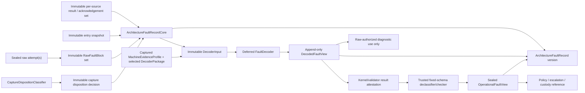

# Versioned architecture-fault decoder

The policy-plane fault decoder should be a pure, total, bounded transformation
from an immutable `DecoderInput`—the exact fault-record core plus a pinned
decoder profile—to an append-only `DecodedFaultView`.
Every normalized fact must say whether it was reported, mechanically derived,
inferred, contradictory, or unknown; identify the exact source bytes/bits and
decoder rule that produced it; and retain validity and loss separately from the
value. Decoding never rewrites raw evidence and never grants recovery authority.

A newer decoder may append a better view of the same capture. It may not edit
the historical view used for a prior decision. This makes decoder evolution
auditable without pretending an old decision was based on knowledge acquired
later. It is not an input to the hard-entry return decision: the separate
generated `CaptureDispositionClassifier` operates first on sealed raw/profile
facts and acknowledgement state. No later decoded view can retroactively mint a
local-return proof.

This is a proposed Atom service. It has not been implemented, fuzzed, or
validated against a concrete processor errata set.

## Question, scope, and operational standard

The question is:

> How can architecture-, firmware-, and vendor-specific records become useful
> common facts without erasing uncertainty, provenance, or the raw evidence
> needed to challenge the interpretation?

The decoder owns:

- structural validation of raw blocks and bounded nested sections;
- selection of an exact decoder profile and rule-table generation;
- field-local validity, endian/width conversion, and normalized fact creation;
- preservation of unknown fields, malformed tails, overwrite/loss, and
  contradictions;
- append-only view identity and reproducible re-decoding; and
- a redacted diagnostic projection of its own provenance and errors.

It does not read live machine registers, acknowledge a source, choose the
original hard-entry disposition, mint capabilities, correlate identities to
current objects without lifecycle validation, or export sensitive evidence.

A decoder passes only if:

1. every accepted block is length-, version-, profile-, and canonical-digest-checked
   before any inner field is accessed;
2. every derived fact has a machine-checkable provenance path to raw bytes,
   immutable boot metadata, or a named bounded inference rule;
3. invalid/absent is distinct from zero, and unknown is representable on every
   axis;
4. unsupported versions and sections remain opaque bounded blocks rather than
   being coerced into the closest known layout;
5. record or field conflicts are preserved, never resolved silently by source
   order;
6. processing time and output size are bounded by admitted block and rule
   limits;
7. no decoder result is an action capability or a local-resume proof;
8. old and new decoder outputs for the same raw record coexist with exact code,
   table, profile, and errata hashes; and
9. malformed, adversarial, and inconsistent inputs cannot cause allocation
   explosion, recursive parsing, integer wrap, or out-of-bounds access.

## Evidence and limits

| Evidence | Supported conclusion | Limit |
| --- | --- | --- |
| [UEFI 2.11](../../../30-sources/uefi-forum-2024-uefi-2-11.md) | CPER uses versioned headers, length-delimited descriptors/sections, field validity, record/creator identity, severity, notification type, and standard or nonstandard sections | A valid CPER is not proof that firmware reported truthfully or completely |
| [ACPI 6.6](../../../30-sources/uefi-forum-2025-acpi-6-6.md) | APEI separates source description, generic error status, raw data, serialized records, boot records, and injection | Firmware methods and tables enlarge the trust boundary |
| [Linux RAS documentation](../../../30-sources/linux-kernel-community-2026-ras-documentation.md) | Mature reporting retains architecture/vendor evidence while exposing normalized events; source, severity, correction, and containment remain separate | Linux's compatibility surface is broader than the initial Atom profile |
| [Intel system-programming documentation](../../../30-sources/intel-2026-system-programming-documentation.md) | MCA bank validity, overflow, address/misc validity, processor-context corruption, restartability, and precision are independent | Exact recovery matrices are model and erratum dependent |
| [Arm RAS specification](../../../30-sources/arm-2019-ras-specification.md) | Fields can be architecturally unknown without prerequisite validity; error class, poison, overflow, and uncorrected type are distinct | A processor/platform profile must supply node and extended-code interpretation |
| [RISC-V RERI](../../../30-sources/risc-v-international-2024-ras-error-record-interface.md) | Version/layout live at stable locations; address type, transaction, standardized/custom code, loss and containability are explicit | Optional/implementation-specific fields can make a conforming record sparse |
| [Machine-check handling on Linux](../../../30-sources/kleen-2004-machine-check-handling-linux.md) | Raw collection and later userspace decoding isolate the hard handler from evolving presentation logic | Historical implementation does not prove today's decoding rules |
| [Production memory-error study](../../../30-sources/meza-et-al-2015-revisiting-memory-errors.md) | Repeated records and persistent component/page history can inform maintenance | Fleet correlation cannot determine the safe disposition of one event |

The sources strongly support versioned raw-plus-normalized representations.
The epistemic tags, provenance graph, view history, and conflict rules below are
Atom synthesis.

## Decoder identity and immutable inputs

```text
MachineEvidenceProfileId {
    schema_version,
    isa,
    privilege_and_virtualization_profile,
    vendor_family_model_stepping,
    enabled_ras_features,
    microcode_revision,
    firmware_interface_and_revision,
    register_layout_versions,
    platform_source_map_hash
}

DecoderPackageId {
    decoder_schema_version,
    compatible_machine_profile_predicate_hash,
    decoder_binary_digest,
    decoder_rule_table_hash,
    decoder_errata_set_hash,
    validator_abi_and_version
}

LogicalDecoderInput {
    capture,
    semantic_core_id_and_digest,
    logical_raw_block_set_digest,
    logical_source_result_and_acknowledgement_set_digest,
    entry_snapshot_semantic_id_and_digest,
    capture_disposition_decision_semantic_id_and_digest,
    machine_evidence_profile_id_and_hash,
    decoder_package_id
}

DecoderInput {
    logical_decoder_input: LogicalDecoderInput,
    logical_decoder_input_digest:
        Hash(canonical_encoding(LogicalDecoderInput)),
    fault_record_graph_publication_ref_and_id,
    core_publication_ref_and_id,
    evidence_custody_root: DecoderEvidenceCustodyRoot,
    entry_snapshot_ref_and_digest,
    capture_disposition_decision_publication_ref_and_id,
    machine_evidence_profile_id,
    decoder_package_id
}

DecoderEvidenceCustodyRoot =
    OperationalRingRoot {
        operational_evidence_root_publication_ref_and_id,
        raw_block_set_publication_ref_and_id,
        source_result_and_acknowledgement_set_publication_ref_and_id,
        ring_owner_and_generation
    }
  | OperationalQueueRoot {
        incoming_queue_receipt_publication_ref_and_id,
        operational_evidence_root_publication_ref_and_id,
        raw_block_set_publication_ref_and_id,
        source_result_and_acknowledgement_set_publication_ref_and_id
    }
  | HeldRequirementRoot {
        requirement_held_acceptance_witness,
        requirement_publication_ref_and_id,
        logical_raw_and_source_set_digests
    }
  | TerminalPromotionRoot {
        promotion_publication_ref_and_id,
        logical_raw_and_source_set_digests
    }
  | IndependentCustodyRoot {
        custody_receipt_publication_ref_and_id,
        destination_evidence_publication_ref_and_id,
        logical_raw_and_source_set_digests
    }

RecordEvidenceCustodyRoot =
    DecodableEvidence(DecoderEvidenceCustodyRoot)
  | OperationalLossRoot {
        loss_transfer_publication_ref_and_id,
        loss_owner_and_generation,
        logical_raw_and_source_set_digests,
        entry_snapshot_semantic_id_and_digest,
        machine_profile_id_and_hash,
        logical_core_evidence_manifest_and_digest,
        raw_evidence_availability: UnavailableAfterLossTransfer
    }

ExactReadableSubstrateState =
    OperationalRingSealed(root_publication_id, owner_generation)
  | OperationalQueueSealed(root_publication_id, queue_generation,
                           incoming_receipt_id)
  | OperationalLossTransferSealed(loss_publication_id, loss_generation)
  | HeldRequirementAccepted(requirement_publication_id,
                            requirement_generation,
                            held_acceptance_witness_digest)
  | TerminalPromotionSealed(promotion_publication_id, terminal_generation)
  | IndependentCustodyAccepted {
        receipt_publication_id_and_generation,
        destination_publication_id_and_generation,
        destination_terminal_state:
            Sealed | CommittedCapsule | CommittedPrefix |
            CommittedRecursiveCapsule | DurableObjectCommitted,
        exact_destination_manifest_digest
    }

DecoderInputPublication {
    lifecycle_word: Atomic<(
        Empty | Writing | Sealed | Running | RunFinalizing |
        Reclaimable | Clearing,
        input_slot_generation,
        compact_input_build_or_cleanup_descriptor_index_and_generation_or_none,
        compact_input_builder_owner_tag_or_none,
        build_acquisition_or_release_frontier,
        registered_source_holder_bitmap
    )>,
    input_storage_owner_and_generation,
    input_build_descriptor_digest,
    input_id: Hash(canonical_encoding({
        intended_state: Sealed,
        input_storage_owner_and_generation,
        input_build_descriptor_digest,
        input_schema_and_bounds,
        logical_decoder_input_digest,
        canonical_input_digest
    })),
    input_schema_and_bounds,
    logical_decoder_input_digest,
    canonical_input_digest,
    body: DecoderInput,
    borrow_word: Atomic<(
        Open | Revoking | Drained,
        input_borrow_generation,
        live_decoder_and_validator_count:
            BoundedBorrowCount<MAX_DECODER_INPUT_BORROWS>
    )>
}

DecoderInputBuildDescriptor {
    descriptor_index_and_generation,
    input_slot_and_generation,
    input_storage_owner_and_generation,
    exact_source_graph_custody_root_and_dependency_generations,
    fixed_source_borrow_token_and_holder_bit_plan,
    input_schema_bounds_and_expected_logical_manifest,
    protected_input_builder_identity_and_generation,
    canonical_descriptor_digest
}

DecoderInputBuildCancellationPredicate {
    input_slot_generation_owner_and_build_descriptor,
    observed_state: Writing,
    exact_old_builder_fence_evidence,
    authoritative_build_frontier_and_source_holder_bitmap,
    no_prepared_run_plan_or_nonidle_run_control,
    outcome_publication_observed_empty,
    no_accepted_input_publication_or_external_reference,
    complete_decoder_input_writing_receipt_ref_and_id,
    matching_current_crash_reclaim_ref_and_id,
    protected_input_cleanup_authority_and_generation
}

DecoderRunCleanupDescriptor {
    lifecycle_word: Atomic<(
        Empty | Writing | Prepared | Installed | Clearing,
        cleanup_descriptor_slot_and_generation,
        compact_cleanup_seed_tag_or_none,
        compact_cleanup_builder_owner_tag_or_none,
        input_slot_and_generation_or_none
    )>,
    cleanup_descriptor_publication_id: Hash(canonical_encoding({
        intended_state: Prepared,
        cleanup_descriptor_slot_and_generation,
        cleanup_seed,
        input_slot_old_and_next_generations_and_build_descriptor,
        run_old_and_next_generations_and_prepared_plan_descriptor,
        canonical_descriptor_digest
    })),
    descriptor_index_and_generation,
    input_slot_old_and_next_generations_and_build_descriptor,
    run_old_and_next_generations_and_prepared_plan_descriptor,
    plan_and_outcome_slots_old_and_next_generations,
    exact_sealed_outcome_and_success_graph_or_failure_disposition,
    released_holder_bitmap_and_source_observations,
    fixed_outcome_plan_run_input_clear_and_rekey_order,
    protected_cleanup_owner_and_generation,
    canonical_descriptor_digest
}

DecoderRunCleanupDescriptorRecoveryPredicate {
    cleanup_descriptor_slot_generation_seed_owner_and_input_binding,
    observed_state:
        Writing | Prepared | Installed | Clearing | EmptyNextGeneration,
    input_observation:
        RunFinalizingWithOriginalBuildDescriptor |
        ReclaimableOrClearingWithThisCleanupDescriptor |
        DescriptorFreeEmptyNextGeneration,
    exact_sealed_outcome_released_run_plan_and_holder_observations,
    action: CompleteDeterministicBodyAndPublishPrepared |
            InstallPreparedIntoRunFinalizingInput |
            CompletePreparedToInstalledAfterInputAdoption |
            RetainInstalled | ClearVerifyAndPublishEmptyNextGeneration,
    no_input_run_plan_or_outcome_admission_while_descriptor_nonempty,
    protected_cleanup_descriptor_recovery_authority_and_generation
}

DecoderRunCleanupResumePredicate {
    cleanup_descriptor_index_generation_digest_and_owner,
    cleanup_descriptor_observed_state:
        Prepared | Installed | Clearing | EmptyNextGeneration,
    input_observation:
        Reclaimable | Clearing | EmptyNextGeneration,
    outcome_observation:
        Sealed | Clearing | EmptyNextGeneration,
    plan_observation:
        Prepared | Clearing | EmptyNextGeneration,
    run_observation:
        ReleasedOldGeneration | IdleNextGeneration,
    exact_outcome_plan_run_input_cleanup_frontier,
    exact_old_and_next_generations_descriptor_and_zero_holder_observations,
    protected_cleanup_recovery_authority_and_generation
}

DecoderRunControl {
    run_word: Atomic<(
        Idle | Running | OutcomeWriting | OutcomeSealed | Releasing | Released,
        run_generation,
        compact_run_plan_descriptor_index_and_generation_or_none,
        compact_run_owner_tag,
        acquisition_or_release_frontier,
        registered_run_holder_bitmap,
        selected_outcome_tag_or_none:
            None | SuccessPending | SuccessAccepted | Failure
    )>
}

DecoderRunPlanPublication {
    plan_slot_ref,
    lifecycle_word: Atomic<(
        Empty | Writing | Prepared | Clearing,
        plan_generation,
        compact_admission_descriptor_index_and_generation_or_none,
        compact_plan_owner_tag_or_none
    )>,
    intended_run_generation,
    input_publication_ref_id_generation_and_canonical_digest,
    preallocated_input_graph_and_evidence_token_plan,
    token_plan_digest,
    bounded_decoder_attempt_manifest,
    attempt_manifest_digest,
    admission_descriptor_digest,
    publication_id: Hash(canonical_encoding({
        intended_state: Prepared,
        plan_slot_ref,
        plan_generation,
        compact_admission_descriptor_index_and_generation,
        compact_plan_owner_tag,
        admission_descriptor_digest,
        intended_run_generation,
        input_publication_ref_id_generation_and_canonical_digest,
        token_plan_digest,
        attempt_manifest_digest
    }))
}

DecoderRunAdmissionPlanDescriptor {
    descriptor_index_and_generation,
    plan_slot_and_generation,
    intended_run_generation,
    input_publication_ref_id_generation_and_canonical_digest,
    preallocated_input_graph_and_evidence_token_plan_digest,
    bounded_decoder_attempt_manifest_digest,
    preallocated_cleanup_descriptor_slot_generation_and_acyclic_seed,
    protected_plan_builder_identity_and_generation,
    canonical_descriptor_digest
}

DecoderRunPlanCancellationPredicate {
    plan_slot_generation_owner_and_admission_descriptor,
    observed_plan_state: Writing,
    exact_old_builder_fence_evidence,
    exact_run_word_observed_idle_at_intended_generation_with_no_descriptor,
    zero_registered_input_graph_and_evidence_holder_bits,
    outcome_publication_observed_empty_at_bound_generation,
    complete_decoder_run_plan_writing_receipt_ref_and_id_if_writing,
    matching_current_crash_reclaim_ref_and_id_if_writing,
    protected_cancellation_authority_and_generation
}

DecoderRunOutcomePublication {
    outcome_slot_ref,
    lifecycle_word: Atomic<(
        Empty | Writing | Sealed | Clearing,
        outcome_generation,
        compact_outcome_build_descriptor_index_and_generation_or_none,
        compact_outcome_builder_owner_tag_or_none
    )>,
    run_generation,
    run_plan_publication_ref_id_and_generation,
    input_publication_ref_id_and_canonical_digest,
    sandbox_bundle_digest,
    bounded_attempt_manifest,
    outcome_build_descriptor_digest,
    outcome:
        AcceptedDecodedGraph {
            graph_publication_ref_id_and_digest,
            result_attestation_ref_and_id
        }
      | FailedWithoutDecodedAuthority {
            reason: DecoderTrap | ValidationFailure | BudgetExhausted |
                    FallbackExhausted | RecoveryFenced |
                    AcceptanceLostAfterSuccessSelection,
            accepted_decoded_graph: None,
            operational_policy_authority: None,
            sticky_failure_summary_generation
        },
    canonical_outcome_digest,
    publication_id: Hash(canonical_encoding({
        intended_state: Sealed,
        outcome_slot_ref,
        outcome_generation,
        outcome_build_descriptor_digest,
        compact_outcome_builder_owner_tag,
        run_generation,
        run_plan_publication_ref_id_and_generation,
        input_publication_ref_id_and_canonical_digest,
        sandbox_bundle_digest,
        bounded_attempt_manifest,
        canonical_outcome_digest
    }))
}

DecoderRunOutcomeBuildDescriptor {
    descriptor_index_and_generation,
    outcome_slot_and_generation,
    run_generation_plan_publication_and_input_identity,
    exact_selected_run_outcome_tag: SuccessAccepted | Failure,
    success_graph_attestation_binding_or_failure_reason_and_summary_generation,
    sandbox_bundle_and_attempt_manifest_digests,
    protected_outcome_builder_identity_and_generation,
    canonical_descriptor_digest
}

SandboxDecoderBundle {
    bundle_schema_and_bounds,
    capture,
    logical_decoder_input: LogicalDecoderInput,
    logical_decoder_input_digest,
    raw_fault_block_set_copy,
    source_result_and_acknowledgement_set_copy,
    entry_snapshot_semantic_copy,
    capture_disposition_decision_semantic_copy,
    machine_evidence_profile_copy,
    decoder_package_rule_material_copy,
    canonical_bundle_digest
}

RawFaultBlock {
    capture: FaultCaptureIncarnation,
    block_index,
    source_id_and_result_digest,
    attempt_index_and_sealed_attempt_digest,
    source_owner_and_route_generations,
    source_program_and_profile_hashes,
    mechanism_id,
    layout_id,
    byte_order,
    access_width,
    declared_length,
    captured_validity,
    capture_completion_bitmap,
    capture_loss_flags,
    canonical_header_and_payload_digest,
    bytes: BoundedBytes<MAX_RAW_BLOCK>
}

RawFaultBlockSetBody {
    capture: FaultCaptureIncarnation,
    logical_source_result_and_acknowledgement_set_digest,
    raw_block_count,
    raw_block_bounds_and_schema,
    ordered_raw_block_digest_manifest,
    blocks: BoundedArray<RawFaultBlock, MAX_RAW_BLOCKS>
}

RawFaultBlockSetPublication {
    state: Empty | Writing | Sealed,
    storage_owner_and_generation,
    publication_id: Hash(canonical_encoding({
        intended_state: Sealed,
        storage_owner_and_generation,
        source_result_and_acknowledgement_set_publication_ref_and_id,
        capture,
        raw_block_bounds_and_schema,
        logical_raw_block_set_digest
    })),
    source_result_and_acknowledgement_set_publication_ref_and_id,
    logical_raw_block_set_digest,
    body: RawFaultBlockSetBody
}
```

For `DecoderRunCleanupDescriptor`, `canonical_descriptor_digest` hashes only
the immutable cleanup seed, input/plan/outcome/run old-and-next bindings,
success-or-failure disposition, released-holder observations, teardown plan,
and protected owner fields. It omits the mutable lifecycle word,
`cleanup_descriptor_publication_id`, and the digest field itself. The outer
publication ID is computed only after that digest, so neither value is cyclic
and lifecycle transitions do not change descriptor identity.

The aggregate envelope is the immutable bridge from capture custody into a
decoder input. Its storage-independent logical set digest (with that field
omitted) covers capture identity, the logical per-source result/acknowledgement
set digest, bounds/schema, ordered block manifest, and every complete block.
`publication_id` additionally binds intended `Sealed` state, storage owner/
generation, and the exact physical source-set publication ref/ID. A ring-to-queue copy creates a
new envelope identity and must be covered by the handoff receipt in the bounded-
capture contract; a decoder never follows pointers back into recycled staging
or a freed ring slot.

The kernel first validates an immutable `DecoderInputBuildDescriptor` naming
the exact input slot/storage owner, source graph/custody/dependency
generations, fixed temporary-holder plan, and expected logical manifest. Its
native-atomic `Empty → Writing` claim installs that compact descriptor/owner,
zero frontier, and zero registered-holder bitmap before any input byte changes.
Before each temporary source acquisition the builder advances the published
frontier and then installs the descriptor's exact holder bit in the
authoritative source word; it rechecks all identities after acquisition. It
copies the fixed input, validates all referenced publications and identities,
releases every temporary holder from the published frontier/bitmap, and seals
`DecoderInputPublication` only after all bits are absent. Its identity covers
intended `Sealed` state, storage generation, build-descriptor digest, fixed
schema/bounds, and the canonical input body digest.

A `Writing` cut cannot pin the input pool. Fenced recovery uses the atomically
installed descriptor and source holder words—not the partial body—to release
exactly the registered set. If the run is still descriptor-free `Idle`, the
outcome is `Empty`, no plan is `Prepared`, and no accepted input reference
exists, a complete fixed-extent
`IncompleteCrashAttempt(DecoderInputWriting)` receipt plus matching current
`CrashReclaim` authorizes the exact
`DecoderInputBuildCancellationPredicate`. Recovery CASes
`Writing → Clearing`, verifies full clear/rekey, initializes the next empty
borrow/control generations, and publishes descriptor-free `Empty` last. If a
prepared plan or run owns the input, recovery must finish that run instead;
missing frontier/bit evidence retains the input. The complete input lifecycle
tuple and holder bitmap must fit one native atomic word or one fixed disjoint
input shard; no multiword emulation substitutes for its claim/recovery CAS.

That publication is a **trusted ingress envelope**, not the object mapped into
an untrusted decoder. Trusted ingress acquires the exact graph and evidence-
root borrows, validates every live reference and generation, and copies only
bounded inert values into a `SandboxDecoderBundle`. The bundle contains raw
bytes, logical manifests, snapshot/decision semantics, and pinned profile/rule
material; it contains no publication pointer, storage mapping, borrow token,
capability, kernel address, or mutable shared page. It is sealed under a
canonical bundle digest before dispatch. The sandbox receives only that copy,
and the trusted completion path joins its digest to the physical input identity
and digest that ingress actually validated. Thus neither a decoder nor its
validator follows references back into recycled staging, a graph slot, or a
freed ring/queue/root.

Run ownership is separately recoverable. Once the exact decoder input is
sealed, but before acquiring its first ingress or input borrow, the kernel
prevalidates an immutable `DecoderRunAdmissionPlanDescriptor` that names the
exact plan/input/run generations, owner, fixed token plan, and bounded attempt
manifest, and preassigns one cleanup-descriptor slot/generation plus an acyclic
seed. Plan admission requires that slot descriptor-free `Empty`; exhaustion is
reported before `Prepared`, never discovered after a completed run. Its native-atomic `Empty → Writing` CAS installs that compact
descriptor index/generation and owner tag before any plan byte changes. The
kernel copies the exact input identity/generation, token-to-holder-bit plan,
and complete bounded attempt manifest, proves that the body reproduces the
descriptor, validates both digests and its self-excluding publication ID, and
release-publishes `Prepared` while retaining those tags.

A cut while the sidecar is `Writing` leaves the run word `Idle` and owns no
source borrow. Recovery never interprets its partial body: it fences the owner,
validates the atomic descriptor, proves the exact intended run still
`Idle`/descriptor-free, the outcome slot `Empty`, and every planned holder bit
absent, preserves the complete fixed plan extent in
`IncompleteCrashAttempt(DecoderRunPlanWriting)`, and consumes its matching
current `CrashReclaim`. The closed `DecoderRunPlanCancellationPredicate` alone
permits `(Writing, p, descriptor, owner) → (Clearing, p, descriptor, owner)`.
A validated `Prepared` plan may **not** be cancelled: it is the durable owner of
the already sealed input. Fenced recovery must deterministically win the named
descriptor-free `Idle → Running` transition and execute or recover the bounded
run through a sealed success/failure outcome and holder release. If that exact
start cannot be proved, the plan and input remain retired together; there is no
sealed-input-without-run rearm shortcut. Verified clear/rekey for the distinct
`Writing`-only cancellation initializes the next descriptor-free plan
generation and publishes `Empty` last; a cut resumes from `Clearing`, while
ambiguity retires the plan/input generation.

The kernel then validates
the complete prepared plan and CASes exact `Idle → Running`, installing its
compact plan descriptor/generation and run owner in the same word before the
first acquisition. Every later run state retains that descriptor. It publishes
each acquisition/release frontier before the corresponding atomic holder-bit
CAS, so a fenced recovery can determine and undo the exact installed set.
Decoder code cannot mutate this control, its prepared plan, or the fixed
`DecoderRunOutcomePublication` beside the input slot.

The outcome copies the exact plan publication identity, and its sealed
publication ID binds the plan, input, sandbox-bundle digest, complete attempt
manifest, selected closed outcome, run generation, and outcome generation. A
stale plan or outcome from another input therefore cannot interpret the live
frontier/bitmap or win completion.

The complete plan lifecycle word and the complete `run_word`, including their
lifecycle, generation, compact plan
descriptor, compact owner and frontier tags, holder bitmap, and outcome tag,
must each fit one target-supported native atomic operation. The target profile
derives its run-holder bound and field widths accordingly. If one word cannot
hold the configured population, the pool is statically partitioned into
independent run-control shards: each input/run is assigned to exactly one
shard, each shard has a disjoint token plan and one complete native-atomic
word, and no ownership transition spans shards. Locks, interrupt masking as a
substitute, and multiword emulated CAS are not valid implementations of this
recovery cut.

Every `BoundedBorrowCount<MAX_*>` below follows the parent component's bounded
borrow-count contract: static holder-population proof, `n < MAX` checked before
increment, fail-closed saturation, one exact-generation decrement per issued
token, no underflow/wrap, and `Revoking,0 → Drained` as the only drain CAS.

`MachineEvidenceProfileId` is not reconstructed from raw fields after the
event. It is the immutable, previously validated machine/firmware/layout
profile bound to the capture slot. A raw record that claims another vendor or
revision is a contradiction, not a reason to switch machine profiles
mid-record. `DecoderPackageId` is selected per decoding run and names the exact
parser/rules/errata knowledge used; a newer compatible package can therefore
reinterpret the same captured machine profile without pretending those rules
were known at capture time.

Source identity has layers: machine profile, producing component, detector,
consumer, delivery agent, firmware/record creator, and later record custodian.
These are not collapsed into one `origin`. In particular, poisoned data may be
detected in one component and consumed on another CPU; a firmware wrapper may
create the CPER that contains a processor record.

## Output schema and epistemic provenance

```text
DecodedFaultView {
    view_id: Hash(canonical_encoding(all_following_semantic_fields)),
    capture: FaultCaptureIncarnation,
    logical_decoder_input_digest,
    logical_raw_block_set_digest,
    logical_source_result_and_acknowledgement_set_digest,
    machine_evidence_profile_id,
    decoder_package_id,
    decoder_binary_digest,
    rule_table_hash,
    structural_status,
    facts: BoundedArray<NormalizedFact, MAX_FACTS>,
    associations: BoundedArray<AssociationEdge, MAX_ASSOCIATIONS>,
    contradictions: BoundedArray<Contradiction, MAX_CONTRADICTIONS>,
    opaque_regions: BoundedArray<OpaqueRegion, MAX_OPAQUE>,
    decode_loss
}

NormalizedFact<T> {
    fact_index,
    dimension,
    value: Option<T>,
    source_validity: Valid | Invalid | NotPresent | Unspecified,
    capture_availability: Captured | Unavailable | Truncated,
    structural_parse: WellFormed | Malformed | Unsupported,
    agreement: Uncompared | Agrees | Conflicts,
    evidence_loss: NoneReported | Overflow | Overwritten | Missing | Unknown,
    epistemic_status: Reported | MechanicallyDerived | Inferred | Unknown,
    normative_basis: ArchitectureNormative | PlatformContract | VendorRule |
                     Heuristic,
    producer_trust: Authenticated(root_id) | IdentifiedOnly | Untrusted |
                    Unknown,
    provenance: BoundedSet<ProvenanceEdge, MAX_PROVENANCE>,
    rule_id,
    prerequisites,
    caveats
}

ProvenanceEdge =
    RawBits(block_index, bit_start, bit_length)
  | RawBytes(block_index, offset, length)
  | BootProfile(field_path, profile_hash)
  | Erratum(rule_id, errata_set_hash)
  | DerivedFrom(prior_fact_indices)

AssociationEdge {
    edge_index,
    left_source_and_block_identity,
    right_source_and_block_identity,
    class: IdentityProved | ProducerCorrelated | HeuristicAssociation,
    proof_or_rule_digest,
    supporting_fact_indices,
    contradiction_indices,
    uncertainty_and_loss
}

DecodedViewCustody {
    view_id,
    produced_at_monotonic_era_and_tick,
    producer_incarnation,
    custody_record_digest
}

DecoderResultAttestationBody {
    view_id,
    logical_decoder_input_digest,
    sandbox_decoder_bundle_digest,
    physical_decoder_input_publication_identity_at_run,
    physical_decoder_input_digest,
    decoder_binary_digest,
    assurance: IndependentlyValidated(package_id, validator_set_digest) |
               SandboxedUnverified | Untrusted,
    validation_or_isolation_evidence_digest
}

DecoderResultAttestationPublication {
    state: Empty | Writing | Sealed,
    attestation_id: Hash(canonical_encoding({
        intended_state: Sealed,
        attester_identity_and_generation,
        authority_binding,
        canonical_body_digest
    })),
    attester_identity_and_generation,
    canonical_body_digest,
    authority_binding: ProtectedKernelHandle | AuthenticatedValidatorEnvelope,
    body: DecoderResultAttestationBody
}

OperationalFaultView {
    opaque_correlation_handle: KernelMintedBootTenantScopedHandle,
    body:
      ValidatedValues {
          declassifier_binary_digest,
          declassifier_policy_and_schema_ids,
          fixed_schema_axes_and_bounded_values,
          independently_assigned_field_sensitivity_map,
          preserved_association_classes_and_consumer_scoped_opaque_proof_handles,
          integrity_loss_and_unknown_summary
      }
    | DecoderUntrustedConstant {
          trusted_kernel_invocation_status: DecoderUntrusted,
          required_policy_effect: AllDecodedAxesUnknownAndMonotonicWiden
      }
}

OperationalFaultViewPublication {
    state: Empty | Writing | Sealed,
    publication_id: Hash(canonical_encoding({
        intended_state: Sealed,
        opaque_correlation_handle,
        output_schema_and_bounds,
        canonical_output_digest,
        protected_source_binding_digest
    })),
    opaque_correlation_handle,
    output_schema_and_bounds,
    protected_source_binding:
      ValidatedDecodedSource {
          core_publication_ref_and_id,
          source_decoded_view_id,
          protected_result_attestation_ref_and_id,
          enclosing_graph_slot_and_generation,
          derived_graph_membership_seed_digest
      }
    | TrustedUnverifiedInvocation {
          trusted_kernel_invocation_status: DecoderUntrusted,
          invocation_identity_and_generation,
          capture,
          logical_decoder_input_digest,
          physical_decoder_input_publication_identity_at_run,
          physical_decoder_input_digest,
          sandbox_decoder_bundle_digest,
          core_publication_ref_and_id,
          source_decoded_view_id_and_publication_ref_and_id,
          protected_result_attestation_ref_and_id,
          enclosing_graph_slot_and_generation,
          derived_graph_membership_seed_digest,
          authority_binding: ProtectedKernelDecoderInvocationAuthority
      },
    protected_source_binding_digest,
    canonical_output_digest,
    view: OperationalFaultView
}

DecodedFaultViewPublication {
    state: Empty | Writing | Sealed,
    publication_id: Hash(canonical_encoding({
        intended_state: Sealed,
        view_storage_owner_and_generation,
        view_id,
        logical_decoder_input_digest,
        physical_decoder_input_publication_identity_at_run,
        physical_decoder_input_digest,
        view_schema_and_bounds,
        canonical_view_digest
    })),
    view_storage_owner_and_generation,
    view_id,
    logical_decoder_input_digest,
    physical_decoder_input_publication_identity_at_run,
    physical_decoder_input_digest,
    view_schema_and_bounds,
    canonical_view_digest,
    view: DecodedFaultView
}
```

`view_id` is the content digest of the canonical semantic view with the
`view_id` field omitted; it is never included recursively in its own digest.
The operational handle is not a content hash. Trusted kernel code mints it in a
boot-/tenant-scoped namespace, and the protected publication separately binds
the canonical public-view digest to raw core/view/attestation identities. Those
content hashes are accessible only behind diagnostic/evidence authority, so an
ordinary operational reader cannot use them as equality or low-entropy guessing
oracles. Association proofs exposed to that reader are likewise boot-/tenant-
and consumer-scoped opaque handles; raw proof hashes remain in the protected
view. If a policy explicitly permits a portable proof value, the declassifier
must show that it commits only already-declassified canonical fields and key or
scope it to the consumer.

`publication_id` is the canonical identity of the operational envelope, not
of only one of its halves. With the `publication_id` field itself omitted, it
covers intended `Sealed` state, the opaque handle, output schema and bounds,
the canonical output digest, and the protected source-binding digest. A reader
resolves the handle through the protected table and accepts it only when that
exact publication identity, state, output, and source binding validate. This
prevents a reused or torn slot from pairing a valid public view with another
capture's valid protected binding while keeping both raw-derived digests hidden
from ordinary readers.
The protected binding also carries the exact enclosing graph slot/generation
and an acyclic `DerivedGraphMembershipSeed` digest. Trusted construction fixes
that seed before writing the operational publication. It commits the capture,
decision/core semantic digests, decoded view, result attestation, already-
computed content-addressed record-semantic ID, and intended derived-closure schema/bounds; it explicitly
excludes the operational publication ID, final graph ID/digest, graph
provenance, and every field that contains one of those values. Acceptance
recomputes the seed, acquires that graph generation, and requires a `Sealed`
root whose derived closure contains the exact core, decoded view, attestation,
operational publication, and record projection. The seed is only an acyclic
membership commitment: it never makes a child independently acceptable. A
rehome or decoded-version append therefore reissues the operational
publication under the destination graph's seed and migrates every protected
event binding before the source graph can clear.
The closed `TrustedUnverifiedInvocation` tag provides the same anti-stale and
graph-membership discipline for the constant-widening case. Kernel-owned code,
not the decoder, assigns its invocation identity/generation and status and
binds capture, logical and physical input digests, sandbox-bundle digest,
core/view/attestation publications, enclosing graph seed, and protected
authority. A cross-capture, stale-generation, or graphless constant notice is
rejected even though its public value is deliberately constant.
Time and custody are deliberately outside the semantic view and its digest.
`logical_decoder_input_digest` is computed only from the closed
`LogicalDecoderInput`: semantic core/capture/evidence/snapshot/decision
identities and digests plus the machine profile and decoder package. It never
contains a storage owner, publication reference, queue/requirement/terminal
root, custody receipt, or borrow generation. The physical
`DecoderInputPublication.canonical_input_digest` separately commits all of
those exact run and custody bindings. A decoded view and its semantic
`view_id` use only the logical digest; its publication and result attestation
bind that digest, the sealed inert bundle digest, and the exact physical input
publication/digest trusted ingress used for the run. Identical core/machine-profile/decoder-package inputs can therefore produce byte-identical
semantic views; appending them at different times or validating the same result
under a stronger assurance process creates distinct custody/attestation records
without changing decoded meaning. Fact indices are assigned in one
canonical deterministic emission order. Every `DerivedFrom` edge may reference
only a smaller in-bounds index, making the graph bounded and acyclic before the
view seals.

The decoder cannot author or upgrade `DecoderResultAttestationPublication`. A
validated kernel/validator path privately builds it under `Writing` in
validator-owned protected memory, binds the canonical self-excluding body
digest to the exact view, logical input, inert sandbox-bundle digest, physical
input publication/digest,
binary, package, validator set, and attester
generation. Its `attestation_id` covers intended `Sealed` state, attester
identity/generation, authority binding, and canonical body digest; the
validator then release-publishes physical `Sealed`. Authority is either an unforgeable
kernel handle inaccessible to the decoder or an authenticated envelope rooted
in a configured validator key. Readers validate the state, attestation ID,
attester generation, body digest, and authority binding; a plain digest or assurance label in
decoder-controlled bytes is ignored.

Facts cover axes rather than one severity label:

- detector, consumer, reporter, and delivery provenance;
- delivery synchronicity and interruptibility;
- instruction/address precision and restartability;
- corrected, deferred, poison-present, poison-consumed, uncorrected, and
  unknown correction state;
- processor-context and shared-state integrity;
- address type and validity, affected extent and granularity;
- component, CPU, thread/domain, requester/device, and machine scope;
- persistence/stickiness and acknowledgement state;
- overflow, overwrite, truncation, missing bank/CPU, and evidence integrity;
- producer severity/containability and any separately derived candidate
  containment scope.

Trusted policy review consumes only the corresponding sealed
`OperationalFaultView`, after its attestation and declassifier bindings
validate. Full diagnostic readers with raw-evidence authority may consume the
richer facts directly. Neither path consumes a convenience `severity` that
erased the axes, and neither can change the already recorded capture-time
return/park/terminal decision.

## Canonical record assembly and lifecycle

The parent facade's `ArchitectureFaultRecord` is a versioned projection over an
immutable core, not a mutable object that silently acquires new meaning:

```text
ArchitectureFaultRecordCore {
    core_id: Hash(canonical_encoding(all_following_core_fields)),
    capture: FaultCaptureIncarnation,
    logical_raw_block_set_digest,
    machine_evidence_profile_id_and_hash,
    logical_source_result_and_acknowledgement_set_digest,
    entry_snapshot_semantic_id_and_digest,
    capture_disposition_decision_semantic_id_and_digest
}

ArchitectureFaultRecordCorePublication {
    state: Empty | Writing | Sealed,
    core_publication_id: Hash(canonical_encoding({
        intended_state: Sealed,
        core_storage_owner_and_generation,
        core_id,
        acceptance_root,
        accepted_decision_publication_ref_and_id,
        evidence_custody_root,
        core_schema_and_bounds,
        canonical_core_digest
    })),
    core_storage_owner_and_generation,
    core_id,
    acceptance_root:
        DirectDecision(decision_publication_ref_and_id)
      | HeldRequirementWitness(requirement_held_acceptance_witness),
    accepted_decision_publication_ref_and_id,
    evidence_custody_root: RecordEvidenceCustodyRoot,
    core_schema_and_bounds,
    canonical_core_digest,
    core: ArchitectureFaultRecordCore
}

ArchitectureFaultRecord {
    record_semantic_id: Hash(canonical_encoding(all_following_semantic_fields)),
    previous_record_semantic_id: Option<RecordSemanticId>,
    core_id,
    decoded_view_semantic_id: Option<ViewId>,
    operational_view_semantic_digest: Option<Digest>
}

ArchitectureFaultRecordPublication {
    state: Empty | Writing | Sealed,
    record_storage_owner_and_generation,
    record_publication_id: Hash(canonical_encoding({
        intended_state: Sealed,
        record_storage_owner_and_generation,
        record_semantic_id,
        core_publication_ref_and_id,
        decoded_view_physical_binding,
        operational_view_physical_binding,
        canonical_record_binding_digest
    })),
    record_semantic_id,
    core_publication_ref_and_id,
    decoded_view_physical_binding: Option<{
        view_id,
        protected_decoded_publication_ref_and_id
    }>,
    operational_view_physical_binding: Option<{
        operational_view_semantic_digest,
        opaque_correlation_handle,
        protected_operational_publication_ref_and_id
    }>,
    canonical_record_binding_digest,
    record: ArchitectureFaultRecord
}

FaultRecordPublicationGraphSlot {
    lifecycle_word: Atomic<(
        Empty | ReservationWriting | Reserved | WritingDecision |
        DecisionSealed | WritingCore | CoreSealed |
        WritingDerivedClosure | DerivedClosureSealed | WritingProjection |
        Sealed | Rehoming | Abandoned | Reclaimable | Clearing,
        graph_slot_generation,
        compact_reservation_owner_tag_or_none
    )>,
    graph_storage_owner_and_generation,
    reservation_header: GraphReservationHeader,
    reservation_header_digest,
    graph_publication_id: Hash(canonical_encoding({
        intended_state: Sealed,
        graph_storage_owner_and_generation,
        reservation_header_digest,
        decision_publication_id,
        core_publication_id,
        derived_closure_digest,
        record_semantic_id,
        record_publication_id,
        evidence_custody_root,
        source_dependency_set_and_entry_identity_and_generation,
        graph_provenance_digest,
        canonical_graph_digest
    })),
    predecessor_graph_publication_id: Option<PublicationId>,
    source_dependency_set_and_entry_identity_and_generation,
    decision_publication: CaptureDispositionDecisionPublication,
    core_publication: ArchitectureFaultRecordCorePublication,
    derived_closure:
      CaptureOnly
    | DecodedVersionClosure {
          decoder_run_provenance_copy_and_digest,
          decoded_view_publication: DecodedFaultViewPublication,
          result_attestation_publication:
              DecoderResultAttestationPublication,
          operational_view_publication:
              OperationalFaultViewPublication
      },
    record_publication: ArchitectureFaultRecordPublication,
    evidence_custody_root: RecordEvidenceCustodyRoot,
    derived_closure_digest,
    graph_provenance:
      InitialGraph {
          initial_graph_seed: InitialGraphSeed,
          initial_graph_seed_digest
      }
    | RehomeGraph {
          witness: FaultRecordGraphRehomeWitness
      },
    graph_provenance_digest,
    canonical_graph_digest,
    borrow_word: Atomic<(
        Open | Revoking | Drained,
        graph_borrow_generation,
        live_graph_reader_and_binding_count:
            BoundedBorrowCount<MAX_GRAPH_BORROWS>
    )>,
    holder_set_audit_digest
}

GraphReservationHeader {
    graph_slot_and_generation,
    reservation_owner_and_capture,
    reservation_role: Primary | TerminalFallback | TerminalDestination |
                      DecodedVersion | RehomeDestination,
    companion_reservation_slot_generation_or_none,
    initial_or_rehome_seed_and_digest,
    intended_custody_class_and_substrate_identity_generation,
    intended_dependency_set_entry_identity_generation_and_bit,
    intended_preaccept_continuation_hold_slot_and_generation_or_none,
    graph_schema_and_bounds,
    canonical_reservation_header_digest
}

FaultRecordGraphRehomeWitness {
    source_graph_publication_id_and_generation,
    destination_graph_seed: Hash(canonical_encoding({
        destination_graph_storage_owner_and_generation,
        copied_decision_semantic_id_and_body_digest,
        copied_core_id_and_digest,
        copied_record_semantic_id_and_digest,
        destination_evidence_custody_root,
        complete_graph_manifest_digest
    })),
    copied_decision_semantic_id_body_digest_and_acceptance_root,
    copied_core_id_and_digest,
    copied_record_semantic_id_and_digest,
    source_and_destination_record_publication_ids_and_binding_digests,
    source_and_destination_evidence_custody_roots,
    authenticated_custody_receipt_or_internal_transfer_authority,
    complete_graph_manifest_and_digest,
    missing_set: Empty,
    canonical_witness_digest
}

InitialGraphSeed {
    graph_slot_and_generation,
    capture,
    preallocated_decision_id,
    logical_raw_and_source_set_digests,
    entry_snapshot_semantic_id_and_digest,
    machine_profile_id_and_hash,
    intended_custody_class_and_reserved_substrate_identity_generation,
    graph_schema_and_bounds
}

GraphReservationCancellationProof {
    graph_slot_and_generation,
    reservation_owner_and_capture,
    reservation_role: UnusedPrimary | UnusedTerminalFallback |
                      LostTerminalDestination,
    reservation_binding:
        CompleteReservationHeaderAndDigest
      | IncompleteReservationHeader {
            atomic_reservation_owner_tag,
            protected_admission_plan_id_and_digest,
            intended_role_companion_and_seed_digest
        },
    all_child_lifecycles_and_bytes: UnwrittenAndEmpty,
    graph_publication_id: None,
    dependency_registration:
        NeverClaimedBitAndEmptyEntry
      | RevokedEntryAndClearedBits(witness_digest),
    graph_borrow_state: OpenWithZeroHolders,
    cancellation_basis:
        PrimaryGraphAccepted {
            accepted_graph_ref_id_generation_and_live_dependency_binding
        }
      | ContainmentHeldOutcomeWon {
            held_requirement_publication_ref_id_generation_and_body_digest,
            requirement_held_acceptance_witness_digest,
            source_staging_observed_state: ContainmentAccepted
        }
      | TerminalFallbackSelected {
            source_staging_observed_state: HeldForTerminal
        }
      | AdmissionNeverCompleted,
    cancellation_authority_and_digest
}

AbandonedGraphCleanupProof {
    graph_slot_and_generation,
    complete_reservation_header_and_digest,
    abandonment_owner_capture_reason_and_frontier,
    every_child_lifecycle_identity_digest_and_written_extent,
    aggregate_root_state:
        NeverSealed
      | SealedButNeverAccepted {
            graph_publication_ref_id_and_digest,
            dependency_entry_ready_to_accept_then_revoked_witness,
            accepted_bit_was_never_set_proof
        },
    dependency_registration: RevokedEntryAndClearedBits(witness_digest),
    preaccept_hold_disposition:
        NotRequired
      | CompleteHoldReleased {
            hold_publication_ref_id_and_generation,
            every_planned_source_holder_bit_cleared_proof
        }
      | CancelledIncompleteHoldReleased {
            hold_publication_ref_id_and_generation,
            prior_hold_state_frontier_and_bitmap,
            continuation_hold_cancellation_predicate_digest,
            every_planned_source_holder_bit_cleared_proof
        },
    graph_borrow_state: OpenWithZeroHolders,
    no_external_binding_or_reader_acceptance_proof,
    cleanup_authority_and_digest
}

DerivedGraphMembershipSeed {
    graph_slot_and_generation,
    capture,
    decision_semantic_id_and_body_digest,
    core_id_and_digest,
    decoded_view_id_and_digest,
    result_attestation_id_and_digest,
    computed_record_semantic_id,
    intended_derived_closure_schema_and_bounds
}

EvidenceGraphDependencySet<MAX_GRAPHS_PER_EVIDENCE_ROOT> {
    evidence_root_identity_and_generation,
    dependency_word: Atomic<(
        Open | Closing | Drained,
        dependency_set_generation,
        reservation_bitmap,
        accepted_bitmap
    )>,
    entry[MAX_GRAPHS_PER_EVIDENCE_ROOT] {
        lifecycle_word: Atomic<(
            Empty | Claiming | Reserved | ReadyToAccept | Live | Rehomed |
            Revoked,
            entry_generation,
            compact_reservation_owner_tag_or_none,
            compact_graph_slot_generation_tag_or_none
        )>,
        full_reservation_owner_and_graph_identity_descriptor,
        expected_graph_evidence_custody_root_digest,
        graph_publication_id_or_none,
        latest_rehome_or_revocation_witness_digest
    }
}
```

The capture service turns each independently sealed source attempt into one
`RawFaultBlock`. Their ordered raw-set digest, immutable per-source result and
acknowledgement set, entry snapshot, exact machine profile, and capture-time decision
form the core. Version zero may contain no decoded view. Each later decoder run appends
a new `DecodedFaultViewPublication` and a new immutable `ArchitectureFaultRecord`
projection in a fresh bounded graph slot, rematerializing the same semantic core
and decision under that slot's custody root and naming the predecessor's
storage-independent record-semantic ID. The
projection is a trusted fixed linkage object, not a decoder-controlled carrier
for arbitrary facts; action-oriented fields live only in a validated
`OperationalFaultView`. Lineage
is projection metadata, not part of the semantic view. An escalation, custody,
or policy decision binds the exact record-semantic ID and physical graph/
record publication it consumed. Decoded-view,
operational-view, and record publications are built privately under `Writing`;
a release publication of `Sealed` is their immutability/publication point, not
independent graph acceptance. A consumer also requires their enclosing graph
root `Sealed`, the matching dependency accepted bit and `Live` entry, the
readable substrate, and any product-required `Complete` hold. Their content IDs omit
their own ID field. The operational publication ID additionally joins its
opaque handle, output schema/bounds and digest, and protected source-binding
digest; the record stores both that handle and the protected publication
reference/ID. Its decoded link likewise stores the semantic view ID and the
protected decoded-publication reference/ID. An acquire reader rejects any non-`Sealed` state or mismatch of
state, bounds, input/core digest, content or publication ID, and envelope
digest.

Core acceptance is explicit. `core_publication_id`, with its own field omitted,
binds intended `Sealed` state, storage generation, core content ID,
schema/bounds, body digest, the exact accepted decision publication, the
direct-decision or held-requirement-acceptance root, and one closed
`RecordEvidenceCustodyRoot` variant. The semantic core contains only logical evidence
digests and the decision's preallocated semantic ID/body digest, so it can be
committed as a containment seed before downstream publication IDs and no digest
cycle or dangling staging reference exists. Its wrapper is materialized only
after the relevant evidence substrate validates: sealed operational ring root;
sealed queue root plus incoming receipt; sealed compact loss-transfer
publication plus stable loss generation; held-requirement acceptance witness;
sealed terminal promotion; or independently receipted destination. The
aggregate graph's final `Sealed` publication is the immutable precondition, not
acceptance. Initial ring/loss custody transfer and decision acceptance occur
only when the reservation-bound continuation hold is `Complete`, the exact
readable root still validates, and the dependency word's accepted-bit CAS wins;
the entry then reaches `Live`. Multiple immutable core-publication envelopes may carry the same
semantic `core_id` as custody moves, but only inside complete aggregate graphs.
A containment core and its
decision must embed the same authenticated acceptance witness; a direct return/
terminal core requires the exact direct decision. Orphan candidate bytes cannot
enter a decoder input.

Decision, core, and projection storage is one bounded aggregate, not three
unrelated retain-forever allocators. Boot provisions a fixed number of
`FaultRecordPublicationGraphSlot`s per CPU/custody domain and a fixed maximum
number of projections/rehomes per capture. One slot owns exactly one physical
decision publication, one physical core wrapper, and one record projection.
Before any local-resume token or initial graph child is written, trusted
admission constructs the canonical `InitialGraphSeed` shown above and seals
its digest in a generation-bound `GraphReservationHeader`. Slot claim CASes
`(Empty, g, None) → (ReservationWriting, g, owner_tag)` before changing any
header byte, writes the complete header (including owner/capture, role,
companion slot if any, seed, intended substrate and dependency entry, and the
preallocated continuation-hold slot/generation required by an initial
nonterminal product), and
release-publishes `(Reserved, g, owner_tag)` only after its canonical digest
validates. A cut in `ReservationWriting` remains attributable through the
atomic owner tag and can only be fenced and cleared as an incomplete
reservation; no child or dependency registration is allowed. For a primary+
fallback pair, admission preselects both slot/generation identities, records
the cross-reference in both headers, and cancels the first if the second
cannot reach `Reserved`. The seed includes only the reserved graph
slot/generation, capture, preallocated generation-scoped decision ID, logical
raw/source-set digests, entry-snapshot semantics, pinned machine profile,
intended custody class and exact reserved substrate generation, and graph
schema/bounds. It expressly excludes the token ID/publication, decision body
or body digest, every child publication ID, record-semantic ID, graph ID,
canonical graph digest, provenance ID/digest, and any value derived from those
fields. The final `InitialGraph` provenance embeds the same seed and digest;
return or recovery recomputes it from the reserved facts and rejects any
mismatch. This ordering gives the token an exact future-graph commitment
without a token ↔ decision ↔ graph hash cycle.

The graph lifecycle word carries only state, slot generation, and a compact
owner tag; the immutable reservation header plus the graph-owner descriptor
carry the full owner/capture identity and are validated before and after every
CAS. The complete lifecycle word must fit one target-supported native atomic
operation. A larger configured graph population uses fixed independent pools
whose local words each fit and whose slot/generation namespaces are disjoint;
one graph never spans pools, and neither a lock nor multiword emulated CAS is a
conforming substitute on a fault/recovery cut.

It publishes in the only permitted order:

1. a nonterminal admission reserves two exact graph slots—a primary and a
   distinct terminal fallback—before any source custody transfer; a terminal
   admission reserves its one destination. Each uses the
   `Empty → ReservationWriting → Reserved` header protocol above. Once the
   exact applicable substrate listed above validates, `Reserved →
   WritingDecision` initializes its semantic children and custody root; owner,
   capture, role, seed, substrate and dependency identities must equal the
   already immutable header;
2. the trusted classifier reproduces the complete already-selected closed
   decision body and acceptance root, then seals the graph-local decision and
   advances to `DecisionSealed`;
3. it constructs the core wrapper over that exact graph-local decision,
   verifies semantic core and custody closure, seals it, and advances through
   `WritingCore → CoreSealed`;
4. for a decoded version it copies the immutable decoder-run provenance, seals
   the graph-local decoded view and attestation, computes the canonical
   operational-view semantic digest, then computes the content-addressed
   `record_semantic_id` from core/view/operational semantic fields. It uses
   that computed ID—not a reservation ID—to form the acyclic
   `DerivedGraphMembershipSeed`, seals the operational-view publication, and
   advances `WritingDerivedClosure → DerivedClosureSealed`; acceptance
   recomputes the same ordering. An initial capture graph uses the closed
   `CaptureOnly` variant; and
5. it constructs the projection over that exact graph-local core and derived
   closure, seals it,
   and advances through `WritingProjection`; and
6. the aggregate digest binds every child publication ID/digest,
   predecessor graph ID, custody root, acyclic provenance digest,
   owner/generation, reservation-header digest, and bounds before the
   lifecycle release-publishes `Sealed`; after revalidating the root variant's
   exact unchanged `ExactReadableSubstrateState`, claimed reservation bit, and
   reservation-bound hold identity,
   the entry release-publishes `Reserved → ReadyToAccept` with that exact graph
   ID. It then acquires and postchecks any product-required preaccept
   continuation hold while that state remains unaccepted. The sole
   acceptance linearization is then one CAS on the dependency word. For a
   decoded-version graph that CAS additionally requires the matching run word
   to remain exact `OutcomeWriting/SuccessPending` under the same run owner and
   prepared-plan descriptor; no decoder or timeout path can set the accepted
   bit directly. The dependency CAS is:
   `(Open,d,reserved,accepted) → (Open,d,reserved,accepted | 1<<i)`.
   `Open → Closing` races that same atomic word, so exactly one wins. On
   acceptance success the publisher changes `ReadyToAccept → Live`; a decoded
   publisher then CASes its retained run tag `SuccessPending →
   SuccessAccepted`. The accepted bit makes a cut before either later state
   reconstructible. On failure it
   revokes the unaccepted entry/graph under the abandonment protocol. Consumers
   require `Sealed graph + Live entry + both exact bits + unchanged readable
   substrate`; a preissued continuation hold may finish return/park if closing
   begins afterward, but no new reader is admitted.

Every initial asynchronous-return, local-resume, or containment-park graph
requires that exact reservation-bound component-2 preaccept hold; capture-only terminal, deferred
decoded-version, and custody-rehome graphs use their own sink/decoder/rehome
holder contracts. The trusted preaccept issuer may borrow the sealed but not
yet accepted graph only while its entry is exact `ReadyToAccept`, the set is
`Open`, reservation bit is set, accepted bit is clear, and the evidence root is
readable. Its preallocated plan and per-token acquisition frontier follow the
classifier's `PlanWriting → Prepared → Acquiring → Complete` protocol;
each exact source holder bit is atomically queryable after interruption.
Failure moves the hold through `Releasing → Released`, releases only bits
proved installed, and cannot set the accepted bit.

A cut between root seal and dependency publication is recoverable but never
guessed accepted. Recovery may advance only the unique sealed graph whose exact
slot/generation, custody-root digest, dependency-set/entry identity, graph ID,
closed product, and reservation-bound hold identity match. For an initial
async/local/containment product with no accepted bit, recovery may perform the
accepted-bit CAS only after validating the exact hold as `Complete`, every
planned graph/root/requirement holder bit as installed in its source borrow
word, and the continuation as still viable. `Prepared`, `Acquiring`, malformed,
missing, or no-longer-viable holds are fenced, idempotently released according
to their published frontier and source holder bits, and the graph is revoked;
recovery never manufactures a fresh continuation. Terminal, deferred-version,
and rehome products instead apply their closed sink/decoder/rehome holder rule.
For an eligible complete hold, recovery revalidates the readable substrate and
`Open` set and performs the same atomic accepted-bit CAS; closing winning that
CAS leaves the graph unaccepted and revocable. With the accepted bit already
set and entry `ReadyToAccept`, recovery deterministically completes
`ReadyToAccept → Live` even if the set has since become `Closing`, because
acceptance already preceded closing. A malformed,
ambiguous, or mismatched root is held for terminal/manual handling. If trusted
recovery proves that no consumer could have accepted it and staging still owns
the capture, it may instead move the graph to `Abandoned` and its exact entry
to `Revoked`; neither child bytes nor an entry are silently overwritten.
The closer treats `accepted-bit + ReadyToAccept` as accepted only with the
variant's exact retained authority: a `Complete` reservation-bound hold for an
initial nonterminal graph, matching `OutcomeWriting/SuccessPending` run tuple
for a decoded graph, or the specified sink/rehome owner for those variants. It
then completes `Live` (and `SuccessAccepted` for a decoded run) before rehome.
`no-accepted-bit + ReadyToAccept` is revoked after fencing the publisher and
releasing the exact hold bits; a decoded `SuccessPending` owner must additionally
follow the proved unaccepted-success-to-failure protocol. No graph becomes
accepted after closing.

Every unused companion reservation has a bounded cancellation path. For an
asynchronous/local primary, after its graph reaches the accepted `Sealed` +
accepted-bit + `Live` tuple (and any required hold remains `Complete`), its
owner cancels the distinct terminal-fallback reservation before staging rearm
completes. Successful containment is different: the shared staging outcome
gate and requirement `Held` CAS already forbid the same-capture terminal
fallback, so the owner uses the exact `ContainmentHeldOutcomeWon` witness to
cancel that untouched fallback **before containment staging rearm**, without
waiting for the later primary containment graph. If terminal fallback becomes
the chosen path, it first cancels an untouched primary reservation or abandons
that written primary under the protocol below.
A terminal claimant that loses the global promotion similarly cancels its
unused graph destination. The owner seals a
`GraphReservationCancellationProof` over the exact owner/capture/role/seed and
may CAS `(Reserved, g, owner) → (Clearing, g, owner)` only when its complete
header validates and every child remains
unwritten/`Empty`, no graph ID exists, the graph borrow count is zero, and the
dependency bit/entry was either never claimed or reached exact
`Revoked`/bit-cleared. Clear/rekey verifies the whole slot, advances all
checked-nonwrapping child/graph/borrow generations, and publishes `(Empty,
g+1)` last. A cut after the proof or `Clearing` resumes idempotently; any
written child, `Live` entry, or generation ambiguity forbids cancellation and
uses abandon/rehome handling. Repeated successful events therefore do not leak
one reserved fallback slot each.

An interrupted header uses the proof's `IncompleteReservationHeader` variant.
Recovery first fences the atomic owner tag and validates the protected
admission plan for that exact slot/generation; only zero child write frontiers,
no graph ID, no dependency bit/entry, and zero borrows permit
`ReservationWriting → Clearing`. Partial header bytes are never interpreted.
The same clear/rekey and `Empty(g+1)`-last rule applies. Otherwise the slot is
retired/terminally held rather than guessed reusable.

No child is accepted independently of a matching sealed graph root, accepted
dependency bit, `Live` source entry, readable root, and any product-required
complete hold. Direct
async/local candidates are not published into a graph until the complete
operational copy or truthful loss-transfer outcome owns their evidence;
containment waits for `Held`; terminal waits for the sealed promotion. For an
async/local candidate, or for containment only before its requirement reaches
`Held`, a bounded nontrapping graph failure moves the primary graph's exact
writing or sealed-but-unaccepted phase to `Abandoned` only after proving no
accepted bit or `Live` dependency entry exists, then uses the separately
reserved fallback slot for one terminal candidate. After containment reaches
`Held`, failure must preserve and finish/transfer that accepted obligation;
there is no terminal fallback disposition for the same capture. The orphan's
sealed children or aggregate root are never rewritten; later protected cleanup
may clear them only under the `Abandoned` generation and empty-borrow/
dependency proof. Thus it never leaves two accepted graph roots for the
capture. A nested
fault leaves the outer graph under its exact writing phase and uses the
recursive path.

That cleanup is an exact protocol, not a permission to overwrite. After the
reservation owner is fenced, trusted cleanup seals an
`AbandonedGraphCleanupProof` covering the complete reservation header, precise
child write frontier and every child state/digest/extent, and one closed root
case. `NeverSealed` covers a pre-root failure. `SealedButNeverAccepted` covers
the exact aggregate graph publication and proves its entry reached
`ReadyToAccept`, the accepted bit was never set, the fenced publisher changed
that entry to `Revoked`, both dependency bits are clear, and no consumer or
external binding ever accepted it. Any required continuation hold must have
reached `Released` with every planned source holder bit cleared; graph borrows
must be zero. Only then may recovery CAS either the exact writing phase or
`Sealed` to `(Abandoned, g, owner)` and then `(Abandoned, g, owner) →
(Clearing, g, owner)`. Clear/rekey covers the entire reservation header, all
partially or fully written children, root/provenance/witness bytes,
borrow/control metadata, and cached handles; verification initializes
checked-nonwrapping next generations before `(Empty, g+1, None)` publishes
last. A cut resumes under the same proof. Any accepted bit, `Live` entry,
installed hold bit, borrow, external binding, or ambiguous frontier blocks
cleanup and invokes terminal/manual custody rather than consuming another
event's slot.

Rehome rematerializes the whole decision → core → optional derived closure →
projection graph in a fresh
preallocated slot. The new decision carries the same semantic `decision_id`,
complete closed product and body digest, but a new storage-generation-bound
publication ID; the new core therefore points only to that graph-local decision,
and the new projection points only to that graph-local core. The destination
seals in the order above and embeds a complete `FaultRecordGraphRehomeWitness`
that binds the source graph ID and a destination seed, every copied child
semantic ID/body digest, old/new custody roots, exact custody receipt or
protected internal transfer authority, and an empty missing set. The
destination seed commits owner/generation, copied child semantic digests,
destination custody root, and a logical complete-graph manifest but
deliberately omits the not-yet-computable destination graph ID. That manifest
also excludes graph provenance, the rehome witness, the seed, and their
digests; it is the canonical child/custody payload over which the seed adds the
destination context. The final graph ID commits the witness/provenance digest,
avoiding a recursive identity. This removes every dependency on
the source graph before source rearm. Merely creating a replacement core while
retaining the old decision is forbidden.

Decoder input is bounded run scratch, not durable provenance storage. Its
preallocated slot moves `Empty → Writing → Sealed → Running`; decoder and
validator access is counted in its exact-generation borrow word. The
kernel-owned run controller seals the input/bundle under that already-`Running`
control, claims exact input `Sealed → Running` before dispatch, and then must
close every run with exactly one sealed
outcome. Normal completion and timeout/recovery arbitrate while the decoded
graph is at most sealed `ReadyToAccept`, never after it is accepted. A success
candidate first validates that exact graph and all acceptance prerequisites,
then wins one CAS `Running/None → OutcomeWriting/SuccessPending`, retaining the
prepared-plan descriptor and installing its owner. Only that exact tuple may
attempt the graph's accepted-bit CAS. If the accepted bit wins, recovery or the
publisher finishes `ReadyToAccept → Live` and CASes the same run tuple
`SuccessPending → SuccessAccepted`. A cut after the bit but before either
later CAS is therefore completed in the success direction; timeout cannot
replace it with failure.

If dependency closing wins before the accepted-bit CAS, the success owner must
prove the bit remained clear, revoke the entry, produce the exact
sealed-but-unaccepted abandonment proof, release any graph borrows, and only
then CAS its own `SuccessPending → Failure` with reason
`AcceptanceLostAfterSuccessSelection`. A timeout or ordinary decode failure
may instead win the original `Running/None → OutcomeWriting/Failure` CAS. That
failure owner first fences the sandbox (safe because it owns no effects or live
authority), enumerates every graph reservation bound to the run plan, and
proves each accepted bit clear and each entry revoked/abandoned before it may
write `FailedWithoutDecodedAuthority`. Any accepted bit or ambiguous graph
holds the run and escalates; it can never coexist with a sealed failure outcome
that says no decoded authority exists.

Only `SuccessAccepted` or proved `Failure` may claim the fixed outcome
slot. The selected run owner first validates an immutable
`DecoderRunOutcomeBuildDescriptor` binding the exact run/plan/input, sandbox
and attempt manifest, outcome slot, and either the accepted graph/attestation
or closed failure reason/summary generation. It then CASes
`(Empty, outcome_generation, None, None) → (Writing, outcome_generation,
descriptor_tag, owner_tag)`, fills the matching closed variant, proves the body
reproduces the descriptor, and publishes
`(Sealed, outcome_generation, descriptor_tag, owner_tag)`. The same owner then
CASes matching run control `OutcomeWriting → OutcomeSealed`. A cut after
outcome `Writing` has exactly one direction: fenced recovery revalidates the
run's already selected `SuccessAccepted|Failure` tag and immutable descriptor,
rebuilds every fixed body byte deterministically from the accepted graph or
closed failure facts, and seals that same slot/generation. It cannot switch
success to failure, select another graph, or clear the outcome while the run
owns it. A cut after outcome seal is likewise recoverable only from the unique
tag/owner/plan/input-matching body; a malformed or competing body is never guessed. Success names the
accepted decoded-version graph that copied the logical input, exact physical
input ID/digest-at-run, view, attestation, operational view, and all bindings.
Failure covers decoder trap, timeout, exhausted budget, validation failure,
bounded-fallback exhaustion, or the proved unaccepted-success case over the
exact input and complete bounded attempt manifest. That variant cannot satisfy
a decoded fact, policy, event, graph, or action premise.

After exact `OutcomeSealed`, input lifecycle CASes `Running → RunFinalizing`;
the run word enters `Releasing`, and the kernel releases exactly the graph/evidence/input
holder bits present in their authoritative source words. A cut resumes from
the published release frontier; `Released` requires every planned bit clear.
Only `(AcceptedDecodedGraph + copied/accepted graph + Released)` or
`(FailedWithoutDecodedAuthority + fenced sandbox + Released)` permits the input
to enter `Reclaimable`. Before that CAS, the owner seals an immutable
`DecoderRunCleanupDescriptor` binding the exact input/build descriptor,
plan/outcome/run old and next generations, success/failure disposition,
released holder observations, and fixed teardown order. It claims the
admission-reserved cleanup slot exact `Empty → Writing`, installing seed and
owner before body bytes, fills and validates the deterministic descriptor, and
release-publishes `Prepared`. A cut in `Writing` is completed from the immutable
run/input/outcome facts or leaves the entire run held; no unreserved fallback
allocation occurs. A cut with descriptor `Prepared` and input still
`RunFinalizing` revalidates exact sealed outcome, released run, unchanged plan,
input build descriptor, and zero holder bitmap, then performs only the missing
descriptor-adoption CAS. The exact
`RunFinalizing → Reclaimable` input CAS atomically replaces its build tag with
that cleanup descriptor/owner. It then CASes cleanup descriptor `Prepared →
Installed`; a cut with input `Reclaimable` and descriptor `Prepared` completes
only that transition. It then closes admission, drains
`Revoking → Drained`, and
clear/rekey to the next checked generation. Clear/rekey covers the input, run
control, prepared plan, attempt manifest, and outcome publication. While input
remains `Clearing`, the recovery owner compare/exchanges the exact outcome
`(Sealed, old_outcome_generation, descriptor, owner) → (Clearing,
old_outcome_generation, descriptor, owner)`, clears/rekeys it, and publishes
`(Empty, next_outcome_generation, None, None)`; it likewise
changes the exact plan `(Prepared, old_plan_generation, descriptor, owner) →
(Clearing, old_plan_generation, descriptor, owner)`, clears/rekeys it, and
publishes `(Empty, next_plan_generation, None, None)`. Only after both sidecars verify empty does it
compare/exchange the run word from exact `Released` with the old plan descriptor
to next-generation `Idle` with descriptor `None`, zero holder bitmap, no
frontier, and no outcome tag, then publishes next input
`(Empty, next_input_generation, None, None, zero_frontier, zero_bitmap)` while
the cleanup descriptor remains installed. Input, run, plan, and outcome
admission reject those apparently reusable next generations until descriptor
`Installed → Clearing → Empty(next)` verifies and publishes last; the
descriptor is the final group reuse gate, so old cleanup never observes a new
occupant. A cut in
either sidecar clear or before that last input publication leaves the input
unavailable and resumes only through `DecoderRunCleanupResumePredicate` using
the retained cleanup descriptor. That predicate explicitly accepts old input
`Reclaimable|Clearing`, sidecar `Sealed|Prepared|Clearing|Empty(next)`, and run
`Released(old)|Idle(next)`; thus a cut after run reaches next `Idle` may perform
only the final input publication and can never replay run release. Malformed or ambiguous run
control holds the slot and escalates terminally; a well-formed failing decoder
cannot pin one input per run. Final graph objects treat the old input ID as
historical run identity, never as a pointer to dereference. Standalone decoded/
view/attestation/operational publication slots are forbidden; their physical
lifetime is the aggregate graph's lifetime.

Each evidence substrate—ring, queue, held requirement, terminal promotion,
compact loss transfer, capsule/persistent destination—owns one fixed
`EvidenceGraphDependencySet`. Graph admission atomically increments the exact
bounded reservation bitmap with `(Open,d,reserved,accepted) →
(Open,d,reserved | 1<<i,accepted)`;
the bit index uniquely identifies the entry even if execution stops at that
instruction. It then CASes that entry's exact atomic lifecycle from
`(Empty, e, None, None)` to `(Claiming, e, reservation_owner,
graph_slot/generation)` using their compact descriptor tags, fills its expected custody-root digest and fixed
metadata, release-publishes `Claiming → Reserved`, and rechecks
the `Open` word, bit, dependency generation, immutable full-identity descriptor,
and substrate generation before
any evidence dereference or graph write. A cut after bit claim but before entry
claim is therefore an identifiable `bit=1/Empty` orphan; recovery CASes the
entry to `Revoked` for that generation and clears only that bit. A
`bit=1/Claiming` cut is also never graph-admissible; after fencing the named
reservation owner, recovery revokes it without trusting partial metadata. If closing
wins or any recheck fails, the publisher similarly CASes its own `Reserved`
entry to `Revoked` before clearing the bit. It never writes a graph after a
failed recheck. The complete `(state, generation, reservation bitmap,
accepted bitmap)` tuple and each complete entry lifecycle tuple must each fit
one target-supported atomic operation. Full owner/graph identities live in an
immutable descriptor; an entry CAS carries compact tags and validates that
descriptor before and after the CAS. If a tuple does not fit, the evidence root
publishes a fixed immutable shard manifest. Every graph/entry/bit is assigned
to exactly one disjoint generation-tagged shard whose **entire state,
generation, reservation bitmap, and accepted bitmap** fit one native atomic
operation; no graph or acceptance transition spans shards. Reclamation closes
the finite manifest shard by shard and may clear the substrate only after every
shard is `Drained`. A graph accepted in a not-yet-closed shard is therefore
enumerated when that shard closes, while a closed shard rejects new admission.
There is no synthesized global multiword acceptance or close CAS; a lock,
interrupt mask, or non-atomic multiword claim is not conforming. The graph ID
binds the exact dependency-set root identity/generation and entry identity, and
acceptance cross-checks both directions: graph custody root equals the set's
evidence root, and the `Live` entry and its accepted bit equal that graph ID.
Evidence reclamation
first CASes the set `Open → Closing` while preserving both bitmaps, preventing
new bit claims, then enumerates every bounded entry and bit. `bit=1/Empty`,
`bit=1/Claiming`, `bit=1/Reserved`, and each accepted/unaccepted
`ReadyToAccept` cut have explicit
recovery outcomes; concurrent recovery/publisher attempts arbitrate through
the entry lifecycle CAS, never a plain state store. Every `Live` graph must seal a
replacement and headed binding migration or be authoritatively revoked; every
graph borrow must drain, and any incomplete `Reserved` entry keeps the substrate
nonreusable. A verified `Abandoned` graph cancels its exact `Reserved` entry to
`Revoked` before terminal fallback can release staging. Rehome/revocation
first publishes the entry's terminal lifecycle, then clears its accepted bit
if set, then its reservation bit; a cut between those operations is
conservative and recovery clears a bit only after revalidating the terminal
entry/witness. Only after both bitmaps are zero and a complete acquire scan
finds every entry `Empty|Rehomed|Revoked` with matching generations may exact
`(Closing,d,zero,zero) → (Drained,d,zero,zero)`
authorize substrate clearing. A single replacement graph is never
treated as proof that all dependent versions moved.

While the evidence substrate remains `Clearing` and unreadable, its owner
clears/rekeys and verifies every dependency entry, both zero bitmaps, audit field, and old
root identity; increments checked-nonwrapping set and entry generations; binds
the next set to the next evidence-root identity; and publishes exact
`(Open,next_dependency_generation,zero_bitmap,zero_bitmap)` before the substrate itself becomes
`Empty`/`Free`. A cut leaves both nonreusable. Generation exhaustion retires the
set and substrate rather than aliasing an old registration.

All consumers first validate the graph's source entry as exact `Live`, its
dependency set as the same `Open` epoch, and its custody root's
`ExactReadableSubstrateState`; then they acquire exact `(Open,
borrow_generation, n) → (Open, borrow_generation, n+1)` only when
`n < MAX_GRAPH_BORROWS`; saturation yields no reference. They recheck the entire
set/root/graph/child tuple before dereference. `Closing` rejects new consumers.
Reclaim requires a sealed replacement graph (or a
durable complete external graph receipt), current binding/custody transitions
that no longer dereference the source, and all dependent view/decoder/event
handles either rehomed or revoked. Its authority is a closed union:
`InternalSameBootGraphRehome` binds the complete replacement graph/witness and
protected same-boot graph-release authority and is admissible only while the
source never entered crash retention or external custody; `ExternalOrCrashRetainedGraphRehome`
binds the sink's complete authenticated `FaultRecordPublicationGraph` receipt
and the uniquely registered generation-current
`CrashReclaim(FaultRecordPublicationGraph)` for this exact graph
slot/generation/manifest. An external receipt alone cannot select the internal
arm. The owner moves graph lifecycle `Sealed →
Rehoming → Reclaimable`, CASes borrow `Open → Revoking`, drains exact
`(Revoking, b, 0) → (Drained, b, 0)`, then enters `Clearing`. Clear/rekey and
verification cover decision, core, derived closure, record, root, witnesses, holder metadata,
and cached handles; next child/graph/borrow generations are initialized before
`(Empty, g + 1)` publishes last. Every generation is checked and nonwrapping;
exhaustion retires the slot until a fresh protected boot identity domain.
An `OperationalRingRoot` permits the immediate accepted graph needed before a
local return; queue export then rematerializes the whole graph under
`OperationalQueueRoot` before ring rearm. `OperationalLossRoot` is permitted
only for an asynchronous-nondisruptive product and explicitly means that raw
bytes are unavailable after a validated compact loss transfer. It cannot form
a `DecoderInput`; its complete logical core-evidence manifest must cross-check
capture, raw/source digests, snapshot, machine profile, and decision against the
semantic core. Local resume on ring admission failure is terminal. Pool exhaustion is an explicit bounded result: decoding/rehome stops, source
custody remains held, and terminal/manual policy is invoked rather than
allocating or overwriting a live graph.



## Bounded decoding pipeline

```mermaid
flowchart LR
  raw["Immutable RawFaultBlock set"] --> outer["Validate outer schema, lengths,<br/>capture generation, canonical digests"]
  outer --> profile["Bind captured MachineEvidenceProfile<br/>and exact DecoderPackage"]
  profile --> structural["Parse bounded headers/sections<br/>with checked arithmetic"]
  structural --> fields["Apply field validity and<br/>profile/errata rules"]
  fields --> facts["Emit provenance-bearing facts"]
  facts --> reconcile["Record agreement, conflict,<br/>loss, and unknown"]
  reconcile --> seal["Seal append-only DecodedFaultView"]
  seal --> diagnostic["Raw-authorized diagnostics"]
  seal --> declass["Validate attestation + fixed-schema declassification"]
  declass --> policy["Operational policy consumes sealed OperationalFaultView<br/>Original entry disposition remains immutable"]
```



### Phase 1: trusted ingress validation and inert sandbox copy

Before parsing any architecture field, require one sealed aggregate graph root
and validate membership of its graph-local decision/core/projection closure.
Then require the core, custody-root-provided
logical raw set and every embedded raw-block digest, per-source result/
acknowledgement set, entry snapshot, capture decision, and decoder
input to name the same `FaultCaptureIncarnation`; validate each referenced
object's publication state/identity, bounds, and canonical digest. Reject a block as
structurally complete when magic/schema, declared length, capture generation,
completion bitmap, or canonical header-and-payload digest is wrong. Preserve the
bounded bytes and emit a `MalformedRawBlock` view rather than discarding them.
Require an exact one-to-one ordered correspondence between every admitted
source-result attempt-manifest entry and `RawFaultBlock`: source/result ID,
attempt index, and sealed-attempt digest must match; recomputing the attempt
digest over the block's canonical metadata/bytes must agree. Missing,
duplicated, reordered, or substituted blocks make the set malformed even when
an aggregate header happens to parse.
The `DecoderInput` type admits exactly one closed
`DecoderEvidenceCustodyRoot`; `OperationalLossRoot` is unrepresentable and the
constructor rejects it before a decoder slot can be claimed. An
`OperationalRingRoot` must validate the exact `Sealed` restricted evidence root,
both child publications, ring owner/generation, logical manifest, and graph
borrow. It is not valid once controlled export has moved the source graph to
`Rehoming`. An `OperationalQueueRoot` must be sealed and commit the exact raw-block-set and
source-result/acknowledgement-set child publication refs/IDs; both children
must validate under their own storage generations, IDs/digests, bounds, and
manifests, and the queue-owned incoming handoff receipt must bind the exact
source and destination root IDs, their distinct body digests/generations, and
their common logical evidence manifest/digest. A `HeldRequirementRoot` must validate the protected acceptance
witness's canonical digest/authority, exact requirement publication ID/body
digest/generation captured by that witness, and embedded
logical evidence digests. A `TerminalPromotionRoot` must validate the promotion
publication ID and its complete payload/manifest digests. An
`IndependentCustodyRoot` must validate an authenticated complete custody
receipt, its exact destination evidence publication ID/digest, and the same
logical digests; it is the required replacement envelope before a held
requirement, terminal/capsule source, or operational queue graph is rearmed.
Each root's logical
digests must equal the semantic core. For containment, Phase 1 also validates
that decision and core publications embed the same held-acceptance witness; a
direct core validates its exact direct-decision root. No candidate, dangling
staging reference, or unheaded object is decoder input.
All offset-plus-length arithmetic uses checked integers and validates alignment
only after bounds. After those checks, trusted ingress copies the complete
bounded semantic material into a fresh `SandboxDecoderBundle`, recomputes all
logical manifests from the copy, seals its digest, and then releases every
temporary source dereference while retaining the accounted graph/evidence
borrows required by the run contract. A mismatch or copy cut produces no
sandbox invocation. The untrusted parser starts only with the sealed inert
bundle; it does not perform or repeat live-reference validation. Completion is
accepted only when the view and attestation name that exact bundle digest,
logical decoder-input digest, and trusted ingress's physical input identity/
digest-at-run.

### Phase 2: profile binding

The service first binds the exact capture-bound `MachineEvidenceProfileId`,
then looks up the selected immutable `DecoderPackageId` and verifies its
compatibility predicate. Missing or incompatible package yields
`UnsupportedProfile`. Hot-installed packages can interpret old data only after
signature/measurement, compatibility, and resource validation; they cannot
replace the package used by an in-progress run.

### Phase 3: structural parsing

Fixed ISA records and nested firmware formats use separate parsers. A CPER
parser validates record length, section count, every descriptor, section
offset/length, revision, and type before dispatch. Unknown GUID sections become
opaque regions with hash and sensitivity class. A RERI parser reads version and
layout before record fields. Raw MCA or Arm bank arrays use the source count
captured in the pinned profile, never a payload-controlled unbounded count.

### Phase 4: field-local semantics

Validity predicates are executable rule inputs. If x86 `ADDRV`, Arm `AV`, CPER
address validity, or RERI address type does not support an address, the output
is absent/unknown—not physical address zero. Reserved encodings remain
reserved. Implementation-defined codes retain the raw value and producing
profile; they are not stringified into an invented standard category.

### Phase 5: reconciliation without laundering

Several records may describe one event. Correlation creates edges using record
identity, capture window, component topology, address, and notification path;
it does not merge payloads into one allegedly coherent source. Conflicting
addresses, precision, creator, or severity produce explicit contradictions.
Absence of a “propagated” flag does not establish non-propagation when the
format defines the negative case as unknown.

Every edge is typed `IdentityProved`, `ProducerCorrelated`, or
`HeuristicAssociation`. Only `IdentityProved`, under the exact pinned producer
contract, may satisfy a positive recovery premise. Timing, topology, address,
or notification-path clustering is diagnostic-only and cannot be unioned into
a narrower containment scope; simultaneous status fields can describe distinct
events even when they appear together.

## Architecture and firmware profiles

### x86 MCA

Decode `MCG_STATUS` restart-IP and error-IP validity separately from per-bank
`VAL`, `OVER`, `UC`, `EN`, `MISCV`, `ADDRV`, processor-context-corrupt,
signaled, and action-required fields. Bind family/model/stepping, bank role,
microcode, virtualization, and errata. Never correlate `ADDR`/`MISC` with a
status bank whose validity or capture-completion bit is absent.

### Arm RAS and SError

Decode `V`, `AV`, `MV`, `UE`, `DE`, `CE`, `OF`, poison, uncorrected type, and
primary/implementation-defined syndrome independently. Preserve whether the
record was accessed through system registers, memory-mapped nodes, or
firmware. SError delivery precision is a separate fact from an error record's
address validity. An Arm “signaled/recoverable” producer value is not an Atom
resume result.

### RISC-V traps and optional RERI

Base trap state can yield a synchronous cause/value record without RAS detail.
When RERI v1.0 is discovered, decode its bank `version/layout`, vendor,
implementation and instance identity, CE/UED/UEC, containable, priority,
address-information type, transaction type, standardized/custom code,
validity, and `rdip`. RERI exposes a control operation that can inject a record,
but no persistent status bit proves that a captured record was injected and the
record contains no Atom boot generation. Injection-session and reset provenance
therefore come only from separately authenticated Atom-owned metadata bound to
the raw block; otherwise both are `Unknown`.

### CPER/APEI

CPER is a transport envelope. Record header severity is the maximum producer
section severity; it does not replace section-local facts. Creator and record
IDs identify a record within the defined scope but do not prove origin,
freshness, or authority. Collection timestamps may differ from event time.
Containment-warning, latent, propagated, prior-session, simulated, reset,
context-corrupt, precise-IP, restartable-IP, and overflow flags remain
independent.

## Decoder failures and conservative meaning

| Condition | Decoder result | Policy implication |
| --- | --- | --- |
| Unsupported version/layout | Preserve opaque raw block; `UnsupportedProfile` | No later narrowing based on that block |
| Length/offset violation | `Malformed`, retain bounded bytes and fault location | Evidence integrity suspect; keep or widen containment |
| Missing validity prerequisite | Fact absent/unknown | Cannot satisfy a positive future recovery premise |
| Reserved or custom code | Preserve code/profile, emit `UnknownMeaning` | A later exact profile may interpret it; current policy stays conservative |
| Overflow/overwrite | Retain surviving fields plus `EvidenceLost` | Cannot infer first cause or complete scope |
| Conflicting records | Emit both facts and contradiction edge | Only stronger proved identity/provenance may resolve it; otherwise widen |
| Decoder resource bound reached | Seal partial view with `DecodeTruncated` | Never treat omitted facts as negative evidence |
| Decoder bug/trap | Preserve raw, record decoder identity/failure, run fallback decoder | No modification to raw, prior view, or entry decision |
| All bounded decoders fail or time out | Kernel seals `FailedWithoutDecodedAuthority`, fences the sandbox, and releases the exact run-holder bitmap | No decoded policy authority; source evidence remains available for a later run |

Decoder failure cannot free the raw slot while it is the only evidence owner.
The policy plane can invoke a minimal fallback decoder that exposes only raw
identity, structural status, and unknown axes.

## Security and authority

Raw blocks and decoded facts can disclose physical topology, instruction
addresses, capability-related identifiers, register contents, VM ownership,
and user/BEAM data. Decoder input and full provenance require diagnostic-read
authority. Operational consumers receive field-level redacted views. Unknown
opaque sections default to the highest sensitivity of their enclosing record.

Decoder packages are security-sensitive but are not action authorities. The
preferred design executes them outside the privileged kernel in a memory-safe,
capability-restricted domain or a validated bounded interpreter. That domain
receives only immutable evidence/profile copies and an append-only output
facet—no mappings to live kernel objects or hardware registers and no resume,
containment, reset, or quarantine-release capabilities. Under that isolation, a
malicious decoder cannot turn a record identifier into authority, clear
hardware state, or mint a completion. An implementation that instead executes
decoder code with ambient kernel privilege may claim only trusted, verified
decoder behavior; signatures and memory safety alone do not enforce the
malicious-decoder boundary.

Isolation does not make decoded claims true. `SandboxedUnverified` and
`Untrusted` outputs are diagnostic-only: they may add uncertainty or request a
monotonic widening, but cannot satisfy a positive recovery premise, narrow
scope, complete containment, or authorize release. Positive policy premises
require an `IndependentlyValidated` package-and-result path (or a separate
capture-time rule proved directly over sealed raw facts). Validation covers the
exact package, rule table, input schema, canonical output, and resource bounds;
a signature by itself is identity, not semantic assurance.

All output from an untrusted decoder retains the maximum sensitivity of its raw
input. Otherwise a malicious parser could encode secrets into apparently benign
fact values or labels. Only a trusted fixed-schema declassifier/checker may
create an operational view: it accepts bounded enums and numeric ranges, rejects
arbitrary strings/opaque bytes and out-of-schema encodings, independently
assigns field sensitivity, and binds its policy and result digest. Sandboxing
alone prevents ambient hardware authority; it does not prevent this covert
data channel through decoder output.

The declassifier privately constructs `OperationalFaultViewPublication` under
`Writing` and release-publishes `Sealed` only after validating the exact
`DecodedFaultView`, unforgeable `DecoderResultAttestation`, fixed output schema,
bounds, output digest, sensitivity map, association classes, and acyclic
destination-graph membership seed. Decoder-derived
claims enter operational policy/escalation only through that sealed publication
and, for `ValidatedValues`, bind its opaque handle to the validator-owned
attestation inside the protected source binding. The independent capture-time
raw-rule/decision path may still publish its already sealed containment
requirement before deferred decoding. `ValidatedValues` is permitted only for
an exact `IndependentlyValidated` result, or when the trusted gate independently
re-derives those fields from raw evidence. For `SandboxedUnverified` or
`Untrusted`, the gate emits one constant canonical
`DecoderUntrustedConstant`: every evidence-derived field is `Unknown`, the only
signal is mandatory monotonic widening, and no decoder-selected enum, number,
association, label, length, ordering bit, view ID, or attestation digest crosses
the operational gate. Decoder/view provenance remains only in a high-sensitivity
audit object; the exposed invocation status is assigned by trusted kernel code,
not chosen by the decoder. A raw or untrusted decoded view can therefore remain useful to an
authorized forensic reader without entering the operational channel.

Ordinary operational readers receive only the fixed-schema view and opaque
scoped handle. The core ID, decoded-view content hash, attestation ID, and
protected binding digest stay behind `FaultEvidenceRead`; the kernel resolves
the handle, acquires the named enclosing graph generation, and validates both
that protected binding and its membership in the exact sealed graph when an
authorized action path needs it.

## Re-decoding and decision history

An improved decoder creates a new semantic view over the same immutable core.
The new `ArchitectureFaultRecord` projection—not the semantic view—names its
predecessor record version. Each later policy-decision record binds the exact
view ID and rule hash it consumed. New interpretation can trigger a new policy
review or maintenance alert, but it does not retroactively claim that the
earlier action had stronger evidence.

Raw retention policy must preserve at least every block referenced by an active
containment, crash-custody, or audit record. When raw evidence is eventually
destroyed, an authorized tombstone retains block digest, schema/profile/view
IDs, retention decision, and destruction epoch without retaining sensitive
payload.

## Verification and falsification

### Parser and property tests

- generate every version, validity, reserved encoding, and section ordering;
- mutate all lengths, offsets, alignments, counts, endian markers, and checked-
  arithmetic boundaries;
- truncate after every byte and flip every capture completion bit;
- construct conflicting MCA/Arm/RERI/CPER views and assert no silent merge;
- ensure invalid/absent never becomes zero and unknown never satisfies a
  positive policy-recovery premise; and
- cap facts, associations, contradictions, provenance edges, and opaque bytes
  under adversarial input;
- reject out-of-bounds, forward, cyclic, or nondeterministically ordered fact
  provenance before sealing;
- reject every missing, duplicated, reordered, or digest-mismatched
  source-attempt/block correspondence;
- prove only `IdentityProved` associations can survive the operational
  declassifier as positive policy premises, while producer-correlated and
  heuristic edges remain diagnostic/uncertain;
- interrupt view and projection construction at every write and prove that a
  reader accepts only a release-published `Sealed` object whose bounds, input,
  core, content ID, and envelope digest all validate; and
- feed identical claims with every decoder-assurance class and prove that
  unverified output can widen but never satisfy a positive recovery or release
  premise.

### Run, graph, and finite-pool model

Interrupt the input build before and after its descriptor/owner claim, every
temporary source frontier/holder-bit operation, each body write, seal, and
clear. A `Writing` input may clear only with its complete fixed-extent receipt,
current reclaim, fenced builder, descriptor-free idle run, empty outcome, no
prepared plan/accepted reference, and every exact source bit released.

Interrupt the atomic run-plan descriptor/owner claim, every plan field write,
and `Prepared` publication; substitute input IDs/generations, token plans,
manifests, descriptor indices, owners, and plan generations. A `Writing` cut
may clear only after the immutable admission descriptor, fenced owner, exact
descriptor-free `Idle` run, empty outcome, zero planned holder bits, complete
fixed-extent receipt, and current reclaim authority all agree; an orphan valid
`Prepared` plan must instead recover the descriptor-bound
`Idle → Running → OutcomeSealed → Released` run and may never take the
writing-cancellation edge. No borrow may be acquired before exact
`Idle → Running` installs the validated prepared-plan descriptor,
and neither pre-run state owns source authority. Exhaust the native run-word holder bitmap and every
fixed shard, and reject configurations whose complete word does not fit a
target-supported atomic operation.

Race normal completion, timeout, and dependency closing at each graph seal,
`ReadyToAccept`, `SuccessPending`, accepted-bit, `Live`, and
`SuccessAccepted` cut. Assert that only the exact success-selected run can set
the bit; a cut after the bit always finishes success; and a failed acceptance
can become `Failure` only after the entry is revoked, both graph bits prove
unaccepted, the abandonment proof seals, and all graph borrows release. A
failure winner must enumerate the run plan's complete bounded reservation set
and may seal `FailedWithoutDecodedAuthority` only when no accepted graph
exists. Inject malformed or competing outcomes and require the run to remain
held rather than choose one.

Interrupt outcome construction after the run selects success/failure and on
both sides of the descriptor-tagged `Empty → Writing → Sealed` transitions.
Recovery must deterministically finish the exact selected descriptor and same
generation; it may neither clear `Writing` while the run owns it nor change
success into failure. Teardown retains and validates descriptor/owner tags
through `Sealed → Clearing` and removes them only in `Empty(next)`.

For each success and failure path, interrupt both sides of every acquisition
and release frontier/source-holder-bit CAS, `OutcomeSealed`, input
`RunFinalizing`, and `Released`. Then interrupt outcome and plan
`Sealed/Prepared → Clearing → Empty(next generation)`, run
`Released → Idle(next generation, no descriptor)`, and final input `Empty`
publication. Reuse is valid only when every authoritative holder bit is clear
and both exact sidecars were rekeyed before the input becomes visible.

### Differential and metamorphic checks

Compare generated decoders with a deliberately slow reference parser and
official examples. Reordering independent sections must not change facts;
removing a validity bit may only remove/weaken facts; adding loss or conflict
may not strengthen a downstream disposition. Re-decoding the same core/profile/
binary hashes must be byte-identical.

### Cross-profile corpus

Maintain malformed and authentic samples for pinned Intel families, one Arm
RAS node topology, RISC-V base-without-RERI, RERI v1.0, and CPER/APEI. Include
hardware, firmware, hypervisor, injection, and previous-boot provenance. A test
sample is evidence only for the mechanism that generated it.

### Metrics

Record maximum decode time/memory/output by admitted size, unknown-field rate,
malformed/conflict/loss rate, rule coverage, raw-to-fact provenance coverage,
cross-decoder disagreements, and policy changes after decoder update.

## Staged implementation

1. Freeze the language-independent raw and fact schemas plus a small reference
   parser for the fake backend.
2. Implement bounded checked parsers for one fixed ISA record and CPER without
   any recovery rules.
3. Add machine-verifiable provenance and golden re-decoding tests.
4. Add a second ISA and RERI/no-RERI profile to expose false portability.
5. Admit profile/errata packages and append-only view evolution.
6. Connect later policy review only after malformed, unknown, conflict, and loss
   cases have total conservative outcomes; keep the capture-time classifier on
   its independently generated raw-fact table.

## Alternatives rejected

- **Translate into one portable severity enum.** It loses precision,
  correction, containment, integrity, provenance, and loss distinctions.
- **Discard raw bytes after normalization.** Decoder errors and later vendor
  knowledge become irreversible.
- **Treat firmware/CPER as trusted truth.** Schema validity does not prove
  producer correctness or authority.
- **Use record identifiers as object handles.** Diagnostic identity is stale,
  replayable data, not a kernel capability.
- **Silently choose the newest or highest-severity conflict.** Source
  precedence must be a named rule with preserved contradictory evidence.

## Unresolved questions

- What is the minimal common fact vocabulary that remains stable without
  flattening architecture-specific meaning?
- Which decoder/profile package verification root is available during early
  boot and after offline forensic analysis?
- How long must sensitive raw blocks survive after a terminal event or a
  completed page/CPU retirement?
- Which first platform provides authoritative sample records and errata for
  differential tests?
- Can profile rule totality and epistemic monotonicity be generated into a
  proof artifact consumed by the policy-rule build?

## Connections

- [Architecture faults and diagnostics](../architecture-faults-and-diagnostics.md)
- [Bounded capture routine](bounded-capture-routine.md)
- [Containment classifier and promotion](containment-classifier-and-promotion.md)
- [Crash-safe sink](crash-safe-sink.md)
- [Typed kernel-facing architecture facade](../typed-kernel-facing-architecture-facade.md)
