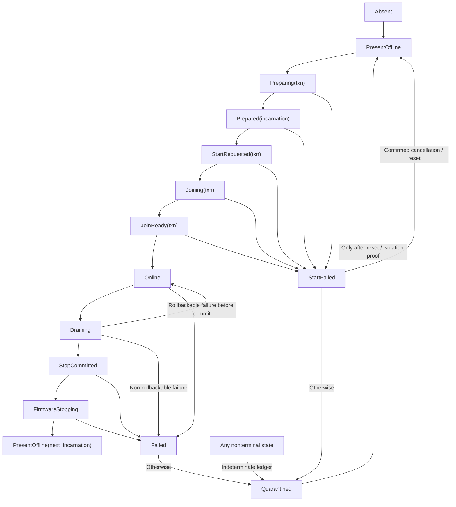

# Logical-CPU coordination and lifecycle

The best initial implementation is a **transactional logical-CPU state machine
with per-CPU request mailboxes and generation-checked acknowledgements**. CPU
start and removal are multi-component commits: firmware acceptance, secondary
entry, interrupt/timer readiness, translation participation, scheduler
admission, and final quiescence are distinct facts. Secondary entry atomically
claims an exact start transaction; stop uses an explicit commit/abort handoff.
Shared immutable snapshots serve reads; explicit messages serve infrequent
cross-CPU transitions.

This is proposed architecture, not an implementation claim. Linux CPU hotplug,
Arm PSCI, RISC-V SBI HSM, x86 system-programming rules, and multikernel research
provide mechanisms and precedent. They do not prove this state machine or its
failure behavior.

## Question, scope, and operational standard

The question is:

> How should a small capability kernel start, coordinate, drain, stop, and
> quarantine logical CPUs without treating firmware return, an online bitmap,
> or an IPI send as proof that a distributed transition completed?

The component owns:

- stable logical identity and per-start incarnation identity;
- allocation and protected publication of per-CPU kernel state;
- the architecture/platform start and stop backend;
- a common secondary-entry handshake;
- kernel-owned cross-CPU requests and acknowledgements;
- lifecycle dependency ordering, rollback, and quiescence evidence;
- immutable topology/feature/eligibility snapshots; and
- explicit failure, quarantine, and non-reclamation states.

It does not own:

- actor or thread placement, load balancing, work stealing, or NUMA policy;
- BEAM scheduler count and reduction policy;
- physical power rails, clock trees, thermal policy, or firmware internals;
- interrupt-device service, timer-queue policy, or virtual-memory allocation;
- application-visible CPU numbering as a stable ABI; or
- recovery policy after a CPU, cache, or coherency failure.

A satisfactory implementation must meet this operational standard:

1. No task, interrupt route, deadline channel, or cross-CPU request can target a
   CPU before the exact incarnation reaches `Online`.
2. A CPU cannot reach `Online` until mandatory features, entry/context state,
   translation generation, interrupt/IPI reception, raw timer channel, crash
   record, and scheduler admission prerequisites are acknowledged.
3. A CPU cannot reach reclaimable `Offline` until tasks, extended context,
   timers, interrupt routes, mailboxes, translation/code-publication duties,
   and CPU-local references are drained and platform stop is confirmed.
4. Every cross-CPU operation returns acknowledged, rejected, failed, and
   missing target sets. Timeout never becomes implicit success.
5. Stale requests, acknowledgements, firmware callbacks, or startup cookies
   from an earlier incarnation cannot mutate the new one.
6. Failure after the commit point produces quarantine and pinned state unless a
   stronger platform reset/isolation fact proves reclamation safe.
7. The design works for static SMP first and admits Arm PSCI, RISC-V SBI HSM,
   and x86 platform-specific bring-up without promising physical hot removal on
   every target.
8. Model and hardware tests force failures at every transition and show that
   safety invariants survive rollback, concurrent requests, and a silent CPU.

## Evidence, synthesis, and proposal

| Status | Claim |
| --- | --- |
| Reported engineering practice | Linux CPU hotplug is an ordered callback state machine with prepare, starting, and online regions, reverse teardown, and rollback on selected failures. Tasks, interrupts, and timers are migrated before architecture disable. |
| Normative interface fact | Arm PSCI `CPU_ON` is asynchronous, `CPU_OFF` is a non-returning self-operation on success, and `AFFINITY_INFO` exposes `ON`, `OFF`, and `ON_PENDING` races. |
| Normative interface fact | RISC-V SBI HSM defines started, stopped, start/stop-pending, suspended, and resume-pending states; hart start is asynchronous and enters with a constrained register/MMU state. |
| Reported systems research | Barrelfish demonstrates the benefit of making inter-core communication and replicated per-core state explicit, while also exposing distributed consistency costs. |
| Reported systems research | A big-lock seL4 prototype remained competitive on selected moderate-core workloads and substantially simpler than an unfinished fine-grained prototype; this is conditional evidence, not a many-core result. |
| Synthesis | Lifecycle and rare global transitions fit explicit request/ack protocols; CPU-local fast paths and read-mostly topology do not require a pure multikernel. |
| Project proposal | Use per-CPU lifecycle transactions, per-incarnation mailboxes, immutable membership snapshots, and two-phase drain/stop with an irreversible commit point. |
| Unverified | IPI tail latency, firmware timeout behavior, stop confirmation, heterogeneity rules, and safe CPU-local reclamation on chosen machines. |

## Identity, authority, and published views

### Three identities, not one integer

Keep these separate:

```text
HardwareCpuId   // MPIDR, APIC ID, hart ID, or platform descriptor
CpuId           // kernel-stable identity, never reused during one boot
CpuIncarnation  // monotonically advances on each accepted start attempt
```

Dense scheduler indexes are a fourth, ephemeral projection. A topology change
can rebuild that projection without changing `CpuId`. No public capability or
queued request contains a bare array index.

A handle is at least:

```text
CpuHandle { cpu_id, incarnation, lifecycle_generation }
```

Generation wrap is treated as exhaustion, not silent reuse. Boot-time limits
can make 64-bit generations practically nonwrapping, but the invariant remains
explicit.

### Lifecycle authority

Only a holder of `CpuLifecycleAuthority` may prepare, admit, drain, stop, or
quarantine CPUs. Attenuated rights can permit inspection or a reschedule IPI
without granting start/stop authority. Ordinary driver domains and BEAM
processes never receive raw IPI, APIC/GIC/IMSIC, PSCI, or SBI authority.

Cross-CPU requests are kernel mechanisms authorized by the semantic operation
that needs them—for example, an address-space transaction creates a typed TLB
request. A caller cannot submit arbitrary function pointers to another CPU.

### Membership and topology snapshots

Publish immutable snapshots by generation:

```text
CpuMembership {
  generation,
  lifecycle_states,      // CpuId -> state and exact transaction/incarnation
  present,
  online,
  requestable,
  scheduler_eligible,
  interrupt_targets,
}

CpuTopology {
  generation,
  hardware_ids,
  package_cluster_core_thread_relations,
  proximity_domains,
  feature_classes,
  cache_sharing_hints,
}
```

These sets differ. A CPU can be present but offline; online but temporarily
excluded from new scheduler placement during drain; or online yet ineligible
for a workload requiring an optional feature. Readers acquire one snapshot and
do not combine masks from different generations. One immutable
`CpuMembership` value is release-published atomically; the implementation never
publishes its masks one by one. Every observable generation maintains:

```text
requestable ⊆ online ⊆ present
scheduler_eligible ⊆ online
interrupt_targets ⊆ online
```

Topology is descriptive, not placement policy. Firmware proximity and cache
data are validated hints with provenance. The scheduler decides what to do
with them.

## Recommended lifecycle

### State machine



`StartRequested` means a backend accepted or began the request. `Joining`
means the CPU reached the kernel entry point and atomically claimed that exact
transaction. `JoinReady` means its local ledger passed but global admission has
not committed. None means `Online`.

`StopCommitted` is the irreversible kernel boundary: new work is already
excluded, the CPU declared itself locally quiescent, and rollback to `Online`
would require a new incarnation. Before that point, a failed drain can restore
routes and scheduler admission. After it, failure quarantines.

### Lifecycle dependency ledger

Each transaction holds a fixed, inspectable ledger rather than depending on
scattered callback order:

| Dependency | Start postcondition | Stop postcondition |
| --- | --- | --- |
| Entry/context | dedicated stack, vectors, CPU-local pointer, crash frame installed | no live task or extended-state owner; capture state sealed |
| Translation | bootstrap mappings valid; CPU joined current address-space generation | no active address-space membership or unacknowledged invalidation |
| Ordering/code | current code-publication generation acknowledged | cannot fetch retired code or retain publication obligation |
| Interrupts/IPI | kernel IPI source and bounded mailbox operational | removed as target; pending requests drained/rejected |
| Time | raw counter qualified for the CPU and deadline channel enabled | deadline disarmed; software timers transferred or failed |
| Scheduler | run/idle context prepared, but not yet externally eligible | no task, budget, or donation remains charged to CPU-local state |
| Diagnostics | preallocated crash record and emergency stack available | final lifecycle record persisted elsewhere |
| Platform | hardware/firmware start mechanism accepted | stopped/parked/isolation state confirmed to declared profile |

The ledger records `NotStarted`, `Prepared`, `Committed`, `RolledBack`, or
`Indeterminate` for each item. Rollback runs in reverse dependency order only
for steps whose reversal preconditions hold.

## Start transaction

### Phase 1: prepare on an online coordinator

Under the per-CPU lifecycle transaction lock:

1. validate `PresentOffline`, authority, hardware identity, and absence of a
   concurrent lifecycle transaction;
2. allocate or reinitialize CPU-local stacks, mailbox rings, interrupt/IPI
   state, deadline state, translation record, crash record, and idle context;
3. compare mandatory machine profile features with the target's immutable
   discovered feature set;
4. allocate a new incarnation and random/unguessable bootstrap cookie;
5. construct a read-only bootstrap descriptor with physical entry address,
   initial translation root, stack, CPU identity, incarnation, and cookie;
6. make code and data visible under the architecture publication contract; and
7. publish `Prepared` with release semantics.

The initial descriptor uses only memory reachable under the documented startup
translation state. It contains no pointer valid only in an address space the
secondary has not activated.

### Phase 2: request architecture/platform start

Invoke the backend exactly once per start transaction. The result distinguishes:

```text
AcceptedAsynchronous
AlreadyRunning
AlreadyPending
NotPresent
Disabled
InvalidEntry
Denied
Failed(reason)
```

An accepted result moves to `StartRequested(txn)` and starts a bounded
observation timer. `AlreadyRunning` is not success: it may identify a
firmware/kernel state disagreement and triggers reconciliation or quarantine.
`AlreadyPending` joins this observation path only when the backend can prove
that the pending request has the exact physical identity, entry descriptor, and
transaction cookie. Otherwise it is an unknown older request and the CPU is
quarantined rather than adopted.

### Phase 3: secondary early entry

The secondary begins in an architecture-defined partial environment. A small
assembly shim:

1. establishes the supplied stack and CPU-local base;
2. masks ordinary interrupts and normalizes privilege/control state;
3. validates `CpuId`, incarnation, and bootstrap cookie;
4. atomically claims `StartRequested(exact txn) -> Joining(exact txn)`;
5. activates the prepared translation state with required barriers;
6. installs common vectors and context ownership defaults; and
7. enters typed low-level code as `Joining`.

A stale or malformed cookie cannot attach the physical CPU to a newer
transaction. If the claim observes `StartFailed`, `Quarantined`, a different
transaction, or any state other than its exact `StartRequested`, it follows a
bounded park/stop/crash path and never activates ordinary kernel membership.
The path uses preallocated state and fails into the CPU-local crash record if
the common kernel is not safe to call.

### Phase 4: join protocols

The joining CPU performs local work and acknowledgements:

- validates mandatory features again from the executing CPU;
- initializes local interrupt reception and drains a test IPI;
- initializes/disarms its one-shot deadline channel and validates a test event;
- under the membership-admission gate, pins the current
  `TranslationCatchupGenerationState` and `CodePublicationGenerationState`,
  their exact architecture-profile program objects, and state/program digests;
- validates and executes both authorized catch-up programs, then publishes the
  exact translation and code observations for this CPU incarnation rather than
  merely acknowledging generation numbers;
- initializes extended-state ownership as disabled/scrubbed;
- enters the kernel lock/message protocol for its cluster;
- verifies crash capture; and
- reaches the idle context with no user task attached.

The joining CPU then release-transitions its exact transaction to `JoinReady`.
That state contains a checked `JoinReadyCatchupEvidence` naming both persistent
state incarnations, their committed generations and immutable state digests,
the executed translation/code program incarnations and digests, the observed
root/binding and fetch-reachable-set digests, and the CPU incarnation. The
membership gate rechecks all of those fields against the still-current states;
if either state advanced, the CPU repeats catch-up before it can become
eligible.
The coordinator checks every ledger item and constructs one new immutable
`CpuMembership` snapshot that changes that transaction from `JoinReady` to
`Online` and includes the permitted `online`, `requestable`,
`interrupt_targets`, and `scheduler_eligible` sets. Publishing the snapshot is
one compare-and-exchange against the expected prior generation. A timeout path
competes with a snapshot that changes the same exact `StartRequested`,
`Joining`, or `JoinReady` transaction to `StartFailed`/`Quarantined` while
leaving it excluded. Only one publication wins; membership can appear only in
the `Online` winner. `Online` is the commit result, not a firmware status.

### Start timeout and rollback

Before the target executes, a rejected request can roll back all prepared
memory. After firmware accepts an asynchronous start, a timeout is ambiguous:
the target may still begin later. The coordinator first queries the backend if
possible, sends an architecture wake/diagnostic request, and waits through a
profile-defined grace interval. It then either:

- completes join if the correct incarnation appears;
- requests stop if the platform provides a safe pending-start cancellation;
- quarantines the hardware identity and pins bootstrap/per-CPU state; or
- stops the machine when late execution could violate kernel integrity.

It never frees the bootstrap stack merely because the timeout expired. Before
publishing a terminal timeout outcome, the coordinator atomically moves the
exact transaction out of whichever pre-online state it still occupies
(`StartRequested`, `Joining`, or `JoinReady`) into `StartFailed` and then
`Quarantined` when cancellation is unproved. A CPU already joining rechecks the
transaction between bounded join phases and before `JoinReady`; if the timeout
publication won, it enters the bounded park/stop/crash path. If the atomic
`Online` membership publication won, timeout may no longer demote that
incarnation through the start-failure path. A late CPU still holding the pinned
cookie likewise fails the exact-transaction claim instead of joining.

## Cross-CPU request fabric

### Request shape

Use bounded, preallocated per-target mailboxes:

```text
CpuRequest {
  request_kind,
  target: CpuHandle,
  request_sequence,
  operation_generation,
  payload_handle,
  completion_slot,
  urgency_class,
}
```

Payloads are typed handles to already validated, lifetime-pinned operation
records. A mailbox does not carry raw kernel pointers with unbounded lifetime.

Representative kinds are:

- translation invalidate and quiescence;
- executable-code publication/retirement;
- reschedule;
- timer-queue re-evaluation;
- interrupt-route migration rendezvous;
- diagnostic capture;
- enter lifecycle quiescence; and
- terminal stop.

### Send and acknowledgement

The sender snapshots the target set and exact incarnations, reserves completion
slots, publishes requests with release semantics, then sends the appropriate
IPI/wakeup. The target drains with acquire semantics and returns one of:

```text
Completed(epoch)
RejectedStale
RejectedState(current_state)
Failed(reason)
```

The aggregate result is:

```text
CpuCompletion {
  completed,
  rejected,
  failed,
  missing,
  operation_epoch,
}
```

For a protection transition, any `missing` target keeps reclamation pending.
The policy layer can retry, quarantine, or panic, but this component does not
convert missing acknowledgements into completion.

### Boundedness and priority

Separate at least an emergency kernel lane from ordinary reschedule requests.
Translation revocation and lifecycle stop cannot wait behind an unbounded flood
of low-value nudges. Queue-full behavior is explicit: coalesce reschedules,
merge compatible invalidation ranges within a bound, or make the sender retry;
never overwrite an unconsumed protection request.

The hard IPI path only marks/drains bounded records and invokes operations
declared safe for that context. Long work is split or deferred. Mailbox and IPI
telemetry includes high-water marks, coalescing, retries, and tail latency.

### Shared state and messages

Do not force a pure model:

- CPU-local counters, queues, current context, timer state, and crash state
  remain local;
- membership/topology/feature data is immutable by generation;
- short privileged critical sections may initially use one measured lock per
  tightly coupled cluster;
- protection-changing remote effects use requests and acknowledgements; and
- cross-cluster or heterogeneous coordination never relies on accidental cache
  sharing.

This keeps the multikernel's visibility lesson while avoiding a distributed
protocol for every read. The cluster lock is an initial engineering choice,
not a portability guarantee; contention thresholds trigger redesign.

## Offline transaction

### Phase 1: stop new admission

With the CPU still executing normally:

1. acquire lifecycle authority and move `Online -> Draining`;
2. publish new membership snapshots that exclude the incarnation from new task
   placement, interrupt affinity, timer placement, and ordinary requests;
3. retain an emergency request path for drain, diagnostics, and stop; and
4. request a generic lifecycle-participant quiescence proof from the minimal
   kernel and registered services; those participants, not this architecture
   transaction, choose migration, termination, or refusal for CPU-affine work.

This phase is reversible. If migration fails before `StopCommitted`, the
coordinator can restore the old published eligibility generation.

### Phase 2: drain dependencies

Drain in a dependency-aware order:

- migrate runnable and blocked execution contexts, or fail explicit hard
  affinity requests;
- save/scrub any CPU-owned FP/SIMD/vector/debug state;
- transfer the software timer queue and disarm the local deadline channel;
- mask and migrate device interrupts, then synchronize old delivery;
- finish, redirect, or reject queued cross-CPU requests;
- remove the CPU from active address-space and code-publication sets after all
  required acknowledgements;
- release cluster locks/read-side epochs and deferred-reclamation references;
- migrate watchdog/recovery duties to independently budgeted CPUs; and
- persist the final local diagnostic summary outside reclaimable CPU memory.

A subsystem reports `Drained`, `Busy(reason)`, `Failed(reason)`, or
`Indeterminate`. `Busy` before commit can trigger rollback. `Indeterminate`
cannot: it immediately excludes the CPU from all ordinary target sets,
transitions the transaction to `Quarantined`, and pins every dependency whose
ownership is uncertain.

### Phase 3: local quiescence and commit

The target CPU receives `EnterQuiescence`, switches to a dedicated stop stack,
disables new ordinary work, drains its emergency mailbox, verifies all local
ownership slots empty, and writes a release-ordered `Quiescent(incarnation,
ledger_generation)` acknowledgement.

The immutable lifecycle entry and stop decision are one atomic state, not two
separately published words:

```text
StopGate(incarnation, ledger_generation) =
    DrainingPending
  | AbortPrepare(expected_membership_generation)
  | StopCommitted
```

After acknowledging quiescence, the target remains on the stop stack and
acquire-observes this exact-generation gate or an equivalent generation-tagged emergency
request. If the coordinator rejects the ledger before commit, it first
reserves a new membership generation and release-publishes
`AbortPrepare(expected_generation)`. The target restores its local precommit
state but remains excluded, then publishes `AbortReady(expected_generation)`.
Only after that acknowledgement does the coordinator publish the immutable
membership snapshot that includes the CPU. The target acquire-observes that
exact snapshot, leaves the stop path, and reports `DrainAborted`; work published
in the small handoff window waits in the already-restored bounded mailbox. If
the ledger is valid, the coordinator atomically compare-and-exchanges
`DrainingPending -> StopCommitted`; only that exact incarnation may then
proceed to self-stop. There is no state in which lifecycle says committed while
the decision still permits abort. After `StopCommitted`, ordinary execution
cannot resume under the same incarnation.

If the original coordinator fails, only a designated recovery coordinator with
lifecycle authority may compare-and-exchange `DrainingPending` after
revalidating the ledger. Once `AbortPrepare` exists, recovery may only finish
that abort handshake (or quarantine it), never convert it to `StopCommitted`.
Once `StopCommitted` exists, recovery may only finish platform stop or
quarantine, never abort. Until an authorized decision and, for abort, the
expected membership publication appears, the target stays in its bounded
quiescent/abort-ready park; it neither resumes nor self-stops. Timeout or a
post-commit backend failure transitions through `Failed` to `Quarantined` and
preserves the gate/ledger evidence.

### Phase 4: platform stop and confirmation

The target executes the backend self-stop where required. Because success may
not return, the coordinator uses a separate platform state query, mailbox
silence is not proof. Outcomes are:

- `StoppedConfirmed`: advance to `PresentOffline` and retire the incarnation;
- `ParkedConfirmed`: retain bounded CPU-local backing required by the park
  loop; this supports logical offline but not physical reclamation;
- `StopRejected`: quarantine; the CPU must remain outside all target sets;
- `StopTimeoutUnknown`: quarantine and pin all memory it may reach; or
- `ResumedUnexpectedly`: enter crash-safe capture and escalate machine-wide.

Per-CPU memory becomes reclaimable only after both kernel quiescence and the
backend profile's stop/isolation condition. Where hardware cannot prove that a
logical CPU will no longer read its old stack or page tables, keep a small
permanent allocation rather than manufacture safe reclamation.

## Cross-ISA realization

| Concern | x86-64 | AArch64 | RISC-V |
| --- | --- | --- | --- |
| Hardware identity | APIC/x2APIC and firmware topology identifiers | MPIDR affinity plus firmware description | hart ID plus firmware description |
| Start mechanism | local-APIC startup sequence plus platform/firmware conventions; initial execution mode is architecture-specific | PSCI `CPU_ON` through SMC/HVC on the common profile | SBI HSM `hart_start` or a declared platform mechanism |
| Accepted versus online | startup delivery does not replace secondary handshake | `CPU_ON` is explicitly asynchronous and can return pending/already-on | `hart_start` is explicitly asynchronous with `START_PENDING` state |
| Stop mechanism | portable physical off is not uniform; initial profile may park a logically offline CPU | target calls non-returning PSCI `CPU_OFF`; coordinator may query affinity state | target calls HSM `hart_stop`; coordinator queries hart status |
| Initial context | legacy startup sequence and transition to long mode are backend work | PSCI-defined entry state, with kernel shim establishing common state | HSM starts with `satp=0`, supervisor interrupts disabled, and most registers undefined |
| IPI | local APIC IPI | GIC SGI or declared equivalent | IMSIC/AIA or SBI IPI depending on profile |

### x86-64 recommendation

For the first x86 port, enumerate and start all supported logical CPUs during
controlled boot, then implement **logical parking** before attempting physical
hot removal. The backend owns INIT/startup sequencing, transition from the
startup execution mode, APIC identity, and per-CPU entry tables. Platform ACPI
or hypervisor interfaces remain declared dependencies.

Parking still runs code and retains memory, so it is not `StoppedConfirmed`.
It is nevertheless useful for validating admission, drain, mailbox, and
incarnation logic without claiming a nonexistent universal power-off contract.

### AArch64 recommendation

Use PSCI 1.x where the platform profile provides it. Preserve the distinction
among request acceptance, `ON_PENDING`, target secondary handshake, kernel
`Online`, local quiescence, `CPU_OFF`, and `AFFINITY_INFO == OFF`. PSCI owns the
specified platform cache/coherency work; the kernel owns all service and
resource drain before the call.

PSCI errors and firmware latency are first-class. `ALREADY_ON` during a new
incarnation is a reconciliation fault, not a reason to publish online.

### RISC-V recommendation

Use ratified SBI HSM where present, pinned to a tested SBI provider/version.
The kernel secondary entry must cope with `satp=0`, disabled supervisor
interrupts, and undefined general registers except the specified hart/opaque
values. The opaque value carries an indirect generation-checked bootstrap
cookie, not ambient authority.

The HSM state machine maps well to the backend portion of this design, but
kernel `Online` and quiescent/reclaimable `Offline` remain stronger states.

## Heterogeneity and topology change

Define a mandatory machine profile and optional execution classes:

```text
MachineRequired = { privilege, atomics, translation, counter, interrupt, ... }
CpuClass(id)     = MachineRequired + OptionalFeatureSet + locality facts
```

A CPU missing `MachineRequired` never joins. An optional difference—vector
length, matrix state, cryptographic acceleration, performance-monitoring
features—creates an eligibility class. The scheduler/runtime can place only
compatible contexts there. A context carrying unsaved feature state cannot
migrate to an incompatible CPU.

Do not mutate the global feature profile when a new CPU arrives. Build and
publish a new topology generation, then admit only after every consumer has
accepted or safely ignored the change. Hot-added physical packages remain a
later optional profile because memory, interrupt-controller, and firmware
topology change extends beyond CPU start alone.

## Interaction with the managed runtime

BEAM scheduler threads and logical CPUs are intentionally not one object:

- runtime scheduler count and placement remain user-level runtime policy;
- an online CPU may run kernel work or native services without hosting a BEAM
  scheduler;
- the runtime receives topology/eligibility snapshots and lifecycle events
  through a system service, not raw hardware identifiers or IPIs;
- drain asks the runtime supervisor to move scheduler work and reports failure
  if a pinned native resource cannot move;
- lightweight BEAM processes remain runtime-managed and do not become kernel
  CPU-affine entities by default; and
- actor supervision reacts to a lost runtime scheduler/domain, while the
  kernel separately contains or escalates the physical CPU failure.

This preserves OTP-style fault observation without pretending a failed core is
an ordinary actor. Process-local tracing garbage collection remains in the
runtime and must be stopped/saved through normal context quiescence, not moved
into CPU lifecycle code.

## Safety, security, and failure analysis

### Silent or wedged CPU

An IPI timeout proves only absence of an acknowledgement. The CPU may be
masked, wedged, executing corrupted code, powered down, or disconnected. The
component records its last acknowledged request and lifecycle epoch, tries only
bounded profile-approved diagnostic/NMI/wakeup actions, and then returns
`missing`.

Remove the CPU from new target sets if safely possible, but retain every object
it could still reach. A stale TLB, page-table pointer, code reference, or DMA
coordination role can make machine-wide reclamation unsafe. Recovery chooses
quarantine, platform reset/isolation, or halt.

### Firmware disagreement

Firmware is an explicit trusted dependency. Detect:

- firmware reports `OFF` while the kernel receives a request/interrupt from the
  incarnation;
- firmware reports `ON` for a supposedly stopped previous incarnation;
- a start enters with the wrong cookie or entry state;
- state queries oscillate or time out; and
- firmware returns success for an unsupported topology/feature combination.

Such disagreement creates a diagnostic record and quarantine. The kernel does
not repair it by rewriting its online bitmap.

### Stale request and ABA attacks

Every request, completion, startup cookie, timer token, interrupt route, and
translation membership carries the CPU incarnation. A late IPI for incarnation
N is rejected after N+1 starts. Mailbox storage is reinitialized only after old
delivery is either impossible or the incarnation check makes it harmless.

### Authority and denial of service

Lifecycle calls are capability-controlled and rate-limited. Starting/stopping a
CPU consumes bounded kernel memory and can cause global coordination, so it is
not exposed as a cheap untrusted operation. Mailboxes charge requests to the
originating operation and reserve emergency capacity for protection and
recovery.

### Shared microarchitecture

Offlining one logical thread does not necessarily remove its sibling's shared
core, cache, predictor, package, or power domain. The topology/profile records
what the backend actually controls. Quarantine of a CPU with suspected shared-
cache/coherency corruption may require quarantining a larger failure domain or
stopping the machine.

## Verification strategy

### State-machine model

Model at least two CPUs, one coordinator failure, and one reused physical CPU.
Explore:

- concurrent start/start, start/stop, and stop/start requests;
- asynchronous firmware acceptance and late secondary entry;
- failure at every ledger step and failure during rollback;
- old-incarnation IPIs and acknowledgements after restart;
- timer, interrupt, context, and translation drain racing offline;
- coordinator CPU itself entering drain;
- mailbox full, coalescing, and emergency-lane exhaustion;
- target silence before and after `StopCommitted`; and
- topology snapshot readers spanning publication.

Safety properties include:

- `scheduler_eligible ⊆ online` and `interrupt_targets ⊆ online`;
- no two live incarnations for one `CpuId`;
- no reclaimed object reachable from a non-confirmed-stopped CPU;
- no protection completion containing a missing target;
- no ordinary request admitted after `Draining` publication; and
- `Online` implies every mandatory start-ledger predicate.

Liveness is conditional: a responding CPU, functioning IPI path, and compliant
firmware eventually complete start/stop. A permanently silent CPU is allowed to
leave the system quarantined rather than violate safety.

### Implementation tests

- Use a model backend that delays/reorders firmware callbacks and IPIs.
- Inject a crash or returned error after every start/stop ledger operation.
- Force a secondary to arrive after coordinator timeout.
- Reuse the same hardware CPU repeatedly and replay old requests.
- Exhaust mailbox lanes and completion slots.
- Offline during TLB shootdown, code publication, timer fire, interrupt
  migration, FP/vector ownership, and runtime scheduler activity.
- Confirm all rollback paths restore consistent published target sets.
- Verify generated entry code and publication/acquire ordering on every ISA.

### Emulator and hardware matrix

At minimum:

- QEMU/virtual platforms for deterministic fault injection on x86-64,
  AArch64/PSCI, and RISC-V/SBI HSM;
- one physical machine per port for cache/coherency, IPI, timer, and firmware
  behavior;
- SMT and non-SMT x86 cases;
- an Arm multicore/cluster case; and
- a RISC-V system where SBI version and provider are pinned.

Record firmware/hypervisor version, topology, CPU features, start/stop method,
and whether “offline” means parked or physically stopped.

### Benchmarks

Measure:

- local and remote IPI enqueue-to-entry and enqueue-to-ack distributions;
- request batching/coalescing and mailbox cache traffic;
- static-SMP boot time per CPU and parallel-start scaling;
- drain, rollback, park, and confirmed-stop latency by dependency;
- global pause time during membership publication;
- cluster-lock hold/contended time under BEAM IPC, fault, and timer load;
- per-CPU memory retained by offline and quarantined states;
- TLB/code-publication completion during concurrent lifecycle activity; and
- application/runtime throughput before, during, and after CPU topology change.

Tail and failure data matter more than an average start time.

## Staged implementation

### Stage 0: executable lifecycle model

Implement the full states, ledger, incarnation rules, and adversarial backend
before real SMP. Treat the boot CPU as an already joined incarnation whose
ledger is reconstructed and checked.

### Stage 1: static homogeneous SMP

Start all CPUs during boot, create per-CPU mailboxes, deliver reschedule and
diagnostic requests, and publish one immutable membership snapshot. No runtime
offline yet.

### Stage 2: protection acknowledgements

Use the request fabric for TLB invalidation and code publication with explicit
completion sets. Add timer and interrupt-route integration. This proves the
coordination mechanism before lifecycle mutation.

### Stage 3: logical drain and park

Implement scheduler/runtime drain, extended-state save, timer transfer,
interrupt migration, request rejection, `StopCommitted`, and a platform-
independent park loop. Keep per-CPU memory permanently allocated.

### Stage 4: firmware stop/start

Add PSCI, SBI HSM, or a narrowly pinned x86 platform backend; distinguish
accepted, joined, stopped-confirmed, parked, and unknown. Exercise late entry
and stop timeout fault injection.

### Stage 5: heterogeneity and hot addition

Only after the homogeneous lifecycle is stable, add feature classes, changing
present sets, physical topology update, and platform memory/controller
dependencies.

## Alternatives and tradeoffs

| Alternative | Advantage | Rejected or deferred because |
| --- | --- | --- |
| Permanent static CPU set | smallest implementation and proof surface | valid first milestone but cannot support fault quarantine, power transitions, or later hotplug goals |
| One mutable global online bitmap | cheap lookup | cannot represent preparation, draining, pending firmware, eligibility, incarnation, or failure evidence |
| Firmware return means online/offline | minimal handshake | PSCI/SBI starts are asynchronous and stop success may not return; kernel dependencies remain separate |
| Generic callbacks with implicit order | easy subsystem extension | hides cross-component invariants and rollback obligations; a typed ledger/DAG is auditable |
| Pure shared-memory coordination | low local overhead on small coherent systems | makes remote completion and failed CPUs implicit and risks global lock coupling |
| Pure per-core multikernel | explicit and scalable communication | adds distributed agreement for simple shared facts and is not justified for every object |
| Fine-grained kernel locking from the outset | possible disjoint-object scaling | larger assurance surface before workload evidence; a measured cluster lock is a simpler initial choice |
| Reclaim CPU-local memory immediately after logical offline | saves memory | unsafe when the physical CPU is merely parked or stop confirmation is ambiguous |
| Expose hardware CPU IDs to applications | simple affinity API | creates an unstable ambient identifier and leaks platform topology into kernel ABI |
| Treat CPU failure like an actor exit | aesthetically uniform supervision | CPU/coherency failure can invalidate the substrate needed by the supervisor itself |

## Unresolved questions

- Which first platform gives a trustworthy stop confirmation rather than only a
  logical park, and what memory remains reachable in each state?
- Can the lifecycle coordinator itself migrate without introducing a hidden
  boot-CPU dependency?
- Which kernel lock/epoch mechanism permits immutable membership publication
  while CPUs enter/leave protection target sets?
- How should an unresponsive target in an active address space affect the
  global recovery decision: quarantine memory, reset a package, or halt?
- What mailbox capacity and emergency priorities are sufficient under combined
  shootdown, interrupt, timer, and runtime pressure?
- Which optional CPU features can be context-classified safely, and which must
  remain machine-wide requirements?
- What interface should tell the BEAM runtime about topology change without
  making physical CPUs part of its compatibility ABI?
- Can platform firmware state be independently cross-checked with controller
  observations on each chosen target?
- How should suspend/resume compose with ordinary offline when firmware uses
  overlapping states?

## Connections

- [Kernel hardware and architecture support layer](../kernel-hardware-and-architecture-support-layer.md) — places CPU lifecycle among translation, interrupt, time, and fault components.
- [Typed kernel-facing architecture facade](typed-kernel-facing-architecture-facade.md) — provides the typed handles, completion sets, and explicit failure vocabulary used here.
- [Raw time and deadline programming](raw-time-and-deadline-programming.md) — supplies lifecycle timeouts and per-CPU channels that must be created and drained.
- [Address translation and protection transitions](address-translation-and-protection-transitions.md) — depends on exact active-CPU sets and cannot reclaim through a missing target.
- [Minimal privileged kernel layer](../minimal-privileged-kernel-layer.md) — defines protection domains, execution stop, budgets, and teardown that consume this mechanism.
- [BEAM, ERTS, and OTP principles for a new operating system](../beam-erts-and-otp-principles-for-a-new-operating-system.md) — distinguishes kernel CPU resources from runtime schedulers and lightweight processes.
- [Kernel hardware-contract inquiry](../../40-inquiries/what-contract-should-the-kernel-hardware-and-architecture-layer-provide.md) — remains open pending implementation and fault-injection evidence.

## Sources

- [Linux kernel low-level core API documentation](../../30-sources/linux-kernel-community-2026-low-level-core-apis.md) — ordered CPU-hotplug states, subsystem migration, teardown, and rollback precedent.
- [Arm Power State Coordination Interface 1.3](../../30-sources/arm-2024-power-state-coordination-interface.md) — asynchronous start, self-stop, affinity state, and firmware/OS race contract.
- [RISC-V supervisor binary interface](../../30-sources/risc-v-international-2025-supervisor-binary-interface.md) — ratified higher-privilege interface whose HSM, IPI, and remote-fence mechanisms back a RISC-V port.
- [Intel 64 and IA-32 system programming documentation](../../30-sources/intel-2026-system-programming-documentation.md) — multiprocessor startup, APIC, execution-state, and feature mechanisms for x86-64.
- [Arm A-profile system architecture documentation](../../30-sources/arm-2026-a-profile-system-architecture-documentation.md) — exception, coherency, counter, and per-PE state that a PSCI-backed port must normalize.
- [RISC-V privileged architecture](../../30-sources/risc-v-international-2026-privileged-architecture.md) — hart privilege, translation, interrupt, and optional-feature boundary below SBI.
- [The Multikernel](../../30-sources/baumann-et-al-2009-multikernel.md) — evidence for explicit inter-core messages, replicated state, and heterogeneous hardware awareness.
- [For a microkernel, a big lock is fine](../../30-sources/peters-et-al-2015-big-lock-microkernel.md) — conditional evidence for a simple cluster-level locking baseline on moderate core counts.
- [Scheduling-context capabilities](../../30-sources/lyons-et-al-2018-scheduling-context-capabilities.md) — shows the CPU-budget and donation state that must drain separately from raw CPU mechanism.
