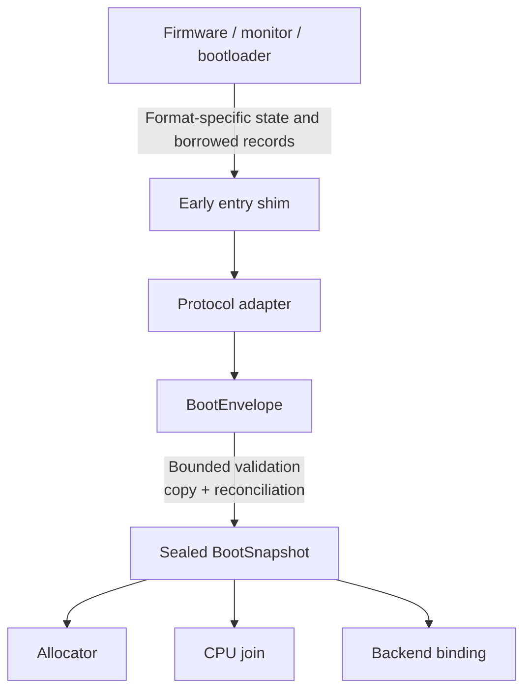
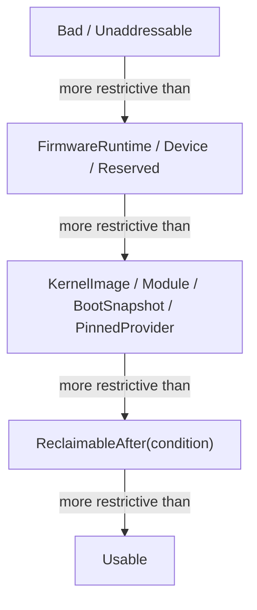
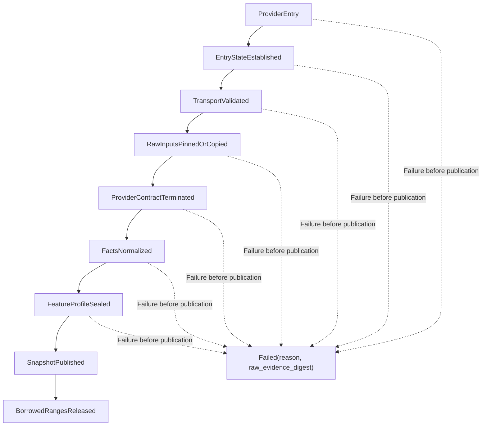

# Normalized boot handoff and feature discovery

The recommended implementation is a **two-boundary boot pipeline**: a small
protocol adapter terminates the firmware or bootloader contract and emits one
bounded, relocatable `BootEnvelope`; a protocol-independent normalizer then
validates, copies, reconciles, and seals a kernel-owned `BootSnapshot`. The
portable kernel never follows firmware pointers, interprets ACPI or device-tree
records, or guesses CPU features on an allocator or scheduler fast path.

This is component 0 of the [kernel hardware and architecture support
layer](../kernel-hardware-and-architecture-support-layer.md). It establishes
initial facts and provenance. It does not select scheduling, allocation,
driver, power, or BEAM-runtime policy.

## Question, scope, and operational standard

The implementation question is:

> How should a kernel accept mutually different and partly untrusted boot
> descriptions, establish the machine state it actually owns, and publish a
> deterministic feature profile without importing firmware parsing into the
> rest of the trusted kernel?

The component is satisfactory only when all of the following are demonstrated:

- UEFI/ACPI, flattened device tree, and one loader-native protocol can enter
  through separate adapters and produce the same normalized semantics for an
  equivalent virtual machine;
- all input lengths, offsets, pointer ranges, alignments, integer additions,
  record counts, string termination, nesting, checksums where specified, and
  cross-record references are validated before use;
- the final memory view is sorted, non-overlapping, typed, and conservative;
  no contradictory or unknown range becomes allocatable;
- every retained byte is copied into kernel-owned memory or is represented by
  a pinned lease whose provider and release condition are explicit;
- architectural features are confirmed with CPU-local mechanisms and accepted
  by policy, not inferred from a vendor, ISA family, firmware string, or boot
  CPU alone;
- the sealed snapshot is immutable and auditable, including the original
  source revisions, hashes, validation warnings, discarded claims, and
  conflict records;
- parser work is bounded before a general allocator exists and survives a
  malicious corpus under sanitizers, fuzzing, and emulator fault injection;
- a secondary CPU cannot join merely because firmware listed it; component 7
  must independently check that CPU against the sealed mandatory profile; and
- a failed handoff stops in a minimal crash-safe path with a reason code. It
  does not continue with a guessed amount of RAM or a guessed interrupt
  controller.

“Normalized” means common postconditions, not loss of provenance. ACPI, device
tree, loader records, and direct architectural discovery sometimes describe
different things. The snapshot records those differences rather than forcing
one input to masquerade as another.

## Evidence and synthesis

### Normative interface evidence

UEFI 2.11 makes the memory-map handoff a transaction. `GetMemoryMap()` returns
both a map key and a descriptor stride/version; `ExitBootServices()` succeeds
only with the current key, after which boot-services pointers are invalid and
some memory changes ownership. A kernel that caches the first map or assumes a
compiled descriptor size has not implemented the specified lifetime contract.
See the [UEFI 2.11 source note](../../30-sources/uefi-forum-2024-uefi-2-11.md).

ACPI 6.6 supplies length-delimited, checksummed static tables for CPU,
interrupt, memory-affinity, and other platform facts, while its AML namespace
can execute platform methods. This is evidence for separating a small early
allowlist of static discovery from a later, isolated firmware-policy service.
It is not evidence that a checksum makes firmware trustworthy. See the
[ACPI 6.6 source note](../../30-sources/uefi-forum-2025-acpi-6-6.md).

The flattened device-tree format has its own total size, block offsets, token
grammar, string offsets, inherited address/size cell widths, and two forms of
memory reservation. Those facts require a real bounded parser; casting the
blob to host structures is not a parser. See the [Devicetree 0.4 source
note](../../30-sources/devicetree-org-2023-devicetree-specification-0-4.md).

The current Limine protocol is useful engineering precedent for versioned
requests, optional responses, cross-ISA entry ABIs, and explicit
bootloader-reclaimable memory. Its revisions also demonstrate why revision
numbers must select semantics, not just structure layout. It remains an adapter
input, not the kernel's internal format. See the [Limine protocol source
note](../../30-sources/limine-project-2026-limine-boot-protocol.md).

### Security evidence and the justified inference

BootStomp found exploitable bugs in real mobile bootloaders using static and
symbolic analysis. Its direct result concerns bootloader implementations, not
UEFI tables handed to this kernel. The justified design inference is that
authenticated early code and data still deserve hostile-input discipline:
verification of one image does not prove every subsequent parser or state
transition safe. See the [BootStomp source
note](../../30-sources/redini-et-al-2017-bootstomp.md).

The architecture manuals independently show that important facts are
CPU-local or mechanism-specific: x86 extended state and address widths,
AArch64 exception and translation features, and RISC-V delegated privilege and
optional extensions cannot be established solely by a platform-description
table. See the [Intel](../../30-sources/intel-2026-system-programming-documentation.md),
[Arm](../../30-sources/arm-2026-a-profile-system-architecture-documentation.md),
and [RISC-V](../../30-sources/risc-v-international-2026-privileged-architecture.md)
source notes.

### Synthesis

No reviewed source specifies this project's `BootSnapshot`. The proposal below
combines four observations:

1. transport formats have different ownership and version rules;
2. platform tables and direct CPU discovery have different authority;
3. the allocator needs a conservative interval partition, not a bag of
   overlapping claims; and
4. later components need typed descriptors and an immutable security profile,
   not continued access to parser internals.

The result is a project design, not experimental evidence.

## Recommended architecture



### Boundary A: terminate the provider contract

Each supported route has one adapter:

- `uefi_acpi_adapter` obtains the final UEFI map, successfully exits boot
  services, copies the allowed static ACPI tables, and records any retained
  runtime-service ranges and call gate;
- `fdt_adapter` validates and copies the flattened tree and its reservation
  data, then resolves only a pinned allowlist of bindings needed to establish
  memory, CPU candidates, interrupt/time descriptors, and firmware gates; and
- `native_loader_adapter` converts the pinned version of Limine, Multiboot2, or
  a future project loader protocol without allowing that format to become the
  kernel ABI.

An adapter may run in a separate loader image or as discardable early kernel
code. A separate image reduces the resident kernel surface but is still part
of the measured and trusted boot chain. In-kernel adapters simplify debugging
and direct boot but enlarge privileged early code. The common output and test
suite should be identical in either placement.

### Boundary B: normalize without provider callbacks

The normalizer is a deterministic, side-effect-free transformation except for
allocations from one pre-reserved scratch arena. It accepts only an
`EnvelopeView` whose entire byte range has already been proved addressable. It
does not call firmware, probe devices, start CPUs, or execute AML.

The recommended native envelope has this shape conceptually:

```text
BootEnvelopeHeader {
    magic,
    format_major,
    format_minor,
    header_bytes,
    total_bytes,
    record_count,
    critical_feature_bits,
    payload_digest,
}

BootRecord {
    kind,
    revision,
    flags: { critical, repeatable },
    byte_length,
    payload_offset,
}
```

Records contain fixed-endian scalars and offsets from the envelope base, never
provider virtual pointers. Every record is length-delimited and aligned to a
declared boundary. Unknown non-critical records are preserved as opaque
provenance and ignored; unknown critical records reject the handoff. Duplicate
singletons, overlapping records, backwards offsets, and count/length products
that overflow are errors.

The digest detects accidental mutation between adapter and normalizer; it does
not authenticate the provider. Authentication belongs to the measured or
verified boot chain and must be recorded separately as a claim with its
verifier identity.

## The sealed `BootSnapshot`

The public snapshot should contain values, provenance, and limitations:

```text
BootSnapshot {
    provenance: BootProvenance,
    memory: CanonicalExtent[],
    boot_cpu: BootCpuFact,
    cpu_candidates: CpuCandidate[],
    topology: TopologyFacts,
    mechanisms: MechanismDescriptor[],
    firmware_gates: FirmwareGateDescriptor[],
    modules: BootModule[],
    kernel_required_profile: KernelRequiredProfile,
    boot_cpu_feature_evidence: CpuFeatureEvidence<BootCpuIncarnation>,
    retained_ranges: RetainedRange[],
    conflicts: ConflictRecord[],
    warnings: ValidationWarning[],
}
```

`BootProvenance` pins adapter build identity, input protocol and revision,
firmware/loader-reported identity, raw-input digests, secure/measured-boot
claims, and whether execution is native, virtualized, or under a retained
monitor. Strings are diagnostic facts, never authorization.

### Memory normalization

Every range first becomes a checked half-open interval `[base, end)`. The
normalizer rejects arithmetic wrap and constructs a sweep over all endpoints.
Each resulting non-overlapping segment retains all claims that cover it and is
classified by a conservative lattice:



“Greater” means more restrictive. Conflicting claims never resolve downward to
`Usable`; they produce `ReservedConflict` plus a record containing both
sources. Unmentioned physical addresses are `Unknown`, not RAM. Usable extents
are rounded inward to allocator granules. Reserved extents that protect bytes
are rounded outward in the allocator's page view, while the original byte
interval remains available for diagnosis.

The adapter first identifies which format is authoritative for **positive** RAM
discovery. Under UEFI, only the successful final UEFI memory map can seed
`Usable`; a device-tree `/memory` node cannot add RAM. Under a direct
device-tree profile, its validated memory nodes can seed candidates. Other
sources may restrict the result but never enlarge it. This is deliberately
stricter than choosing one source as globally authoritative for every purpose:
a device-tree `/reserved-memory` range overlapping UEFI conventional memory
produces reserved memory with both provenance records.

`ReclaimableAfter` names a condition, not a time guess:

- `BootEnvelopeCopiedAndSnapshotSealed`;
- `AcpiStaticTablesCopied`;
- `InitialModulesConsumed`;
- `FirmwareRuntimeDisabled`; or
- another explicit future completion token.

The frame allocator receives only extents whose condition has completed.

### CPU identity and feature discovery

Firmware supplies **CPU candidates** and topology hints. The running boot CPU
supplies direct architectural evidence. The adapter records the provider's
hardware identifier; the early architecture backend reads its own identifier
and rejects a mismatch or records an explicitly understood alias.

Feature discovery separates machine-wide requirements from evidence about one
CPU incarnation:

```text
KernelRequiredProfile {
    mandatory_features: FeatureSet,
    mandatory_mitigations: MitigationSet,
    globally_disabled_features: FeatureSet,
}

CpuFeatureEvidence<CpuIncarnation> {
    cpu_id,
    cpu_incarnation,
    evidence_generation,
    architecturally_present: FeatureSet,
    enabled_and_self_tested: FeatureSet,
    locally_disabled_or_errata: FeatureSet,
}
```

For the boot CPU, each feature passes through:


Failure at `ArchitecturallyConfirmed`, `Enabled`, or `SelfTested` either selects
a declared fallback before sealing or stops boot. A firmware table can locate
a timer or interrupt controller, but direct architectural registers determine
whether an instruction or execution-state extension is present. Security
errata can add a machine-wide mitigation/disable rule or place one CPU feature
in `locally_disabled_or_errata`; those facts are not merged into one global
optional-feature set.

Secondary CPUs are not assumed homogeneous. Component 7 repeats local
discovery and may admit a CPU only if its new
`CpuFeatureEvidence<CpuIncarnation>` satisfies `mandatory_features` and can
apply `mandatory_mitigations`. Component 7 generation-publishes the online CPU
evidence and eligibility classes. Optional asymmetry becomes an explicit
scheduling-eligibility fact rather than a mutation of `BootSnapshot`.

### Mechanism descriptors, not initialized drivers

A descriptor identifies a candidate mechanism and how to bind its backend:

```text
MechanismDescriptor {
    class: InterruptController | RawTimer | Iommu | Console | CrashSink,
    source_record,
    instance_identity,
    register_extents,
    interrupt_relationships,
    dma_requester_relationships,
    compatibility_ids,
    limits,
}
```

The snapshot does not map registers, acknowledge interrupts, or choose a
driver. Later capability-authorized components validate a descriptor against
their supported backend and create the actual object. A descriptor is
descriptive input, not MMIO authority.

Firmware calls that remain necessary—such as PSCI- or SBI-like CPU startup,
reset, or a UEFI runtime service—appear as typed `FirmwareGateDescriptor`s with
provider version, call IDs, shared-memory ranges, serialization, re-entrancy,
timeout, and trust status. There is no generic “call firmware” pointer.

## Lifecycle and state machine



Publication is a one-way transition. The snapshot is mapped read-only after
the allocator and translation component can enforce that property. Later hot
plug, firmware events, or runtime feature changes create new generation-
checked objects through their owning components; they do not mutate boot
history.

The ordering of provider termination is adapter-specific. A UEFI adapter must
capture the final memory map as part of the successful `ExitBootServices()`
transaction. A loader-native adapter may arrive after firmware termination.
The common state machine records which path occurred without pretending the
transitions were identical.

## Cross-ISA and platform realization

| Concern | x86-64 profile | AArch64 profile | RISC-V supervisor profile | Common result |
| --- | --- | --- | --- | --- |
| Common handoff | Usually UEFI plus ACPI; a native loader protocol is useful in virtual machines | UEFI/ACPI or UEFI/device tree; direct device-tree boot remains common | Device tree plus an SBI-like execution environment; newer platforms may use UEFI/ACPI | Adapter identity and revision remain visible |
| CPU evidence | CPUID/MSR/control-register reads under the Intel-defined feature model | ID-register and current exception-level reads under the Arm profile | ISA/privilege discovery plus execution-environment declarations; absent discovery may require a pinned platform profile | Locally confirmed feature set |
| CPU candidates | ACPI MADT or loader records | ACPI MADT/GICC or device-tree CPU nodes | Device-tree CPU nodes or ACPI RISC-V structures | Candidates, not online CPUs |
| Higher privilege dependency | Firmware and optional hypervisor | EL2/EL3 firmware such as a PSCI provider may remain | M-mode/SBI provider commonly remains | Typed gate and explicit TCB dependency |
| Topology | ACPI SRAT/SLIT and CPU data | ACPI or device-tree topology/cache nodes | Device-tree or ACPI topology | Immutable descriptive graph with `unknown` permitted |
| Entry state | Adapter pins paging, stack, interrupt, and ABI assumptions | Adapter pins current EL, translation/cache, stack, and interrupt assumptions | Adapter pins privilege, delegation, translation, stack, and interrupt assumptions | `EntryStateFact` checked by the entry shim |

The first implementation should target one deterministic virtual x86-64 or
AArch64 machine, but the `BootEnvelope` test corpus should include at least two
format adapters before its layout is frozen. The portability milestone is an
AArch64 device-tree route and an x86-64 UEFI/ACPI route producing semantically
equivalent memory and CPU facts for matched virtual hardware.

## Safety, security, and failure behavior

### Parser and lifetime failures

- All size arithmetic uses checked operations before pointer construction.
- Parser depth, record count, string bytes, table count, CPU count, memory
  extent count, and total copied bytes have explicit build-profile maxima.
- No adapter uses recursion on attacker-controlled nesting before a guarded
  general stack exists.
- ACPI table graphs and device-tree phandles are cycle-safe and bounded.
- The UEFI descriptor stride is taken from the successful final map, not from a
  compiled structure size.
- Every provider pointer is proved inside a declared addressable range before
  the pointed-to header is read; that header's length is then validated before
  the body is read.
- Borrowed memory is never reclassified usable until all copied descendants
  and provenance needed for crash evidence are owned.

### Conflicting and dishonest inputs

A parser can prove structural validity, not truth. The implementation therefore
cross-checks what it can:

- boot-CPU identity and features against local architectural reads;
- kernel and module extents against the loaded image's link/load metadata;
- tables and blobs against containing memory ranges;
- duplicate CPU, controller, and requester identifiers;
- topology references against declared nodes; and
- memory claims against all other available sources.

Contradiction is evidence. It is retained and normally fails a mandatory
mechanism or reserves the disputed memory. A development-only permissive mode
may continue to collect diagnostics, but it cannot make a security claim and
must be visibly different in the sealed profile.

### Secure boot, measured boot, and normalized boot are distinct

Secure boot answers whether policy authorized an image. Measured boot records
what was loaded. Normalization answers whether the data accepted by this
kernel is structurally valid, mutually reconciled, and owned for its required
lifetime. None implies the others. The snapshot records available measurement
logs and verification claims without interpreting them as memory or device
authority.

### Recovery boundary

Before `SnapshotPublished`, ordinary OTP-style supervision is unavailable.
Failure is therefore intentionally small: record a bounded reason, adapter
identity, source digest, and last state to the early crash sink, then halt or
reset according to the boot profile. Retrying a different boot source is
loader policy, not a kernel parser loop.

## Verification and benchmark plan

### Pure-model tests

Model memory reconciliation as interval algebra and prove or exhaustively test:

- output extents are sorted, disjoint, and cover exactly all input endpoints;
- adding a restrictive claim can never make bytes more allocatable;
- input permutation does not change canonical output or diagnostics ordering;
- normalization is idempotent; and
- reclaimable ranges never enter the usable set before their condition token.

### Parser tests

- Build grammar-aware generators for the native envelope, UEFI descriptors,
  ACPI table graphs, flattened device trees, and the pinned loader protocol.
- Fuzz truncation, integer wrap, extreme counts, invalid stride, duplicate
  singletons, overlapping extents, cycles, missing terminators, unknown
  revisions, bad checksums, and pointers at the first/last addressable byte.
- Differentially compare accepted device-tree structure with a pinned
  `libfdt` tool and ACPI table checks with independent tooling, while treating
  disagreement as a test failure rather than assuming either parser is right.
- Run host-side parsers under memory and undefined-behavior instrumentation;
  then run the freestanding build with the same corpus in an emulator.

### End-to-end targets

For each port, record:

- adapter and normalizer code size;
- maximum early stack and scratch-arena use;
- time from entry to sealed snapshot, including p50, p99, and worst observed;
- number and total bytes of retained raw records;
- number of canonical extents and conflicts;
- reproducibility of the serialized snapshot across 1,000 boots of an
  unchanged deterministic virtual machine; and
- the exact source of every online CPU, interrupt controller, timer, IOMMU, and
  reserved range.

Fault-injection boots must include a stale UEFI map key, a changed descriptor
stride, an overlapping device-tree reservation, a malformed ACPI child table,
an incompatible secondary CPU, an absent mandatory timer, and a provider that
returns from a supposedly terminal call.

There is no universal acceptable boot-time number yet. The initial gate is
boundedness and determinism; a performance budget should be set from measured
virtual and reference-hardware results rather than chosen here without data.

## Staged implementation

### Stage 0: format and pure normalizer

Specify the envelope and snapshot schemas, interval lattice, provenance model,
feature states, maxima, and error codes. Implement a host-testable pure
normalizer plus malformed-input generators before any real boot adapter.

### Stage 1: one loader-native virtual target

Use a pinned Limine or equivalent protocol on one virtual machine. Copy every
response into the native envelope, seal the snapshot, initialize a page
allocator only from canonical usable ranges, and emit a human-readable dump.

### Stage 2: UEFI/ACPI transaction

Implement the final memory-map/exit transaction and the minimal static ACPI
allowlist. Do not add AML. Compare its snapshot with the native-loader route on
the same virtual hardware.

### Stage 3: AArch64 device-tree route

Add a bounded flattened-tree adapter and an explicit retained firmware gate.
Require the same semantic snapshot tests despite different provenance and CPU
identifiers.

### Stage 4: SMP admission and mechanism binding

Connect the sealed feature profile to component 7 CPU admission. Let interrupt,
timer, translation, and IOMMU components consume typed descriptors and report
which candidates they accepted or rejected.

### Stage 5: assurance and hardening

Freeze a versioned corpus, use reproducible adapter builds, apply symbolic or
formal analysis to the interval normalizer and highest-risk parsers, test
reference hardware, and pin firmware/loader versions and errata.

## Alternatives and tradeoffs

### Trust only one project loader

Requiring a project-owned loader yields the smallest kernel entry surface and
one stable format. It also moves portability, UEFI termination, table parsing,
and update security into another privileged artifact. This is a good production
profile only if that loader is versioned, measured, fuzzed, and kept in the TCB;
it is not elimination of the work.

### Parse every format in the kernel

Direct boot maximizes deployability and keeps one binary in view. It also makes
firmware parsers resident unless linker sections are discarded and tempts
later code to retain raw pointers. The recommended adapter boundary supports
direct boot without exposing format-specific structures after publication.

### Preserve raw input forever

Complete raw tables improve diagnosis and later discovery but retain attacker-
controlled bytes, consume pinned memory, and invite post-boot reparsing.
Preserve bounded copies or digests for audit; expose new facts only through a
separately authorized parser/service, never by mutating the boot snapshot.

### Reject every conflict versus reserve conflicts

Mandatory conflicts—boot CPU identity, kernel-image extent, required
interrupt/time mechanism, or feature profile—must fail boot. A disputed
nonessential memory extent can safely become `ReservedConflict`, preserving
availability without risking allocation. This distinction should be explicit
and tested rather than hidden in warning logs.

### Evaluate AML during early boot

AML can expose important platform behavior but introduces an interpreter,
mutable namespace, callbacks, and broad firmware interaction before fault
containment exists. The first architecture profile should use static tables
only. If AML later becomes necessary, run it in a constrained service with
explicit I/O and firmware capabilities.

## Relationship to the managed actor system

The `BootSnapshot` does not contain BEAM processes, schedulers, heaps, or OTP
policy. It supplies enough immutable facts to create the privileged kernel,
which can then start a separately protected managed runtime. Ordinary BEAM
processes and their process-local tracing collectors never see firmware
pointers or architecture feature registers. Later service supervision can
restart a failed driver or firmware-policy service; it cannot retroactively
make an ambiguous initial memory map safe.

The useful OTP inheritance is conceptual: normalize failures into explicit
data, keep components small, and avoid ambient shared state. The pre-supervisor
boot path itself is a bounded state machine, not an OTP supervision tree.

## Unresolved questions

- Should the first production profile require a separate measured loader, or
  keep one direct UEFI adapter in the kernel image?
- Which static ACPI tables are indispensable before user-level services, and
  can AML be excluded permanently on the selected reference hardware?
- What maximum sizes cover realistic machines without making fuzzing and
  exhaustive interval tests intractable?
- Should raw input bytes be retained in reserved memory, compressed, or reduced
  to digests after component backends bind?
- Which exact feature and mitigation set forms the first mandatory x86-64 or
  AArch64 machine profile?
- How should attestation describe a normalized snapshot so a remote verifier
  can distinguish provider claims from CPU-confirmed facts?
- Can the same envelope serve warm restart and crash-kernel handoff without
  weakening the cold-boot lifetime model?
- What is the smallest useful topology model when firmware facts are incomplete
  or demonstrably inconsistent?

## Connections

- [Kernel hardware and architecture support
  layer](../kernel-hardware-and-architecture-support-layer.md) defines the other
  ten components that consume this initial snapshot.
- [Minimal privileged kernel layer](../minimal-privileged-kernel-layer.md) uses
  canonical memory and mechanism facts to create capability-authorized kernel
  objects without granting authority through raw physical addresses.
- [Kernel hardware-contract
  inquiry](../../40-inquiries/what-contract-should-the-kernel-hardware-and-architecture-layer-provide.md)
  tracks whether the proposed contract survives real ports and fault tests.
- [Unsafe architecture-primitives
  capsule](unsafe-architecture-primitives-capsule.md) performs direct CPU
  discovery and the minimal entry-state operations used before sealing.
- [Privileged entry, exit, and execution
  context](privileged-entry-exit-and-execution-context.md) validates the entry
  assumptions and consumes the sealed feature/mitigation profile.

## Sources

- [Unified Extensible Firmware Interface specification, version
  2.11](../../30-sources/uefi-forum-2024-uefi-2-11.md)
- [Advanced Configuration and Power Interface specification, version
  6.6](../../30-sources/uefi-forum-2025-acpi-6-6.md)
- [Devicetree specification, release
  0.4](../../30-sources/devicetree-org-2023-devicetree-specification-0-4.md)
- [The Limine boot
  protocol](../../30-sources/limine-project-2026-limine-boot-protocol.md)
- [BootStomp: On the security of bootloaders in mobile
  devices](../../30-sources/redini-et-al-2017-bootstomp.md)
- [Intel 64 and IA-32 system programming
  documentation](../../30-sources/intel-2026-system-programming-documentation.md)
- [Arm A-profile system architecture
  documentation](../../30-sources/arm-2026-a-profile-system-architecture-documentation.md)
- [The RISC-V privileged
  architecture](../../30-sources/risc-v-international-2026-privileged-architecture.md)
