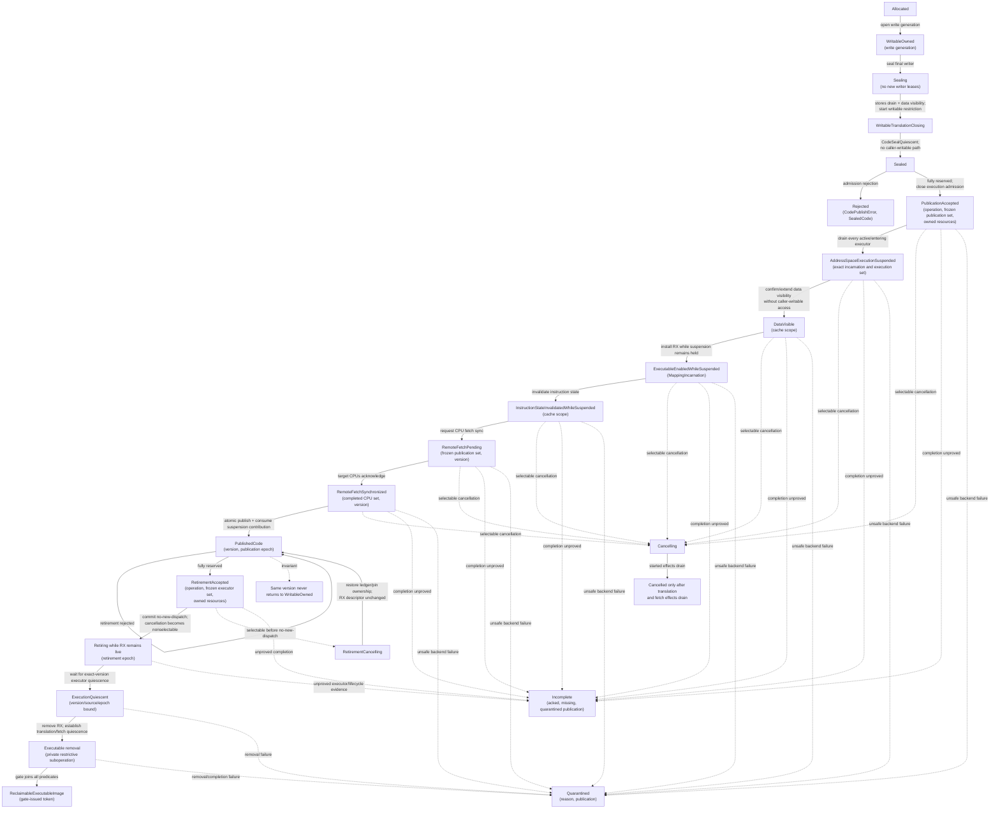

# Ordering, coherence, and code publication

The kernel needs one small vocabulary for ordinary shared-memory
synchronization and several separate protocols for translation, MMIO, DMA,
cache maintenance, and instruction fetch. It should not expose an omnipotent
`barrier()` and let callers guess what it orders.

The recommended implementation is a data-race-free kernel memory model based
on the implementation language's acquire/release atomics and locks; typed
device and DMA accessors outside that model; backend-private architecture
fences; and a first-class immutable-code publication transaction. New native
code is built in a writable, non-executable staging mapping and sealed. The
target address space is then execution-suspended before an executable
translation is installed; it remains suspended while every eligible CPU makes
the sealed bytes fetch-visible. One atomic terminal commit publishes the
version and releases the suspension. Old versions are retired only after
execution quiescence. In-place incompatible patching is not part of the
baseline.

This is a proposed design. Architecture manuals and formal work establish the
hazards and some required sequences; they do not verify this project's API or
implementation.

## Question, scope, and operational standard

The question is:

> What common contract lets portable kernel protocols, drivers, and a
> BEAM-compatible runtime establish the ordering and instruction-fetch effects
> they actually need without leaking ISA mnemonics or relying on accidental
> cache behavior?

This component owns:

- the kernel's allowed atomic widths and memory orders;
- the mapping from that language-level model to each architecture backend;
- semantic compiler and CPU fence primitives used inside named protocols;
- typed MMIO ordering and posted-write completion operations;
- cache-maintenance plans used by translation, DMA, and code publication;
- writable-to-executable publication and executable-version retirement; and
- test models and generated-code audits for those contracts.

The translation component owns TLB and page-table-walker completion. The DMA
component owns buffer and device ownership. Drivers own device-register
protocols. A BEAM runtime owns module validation, native lowering, hot-code
policy, stack maps, and safe-point semantics. This component composes with
those owners but does not absorb their policy. It is the sole public
orchestrator that can turn a sealed `ExecutableImage` into `PublishedCode`.
Translation exposes only prepared, crate-private executable-mapping effects to
an unforgeable `Authorized<CodePublication>` caller; it never publishes code or
grants execute authority directly.

The first implementation is adequate when:

1. Every shared kernel protocol is data-race-free under one pinned language
   memory model or explicitly uses a separately modeled low-level primitive.
2. The same source-level atomic contract passes executable litmus tests on at
   least two materially different ISA backends.
3. MMIO, DMA, page-table, and code-fetch ordering are distinct in types and
   documentation; an ordinary atomic fence cannot be substituted silently.
4. Code cannot become executable before every byte of the page-granular
   executable extent (initialized content plus kernel-zeroed padding) is sealed
   and an authenticated immutable runtime-metadata commitment is bound to that
   exact image generation. Once an executable translation exists, a
   hardware-backed address-space execution suspension prevents every direct or
   indirect branch into it until all eligible CPUs complete required fetch
   synchronization.
5. No baseline transition leaves a frame simultaneously writable and
   executable through any CPU alias.
6. CPU migration cannot move a runtime thread to a CPU that missed publication.
7. A failed remote synchronization keeps the new version unpublished, its
   frames pinned, and—if execute permission was installed—the target address
   space execution-suspended or quarantined; it yields an explicit terminal
   `Incomplete` or quarantine record, never partial executable success or a
   late `CodePublishError`.
8. Retirement cannot reclaim or rewrite code while any CPU may execute or
   return into it.

## Evidence and its boundaries

| Evidence | Supported conclusion | Explicit boundary |
| --- | --- | --- |
| [x86-TSO](../../30-sources/sewell-et-al-2010-x86-tso.md) | x86 ordinary memory is strong but not sequentially consistent; formal models are preferable to folklore | Excludes self-modifying code, exceptions, page tables, and devices |
| [Multicopy-atomic Armv8 model](../../30-sources/pulte-et-al-2018-simplifying-arm-concurrency.md) | Arm ordinary-memory acquire, release, dependencies, atomics, and barriers have distinct executable semantics | Does not establish translation, instruction fetch, MMIO, or DMA behavior |
| [Linux kernel concurrency model](../../30-sources/alglave-et-al-2018-linux-kernel-concurrency.md) | A portable kernel can maintain an executable software memory model and litmus suite | The published model explicitly excludes interrupts, self-modifying code, I/O, and other mechanisms |
| [Arm instruction-fetch semantics](../../30-sources/simner-et-al-2020-arm-instruction-fetch.md) | Data writes, cache maintenance, barriers, pipeline state, and cross-core fetch form a separate system protocol | Covers Arm, not this kernel's authority or lifecycle |
| [RISC-V unprivileged ISA](../../30-sources/risc-v-international-2026-unprivileged-architecture.md) | RVWMO, I/O fence classes, and local `FENCE.I` are distinct; remote code publication needs more than the writer's local fence | The execution environment must supply remote action and cache facilities |
| [RISC-V SBI](../../30-sources/risc-v-international-2025-supervisor-binary-interface.md) | Remote `FENCE.I` can be requested through a versioned, fallible firmware boundary | A successful request is not automatically this project's migration, lifetime, or fault proof |
| [Arm engineering guidance for threaded self-modifying code](../../30-sources/bramley-2025-arm-self-modifying-code-threads.md) | The writing core's local instruction synchronization is not broadcast; full cooperation and best-effort compatible patching are different contracts | Engineering explanation, not a formal proof or benchmark |
| [Linux low-level API documentation](../../30-sources/linux-kernel-community-2026-low-level-core-apis.md) | Compiler, CPU, I/O, DMA, and cache/TLB operations need separate semantic interfaces | Linux's compatibility surface is not a minimal design requirement |
| [The Road to the JIT](../../30-sources/gustavsson-2020-road-to-the-jit.md) | BEAM native execution is constrained by hot loading, scheduling, tracing, and whole-system behavior, not instruction throughput alone | Historical engineering account; it does not specify an OS publication primitive |

The claim ledger must remain explicit: a proof about ordinary-memory
happens-before does not justify a device-doorbell order, page-table reuse, or
instruction-fetch completion. “Coherent machine” is not a substitute for
naming the participating agents and completion point.

## Semantic taxonomy

The common vocabulary should distinguish six relations.

| Relation | Participants | Typical question | Owning API |
| --- | --- | --- | --- |
| Compiler ordering | Source operations and compiler transformations | May the compiler move or eliminate this access? | Language atomics and private compiler barriers |
| CPU ordinary-memory ordering | CPUs observing coherent normal memory | Does a consumer see initialized state after a publication flag? | Atomics, locks, and CPU fences |
| Device-I/O ordering | CPU and device-register/interconnect accesses | Did descriptor writes precede the doorbell, and did a posted write arrive? | Typed MMIO accessors and explicit flush/readback |
| DMA visibility | CPU caches, interconnect, IOMMU, and device | Does the current owner see the buffer contents? | DMA publish/consume composed with ownership transfer |
| Translation ordering | CPU stores, page-table walkers, and TLBs | Can any CPU still use the old mapping? | [Translation transaction](address-translation-and-protection-transitions.md) |
| Instruction publication | Data stores, caches, pipelines, and executing CPUs | May every eligible CPU fetch the complete new code version? | `CodePublication` lifecycle |

One backend instruction may satisfy several relations on one machine. The
types remain separate because another architecture, cacheability mode, or
interconnect may require different operations.

## Recommended ordinary-memory model

### Data-race-free baseline

Ordinary shared kernel data must be protected by a lock or accessed through an
atomic type. Racy non-atomic reads, even when aligned or declared volatile,
are forbidden. Volatile semantics are reserved for MMIO or narrowly audited
compiler interactions; volatility neither creates inter-CPU happens-before
nor makes a multi-step protocol atomic.

Supported atomic operations should initially be limited to naturally aligned
word and pointer widths that are lock-free on every baseline backend. The
portable facade exposes:

- relaxed operations for atomicity and per-location modification order only;
- acquire loads and successful read-modify-write operations;
- release stores and successful read-modify-write operations;
- acquire-release read-modify-write operations;
- sequentially consistent operations only where a global order is actually
  part of the protocol; and
- explicit compare/exchange failure ordering.

Unsupported widths fail at build time or use an explicit lock object whose
interrupt, nesting, and blocking properties are part of the call site. A
compiler-emitted hidden lock is unacceptable in hard-interrupt or NMI-like
code.

### Protocol-shaped wrappers

Most callers should use an object operation such as `binding_publish`,
`queue_push`, or `mapping_close`, not insert a free-standing fence. Within
those implementations, release publishes fully initialized immutable state;
acquire obtains a stable reference. Refcounts, generations, and sequence
counters state their overflow and ABA rules.

The unsafe architecture capsule may contain compiler and CPU fence primitives,
but use outside the ordering component and audited leaf protocols is rejected
by convention or visibility rules. This makes missing semantics reviewable.

### Interrupt interaction

Disabling local interrupts is not a memory order and affects no remote CPU.
Likewise, an acquire/release pair does not prevent an interrupt handler from
re-entering a non-reentrant CPU-local structure. Each structure separately
declares:

- ordinary-thread synchronization;
- local interrupt masking or interrupt-safe atomic requirements;
- NMI-like accessibility;
- migration or preemption exclusion; and
- maximum lock or retry bound.

## Typed device and DMA ordering

### MMIO

An `MmioRegion<Profile>` carries permitted offsets, access widths,
endianness, memory type, side-effect rules, and ordering capabilities. Useful
operations include:

```text
mmio_read_relaxed(region, register)
mmio_write_relaxed(region, register, value)
mmio_read_ordered(region, register, before_after)
mmio_write_release(region, register, value)
mmio_posted_write_complete(region, completion_register)
```

These names describe minimum effects. A backend or device profile may
strengthen them. A readback is used only when the device or interconnect
contract identifies it as the posted-write completion mechanism; random
readbacks can have device side effects and are not a universal fence.

Register access validation and device policy remain in the protected-I/O
component. This ordering component supplies the safe access mechanism after
authority has been checked.

### DMA

DMA operations attach visibility to ownership:

```text
dma_publish_to_device(buffer_lease, written_range, direction)
dma_consume_from_device(buffer_lease, completed_range, direction)
```

The DMA profile decides whether those operations are no-ops on coherent
buffers, cache clean/invalidate sequences on non-coherent buffers, or errors
for unsupported aliases. The operations do not transfer ownership by
themselves; the queue protocol does that atomically with descriptor or
completion state.

A CPU fence alone does not invalidate an IOMMU translation or prove that a
device stopped writing. Conversely, an IOTLB completion does not make dirty
CPU cache lines visible to the device.

## Executable-image model

### Objects and authority

`ExecutableImage` is a kernel-visible aggregate for opaque bytes. The kernel does
not parse BEAM instructions, stack maps, native relocations, or module names.
It records:

- image identity and generation;
- backing frame set, exact initialized byte range, and the page-granular sealed
  executable extent including kernel-zeroed padding;
- writer domain and `CodeWriteLease` generation;
- canonical physical extents/backing lineages, frame-write authority epochs,
  and a persistent write-admission state;
- an authenticated immutable runtime-metadata commitment and validator
  incarnation, without interpreting its runtime-specific semantics;
- current CPU mappings and rights;
- mandatory content-and-extent digest used as sealed image identity (with any
  stronger measurement/attestation policy layered separately);
- publication target CPU set and completed CPU set;
- executable-version identity;
- retirement epoch; and
- state and failure evidence.

Ownership is split deliberately. The minimal privileged kernel owns the
capability-bearing, resource-accounted `ExecutableImage` wrapper, its frame
and mapping references, and destruction ledger. The ordinary `Frame` and
`Mapping` objects remain authoritative for storage and translation; the image
does not duplicate them or create another storage owner. This component owns
the private `CodePublicationState` referenced exclusively by that aggregate:
write and publication generations, cache/fetch progress, target-set evidence,
and terminal completion. Neither the backend state nor its raw handles are
minted directly to a caller.

The aggregate has one payer `ResourceAccount` and one owning `LifetimeGroup`.
Its public rights are attenuated state views rather than independent objects:

| View or facet | Permitted authority | Closing/lifetime rule |
| --- | --- | --- |
| `CodeWriteLease` | Write only the admitted initialized range; never execute | Seal consumes the final writer generation and returns `SealedCode` only after a `CodeSealQuiescent` product closes every frozen CPU, DMA/device, diagnostic, temporary, and authority writer path |
| `SealedCode` | Submit the immutable image with an authorized target-range capability and scheduler-issued complete `PublicationSetWitness` | Holds every frame/mapping reference while an accepted publication operation can complete; grants no target-space, suspension, or scheduling authority itself |
| `PublishedCode` | Install or execute the exact published version; inspect its generation | Grants no write; retirement first removes reachability and waits for execution quiescence |
| image retirement/reclaim facet | Start retirement and inspect or reclaim terminal state | Reclaim waits for writer closure, prior publication/retirement operation drainage, execution quiescence, mapping/TLB completion, and diagnostic or unwind references; the current retirement operation relinquishes resource-bearing lifecycle participation at its sealed transfer and retains only nonblocking gate-observer facets |

A failed publication therefore leaves the aggregate pinned or explicitly
quarantined; dropping a public view cannot release a frame behind an admitted
operation. Moving the aggregate's charge uses the minimal kernel's normal
two-account transfer and moves no underlying authority implicitly.

The loader or JIT holds write authority during construction. Execute authority
is a separate facet granted only after the write lease is closed and cache,
translation, and remote-fetch protocols complete. No handle grants both in the
baseline.

### Publication state machine



`code_seal` is itself a split-phase revocation boundary. It first prevents new
writer-lease acquisition, drains operations already admitted under the final
lease generation, and performs required data-cache visibility while those
writes are closed. It then invokes the private translation restriction and does
not produce `SealedCode` until every caller-writable CPU alias reaches its
`RestrictionQuiescent` subproof and every other frozen writer reaches the
matching typed closure proof. Consuming a lease token alone cannot stop a
malicious domain or device that still has a writable path. A backend
maintenance view kept after sealing is kernel-private, non-writable, and
unreachable by the writer domain; it is not the old staging alias. Publication
may conservatively repeat or extend data-cache maintenance through that
restricted view. Preparation may build descriptors only in unlinked
kernel-owned storage or with invalid/non-executable leaves; neither form is an
executable target-address-space translation. Before the final RX leaf becomes
live, the operation closes target-address-space execution admission and drains
every already-running or entering executor into a checked
`AddressSpaceExecutionSuspension<Held>`.

Only while that suspension is held may component 3 install the RX mapping.
Instruction-cache invalidation is then performed over the executable aliases,
and participating CPUs perform their fetch/pipeline synchronization in
privileged handlers while target-domain execution remains stopped. The final
commit atomically records `PublishedCode` and releases execution admission. A
runtime dispatch table is not a security boundary: before RX installation,
hardware invalid/NX state prevents a direct branch; afterward, the complete
address-space suspension prevents one. An exact backend may combine or omit
hidden steps only when its pinned alias and coherence profile proves the same
order and postcondition. No caller-writable CPU or device path may survive.

Seal acceptance acquires the shared, globally ordered reservations for every
canonical physical extent/backing lineage before it publishes
`Sealing(seal_id, write_admission_epoch + 1)`. In the same linearization it
closes new CPU, IOMMU/DMA, device, and diagnostic write-alias admission and
advances or revokes every frame-write authority epoch/facet that could start a
new store. Existing writable aliases become `RetiringOldAccess` and are removed
by their owning CPU-translation, IOMMU/device, or diagnostic/temporary-alias
protocols.

When several address spaces contain writable aliases, acceptance follows the
global hierarchy: sorted canonical extents first; then the image and every
affected address-space lifecycle/mutation gate in global object-key order;
then sorted virtual ranges; then table ancestors root-to-leaf. It does not hold
an address-space gate while trying to acquire an extent. All preparation may be
optimistic, but the complete writer set and every generation are revalidated
only after the full ordered set is held. Seal acceptance then registers the
entire per-address-space restriction set before releasing any lifecycle gate;
if one space is not live or any generation changed, it rejects before effect
rather than partially registering the set.

Component 3 supplies only the CPU-translation `RestrictionQuiescent`
subproofs. Component 4 joins them with exact DMA/device completion, diagnostic
and temporary-alias closure, frame-write-authority revocation, and final alias-
ledger disposition in one image/seal-generation-bound product:

```text
WriterClosureEvidence {
    executable_image_incarnation,
    seal_generation,
    complete_frozen_writer_set_digest,
    cpu_address_space_restriction_proofs:
        BoundedMap<AddressSpaceIncarnation,
                   CodeSealCpuRestrictionResult {
                       translation_operation_id,
                       covered_writer_alias_incarnations,
                       restriction_quiescent
                   }>,
    dma_and_device_writer_closure_proofs,
    diagnostic_and_temporary_alias_closure_proofs,
    frame_write_authority_revocation_digest,
    final_alias_ledger_disposition_digest
}

CodeSealQuiescent {
    executable_image_incarnation,
    seal_generation,
    writer_closure_evidence: WriterClosureEvidence,
    runtime_metadata_commitment: RuntimeMetadataCommitmentIncarnation,
    content_and_extent_digest
}
```

The checked `WriterClosureEvidence` constructor requires exact coverage of the
frozen writer set, and the per-address-space result sets form an exact,
nonoverlapping partition of its CPU-writer aliases. Each result comes from a
separate translation operation bound to that address space; no single
operation claims to mutate multiple roots. No proof kind can discharge another
domain. Only after that product holds does the kernel compute and freeze the
content-and-extent digest, require byte-for-byte equality with the authorized
runtime validator's `expected_content_and_extent_digest`, validate and bind the
independent runtime-metadata commitment, and construct
`CodeSealQuiescent`. That final product alone can mint `SealedCode` and publish
a persistent `SealedWriteDeny` record in the shared alias/code ledger. The
record outlives the transient reservation
and is released only by authorized retirement/retype; all alias-admission paths
must reject prospective CPU or device write access while the image is
`Sealing`, `Sealed`, `Published`, or retiring. A stale or derived `FrameRef`
therefore cannot modify bytes between seal and publication.

`code_create` allocates or accepts only dedicated, page-granular frame extents
(or an equivalently isolated subframe object whose surrounding bytes cannot be
mapped). Before seal completion the kernel zeros every byte in the executable
extent not supplied by the initialized range. The initialized bytes plus
zeroed padding must cover the extent exactly. Seal binds its virtual-size
requirement, canonical physical extents/backing lineages, initialized range,
padding proof, bytes, authenticated immutable runtime-metadata commitment, and
computed content-and-extent digest into `SealedCode`,
`SealedWriteDeny`, and the private translation plan. Publication rejects a
virtual range, page size, offset, or physical extent that is not an exact
representation of that sealed extent; uninitialized frame slack never becomes
readable or fetchable.

Target and scheduler authority are separate from image authority:

```text
ExecutableImageIncarnation =
    (executable_image_id, executable_image_generation)

PublishedCodeIncarnation =
    (ExecutableImageIncarnation, code_version, publication_generation)

QuarantineIncarnation = (quarantine_id, quarantine_generation)

PublicationSetWitness {
    witness_id_and_generation,
    runtime_domain_and_incarnation,
    scheduler_membership_generation,
    required_base_code_publication_generation,
    code_publication_generation_state:
        CodePublicationGenerationStateIncarnation,
    code_publication_generation_state_digest,
    complete_eligible_cpu_identities_and_incarnations,
    target_address_space: AddressSpaceIncarnation,
    proof_digest
}

CodePublicationGenerationStateIncarnation =
    (code_publication_state_id, state_generation)

CodePublicationGenerationState {
    state: CodePublicationGenerationStateIncarnation,
    runtime_domain_and_incarnation,
    target_address_space: AddressSpaceIncarnation,
    committed_generation,
    executable_version_entries:
        QuotaChargedPersistentMap<
            PublishedCodeIncarnation, LiveExecutableVersionRecord>,
    fetch_reachable_executable_set_digest,
    immutable_catchup_programs:
        BoundedMap<ArchitectureProfileId,
                   Authorized<CodeFetchCatchupProgram, ExecutePrivileged>>,
    canonical_catchup_programs_and_profiles_digest,
    cpu_observation_sidecar:
        CodePublicationCpuObservationStateIncarnation,
    membership_admission_gate,
    state_digest
}

CodePublicationCpuObservationStateIncarnation =
    (code_publication_observation_state_id, generation)

CodePublicationCpuObservationState {
    sidecar: CodePublicationCpuObservationStateIncarnation,
    code_publication_state: CodePublicationGenerationStateIncarnation,
    observations:
        BoundedMap<(CpuIdentity, CpuIncarnation),
                   CpuCodePublicationObservation>
}

CpuCodePublicationObservation {
    code_publication_state: CodePublicationGenerationStateIncarnation,
    committed_generation,
    executed_program_incarnation_and_digest,
    observed_state_digest
}

LiveExecutableVersionRecord {
    published_code: PublishedCodeIncarnation,
    executable_image_incarnation,
    exact_virtual_range_and_aliases,
    canonical_physical_extents_and_backing_lineage_metadata,
    publication_generation,
    architecture_profile_id,
    fetch_reachability: ReachableRx | Removed,
    backing_pin_disposition:
        GenerationStateOwned(ExecutableBackingPinBundle) |
        RetiringBy(CodeRetirementOperationIncarnation,
                   transferred_pin_bundle_digest) |
        TransferredToReclamationGate(
            RetirementRecordIncarnation,
            transferred_pin_bundle_digest) |
        RetainedByQuarantine(quarantine: QuarantineIncarnation,
                             transferred_pin_bundle_digest),
    record_digest
}

ExecutableBackingPinBundle {
    exact_frame_mapping_and_backing_lineage_authorities,
    canonical_physical_extent_set,
    reference_gate_incarnations,
    bundle_digest
}

CodeFetchCatchupProgram {
    program_incarnation,
    architecture_profile_id,
    covered_fetch_reachable_executable_set_digest,
    exact_ordered_local_cache_pipeline_and_fence_operations,
    completion_validation_rule,
    program_digest
}

CodePublicationOperationIncarnation =
    (code_publication_operation_id, code_publication_operation_generation)

CodeRetirementOperationIncarnation =
    (code_retirement_operation_id, code_retirement_operation_generation)

CodeOperationIncarnation =
    Seal(code_seal_operation_id, generation) |
    Publication(CodePublicationOperationIncarnation) |
    Retirement(CodeRetirementOperationIncarnation)

CodeOperationRef<Kind> {
    operation: CodeOperationIncarnation<Kind>,
    executable_image_incarnation,
    intended_owner_domain_and_incarnation,
    terminal_result_slot_set_digest,
    right:
        Inspect |
        ClaimTerminalResult |
        RequestCancellation where Kind in {Publication, Retirement},
    capability_generation
}

CodeOperationAccess<Kind> {
    inspect: Authorized<CodeOperationRef<Kind>, Inspect>,
    claim: Authorized<CodeOperationRef<Kind>, ClaimTerminalResult>
}

CancellableCodeOperationAccess<Kind: Publication | Retirement> {
    inspect: Authorized<CodeOperationRef<Kind>, Inspect>,
    cancel: Authorized<CodeOperationRef<Kind>, RequestCancellation>,
    claim: Authorized<CodeOperationRef<Kind>, ClaimTerminalResult>
}

CodeRetirementRef {
    published_code: PublishedCodeIncarnation,
    runtime_domain_and_incarnation,
    address_space: AddressSpaceIncarnation,
    right: StartRetirement,
    capability_generation
}

ExecutionQuiescenceSource {
    source_incarnation,
    published_code: PublishedCodeIncarnation,
    runtime_domain_and_incarnation,
    address_space: AddressSpaceIncarnation,
    dispatch_epoch,
    no_new_dispatch_gate_incarnation,
    authorized_producer_and_validation_rule,
    source_digest
}

ExecutableVersionExecutionQuiescent {
    parent_retirement_operation: CodeRetirementOperationIncarnation,
    published_code: PublishedCodeIncarnation,
    runtime_domain_and_incarnation,
    address_space: AddressSpaceIncarnation,
    execution_quiescence_source_incarnation,
    dispatch_epoch,
    no_new_dispatch_gate_incarnation,
    frozen_executor_set_and_epoch_digest,
    exact_drain_or_lifecycle_exclusion_evidence,
    code_publication_generation_state:
        CodePublicationGenerationStateIncarnation,
    code_publication_generation_state_digest,
    exact_rx_mapping_alias_and_extent_set_digest,
    proof_digest,
    right: RemoveExecutableMappingsForExactVersion
}

AddressSpaceExecutionSuspensionIncarnation =
    (execution_suspension_id, generation)

AddressSpaceExecutionSuspensionReservation {
    suspension: AddressSpaceExecutionSuspensionIncarnation,
    address_space: AddressSpaceIncarnation,
    scheduler_membership_generation,
    bounded_executor_snapshot_and_drain_capacity,
    lifecycle_guard_reservation,
    capability_generation
}

AddressSpaceExecutionSuspension<Closing> {
    suspension: AddressSpaceExecutionSuspensionIncarnation,
    address_space: AddressSpaceIncarnation,
    publication_operation: CodePublicationOperationIncarnation,
    execution_admission_epoch,
    base_code_publication_generation,
    code_publication_generation_state:
        CodePublicationGenerationStateIncarnation,
    frozen_execution_observer_set,
    scheduler_membership_generation,
    activation_migration_and_user_return_admission_closed_proof,
    privileged_fetch_capable_borrow_epoch_and_admission_closed_proof,
    operation_owned_drain_slots_and_progress,
    held_lifecycle_and_scheduler_guard
}

AddressSpaceExecutionSuspension<Held> {
    suspension: AddressSpaceExecutionSuspensionIncarnation,
    address_space: AddressSpaceIncarnation,
    publication_operation: CodePublicationOperationIncarnation,
    execution_admission_epoch,
    base_code_publication_generation,
    code_publication_generation_state:
        CodePublicationGenerationStateIncarnation,
    frozen_execution_observer_set,
    scheduler_membership_generation,
    activation_migration_and_user_return_admission_closed_proof,
    privileged_fetch_capable_borrow_epoch_and_admission_closed_proof,
    drained_or_excluded_activation_guard_and_helper_borrow_proof,
    exact_executor_drain_or_lifecycle_exclusion_evidence,
    held_lifecycle_and_scheduler_guard,
    suspension_digest
}

ExecutablePublicationQuarantine {
    quarantine: QuarantineIncarnation,
    executable_image_incarnation,
    publication_operation: CodePublicationOperationIncarnation,
    address_space: AddressSpaceIncarnation,
    executable_mapping_and_alias_ledger_state,
    execution_suspension_disposition:
        ReopenedAfterRollback {
            no_executable_leaf_ever_live_or_restriction_quiescent,
            exact_execution_admission_reopen_digest
        } |
        RetainedClosing(
            QuarantineOwned<
                Authorized<AddressSpaceExecutionSuspension<Closing>>>) |
        RetainedHeld(
            QuarantineOwned<
                Authorized<AddressSpaceExecutionSuspension<Held>>>),
    acknowledged_and_missing_fetch_targets,
    retained_frame_mapping_and_completion_resources,
    recovery: ExecutablePublicationRecoveryIncarnation,
    preallocated_recovery_facets_and_result_slots,
    quarantine_digest
}

ExecutablePublicationRecoveryIncarnation =
    (executable_publication_recovery_id, recovery_generation)

ExecutablePublicationRecovery {
    recovery: ExecutablePublicationRecoveryIncarnation,
    original_terminal_digest,
    quarantine: QuarantineIncarnation,
    publication_operation: CodePublicationOperationIncarnation,
    code_publication_state: CodePublicationGenerationStateIncarnation,
    address_space: AddressSpaceIncarnation,
    suspension: AddressSpaceExecutionSuspensionIncarnation,
    allowed_actions:
        CompleteOrRollbackWhileAddressSpaceLive |
        RollbackOnlyAfterClose(close_operation_id,
                               close_mutation_delegation_digest),
    state:
        Collecting |
        Advancing(CompletePublication | RollbackToSealed) |
        PublishedSuccess |
        RolledBackToSealed |
        RetainedInQuarantine,
    typed_evidence_and_progress,
    published_pair_result_slot:
        OneShotReturnSlot<RecoveredPublicationAuthority::Published>,
    sealed_code_result_slot,
    recovery_digest
}

ExecutablePublicationRecoveryRef {
    recovery: ExecutablePublicationRecoveryIncarnation,
    original_terminal_digest,
    quarantine: QuarantineIncarnation,
    publication_operation: CodePublicationOperationIncarnation,
    code_publication_state: CodePublicationGenerationStateIncarnation,
    address_space: AddressSpaceIncarnation,
    suspension: AddressSpaceExecutionSuspensionIncarnation,
    right: Inspect | Advance,
    capability_generation
}

ExecutablePublicationRecoveryClaimRef {
    recovery: ExecutablePublicationRecoveryIncarnation,
    original_terminal_digest,
    intended_recipient_domain_and_incarnation,
    right: ClaimRecoveredAuthority,
    capability_generation
}

PublishCodeWithinAuthority {
    address_space: AddressSpaceIncarnation,
    authorized_virtual_range,
    required_translation_and_security_profile,
    capability_generation
}

RuntimeMetadataCommitment {
    metadata_object: RuntimeMetadataCommitmentIncarnation,
    runtime_validator_domain_and_incarnation,
    executable_image_incarnation,
    write_generation,
    metadata_digest,
    expected_content_and_extent_digest,
    immutable_pin_and_authority_generation
}
```

The scheduler, not the caller, issues the opaque complete-set witness. The
address-space lifecycle service issues the bounded suspension reservation
against that exact scheduler membership generation. Component 4 joins and
revalidates those objects with a borrowed
`AddressSpaceRef<PublishCodeWithin>` and `SealedCode`; only that checked join can
mint the crate-private `Authorized<CodePublication>` bound to the exact image,
sealed extent, address-space incarnation/range/profile, runtime domain, CPU set,
membership generation, code-publication state incarnation/generation/digest,
and suspension incarnation. `SealedCode` alone cannot
select a target space, suspend it, grant execute mapping authority, or omit an
eligible CPU. The suspension is not merely a runtime-dispatch promise: its
checked constructor closes activation, migration, and user-return admission,
freezes all active and entering execution records—including native-extension
and privileged execution that could fetch through the target root—and proves
each drained or terminally excluded before it enters `Held`. On a profile that
cannot independently deny privileged instruction fetch through a data-only
user-access root, acceptance also advances and closes the relevant helper-
borrow epoch/admission gate, and the frozen set includes every such helper
borrow. `Held` proves every frozen `ActivationGuard` was consumed or made
terminally unusable and every borrow of one drained; because activation remains
closed, no later `ExistingTargetRoot` helper can borrow a replacement guard.
A `DataOnlyBorrow` may be excluded from this closure only when the pinned
profile proves privileged instruction fetch is independently impossible.

`CodePublicationGenerationState` is persistent scheduler/address-space state,
not an operation-local acknowledgement set. It owns the complete typed
executable-version records and, for each fetch-reachable entry, either the
actual physical-extent pin bundle or the exact typed operation/quarantine owner
to which that bundle moved. It also owns the immutable privileged catch-up
program object for each admitted architecture profile; the digests are only
commitments to those owned objects, never substitutes for their instructions
or ranges. Each program is validated as sufficient for a CPU at any older
observed generation over the exact fetch-reachable-set digest. The membership-
admission gate serializes witness creation, publication commit, CPU eligibility
changes, activation, and migration. A CPU incarnation may enter the eligible
set or execute the target address space only after privileged catch-up has
advanced its map entry to the current committed generation. If a bounded
implementation has discarded incremental fetch history, it prepares and pins a
reviewed conservative whole-domain fetch-synchronization program from the
complete typed fetch-reachable version/extent records before publishing the new generation;
the digest alone is not compiler input. Lack of history can increase cost but
cannot waive catch-up. CPU identity reuse starts with no observed generation.
Whenever publication, retirement, or close must hold both gates, it acquires
the address-space lifecycle/mutation gate before the membership-admission gate;
no path takes the reverse order.
The generation state's immutable `state_digest` binds the nominal observation
sidecar but excludes its mutable map contents. Each per-CPU update instead
stores a complete `CpuCodePublicationObservation` under the membership gate;
changing one CPU's observation therefore cannot invalidate every other CPU's
state snapshot.

Address-space class-`L` acceptance takes the same membership-admission gate and
freezes the exact `CodePublicationGenerationStateIncarnation`, committed/state
generations, version entries, actual catch-up programs, pin dispositions, and
readers in its `CloseObserverSnapshot`. `DeadEvidence` is unavailable until
every state-owned pin/program is cancelled or moved to the named retirement or
quarantine owner, every `RetiringBy` or quarantined entry agrees with that
owner's terminal record, and no reader or lagging eligible CPU can use the
state. Closing the address space therefore cannot strand or duplicate
component 4's persistent ownership.

The same class-`L` linearization resolves every registered nonterminal code
publication or retirement participant under the close's writer token. A
publication that has not made RX live is forced onto its preconstructed no-
store cancellation path. If RX may be live, or a retirement still needs RX
removal, the operation and its exact plan/resources are marked
`CloseOwnedTeardown` and receive a parent/op-bound delegation of the close token
for only that restrictive subeffect. The code operation publishes a
`SubsumedByAddressSpaceClose` terminal after the delegated work and ownership
transfer; close consumes that terminal instead of waiting for an independently
held writer gate. A retirement whose sealed code-transfer commit already made
the exact version non-reachable, removed RX to `RestrictionQuiescent`, and
transferred every resource-bearing pin and reference to the reclamation gate is
instead represented by its already committed
`Removed + TransferredToReclamationGate` version-entry disposition and sealed
transfer digest. The same commit has discharged its address-space lifecycle
participation, so close accounts for the gate-owned residue without waiting for
the retirement operation to claim the eventual `Reclaimable` token. No path
enables RX after class `L` wins.

For every frozen `ExecutablePublicationRecovery`, class-`L` atomically changes
`allowed_actions` to `RollbackOnlyAfterClose`, revokes the
`CompletePublication` branch, and cancels any not-yet-filled published-pair
result slot. Recovery can then remove a possibly live RX relation only under the
close-bound restrictive delegation. If a complete-publication commit wins both
gates first, it is already a terminal version entry captured by the close
snapshot. Thus recovery can never mint `PublishedCode`, advance a publication
generation, or reopen execution admission for `Closing` or `Dead`.

Before `PublicationAccepted`, component 4 validates every image, target-range,
scheduler-witness,
generation, range, alias, profile, and budget. It acquires generation-bound
reservations for every canonical physical extent and backing lineage in the
same global hierarchy used by CPU mapping, code sealing, IOMMU/DMA, device, and
diagnostic-alias admission: extents first; sorted protected-object gates next;
then range intents and root-to-leaf table intents. Existing `PendingAdd` and
`RetiringOldAccess` entries count as live hazards. DMA-local `PendingInstall`
and `PendingDeviceAccess` are treated as their
normalized `PendingAdd` projection, including intended device-write and
memory-type hazards. Under those reservations component 4 freezes a
`PublicationSetWitness` of CPU identities and incarnations plus the current
code-publication state incarnation, committed generation, and state digest;
prepares and
reserves component 3's complete `ExecutableEnablePlan<Prepared>` with only an
unlinked or invalid/NX descriptor image; reserves an
`AddressSpaceExecutionSuspensionIncarnation` and its complete executor-drain
capacity; prepares the successor persistent generation-state entry and actual
catch-up programs; and preallocates cache, remote-request, completion, teardown,
nominal publication-recovery, `Inspect`/`Advance`/claim facets, and all recovery
result-slot records.
Rejection occurs before any mapping or cache effect, releases the reservations,
and returns `SealedCode` with ownership unchanged.
The `PublishCodeWithin`/scheduler-witness join and acceptance acquire the
address space's lifecycle/mutation gate followed by the membership-admission
gate in the fixed global order. They revalidate `state == Live`,
the exact address-space incarnation and mutation sequence, register the
accepted code-publication operation in the close-observer set, advance the
execution-admission epoch, close activation/migration/user-return entry, and
freeze the exact active and entering executor set before releasing that gate.
Existing executors may drain asynchronously, but the executable descriptor is
still unlinked or invalid/NX during that interval. If close, an eligibility
change, or a code-publication state-incarnation/generation/digest change wins,
publication
returns the pre-effect `CodePublishError`; if publication wins, class `L`
freezes that registered operation and its suspension state. No executable
`PendingAdd` entry can appear after the close snapshot.
After acceptance, the operation exclusively owns that typestate view, the
translation plan, frame and address-space pins, lifecycle participation guards,
the resulting `AddressSpaceExecutionSuspension<Closing>`, the alias-ledger
reservations, and all completion capacity until a terminal result transfers or
quarantines them. Acceptance revalidates the complete ledger snapshot and the
seal operation's completed writable-alias retirement atomically, then records
the proposed executable alias as `PendingAdd(NonExecutableUntilSuspendedEnable)`.
That ledger entry reserves a future relation; it does not assert that a valid
RX leaf exists. No outgoing caller-writable alias remains to mark at
publication time. The transition never exposes writable and executable aliases
as simultaneously live. No later internal rejection is surfaced as
`CodePublishError` or `MappingError`.

The drain transition consumes `Closing` and produces `Held`; those are the only
non-open suspension owners. A non-success terminal reached while drainage is
incomplete must either atomically reopen admission after proving no executable
leaf ever became live, or move the actual `Closing` object into the publication
quarantine. It cannot encode the closed gate as an absent optional field.

### Publication interface

```text
code_create(frame_authorities, byte_length)
  -> Rejected(CodeCreateError, frame_authorities)
   | ExecutableImage<Allocated> + CodeWriteLease

code_seal(write_lease, initialized_range,
          Authorized<RuntimeMetadataCommitment>)
  -> Rejected(CodeSealError, CodeWriteLease,
              Authorized<RuntimeMetadataCommitment>)
   | Accepted(CodeOperationAccess<Seal>)

code_seal_poll(Borrowed<Authorized<CodeOperationRef<Seal>, Inspect>>)
  -> Pending(stage, writable_aliases_remaining)
   | Succeeded(OneShotReturnSlot<SealedCode>, CodeSealQuiescent)
   | Incomplete(
         OneShotReturnSlot<Authorized<Quarantine<ExecutableImage>, Inspect>>,
         missing_proof)
   | Quarantined(
         reason,
         OneShotReturnSlot<Authorized<Quarantine<ExecutableImage>, Inspect>>)

code_publish(sealed_code,
             Borrowed<Authorized<AddressSpaceRef,
                                 PublishCodeWithin(range, profile)>>,
             exact_virtual_range,
             Borrowed<Authorized<PublicationSetWitness>>,
             Authorized<AddressSpaceExecutionSuspensionReservation,
                        SuspendForPublication>)
  -> Rejected(CodePublishError, SealedCode,
              unchanged_execution_suspension_reservation)
   | Accepted(CancellableCodeOperationAccess<Publication>)

code_publication_poll(
    Borrowed<Authorized<CodeOperationRef<Publication>, Inspect>>)
  -> Pending(stage, acknowledged_cpu_set)
   | Succeeded(
         OneShotReturnSlot<PublishedCode>,
         OneShotReturnSlot<
             Authorized<CodeRetirementRef, StartRetirement>>)
   | Cancelled(OneShotReturnSlot<SealedCode>, PublicationDrainEpoch)
   | Incomplete(acknowledged_cpu_set, missing_cpu_set,
                OneShotReturnSlot<
                    Authorized<ExecutablePublicationRecoveryRef, Inspect>>,
                OneShotReturnSlot<Authorized<
                    ExecutablePublicationRecoveryClaimRef,
                    ClaimRecoveredAuthority>>)
   | Quarantined(reason,
                 OneShotReturnSlot<
                     Authorized<ExecutablePublicationRecoveryRef, Inspect>>,
                 OneShotReturnSlot<Authorized<
                     ExecutablePublicationRecoveryClaimRef,
                     ClaimRecoveredAuthority>>)
   | SubsumedByAddressSpaceClose(
         close_operation_id, close_owned_disposition_digest)

code_publication_cancel(
    Borrowed<Authorized<CodeOperationRef<Publication>,
                        RequestCancellation>>)
  -> CancellationRequested
   | CancellationNotSelectable(stage)
   | AlreadyTerminal(CodePublicationTerminal)

code_retire(
    published_code,
    Authorized<CodeRetirementRef, StartRetirement>,
    Borrowed<Authorized<ExecutionQuiescenceSource,
                        ProveNoExecutionForExactVersion>>)
  -> Rejected(CodeRetireError, PublishedCode,
              unchanged_code_retirement_ref)
   | Accepted(CancellableCodeOperationAccess<Retirement>)

code_retirement_poll(
    Borrowed<Authorized<CodeOperationRef<Retirement>, Inspect>>)
  -> Pending(stage, observed_executor_set)
   | Succeeded(OneShotReturnSlot<ReclaimableExecutableImage>)
   | Cancelled(
         OneShotReturnSlot<PublishedCode>,
         OneShotReturnSlot<
             Authorized<CodeRetirementRef, StartRetirement>>,
         RetirementDrainEpoch)
   | Incomplete(observed_executor_set, missing_executor_set,
                OneShotReturnSlot<
                    Authorized<Quarantine<ExecutableImage>, Inspect>>)
   | Quarantined(
         reason,
         OneShotReturnSlot<Authorized<Quarantine<ExecutableImage>, Inspect>>)
   | SubsumedByAddressSpaceClose(
         close_operation_id, close_owned_disposition_digest)

code_retirement_cancel(
    Borrowed<Authorized<CodeOperationRef<Retirement>,
                        RequestCancellation>>)
  -> CancellationRequested
   | CancellationNotSelectable(stage)
   | AlreadyTerminal(CodeRetirementTerminal)

code_operation_claim_terminal_result(
    Borrowed<Authorized<CodeOperationRef<Kind>, ClaimTerminalResult>>,
    opaque_terminal_result_slot_identity)
  -> Claimed(authority_bearing_terminal_member)
   | AlreadyClaimed(slot_generation)
   | NotTerminal
   | StaleOrWrongSlot(current_terminal_slot_set_digest)

code_publication_recovery_poll(
    Borrowed<Authorized<ExecutablePublicationRecoveryRef, Inspect>>)
  -> Collecting(typed_missing_evidence_and_progress)
   | Published(opaque_published_pair_result_slot_identity)
   | RolledBack(opaque_sealed_code_result_slot_identity)
   | RetainedInQuarantine(reason)

RecoveredPublicationAuthority =
    Published(
        PublishedCode,
        Authorized<CodeRetirementRef, StartRetirement>) |
    RolledBack(SealedCode)

code_publication_recovery_claim(
    Authorized<ExecutablePublicationRecoveryClaimRef,
               ClaimRecoveredAuthority>,
    opaque_result_slot_identity)
  -> NotReady(
         Authorized<ExecutablePublicationRecoveryClaimRef,
                    ClaimRecoveredAuthority>)
   | Claimed(RecoveredPublicationAuthority)
   | AlreadyClaimed
   | StaleOrWrongSlot(current_recovery_result_slot_set_digest)

code_publication_recovery_advance(
    Authorized<ExecutablePublicationRecoveryRef, Advance>,
    selected_action: CompletePublication | RollbackToSealed,
    typed_generation_bound_evidence)
  -> Collecting(
         Authorized<ExecutablePublicationRecoveryRef, Advance>, progress)
   | Finalized(result_slot_identities)
   | DisallowedAction(
         Authorized<ExecutablePublicationRecoveryRef, Advance>,
         allowed_actions)
   | RetainedInQuarantine(
         Authorized<ExecutablePublicationRecoveryRef, Advance>, reason)
```

Every authority-bearing terminal value lives in a stable one-shot extraction
slot. `OneShotReturnSlot<T>` in a poll result denotes an opaque slot identity,
not authority to extract `T`. Polling borrows the operation's `Inspect` facet;
publication and retirement cancellation borrow their separate
`RequestCancellation` facets. Seal operations mint no cancellation facet and
have no `Cancelled` terminal variant. Every borrowed facet returns on every
path. Only the intended-owner `ClaimTerminalResult` facet can move an
authority-bearing slot. The first successful extraction moves the capability;
later, foreign, and stale-slot attempts return `AlreadyClaimed` or
`StaleOrWrongSlot`. A recoverable architecture fault is
therefore represented by `Incomplete` or `Quarantined` with an owned slot. If
the architecture-fault component instead selects and completes a containing-
machine halt, control transfers to the nonreturning
`machine_halt(ArchitectureFaultRecord) -> !`; no fictional post-halt poll result
or resource transfer is published.

Successful publication mints `PublishedCode` and its separately attenuable
`CodeRetirementRef` as a bound pair in distinct one-shot slots. The retirement
facet and authorized `ExecutionQuiescenceSource` must name the same published-
code incarnation, runtime-domain/address-space incarnations, version, and
dispatch/no-new-dispatch epoch. The quiescence source is borrowed and validated,
not accepted as an untyped runtime assertion. Rejection returns the exact
retirement facet and published view unchanged; accepted retirement consumes
both authorities until a terminal slot returns them or retirement completes.

Every potentially recoverable publication quarantine is paired at original
admission with one nominal `ExecutablePublicationRecovery`, its result slots,
and separately authorized `Inspect`, caller-bound `ClaimRecoveredAuthority`,
and supervisor `Advance` facets. The immutable terminal returns the inspect and
claim facets in distinct one-shot slots; a designated supervisor retains
`Advance`. Inspect polling reveals progress and opaque slot identities only.
Every recovery call equality-checks recovery, terminal, quarantine,
publication-operation, generation-state, address-space, and suspension
incarnations. An advance and its final commit acquire the address-space
lifecycle/mutation gate and then the membership-admission gate, require the
exact address space to remain `Live` at the bound lifecycle and mutation
generation with no close owner, and recheck `allowed_actions`.
`CompletePublication` is rejected once close has selected rollback-only.
That rejection is `DisallowedAction` and returns the unchanged `Advance` facet;
it neither fills a result slot nor changes recovery state.
Completing publication must establish the same full target/fetch,
state-update, alias, and suspension-release predicate as the original commit;
rollback must remove any RX relation to `RestrictionQuiescent` before returning
`SealedCode`. Results appear only in the preallocated one-shot slots, and the
original `Incomplete`/`Quarantined` terminal never changes. Only the exact
intended-recipient claim facet can extract a finalized authority result; an
inspect facet, supervisor advance facet, or digest cannot claim it.
The recovery's published case stores `PublishedCode` and its matching
`CodeRetirementRef` together in one owner-bound one-shot pair slot; extraction
atomically moves both or neither. The rollback slot is disjoint. A claim naming
the wrong recovery, wrong branch, old slot generation, or already replaced slot
returns `StaleOrWrongSlot` without moving authority.

`ReclaimableExecutableImage` is not component 4's self-certified Boolean. It
wraps the exact linear `Reclaimable<ExecutableImage>` token issued by component
8 for this image incarnation, retirement epoch, and resource set. Retirement
submits its complete execution/fetch/code predicate record to the reclamation
gate; the gate independently joins it with CPU-translation, mapping, reference,
software-reader, and any provenance-selected DMA/device evidence. The wrapper
can release or retype frames only by consuming that gate token. Component 4
obtains it from the gate's readiness-generation-bound one-shot result slot by
borrowing the intended-owner `ClaimReclaimable` facet; an inspect handle,
quarantine handle, retirement digest, or private translation result cannot
extract it.

The architecture API ends at `PublishedCode`. The runtime owns its module or
entry table and may atomically install the returned version at a runtime safe
point using the ordinary-memory publication contract. Keeping
`runtime_slot` out of this component prevents a BEAM-specific dispatch policy
from becoming an architecture primitive.

`CodeCreateError`, `CodeSealError`, `CodePublishError`, and `CodeRetireError`
are rejection reasons only. `code_seal` performs all fallible validation and
reserves the global extents plus restriction/evidence capacity before its
one-way logical writer close;
its accepted operation owns the lease, mappings, frames, and a generation-bound
immutable runtime-metadata commitment pin plus its complete authority/digest
snapshot until it returns
`SealedCode` with the exact `CodeSealQuiescent` product or transfers them to
quarantine. Post-closure digest comparison revalidates only that frozen pinned
object. It
never reports immutable sealed bytes while a caller-writable translation can
still store. An accepted operation never returns one of those errors.
Publication and retirement cancellation requests select a path but do not
themselves return resources: the matching poll reports `Cancelled` only after
every started translation, cache, remote-fetch, or retirement effect has
drained to the named epoch. If drainage cannot be proved, the exactly-once
terminal result is `Incomplete` or `Quarantined`, and its quarantine owns all
unreusable state.
After `PublishedCode`, publication cancellation is too late and the caller must
use retirement; after retirement's unreachable commit point, retirement
cancellation is likewise nonselectable and drainage continues.

Retirement admission performs the same ownership discipline independently. It
freezes the executor identities/epochs named by the runtime's authorized
`ExecutionQuiescenceSource`, reserves translation and diagnostic-reference
drainage capacity, and preconstructs the next persistent generation state and
profile-specific catch-up programs. It also obtains component 3's complete
one-shot `ExecutableRetirePlan<Prepared>` for the exact published-code,
retirement-operation, RX mapping/alias/extent set, and generation-state
incarnation/digest; failure here is still pre-acceptance rejection. It acquires the address-space
lifecycle/mutation gate and then the membership-admission gate in the globally
fixed order, verifies `Live` with no close owner, validates the exact authorized
retirement facet and quiescence-source binding, and registers the nominal
`CodeRetirementOperationIncarnation` as a lifecycle participant. If close won,
it rejects with all caller authority unchanged; if retirement won, a later
class-`L` snapshot must freeze this participant. It then
requires the exact version entry to be `ReachableRx + GenerationStateOwned`,
then atomically moves that entry's actual backing-pin bundle plus the caller's
`PublishedCode` and every RX mapping into `CodeRetirementOperation` and replaces
the entry disposition with `RetiringBy(exact_operation, transfer_digest)`. The
state retains only typed non-owning reachability metadata while the operation
owns the pins; there is never a second owner. It also reserves the same physical extents in
the shared alias ledger and, at acceptance, revalidates and marks each outgoing
RX alias `RetiringOldAccess`. That state remains a conflict until runtime
unreachability, CPU/code quiescence, translation closure, and selected cache
predicates have all discharged; an incomplete path transfers the reservation
and alias state plus the actual pins to quarantine and changes the persistent
entry to matching `RetainedByQuarantine`. Rejection returns the unchanged view before
reachability changes. A selectable cancellation can return `PublishedCode`
only before the runtime-supplied no-new-dispatch proof commits and only by
atomically moving the pins back into `GenerationStateOwned`, restoring the
exact unchanged RX alias-ledger intention (no executable descriptor removal
has started), and publishing the matching generation-state digest;
afterward the
operation must reach reclaimable, incomplete, or quarantined terminal state.
Every terminal commit atomically removes the retirement participation record
or transfers it into the close/quarantine owner that names the same operation.
The one earlier discharge point is the sealed code-retirement transfer after RX
removal: that atomic commit removes address-space lifecycle participation and
binds the removal to the exact nonblocking
`Removed + TransferredToReclamationGate` version-entry disposition while moving
all resource-bearing ownership to the gate. Neither form can disappear between
close's scan and final pin disposition.

After runtime unreachability, executor quiescence, and RX removal to
`RestrictionQuiescent`, a successful retirement commit changes the exact entry
to `Removed + TransferredToReclamationGate(exact_retirement_record,
transfer_digest)`, rebuilds the actual catch-up program over the remaining fetch-
reachable typed extent set, advances the persistent committed/state
generations, and transfers the operation-owned pin bundle to the reclamation-
gate record. The retirement terminal, version entry, and reclamation record all
carry the same disposition/transfer digest. Thus the persistent registry cannot
silently retain a pin that blocks reference quiescence, and the reclamation gate
cannot accept a pin whose registry still claims live ownership.

That transfer uses component 8's dedicated sealed
`CodeRetirementTransferCore`, not a fabricated `TranslationTerminal`. The core
and its exhaustive ownership bundle bind the retirement-operation and
published-code incarnations, exact execution and restriction proofs,
generation-state transition, mappings/aliases/extents, backing-pin bundle, and
pre-reserved retirement records. One atomic publication changes the persistent
version entry's pin disposition and activates those records. Until it commits,
`CodeRetirementOperation` remains the sole owner; afterward component 4 retains
only typed progress plus the gate-issued inspect/claim facets needed to await
and claim the final reclamation token. Those facets are non-owning observers:
they cannot reach the retired image, are excluded from the record's
`ReferenceQuiescent` predicate, and do not block readiness. All earlier code
operation references and every resource-bearing pin, borrow, or capability
selected by provenance must still drain or transfer normally.

Once the authorized no-new-dispatch proof commits, cancellation becomes
nonselectable, but every RX descriptor remains live. Component 4 uses the
accepted operation's authorized source to wait until every executor in the
frozen exact-version set has drained or been terminally excluded, then mints
one `ExecutableVersionExecutionQuiescent` authority. That authority binds the
published version, source and dispatch epoch, no-new-dispatch gate, retirement
operation, persistent generation state, exact RX mapping/alias/extent set, and
drain evidence. Only then may component 4 consume the prepared plan through
component 3's private executable-retirement suboperation. The encoder borrows
both the `CodeRetirementOperation<ExecutorQuiescent>` typestate and that exact
authority before its first RX-to-NX/invalid store. The suboperation owns the
class-`R` observer snapshot and returns exact `RestrictionQuiescent` or typed
failure evidence to the parent retirement operation without publishing a
standalone translation terminal. Failure transfers the same
mapping/alias/extent and pin state to the retirement quarantine; it cannot call
a general executable map/unmap API.

### Why immutable versions are the baseline

Generating a new immutable body and atomically switching an entry-point or
version table avoids concurrent modification of instructions already in
flight. It supports BEAM hot loading naturally: runtime policy determines
which process may call which module generation, while architecture machinery
only guarantees native bytes are fetchable.

In-place patching has at least three different meanings:

1. **Incompatible atomic update.** No CPU may execute a mixed old/new stream.
   This requires a stronger stop or patch protocol and is excluded initially.
2. **Compatible best-effort optimization.** Either old or new behavior is
   correct. Arm's engineering guidance shows why this can use weaker
   synchronization, but the contract must say so explicitly.
3. **Security revocation.** Old instructions must become unusable. This is a
   protection and execution-quiescence transition and can never use the
   best-effort path.

Keeping these as distinct APIs prevents an optimization technique from being
mistaken for revocation.

## Cross-CPU publication protocol

The scheduler and CPU-lifecycle components define an eligible CPU set for a
runtime domain. Component 4 is the only public caller that turns it into a
publication transition:

1. `code_seal` has consumed the final writer lease, drained its admitted stores,
   completed required data visibility, and obtained the exact
   `CodeSealQuiescent` product for every frozen CPU and non-CPU writer; only
   then did it return `SealedCode`.
2. Admission allocates a new version; reserves the affected canonical physical
   extents/backing lineages in the shared global alias ledger; freezes a
   `PublicationSetWitness` containing the complete CPU identities,
   incarnations, membership generation, code-publication state incarnation,
   base committed generation, and state digest; prepares component 3's private
   `ExecutableEnablePlan<Prepared>` in unlinked or invalid/NX form; reserves an
   exact address-space execution-suspension incarnation and bounded drain
   capacity; and reserves every operation record and resource pin. A rejection
   here has made no architectural mutation.
3. Acceptance revalidates the sealed writable-alias absence/proof, registers a
   sequenced `PendingAdd(NonExecutableUntilSuspendedEnable)` intention, closes
   activation, migration, and user-return admission and, where the profile
   cannot independently deny privileged fetch, helper-borrow admission;
   freezes every active and
   entering executor, and moves `SealedCode`, the suspension reservation, and
   all other resources into `CodePublicationOperation`. The final RX mapping
   still does not exist. The persistent membership-admission gate holds a CPU
   trying to join the domain's eligible set outside the domain; the frozen set
   itself is never edited.
4. The scheduler and CPU-lifecycle protocols drain or terminally exclude every
   frozen executor. Only their exact generation-bound conjunction constructs
   `Authorized<AddressSpaceExecutionSuspension<Held>>`. Until then existing
   target-domain code may finish draining, but hardware invalid/NX state makes
   the proposed range non-executable.
5. While the suspension is held, the backend confirms or extends data-cache
   visibility for the exact range through a kernel-private, non-writable
   maintenance view. Component 4 validates and binds the seal operation's exact
   `CodeSealQuiescent` product; it cannot recreate or merely logically suppress
   the retired writable alias.
6. Component 4 lends the exact held-suspension proof to component 3 and consumes
   the already-prepared translation plan through a subordinate enable
   suboperation. Only that join may install and make usable the RX mapping. Its
   result binds the exact mapping, pending-alias entry, suspension, and
   translation evidence but leaves all ownership in
   `CodePublicationOperation`; component 3 publishes no independent mapping
   terminal. The mapping is hardware-live, but no target-space instruction can
   execute while the suspension remains held.
7. The backend performs required instruction-cache invalidation over the
   executable aliases and the publisher performs its local fetch/pipeline
   synchronization without releasing the suspension.
8. Every other target CPU runs its required local fetch/pipeline operation in a
   privileged handler and acknowledges `(executable_image, version,
   suspension)` afterward. Those handlers do not execute target-domain code.
9. After every required target acknowledges, one locked terminal commit changes
   the alias-ledger entry to live, records `PublishedCode`, advances the
   persistent publication generation and state incarnation, creates the exact
   `GenerationStateOwned` version entry, updates the fetch-reachable-set and
   canonical catch-up-program digests, records every acknowledged target CPU
   at that new generation, and consumes this operation's execution-suspension
   contribution while still holding the membership-admission guard. Execution
   admission reopens
   only if the address space is still `Live` at the bound lifecycle generation
   and no newer close or suspension owner exists; this commit can never reverse
   class-`L` `Closing`. Only after that checked composite gate permits entry may
   a task execute in the address space or the runtime install the returned
   authority view in its own entry table. The
   operation releases the extent reservation only after that complete state and
   every cache/fetch predicate are durably recorded.

10. A CPU incarnation that becomes eligible after the frozen witness, or that
    migrates into this runtime domain, remains in neutral privileged context.
    It acquire-reads and pins the persistent generation state's actual typed
    fetch-reachable version set and profile-selected program, equality-checks
    their digests, and executes the exact
    missed-generation catch-up program (or the conservative whole-domain
    program). It publishes its observed state incarnation, generation, and
    program/state digest with release ordering, then
    rereads the state under the membership-admission gate. Only equality with
    the still-current state incarnation, generation, and digest permits scheduler membership,
    address-space activation, or user return; otherwise it repeats catch-up.
    Thus a later CPU cannot miss an already committed fetch-synchronization
    obligation merely because it was absent from an earlier frozen set.

This deliberately parallels translation shootdown. The two can share
preallocated cross-CPU request transport and CPU-set generation machinery, but
their completion records and local instructions remain distinct.

If one CPU fails to acknowledge, that publication generation completes as
`Incomplete`; its frozen target set is never shrunk in place and its
`ExecutablePublicationQuarantine` owns the image, mappings, pins, completion
evidence, and—whenever an RX mapping may be live—the exact held execution
suspension. If failure instead occurs during executor drainage and safe reopen
cannot be proved, it owns the exact `Closing` suspension. In either case the
target space remains unschedulable and nonactivatable. Recovery
may finish a separate CPU-offline or domain-eligibility transition and use that
proof to drain the quarantine. It may release the suspension only after either
the original publication completes for the resulting valid complete target
set, or the RX mapping is removed to `RestrictionQuiescent` and all fetch work
is accounted for. Only the latter rollback may mint a fresh `SealedCode` view
for a new generation and newly frozen set. No acknowledgement or completion
from the failed generation is inherited. If drainage cannot be proved, the
address space and image stay quarantined and pinned. At no point may the new
version run on the missing CPU.

An incomplete or quarantined publication does not advance the persistent
committed generation or fetch-reachable-executable-set digest. Its non-open execution
suspension also keeps late joiners outside the address space. A recovery that
eventually commits publication performs the same atomic generation update and
late-join rule; a rollback removes the RX relation to
`RestrictionQuiescent` before releasing that suspension.

## Cross-ISA backend plans

| Semantic step | x86-64 | AArch64 | RISC-V |
| --- | --- | --- | --- |
| Ordinary kernel atomics | Map pinned language orders to TSO-aware compiler and ISA operations; do not infer SC | Map to acquire/release atomics and barriers required by the pinned Arm model | Map to RVWMO atomics/fences for the selected extensions |
| Device ordering | Typed MMIO and posted-write rules from the platform/device profile | Normal versus Device memory and required barrier scope | `FENCE` predecessor/successor I/O classes plus execution-environment rules |
| Local code publication | Follow Intel's defined self-/cross-modifying-code and serialization rules even where caches are coherent | Data clean to required point, completion barrier, instruction invalidate, completion barrier, local instruction synchronization as specified | Make data stores visible, then execute local `FENCE.I` |
| Remote code publication | Execute the required serializing/fetch action on every eligible logical CPU | Remote CPUs execute the required local instruction synchronization; the writer's `ISB` is not broadcast | Data fence at publisher and `FENCE.I` on every eligible hart; SBI RFENCE may transport the request, but its ordinary return is not target completion |
| Range precision | Feature/profile dependent | Cache-line and maintenance-scope dependent | Baseline `FENCE.I` may be broader than the supplied range |

Exact instruction sequences belong in versioned backend documentation and
generated-code tests. The table is a semantic map, not assembly to copy.
For RISC-V, `RemoteFetchSynchronized` additionally requires an Atom target-
handler acknowledgement or a separately specified platform completion emitted
causally after the exact fence and bound to request plus hart incarnation.
`SBI_SUCCESS` alone cannot satisfy that proof.

## Cache-maintenance planner

A shared internal planner accepts an authorized semantic request and produces
a backend-specific sequence. Its input includes:

- address and overflow-checked length;
- physical alias set where relevant;
- cacheability and shareability profile;
- participating agent set: local CPU, CPU set, device, or point of coherency;
- direction: clean, invalidate, clean-and-invalidate, or instruction
  invalidation;
- required completion point; and
- context restrictions such as hard-interrupt safety.

It rounds ranges with overflow-safe arithmetic, reads discovered line sizes,
and rejects unsupported alias configurations. Callers cannot provide a line
size or raw cache level as ambient authority.

Cache maintenance is fallible at the semantic level even if individual
instructions do not report errors. An unsupported range, absent remote
mechanism, invalid feature profile, or known platform erratum is a pre-mutation
admission rejection. An offline-CPU race or unexpected backend failure after
acceptance is instead an `Incomplete` or quarantine terminal result, or invokes
the separately modeled nonreturning machine-halt path; it cannot surface as a
late `CodePublishError`.

## Interaction with the capability microkernel

The [minimal privileged kernel](../minimal-privileged-kernel-layer.md) supplies
frame authority, mapping identities and incarnations, runtime-domain lifecycle, scheduling
contexts, and teardown ledgers. This component adds:

- release/acquire publication for immutable kernel objects;
- typed MMIO and DMA visibility used by protected-I/O bindings;
- the private `CodePublicationState`, write-lease transition, publication
  operation, and retirement operation behind the kernel-owned
  `ExecutableImage`;
- remote fetch generations incorporated into domain stop and CPU migration;
  and
- bounded architecture work charged to the initiating domain or a declared
  supervisor reserve.

Kernel capability selectors and user-level PIDs are never embedded directly
in native code as transferable authority. A generated stub may contain a
domain-local slot index whose use still crosses the capability validation
path.

## Interaction with BEAM compatibility

The kernel sees opaque native-code bytes, not BEAM as its ABI. A compatible
runtime remains responsible for:

- validating the selected BEAM/OTP compatibility profile;
- loading compiled BEAM modules;
- producing interpreted or BeamAsm-like executable form;
- maintaining stack maps, safe points, exception metadata, tracing, and hot
  code-version rules; and
- automatic process-local tracing garbage collection.

The runtime should batch generated code into immutable `ExecutableImage`
instances, seal them once, and install `PublishedCode` through an atomic runtime
table. Garbage
collecting actor heaps is unrelated to code retirement. Code retirement uses
runtime execution quiescence—safe points, scheduler epochs, or explicit frame
tracking—not reachability in one BEAM process heap.

An in-process native extension or JIT shares the runtime domain's memory and
failure boundary. W^X prevents one direct avenue of modification but does not
make generated code semantically safe. A malformed JIT, relocation, or native
call remains capable of crashing the runtime domain, after which the outer
supervisor tears it down and starts a new incarnation.

## Failure and security analysis

### Partial publication

Until the entire declared target set acknowledges, the runtime receives no
version authority. The image remains sealed and non-writable. Before component
3 enables RX, the proposed range is hardware invalid/NX. After RX is enabled,
the operation retains `AddressSpaceExecutionSuspension<Held>` so even a direct
branch outside the runtime's entry table cannot execute the new mapping.
Timeout is an observation deadline, not cancellation or automatic
terminalization: it returns current progress and may trigger an explicit
recovery-policy decision. If that policy determines that completion cannot be
established, the operation publishes an exactly-once `Incomplete` terminal
record containing acknowledged CPUs, missing CPUs, and an
`ExecutablePublicationQuarantine` that owns every still-live resource and any
required non-open `Closing` or `Held` suspension. Recovery can reduce the
scheduler eligibility set
only through a CPU/domain lifecycle transition that prevents later migration
to a missing CPU, then drain that quarantine through a separate recovery
operation. It never releases a suspension merely because runtime dispatch has
not installed the version.

### Cancellation and late completion

`code_publication_cancel` and `code_retirement_cancel` request cancellation;
they do not manufacture a terminal state. Before returning `Cancelled`, the
operation must prove that remote requests cannot publish authority, any RX
mapping installed under the held suspension has been removed to
`RestrictionQuiescent`, cache/fetch work is accounted for, and every frame or
address-space pin has a named owner. Only then may the same atomic rollback
return `SealedCode` and release execution admission. Until that point, hardware
invalid/NX state or the exact held suspension continues to prevent execution.
Releasing the publication's suspension is a generation-checked removal of one
closure cause, not an unconditional store of `Open`; it cannot reopen an
address space that class `L` or another suspension owner has closed.
Under the operation's still-held physical-extent reservation, cancellation of
publication also atomically removes the prospective RX `PendingAdd` entry,
revalidates and retains the seal operation's exact `CodeSealQuiescent` product,
and only then releases or explicitly transfers
the reservation. A writable or writable-`RetiringOldAccess` entry at this stage
is an invariant mismatch, not something that can be restored into
`SealedCode`. Such a mismatch, an unproved alias-quiescence obligation, or
inability to remove an installed RX mapping therefore cannot yield
`Cancelled`; it transfers the reservation, all affected entries, and the
current non-open suspension to `ExecutablePublicationQuarantine`, leaving the
target address space unschedulable and nonactivatable.
Cancellation of retirement has the dual rule: while the reservation remains
held and before the no-new-dispatch proof commits, it atomically restores every
RX `RetiringOldAccess` entry to the exact live `PublishedCode` state before it
returns that authority and releases or transfers the reservation. A rights,
incarnation, or reservation mismatch—or an unproved restoration—must instead
retain the entries and authority in quarantine.
Component 3's executable-retirement suboperation has not started in this
cancellable interval, so the restore changes only the operation-owned ledger
intention and pin disposition, never an RX descriptor. Once that suboperation
starts, cancellation is nonselectable.
If any proof is missing, the terminal record is `Incomplete` or `Quarantined`.
Late acknowledgements are generation-checked and may help a recovery ledger,
but cannot change the original sticky terminal result or release its quarantine
implicitly.

### Writer death

If the writer dies in `WritableOwned`, the write lease closes, the staging
mapping is removed, and incomplete bytes are never executable. If it dies
after sealing, a supervisor with explicit adoption authority may continue
publication or destroy the image. Image generations prevent a stale writer
from resuming.

### W^X and alias attacks

W^X is checked across every CPU mapping of the frame, not only one virtual
address. The baseline also denies every DMA/device write authority to the same
sealed extent while it is executable. Any future nonbaseline profile would
need a separate threat model and typed proof that the retained device path is
not write-capable over that exact extent; “trusted device” alone is no
exception.
Changing cacheability or memory type during publication is prohibited. These
checks use the shared canonical-physical-extent/backing-lineage ledger; a
component-local snapshot is insufficient because concurrent CPU, executable,
DMA, or diagnostic admission could otherwise pass independently.

### Metadata mismatch

An authorized runtime validator supplies an immutable metadata-commitment
object bound to the same `ExecutableImage` incarnation and write generation.
It covers stack maps, relocation results, and module metadata according to the
runtime's own rules. The kernel validates the commitment's identity, authority,
immutability pin, and digest binding, but neither receives nor interprets those
semantics. It computes the code content/extent digest only after writer closure,
compares it byte-for-byte with the validator's expected digest, and binds both
commitments into `SealedCode`. A post-validation write therefore makes the
accepted seal operation incomplete or quarantined rather than sealed; matching
prevents byte or commitment substitution without claiming kernel validation of
the metadata itself.

### Speculation and stale targets

Publication establishes architectural fetch visibility. It does not prove
that all microarchitectural instruction, branch-predictor, or decode state is
free of cross-domain timing channels unless the selected security profile adds
the required flush or partition steps. Indirect-branch mitigation and control-
flow integrity are separate feature-profile concerns.

### Retirement races

A code version can be unreachable from new dispatch and still present in a
thread's stack, return address, continuation, signal frame, or CPU pipeline.
Retirement therefore requires runtime execution quiescence plus any
architecture synchronization needed before frame reuse. A timeout retains the
current operation ownership and returns progress. A separate recovery-policy
decision may retain the old RX mapping in a named quarantine; neither path
remaps those bytes writable.

### Ordering bugs as authority bugs

Publishing a capability-table pointer before its rights, generation, or
lifetime fields are initialized can expose authority even if the pointer value
is correct. Security review therefore treats release/acquire edges and
immutable initialization as part of the capability invariant, not merely
performance details.

## Verification strategy

### Kernel memory model

Create a versioned Atom OS kernel memory-model document and executable litmus
suite for:

- message passing with release/acquire;
- lock and unlock;
- reference acquisition versus object close;
- generation publication;
- CPU-local queue producer/consumer;
- interrupt-to-thread sticky notification;
- domain stop and scheduler eligibility; and
- code-version entry publication and retirement.

Run each test through the source-language/compiler model where available, the
chosen ISA model, and hardware stress tests. Pin model and compiler versions.
Review every use of relaxed order and every free-standing fence.

### Code-publication model

Model-check the code state machine with writer death, duplicate and delayed
CPU acknowledgements, migration, CPU offline, publication abort, entry-table
replacement, and retirement. Required invariants include:

- no execution edge reaches a pre-published version;
- no write lease exists for an executable version;
- no CPU executes version `v` without observing publication `v`;
- no newly eligible, reactivated, migrated, or identity-reused CPU executes
  while its observed publication generation is behind the persistent current
  generation;
- old versions remain mapped until execution quiescence; and
- a stale operation cannot publish or reclaim a later image generation.

### Backend conformance

- Inspect emitted atomics and barriers for all supported compiler/optimization
  combinations.
- Use Arm instruction-fetch tests and model oracles where applicable.
- Test RISC-V local and remote `FENCE.I` with migration deliberately forced
  between generation and execution.
- Exercise Intel-defined cross-modifying-code sequences rather than assuming
  coherent caches make testing unnecessary.
- Test cache-line boundaries, empty and overflowed ranges, aliases, huge
  objects, offline CPUs, and feature/erratum fallbacks.
- Run on real hardware after emulation; cache and pipeline behavior are exactly
  where emulators may be too strong or too simple.

### MMIO and DMA tests

Use a model device and, later, real devices to delay posted writes, reorder
descriptor observation, and vary coherency. Confirm that queue ownership
transfer plus the typed ordering operation—not an accidental full fence—sets
the visibility point. Fault injection must include reset and DMA completion
racing with code/frame reuse.

### Performance measurements

Measure:

- atomic and lock latency uncontended and contended across sockets;
- CPU-local queue throughput and tail latency;
- each MMIO accessor class and posted-write completion;
- cache-maintenance cost by size, alignment, and sharing scope;
- code sealing and publication for small stubs through large BEAM modules;
- target CPU counts, cross-socket publication, and one failed target;
- entry-table swap and retirement delay; and
- a representative BEAM workload performing load-time native lowering, hot
  code replacement, messaging, and process-local tracing GC.

The performance report must separate generation cost, translation changes,
cache maintenance, remote synchronization, and runtime quiescence. Otherwise a
slow loader can be misdiagnosed as an ISA fence problem.

## Staged implementation

### Stage 1: ordinary-memory contract

- Choose and pin the implementation language and compiler memory model.
- Support one word-sized atomic family, one IRQ-safe spin primitive, and one
  blocking kernel lock with explicit context rules.
- Publish litmus tests and generated-code checks on the first ISA.

### Stage 2: typed MMIO and cache primitives

- Implement access-width, endianness, memory-type, and posted-write profiles.
- Add overflow-safe local data and instruction cache-maintenance planning.
- Keep DMA ownership and device protocols outside this component.

### Stage 3: single-CPU immutable code

- Add `ExecutableImage`, write lease, W^X transition, local publication,
  executable mapping, atomic entry install, and quiescent retirement.
- Integrate a minimal native test loader before a BEAM JIT.

### Stage 4: multicore publication and second ISA

- Add eligible-CPU generations, preallocated remote requests, migration
  catch-up, split-phase operations, and CPU-offline composition.
- Port the same semantic interface to a weaker or materially different memory
  and instruction-fetch model.

### Stage 5: managed-runtime integration and optimization

- Publish immutable native `ExecutableImage` instances for compiled BEAM
  modules and test hot replacement and retirement at runtime safe points.
- Measure batching and only then consider compatible in-place patches,
  narrower cache operations, or platform-specific accelerations.

## Alternatives and tradeoffs

### One universal full fence

A maximally strong fence can hide early mistakes but cannot necessarily order
device signaling, remote instruction pipelines, TLBs, or DMA. It also imposes
unrelated costs. Strong fallbacks are useful inside backend plans; the public
API remains semantic and narrow.

### Architecture mnemonics in portable code

Mnemonic wrappers appear transparent but spread architecture scope and errata
knowledge throughout the kernel. They also invite x86-tested code to omit
portable ordering. The recommended backend contains them behind effect-shaped
operations.

### Persistent dual RW/RX mappings

Dual aliases avoid repeated remapping and can make JITs fast. They weaken W^X,
complicate cache aliases, and let a compromised runtime modify executable
frames. The baseline removes all writable aliases before execution. A future
trusted JIT profile may use isolated writer and executor domains with an
explicit transfer protocol, not a hidden alias.

### Stop-the-world publication

Stopping every runtime thread and synchronizing every CPU is simple and can be
appropriate initially. Its pause grows with CPU count and conflicts with the
responsiveness goal. Immutable versions plus eligibility generations let work
continue on the old version until the new one is fully published.

### Runtime-only synchronization

Allowing each runtime to execute cache instructions can reduce system calls but
cannot safely coordinate privileged mappings, migration, CPU offline, or
feature variation. The runtime can batch and choose publication points; the
kernel executes the architecture transition.

### In-place compatible patching

Best-effort patching can avoid remote stops when both instruction streams are
valid, as the Arm engineering article explains. It is a useful later
optimization for counters or hints. It must be a separate API that cannot
grant execute permission, revoke old behavior, or release the patched frame.

### Sequential consistency everywhere

SC atomics simplify some reasoning but do not solve MMIO, DMA, TLB, or code
fetch and may impose unnecessary global order. Acquire/release plus modeled
protocols is the baseline; use SC where the algorithm truly needs one total
order.

## Unresolved questions

- Which implementation language and compiler versions define the first kernel
  memory model, and what unsupported atomic widths must be rejected?
- Can one executable model cover ordinary thread and interrupt communication
  without adopting Linux-specific primitives?
- What is the smallest portable MMIO accessor set that still represents
  posted writes and architecture/device scopes honestly?
- What compact encoding keeps the aggregate's references to existing frames,
  mappings, and private `CodePublicationState` independently auditable without
  inflating its hot-path footprint?
- Which runtime safe-point evidence is sufficient to retire BeamAsm code that
  may appear in stacks, continuations, exception state, or native helpers?
- Which policy should choose between offlining a missing CPU, excluding the
  runtime domain through a completed eligibility transition, and aborting a
  failed publication before resubmission?
- Which Arm cache-maintenance scope and RISC-V execution-environment profiles
  are available on the first hardware targets?
- What code batching size minimizes publication overhead without creating
  unacceptable module-load or hot-upgrade latency?
- Which speculative-execution mitigations belong in the mandatory publication
  profile, and which remain target-specific security options?

## Connections

- [Kernel hardware and architecture support
  layer](../kernel-hardware-and-architecture-support-layer.md) defines this as
  component 4 and separates it from translation, DMA, and interrupt flow.
- [Address translation and protection
  transitions](address-translation-and-protection-transitions.md) supplies only
  the private prepared W^X mapping effects and TLB completion that this sole
  public publication orchestrator composes.
- [Interrupt event fabric](interrupt-event-fabric.md) consumes IRQ-safe
  atomics and release/acquire publication but has its own controller flow and
  acknowledgement semantics.
- [Minimal privileged kernel layer](../minimal-privileged-kernel-layer.md)
  supplies capability authority, domain lifecycle, scheduling eligibility,
  teardown, and code-frame accounting.
- [BEAM, ERTS, and OTP principles for a new operating
  system](../beam-erts-and-otp-principles-for-a-new-operating-system.md) keeps
  compiled-BEAM policy, hot-code semantics, and tracing GC in the managed
  runtime.
- [Kernel hardware-contract
  inquiry](../../40-inquiries/what-contract-should-the-kernel-hardware-and-architecture-layer-provide.md)
  remains the workbench for testing the contract on two ISAs.

## Sources

- [x86-TSO](../../30-sources/sewell-et-al-2010-x86-tso.md)
- [Simplifying Arm concurrency](../../30-sources/pulte-et-al-2018-simplifying-arm-concurrency.md)
- [Concurrency in the Linux kernel](../../30-sources/alglave-et-al-2018-linux-kernel-concurrency.md)
- [Arm instruction-fetch semantics](../../30-sources/simner-et-al-2020-arm-instruction-fetch.md)
- [Arm A-profile system architecture documentation](../../30-sources/arm-2026-a-profile-system-architecture-documentation.md)
- [Intel system programming documentation](../../30-sources/intel-2026-system-programming-documentation.md)
- [RISC-V unprivileged architecture](../../30-sources/risc-v-international-2026-unprivileged-architecture.md)
- [RISC-V privileged architecture](../../30-sources/risc-v-international-2026-privileged-architecture.md)
- [RISC-V supervisor binary interface](../../30-sources/risc-v-international-2025-supervisor-binary-interface.md)
- [Arm self-modifying code with threads](../../30-sources/bramley-2025-arm-self-modifying-code-threads.md)
- [Linux kernel low-level core APIs](../../30-sources/linux-kernel-community-2026-low-level-core-apis.md)
- [The Road to the JIT](../../30-sources/gustavsson-2020-road-to-the-jit.md)
