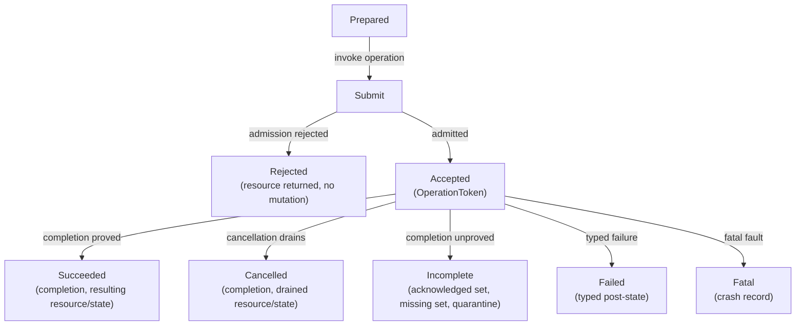

# Typed kernel-facing architecture facade

## Conclusion

The best implementation for component 10 is a **statically composed, typed
semantic facade** over the ten mechanism components below it. It should expose
sealed generational objects, explicit context requirements, move-only resource
ownership, and split-phase operation tokens whose terminal result states
exactly what has completed. Architecture backends implement the same semantic
contract but need not share instruction sequences, internal data structures, or
optional features.

The facade is an internal kernel boundary, not a stable user ABI and not a
generic peripheral HAL. The minimal privileged kernel remains the authority
boundary: it validates capabilities and resource budgets before invoking the
facade. The facade then prevents accidental mechanism misuse inside trusted
code and makes backend conformance testable.

For the first prototype, implement common code and the facade in Rust `no_std`,
use sealed traits and private constructors, select the backend at build time,
and confine assembly and `unsafe` operations to component 1. Rust is recommended
because ownership, sum types, lifetimes, and generics closely represent this
contract and can compile away on local hot paths. The semantic specification,
state-machine models, and serialized diagnostic records must remain language-
independent so this choice does not become an architectural axiom.

## Question and operational standard

This component answers:

> How can the privileged kernel use architecture mechanisms portably without
> hiding the ownership, context, ordering, completion, failure, and feature
> differences on which safety depends?

The facade succeeds only when:

- generic kernel code contains no direct privileged instructions, control-
  register access, architecture page-table edits, interrupt-controller
  sequences, or ad hoc fences;
- an operation's type and contract identify authority, ownership, permitted
  execution context, work bound, state transition, completion evidence, and
  failure state;
- stale handles and completions are rejected across object destruction, CPU
  restart, mapping reuse, interrupt rebinding, and device reset;
- absence of an optional feature is explicit and cannot silently weaken a
  security invariant;
- a deterministic fake backend can represent every documented success, partial
  completion, timeout, cancellation, and fatal outcome;
- two materially different ISA backends pass the same semantic conformance
  suite; and
- generated-code inspection shows that type abstraction does not add hidden
  dispatch, allocation, or unbounded work to entry-critical paths.

Passing the suite validates the interface against the tested profiles. It does
not prove the hardware, compiler, firmware, or unsafe backend correct.

## Exact boundary

### Below the facade

- normalized boot facts and immutable target profile;
- the unsafe architecture-primitives capsule;
- entry/context, translation, ordering/code, interrupt, time, CPU, I/O/DMA, and
  architecture-fault implementations; and
- architecture-specific representations, instruction sequences, errata, and
  optional firmware or hypervisor calls.

### At the facade

- typed object identities and generations;
- safe constructors and transition methods;
- synchronous versus split-phase operation shape;
- context-safety and ordering preconditions;
- completion tokens, epochs, partial result sets, and failure types;
- mandatory and optional feature profiles; and
- bounded observations for audit and recovery.

### Above the facade

- capability derivation and authorization;
- kernel-object memory and resource accounting;
- protected domains, invocation, scheduling contexts, and failure boundaries;
- driver and managed-runtime policy; and
- BEAM process semantics, process-local tracing garbage collection, OTP-like
  supervision, distribution, and applications.

The facade may carry an internal proof that the minimal kernel authorized an
operation, but it does not invent or delegate user-visible authority.

## Evidence and synthesis

The [Flux OSKit](../../30-sources/ford-et-al-1997-flux-oskit.md) shows the value of
semantic components, explicit environmental dependencies, and intentional
architecture escape hatches; it also shows that function tables alone do not
provide isolation or correct modern concurrency semantics. [Think](../../30-sources/fassino-et-al-2002-think.md)
demonstrates strongly typed component interfaces and explicit bindings without
requiring one kernel architecture.

[Secure Virtual Architecture](../../30-sources/criswell-et-al-2007-secure-virtual-architecture.md)
demonstrates that privileged operations can be concentrated behind a typed
low-level interface while leaving most machine-independent kernel code alone.
Its virtual instruction set is not proposed here, but its small privileged
surface and checker boundary are instructive.

The current [Tock HIL design](../../30-sources/tock-project-2026-hil-design.md) is
particularly useful engineering evidence for split-phase APIs: submission
acceptance must determine whether completion will occur, callbacks must not be
synchronous surprises, and buffers must return with terminal results. Atom OS
uses bounded events rather than callback-stack reentry, but adopts the explicit
ownership rule.

[CertiKOS](../../30-sources/gu-et-al-2016-certikos.md) supports observable layer
specifications and refinement. [seL4](../../30-sources/sel4-foundation-2026-reference-manual.md)
supports explicit objects, capabilities, and architecture-specific ports while
also showing that a compact API is not a substitute for recording hardware and
DMA assumptions. The current architecture manuals and Linux low-level
documentation demonstrate that translation, instruction publication, device
ordering, interrupt flow, timers, and CPU lifecycle have distinct completion
semantics.

No source proves this exact facade. The generational object vocabulary,
context types, operation schema, and composition with the proposed minimal
kernel are cross-source synthesis.

## Design principles

### Normalize semantics, not representations

Portable code should ask to publish executable code, reach a translation
quiescence epoch, arm a one-shot deadline, or quarantine an interrupt source.
It should not manipulate a nominally portable page-table-entry bitfield or ask
for a vaguely named “memory barrier.” Backend representations stay private.

### Make illegal transitions unrepresentable where practical

A writable `ExecutableImage` view cannot be executed. A sealed view may be
submitted for publication. Only completed publication yields `PublishedCode`. A
`DmaMapping<Revoking>` cannot be placed into a device queue. Types remove common
misuse, while runtime checks cover generations and hardware state that cannot
be known statically.

### Separate acceptance from completion

Cross-CPU, firmware, device, IOMMU, and revocation operations are not complete
when work is queued. Submission returns either a synchronous rejection with
ownership retained or an accepted token that promises exactly one terminal
event.

### Prefer static composition

The target backend and mandatory feature profile are selected at build time.
Generics or whole-program linking remove dynamic dispatch from hard entry and
local primitive paths. Runtime feature discovery selects safe data and enabled
optional operations inside the compiled backend; it does not load arbitrary
new privileged implementations.

### Keep escape hatches named and scarce

An architecture-specific facility is exposed only through a sealed optional
profile with explicit authority, ownership, context, ordering, and fallback.
Generic code cannot call raw backends or cast handles.

### Treat error types as part of the state machine

Errors state what did and did not happen. `Rejected` means no transition began.
`Incomplete` carries acknowledged and missing sets. `Quarantined` means safety
is retained but a resource cannot be reused. `Fatal` means common code cannot
preserve its invariant. A single integer error code is inadequate.

## Contract description schema

Every facade operation is specified using the same fields:

| Field | Required content |
| --- | --- |
| Object | Type, identity, generation, owner component, and product-lifetime dependencies |
| Authority | Minimal-kernel authorization or internal exclusive owner required to invoke it |
| Context | Boot, thread, hard-entry, interrupt-disabled, CPU-local, crash, or other permitted context |
| Inputs | Values and moved/borrowed resources, including provenance and range constraints |
| Preconditions | Object state, CPU/device state, enabled profile, ordering, and lock constraints |
| Start transition | First externally visible mutation and whether rejection is still possible |
| Work bound | Local instruction/loop bound or declared split-phase dependency |
| Completion | Exact local, CPU-set, device, firmware, or quiescence fact established |
| Cancellation | Whether selectable, which resources remain owned, and how terminal drainage occurs |
| Failure | Unchanged, rolled back, partial, quarantined, or fatal post-state |
| Observation | Bounded record, generation, timestamps, source/target sets, and redaction class |

Contracts are machine-readable input to tests and documentation where
practical. Prose remains necessary for hardware assumptions and rationale.

## Core type vocabulary

The following pseudocode describes semantics, not settled Rust syntax:

```text
ObjectId<Kind>           stable identity within one boot generation
Generation<Kind>         scoped reuse counter, never ambient integer identity
Handle<Kind, State>      sealed reference to a live backend object
Owned<T>                 exclusive resource transferred into an operation
Borrowed<'a, T>          bounded non-owning access that cannot outlive T
Authorized<A, Scope>     proof of an already validated internal operation
Context<C>               unforgeable evidence of permitted execution context
Operation<Kind, G>       accepted split-phase transition for one generation
Completion<Kind, G>      exactly-once terminal result matching that operation
Epoch<Component>         observed completion frontier, not wall-clock time
Feature<P>               sealed evidence that optional profile P is enabled
```

Constructors for handles, contexts, authorization proofs, and completion tokens
are private to the owning component. Serialization strips authority and
produces diagnostic identifiers only.

### Generations

Generation equality is scoped to its object kind and parent lifetime. A global
small counter that can wrap into a stale live token is forbidden. Strategies
include a wide boot nonce plus monotonic object counter, or no reuse until all
older tokens are drained. Wrap is a lifecycle event requiring quiescence or
boot-generation replacement, not an arithmetic detail.

### Context types

Representative contexts are:

- `BootContext` — before secondary CPUs and ordinary allocation;
- `ThreadContext` — blocking or split-phase initiation permitted;
- `CpuLocalContext` — operation affects only the current stable CPU;
- `IrqOffContext` — local interrupt state held in a scoped guard;
- `HardEntryContext` — bounded, nonallocating, no remote wait;
- `NmiContext` — a strict, non-widening hard-entry subtype that cannot rely on
  ordinary interrupt masking or lock exclusion;
- `FatalCaptureContext` — the smallest non-widening entry subtype, permitting
  only preclassified/recursive terminal capture and terminal leaves;
- `CrashContext` — minted only after terminal evidence is sealed and permitting
  only prevalidated crash-sink, halt, or reset operations; and
- `QuiescentContext<S>` — component-specific proof of a completed stop set.

A context token does not make arbitrary code safe. It makes required call-site
state explicit and keeps a token from escaping its lexical/lifecycle scope.
`NmiContext` and `FatalCaptureContext` cannot be widened to
`HardEntryContext`; each operation names the exact context class or closed set
it admits. `CrashContext` is a post-seal terminal context, not an entry-capture
token.

### Canonical cross-component vocabulary

The component notes were developed in parallel, so similar draft names must
not become additional object kinds. The facade uses this canonical vocabulary:

| Concern | Canonical name and ownership | Relationship to narrower draft names |
| --- | --- | --- |
| User return | `UserReturnEnvelope`, owned by entry/context | `EntryFrame` is the disjoint normalized frame that may contain it; the parent note's `UserTrapFrame` and the earlier facade `ReturnFrame` refer to this user-return payload, not separate return objects |
| Mapping mutation | `MappingTransaction`, owned by translation | `MappingTxn` is only an abbreviation and is not used in the API |
| Live mapping | `Mapping`, owned and accounted by the minimal kernel with private translation state | `MappingLease` is reserved for a genuinely scoped borrowed authority; it is not the durable mapping identity |
| Executable image | `ExecutableImage`, owned and accounted by the minimal kernel | The aggregate references authoritative `Frame` and `Mapping` objects plus one private `CodePublicationState`; `CodeWriteLease`, `SealedCode`, and `PublishedCode` are typestate/authority views over it, not additional owners |
| Interrupt authority | `IRQBinding`, owned and accounted by the minimal kernel | `InterruptSource`, `InterruptRoute`, `InterruptBinding`, and `InterruptCompletion` are typed views over its source/route/binding records and private architecture state, not independently allocated authority; `EventSink` remains a separately authorized bounded destination |
| One-shot timer mechanism | `TimerChannel`, owned by raw time/deadline programming and CPU-local in the baseline | “Deadline” names `DeadlineTarget`, `DeadlineToken`, and `DeadlineTerminal`; it does not introduce a second public channel object or alias |
| DMA translation | `DmaAddressSpace` and `DmaMapping`, owned and accounted by the minimal kernel | “IOMMU domain” remains a hardware concept; draft `DmaDomain` and `DmaLease` names do not introduce additional objects, and component 8 exposes only attenuated facets of these canonical objects |
| Device queue authority | `DeviceQueueLease`, owned and accounted by the minimal kernel | Draft `QueueCapability` and `QueueLease` names refer only to attenuated views of this lease; accepting an operation borrows the lease while moving the submitted buffer token into a protected operation record |
| Reset recovery | `ResetDomain`, current sealed `ResetLease.Use`, and independently held `ResetControl` | A reset/profile mutation requires the scoped operation facet plus `ResetLease.Use`; `ResetControl` exists only to close an obsolete manager epoch and install precommitted successor authority, so there is no `ResetControlLease` object |
| Architecture fault evidence | `ArchitectureFaultRecord`, owned by the architecture-fault component | A higher minimal-kernel event derived from it is a `KernelFaultEvent`; the two are not the older ambiguous `FaultRecord` |
| Execution contexts | `BootContext`, `ThreadContext`, `HardEntryContext`, `NmiContext`, `FatalCaptureContext`, and post-seal `CrashContext` are facade tokens | Component 1's `EarlyBoot`, `ThreadKernel`, `HardInterrupt`, `NmiLike`, `FatalCapture`, and `CrashSafe` are primitive-contract allowed-set labels corresponding to those tokens, not separately constructible tokens; `CrashSafe`/`CrashContext` begin only after terminal sealing |

Diagnostic prose may use a shorter term after introducing the canonical type,
but executable interfaces and models use the names above.

The two aggregate kinds also define teardown. One `ResourceAccount` and
`LifetimeGroup` pay for and own each `ExecutableImage` or `IRQBinding` record.
An image cannot release its frame/mapping references until write and
publication tickets, execution, translations, and diagnostic references are
quiescent. An IRQ aggregate cannot release source/route state until delivery
is closed, the source is stabilized, hard-path and deferred references are
drained, and sink, CPU-route, device/remapping, management-route, and private
controller dependencies are released. Dropping a narrower public view never
short-circuits either dependency ledger.

## Operation protocol

For any nonlocal or potentially unbounded operation:



Once accepted, exactly one terminal result is published. Timeout is not proof
that the operation stopped; it normally yields `Incomplete` and preserves or
widens quarantine. Cancellation selection is distinct from terminal drainage.

Events carry the operation and object generation, making a late interrupt,
IPI, firmware response, or DMA completion harmless to a replacement object.

## Interface families

### Execution

Objects: `UserContext`, `ContextShape`, `EntryFrame`, `UserReturnEnvelope`,
per-CPU `CpuExtendedUnitState`, and per-context `ContextExtendedState`.

Operations initialize, sanitize, capture, activate, and retire execution state.
The backend owns representation; generic code sees validated registers and
declared optional state. Each resident extended-state context has exactly one
matching CPU-unit owner at the same residency generation; other contexts retain
independent saved/uninitialized backing states. Return consumes a sanitized
frame and cannot fail back into untrusted state silently.

### Translation

Objects: `AddressSpace`, `MappingTransaction`, `Mapping`, `ActivationGuard`,
`ActiveSetDeparture`, `TranslationEpoch`.

Operations prepare maps, publish protection, invalidate translations, and
retire frames. Component 2 holds the CPU-affine activation guard from root load
through safe switch-away; only explicit deactivation consumes it. Completion
states the CPU set and translation generation that can no longer observe an old
mapping. MPU/PMP and MMU backends may have different batching and capacity but
share ownership and completion vocabulary.

### Executable code

Objects: `ExecutableImage`, `CodeWriteLease`, `SealedCode`, scheduler-issued
`Authorized<PublicationSetWitness>`, `PublishCodeWithinAuthority`,
`AddressSpaceExecutionSuspensionReservation`, `PublishedCode`,
`CodeRetirementRef`, `ExecutionQuiescenceSource`, and `CodeEpoch`.
`CodePublicationGenerationState` remains protected architecture/runtime state.

Publication consumes a sealed region plus independently authorized target-range
and suspension resources. The scheduler witness fixes the complete eligible CPU
set; the caller cannot choose, omit, or forge members. Executable authority is
returned only after execution admission is held closed while RX installation,
instruction maintenance, and remote observation complete. Retirement requires
the exact version's authorized no-new-dispatch and execution-quiescence evidence
before RX removal and preserves memory until the reclamation gate joins every
remaining predicate.

### Interrupts

Accounted object: `IRQBinding`. Public views: `InterruptSource`,
`InterruptRoute`, `InterruptBinding`, and `InterruptCompletion`; `EventSink`
is the separately authorized bounded destination.

Operations bind, route, arm, mask, complete, migrate, and quarantine. Flow type
is part of the binding contract. Completion tokens prevent a stale handler from
completing or rearming a rebound source.

### Time

Objects: `ClockDomain`, `ClockEra`, `ConversionSnapshotGeneration`,
`TimerChannel`, `DeadlineToken`, `DeadlineTerminal`, `TimeQuality`.

Reads return time in a continuity era plus a source/conversion snapshot.
Recalibration does not invalidate instants unless continuity is actually lost.
Arming a `TimerChannel` accepts a generation-bound `DeadlineToken` only after
reserving its terminal slot; the timer's interrupt binding remains a separate
component-5 generation. Each accepted token has exactly one sticky terminal
variant: `Fired`, `Cancelled`, `Rebased`, `RebaseFailed`,
`EraDiscontinuity`, or `ChannelFailed`. Polling returns that same record until
explicit consumption.

Conversion rebase is an internal exact atomic replacement, not another public
channel operation: it arbitrates with fire/cancel, terminates the old token as
`Rebased(new_token, ...)`, and publishes a distinct replacement whose terminal
race is independent. Failure after the rebase claim terminates only the old
token as `RebaseFailed` and exposes no replacement. A `ClockEra` advance
terminalizes each still-open old-era token as `EraDiscontinuity` but never
overwrites an already sealed fire, cancellation, or rebase result. Wall time,
calendar policy, runtime timer queues, and scheduling budgets stay above.

### Logical CPUs

Objects: `CpuHandle`, `CpuSet`, `CpuRequest`, `CpuLifecycleEpoch`.

Operations start, send bounded requests, quiesce, park, and offline. Results
always distinguish acknowledged, failed, and missing CPUs. Other components
hold lifecycle participation guards rather than trusting a Boolean online flag.
Membership is one immutable publication, secondary entry claims an exact start
transaction, and offline uses an explicit coordinator commit/abort handoff.

### Protected I/O and DMA

Objects: `DeviceEndpoint`, `RequesterSet`, `ResetDomain`, `DmaAddressSpace`,
`DmaMapping`, and `DeviceQueueLease`, plus `BufferAccessEpoch`,
`FrameAuthorityEpoch`, and `IoQuiescenceEpoch`. An `InterruptSourceSet` is a
composition record containing borrowed `InterruptBinding` views over existing
`IRQBinding` aggregates, not another authority owner. Ordinary reset/profile
effects require a scoped facet plus current `ResetLease.Use`; independent
`ResetControl` is takeover and successor-installation authority.

Operations attach immutable requester sets, map buffers, publish ownership,
revoke, drain, and reset through split-phase completions. The strict profile
enforces CPU/device exclusion by translation/issue revocation; a token-only
promise is labeled trusted typestate. Address removal is not completion until
the profile's device, transport, frame-authority, interrupt, and IOTLB/cache
requirements have been satisfied or the frames remain quarantined.

### Architecture faults

Objects: `ArchitectureFaultRecord`, `RawFaultBlock`,
`LocalResumePostcondition`, `ContainmentRequirement`,
`CoordinatedContainmentCompletion`, `FatalPreclassificationProof`, and
`CrashSink`.

Ordinary bounded capture accepts `HardEntryContext`; NMI-like capture accepts
only `NmiContext`. Both capture into a staging slot before classification.
Direct terminal capture additionally requires `FatalCaptureContext` plus a
pinned `FatalPreclassificationProof`. `CrashContext` is available only after a
terminal record is sealed; decode and policy routing are never permitted in any
entry context.

An asynchronous corrected/informational report may return directly only when a
pinned classifier rule proves delivery non-disruptive. Synchronous resume
consumes `LocalResumePostcondition`. Work requiring remote or policy-plane
coordination emits `ContainmentRequirement`, parks/diverts the affected
execution, and later yields `CoordinatedContainmentCompletion`; neither the
requirement nor that later completion substitutes for the local token in the
original hard-entry path. Diagnostic IDs never grant control authority. See
[Architecture faults and diagnostics](architecture-faults-and-diagnostics.md).

## Mandatory baseline and optional profiles

### Mandatory baseline

- normalized boot identity and immutable feature/errata record;
- a truthful protection profile: user/kernel, MPU/PMP domains, or explicitly
  named single-domain research mode;
- validated exception entry and user return;
- isolation of every enabled execution-context component;
- one monotonic raw counter and one one-shot deadline per active CPU or a
  declared multiplexed equivalent;
- bounded asynchronous interrupt events with overflow semantics;
- explicit compiler, CPU-memory, device-I/O, and DMA ordering operations;
- a target-appropriate translation/protection mechanism;
- a memory-only preallocated architecture-fault sink; and
- an explicit DMA-isolation value, including `none`.

Single-domain mode cannot satisfy the protected multi-domain architecture and
exists only to stage bring-up. Generic production code may reject it.

### Optional profiles

- SMP and cross-CPU completion;
- multiple translation stages, page sizes, or protection formats;
- IOMMU-isolated DMA and direct queue delegation;
- virtualization and confidential-computing mechanisms;
- heterogeneous CPU feature sets;
- CPU hotplug/offline;
- vector, matrix, tagging, pointer-authentication, or capability-addressing
  state; and
- contained machine-error recovery.

Profiles include semantic tests and dependencies, not only feature flags. A
component may require a profile at build time or receive a sealed `Feature<P>`
after boot discovery. It must not probe raw ISA bits ad hoc.

## Backend selection and heterogeneity

Use one statically linked backend per architecture/platform build. Component 0
seals the boot-time mandatory profile and the boot CPU's normalized evidence;
it does not claim immutable knowledge of CPUs that are not yet admitted.
Component 7 owns secondary-CPU admission and later lifecycle changes. It
validates each CPU against the mandatory profile and generation-publishes:

- the current online system-safe intersection;
- immutable feature evidence for each admitted CPU incarnation;
- scheduler placement constraints for contexts requiring an optional feature;
  and
- the generation change or rejection result when admission or removal changes
  the online set.

Critical local operations use static dispatch. Runtime selection is acceptable
for optional algorithms when the chosen function and profile are immutable
after boot or protected by an explicit lifecycle transition. Every indirect
path is visible in generated-code and control-flow-integrity review.

## Architecture escape hatches

An escape hatch is a sealed object such as `Feature<ArmMte>` or
`Feature<RiscvSstc>`, not a raw register API. It must state:

- which component owns it;
- which higher invariant uses it;
- which principals may receive it;
- its CPU/platform and lifecycle scope;
- required ordering and context;
- revocation or CPU-offline behavior; and
- the fallback or explicit reason the feature is mandatory.

Escape hatches are denied to generic minimal-kernel code by default. A dedicated
architecture-specific service may consume them without contaminating the core
interface.

## Capability and resource composition

The facade does not replace the [minimal privileged kernel's](../minimal-privileged-kernel-layer.md)
capability model.

1. A caller invokes a kernel operation using a typed capability.
2. The minimal kernel validates rights, object generation, resource budget,
   failure scope, and ownership.
3. It constructs a short-lived internal `Authorized` proof unavailable to
   untrusted code.
4. The facade validates mechanism state and begins the transition.
5. A split-phase result returns to the kernel object, which accounts for and
   routes completion to the authorized principal.

Architecture objects are explicitly backed by kernel-object memory and
product-lifetime dependencies. Destroying a kernel wrapper does not free
backend state until completion/quiescence proves no hardware user remains.

## Failure model

Use closed result variants that carry post-state:

| Result | Meaning |
| --- | --- |
| `Unsupported(profile)` | Required semantics are absent; no mutation began |
| `Rejected(reason, resources)` | Validation or admission failed; ownership returned |
| `Busy(owner_generation)` | Exclusive transition exists; no new transition began |
| `Succeeded(epoch, resources)` | Named semantic postcondition holds |
| `Cancelled(epoch, resources)` | Accepted work reached defined cancellation drainage |
| `Incomplete(acked, missing, quarantine)` | Some participants cannot be proven complete; reuse forbidden |
| `Degraded(profile, evidence)` | Operation completed under an explicitly weaker declared quality, never a security invariant |
| `Fatal(record)` | Common invariant cannot be preserved; enter architecture-fault path |

Avoid `bool`, null, ambient integer handles, and errno-like codes that require
callers to know hidden postconditions.

## Concurrency and lock discipline

- Each object has one owning component and one serialization rule.
- Hard-entry operations are bounded, CPU-local, nonallocating, and never wait
  for a split-phase token.
- Cross-component work is initiated through prepared immutable requests rather
  than reaching into another component's internal lock.
- CPU lifecycle participation guards prevent target-set change during a local
  publication phase; missing CPUs still produce explicit incomplete sets.
- Tokens carry exclusive transition ownership and cannot be cloned by safe
  code.
- Event publication is bounded and reports coalescing, loss, or quarantine.
- Lock and context requirements are expressed in both types and generated
  contract checks; types do not excuse a missing deadlock model.

## Language and unsafe-code boundary

Rust `no_std` is recommended for the first implementation because it can encode
move-only ownership, exhaustive results, scoped guards, sealed constructors,
and static backend selection. However:

- `unsafe` is confined to the architecture-primitives capsule and narrowly
  reviewed representation adapters;
- every unsafe function has a written safety contract tied to the operation
  schema;
- inline assembly declares full clobbers and options and is inspected after
  compilation;
- foreign firmware or C code is wrapped as an untrusted/unsafe backend whose
  failure and aliasing assumptions are explicit;
- panics, unwinding, allocation, and hidden initialization are disabled or
  controlled in entry-critical code; and
- compiler version and code-generation assumptions are pinned in the target
  profile.

Type safety reduces one class of fault. It does not prove that a barrier is
strong enough, an interrupt was acknowledged, a device stopped DMA, or a CPU
obeyed the manual.

## Verification strategy

### Machine-readable contracts and model checking

Describe each object's states, transitions, generations, and terminal results
in a small language-independent model. Explore stale completion, cancellation,
timeout, CPU removal, generation rollover, and partial failure. Check single
ownership, authority preservation, no use after reclaim, and eventual terminal
result under declared fairness.

### Fake backend conformance

A deterministic backend implements every profile and injected outcome. Common
tests must force:

- rejection before and after preparation boundaries;
- delayed, duplicated, reordered, and stale events;
- missing CPUs and partial target sets;
- mapping, code, interrupt, timer, DMA, and fault generation rollover;
- resource return on every rejection/terminal result;
- unsupported profiles and controlled escape hatches; and
- failures at each state-machine transition.

The fake backend is the specification executable, not hardware evidence.

### Compile-time misuse tests

Maintain negative tests that must not compile: executing writable code, reusing
a moved DMA buffer, completing an old interrupt generation, invoking a thread-
only operation in hard entry, or manufacturing a handle. These tests preserve
the intended type boundary across refactors.

### ISA conformance

For each real backend:

- compare operation effects with the pinned manual and errata;
- inspect generated code for dispatch, clobbers, barriers, stack use, and
  unbounded loops;
- run the common semantic suite under emulation with fault injection;
- run weak-memory, translation, code publication, interrupt, timer, CPU, and DMA
  stress tests; and
- record unsupported semantics rather than weakening the generic contract.

### Differential portability test

Implement two materially different backends and compare only semantic outputs:
completion epochs, stale-event rejection, target sets, failure state, and
observable records. Representation equality is neither required nor desirable.

### Metrics

Measure facade overhead separately from hardware work: local call cycles,
generated instructions, code size, token/record memory, event-queue pressure,
submission/completion latency, and dynamic-dispatch count. Report exact target,
compiler, optimization mode, enabled profiles, and percentile.

## Relationship to BEAM and OTP

The facade provides mechanisms consumed by a managed runtime but does not expose
BEAM instructions as kernel calls.

- runtime schedulers consume deadlines, CPU topology, and protected contexts;
- the runtime allocates pages through the minimal kernel and performs required
  automatic process-local tracing collection in user space;
- code loading uses typed writable/sealed/published/retired states without
  moving module-version policy into the architecture layer;
- interrupt, timer, and fault completions become bounded system events before
  any OTP-like service converts them into messages; and
- supervision acts on proven containment and generation-safe rebinding rather
  than raw machine events.

This keeps the BEAM compatibility profile above a smaller, testable mechanism
contract while still giving the runtime the facts it needs for responsiveness
and fault containment.

## Implementation sequence

1. Write the operation schema, common state vocabulary, and language-neutral
   model before selecting concrete trait names.
2. Implement object IDs, generations, context guards, operation tokens, closed
   results, and a deterministic fake backend.
3. Define the mandatory boot/entry/time/interrupt/fault slice needed to reach a
   single protected user domain on the first ISA.
4. Add translation and code publication with explicit local completion.
5. Add SMP target sets and cross-CPU split-phase completion.
6. Add protected DMA and device lifecycles only after mapping and interrupt
   generations compose correctly.
7. Connect minimal-kernel capabilities and resource accounting without
   exporting backend handles to user space.
8. Implement the second ISA backend and revise any contract that encoded the
   first representation accidentally.
9. Add optional profiles individually, each with conformance and negative
   tests.

## Alternatives considered

### One opaque `Hal` interface

Convenient to name, but it hides component ownership, produces broad authority,
and encourages unrelated operations to share locks and error conventions.
Use fine-grained semantic families.

### Architecture-shaped APIs with conditional compilation everywhere

This preserves every hardware feature but prevents common invariants and turns
portability into scattered call-site policy. Confine raw differences below the
facade and expose named optional profiles.

### Lowest-common-denominator API

It can hide useful protection and force unsafe emulation. Keep a small mandatory
semantic baseline plus explicit optional profiles.

### Runtime plugin backends

Dynamic replacement is flexible but enlarges privileged mutable state,
complicates proof and entry paths, and is unnecessary for a statically targeted
kernel. Prefer build-time selection and immutable boot feature discovery.

### C function tables and integer handles

Portable and familiar, but ownership, context, generations, and exhaustive
post-states remain conventions. A narrow C/firmware adapter may sit below the
facade; it should not define the common contract.

### Put all capability checks in the facade

This duplicates and fragments the minimal kernel's authority model. The facade
accepts sealed internal authorization and enforces mechanism ownership; user-
visible delegation stays in the capability layer.

### Use BEAM NIFs or native runtime calls as the architecture interface

That would place privileged mechanism in the managed-runtime failure boundary,
make a VM implementation part of the kernel ABI, and expose native faults to
ordinary actors. BEAM code calls system services above the minimal kernel.

## Decisions and unresolved questions

This research recommends:

- a statically composed Rust `no_std` facade for the first prototype;
- a language-independent semantic model and diagnostic wire format;
- fine-grained sealed interfaces and private backend representations;
- typed context, ownership, generations, and exactly-once terminal completion;
- a mandatory baseline plus conformance-backed optional profiles;
- fake-backend, compile-fail, model, and two-ISA tests; and
- no stable user-visible architecture ABI at this stage.

Open questions include:

- Which contract-description format can generate model tests and reference
  documentation without becoming a second programming language to maintain?
- Should internal authorization proofs be zero-sized type witnesses, runtime
  references to kernel objects, or both?
- Which operations require a stable binary record for crash analysis versus
  only a source-level internal interface?
- How should heterogeneous optional context state affect runtime scheduler
  placement and live CPU removal?
- What maximum token and generation lifetimes are required before boot nonce
  plus wide counters are sufficient?
- Can the complete mandatory facade remain small enough for manual and formal
  review once two real backends exist?

## Connections

- [Kernel hardware and architecture support layer](../kernel-hardware-and-architecture-support-layer.md) —
  defines the complete eleven-component decomposition and the initial facade
  vocabulary.
- [Architecture faults and diagnostics](architecture-faults-and-diagnostics.md) —
  develops the `ArchitectureFaultRecord`, recovery-postcondition, and
  crash-context family.
- [Address translation and protection transitions](address-translation-and-protection-transitions.md) —
  supplies transactional mapping and quiescence semantics.
- [Ordering, coherence, and code publication](ordering-coherence-and-code-publication.md) —
  supplies explicit ordering domains and executable-code lifecycle.
- [Interrupt event fabric](interrupt-event-fabric.md) — supplies flow-specific,
  generation-safe event and completion semantics.
- [Minimal privileged kernel layer](../minimal-privileged-kernel-layer.md) — owns
  user-visible capabilities, resource budgets, domains, invocation, and
  recovery authority above the facade.
- [Kernel hardware and architecture support map](../../10-maps/kernel-hardware-and-architecture-support.md) —
  connects all component evidence and deep dives.
- [Kernel hardware-contract inquiry](../../40-inquiries/what-contract-should-the-kernel-hardware-and-architecture-layer-provide.md) —
  keeps the two-ISA portability claim and profile choices open.

## Sources

- [The Flux OSKit](../../30-sources/ford-et-al-1997-flux-oskit.md)
- [Think](../../30-sources/fassino-et-al-2002-think.md)
- [Secure Virtual Architecture](../../30-sources/criswell-et-al-2007-secure-virtual-architecture.md)
- [Design of Tock kernel hardware interface layers](../../30-sources/tock-project-2026-hil-design.md)
- [CertiKOS](../../30-sources/gu-et-al-2016-certikos.md)
- [seL4 reference manual](../../30-sources/sel4-foundation-2026-reference-manual.md)
- [Comprehensive formal verification of an OS microkernel](../../30-sources/klein-et-al-2014-comprehensive-sel4-verification.md)
- [Linux low-level core API documentation](../../30-sources/linux-kernel-community-2026-low-level-core-apis.md)
- [Intel system programming documentation](../../30-sources/intel-2026-system-programming-documentation.md)
- [Arm A-profile system architecture documentation](../../30-sources/arm-2026-a-profile-system-architecture-documentation.md)
- [RISC-V privileged architecture](../../30-sources/risc-v-international-2026-privileged-architecture.md)
