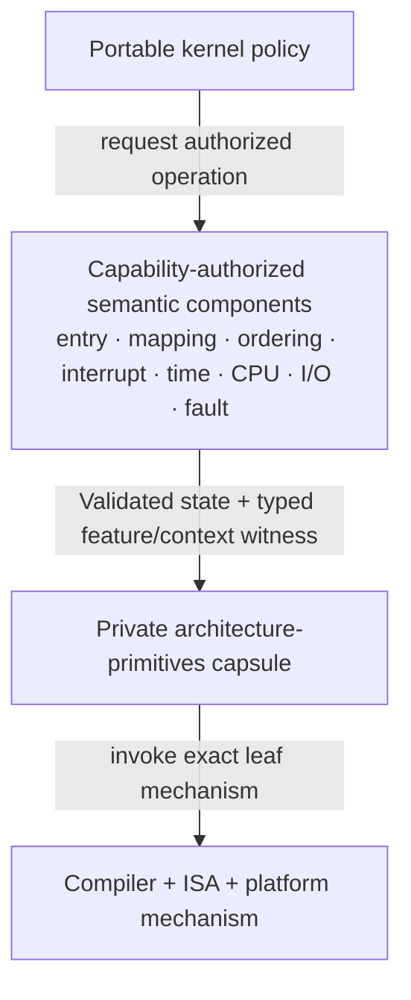
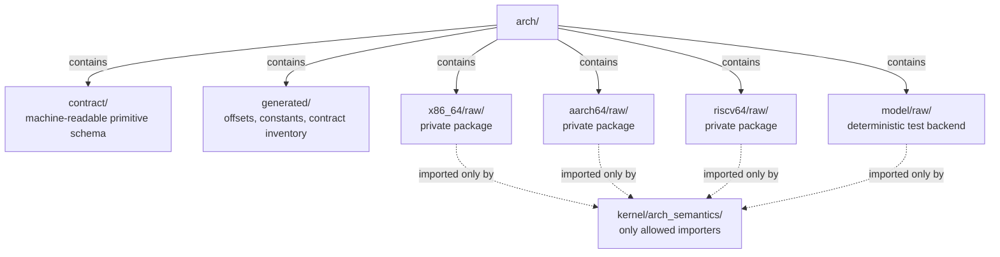
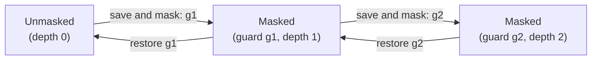
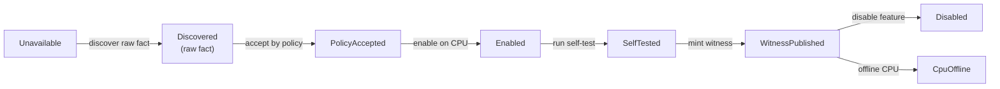
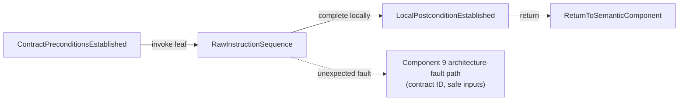

# Unsafe architecture-primitives capsule

The best implementation is a **private, build-selected ISA leaf package** with
an explicit contract for every instruction sequence and no direct consumers
outside the semantic architecture components. It is not a public hardware
abstraction layer. It contains only operations whose correctness depends on
privilege, an ISA instruction, a control register, compiler behavior, an ABI,
or an exact assembly sequence.

This is component 1 of the [kernel hardware and architecture support
layer](../kernel-hardware-and-architecture-support-layer.md). It supplies the
mechanism leaves used by entry, translation, ordering, interrupt, time, CPU,
I/O, and fault components. It never decides whether a caller has authority and
never upgrades a local instruction into a claim of global completion.

## Question, scope, and operational standard

The implementation question is:

> How can the kernel expose necessary privileged instructions while making
> their preconditions, compiler effects, architectural effects, and residual
> trust small enough to audit, test, and eventually verify?

Here “unsafe” is broader than a programming-language keyword. A perfectly
memory-safe wrapper can still be architecturally unsafe if it restores the
wrong interrupt state, uses a CPU fence for device completion, writes a
reserved control bit, issues a local TLB operation while claiming remote
completion, or executes an optional instruction on the wrong CPU.

A satisfactory capsule must meet this operational standard:

- there is no reachable inline assembly, system-register intrinsic, volatile
  MMIO access, control-register write, local interrupt manipulation, cache/TLB
  instruction, wait/halt instruction, or raw counter/deadline write outside
  the capsule and generated entry objects;
- every primitive declares required privilege, feature predicate, valid
  calling contexts, input constraints, register and flags clobbers, compiler
  memory effect, architecture ordering effect, fault behavior, re-entrancy,
  local/remote scope, and postcondition;
- callers cannot manufacture interrupt-state tokens, feature witnesses,
  register selectors, or mapped-I/O witnesses from integers;
- fundamental ISA and ABI selection occurs at build time; optional mechanisms
  use immutable feature witnesses, not a writable global function table;
- the build emits a reproducible disassembly, symbol/section map, generated
  structure offsets, contract inventory, and list of unverified assembly;
- model, emulator, and physical-hardware tests cover each supported feature
  path and failure path; unsupported features fail before invocation;
- no primitive allocates, blocks, invokes arbitrary callbacks, unwinds, or
  silently enables interrupts; and
- the measured cost of the safe semantic wrapper is reported separately from
  the raw instruction sequence before any wrapper is bypassed for speed.

## Evidence and synthesis

### Architecture specifications

The [Intel system-programming
documentation](../../30-sources/intel-2026-system-programming-documentation.md),
[Arm A-profile architecture
documentation](../../30-sources/arm-2026-a-profile-system-architecture-documentation.md),
and [RISC-V privileged
architecture](../../30-sources/risc-v-international-2026-privileged-architecture.md)
define instructions with visibly different privilege, fault, ordering, and
scope semantics. They support small, precise backends. They do not support a
portable API named only after approximately similar mnemonics.

For example, disabling ordinary local interrupts does not exclude all
NMI-like events; a local translation invalidation does not notify other CPUs;
and the sequences used for CPU memory, device access, instruction fetch, and
translation maintenance are not interchangeable. These distinctions belong
in contracts that callers can inspect.

### Kernel engineering and microkernel evidence

The [Linux low-level API
documentation](../../30-sources/linux-kernel-community-2026-low-level-core-apis.md)
is useful engineering precedent for explicit entry ordering, generic barrier
semantics, cache/TLB effects, and architecture-specific implementations. It is
not evidence that this project should reproduce Linux macros or its broad
compatibility surface.

The [L4 retrospective](../../30-sources/elphinstone-heiser-2013-l4-lessons.md)
reports a long-term move away from whole-kernel assembly and unusual private
calling conventions toward small assembly paths plus architecture-neutral
kernel code. The [comprehensive seL4 verification
paper](../../30-sources/klein-et-al-2014-comprehensive-sel4-verification.md)
demonstrates the value of a small mechanism set while explicitly naming
hardware, boot, assembly, caches, and devices among proof assumptions or
boundaries. Similar design does not transfer those proofs to this project.

### Verification evidence

[Serval](../../30-sources/nelson-et-al-2019-serval.md) demonstrates that executable
instruction interpreters and symbolic evaluation can verify bounded systems
binaries and find real bugs, but makes the ISA model itself a trusted artifact.
[Translation validation for
seL4](../../30-sources/sewell-et-al-2013-translation-validation.md) connected
verified C to its optimized binary while explicitly omitting assembly and
volatile hardware accesses in the reported boundary. Together they support
making the residual leaf visible and small; neither paper proves this proposed
capsule.

### Synthesis

No source establishes one universally best wrapper organization. The proposed
capsule combines three evidence-backed constraints:

1. the ISA manuals require exact per-instruction and per-sequence semantics;
2. maintainable and verifiable kernels minimize handwritten assembly; and
3. binary- and source-level proof claims must name the instruction, compiler,
   volatile-access, and device effects they exclude.

The contract manifest, type witnesses, and build gates below are project
proposals that require implementation evidence.

## Boundary and dependency rule



Only semantic components import the capsule. A scheduler can ask the context
component to switch an execution context; it cannot call `write_cr3`,
`write_ttbr`, or `write_satp`. A driver can use an authorized ordered MMIO
mapping; it cannot call a raw volatile load with a physical address. A BEAM
runtime invokes kernel services; it has no linkage to this package.

The source tree should enforce the boundary structurally. A representative
layout is:



In a language with module privacy and an `unsafe` construct, the entire raw
package remains private and every operation is internally marked unsafe. In C,
equivalent control needs private headers, hidden symbols or link sections,
static analysis that rejects forbidden includes/symbol references, and review
ownership. Language safety improves ordinary memory reasoning but does not
replace the architectural contracts.

## Contract schema

Every primitive should have a generated, reviewable record:

```text
PrimitiveContract {
    name,
    backend,
    required_privilege,
    required_features,
    allowed_contexts,
    input_invariants,
    register_clobbers,
    flags_clobbers,
    compiler_memory_effect,
    architecture_ordering_effect,
    visibility_scope,
    interrupt_effect,
    may_fault,
    may_nest,
    postcondition,
    test_ids,
    proof_status,
}
```

`allowed_contexts` is a closed set such as `EarlyBoot`, `ThreadKernel`,
`HardInterrupt`, `NmiLike`, `FatalCapture`, or post-seal `CrashSafe`.
`visibility_scope` distinguishes
the current instruction stream, local CPU, shareability domain, named CPU set,
device/interconnect domain, or system. Almost all capsule operations are local;
the semantic component constructs remote completion from requests and
acknowledgements.

These are primitive-contract allowed-set labels, not separately forgeable
facade tokens: `EarlyBoot`, `ThreadKernel`, `HardInterrupt`, `NmiLike`,
`FatalCapture`, and `CrashSafe` correspond to the facade's `BootContext`,
`ThreadContext`, `HardEntryContext`, `NmiContext`, `FatalCaptureContext`, and
`CrashContext` evidence. The NMI and fatal tokens are strict, non-widening
refinements: possession of one does not authorize every operation admitted in
ordinary hard entry. `CrashSafe` is available only after terminal sealing. Each
leaf declares the exact token class or closed set it accepts.

`proof_status` is evidence metadata: `Specified`, `UnitTested`,
`EmulatorTested`, `HardwareTested(profile)`, `ModelChecked(model)`, or
`RefinementProved(artifact)`. It is never inferred from a passing build.

Contracts should appear beside implementations and be compiled into a build
inventory. Code review rejects a primitive whose declaration says merely
“barrier,” “flush,” “disable interrupts,” or “write register” without naming
the missing dimensions.

## Primitive families and recommended interfaces

### Register access and feature witnesses

Raw register access is not a generic `(number, value)` API. Each writable
register or narrow register family gets a typed operation that masks or rejects
reserved fields and declares serialization requirements. Reads of feature and
status registers return backend-private raw bits to the boot/context component,
which produces immutable witnesses:

```text
FeatureWitness<F> {
    cpu_id: CpuId,
    cpu_incarnation,
    feature_evidence_generation,
    discovered_value,
    accepted_profile_generation,
}
```

An optional instruction accepts the corresponding witness. The witness is
minted only after discovery, enablement, and any self-test on that CPU. This
prevents a global “feature available” Boolean from authorizing execution after
migration to an incompatible CPU. Every optional primitive also consumes a
matching `CurrentCpuContext<CpuId, CpuIncarnation>`; equal numeric generations
on two CPUs are never sufficient identity.

### Local interrupt state

The operation is save-and-mask, not `interrupts_off()`:

```text
LocalInterruptGuard save_and_mask_local();
void restore_local(LocalInterruptGuard guard);
```

The guard contains the exact prior mask state, CPU identity/generation, and
nesting generation. It is linear where the language permits and opaque
otherwise. Restore on another CPU, double restore, out-of-order restore, or
restore after lifecycle rollover is an invariant violation.

The contract says which ordinary interrupt classes are masked and explicitly
states that NMI-, SError-, machine-check-, or debug-like events may still
arrive. Semantic components cannot use the guard as a global lock.

State is:



Production builds fail closed on a token/order mismatch. Fatal-entry code logs
the mismatch in preallocated state rather than attempting an unsafe repair.

### Compiler, CPU, device, and DMA ordering

The raw package provides exact building blocks, but portable semantic names
live one layer above. At minimum it distinguishes:

- compiler-only ordering;
- CPU load/store ordering and atomic synchronization;
- device-I/O ordering for the relevant memory type and shareability scope;
- completion/serialization stronger than mere ordering;
- instruction-stream synchronization;
- translation-maintenance ordering; and
- DMA visibility, which may also require cache and ownership operations.

An inline-assembly `volatile` annotation prevents particular compiler removal;
it is not automatically a compiler-wide memory barrier and says nothing about
CPU, device, or DMA completion. Conversely, a compiler memory clobber does not
emit an architectural fence.

The semantic ordering component selects the minimum correct sequence. The raw
capsule must not offer an attractive ambiguous `full_fence()` that callers use
to hide missing reasoning.

### Translation and cache maintenance

The capsule exposes local instructions with literal scope, such as a local
address invalidation under an already selected translation regime. Address
space ownership, page-table mutation, remote target selection, shootdown,
acknowledgements, and reclamation belong to component 3.

Similarly, cache primitives identify data versus instruction cache, address or
set/way form, point of coherency/unification, scope, alignment, and necessary
ordering. Component 4 assembles them into code-publication or DMA visibility
protocols. A raw cache instruction never returns `PublishedCode`.

### MMIO and port I/O leaves

Ordinary pointer dereference is not the MMIO API. A semantic accessor receives
an authorized, mapped `MmioWindow` carrying width, alignment, endianness,
memory type, and ordering profile. Only its final load/store reaches the raw
capsule. The raw leaf states whether it can fault and whether a posted write
requires an explicit readback/completion operation supplied by the platform
backend.

No capsule function accepts a physical address and maps it implicitly. No
register accessor grants DMA or interrupt authority.

### Wait, halt, wake, counters, and deadlines

Wait/halt instructions declare the mask/preemption state in which they are
safe, allowed wake sources, spurious wake behavior, and whether a retained
monitor can intercept them. Counter reads state width, serialization, and
scope. Deadline writes state the accepted range and whether programming a past
deadline triggers immediately or can be lost. Components 6 and 7 turn those
local facts into time and lifecycle semantics.

### Assembly entry and return leaves

The capsule owns the compiled symbols and implementations for irreducible unsafe
leaf code: vector bodies, first register spills, the stack-switch instruction
sequence, and final validated return or terminal halt/reset leaves. Component 2
owns vector-table installation and registration, selects and invokes the
appropriate leaf, supplies prevalidated CPU-local/stack operands, and owns
exceptional-stack objects and lifetime, nesting, raw-frame construction, and
the semantic state machine. Compiled leaf ownership does not let component 1
choose a system-call handler, scheduler policy, actor, recovery strategy, or
capture-store disposition.

Shared frame offsets and constants are generated from one authoritative layout
description and checked by compile-time assertions. Hand-maintained duplicate
offset files are prohibited.

## Build-time and run-time selection

### Build-time ISA and ABI

Fundamental ISA, endianness, privilege target, calling convention, red-zone
policy, stack alignment, code model, and object format are build-time choices.
The build records compiler, assembler, linker, flags, target description, and
architecture manual/profile revision in a machine-readable manifest.

Kernel objects use one pinned ABI that forbids implicit floating-point/vector
arguments in capsule calls. Exceptions must be named and saved explicitly.
Unwinding through a raw assembly frame is disabled unless unwind metadata is
generated and tested for that exact frame class.

### Run-time optional features

Optional mechanisms are chosen using immutable per-machine or per-CPU feature
witnesses. Selection happens outside the hottest instruction when possible:
construct an `InvalidationBackend`, `CounterBackend`, or `ContextShape` once,
then pass a sealed object to the semantic component.

Self-modifying “alternatives” patching can eliminate branches, but it creates
code-publication, rollback, audit, and attestation obligations. The initial
implementation should use build-selected code plus immutable branch/function
selection. Add patching only after component 4 can publish executable changes
and measurement proves the branch material.

Controller and IOMMU instances are not CPU-feature switches. They are
capability-bearing runtime objects bound from boot descriptors.

## Cross-ISA realization

The table names representative mechanisms, not interchangeable wrappers:

| Contract concern | x86-64 leaf examples | AArch64 leaf examples | RISC-V supervisor leaf examples | What remains visible |
| --- | --- | --- | --- | --- |
| Local ordinary interrupt state | RFLAGS/`CLI`-class save and mask | `DAIF` read/modify/write | `sstatus.SIE` CSR read/modify/write | Exact prior state; NMI-like exclusions |
| Privileged register access | CR/MSR/descriptor-table operations | `MRS`/`MSR` system registers | CSR read/write/set/clear | Register-specific valid bits and traps |
| CPU ordering | ISA fences and locked/atomic rules | `DMB`/`DSB`/`ISB` with domains | `FENCE` predecessor/successor sets | Ordering versus completion; memory type/scope |
| Translation-maintenance leaf | `INVLPG`/`INVPCID`-class operations | typed local or shareability-scoped `TLBI` plus required barriers | `SFENCE.VMA` | Declared local/shareability scope and instruction completion only; lifecycle target-set proof remains in component 3 |
| Instruction synchronization | Serialization/self-modifying-code sequences | data clean, instruction invalidate, `DSB`/`ISB` sequences | local `FENCE.I` | Remote CPUs require a protocol above |
| Wait/wake | `HLT`/monitor-wait family when enabled | `WFI`/`WFE` and event mechanisms | `WFI`, possibly intercepted | Wake sources and retained-monitor dependency |
| Counter/deadline | TSC/deadline facilities when witnessed | architectural counter/timer registers | counter and timer path exposed by the profile/environment | Width, invariance, privilege, virtualization |
| Entry/return | IDT/SYSCALL entry, IRET/SYSRET-class leaves | vector entry and `ERET` | `stvec` entry and `SRET` | Raw frame and validated envelope differ |

The common interface is expressed in the semantic caller's effect, not these
mnemonics. A backend can use a stronger sequence than minimally necessary, but
that strengthening is recorded so performance regressions and accidental
caller dependence can be detected.

## Invocation lifecycle and failure model

Optional primitives have a feature lifecycle:



Invocation has a deliberately short lifecycle:



The semantic component then performs remote requests, acknowledgement,
generation changes, and policy decisions. A primitive that faults unexpectedly
enters component 9's architecture-fault path with the contract ID and inputs
safe to disclose. It does not convert the fault to a guessed “unsupported”
result after state may have changed.

Recoverable discovery probes are a separate class. Their fault region,
recovery PC, permitted partial effects, and one-time boot context are declared
explicitly. General exception-table recovery must not turn arbitrary privileged
faults into success.

## Safety and security hazards

### Compiler and ABI mismatch

- Missing clobbers can let the optimizer retain a register or memory value
  across an instruction that invalidates it.
- A “naked” or nonstandard function can acquire an unadvertised prologue,
  stack use, sanitizer call, stack protector, profiling hook, or vector
  instruction.
- Link-time optimization can clone or reorder code across an intended boundary
  unless the compiler contract actually prevents it.
- Different structure packing between generated offsets and compiled code can
  corrupt an entry frame before ordinary diagnostics exist.

Mitigation is artifact-level: pin flags, assert layouts, inspect relocations and
disassembly, scan forbidden opcodes/sections, and execute ABI canaries. Source
review alone is insufficient.

### Scope inflation

The most dangerous wrapper is one whose name promises more than the
instruction. Local interrupt masking is not mutual exclusion; local TLB
maintenance is not a shootdown; a cache clean is not DMA quiescence; an MMIO
write is not device completion; and an instruction barrier is not necessarily
a speculation defense. Result types use `Local...` names so a remote/global
postcondition can be constructed only by its coordinator.

### Optional instruction and heterogeneous CPU failure

A feature present on the boot CPU may be absent, disabled, virtualized
differently, or affected by errata on another CPU. Per-CPU witnesses carry
typed CPU identity, incarnation, and feature-profile generation and are
checked against the current-CPU context token. Migration cannot carry a witness
as if it were machine-global.

### Interrupt and fatal-context hazards

Hard-entry and NMI-like code cannot call a primitive that may allocate, take a
regular lock, fault without a dedicated recovery path, or invoke instrumented
code. Contract context sets are checked statically where possible and by debug
assertions otherwise. Production safety cannot depend solely on debug checks.

The capsule owns only compiled unsafe leaf code and its clobber contracts,
including the small vector bodies and stack-switch sequence above. Component 2
configures, selects, and invokes those symbols and owns exceptional-stack
storage and lifetime, nesting, raw-frame construction, and minting of the
lexically scoped entry-context token justified by that state. Component 9 owns
architecture-fault staging/terminal slots, decoding, and crash-sink lifecycle.
A primitive used by those components does not acquire their state or policy
ownership.

### Ambient authority

Raw selectors, physical addresses, vector numbers, and page-table pointers are
ambient authority. The semantic layer consumes capabilities and passes only
validated encodings to a leaf. Keeping a primitive private limits accidental
use, but it does not authorize the call; capability and lifecycle checks remain
above.

### Speculation and undocumented effects

Architecture security guidance and errata may require sequences beyond the
base instruction semantics. Those sequences are pinned in a mitigation
profile, assigned contract IDs, and tested on exact CPU generations. A generic
`speculation_barrier()` without attack class, boundary, and processor coverage
is not an auditable defense.

## Verification and testing

### Static boundary checks

- Reject raw assembly/intrinsics outside approved files.
- Reject imports or symbol references to the capsule outside the semantic
  component allowlist.
- Verify that every exported raw symbol has one contract record and every
  contract has implementation/test IDs.
- Compare generated layout constants against compiled sizes, alignments, and
  offsets.
- Scan entry and NMI sections for calls, stack probes, sanitizer hooks, vector
  opcodes, indirect branches, and unexpected relocations.

### Model backend and contract tests

The model backend implements explicit architectural state rather than
performing instructions. It should generate failures for wrong privilege,
feature absence, invalid register fields, interrupt-token misuse, local versus
remote scope mistakes, and faulting MMIO. Semantic-component tests then prove
they do not rely on stronger accidental behavior.

### Emulator and hardware tests

For every primitive and supported feature branch:

- run success and documented-fault cases in an emulator;
- inject interrupts around every permitted boundary;
- compare saved/restored register, flags, control, and mask state;
- use multi-CPU tests to demonstrate that local operations do **not** create
  remote completion accidentally;
- execute architecture memory-model litmus tests for barrier mappings;
- test under the retained firmware/hypervisor as well as the nominal native
  profile; and
- repeat on at least two physical implementations before claiming an ISA-wide
  profile.

Emulator success is functional evidence for the modeled implementation, not
proof of cache, speculation, device, or erratum behavior on hardware.

### Binary-level assurance

The build stores normalized disassembly and hashes it with the contract
inventory. Review checks exact instruction sequences and fall-through. A later
assurance phase can apply Serval-like symbolic execution or another executable
ISA model to bounded leaves. Translation validation can cover compiled safe/C
portions, but handwritten assembly and volatile device accesses remain named
obligations unless separately modeled.

### Performance measurements

Measure raw and semantic paths separately using serialized counters where the
profile supports them:

- median, p99, and worst observed cycles for interrupt save/restore, counter
  read, deadline write, each barrier class, local invalidation, MMIO access,
  and wait/wake;
- code size and instruction count per leaf;
- branch-miss and cache effects of optional-feature dispatch;
- entry-path overhead with and without contract assertions and mitigations; and
- variation under virtualization and contention.

The initial criterion is no unmeasured abstraction bypass. Numeric budgets
must be based on a selected reference machine; the literature does not justify
inventing one universal cycle limit.

## Staged implementation

### Stage 0: contract vocabulary and model

Define allowed contexts, scopes, ordering domains, feature witnesses, failure
classes, and the contract schema. Implement interrupt guards, register
selectors, and local completion in a deterministic model backend.

### Stage 1: one ISA minimum

Implement only early entry, feature/status reads, local interrupt state, one
counter/deadline path, required barriers, translation-root install, local
invalidation, wait/halt, and terminal reset/halt for one virtual profile. Emit
the disassembly and reject direct use from other modules.

### Stage 2: entry and translation integration

Generate frame offsets, connect the component 2 stubs, and make component 3
construct local translation effects. Add systematic interrupt-window and fault
injection.

### Stage 3: device and SMP primitives

Add MMIO, controller access, IPIs, remote-request transport leaves, cache/DMA
operations, and IOMMU register access only as their semantic components arrive.
Do not pre-build a speculative “complete HAL.”

### Stage 4: second ISA

Port to an ISA with materially different ordering and privilege semantics. Any
primitive contract that cannot state both postconditions honestly splits into
different semantic operations rather than gaining backend conditionals in
callers.

### Stage 5: assurance and optimization

Apply executable-model verification to the smallest high-risk leaves, test
physical machines and errata, then consider static calls, inlining, or code
patching only where measurement identifies material cost.

## Alternatives and tradeoffs

### Inline assembly everywhere

Inlining a one-instruction leaf can eliminate a call and expose constants to
the compiler. It also duplicates contracts, broadens optimizer interactions,
and makes opcode inventory difficult. Permit inline assembly only inside the
private capsule; semantic wrappers may be inlined around it.

### One large assembly port

A whole assembly port offers exact control but greatly expands ABI, proof,
maintenance, and review cost. Research across L4 generations supports keeping
only irreducible entry/return and instruction leaves in assembly, then
optimizing measured paths.

### A flat architecture trait or vtable

A runtime vtable makes unit substitution easy but hides which optional branch
is legal on a CPU and adds indirect calls to critical paths. Use a model backend
at test/build time, compile-time ISA selection in production, and immutable
typed instance objects for genuinely multiple controllers.

### Expose raw operations as public `unsafe` calls

Requiring callers to write an `unsafe` marker improves visibility but spreads
architectural proof obligations and ambient authority. The capsule should be
private; the few semantic implementations bear and document those obligations.

### Generate every sequence

Code generation prevents offset drift and can derive repetitive wrappers from
contracts, but generators become trusted build tools and can obscure code
review. Generate declarations, offsets, inventories, and mechanical variants;
keep security-critical instruction sequences compact and visible in emitted
artifacts.

### Choose a language as the architecture contract

Rust, C, Zig, or another implementation language changes which ordinary bugs
the compiler prevents. None defines the hardware's interrupt, translation,
device, speculation, or completion semantics. Select a language separately;
retain this capsule boundary and evidence ledger in all cases.

## Relationship to capabilities and the managed runtime

The capsule has no capability model because it is below authority checking.
That fact is a reason to hide it, not a reason to pass raw addresses through
capabilities as integers. The minimal kernel's semantic component validates a
typed capability, resource generation, CPU state, and lifecycle, then invokes
one leaf with already encoded values.

The BEAM-compatible runtime, ordinary actors, process-local tracing garbage
collectors, drivers, and supervisors remain outside privileged code. They use
service and IPC contracts. No runtime optimization may invoke a capsule leaf
directly, even when a hardware instruction resembles a VM primitive.

OTP's useful influence is fault containment and explicit behavior: a failed
device service may restart, but a malformed control-register write is not a
supervisable ordinary failure. Keeping the leaf small reduces the
unsupervisable trusted surface.

## Unresolved questions

- Which implementation language and compiler offer the best combination of
  freestanding support, explicit inline-assembly semantics, reproducibility,
  and verification tooling for the first port?
- What contract-description format can generate documentation and checks
  without becoming a second, less reviewable programming language?
- Which assembly sequences can current executable ISA models cover, including
  system registers, faults, and barriers?
- Should optional feature dispatch use sealed function pointers, enum matches,
  or separate kernel images for the first performance profiles?
- How should CPU errata override a witnessed architectural feature while
  keeping attestation and crash evidence reproducible?
- Can interrupt guards be made statically linear across all relevant kernel
  code, or is a generation-checked dynamic fallback required?
- What evidence is sufficient to claim that a compiler memory effect matches a
  language memory model in freestanding code?
- Which physical machines provide meaningfully different coverage for the
  first two ISA backends?

## Connections

- [Kernel hardware and architecture support
  layer](../kernel-hardware-and-architecture-support-layer.md) defines the
  semantic components that exclusively consume these leaves.
- [Normalized boot handoff and feature
  discovery](normalized-boot-handoff-and-feature-discovery.md) creates the
  immutable feature and mitigation profile from which witnesses are minted.
- [Privileged entry, exit, and execution
  context](privileged-entry-exit-and-execution-context.md) owns the state
  machine around the capsule's entry and final-return fragments.
- [Minimal privileged kernel layer](../minimal-privileged-kernel-layer.md) supplies
  the authority and object-lifecycle checks that must occur before a raw
  mechanism is invoked.
- [Kernel hardware-contract
  inquiry](../../40-inquiries/what-contract-should-the-kernel-hardware-and-architecture-layer-provide.md)
  tracks whether this boundary remains small on real ports.

## Sources

- [Intel 64 and IA-32 system programming
  documentation](../../30-sources/intel-2026-system-programming-documentation.md)
- [Arm A-profile system architecture
  documentation](../../30-sources/arm-2026-a-profile-system-architecture-documentation.md)
- [The RISC-V privileged
  architecture](../../30-sources/risc-v-international-2026-privileged-architecture.md)
- [Linux kernel low-level core API
  documentation](../../30-sources/linux-kernel-community-2026-low-level-core-apis.md)
- [From L3 to seL4: What have we learnt in 20 years of L4
  microkernels?](../../30-sources/elphinstone-heiser-2013-l4-lessons.md)
- [Comprehensive formal verification of an OS
  microkernel](../../30-sources/klein-et-al-2014-comprehensive-sel4-verification.md)
- [Scaling symbolic evaluation for automated verification of systems code with
  Serval](../../30-sources/nelson-et-al-2019-serval.md)
- [Translation validation for a verified OS
  kernel](../../30-sources/sewell-et-al-2013-translation-validation.md)
