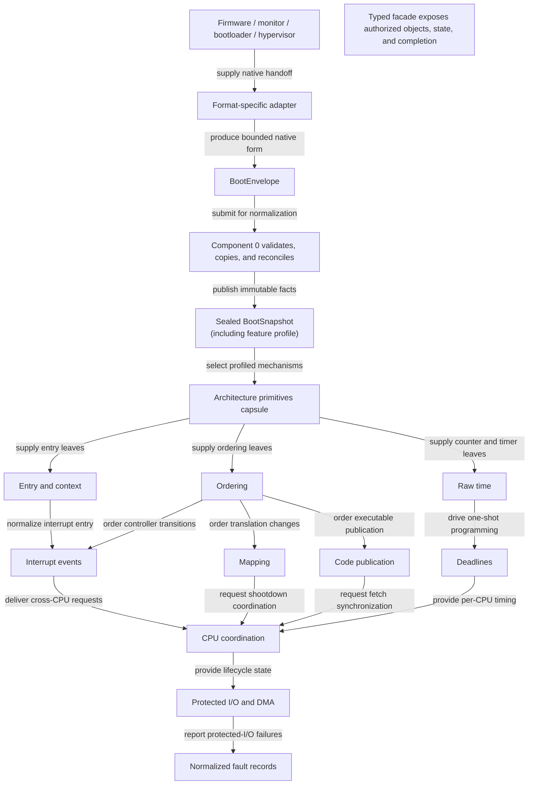
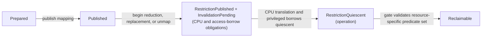
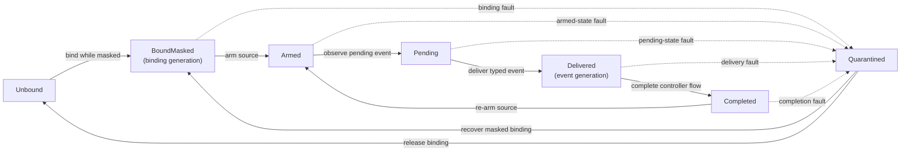
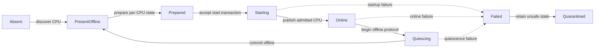
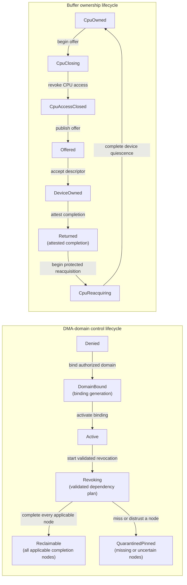

# Kernel hardware and architecture support layer

The hardware and architecture support layer should be the kernel's small,
explicit translation boundary between architecture mechanisms and portable
kernel semantics. It should not be a monolithic “HAL,” a collection of device
drivers, or a description of a physical board. Its job is to make privileged
state transitions safe, authorized, observable, and testable.

The proposed layer has eleven cooperating components:

1. normalized boot handoff and feature discovery;
2. an unsafe architecture-primitives capsule;
3. privileged entry, exit, and execution-context management;
4. address translation and protection transitions;
5. memory ordering, cache maintenance, and code publication;
6. interrupt routing and event delivery;
7. raw time and deadline programming;
8. logical-CPU coordination and lifecycle;
9. protected I/O and DMA ownership;
10. architecture-fault normalization; and
11. a typed kernel-facing facade.

These are proposed contracts, not implemented facts. The sources establish
constraints and precedent; experiments must still determine the smallest
usable interface, latency, portability, and failure behavior.

## Question and operational standard

The question is not “which hardware should the project buy?” It is:

> What privileged mechanisms must a kernel own, and what semantic contracts
> should hide or expose architecture differences so the rest of the operating
> system can remain safe, portable, and faithful to OTP/BEAM principles?

A satisfactory answer must do more than enumerate CPU features. It must:

- name every authority that crosses the privilege boundary;
- define success and completion for local and remote state changes;
- identify which operations may block, allocate, re-enter, or fail;
- keep device policy, scheduler policy, and physical-platform engineering out
  of the layer;
- represent meaningful architecture differences without letting them leak as
  arbitrary conditionals throughout the kernel;
- admit at least two substantially different ISA backends without reducing the
  interface to their lowest common denominator;
- expose enough state to test stale translations, nested exceptions, interrupt
  races, context leakage, CPU removal, and DMA revocation; and
- state the assumptions excluded from proof or testing, including firmware,
  errata, DMA-capable devices, caches, and machine-check behavior.

## Exact scope

“Hardware support” is ambiguous, so the boundary must be stated explicitly.

| Inside this layer | Adjacent input or backend | Above this layer | Outside this deep dive |
| --- | --- | --- | --- |
| Trap/syscall/interrupt entry and validated return | Architecture vectors, registers, privilege modes | System-call dispatch and service policy | Board selection, PCB design, signal integrity |
| Execution-context save, restore, ownership, and sanitization | Integer, FP/SIMD/vector, debug, and control state | Thread and actor scheduling policy | Physical core implementation comparison |
| Page-table mutation protocol, protection effects, TLB/cache completion | MMU/MPU/PMP and architecture invalidation instructions | Virtual-memory policy and physical-frame allocation | DRAM part selection and memory-controller tuning |
| CPU, compiler, device, and DMA ordering contracts | ISA memory model and cache-coherence rules | Locking algorithms and runtime data structures | Bus electrical details |
| Interrupt source control, flow semantics, and typed delivery | APIC/GIC/PLIC/AIA-like controller backends | Driver-specific device acknowledgement and service | Peripheral protocol implementation |
| Raw monotonic counters and one-shot deadlines | Architectural counter/timer facilities | Timer queues, wall clock, scheduling policy | Oscillator and clock-tree engineering |
| Logical CPU identity, IPI, startup, quiescence, and removal | Firmware or hypervisor CPU-start primitive | Load balancing and placement policy | Power rails and physical power sequencing |
| MMIO/PIO semantics, DMA mapping, IOMMU domains, and revocation | Architecture/platform access and remapping mechanisms | Device drivers and I/O-service policy | Device register/protocol deep dives |
| Normalized architecture faults and crash-safe capture | Machine-check, SError, RAS, and reset mechanisms | Recovery, degradation, restart, and panic policy | Hardware repair and fleet operations |
| Boot-information validation and feature profiles | Bootloader/firmware-provided description | Global boot orchestration and service startup | Firmware implementation and board bring-up |

At the provider boundary, component 0 consumes a bounded, relocatable
`BootEnvelope` produced by a format-specific adapter. After validating, copying,
and reconciling that input and terminating the provider contract, it publishes a
sealed kernel-owned `BootSnapshot` containing memory extents, logical-CPU
candidates, controller descriptors, firmware-call gates, feature evidence, and
immutable platform facts. All later components consume the `BootSnapshot`, not
the borrowed envelope or parser internals. Designing firmware, choosing a board,
or bringing up a vendor-specific peripheral is not part of this layer.

## Why this is not one opaque HAL

The term HAL suggests that architecture differences can be hidden behind a
flat table of interchangeable functions. That is unsafe when the differences
change completion, ordering, authority, or failure semantics.

Examples make the problem concrete:

- a local TLB invalidation is not equivalent to a completed cross-CPU
  shootdown;
- an edge-triggered interrupt cannot always use the same mask/acknowledge/EOI
  sequence as a level-triggered one;
- a CPU memory fence is not necessarily a device-I/O or DMA-visibility fence;
- saving integer registers is not equivalent to transferring ownership of
  lazily managed vector state;
- writing executable bytes is not equivalent to making them fetchable on every
  CPU that may run them; and
- removing a DMA mapping from software metadata is not equivalent to proving a
  device and IOMMU can no longer access the frames.

The Flux OSKit experience supports semantic component interfaces and explicit
glue rather than source-level modularity alone. L4 experience adds that a small
architecture-specific surface and tailored critical paths can coexist with a
portable kernel. The design target is therefore **semantic components with
small, named architecture backends**, not a pretense that architectures are
identical.

## Design principles

### Separate protection from management policy

The Exokernel distinction is useful even without adopting an exokernel. The
kernel must enforce authority, isolation, revocation, and accounting. It need
not choose every resource-management policy. In this layer:

- protection includes who may map a frame, route an interrupt, program a
  deadline, start a CPU, or bind a DMA domain;
- mechanism includes how the authorized transition becomes architecturally
  complete; and
- management policy includes which process gets the frame, where work should
  run, which timer expires first, and how a driver batches requests.

Management remains above this layer unless only privileged code can enforce
the relevant invariant.

### Define operations by observable effects

CertiKOS's layered approach treats an interface as observable events and state,
not the hidden implementation below it. Applying that discipline here means an
operation such as `unmap` needs a postcondition—future translations can no
longer reach the frame after a returned completion epoch—not merely “a PTE was
cleared.” It also means recording proof limits: CertiKOS explicitly excluded
TLB behavior and boot/device initialization from parts of its verified model;
this project must not silently call those gaps solved.

### Make authority explicit

Raw interrupt numbers, physical addresses, CPU indexes, and page-table pointers
are ambient authority. The common interface should instead accept typed,
generation-checked handles created by an authority-bearing service:

- `AddressSpace`, `Mapping`, `MappingTransaction`, and `FrameAuthority`;
- `ExecutableImage` and its `CodeWriteLease`, `SealedCode`, and
  `PublishedCode` authority views;
- the minimal kernel's accounted `IRQBinding` aggregate, exposed as typed
  `InterruptSource`, `InterruptRoute`, and `InterruptBinding` views, plus its
  `EventSink`;
- `CpuHandle` and the authorizing `CpuLifecycleAuthority`;
- `TimerChannel` and `DeadlineToken`; and
- `DmaAddressSpace`, `DmaMapping`, `DeviceQueueLease`, and `DeviceEndpoint`.

Capabilities authorize an operation; they do not prove that its asynchronous
effects have completed. Completion tokens or epochs carry that second fact.

### Prefer explicit lifecycle state over hidden call order

Every cross-CPU, device-visible, or revocable resource needs a lifecycle. Its
state and legal transitions should be inspectable. Generations prevent a late
interrupt, stale completion, or reused numeric identifier from acting on a new
object.

### Keep exceptional paths bounded

Trap, interrupt, NMI-like, and machine-fault paths must declare whether they
may allocate, lock, block, invoke instrumented code, or nest. The default hard
entry path should use preallocated CPU-local state, do bounded work, capture
the minimum evidence, and defer ordinary processing through a typed event.

### Design for heterogeneous, changing machines

The Multikernel work argues that explicit messages and replicated per-core
state can fit machines whose topology and memory characteristics are not well
represented by one shared kernel structure. This project need not adopt a pure
multikernel. It should nevertheless avoid assuming that every CPU has
identical features, uniformly cheap shared memory, or permanent online status.

## Proposed dependency structure

The components form a directed set of contracts rather than a stack in which
every call simply moves downward:

The arrows are dependencies, not permission to bypass ownership. For example,
the DMA component can depend on mapping and ordering primitives, but it cannot
invent a `FrameAuthority`; the memory manager must delegate one.

Each component now has an independent implementation deep dive, linked from
the [kernel hardware and architecture support
map](../10-maps/kernel-hardware-and-architecture-support.md#component-implementation-deep-dives).
Those notes refine the compact responsibilities below into operational
standards, object and state-machine proposals, cross-ISA realizations, failure
analysis, verification plans, and staged implementations. They remain
proposals pending the executable and two-ISA evidence required by the
[contract inquiry](../40-inquiries/what-contract-should-the-kernel-hardware-and-architecture-layer-provide.md).

## Component 0: normalized boot handoff and feature discovery

### Responsibility

Establish the immutable facts needed before normal allocation and concurrency
exist. The component validates, copies, and normalizes input supplied by a
bootloader, monitor, firmware, or hypervisor. It does not implement those
systems.

### Internal subcomponents

1. **Early entry shim.** Establishes a known stack, privilege level, interrupt
   state, addressability regime, and minimal register convention.
2. **Boot-information validator.** Checks alignment, overlap, bounds,
   checksums/versioning where available, and whether reserved ranges conflict
   with kernel-owned ranges.
3. **Memory-extent normalizer.** Produces typed usable, reserved, persistent,
   device, and kernel-image extents without deciding the allocator policy.
4. **CPU and topology snapshot.** Creates stable logical identifiers and
   records initially present CPUs and immutable topology hints.
5. **Mechanism descriptor registry.** Records interrupt controllers, timer
   sources, firmware call gates, console/crash sinks, and DMA-remapping units
   as descriptors for later backend binding.
6. **Feature/errata profile.** Captures required, optional, disabled, and
   mitigated CPU features, including translation, atomics, extended state, and
   virtualization.

### Contract and invariants

- All borrowed boot memory is copied or pinned before its provider may reclaim
  it.
- Overlapping or contradictory extents fail closed; they are not silently
  merged into allocatable memory.
- Feature use follows successful discovery and policy acceptance, never an ISA
  family name alone.
- The profile is immutable after publication. A CPU with incompatible required
  features cannot become online under the same profile.
- Original descriptors and validation errors remain available in crash
  evidence so normalization is auditable.

### Boundary and alternatives

A kernel can host each format-specific adapter in discardable early code or
require an external loader to produce the single native `BootEnvelope`. The
former improves standalone reach but enlarges fragile early code. The latter
simplifies the kernel but trusts a larger pre-kernel chain. In both cases the
same bounded envelope enters the protocol-independent normalizer, and only its
sealed kernel-owned `BootSnapshot` crosses the second boundary into later
components. A practical initial design is a versioned native `BootEnvelope`,
small separately testable adapters, and one deterministic normalizer. Board
bring-up remains outside both the common architecture layer and this research.

## Component 1: unsafe architecture-primitives capsule

### Responsibility

Contain the smallest operations whose correctness depends directly on ISA
instructions, control registers, compiler intrinsics, or calling conventions.
This is the layer's unsafe leaf, not its public interface.

### Internal subcomponents

- register and control-state access;
- local interrupt mask/save/restore;
- halt, wait, wake, and speculation-control primitives;
- architecture atomics and compiler fences;
- CPU-memory, device-I/O, and DMA barrier primitives;
- scope-typed local cache and translation-maintenance leaves, while component
  3 owns lifecycle-aware remote target-set proof and completion;
- port/MMIO access primitives where the ISA requires them;
- cycle/counter reads and local deadline writes;
- bootstrap stack/vector helpers; and
- compiled, narrowly bounded assembly entry/return/fatal leaves.

Component 1 owns those compiled unsafe leaf symbols and their clobber/effect
contracts. Component 2 installs vector-table entries, selects and invokes a
leaf, supplies its prevalidated stack and CPU-local operands, and owns entry,
nesting, raw-frame, dispatch, and recovery state.

### Contract and invariants

- Each primitive states clobbers, preconditions, ordering, privilege level,
  faultability, and local-versus-remote scope.
- No primitive grants authority. Callers reach it only through a semantic
  component that has already validated ownership and state.
- A compiler barrier is never substituted for a CPU or device barrier.
- “Disable interrupts” is represented as saved local state with nesting rules,
  not a globally meaningful Boolean.
- Assembly is minimized to code that cannot be expressed correctly or audited
  adequately in the implementation language. Optimization of a critical path
  follows measurement, not tradition.

### Port structure

Most selection should happen at build time for an ISA and ABI. Runtime feature
selection is appropriate for architectural variants—an available invalidation
instruction or vector-state size—but a runtime virtual-method call on every
trap entry would add cost and obscure invariants. The preferred split is:

- compile-time backend selection for fundamental ISA semantics;
- immutable per-machine or per-CPU feature tables for optional mechanisms; and
- capability-bearing runtime objects for multiple controller or IOMMU
  instances.

The capsule should be contract-tested with model backends, but its real
instruction sequences require emulator and hardware tests plus inspection of
generated code.

## Component 2: privileged entry, exit, and execution context

### Responsibility

Turn architecture-defined exceptions, interrupts, system calls, and
non-maskable events into a kernel-defined execution state; then return only to
a validated destination. Own every piece of processor state that could leak
between protection domains or affect privilege.

### Internal sublayers

#### Vector configuration and compiled-leaf invocation

Component 2 configures the vectors and exceptional stacks and invokes the
component-1-owned compiled leaf selected for the entry class. The first
instructions must cope with architecture-defined partial state: they select or
verify the component-2-owned safe stack, preserve registers that will be
overwritten, record the raw cause, constrain speculation where required, and
establish the calling convention for low-level code. Owning the leaf code does
not give component 1 ownership of these objects or the resulting dispatch.

#### Entry-state transition

Common low-level code records whether the interrupted context was user,
kernel, idle, nested interrupt, or NMI-like; switches memory/accounting context
if needed; and changes tracing, preemption, and lock-state bookkeeping in a
specified order. Linux's entry documentation is useful precedent for treating
this ordering as a contract and marking windows where instrumentation is
unsafe.

#### Frame normalization

A `RawArchFrame` remains backend-private. It is decoded into one of:

- `EntryFrame::UserCallFrame` or `EntryFrame::UserFaultFrame`, containing a
  validated `UserReturnEnvelope` plus the appropriate normalized payload;
- `KernelFaultFrame`, containing enough internal state to diagnose or recover;
- `ArchitectureFaultFrame`, carrying a bounded view for a semantic machine/RAS
  fault before component 9 captures source-specific state;
- `InterruptFrame`, optimized for bounded event delivery;
- `NmiFrame`, for a diagnostic NMI-like event that is not itself a machine
  fault; or
- `FatalFrame`, stored in preallocated crash state.

The types prevent a handler from returning a machine-check frame through the
ordinary user-return path. An NMI-delivered machine error remains an
`ArchitectureFaultFrame` under `NmiContext`; uncertainty alone does not turn it
into `FatalFrame`.

#### Dispatch and deferred work

The hard path classifies the cause, captures bounded evidence, acknowledges
only the controller state required by its flow contract, and either completes a
small kernel action or posts a typed event. It does not run arbitrary device or
actor code.

#### Return validation

Return verifies privilege bits, canonical/aligned addresses, enabled user
features, interrupt state, reserved control bits, and any architecture-specific
return hazards. It restores state in an order that cannot expose kernel data or
accept a forged privilege level.

#### Extended-state ownership

FP, SIMD, vector, matrix, debug, performance-monitoring, protection-key, and
similar state is described by a feature-dependent `ContextShape`. A per-CPU
`CpuExtendedUnitState` records whether that hardware unit is disabled, clean,
resident for exactly one context/residency generation, scrub-required, or
failed. Each context independently owns a `ContextExtendedState` that is
disabled, uninitialized, saved in its charged buffer, resident on exactly one
CPU generation, discarded, or failed. A resident CPU state and context state
must form one generation-matched pair; many other contexts may remain saved.

### Invariants

- Every path that can reach less-privileged execution passes the same semantic
  validation, even if fast and slow instruction paths differ.
- Context belonging to one protection domain is never observable in another.
- The frame records whether a fault occurred in user, kernel, entry, or nested
  context; handlers do not infer it from mutable global state.
- Hard-entry code is bounded and uses only operations declared safe for that
  context.
- `NmiContext` and `FatalCaptureContext` are non-widening effect subsets of
  `HardEntryContext`; `CrashContext` begins only after terminal evidence is
  sealed.
- Nesting depth is bounded or fails into a crash-safe path.
- A context cannot migrate while its extended state is paired with a resident
  CPU unit.

### Eager versus lazy extended state

Lazy FP/SIMD switching can avoid saves when a thread does not use the unit, but
LazyFP demonstrated that speculative execution can expose state left behind by
another context. New and variable-sized vector facilities also complicate
ownership and accounting. The safe initial policy is eager save/restore or
eager scrub for every enabled feature, with lazy ownership treated as a later,
separately proved optimization. Disabling an unused feature is safer than
pretending its state does not exist.

### Architecture realizations

- x86-64 uses IDT-defined entry, privilege transitions, syscall mechanisms,
  architecture exception frames, and XSAVE-described state.
- AArch64 uses exception levels, vector classes, saved program state, exception
  link registers, and feature-dependent FP/SIMD/SVE/SME state.
- RISC-V uses delegated traps, cause/value/status registers, and optional
  floating-point/vector state whose dirty status is architectural.

The common contract is the normalized transition and ownership model, not a
fictional identical register frame.

## Component 3: address translation and protection transitions

### Responsibility

Turn authorized changes to address-space objects into architecturally complete
protection changes. It owns page-table/region encoding, translation-context
identifiers, invalidation, remote shootdown, and safe reclamation. It does not
choose eviction, heap layout, or which client deserves memory, and it exposes no
public execute-grant operation. Component 4 alone orchestrates public
executable-code publication through component 3's private prepared mapping
effects.

### Internal subcomponents

1. **Address-space object.** Typed root plus backend format, generation,
   active-CPU set, feature profile, and ownership.
2. **Mapping validator.** Checks alignment, range, frame authority, aliasing,
   executable/write policy, memory type, and backend-representable attributes.
3. **Page-table or protection encoder.** The only code allowed to construct
   architecture entries or region descriptors.
4. **Mapping transaction.** Batches prepare/publish/replace/unmap changes and
   records their affected virtual ranges and CPUs.
5. **Translation-context allocator.** Manages ASID/PCID-like identifiers with
   generations and rollover rules.
6. **Invalidation planner.** Selects local address, local context, remote range,
   or global invalidation according to backend guarantees.
7. **Shootdown coordinator.** Sends requests, tracks acknowledgements, handles
   offline or unresponsive CPUs, and produces generation-bound completion
   evidence that the mapping transaction incorporates into its terminal
   publication epoch.
8. **Reclamation gate.** Prevents reuse of page tables and frames until stale
   walkers, translations, DMA, and executable references are quiescent.
9. **Safe user-access helpers.** Perform bounded copy/probe operations with
   explicit fault recovery and no ambient kernel mapping assumptions.

### Mapping lifecycle

An additive map may have a shorter safe path than permission reduction,
replacement, or unmap. The transaction class records which postcondition is
needed. A returned `Published` result does not imply that old access is closed
or that a removed mapping is safe to reclaim. Restrictive callers await
`RestrictionQuiescent`; only the reclamation gate may emit `Reclaimable` after
the exact resource's remaining predicates hold.
Admission errors are returned only before the first mutation. Once accepted,
the operation owns its frozen CPU targets and resource pins until success,
drained cancellation, or an explicit incomplete/quarantine terminal record.

### Invariants

- Only code holding both address-space authority and appropriate frame
  authority may create a mapping.
- Writable-plus-executable mappings are denied by default. Controlled code
  publication uses its own lifecycle rather than a persistent W+X alias.
- Page-table memory has explicit ownership and is not recycled before walker
  and translation quiescence.
- An ASID/PCID value is paired with a generation; numeric reuse cannot make a
  stale translation valid for a new address space.
- Permission reduction and unmap are not complete until every CPU that could
  use the stale translation has acknowledged the required invalidation or has
  passed through a state that proves it cannot use it.
- Failure of a target CPU to acknowledge is a first-class failure. The kernel
  may quarantine/offline that CPU or escalate; it may not declare completion.

### Architecture differences that stay visible

The backends differ materially:

- x86-64 page tables and PCIDs provide particular invalidation and coherency
  rules through instructions such as `INVLPG`/`INVPCID` and control-register
  transitions;
- AArch64 combines ASIDs, translation regimes, TLBI scopes, barriers, and
  break-before-make requirements; and
- RISC-V Sv schemes and ASIDs use `SFENCE.VMA` locally, with a separate
  cross-hart coordination path for remote completion.

The portable caller asks for an effect and receives a completion scope. The
backend retains explicit flags for semantic differences that cannot be safely
normalized, such as supported page sizes, accessed/dirty behavior, memory
types, and execute-only capability.

### Translation authority versus access authority

The least-privilege memory model of Achermann and colleagues highlights that
authority to configure a translator is different from authority to access the
memory behind it. This distinction is useful for CPUs and IOMMUs alike:

- a memory manager can delegate a frame for a bounded mapping without
  delegating the entire page-table root;
- an I/O service can map a buffer into one device domain without gaining CPU
  access to unrelated memory; and
- an architecture backend can edit entries only under a transaction already
  authorized by a higher-level capability check.

### What remains above

Physical-frame allocation, page replacement, copy-on-write policy, actor heap
layout, memory quotas, executable-loader policy, and the decision to share or
lend memory remain in kernel services above this mechanism. They consume the
translation contract rather than becoming architecture backends.

## Component 4: ordering, coherence, and code publication

### Responsibility

Provide the common vocabulary that turns the implementation language's memory
operations into correct CPU, compiler, cache, device, and DMA effects. This is
a separate component because ordering errors cross almost every other boundary
and because architecture manuals give different primitives similar names with
different scopes. It is also the sole public orchestrator from `SealedCode` to
`PublishedCode`; accepted publication owns its frozen target set and resources
until an explicit terminal result.

### Internal subcomponents

#### Language atomic mapping

Define the supported atomic widths, alignment, lock-free guarantees, and exact
mapping of relaxed, acquire, release, acquire-release, and sequentially
consistent operations. Unsupported atomics must fail at build time or use an
explicit lock path; silently widening or emulating them in an NMI-unsafe helper
would violate callers' context assumptions.

#### CPU-memory ordering

Expose orderings in the language's model and implement the minimum correct
architecture sequence. Portable algorithms reason in acquire/release and
happens-before terms, not instruction mnemonics. The x86-TSO model shows that
x86 is stronger than many architectures but is not sequentially consistent;
the Arm and RISC-V models require still more care. Code tested only on x86 must
not define the portable contract.

#### Device-I/O ordering

MMIO and port-I/O accessors carry width, volatility, endianness, memory type,
and ordering semantics. Common forms should distinguish relaxed access,
ordered access, and explicit flush/readback where a posted interconnect write
requires it. Device register access is not expressed as an ordinary pointer
load or store.

#### DMA visibility ordering

CPU cache visibility, device visibility, and ownership are distinct. DMA
publish/consume helpers state whether a buffer is coherent, streaming, or
requires explicit sync, and whether a queue ownership transition accompanies
the visibility transition.

#### Cache maintenance

The backend implements semantic operations such as “make this data range
visible to the point required for DMA” or “invalidate locally fetched
instructions for this executable range.” Cache line sizes, aliases, scopes,
and instruction sequences remain backend facts.

#### Executable-code publication

Loading or generating code is modeled as a lifecycle:

`ExecutableImage` is the minimal kernel's single accounting and lifetime
aggregate over existing authoritative `Frame` and `Mapping` objects plus
component 4's exclusively referenced private `CodePublicationState`.
`CodeWriteLease`, `SealedCode`, and `PublishedCode` are attenuated lifecycle
views, not additional storage owners. Destruction waits for writer closure,
publication and retirement operation drainage, execution quiescence, mapping/TLB
completion, and diagnostic or unwind references before releasing dependencies.

The loader supplies bytes and policy; this component makes the transition
architecturally effective. The Arm instruction-fetch work demonstrates why
cache cleaning, instruction invalidation, barriers, other cores, and even
architectural errata belong in this protocol. RISC-V similarly separates local
`FENCE.I` from the protocol needed to affect remote harts.

### Invariants

- Synchronization order is attached to the operation that transfers ownership
  or publishes state, not scattered as undocumented barriers in callers.
- Barrier wrappers state their scope: compiler, CPU, device, DMA, local CPU,
  inner/outer shareable domain, or system.
- A weaker backend may strengthen an operation, but callers cannot rely on a
  stronger backend's accidental behavior.
- Executable publication and retirement are serialized with address-space and
  scheduler state so a task cannot migrate to a CPU that missed publication.
- Unsupported cache or alias semantics reject publication before mutation;
  failures after acceptance surface only as explicit incomplete, quarantine,
  or fatal terminal states with retained-resource ownership.

### Why memory-model papers are necessary but insufficient

x86-TSO and Arm concurrency models give rigorous foundations for ordinary
memory. Their stated scopes do not automatically include page-table walkers,
exceptions, self-modifying code, or devices. RelaxedVM and the Arm
instruction-fetch model cover some of those gaps. The kernel needs a ledger
showing which formal model justifies each concurrency claim; “the CPU is
coherent” is not evidence for translation, code-fetch, or DMA completion.

## Component 5: interrupt event fabric

### Responsibility

Control interrupt sources and routes, preserve controller-specific flow
semantics, and turn a privileged hardware event into a bounded, typed,
capability-authorized kernel event. The minimal kernel owns the accounted
`IRQBinding` aggregate, hard-path budgets and thresholds, refill/recovery
authority, and escalation policy; this component exposes typed source, route,
and binding views over that aggregate and executes only admitted bounded
controller transitions. Device-service policy remains outside the hard
interrupt path.

### Internal subcomponents

1. **Controller backend.** Discovers capabilities and provides source-local
   mask, unmask, acknowledge, EOI/deactivate, priority, routing, and pending
   operations.
2. **Source record.** Gives a typed view over the `IRQBinding` aggregate's
   stable source identity, trigger/polarity or message semantics, controller
   ownership, affinity constraints, and generation.
3. **Flow handler.** Implements the state sequence for edge, level, fast-EOI,
   per-CPU, message-signaled, and non-maskable classes. This follows the useful
   Linux split between generic flow and controller “chip” operations.
4. **Binding registry.** Maintains generational route/binding records inside
   the accounted aggregate, associating an authorized source view with an
   `EventSink`, a kernel-admitted debit plan, delivery mode, and revocation
   generation.
5. **Hard-path queue.** Uses preallocated CPU-local records to post a compact
   event without invoking arbitrary receiver code.
6. **Completion gate.** Coordinates device-service completion with controller
   unmask/EOI rules where the flow requires it.
7. **Bounded debit and quarantine executor.** Applies a prevalidated
   kernel-owned account debit, executes its closed-set keep-armed, mask, or
   quarantine result, and publishes counters. It cannot select thresholds,
   refill accounts, or approve recovery.
8. **IPI backend.** Uses the same typed-event vocabulary for kernel-owned
   cross-CPU requests but a separate authority class from devices.

### Source lifecycle

Edge and level flows can traverse internal substates differently. For example,
a level source may need masking until the driver clears the device condition,
whereas an edge source may need pending-state preservation while masked. Those
differences belong in named flow handlers rather than per-driver folklore.

### Invariants

- Binding and routing require authority for both source and destination.
- A stale event generation cannot complete or unmask a newly rebound source.
- A hard handler is bounded, allocation-free by default, and explicit about
  nesting and locks.
- The controller acknowledgement sequence and the device's cause-clearing
  sequence are distinct. The former belongs here; the latter belongs in the
  driver or I/O service.
- Affinity migration masks or otherwise stabilizes the source, drains old
  delivery, publishes the new route, then re-arms it.
- Delivery is at-least-once, coalesced, counted, or lossless only when the
  binding contract says so. “An interrupt happened” is not automatically a
  reliable message queue.
- Exhausted receiver capacity cannot make the hard path block. The binding
  defines coalescing, counter saturation, source masking, or quarantine.
- The minimal kernel owns interrupt budgets, thresholds, refill rules,
  recovery authority, and escalation policy. This component applies only a
  generation-current bounded debit or recovery transition admitted by that
  owner and reports its counters.

### Interrupts as OTP-like signals, with limits

L4 experience supports converting interrupts into asynchronous notifications.
This fits an OTP-inspired system: ordinary services can receive supervised,
typed events instead of executing inside the kernel's interrupt context. But a
hardware interrupt is not an Erlang message. It may be level-sensitive,
coalesced, non-replayable, or require a prompt controller transition. The
kernel event object must preserve those semantics and expose loss/overflow.

### Controller variation

APIC/MSI-like x86 facilities, Arm GIC families, and RISC-V PLIC/AIA families
can implement the same source/binding/event model only if their meaningful
differences remain feature data. Priority width, affinity, number of targets,
guest injection, message versus wired flow, and completion rules are backend
capabilities, not guessed common constants.

## Component 6: raw time and deadline programming

### Responsibility

Offer trustworthy monotonic measurement and bounded one-shot wakeups. The
component exposes mechanism and quality metadata; timer queues, scheduler
quantum, civil time, NTP-like discipline, and timeout policy stay above it.

### Internal subcomponents

1. **Counter source.** Reads a monotonic or wrapping raw count and declares
   frequency, width, per-CPU/global scope, invariance, suspend behavior, read
   cost, and synchronization quality.
2. **Conversion state.** Converts counts to duration with overflow-safe fixed-
   point parameters and a snapshot generation for recalibration.
3. **Monotonic synthesizer.** Maintains a non-decreasing time value across
   source changes, wrap, CPU migration, and suspend/resume where supported; a
   separate `ClockEra` advances only when continuity cannot be proved.
4. **Timer channel (`TimerChannel`).** Programs and cancels a one-shot
   comparator, usually per CPU, and records token completion, minimum lead time,
   maximum range, and lateness. There is no second public deadline-channel
   object. Component 5 owns the timer interrupt source and controller flow.
5. **Early delay source.** Supplies bounded boot-time delays only where no
   event-driven alternative exists; it is not the general time API.
6. **Quality monitor.** Detects backward steps, impossible deltas, drift against
   a reference, missed deadlines, and CPU-to-CPU skew.

This separation follows the mature distinction among clock sources, clock
events, scheduler clocks, and delay timers rather than treating “the timer” as
one device.

### Contract and invariants

- `now()` is monotonic within its declared domain. If global comparability is
  not established, the type is CPU-local and cannot be used as a global order.
- Conversion parameters and continuity-preserving source changes publish a new
  snapshot generation atomically; readers cannot mix old and new halves, and
  long-lived instants retain their `ClockEra` across ordinary recalibration.
- Admission rejects before mutation or reserves a terminal slot and accepts a
  `DeadlineToken`. Each accepted token receives exactly one of `Fired`,
  `Cancelled`, `Rebased`, `RebaseFailed`, `EraDiscontinuity`, or
  `ChannelFailed`.
- Every terminal record is preallocated, exactly-once, and sticky until explicit
  consumption even if the bounded interrupt-event sink is full; notification
  may coalesce but completion may not disappear.
- A conversion rebase is one exact atomic replacement: fire, cancel, and rebase
  arbitrate on the old token; success seals `Rebased(new_token, ...)` and
  exposes one distinct replacement, while failure seals `RebaseFailed` and
  exposes none. The old token remains pollable.
- `ClockEra` discontinuity seals `EraDiscontinuity` only for still-open old-era
  tokens and never overwrites an already sealed fire, cancellation, or rebase
  result.
- The handler records actual observed time so lateness and lost deadlines are
  measurable.
- Wall-clock time and trust in an external real-time source are separate from
  monotonic duration.

The replacement is externally atomic even though hardware programming takes
steps: component 6 prepares the new compare/token/terminal slot before mutation,
claims the old `Armed` state against fire and cancellation, quiesces the old
generation, publishes replacement software state before enabling the compare,
and commits the new channel state together with the old token's `Rebased`
terminal record. A post-claim failure commits `RebaseFailed` plus an explicit
idle-or-failed channel state. Polling repeats the same terminal generation until
the consumer acknowledges it; notification is never consumption.

### Architecture examples

x86-64 may use an invariant/synchronized TSC and deadline timer when discovered
properties support them. AArch64 provides an architectural generic counter and
timer. RISC-V provides counters and timer-interrupt mechanisms whose supervisor
access may depend on extensions or a higher-privilege execution environment.
These are backend candidates, not guarantees implied by the ISA name.

### Tickless mechanism, policy-neutral interface

The baseline should expose one-shot deadlines rather than impose a periodic
tick. A scheduler or runtime can emulate periodic activity when needed, while
idle CPUs avoid mandatory ticks. This is a mechanism decision; whether the
scheduler uses tickless accounting or what precision it promises remains an
upper-layer policy validated by measurement.

## Component 7: logical-CPU coordination and lifecycle

### Responsibility

Represent CPUs as changing kernel resources, coordinate cross-CPU mechanism
operations, and normalize startup/stop primitives. The component manages
logical CPU state, not physical power circuitry.

### Internal subcomponents

- **Stable identity registry:** separates a never-reused `CpuId` from dense
  scheduler indexes and architecture hardware IDs.
- **Per-CPU state allocator:** prepares stacks, entry state, local queues,
  translation generation, timer channel, interrupt state, and crash record
  before a CPU becomes visible.
- **Startup backend:** invokes an architecture/platform start primitive and
  transfers the CPU into a common secondary-entry protocol.
- **Lifecycle coordinator:** consumes `CpuLifecycleAuthority` to drive state
  transitions and rollback, and publishes their observed generation as
  `CpuLifecycleEpoch`.
- **IPI/request mailbox:** sends typed invalidation, reschedule, quiescence,
  publication, capture, and stop requests with sequence numbers.
- **Quiescence tracker:** proves the CPU no longer holds a mapping, context,
  interrupt route, deadline, or DMA-related reference before removal.
- **Topology and feature view:** publishes immutable-per-generation locality
  and feature facts without embedding placement policy.
- **Failure detector:** times out requests and records the last acknowledged
  lifecycle/epoch state.

### Lifecycle

Linux CPU-hotplug precedent is valuable because it treats online/offline as an
ordered state machine with callbacks and rollback. This design should make the
dependencies even more explicit: entry stack installed, timer available,
interrupt target published, translation generation joined, scheduler admitted,
then `Online`.

### Invariants

- A CPU is not an interrupt or task target before `Online` is published.
- All membership masks are one immutable generation; requestable,
  scheduler-eligible, and interrupt-target sets are subsets of `online` at
  every observable publication.
- Startup uses only memory and mappings already safe for that CPU's initial
  translation state.
- Secondary entry atomically claims the exact accepted start transaction before
  activating ordinary kernel state; a late arrival after timeout parks/stops
  instead of joining with a still-pinned cookie.
- Quiescence drains or migrates tasks, extended-state ownership, timers,
  interrupt routes, IPI requests, translation acknowledgements, and reusable
  CPU-local memory.
- Cross-CPU requests return a completion set or explicit failed/missing CPUs;
  they never silently turn a timeout into global completion.
- CPU IDs and request sequence numbers are generation-safe.
- `CpuLifecycleAuthority` authorizes lifecycle mutation;
  `CpuLifecycleEpoch` is immutable observation/completion evidence and never
  authorizes a transition.
- Offline uses a protected `Pending | Abort | Commit` handoff after local
  quiescence, so the target neither self-stops before coordinator commit nor
  resumes after it.
- A CPU with a missing mandatory feature cannot join the kernel profile; an
  optional asymmetry is represented in scheduling eligibility, not hidden.

### Shared state, messages, or both

A pure shared-state kernel makes global locks and cache-line movement easy to
hide. A pure message-based multikernel can make simple local facts expensive to
aggregate. The proposed hybrid chooses per component:

- CPU-local counters, queues, deadline state, and fast-path ownership remain
  local;
- infrequent mapping, lifecycle, and code-publication transitions use explicit
  requests and acknowledgements;
- read-mostly topology and feature snapshots use immutable generations; and
- truly shared objects require a named synchronization protocol with a
  measured contention budget.

This preserves the Multikernel lesson—make inter-core coordination explicit—
without assuming that all coordination must be message passing.

## Component 8: protected I/O and DMA ownership

### Responsibility

Provide the protection and ownership transitions that let an untrusted or
separately protected I/O service use a device without gaining arbitrary memory
or interrupt authority. It owns mapping, isolation, queue-ownership, and
revocation mechanisms. Device protocols and driver policy remain outside.

### Internal subcomponents

#### Independent hardware-scope authority

Validated component-0 descriptors become independent `RequesterSet`,
`DeviceEndpoint`, `InterruptSourceSet`, and `ResetDomain` scope records. An
`InterruptSourceSet` contains borrowed `InterruptBinding` views over existing
minimal-kernel `IRQBinding` aggregates; it is not another interrupt-authority
owner. An `EndpointBinding` composes the records without assuming that IOMMU
attachment, driver-visible function, interrupt containment, and reset
collateral have the same boundary. Ordinary reset/profile effects require a
scoped operation facet plus the active manager's sealed current
`ResetLease.Use`. Independently held `ResetControl` only fences an obsolete
manager epoch and installs precommitted successor authority.

#### MMIO/PIO mapping and access

The component maps only authorized register windows with device memory type,
appropriate privilege, and non-executable permissions. Accessors encode width,
alignment, endianness, volatile semantics, and ordering. Mapping a register
window does not grant DMA or interrupt authority automatically.

#### DMA address-space manager

A `DmaAddressSpace` owns an IOMMU/device-remapping context, immutable requester
attachment set, I/O virtual address allocation, page-table state, and
invalidation generation. If no IOMMU is available, the profile says so
explicitly and substitutes a more restricted trust/copy/bounce-buffer model;
software naming alone cannot create hardware isolation.

#### DMA mappings

A `DmaMapping` binds both a per-range `BufferAccessEpoch` and the minimal
kernel's global frame-authority epoch, plus device direction, accessible range,
permissions, lifetime, ownership state, and `DmaAddressSpace` attachment
generation. It distinguishes CPU virtual, CPU physical, and device-visible
addresses, following the useful discipline of mature DMA APIs.

#### Queue ownership protocol

CleanQ shows that many device queues can be understood as ownership transfer
over buffer identifiers. A `DeviceQueueLease` lends bounded submit/doorbell
authority without transferring the queue object. A generic queue contract can
enforce disjoint sets such as `ClientOwned`, `Offered`, `DeviceOwned`,
`Returned`, and `Revoking`. Rejection occurs before descriptor, tail, or
doorbell mutation; acceptance moves the buffer token into a protected operation
record with explicit poll/cancel and sticky success, cancellation, incomplete,
quarantine, or fatal results. Device-specific descriptor formats remain in a
driver library; ownership and visibility transitions can still be common and
formally testable.

#### Invalidation and quiescence

IOMMU page-table changes, IOTLB/device caches, outstanding transactions, posted
writes, and queue entries may all outlive a software unmap. The component
tracks the backend-specific invalidation and device-quiescence evidence needed
before memory is reclaimable.

#### Reset and recovery gate

Reset is treated as a capability and state transition, not a universal cleanup
primitive. A reset backend declares which function, queues, requester IDs, and
in-flight operations it actually covers. The caller must rebuild bindings and
generations after reset. The scoped `Reset`/`Quarantine` facet and current
`ResetLease.Use` authorize the transition; `ResetControl` is reserved for
manager takeover and cannot substitute for either ordinary credential.

### DMA lifecycle

The revocation plan is a validated dependency DAG, not one universal order:
some devices must retain mappings while draining, others need early deny-all,
and a management interrupt/polling route may have to survive until completion.
No direct queue, MMIO/doorbell, CPU-translation, IOMMU, cache, or transport
obligation can be skipped merely because a logical token changed state.

Not every device exposes enough control to prove `DeviceStopped`. Such a device
cannot support strong in-place revocation; the admissible designs are to keep
its driver trusted, confine it to a disposable memory pool, use copies, or
exclude it from the relevant protection profile.

### Invariants

- DMA requires explicit frame and device authority; CPU mapping permission is
  not automatically DMA permission.
- Direction and ownership determine which side may read or write a buffer at
  each point.
- For an untrusted native driver, the strict profile enforces that ownership by
  first advancing a per-range access gate, then revoking CPU/MMIO/queue aliases
  to remote-translation completion and quiescing or revoking device issue before
  CPU reacquisition. Retained aliases are labeled trusted typestate or coherent
  sharing, not strict isolation.
- A buffer is not reused for a new principal until device, interconnect,
  remapper, and software queue state are quiescent under the declared profile.
- `DmaAddressSpace` attachment sets and requester bindings carry generations;
  reset or reassignment invalidates old `DmaMapping` authority.
- Interrupt completion is correlated with queue/lease generation when a stale
  device interrupt could otherwise act on reused state.
- Driver-reported completion is only a hint; CPU ownership requires protected
  hardware evidence or a one-shot attestation from a separately trusted,
  current manager facet.
- Resource accounting includes pinned frames, I/O virtual addresses, mappings,
  outstanding descriptors, and invalidation work.

### Why an IOMMU is necessary but not sufficient

Thunderclap demonstrates that DMA attacks can exploit shared buffers and the
protocol surrounding IOMMU mappings, including transition windows and weak
driver assumptions. The remapper constrains addresses; it does not validate
the meaning of data exchanged through an authorized buffer. Protection must
cover lifetime, least-privilege permissions, interface validation, and reset.

### Mediated versus delegated I/O

Dune and Arrakis demonstrate that selected privileged or virtualized hardware
facilities can be delegated and that direct application data paths can produce
large workload-specific performance gains. The tradeoff is a larger per-client
hardware contract, more difficult revocation, and greater dependence on
remapping and queue isolation.

The recommended progression is:

1. mediated I/O services with kernel-controlled domains and queues;
2. zero-copy buffer lending under explicit leases;
3. optional direct queue/device delegation only for hardware and drivers that
   satisfy isolation, quota, reset, and revocation tests.

Delegation is therefore an optional feature profile, not the baseline API.

## Component 9: architecture faults and diagnostics

### Responsibility

Normalize architecture-reported faults that are not ordinary user exceptions,
capture enough evidence without relying on a healthy general kernel, and hand
policy a trustworthy description of what is and is not recoverable.

### Fault classes

- corrected or informational hardware events;
- uncorrected but contained CPU, cache, memory, or interconnect errors;
- synchronous kernel faults with a known recovery boundary, such as guarded
  user access;
- asynchronous or imprecise errors whose affected instruction is uncertain;
- virtualization or firmware-call failures;
- watchdog/NMI-like diagnostic entry;
- architecture-invariant violations detected by the layer itself; and
- fatal recursive faults during entry or crash capture.

### Internal subcomponents

1. **Bounded capture routine.** Component 2 enters on its dedicated stack and
   passes an `ArchitectureFaultFrame` plus `HardEntryContext`, `NmiContext`, or
   `FatalCaptureContext`. Unless a pinned `FatalPreclassificationProof` permits
   direct terminal capture, this component reserves a preallocated CPU-local
   staging slot and captures fault-specific raw status before destructive
   acknowledgement.
2. **Fault decoder.** Converts raw architecture registers into a versioned
   `ArchitectureFaultRecord` while retaining the original values.
3. **Containment classifier and promotion.** Records affected CPU,
   address-space, memory extent, device/domain, and selects asynchronous
   non-disruptive reporting, `LocalResumePostcondition`,
   `ContainmentRequirement`, or terminal disposition. Terminal disposition
   atomically claims and publishes the first-fatal slot from sealed staging;
   severity is not guessed before capture.
4. **Crash-safe sink.** After terminal evidence is sealed, a `CrashContext`
   writes bounded records to reserved memory or another explicitly verified
   sink without depending on filesystems or ordinary allocation.
5. **Escalation channel.** Delivers a typed event to recovery policy when
   ordinary kernel operation remains valid.
6. **Double-fault guard.** Detects recursive capture, supplies the pinned direct-
   terminal proof and `FatalCaptureContext`, and falls back to a smaller
   terminal record/reset path.

### Invariants

- Raw architecture state is preserved alongside normalized fields so decoding
  can be revised after a crash.
- A fault is never labeled recoverable solely because a handler returned.
  Synchronous resume requires `LocalResumePostcondition`; remote or policy work
  produces `ContainmentRequirement` and later
  `CoordinatedContainmentCompletion`, never a substitute local token.
- Operational-versus-terminal storage is selected only after bounded raw
  capture and classification, except under a sealed pinned
  `FatalPreclassificationProof`.
- Fatal capture does not acquire ordinary locks, allocate, or depend on another
  CPU responding.
- Records contain CPU/lifecycle generation, address-space generation, active
  context identity, entry nesting state, and relevant mapping/interrupt/DMA
  epochs where safely available.
- Secrets and user payload are minimized or redacted according to crash-policy
  authority; diagnostics are themselves a confidentiality boundary.

### Boundary with OTP-like recovery

OTP's “let it crash” model assumes failure detection and an intact supervisor.
It cannot make arbitrary machine corruption recoverable. This component
provides the facts and containment boundary; a recovery service decides whether
to terminate a domain, offline a CPU, revoke a device, restart a service, or
stop the machine. Machine-wide integrity loss must remain distinguishable from
an ordinary actor exit.

## Component 10: typed kernel-facing architecture facade

### Responsibility

Expose the semantic components to the rest of the privileged kernel through a
small set of typed objects, operations, feature profiles, and observation
interfaces. The facade is where portability is judged.

### Interface families

| Family | Representative objects | Representative operations | Completion result |
| --- | --- | --- | --- |
| Execution | `UserContext`, `ContextShape`, `EntryFrame` | initialize, sanitize, activate, capture | local state transferred or explicit failure |
| Translation | `AddressSpace`, `MappingTransaction`, `Mapping` | map, protect, unmap, activate | publication or quiescent epoch |
| Code | `ExecutableImage`, scheduler-issued `Authorized<PublicationSetWitness>`, target-range and suspension authority | seal, publish, retire; caller cannot choose or omit CPUs | publication generation synchronized under held execution suspension; retirement gate token |
| Interrupts | accounted `IRQBinding`; typed `InterruptSource`, `InterruptRoute`, and `InterruptBinding` views; `EventSink` | bind, route, arm, complete, quarantine | binding/event generation |
| Time | `ClockDomain`, `ClockEra`, `TimerChannel`, `DeadlineToken`, `DeadlineTerminal` | read, arm, poll, cancel, consume | exactly one sticky fired/cancelled/rebased/rebase-failed/era-discontinuity/channel-failed result per token |
| CPUs | `CpuHandle`, `CpuSet`, `CpuRequest`, `CpuLifecycleEpoch` | start/quiesce/offline under `CpuLifecycleAuthority`; send typed requests under their operation authority | acknowledged/failed CPU set at a lifecycle epoch |
| I/O | `DeviceEndpoint`, `DmaAddressSpace`, `DmaMapping`, `DeviceQueueLease` | bind, map, publish, revoke, reset | device/IOMMU quiescent epoch |
| Faults | `ArchitectureFaultRecord`, `LocalResumePostcondition`, `ContainmentRequirement`, `CrashSink` | stage, classify, promote, coordinate, persist | local resume, coordinated completion, or terminal status |

These names are design vocabulary, not a settled language API. The important
properties are type separation, ownership, generation, scope, context safety,
and completion.

### Mandatory baseline and feature profiles

A lowest-common-denominator interface would hide useful protection mechanisms;
an unbounded architecture-specific interface would destroy portability. Use a
small mandatory baseline plus declared profiles:

**Mandatory baseline**

- at least user/kernel protection or an explicitly scoped single-domain
  prototype profile;
- validated exception entry and return;
- monotonic CPU-local time and one-shot deadline;
- bounded asynchronous interrupt delivery;
- explicit CPU/compiler/device ordering;
- a translation/protection mechanism appropriate to the target;
- eager-safe context isolation for all enabled state; and
- a truthful statement of DMA isolation, including `none`.

**Optional profiles**

- SMP and cross-CPU completion;
- large pages and multiple page-table formats;
- IOMMU-isolated DMA and direct queue delegation;
- hardware virtualization and second-stage translation;
- heterogeneous CPU features;
- CPU offline/hotplug;
- vector/matrix state;
- memory tagging or capability-addressing extensions; and
- recoverable architecture error containment.

Portable kernel code declares the profiles it requires. It does not probe
backend details ad hoc or degrade a security invariant silently.

### Controlled architecture escape hatches

Some mechanisms cannot be normalized without losing their value. An escape
hatch is acceptable only if it is:

- represented by a named optional capability;
- confined to one architecture-specific service or module;
- explicit about ownership, context, ordering, and failure;
- unavailable to generic code by default; and
- accompanied by a fallback or by a declared non-portable feature requirement.

This preserves intentional exposure, as OSKit sometimes did, without turning
the entire kernel into architecture conditionals.

### Synchronous and split-phase operations

Operations that are bounded and CPU-local can be synchronous: read a counter,
mask local interrupts, or install already-prepared local context. Operations
that depend on other CPUs, devices, firmware, or IOMMU invalidation should
normally be split-phase:

1. validate authority and prepare immutable work;
2. start the transition and return a typed token/epoch;
3. observe completion, cancellation, timeout, or partial failure; and
4. reclaim only after the required completion set is proven.

This fits an actor-oriented system better than blocking a kernel execution
context for an unbounded remote response, while keeping the low-level state
machine explicit.

## Secondary responsibilities and their placement

Several kernel ports traditionally collect additional functions under
“architecture.” They do not require new catch-all components, but their
placement and boundary still need to be explicit.

### CPU initialization, errata, and mitigations

Feature discovery identifies the exact mechanism set; the primitives capsule
contains register/instruction operations; entry/context and translation apply
the state; CPU lifecycle proves every online CPU has reached the same mandatory
profile. A mitigation registry records:

- affected feature/version and the authoritative erratum or vulnerability
  reference;
- whether mitigation is required, enabled, unavailable, or delegated to a
  higher-privilege environment;
- which per-CPU initialization and context transitions it affects; and
- whether changing it requires CPU quiescence or machine restart.

Security policy decides which profile is acceptable. A backend must not silently
disable protection to admit an incompatible CPU.

### Idle, suspend, resume, and power-control hooks

The architecture capsule may expose bounded `wait_for_event` or halt-like
primitives. CPU lifecycle can offer optional prepare/enter/resume state
transitions whose contracts specify lost architectural state, counter behavior,
interrupt wake sources, cache/translation retention, and firmware dependency.
The scheduler or a power service chooses whether and when to use a state.

Whole-machine suspend adds device and persistence ordering well beyond a local
CPU instruction; it should be a service-level orchestration over lifecycle,
interrupt, timer, translation, and I/O quiescence. Physical power sequencing is
outside this layer.

### Topology, locality, and NUMA facts

Boot normalization and CPU discovery publish a versioned topology graph:
logical CPUs, cache/shareability groups, memory-proximity domains, and
controller/IOMMU affinity where trustworthy. The graph is descriptive and can
carry `unknown`; it does not assign tasks or allocate memory. Scheduler,
allocator, and runtime placement policies consume it and must tolerate
incomplete or virtualized topology.

### Debug, tracing, and performance monitoring

Debug registers, watchpoints, performance counters, trace units, and branch
records can expose another domain's addresses or execution. Entry/context owns
their save, disable, scrub, and return behavior. The facade exposes only
capability-controlled sessions with a declared scope, counter width, overflow
interrupt, and multiplexing behavior. Observability policy above the layer
decides which principal may use them.

Kernel debuggers and unwinders also depend on the port ABI, frame layout, and
entry metadata. Those formats should be versioned build artifacts rather than
inferred from a generic `TrapFrame` at runtime.

### Entropy and architecture random instructions

A CPU or platform random instruction is a candidate raw source, not by itself
the operating system's random service. An optional backend reports source
identity, availability, failure indication, virtualization status, and any
documented health semantics. A cryptographic service above combines approved
sources, performs health policy and conditioning, maintains DRBG state, and
defines readiness. Callers must never receive deterministic fallback bytes
under an API that claims entropy.

### Firmware and monitor calls

Some targets require a higher-privilege environment for CPU startup, timer
programming, reset, entropy, power states, or protected configuration. A typed
call gate declares:

- the provider and pinned interface version;
- which operations are synchronous, re-entrant, CPU-local, or globally
  serialized;
- which registers/memory are shared and how they are ordered;
- timeout and partial-failure behavior; and
- whether the provider remains in the runtime TCB.

The relevant semantic component calls this gate. Generic kernel services do not
invoke arbitrary firmware calls, and the gate does not imply that firmware
implementation belongs inside the kernel layer.

### Machine reset, shutdown, and terminal halt

CPU lifecycle can quiesce logical CPUs and the fault component can request a
terminal action through an optional reset backend. A returned reset call is a
failure unless its contract explicitly permits return. Orderly shutdown—stop
applications, persist state, drain devices, then quiesce CPUs—is policy and
orchestration above this layer. A fatal path may bypass orderly policy but must
record which evidence and persistence guarantees were lost.

### Persistent-memory ordering

When a target exposes byte-addressable persistence, the ordering component may
gain an optional persistence profile: writeback/flush semantic, persistence
barrier, failure-atomic granule, and power-failure domain. It only provides the
architectural durability transition. Journaling, transactions, filesystem
recovery, and OTP-like durable service state remain above it. Ordinary cache
coherence or DMA completion must not be relabeled “durable.”

### Device discovery and bus configuration

Boot/platform adapters may enumerate immutable device descriptors and bind
them to controller/IOMMU identifiers. Protected I/O turns an authorized
descriptor into `DeviceEndpoint` resources. Bus enumeration policy, device-
specific configuration space, protocol negotiation, and drivers live in I/O
services. The architecture layer validates isolation-relevant identity and
routing; it does not become a universal device model.

### Kernel/user ABI details

Entry/context owns the mechanism-level ABI for system calls, signals/upcalls,
thread-local state, stack alignment, and return. The public service-call schema
and compatibility policy belong above it. A port should generate or test
offsets shared by assembly and language code, preserve raw frame versions for
diagnostics, and reject unsupported user feature state rather than truncating
it silently.

### Coverage summary

| Traditional port concern | Owning component | Policy outside the component |
| --- | --- | --- |
| CPU feature enable and errata | Boot profile, primitives, context, CPU lifecycle | Accepted security/compatibility profile |
| Idle and CPU suspend | Primitives and CPU lifecycle | Scheduler/power-state selection |
| NUMA/cache topology | Boot/CPU topology snapshot | Placement and allocation |
| Debug/performance facilities | Context ownership and typed facade | Authorization and multiplexing |
| Raw hardware entropy | Optional primitive/facade source | Conditioning, DRBG, readiness policy |
| Firmware calls | Typed backend gate used by relevant component | Provider selection and trust acceptance |
| Reset/terminal halt | Fault and CPU lifecycle backend | Orderly shutdown and restart policy |
| Persistent-memory flush/order | Optional ordering profile | Transactions, storage format, recovery |
| Device discovery identity | Boot adapter and protected-I/O binding | Enumeration and driver protocol |
| Calling convention/frame offsets | Entry/context backend | Public API compatibility |

## Cross-architecture comparison

The following table is a design comparison, not a claim that every processor
or platform implements every listed facility. Exact versions, extensions,
firmware interfaces, and errata must be pinned by a concrete port.

| Concern | x86-64 family | AArch64 A-profile | RISC-V supervisor profile | Common semantic contract |
| --- | --- | --- | --- | --- |
| Privilege | Rings, control registers, descriptors, syscall/interrupt entry; virtualization optional | EL0/EL1 with optional EL2/EL3 environment and delegated configuration | U/S with M-mode above; trap delegation and optional hypervisor extension | Declared current privilege, validated user entry/return, explicit higher-privilege dependency |
| Trap state | Architecture exception frame plus software-saved state | Vector class, `ESR`-like cause, saved status/address, selected stack | `*cause`, `*tval`, `*epc`, `*status`, delegated cause | Typed normalized frame retaining raw state and origin |
| Translation | Multi-level page tables, PCID, `INVLPG`/`INVPCID`-class operations | Translation regimes, ASID, TLBI scopes, break-before-make and barriers | Sv page tables, ASID, local `SFENCE.VMA`; remote mechanism external to instruction | Authorized mapping transaction plus declared local/remote quiescence |
| Memory model | TSO-like, stronger than Arm/RVWMO but not SC | Relaxed model with scoped barriers and access types | RVWMO plus fences and acquire/release atomics | Language-level atomic/order contract mapped per backend |
| Code publication | Coherent caches in common systems but instruction/self-modification serialization rules still apply | Data clean, instruction invalidate, DSB/ISB-like ordered sequence and remote scope | Local `FENCE.I`; remote hart protocol required | Writable-to-executable lifecycle and CPU-set completion |
| Interrupts | Exceptions, local APIC/IPI, IOAPIC/MSI-like platform mechanisms | Architecture exceptions plus GIC-family platform controller | Local interrupts plus separately specified PLIC/AIA-like controllers | Source, flow, route, binding, typed event, generation, completion |
| Raw time | TSC and deadline timer when invariant/synchronized features hold | Architectural generic counter/timer | `time` counters and timer paths dependent on extensions/environment | Quality-described monotonic domain and one-shot channel |
| CPU start/stop | Architecture plus platform/firmware mechanisms | Commonly an external firmware interface such as PSCI | Commonly an execution-environment interface such as SBI HSM | Logical lifecycle; backend start gate is an explicit dependency |
| Extended context | XSAVE-discovered state including SIMD and optional features | FP/SIMD, SVE/SME, debug and optional state | Optional F/V and other extensions with status tracking | Feature-shaped context, explicit ownership, eager-safe baseline |
| Protected DMA | VT-d-class remapping on supporting platforms | SMMU-class remapping on supporting platforms | RISC-V IOMMU only where separately implemented | `DmaAddressSpace` and truthful isolation profile; restricted fallback |
| Virtualization | VMX/EPT-like optional mechanisms | EL2/stage-2 optional mechanisms | H extension/two-stage translation optional | Optional delegation/isolation profile, not baseline requirement |

### Implications of the comparison

1. **Privilege dependencies must be declared.** A kernel running below
   firmware, a monitor, or hypervisor may not own CPU start, timers, or all
   interrupts directly. A backend is allowed to call that environment; it is
   not allowed to hide the dependency in a supposedly bare-metal claim.
2. **Remote completion is never inferred from a local instruction.** Every
   architecture needs some CPU-set protocol for shootdown and publication even
   when local cache coherence is strong.
3. **Feature discovery affects types and accounting.** Vector-state size,
   page-table formats, interrupt priorities, and timer quality are not global
   compile-time constants on every target.
4. **Portability is effect portability.** Identical data structures and
   instruction-shaped APIs are less important than the same protection and
   completion postconditions.
5. **The first two ports should differ materially.** Supporting two similar
   boards on one ISA tests platform adapters, not whether the architecture
   contract survives a different memory, translation, and privilege model.

## Mechanism-family choices and composition

The architecture comparison above names three ISA families. A kernel contract
must also survive mechanism families that cut across ISA names. These choices
are not all mutually exclusive; the important question is how their guarantees
compose.

### Where the kernel executes

| Execution arrangement | Advantages | Costs and risks | Contract consequence |
| --- | --- | --- | --- |
| Native supervisor controls required mechanisms | Direct, measurable critical paths; fewer runtime intermediaries | Kernel must implement all applicable setup/mitigation and absorb hardware errata | Backend claims direct ownership and pins the precise machine profile |
| Supervisor below a machine monitor or firmware | Smaller kernel bootstrap; standardized CPU-start, timer, power, or reset calls may be available | Higher-privilege code remains in TCB; latency/re-entrancy and failure can be opaque | Every retained function appears as a typed external call gate and explicit trust dependency |
| Kernel or service inside a hardware virtual machine | Deterministic virtual targets, snapshots, fault injection, and optional second-stage isolation | Virtual interrupt/time behavior may differ; hypervisor can observe or alter state; “bare metal” claim is false | Feature profile records virtualized counter, interrupt, translation, DMA, and shutdown semantics |
| Selected mechanisms delegated to an unprivileged domain | Dune/Arrakis-like specialization and fast data paths | More complex revocation and hardware dependence; domain sees a larger attack surface | Delegation is a capability/profile layered over the mediated baseline |

A project can use a virtual machine for early evidence without choosing it as
the final trust boundary. Results must name which semantics came from the
hypervisor.

### CPU protection and translation families

| Mechanism | Strengths | Limits | How the common layer adapts |
| --- | --- | --- | --- |
| Paged MMU | Fine-grained sparse spaces, shared pages, copy-on-write, demand paging, per-page execute/write controls | Page tables, walkers, TLB generations, aliases, and shootdown make revocation complex | Full `AddressSpace` and mapping-transaction lifecycle with page/range capabilities |
| Region-based MPU | Small bounded configuration, predictable switch cost on limited systems | Few regions; alignment/power-of-two constraints; difficult sharing and fragmented heaps; no ordinary virtual address abstraction | `ProtectionSpace` reports finite region budget and representability; upper layers must plan layouts statically or compact regions |
| RISC-V PMP-like higher-privilege filter | Can constrain lower privilege independently of its page tables; useful root boundary | Often configured by a privilege above a supervisor kernel; entry count and lock/delegation behavior vary | Treat as a retained-monitor dependency or kernel-owned root-protection profile, separate from ordinary S-mode mappings |
| Second-stage CPU translation | Can confine a delegated pager/kernel or give a domain controlled first-stage translation | Additional walks/caches and two-dimensional invalidation; still requires host ownership and quotas | Compose two explicit translators; completion must cover both relevant stages and their generations |
| Capability/tagged addressing | Fine-grained pointer authority and compartment boundaries can complement paging | New ABI/object models, revocation challenges, feature-specific toolchain and proof obligations | Optional protection profile and typed escape hatch; never silently approximated with raw pointers |
| No hardware-enforced domain separation | Minimal early bring-up and possible single-purpose experiments | A software fault can corrupt the kernel; no claim of mutually distrustful domains | Explicit single-domain prototype profile, excluded from security milestones |

These mechanisms should share vocabulary—authority, representability,
publication, revocation, quiescence—without sharing false postconditions. An
MPU region replacement may be synchronously complete on one CPU; an SMP page
unmap may require remote shootdown; a higher-privilege PMP change may depend on
an external monitor. The result type must preserve that difference.

CPU translation and IOMMU translation also compose rather than substitute:

Sharing the frame requires authority at both transitions. Quiescence of one
translator does not prove quiescence of the other.

### Interrupt delivery families

| Event mechanism | Principal hazard | Appropriate flow contract |
| --- | --- | --- |
| Level-sensitive line | Re-enters while the device condition remains asserted; masking can hide shared state | Stabilize/mask as needed, service and clear device cause, then controller completion/re-arm |
| Edge-sensitive line | Edges can accumulate or be lost/coalesced while masked | Preserve pending/count semantics where hardware allows and expose overflow |
| Message-signaled interrupt | Message/data and routing can be reprogrammed; high source counts and stale messages | Bind requester/vector generation, route atomically, correlate completion with queue/domain generation |
| Per-CPU local interrupt | Migration is not meaningful in the same way as a device source | CPU-lifecycle-owned source with local flow and teardown |
| Inter-processor request | A target can be offline, wedged, or already past an epoch | Sequence-numbered request plus acknowledged/failed CPU set |
| Virtual interrupt injection | Controller state may be split across guest and hypervisor | Explicit provider dependency and guest-visible completion semantics |
| NMI-like event | Can nest through locks and ordinary entry bookkeeping | Dedicated bounded capture path; no ordinary driver callback |

The event facade can normalize delivery identity and authorization, but not
these flow differences.

### Coherence and locality families

| Memory environment | Opportunity | Required caution |
| --- | --- | --- |
| Coherent shared-memory SMP | Ordinary atomics and immutable shared snapshots can be efficient | Coherence does not imply sequential consistency, TLB completion, instruction publication, or DMA durability |
| NUMA coherent machine | Per-CPU/per-node ownership and placement can reduce traffic | Global locks and centralized allocators may scale poorly; topology can be incomplete or dynamic |
| Non-coherent CPU clusters | Explicit message/ownership protocols can define communication | Cache maintenance and transfer scope become part of every shared-buffer transition |
| Accelerator/device memory domain | Specialized memory and direct data paths may help workloads | CPU accessibility, atomicity, cache, fault, and translation semantics can differ entirely |

The common layer therefore exposes shareability/coherence facts and transfer
operations. It does not promise that an arbitrary pointer is uniformly usable
from every execution agent.

### Time-source families

| Counter/deadline shape | Benefit | Contract response |
| --- | --- | --- |
| Globally synchronized invariant counter | Cheap comparable timestamps and migration | Verify discovery claim; still track virtualization/suspend behavior |
| Per-CPU synchronized-enough counter | Fast local accounting | Declare skew/error bound and restrict global ordering accordingly |
| Unsynchronized or frequency-varying counter | May be the only early source | Keep CPU-local or synthesize monotonic time against a trusted reference; report degraded quality |
| Firmware-mediated timer | Simple privileged access on delegated systems | Model call latency, serialization, failure, and provider trust |
| Narrow wrapping counter | Small implementation footprint | Extend with wrap-safe arithmetic and a maximum unattended interval |

Timer queues can remain portable only if they request deadlines from a clock
domain whose comparison and migration guarantees meet their needs.

### DMA/coherence/isolation combinations

| DMA profile | Safe baseline | What it cannot claim |
| --- | --- | --- |
| Coherent DMA plus IOMMU | Lease frames into least-privilege domain; ownership barriers still apply | Coherence does not validate descriptors or prove device quiescence |
| Non-coherent DMA plus IOMMU | Add directional cache synchronization at every ownership transfer | IOMMU invalidation is not CPU-cache synchronization |
| Coherent DMA without IOMMU | Trusted driver/device or copies from a permanently confined pool | Cannot isolate a malicious requester by software metadata |
| Non-coherent DMA without IOMMU | Bounce/copy buffers in a restricted pool with explicit cache maintenance | No safe arbitrary zero-copy delegation to an untrusted device |
| Hardware queue virtualization | Per-domain queues, interrupts, remapping, quotas, and reset if all are independently enforceable | Marketing “virtualization” does not prove reset or stale-completion isolation |

Protected I/O selects a profile per endpoint. An upper layer can reject a
device whose profile is weaker than the service's threat model.

### Static versus dynamic machine shape

A compile-time fixed CPU count, page size, interrupt controller, and vector
shape simplify an early port. Encoding those values into every generic type
makes later portability expensive. The compromise is:

- compile-time constants only for true ISA/ABI invariants;
- immutable boot-generation objects for machine-wide discovered facts;
- immutable per-CPU feature shapes where heterogeneity is allowed;
- runtime capability objects for multiple controller, timer, and IOMMU
  instances; and
- lifecycle generations for facts that can change, such as online CPUs,
  bindings, mappings, and leases.

## Architectural choices and recommendations

Each recommendation remains provisional until exercised by a port and the
tests below.

| Choice | Alternative A | Alternative B | Recommended starting point | Why and cost |
| --- | --- | --- | --- | --- |
| Overall structure | One broad HAL | Semantic components | Semantic components with a narrow typed facade | Preserves completion and authority differences; more interfaces to specify |
| Backend selection | Runtime vtable everywhere | Static ISA port | Static ISA/ABI selection plus runtime feature objects | Keeps entry paths auditable; requires deliberate multi-instance controller abstractions |
| Portability | Lowest common denominator | Architecture-specific kernel forks | Mandatory baseline plus optional profiles and controlled escape hatches | Retains useful features without ad hoc leakage; profile matrix needs testing |
| Completion | Every call synchronous | Everything message-based | CPU-local bounded calls synchronous; remote/device transitions split-phase | Avoids unbounded kernel blocking; callers must handle tokens and partial failure |
| CPU coordination | Global shared locks | Pure multikernel messages | Per-component hybrid with explicit remote requests | Local fast paths plus auditable cross-CPU effects; consistency protocols remain work |
| Context state | Lazy FP/vector ownership | Eager save/scrub | Eager-safe baseline | Reduces leakage and migration complexity; may cost cycles and memory |
| Mapping | Callers mutate page tables | Central mapping transaction | Central authorized transaction and quiescence gate | Prevents stale-TLB/reuse races; may need batching to meet performance goals |
| Interrupt flow | One generic handler | Entirely driver-specific | Typed generic source plus flow-specific state machines | Shares safe machinery without erasing edge/level differences |
| Timer mechanism | Mandatory periodic tick | One-shot deadlines | Raw monotonic clock plus one-shot channel | Policy-neutral and idle-friendly; scheduler must manage its own queue/accounting |
| I/O path | All kernel-mediated | Direct application device access | Mediated baseline, leased zero-copy next, delegation as optional profile | Safer revocation path; peak performance may require later delegation |
| DMA fallback | Pretend physical address equals DMA address | Require IOMMU always | Explicit isolation profile with restricted copy/pool fallback | Truthful on limited targets; some zero-copy workloads unavailable |
| Identifier shape | Raw integers and pointers | Opaque typed handles | Typed generational handles | Blocks stale/rebound authority; conversion and storage overhead |
| Assembly | Hand-code all fast paths | No assembly under any condition | Minimal entry/primitives; measured replacements only | Better auditability and portability; initial path may not be optimal |
| Virtualization | Foundational abstraction | Ignore it | Optional controlled-delegation backend/profile | Enables Dune-like experiments without burdening minimal targets |

## Cross-component protocols

The hardest bugs occur between components, so these interactions need explicit
ownership and lock/order rules.

### Address-space activation and task migration

1. The scheduler selects a task but cannot directly write a translation root.
2. Translation validates the `AddressSpace` and reads an even stable mutation
   generation.
3. Context activation saves all CPU-owned extended state and marks the task
   non-migratable during the local transition.
4. Before loading the translation root, the CPU publishes itself as entering
   that address-space generation, rereads the mutation generation, and retries
   in kernel state if it changed or became odd.
5. The CPU joins the active set, rereads once more to close the snapshot race,
   and performs any catch-up invalidation required by its observed generation.
6. Only then does the backend install the translation context with the required
   ordering and allow return validation to activate the sanitized user frame.
7. Component 2 retains the CPU-affine `ActivationGuard` across user execution,
   re-entry, and any return to the same address space.
8. Before switching away, component 2 installs a context that cannot use the
   old address space; component 3 consumes the guard only after publishing
   active-set departure and the CPU's observed generation.

An unmap uses the published active-CPU set to request invalidation. CPU
quiescence and task migration update that set through the same generation
protocol; otherwise a migrating task can escape a shootdown.

### Interrupt-driven I/O completion

1. A driver owns a device queue and DMA leases already published to the
   device.
2. The event fabric records and flow-acknowledges an interrupt, then posts a
   bounded event containing source and binding generations.
3. The I/O service validates queue completions and transfers buffer ownership
   back from the device under DMA visibility ordering.
4. The service completes the interrupt generation when the device-specific
   cause is cleared.
5. The flow handler performs the controller-specific re-arm/unmask transition.

This ordering prevents a stale event from unmasking a rebound source and
prevents CPU code from reading a buffer before device ownership and visibility
have transferred.

### Executable loading and upgrade

1. The loader creates a non-executable writable region under frame authority.
2. It writes and validates the code image and metadata.
3. Code publication closes the writer lease and completes data-cache visibility
   through the staging aliases.
4. Translation removes every writable alias to a
   `RestrictionQuiescent(operation)` postcondition, then installs an RX mapping
   that remains unreachable by runtime dispatch.
5. Code publication invalidates instruction state over the executable aliases
   and completes the required local and remote fetch synchronization for the
   frozen eligible-CPU set.
6. Only the resulting `PublishedCode(generation)` can enter a process's
   code index.
7. Upgrade changes that runtime-owned code index atomically at a safe point.
8. Retirement waits for runtime references, CPU fetch state, translations, and
   any native unwind/diagnostic references before frame reclamation.

A backend may combine or omit internal maintenance steps only when its pinned
alias/coherence profile proves these postconditions. It may not invalidate an
as-yet nonexistent executable alias or create a reachable executable mapping
while a writable alias survives.

This provides a kernel mechanism that can support BEAM-like atomic code
replacement without placing BEAM loading policy in the architecture layer.

### CPU removal

1. Lifecycle changes `Online` to `Quiescing`, preventing new task, interrupt,
   timer, and publication targets.
2. The scheduler migrates or terminates runnable work.
3. Context transfers or scrubs extended state.
4. Interrupt routes and `TimerChannel` instances move or shut down.
5. Translation and code-publication coordinators resolve outstanding epochs.
6. Per-CPU events/IPIs drain; the CPU acknowledges a final quiescence epoch.
7. A backend stop operation executes, after which CPU-local memory becomes
   reclaimable only under its declared stop guarantee.

Every step can fail. Rollback is allowed only before state has crossed an
irreversible boundary and must be a documented transition, not an attempt to
run startup callbacks backward blindly.

### Driver or device failure

1. Publish closure of new queue submissions and mark relevant DMA leases
   `Quiescing`; do not reuse their frames.
2. Execute the device binding's declared quiescence plan. It determines whether
   interrupts are masked or retained for drain notification, whether normal
   drain or reset comes first, and which buffers and mappings remain pinned.
3. Perform the plan's device fence, reset, IOMMU invalidation, IOTLB completion,
   interrupt drainage, and buffer-release transitions in their declared order.
4. Invalidate old queue, mapping, interrupt, and endpoint binding identities;
   a replacement protection domain receives a distinct kernel object identity.
5. Rebuild service state and advance any logical-service epoch in user space,
   not in this architecture layer.
6. Return only quiescent buffers; otherwise transfer a precisely bounded
   quarantine set to recovery infrastructure or escalate to node reset.

There is no universal reset/drain/unmap order. If the hardware cannot prove
quiescence or confine a remaining effect to a quarantine set, recovery may
require keeping memory unreused until machine reset. Supervision cannot safely
shorten that lifetime.

## Concurrency and lock-order discipline

A proposed component split is incomplete without a rule for interactions:

- Entry/context is the outermost state owner during a trap. It may post to
  preallocated event/IPI queues but cannot wait for remote completion.
- CPU lifecycle serializes online-set publication. Translation, code,
  interrupts, and timers acquire lifecycle participation tokens rather than
  taking an undocumented global hotplug lock.
- Translation owns page-table and ASID generations. Code publication and DMA
  request mapping operations; they do not edit translation structures.
- Interrupt flow owns source mask/ack/EOI state. A driver owns device cause
  state and completes through a token.
- DMA owns device-visible mappings and buffer ownership. A driver may format
  descriptors only for leases currently delegated to it.
- Fault capture bypasses ordinary lock ordering and writes only preallocated,
  crash-safe records.

Blocking locks should be absent from hard entry. Spin-based coordination must
state whether it is IRQ-safe, NMI-safe, or only thread-context safe. Every
split-phase transition must have a cancellation/timeout state that preserves
resources until safety is established.

## Security and failure model

### Principals and trust boundary

At minimum, distinguish:

- the architecture capsule and privileged kernel, which remain in the TCB;
- kernel services holding delegated resource capabilities;
- managed-runtime domains;
- device drivers or I/O services, preferably isolated from the kernel and each
  other;
- DMA-capable devices, which may be faulty or malicious;
- boot firmware/monitor/hypervisor, which may be an explicit dependency; and
- physical attackers and microarchitectural adversaries, included only where a
  declared profile claims resistance.

The layer enforces CPU and device access boundaries. It does not validate
application protocols or make an uncontained hardware failure recoverable.

### Failure classes

| Failure | Required mechanism response | Policy above the layer |
| --- | --- | --- |
| Invalid caller authority or parameters | Reject before mutation; record auditable reason | Terminate, report, or correct caller |
| Partial local transition | Roll back if defined or enter contained fatal state | Restart affected service/domain if integrity holds |
| Remote CPU timeout | Return incomplete CPU set; quarantine transition state | Retry, offline CPU, or stop machine |
| Interrupt storm/overflow | Mask or quarantine source; preserve counts/generation | Restart driver, rate-limit, diagnose device |
| Deadline/counter anomaly | Mark source degraded, preserve monotonicity if possible | Switch source, reduce guarantees, stop if required |
| DMA/device fails to quiesce | Keep mappings/frames quarantined; deny reassignment | Reset isolation unit or machine |
| Architecture-corrected fault | Capture and count without unsafe recovery action | Monitor threshold or degrade resource |
| Uncontained machine fault | Minimal crash capture and terminal path | Reboot/recover externally |

### Side channels and speculative state

Capability checks and page tables do not eliminate microarchitectural leakage.
Entry sequences, context state, branch predictors, caches, simultaneous
multithreading, timing sources, and speculative faults may need mitigation. A
port must publish a threat profile and mitigation state. The baseline design
should at least:

- scrub or partition architecturally exposed extended state;
- avoid leaving kernel mappings usable from user execution where the chosen
  mitigation requires separation;
- apply vendor/architecture-specified entry and return mitigations;
- prevent unprivileged debug/performance facilities from crossing domains; and
- report whether SMT siblings share a protection boundary.

This note does not claim comprehensive side-channel resistance. Such a claim
requires architecture/version-specific analysis and measurement.

## Observability

OTP-like supervision needs reliable signals, but trace code must not destabilize
the paths it observes. Each component should expose bounded records containing:

- object identity and generation;
- initiating principal/capability identity where safe;
- source and target CPU sets;
- start, publication, completion, timeout, and cancellation epochs;
- raw and normalized failure reason;
- queue depth, coalescing, or loss counters; and
- feature/errata profile identifier.

Entry and fault code writes fixed-size CPU-local rings without allocating.
Ordinary services drain and enrich them later. Instrumentation points are
classified as normal, IRQ-safe, NMI-safe, or crash-safe. Secret register or
memory contents are not logged by default.

## Verification and evaluation plan

Literature cannot validate this project's interface. The following evidence
ladder ties each claim to an appropriate test.

### Level 1: executable semantic models

Model the core state machines independently of an ISA:

- mapping publication, shootdown, generation rollover, and reclamation;
- interrupt flow, rebinding, coalescing, and quarantine;
- CPU lifecycle and cross-component quiescence;
- DMA queue ownership, revoke, reset, and memory reuse; and
- code publication and retirement.

Use state-machine exploration or property-based generation to check authority,
single ownership, no stale completion, no use after reclaim, and progress under
declared fairness. CertiKOS illustrates the value of layer specifications, but
the model must include TLB, boot, and DMA effects that prior proofs may exclude.

### Level 2: fake-backend contract tests

A deterministic backend should inject:

- nested exceptions at every entry transition;
- missing, delayed, duplicated, and reordered IPI acknowledgements;
- ASID exhaustion and rollover;
- counter wrap, skew, backward reads, and deadline races;
- edge/level interrupts during mask, route, complete, and rebind;
- DMA completions after revoke or reset;
- cache/publication operations requiring multiple CPUs; and
- every architecture operation returning its documented failure.

The fake backend is not hardware evidence; it tests common code and whether the
interface can represent failure.

### Level 3: ISA and concurrency tests

- Run language/ISA memory-order litmus tests for every synchronization primitive
  and compare allowed outcomes with the pinned architecture model.
- Generate mapping changes concurrently with access and migration; detect stale
  translations after claimed quiescence.
- Publish and retire generated code while tasks migrate among CPUs; verify no
  stale instruction stream executes after completion.
- Fuzz user-return frames, system-call numbers, exception causes, nesting, and
  malformed control state.
- Exercise every enabled FP/SIMD/vector/context component with distinct secrets
  across rapid domain switches and migration.
- Inspect disassembly for entry clobbers, stack use, barriers, atomics, and
  compiler transformations assumed by the contract.

### Level 4: controller, timer, and lifecycle tests

- For every interrupt flow, inject before/during/after mask, acknowledge,
  completion, route migration, and receiver overflow.
- Measure event loss/coalescing and prove storm quarantine does not deadlock the
  controller.
- Compare counters among CPUs, across idle and virtualization, through wrap and
  source change; record deadline error distributions, not only averages.
- Start, fail, retry, quiesce, and remove CPUs with an outstanding timer, IPI,
  shootdown, interrupt route, and extended-state owner at each lifecycle state.

### Level 5: adversarial I/O tests

- Give a test device or emulated model malformed descriptors and stale DMA
  addresses.
- Attempt access outside every DMA lease and verify the IOMMU fault and domain
  attribution.
- Revoke under maximum queue load and delay completions across reset and domain
  reuse.
- Verify cache/ownership transitions for coherent and non-coherent profiles.
- Fuzz the driver-facing shared-memory protocol, not only IOMMU mappings, in
  light of Thunderclap's results.

### Level 6: fault and recovery tests

- Inject recoverable and fatal architecture faults at user, kernel, hard-entry,
  nested-entry, and crash-capture points.
- Corrupt or exhaust the ordinary allocator and confirm the preallocated crash
  path still produces a bounded record.
- Prove or test that recovery never reuses a CPU, frame, device, or interrupt
  generation whose quiescence is unknown.

### Level 7: portability evidence

Implement the same mandatory semantic tests on two materially different ISAs.
An emulator can provide deterministic fault injection and instruction tracing;
physical hardware is eventually needed for timing, cache, controller, DMA, and
errata evidence. This does **not** require designing a board. Commercial or
existing reference hardware can be used when that stage is reached.

### Metrics

Record distributions and worst observed values for:

- user-to-kernel-to-user entry and nested-interrupt latency;
- context switch cost by enabled `ContextShape`;
- local and remote mapping invalidation by CPU count and range;
- code-publication latency by region and CPU set;
- IPI round-trip and missing-CPU timeout;
- timer read cost and deadline error;
- interrupt delivery, completion, migration, and storm overhead;
- DMA map/unmap, IOMMU invalidation, queue handoff, and revoke time; and
- startup, quiescence, and CPU removal latency.

Performance claims must state target, CPU count, virtualization state, feature
profile, compiler, build mode, warm/cold conditions, and percentile. Arrakis's
large gains are evidence that delegation can matter for specific workloads,
not a universal forecast for this kernel.

## Relationship to BEAM and OTP principles

The architecture layer should enable the project's reliability model without
embedding the BEAM instruction set, ERTS scheduler, or OTP behaviours in
architecture code.

| BEAM/OTP-inspired property | Support from this layer | Responsibility kept above |
| --- | --- | --- |
| Isolated lightweight failure domains | Sanitized context, address spaces/protection, capability-bearing endpoints, no cross-domain extended-state leakage | Actor/process representation and choice of which actors share a protected domain |
| Asynchronous signals and mailboxes | Interrupts, deadlines, CPU requests, and faults become bounded typed events with overflow semantics | Actor mailbox ordering, selective receive, links, monitors, and application protocols |
| Preemptible fair execution | Validated timer deadlines, entry paths, monotonic accounting, and context switching | Reduction budgets, runnable queues, priority, quotas, and load balancing |
| Supervision and restart | Structured domain/device/CPU/fault evidence plus revocable resources and generation-safe rebinding | Supervisor trees and the decision to restart, degrade, or escalate |
| “Let it crash” with containment | Machine faults are distinguished from recoverable domain exits; DMA and native services have explicit containment limits | Recovery strategy; no promise to resume corrupted machine state |
| Hot code loading | Writable-to-executable publication, atomic visibility prerequisites, and safe retirement/reclamation | Module validation, version selection, safe points, code indexes, and rollback |
| BEAM process memory and GC | Batched domain memory, non-executable heap protection, accounting hooks, safe access, and quiescent page reclamation | Required process-local tracing collector, BEAM root/liveness handling, heap sizing, sharing/copying, and process quotas |
| Scheduler-per-core scalability | Stable CPU identity, local state, explicit cross-CPU requests, topology facts, and CPU lifecycle | Runtime scheduler count, work stealing, affinity, and NUMA placement |
| Ports and native services | Protected MMIO/interrupt/DMA delegation, queue leases, reset, and fault attribution | Device protocol, native-code sandbox, request API, batching, and supervision |
| Distribution and location transparency | Trustworthy monotonic duration and local protected endpoints are building blocks only | Authentication, remote protocol, naming, partitions, retries, and distributed failure semantics |

### Adopted consumer requirement: BEAM-compatible process-local tracing GC

Running compiled BEAM code is a platform requirement. Ordinary BEAM code
allocates terms without explicit deallocation and supplies safe-point and
live-value information for automatic memory management. The runtime must
therefore retain automatic tracing and reclamation for each live BEAM process.
A process-lifetime arena that reclaims memory only when the process exits is
not the platform process model: it would make long-running servers exhaust
bounded memory after discarding otherwise unreachable state.

This decision does **not** move garbage collection into the hardware layer or
privileged kernel. It imposes these requirements on the layer as a runtime
consumer:

- many lightweight BEAM processes normally inhabit one protected runtime
  domain rather than receiving one MMU address space each;
- the kernel provisions and charges pages or larger extents to that domain in
  batches, while individual term allocations remain user-runtime operations;
- ordinary heap checks, root tracing, copying/compaction, and reclamation do not
  require a privilege transition, page-table mutation, TLB shootdown, or
  global kernel allocator access;
- heap memory is writable and non-executable, while loaded code follows the
  separate writable-to-executable publication protocol;
- runtime scheduler threads may pre-empt, resume, and migrate processes only at
  states compatible with the collector's root and heap invariants;
- process termination bulk-reclaims the remainder of its private logical heap,
  complementing rather than replacing tracing collection; and
- shared binaries, literals, code, messages, native resources, and interned
  data use explicit lifetime and accounting mechanisms because they are not
  reclaimed solely by tracing one process heap.

BEAM compatibility constrains observable behavior, not one exact collector
implementation. A pinned ERTS port may reuse its collector; a new runtime may
use another process-local tracing algorithm only after demonstrating the
declared BEAM/OTP compatibility profile. The initial contract must cover at
least allocation checks, root liveness, long-lived allocate-and-discard loops,
message roots, exceptions, process dictionaries, explicit collection requests,
process memory reporting, shared binaries/resources, code references, and
out-of-memory behavior.

The optimization target remains many small processes. Process-local collection
supports that target by keeping most reclamation independent and by avoiding a
whole-system tracing pause. The costs that must be measured are per-process
heap floor, collector metadata, heap growth/shrink behavior, minor and full
collection latency, bytes copied or scanned, scheduler interaction, allocator
contention, and tail latency of unrelated processes during collection.

Acceptance evidence should demonstrate:

1. compiled BEAM workloads that repeatedly allocate and discard terms reach a
   bounded steady-state footprint without process restart;
2. collecting one process does not require stopping every runtime domain or
   entering the kernel for each heap operation;
3. process-local memory exhaustion produces the declared BEAM-compatible
   failure and supervision evidence without corrupting another process;
4. memory supplied by the kernel is charged and returned in bounded batches,
   including after runtime-domain failure; and
5. compatibility tests distinguish collector semantics from performance so an
   optimization cannot silently weaken the BEAM contract.

This separation is intentional. A hardware interrupt should be *delivered like*
an asynchronous signal above the hard path, but it is not semantically an
Erlang message. A domain crash can trigger supervision, but a non-quiescent DMA
device cannot be made safe by restarting its driver. Atomic runtime code
replacement can consume a completed code-publication epoch, but the
architecture layer does not decide which module version is current.

## Suggested implementation sequence

This sequence deliberately avoids committing to a board or physical-component
design.

### Phase 0: contract and model

- Define typed identities, generations, context-safety annotations, and
  completion scopes.
- Build executable state models for mapping, interrupt, CPU, DMA, and code
  lifecycles.
- Specify the mandatory single-CPU and SMP profiles separately.
- Create a fake backend and failure-injection contract suite.

**Exit evidence:** invariants survive state exploration; every operation has
authority, context, failure, and completion documentation.

### Phase 1: one ISA, one logical CPU, virtual target

- Implement early entry, native `BootEnvelope` validation, sealed
  `BootSnapshot` publication, architecture primitives, exception/syscall
  return, raw time, one-shot deadlines, and a minimal translation backend.
- Keep interrupts masked except for one controlled timer/event path.
- Use eager context isolation for every enabled state component.

**Exit evidence:** malformed returns cannot escalate privilege; mapping tests
and timer tests pass; no host OS is required below the kernel in the claimed
mode.

### Phase 2: protected domains and asynchronous events

- Add address-space lifecycle, safe user access, interrupt flow/binding,
  bounded event queues, fault records, and monotonic accounting.
- Run a minimal managed-runtime or service domain as an unprivileged client.

**Exit evidence:** a faulty domain cannot mutate kernel mappings or run inside
hard interrupt context; source storms and queue overflow remain contained.

### Phase 3: SMP and publication

- Add CPU lifecycle, IPIs, active-address-space tracking, shootdown, remote code
  publication, task migration constraints, and per-CPU deadline/event state.

**Exit evidence:** adversarial migration/shootdown/publication tests establish
the declared completion postconditions; CPU quiescence handles injected
failures.

### Phase 4: protected I/O

- Add one mediated I/O service, DMA domains/leasing, IOMMU or an explicit
  restricted fallback, queue ownership, revocation, and reset generations.

**Exit evidence:** malicious-driver and stale-DMA tests cannot access or reuse
frames beyond the declared profile; non-quiescent resources remain quarantined.

### Phase 5: second ISA

- Implement a backend for an ISA with materially different privilege, memory,
  and translation behavior.
- Change the common contract only when the first contract encoded accidental
  architecture assumptions; record each change as a design decision.

**Exit evidence:** mandatory semantic tests pass unchanged; architecture-
specific exceptions appear only in declared profiles or escape hatches.

### Phase 6: optimization and optional delegation

- Measure critical paths before specialized assembly, lazy state, large-page,
  direct-I/O, or virtualization optimizations.
- Add one optimization at a time with equivalent semantic tests and a rollback
  path.

**Exit evidence:** measured improvement exceeds complexity and verification
cost without weakening the baseline contract.

## Decisions, proposals, and unresolved questions

### Strongly supported design constraints

- Architecture support must specify ordering and completion, not just provide
  instruction wrappers.
- Entry/return and all enabled execution state are protection boundaries.
- Mapping removal, code publication, CPU removal, interrupt rebinding, and DMA
  revocation are multi-step lifecycles.
- CPU, device-I/O, and DMA ordering are not interchangeable.
- IOMMU mapping is only one part of safe DMA; buffer protocol and lifetime are
  also in scope.
- Architecture/platform dependencies and absent isolation mechanisms must be
  reported truthfully.

### Recommended but unverified project choices

- semantic components rather than an opaque HAL;
- typed generational handles and explicit completion epochs;
- eager extended-state management initially;
- centralized mapping transactions;
- flow-specific interrupt handlers with typed asynchronous delivery;
- raw monotonic time plus one-shot deadlines;
- hybrid per-CPU state and explicit cross-CPU requests;
- mediated I/O as the baseline, with delegation optional; and
- a mandatory baseline plus feature profiles and controlled escape hatches.

### Open questions

- Which exact privilege and translation properties belong in the mandatory
  first profile, especially for MMU-less or single-domain experiments?
- Can one mapping transaction model cover page tables, MPU/PMP regions, and
  IOMMU translation without hiding materially different revocation limits?
- What is the minimal safe context when variable-sized vector/matrix state is
  enabled, and what budget should be charged to its owner?
- Which cross-CPU completion primitive avoids a global bottleneck while still
  giving simple proof obligations?
- How should event queues express coalesced versus counted versus lossless
  semantics to an OTP-like runtime?
- What device capabilities and reset guarantees are sufficient for direct
  queue delegation?
- Which crash evidence can be collected without exposing secrets or depending
  on the failing subsystem?
- What formal model and tooling can jointly cover language atomics,
  architecture memory, translation, interrupts, and DMA at useful cost?
- Which two ISA profiles offer the strongest portability test without causing
  simultaneous prototype complexity?

These remain active in the linked
[inquiry](../40-inquiries/what-contract-should-the-kernel-hardware-and-architecture-layer-provide.md).

## Connections

- [Minimal privileged kernel layer](minimal-privileged-kernel-layer.md) is the
  immediate consumer of this facade. It turns architecture entry, translation,
  time, event, CPU, and DMA completion into capability-checked domains,
  budgets, IPC, faults, and quiescence-gated reaping.
- [BEAM, ERTS, and OTP principles for a new operating
  system](beam-erts-and-otp-principles-for-a-new-operating-system.md) supplies
  the broader system decomposition. This note refines only its lowest
  privileged architecture boundary.
- [Kernel hardware and architecture support
  map](../10-maps/kernel-hardware-and-architecture-support.md) provides reading
  trails through mechanism, assurance, concurrency, and I/O evidence.
- [Kernel hardware-contract
  inquiry](../40-inquiries/what-contract-should-the-kernel-hardware-and-architecture-layer-provide.md)
  tracks the design questions that literature alone cannot resolve.
- [Research journal](../50-journal/2026-08-30-kernel-hardware-and-architecture-support-deep-dive.md)
  records the search boundary, method, and evidence limitations for this
  synthesis.

## Sources

### Kernel decomposition and assurance

- [From L3 to seL4: What have we learnt in 20 years of L4
  microkernels?](../30-sources/elphinstone-heiser-2013-l4-lessons.md)
- [Exokernel: An operating system architecture for application-level resource
  management](../30-sources/engler-et-al-1995-exokernel.md)
- [The Flux OSKit: A substrate for kernel and language
  research](../30-sources/ford-et-al-1997-flux-oskit.md)
- [CertiKOS: An extensible architecture for building certified concurrent OS
  kernels](../30-sources/gu-et-al-2016-certikos.md)
- [Comprehensive formal verification of an OS
  microkernel](../30-sources/klein-et-al-2014-comprehensive-sel4-verification.md)
- [The Multikernel: A new OS architecture for scalable multicore
  systems](../30-sources/baumann-et-al-2009-multikernel.md)

### Delegation and protected I/O

- [Dune: Safe user-level access to privileged CPU
  features](../30-sources/belay-et-al-2012-dune.md)
- [Arrakis: The operating system is the control
  plane](../30-sources/peter-et-al-2014-arrakis.md)
- [CleanQ: A lightweight, uniform, formally specified interface for intra-
  machine data transfer](../30-sources/haecki-et-al-2019-cleanq.md)
- [Thunderclap: Exploring vulnerabilities in operating system IOMMU protection
  via DMA from untrustworthy peripherals](../30-sources/markettos-et-al-2019-thunderclap.md)
- [A least-privilege memory protection model for modern
  hardware](../30-sources/achermann-et-al-2019-least-privilege-memory-protection.md)

### Context, memory, translation, and executable code

- [LazyFP: Leaking FPU register state using microarchitectural side-
  channels](../30-sources/stecklina-prescher-2018-lazyfp.md)
- [Relaxed virtual memory in Armv8-A](../30-sources/simner-et-al-2022-relaxed-virtual-memory.md)
- [Armv8-A system semantics: Instruction fetch in relaxed
  architectures](../30-sources/simner-et-al-2020-arm-instruction-fetch.md)
- [x86-TSO: A rigorous and usable programmer's model for x86
  multiprocessors](../30-sources/sewell-et-al-2010-x86-tso.md)
- [Simplifying ARM concurrency: Multicopy-atomic axiomatic and operational
  models for ARMv8](../30-sources/pulte-et-al-2018-simplifying-arm-concurrency.md)

### Current architecture and kernel documentation

- [Linux kernel low-level core API
  documentation](../30-sources/linux-kernel-community-2026-low-level-core-apis.md)
- [Intel 64 and IA-32 system programming
  documentation](../30-sources/intel-2026-system-programming-documentation.md)
- [Arm A-profile system architecture
  documentation](../30-sources/arm-2026-a-profile-system-architecture-documentation.md)
- [The RISC-V privileged
  architecture](../30-sources/risc-v-international-2026-privileged-architecture.md)
