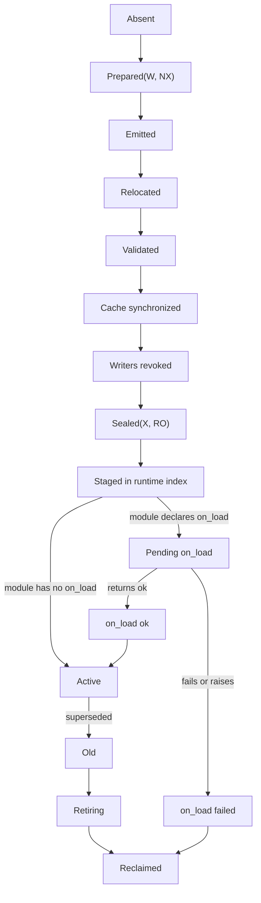

# Code execution, safe points, and version publication

The recommended sequence is **reference interpreter first, simple whole-module
load-time native lowering second, adaptive optimization only after measured
need**. The verified immutable module image is the semantic oracle. Every
execution tier must expose identical actor state at safe points: term roots,
stack/continuation layout, exception state, reductions, mailbox cursor, and
active code generation.

Native code is generated into writable, non-executable staging pages. The
runtime validates instructions, relocations, root maps, calls, and safe points;
the architecture layer completes data/instruction-cache publication; every
writable mapping is revoked; and only then is the generation mapped executable
and non-writable. One atomic runtime index switch publishes a complete view
after participating schedulers cross a safe epoch.

Language-visible current/old module versions are not the same thing as the
runtime's internal publication snapshots or the kernel's executable-page
generation. Copying ERTS's current number of internal code indexes into a
kernel ABI would freeze an implementation detail.

## Question, scope, and operational standard

The question is:

> How can the runtime execute admitted BEAM code responsively and publish or
> retire optimized code generations without mixed views, unsafe roots, RWX
> mappings, or broken hot-code semantics?

This component owns:

- interpreter dispatch and the portable runtime calling convention;
- verified safe-point and root metadata used by all execution tiers;
- optional load-time native lowering and runtime stubs;
- writable staging, relocation, sealing, and runtime code-index publication;
- current/old module behavior, call resolution, purge, and forced-purge
  consequences;
- scheduler/thread-progress epochs and generation pinning;
- tracing/breakpoint patch strategy; and
- code load, size, cache, execution, upgrade, and retirement metrics.

It does not own BEAM container validation, architecture cache instructions,
kernel mapping enforcement, or OTP application state transformation, though it
coordinates with each.

An initial implementation meets the standard when:

1. Interpreter execution passes the declared profile's differential
   conformance tests before native lowering becomes authoritative.
2. Every tier reaches a valid safe point within its declared managed bound.
3. No executable mapping is writable, and no writable alias to active code
   remains.
4. Readers see a complete old or complete new module/export/literal/range view,
   never a mixture.
5. Public current/old semantics match the pinned profile independently of
   internal snapshot count.
6. Purge eligibility uses only the OTP-defined direct process references.
   After logical purge commits, old local funs are uncallable and final
   physical reclamation may wait for literal copying, internal readers, and a
   safe epoch without changing the purge result.
7. Loader/compiler failure before publication leaves the old active view
   unchanged.
8. A module with `-on_load` remains pending and non-current while its fresh
   initialization actor runs; only `ok` publishes it, while failure unloads the
   candidate and preserves any prior current generation.

## Evidence and trade-offs

[The Road to the
JIT](../../30-sources/gustavsson-2020-road-to-the-jit.md) records why BeamAsm
chose simple load-time translation: prior tracing/adaptive attempts paid
profiling, compilation, cold-code, transition, and maintenance costs, while
many concurrent workloads spend substantial time in messaging, GC, and tables.
The current BeamAsm design preserves BEAM registers/stacks and translates
instruction by instruction, reducing dispatch without a full optimizing
compiler.

[HiPE](../../30-sources/johansson-et-al-2000-high-performance-erlang.md)
demonstrates integrated native execution with roots, exceptions, and mixed-mode
calls. [HiPErJiT](../../30-sources/kallas-sagonas-2018-hiperjit.md) reports
roughly twice the contemporary BEAM performance and near-HiPE performance on
its benchmark set while preserving tail calls and hot module loading. It also
adds profiling, compilation, type-specialization, and transition state. These
results justify an optional later tier, not a universal speed prediction.

Official OTP material reports a broad workload range from no gain or regression
to substantial JIT speedup. System-level benefits depend on startup, code size,
instruction cache, GC, messaging, tables, and upgrades, not only function
kernels.

[Proof-carrying code](../../30-sources/necula-1997-proof-carrying-code.md),
[SVA](../../30-sources/criswell-et-al-2007-secure-virtual-architecture.md), and
[translation validation](../../30-sources/sewell-et-al-2013-translation-validation.md)
support checking concrete generated artifacts and keeping optimizer complexity
outside a smaller checker. They do not provide a ready BEAM native-code proof.

| Execution tier | Benefit | Cost/risk | Recommendation |
| --- | --- | --- | --- |
| Interpreter | Small, explicit state; best debugging/conformance oracle | Dispatch overhead; lower sequential throughput | Mandatory first tier and permanent fallback |
| Whole-module load-time lowering | Removes dispatch; avoids hotness and mixed-tier decisions | Native emitter, code memory, cache publication | First optimized tier |
| AOT native artifact | Fast startup/execution on fixed target | Compiler/artifact trust, portability, metadata validation | Optional signed/certified deployment form |
| Profile-driven JIT | Can specialize hot code | Profiling, compilation, deoptimization, tails, code growth | Deferred experiment |
| Tracing JIT | Optimizes hot paths across instructions | Mode transitions and complex state under exceptions/hot code | Not initial plan |

## Common execution state

Every tier uses a canonical actor/runtime interface:

```text
ExecutionStateAtSafePoint {
  actor_generation,
  module_generation,
  continuation,
  x_registers_and_live_mask,
  stack_pointer_and_frame_descriptor,
  heap_top_and_limits,
  exception_state,
  reduction_balance,
  receive_cursor,
  pending_runtime_flags,
  scheduler_epoch,
}
```

The native calling convention may cache selected fields in machine registers,
but it materializes the canonical state before any GC, scheduler transition,
runtime call that can yield, trace handoff, exception scan, or domain evidence
capture. An emitter template and its verifier share generated metadata so a
manual mismatch cannot silently omit a root.

## Reference interpreter

The interpreter executes the immutable runtime IR produced by the loader. Its
dispatch loop:

1. fetches an already validated operation and operand record;
2. performs the semantic action or calls a versioned runtime descriptor;
3. decrements reductions by declared work;
4. checks allocation, exception, signal, exit, trace, and scheduling flags at
   bounded points; and
5. materializes a complete safe-point state before leaving actor execution.

An interpreter is not automatically safe: BIFs, term operations, invalid root
metadata, and native helpers can still corrupt the runtime. Its advantage is
that state transitions and control-flow labels are explicit and easier to
differentially instrument.

Retain a slow checked mode that validates operand classes, heap bounds, roots,
code generation, and ownership on every instruction. It is valuable for
minimizing loader/JIT/GC divergences even after optimized tiers exist.

## Load-time native lowering

The first emitter should follow BeamAsm's simplicity:

- lower every supported operation in a module, avoiding hot/cold tier
  switching;
- keep BEAM X/Y register and frame concepts visible to the runtime;
- use small generated templates and explicit runtime-call stubs;
- perform little or no cross-instruction optimization initially;
- emit exact safepoint/stack maps beside each call/back edge; and
- preserve one-step source/IR/native mapping for diagnostics.

This may produce larger code than the interpreter and has no guaranteed speedup.
It minimizes optimizer assumptions and makes native versus interpreted
differential execution feasible.

### Safe-point placement

At minimum, checks occur at:

- function entry/return paths as required by the calling convention;
- loop/back edges or before a verified basic-block cost can exceed the bound;
- allocation and GC tests;
- BIF/runtime calls that may allocate, yield, send, block, or throw;
- receive/signal handling transitions;
- tracing/breakpoint sites; and
- code-generation transitions.

The verifier computes or checks a maximum managed work cost between points. A
large straight-line binary operation or inlined helper cannot bypass the bound;
it traps/resumes or moves to an isolated lane.

## Code generation and publication state machine



### Prepare and emit

The code account reserves target pages, relocation tables, root/safe-point
metadata, literals, and unwind/diagnostic data. Pages are mapped writable and
non-executable only in the loader/emitter compartment. The emitter has no
general kernel or service authority.

### Validate

An independent pass checks:

- every emitted instruction range and branch target;
- relocations only to the module, immutable runtime stubs, or allowed imports;
- no embedded raw kernel capability or writable runtime address;
- stack alignment/calling convention at runtime calls;
- safe-point/root maps at every required location;
- trap/exception landing pads and continuation metadata; and
- code size and page-boundary arithmetic.

A future translation validator can compare emitted blocks with runtime IR, but
initial semantic confidence comes from constrained templates and differential
tests.

### Cache publication and W^X

The architecture facade performs the target-specific data-cache clean,
instruction-cache invalidation, barriers, and remote CPU acknowledgement
required by the [code-publication
component](../kernel-hardware-and-architecture-components/ordering-coherence-and-code-publication.md).
The adapter then revokes every writable mapping before granting executable
read-only mappings. Dual persistent RW and RX aliases are not the baseline,
even if a hosted ERTS port uses them.

### Runtime index publication

The loader builds a complete inactive index containing module generation,
exports, code ranges, literals, fun metadata, line/trace data, and BIF targets.
Schedulers reach a thread-progress epoch where none retains an untracked pointer
to the staging index. One atomic active-root switch publishes it. Preparation
can run in parallel; finishing is serialized per conflicting module/index
transaction.

If the module declares `-on_load`, the staging index enters `PendingOnLoad`
instead of the active root. A freshly spawned actor executes the candidate's
initialization function with candidate-only call access and the normal managed
safe-point/root contract. Ordinary callers continue to use the previous current
generation. If no prior generation exists, their external calls wait in a
bounded, charged set until the initialization terminates.

An exact `ok` result permits the atomic root switch. Any other value or
exception retires the candidate without changing a prior current generation.
The initializer actor then terminates. Code rollback cannot undo external I/O
or native side effects, so its native/service authority is manifest-controlled
and failure evidence preserves any indeterminate operation phase.

## Current and old code

The compatible module model admits current and old code as defined by the
pinned profile. Fully qualified external calls enter current code; existing
frames/continuations may remain in old code. Loading a third language-visible
generation requires old-code purge under the reference rules. A hard purge may
terminate actors with direct references to old code; it does not terminate an
actor merely because the actor holds an old local fun or a literal from the old
module.

Runtime internals may keep three or more snapshot indexes to stage and retire
without stopping all schedulers. Those snapshots do not create additional
language-visible module versions.

### Logical purge eligibility

The version-specific [OTP 29.0.6 `check_process_code/3`
documentation](https://www.erlang.org/doc/apps/erts/erlang.html#check_process_code/3)
and [`code:soft_purge/1`
documentation](https://www.erlang.org/doc/apps/kernel/code.html#soft_purge/1)
make purge eligibility narrower than general reachability: a process is
lingering only when it has a **direct reference** to old executable code. The
tagged implementation checks the current instruction pointer, saved native-call
state, and continuation pointers on the stack in
[`beam_bif_load.c`](https://github.com/erlang/otp/blob/e07fd07837e5aa845657f5fa340637121e451d47/erts/emulator/beam/beam_bif_load.c#L1149-L1217).
[`erts_code_purger.erl`](https://github.com/erlang/otp/blob/e07fd07837e5aa845657f5fa340637121e451d47/erts/preloaded/src/erts_code_purger.erl#L120-L152)
aborts a soft purge on such a result; a hard purge terminates the reported
processes before completing.

Indirect references through local funs are ignored for this decision. Purge
temporarily marks their dispatch entries and, on success, leaves them unloaded;
invoking such a fun after purge raises an exception. References to literals
also do not block purge: ERTS copies them out of the retired literal area in a
later collection stage. Therefore neither a fun-only nor a literal-only holder
causes `soft_purge/1` to return `false`, and neither alone selects an actor for
hard-purge termination.

### Physical retirement and reclamation

Logical purge completion is distinct from final freeing. A committed generation
must immediately cease to be language-visible or callable, but an implementation
may conservatively retain inaccessible executable pages or metadata while
thread-progress epochs, trace/profiling readers, native teardown, diagnostic
readers, and in-flight runtime callbacks drain. These are physical reclamation
guards, not logical purge blockers, and cannot change the `soft_purge/1` result
or preserve an indirect fun's ability to enter old code.

Literal storage has its own delayed lifetime. The OTP 29.0.6 source removes old
code and then queues its literal area; the literal-area collector asks processes
to copy surviving literals and waits for thread progress before releasing the
area, as documented in
[`beam_bif_load.c`](https://github.com/erlang/otp/blob/e07fd07837e5aa845657f5fa340637121e451d47/erts/emulator/beam/beam_bif_load.c#L1465-L1522).
This runtime should likewise report direct process blockers separately from
conservative physical retainers, unmap executable pages once its physical
safety guards clear, and release literal storage only after its independent
copy/reclamation protocol completes.

OTP application state transformation, release handling, rollback, and restart
policy live above this mechanism. Publishing code does not transform an
actor's state automatically.

## Tracing and patching

Per-call tracing can route through preplanned patchpoints or an indirection
table so enabling a trace does not leave general writable code. A privileged
runtime patch service:

1. prepares replacement trampoline/metadata in W/NX staging;
2. validates the trace session and generation;
3. performs code visibility publication;
4. switches an entry vector or publishes a new generation; and
5. retires the old trace state by epoch.

No ordinary actor or tracer receives a writable executable alias. Trace
configuration remains bounded and metered; patching cannot stop all schedulers
for unbounded time.

## Failure, security, and resource analysis

- **Emitter compromise:** unprivileged domain containment plus independent
  relocation/instruction validation; restricted code may need a separate
  emitter compartment.
- **RWX exposure:** page-table/capability scans throughout tests; writer
  revocation precedes executable mapping.
- **Mixed publication:** one immutable index root and scheduler epoch; failure
  before switch discards staging.
- **On-load escape or stall:** candidate-only resolution, bounded caller
  waiters, ordinary safe points, a manifest-controlled native/service surface,
  and supervisor-visible timeout/failure; prior current code remains callable.
- **Stalled epoch:** identify the scheduler/actor/native path blocking progress;
  bound managed paths and escalate domain fault for unresponsive native work.
- **Code memory pressure:** reserve before compilation, cap per generation, and
  fall back to interpreter rather than evict live code unsafely.
- **Optimizer semantic bug:** run interpreter/native differential tests and
  retain per-module interpreter override.
- **Old-code retention attack:** expose direct logical blockers separately from
  physical reclamation guards, cap retained storage, and use the documented
  direct-reference purge and actor-termination policy.

## Implementation program

### Stage 0: canonical safe-point contract

- Define frame, root, exception, reduction, continuation, and code-generation
  state independent of execution tier.
- Build checked interpreter mode and GC-at-every-point tests.

### Stage 1: conforming interpreter

- Implement the core profile, runtime-call descriptors, stack traces, receive,
  code calls, and current/old semantics.
- Differentially compare with OTP 29.0.6.

### Stage 2: publication without native lowering

- Exercise immutable IR generations, inactive indexes, atomic switching,
  pending on-load candidates, first-load waiters, scheduler epochs, and
  old-code retirement.
- Kill the loader at every transition.

### Stage 3: simple native lowering

- Add one target emitter at a time with W^X staging, verified templates,
  safepoints, and cache publication.
- Keep interpreter fallback per module/function.

### Stage 4: measured optional optimization

- Evaluate cross-instruction or profile-driven tiers only after the simple JIT
  meets compatibility and latency goals.
- Count profiling, compilation, code memory, cache misses, deoptimization,
  upgrade, and diagnostic costs in the comparison.

## Verification and measurements

- Differentially run values, exceptions, stack traces, tail calls, GC at every
  allocation, receive markers, funs, tracing, and current/old code on
  interpreter and native tiers.
- Exercise soft and hard purge with separate actors holding a direct
  continuation, an old local fun, or an old literal. Only the direct holder may
  block soft purge or be killed by hard purge; invoking the fun after successful
  purge must fail, while the literal remains valid through deferred copying and
  release.
- Load/replace/purge continuously under multicore traffic; detect mixed export,
  literal, fun, and code-range views.
- Run `-on_load` success, non-`ok`, exception, stall, and NIF/service cases on
  first load and replacement; verify fresh-actor execution, old-current
  availability, bounded first-load suspension, and exact rollback.
- Kill loader/emitter at every state and verify old view or complete new view.
- Scan mappings for RWX or residual writers during generation, patching, and
  retirement.
- Stress AArch64 and x86-64 cross-core code visibility with repeated page and
  generation reuse.
- Measure startup, load/publish latency, code size, instruction-cache misses,
  throughput, p99.99 safe-point latency, and hot-upgrade/retirement time across
  tiers.
- Deliberately stall a scheduler in BIF, GC, tracing, and native work; verify
  epoch diagnosis and bounded managed paths.

## Supported decisions and open questions

Evidence supports interpreter-first development, a simple whole-module
load-time lowering tier, explicit safe-point metadata, W^X publication,
atomic index switching, and logical purge followed by conservatively staged
physical reclamation. It does not establish that a JIT improves every workload
or that an adaptive tier is worth its trust and latency cost.

Open decisions include the native IR/template language, per-target validator,
patchpoint strategy, epoch implementation, code/literal accounting, AOT
artifact support, and optimization threshold. The interpreter and publication
state machine remain the semantic reference regardless.

## Connections

- [Managed actor runtime layer](../managed-actor-runtime-layer.md)
- [Compatibility manifest, BEAM loader, and verifier](compatibility-manifest-beam-loader-and-verifier.md)
- [Terms, private heaps, shared binaries, and tracing collection](terms-private-heaps-shared-binaries-and-tracing-collection.md)
- [Reduction scheduler and kernel scheduling contexts](reduction-scheduler-and-kernel-scheduling-contexts.md)
- [Ordering, coherence, and code publication](../kernel-hardware-and-architecture-components/ordering-coherence-and-code-publication.md)
- [Observability, deterministic testing, and crash evidence](observability-deterministic-testing-and-crash-evidence.md)

## Sources

- [The Road to the JIT](../../30-sources/gustavsson-2020-road-to-the-jit.md)
- [A brief introduction to BEAM](../../30-sources/hogberg-2020-brief-introduction-to-beam.md)
- [A high performance Erlang system](../../30-sources/johansson-et-al-2000-high-performance-erlang.md)
- [HiPErJiT](../../30-sources/kallas-sagonas-2018-hiperjit.md)
- [Proof-carrying code](../../30-sources/necula-1997-proof-carrying-code.md)
- [Secure Virtual Architecture](../../30-sources/criswell-et-al-2007-secure-virtual-architecture.md)
- [Translation validation](../../30-sources/sewell-et-al-2013-translation-validation.md)
- [OTP 29.0.6 managed-runtime documentation](../../30-sources/erlang-otp-team-2026-otp-29-0-6-managed-runtime-documentation.md)
