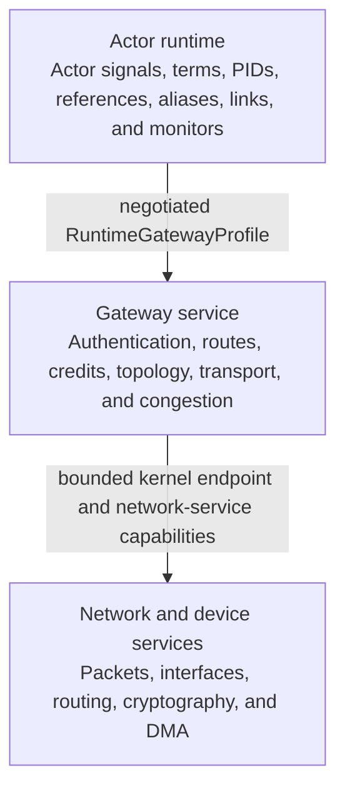
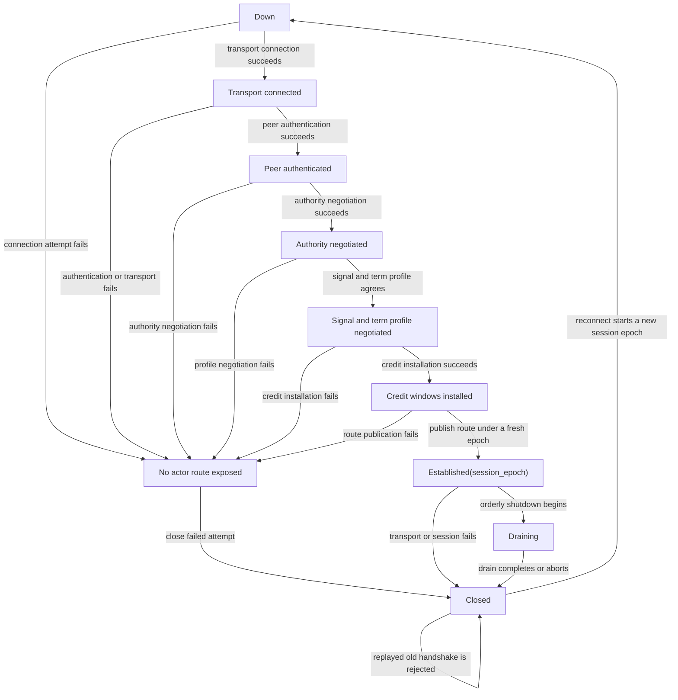
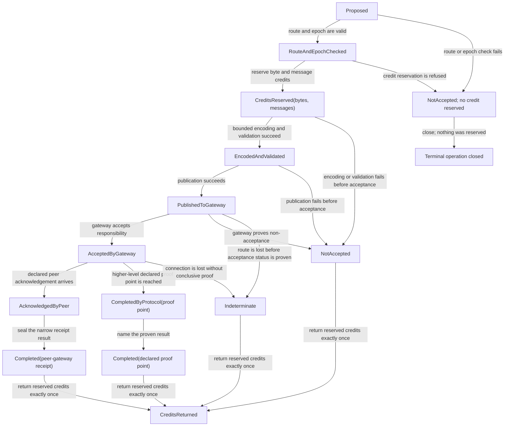

# Distribution gateway and remote actor semantics

The best baseline is an **authenticated, capability-attenuated, credit-bound
gateway service** that keeps networking and security policy outside the runtime
while preserving a versioned actor signal profile inside it. The runtime owns
external-term validation, actor/node/runtime incarnations, correlation, links,
monitors, aliases, and promised per-sender order. Gateway services own
discovery, credentials, transport, topology, routing, congestion, certificate
policy, and connection lifecycle.

Each connection is a session epoch. Reconnect creates a new epoch; ordering
does not silently span it. The `NotAccepted`, `Completed`, and `Indeterminate`
states used below are an **Atom OS tracked-send extension and internal gateway
protocol**, not Erlang send return values. A timeout, disconnect, or remote
monitor result can leave such an extended operation `Indeterminate`. TLS
authenticates and protects a channel when configured correctly, but does not
attenuate application authority or prove that a remote effect did not occur.

Standard Erlang distribution should be a trusted compatibility adapter, not the
base security model. Official documentation warns that the protocol is not
secure by itself and that connected nodes form a broad trust relationship.

## Question, scope, and operational standard

The question is:

> How can remote actor signals retain their declared compatibility semantics
> over replaceable, bounded, least-authority transports without claiming global
> order, exactly-once effects, or knowledge that a partition cannot provide?

This component owns:

- remote PID/reference/alias/port and runtime/node incarnation encoding;
- external-term and signal-profile negotiation and validation;
- actor-level send, link, monitor, unlink, alias, priority, and failure
  translation;
- per-session and per-sender sequence state needed by promised order;
- request correlation and the Atom OS extension's
  `NotAccepted`/`Completed`/`Indeterminate` outcomes;
- runtime-gateway credit, buffer, and admission state; and
- actor-visible distribution telemetry and evidence references.

It does not own sockets, routing, name discovery, certificate issuance,
network topology, congestion algorithm, retry policy, durable transactions, or
global application naming.

The operational standard requires:

1. Every session mutually authenticates service/node incarnations and receives
   only attenuated routes authorized for that deployment.
2. External terms are bounded and validated before allocating actor-visible
   graphs; no decoded term carries a kernel capability.
3. Within one session epoch, sequence state preserves the negotiated
   sender-destination order; missing or duplicate state is detected.
4. Reconnect never continues old sequence or credit state implicitly.
5. Credits are reserved before encoding/publication and returned exactly once.
6. Standard external PIDs and references retain their external-term identity:
   node creation plus PID ID/serial or reference ID words. A gateway session is
   a revocable route binding, not part of that identity.
7. A new authenticated session may rebind a standard PID or reference only
   when the peer proves the same node creation. It never restores old ordering,
   link, monitor, credit, or operation state.
8. Failure evidence distinguishes definite protocol/service state from
   connection loss or timeout suspicion.

## Evidence, synthesis, and proposal

The official [OTP managed-runtime
documentation](../../30-sources/erlang-otp-team-2026-otp-29-0-6-managed-runtime-documentation.md)
defines per-sender signal order and notes that distributed signals can be lost
on failure. Distribution flow control can suspend senders, while fully
asynchronous distribution without application flow control can grow memory
until failure. The standard handshake/cookie protocol is not itself a secure
transport, and even TLS does not change node-level authority semantics.

The same official OTP 29.0.6 documentation fixes the standard send surface:
`Dest ! Msg` and `erlang:send(Dest, Msg)` return `Msg`, while
`erlang:send(Dest, Msg, Options)` returns only `ok`, `nosuspend`, or
`noconnect`. None is a delivery, peer-receipt, or actor-consumption completion.
The external-term format encodes a PID with node, creation, ID, and serial, and
a reference with node, creation, and ID words. Creation separates identifiers
from different node incarnations; a distribution connection or gateway epoch
is not one of the encoded identity fields.

[Scaling Reliably](../../30-sources/trinder-et-al-2017-scaling-reliably.md)
found full mesh, global names, and global recovery metadata to be bottlenecks
in evaluated Erlang workloads; scoped/partitioned structures helped those
cases. [PARTISAN](../../30-sources/meiklejohn-et-al-2019-partisan.md) shows that
application-selected overlays, parallel channels, and affinity can improve
selected distributed actor workloads. Neither identifies one universal
topology.

[Birrell and
Nelson](../../30-sources/birrell-nelson-1984-remote-procedure-calls.md) expose
the enduring request/reply ambiguity: IDs, acknowledgements, retransmission,
and duplicate suppression improve behavior, but a client cannot generally
infer whether an effect occurred after losing the reply and protocol state.
[Failure-detector
research](../../30-sources/chandra-toueg-1996-failure-detectors.md) formalizes
why liveness suspicion depends on timing/system assumptions rather than proving
remote death.

[Orleans](../../30-sources/bernstein-et-al-2014-orleans.md) demonstrates a
different useful model in which stable logical virtual actors are activated by
the platform. Atom OS can offer that as a service layer, but base BEAM PIDs
remain explicit incarnations; a stale PID is not transparently rebound.

| Concern | Supported conclusion | Unsupported shortcut |
| --- | --- | --- |
| Security | Authenticate channels and attenuate each route/capability | Treat TLS or cookie admission as least authority |
| Ordering | Preserve negotiated sender-destination order within one epoch | Claim total order or carry order across reconnect |
| Delivery | Preserve OTP send returns; expose admission/completion/uncertainty only through an explicit Atom OS extension | Treat `Msg` or `ok` as delivery completion, or call timeout/disconnect definite non-execution |
| Topology | Make overlay and channel policy replaceable and measured | Embed full mesh or one overlay in actor semantics |
| Identity | Bind every remote reference to incarnations | Resolve stale PID/name to a new actor silently |
| Flow control | Reserve bytes/messages with explicit credits | Let async send buffer without a bound |

## Layered gateway model



The runtime-gateway boundary can initially use copied, canonical external-term
buffers. Zero-copy immutable buffer leases are an optimization only when both
sides share an explicit read-only mapping and charge/lifetime protocol.

## Session establishment



The transcript binds:

- local/remote gateway and runtime incarnations;
- authenticated deployment/node/service identities;
- allowed routes and operations;
- external-term version, maximum frame/term/depth/binary/atom behavior;
- signal flags including link/monitor/alias/priority variants;
- channel ordering and fragmentation behavior;
- initial byte/message/control credits;
- topology/channel identifiers; and
- transcript/profile hashes used in evidence.

Failure before `Established` exposes no actor route. Session epoch comes from a
monotonic incarnation or unguessable token combined with persistent local
generation state. A replayed old handshake cannot revive a closed session,
relations, credits, or identifiers from an earlier node creation. A freshly
authenticated connection to the same node creation can, however, route a
still-valid standard PID or reference; that is rebinding, not revival.

## Remote identity

```text
OtpExternalPid {
  node_name,
  node_creation,
  id,
  serial,
}

OtpExternalReference {
  node_name,
  node_creation,
  id_words,
}

GatewayRouteBinding {
  external_identity,
  authenticated_remote_node_creation,
  gateway_session_epoch,
  gateway_route_generation,
  negotiated_profile,
}
```

For the compatible profile, the actor-visible PID/reference is the standard
external-term identity. The runtime's route table separately retains the
revocable session binding. Disconnect invalidates that binding, but not the
identity term: after a new handshake, a PID/reference from the same node
creation may rebind and remain usable if its target semantics still permit it.
A node restart changes creation and makes the old identity stale. An Atom OS
native profile may define a richer runtime/actor-generation reference, but it
must be a distinct extension rather than silently changing standard PID or
reference equality.

A remote logical name is resolved by a naming service to one current reference
with an expiry/generation; name lookup and later send are not assumed atomic.

Location transparency is a programming convenience, not equality of failure,
latency, resource, or authority behavior. Local send, cross-domain send, and
remote send have distinct admission paths even when their final actor message
has the same term.

## Send and flow-control protocol

### Standard OTP send surface

The compatibility adapter preserves the OTP 29.0.6 results exactly:

```text
Dest ! Msg                         -> Msg
erlang:send(Dest, Msg)             -> Msg
erlang:send(Dest, Msg, Options)    -> ok | nosuspend | noconnect
```

`nosuspend` says that the requested send would suspend, and `noconnect` says
that it would require establishing a connection, when the corresponding
options request those refusals. Returning `Msg` or `ok` does not report remote
delivery, peer gateway receipt, mailbox insertion, or application effect. The
standard surface has no later delivery-completion result and must never return
the Atom OS tracked-send outcomes.

### Atom OS tracked-send extension

An opt-in Atom OS API and the internal gateway protocol may expose a correlated
operation with the following state machine:



This state machine is not an interpretation of `!` or `erlang:send/2,3`.
`CompletedByProtocol` must name its proof point—for example, peer-gateway
receipt or a higher-level durable commit—and never imply actor consumption or
application effect unless that protocol proves it.

Credits are partitioned so ordinary payload cannot consume all control/link/
monitor/disconnect progress. A credit is authority to admit bounded transport
state, not proof of remote actor consumption.

Within a session, each promised ordering domain uses an explicit sequence or a
transport/channel rule whose reset and fragmentation behavior is specified.
Parallel channels are allowed only when one sender's ordered signal stream is
kept on one channel or merged with sequence proof. Independent senders have no
total order.

If encoding or publication fails with proof of nonacceptance, the internal or
extended operation records `NotAccepted` and releases credit. Once publication
makes nonacceptance unprovable—including after acceptance—connection loss can
leave it `Indeterminate`. A declared acknowledgement can establish peer-gateway
receipt and therefore a correspondingly narrow `Completed` result, but not
arbitrary application effect. Application protocols needing stronger semantics
use idempotency keys, durable inbox/outbox records, or a transaction service.

## External term validation

The decoder treats every frame as hostile:

- bound frame, decompressed, term-node, recursion, collection, binary, big
  integer, atom, reference, and fun sizes;
- overflow-check every length and allocation;
- never create a permanent atom unless the profile authorizes it and reserves
  atom budget;
- validate PID/reference/node creations against session/profile rules;
- reject executable fun/code/native-resource constructs not admitted by the
  profile;
- construct into a private bounded arena, then copy/adopt one complete actor
  term; and
- charge decoder CPU and memory to the route/peer before actor publication.

A protocol violation can close or quarantine the route and retain a bounded
evidence sample. It must not allocate an unbounded dump of the malicious input.

## Links, monitors, aliases, and disconnect

Remote relation records include local and remote actor generations, relation
reference, session epoch, and protocol sequence state. Link/unlink and monitor/
demonitor operations preserve the pinned ordering rules only within the
profile and established epoch.

When transport is lost:

- the gateway seals `GatewayLost(session_epoch, reason, sequence evidence)`;
- the runtime maps affected relations to the selected `noconnection`-like
  signals;
- those signals express lost connection knowledge, not proof that the remote
  actor died; and
- late frames from the closed epoch are rejected even if a new session to the
  same named node exists.

The affected links and monitors are terminally broken and are not resurrected
by reconnect. A monitor emits its compatible `DOWN`/`noconnection` observation
once and is removed. If the node retained the same creation, its external PID
or reference can still be used after rebinding to establish a *new* link or
monitor; that new relation has a new session epoch and relation state.

A generic node-down event is not assumed ordered after every actor message in
flight unless the gateway completed an explicit drain barrier. This avoids a
false “all previous messages were processed” inference.

Alias deactivation can prevent a later remote reply from entering the local
mailbox once the receiving runtime observes the signal and rechecks the alias.
It may discard an already in-flight signal, but cannot recall a reply that has
already entered the mailbox or prove the remote operation stopped.

## Topology and naming

The base runtime exposes routes, not a mandatory full mesh. Gateway services
may implement:

- direct pairs for small trusted deployments;
- client/server or brokered fan-in;
- trees or partial overlays;
- multiple parallel channels by traffic class; or
- application/failure-domain-specific topologies.

Names and recovery metadata are partitioned/scoped by deployment and service.
A global registry can be offered as a higher-level protocol with explicit
consistency and availability costs. Actor semantics do not assume that every
node knows every other node or that every name update is globally synchronous.

Topology changes create route generations and may leave in-flight operations
indeterminate. Migration protocols that preserve stronger identity/order need
their own barrier and state transfer; forwarding old traffic blindly is not
the baseline.

## Standard Erlang distribution adapter

A compatibility gateway may implement the current distribution protocol,
feature flags, external term format, cookie/TLS setup, EPMD or alternative
discovery, and expected control messages. It runs with a deployment policy that
acknowledges:

- admitted nodes receive broad actor/runtime authority;
- the base cookie handshake is not a modern secure channel;
- TLS configuration is necessary but does not create fine-grained authority;
- version windows and feature flags evolve;
- full-mesh and global services may not scale; and
- node loss preserves ambiguous request outcomes.

Its language-facing send adapter returns `Msg` for `!` and `send/2`, and only
`ok | nosuspend | noconnect` for `send/3`. Correlated
`NotAccepted | Completed | Indeterminate` results belong to a separately named
Atom OS extension or remain internal; they are never smuggled into the standard
return vocabulary.

It receives no kernel/device authority merely because the peer is an Erlang
node. Cross-domain service routes still mediate access to storage, devices, and
system control.

## Failure, security, and resource analysis

- **Credential compromise:** attenuate each session route and separate gateway
  from kernel/device services; rotate/revoke session generations.
- **Frame flood/decompression bomb:** reserve credits and decoder quota before
  work; bound ratios/depth and prioritize control shutdown.
- **Slow peer:** per-route buffers and oldest-age metrics; stop admission rather
  than grow globally.
- **Partition/reconnect:** new session epoch, explicit uncertainty, no inherited
  order, relations, operations, or credits; same-creation standard identities
  may be rebound after authentication.
- **Duplicate/replay:** operation IDs and sequence windows are session-bound,
  while standard PID/reference equality is not; application idempotency covers
  durable effects.
- **Gateway crash:** kernel/service supervisor replaces it; runtime receives
  typed lost-session evidence and rejects stale routes.
- **Byzantine peer:** baseline authenticates and validates but does not provide
  Byzantine consensus or truthful remote actor execution evidence.

## Alternatives and trade-offs

### Distribution inside the runtime

Can reduce crossings but puts sockets, TLS, routing, credentials, topology, and
large parser surface inside the actor-domain TCB. Keep the actor codec/profile
in the runtime and externalize network/security policy.

### One globally ordered channel

Simplifies reasoning but serializes independent actors and does not survive
partition as a global truth. Preserve only required sender-destination order.

### Transparent automatic retry

May hide transient loss but duplicates non-idempotent effects and obscures
uncertainty. Retry only within a declared application/service protocol.

### Stable virtual identity

Useful above the runtime for services. Do not use it to resurrect a PID or
pretend volatile actor state survived a node-incarnation change. Rebinding the
same standard PID after a same-creation connection loss is not resurrection.

## Implementation program

### Stage 0: protocol model and fault matrix

- Model session epoch, credits, ordering, actor/runtime restart, disconnect,
  duplicate, and stale frame with tiny spaces.
- Define the Atom OS extension's `NotAccepted`, gateway-accepted,
  peer-received, application-completed, and `Indeterminate` states separately
  from the standard OTP send return values.

### Stage 1: local cross-domain gateway

- Exercise term validation, credits, incarnations, link/monitor translation,
  and failure using kernel endpoints without a network.
- Differentially compare actor-visible behavior with a local OTP adapter where
  meaningful.

### Stage 2: authenticated network gateway

- Add one transport/topology, mutual authentication, explicit route policy,
  fragmentation, sequence state, and congestion.
- Partition at every request phase.

### Stage 3: compatibility and topology variants

- Add standard Erlang distribution as a trusted adapter.
- Compare full mesh, tree, brokered, and application-specific overlays plus
  parallel channels using the same workloads and fault scripts.

## Verification and measurements

- Differentially test messages, links, monitors, aliases, priority messages,
  disconnect, and reconnect against OTP 29.0.6.
- Assert that `!` and `send/2` return the original message, `send/3` returns
  only `ok | nosuspend | noconnect`, and none exposes later delivery completion.
- Reconnect to the same node creation and verify a surviving standard PID/ref
  can rebind while old links/monitors stay broken; then change creation and
  verify the same identifiers are rejected as stale.
- Partition before acceptance, after acceptance, after effect, and before
  reply; verify uncertainty is never rewritten.
- Duplicate, reorder, delay, fragment, truncate, and replay frames; fuzz term
  sizes, nesting, atoms, references, and decompression.
- Exhaust byte/message/control credits while measuring sender suspension or
  refusal, memory, oldest age, and control progress.
- Sequence-tag sender streams across parallel channels and reconnects.
- Compare topologies under skew, churn, partitions, and global-name/recovery
  pressure; publish connection count, CPU, memory, throughput, and p99.99
  message/recovery latency.

## Supported decisions and open questions

Evidence supports authenticated sessions, explicit epochs, attenuated routes,
bounded credits, scoped topology/naming, per-sender rather than total order, and
honest ambiguous outcomes. It does not choose one transport, topology,
credential system, credit size, or exactly-once service mechanism.

The design is falsified by any reconnect path that restores an old session
operation, credit, link, or monitor, or accepts a PID/reference after the node
creation changes. It is also falsified by any parallel-channel configuration
that reorders one promised sender stream, any standard send API that reports an
Atom OS tracked-send outcome, or any timeout/disconnect translated as definite
non-execution without evidence.

## Connections

- [Managed actor runtime layer](../managed-actor-runtime-layer.md)
- [Signal ingress, mailboxes, and selective receive](signal-ingress-mailboxes-and-selective-receive.md)
- [Native work, ports, and drivers](native-work-ports-and-drivers.md)
- [Failure translation and the OTP boundary](failure-translation-and-the-otp-boundary.md)
- [Resource accounting and overload control](resource-accounting-and-overload-control.md)
- [Minimal privileged kernel layer](../minimal-privileged-kernel-layer.md)

## Sources

- [OTP 29.0.6 managed-runtime documentation](../../30-sources/erlang-otp-team-2026-otp-29-0-6-managed-runtime-documentation.md)
- [Scaling Reliably](../../30-sources/trinder-et-al-2017-scaling-reliably.md)
- [PARTISAN](../../30-sources/meiklejohn-et-al-2019-partisan.md)
- [Implementing remote procedure calls](../../30-sources/birrell-nelson-1984-remote-procedure-calls.md)
- [Unreliable Failure Detectors](../../30-sources/chandra-toueg-1996-failure-detectors.md)
- [Orleans virtual actors](../../30-sources/bernstein-et-al-2014-orleans.md)
