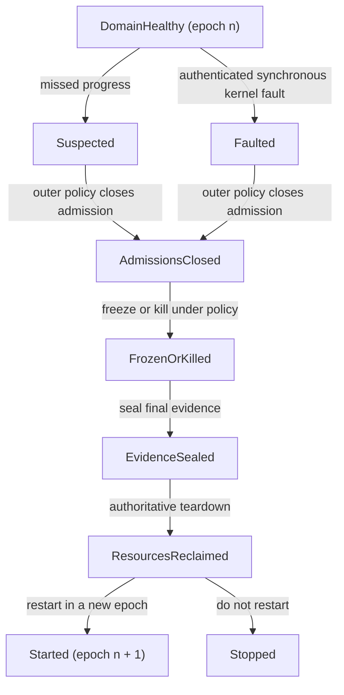

# Failure translation and the OTP boundary

The managed runtime should **report typed observations and complete bounded
mechanical cleanup; it should not choose application recovery policy**. Actor
exit belongs to the runtime, supervision strategy belongs to OTP-like services,
and runtime-domain restart belongs to an outer service that survives that
domain. A supervisor inside a corrupt or terminated runtime cannot supervise
the runtime that contains it.

This division preserves the useful Erlang/OTP distinction between mechanisms
and policy while making hardware and service failures more explicit than a
single undifferentiated exit reason. In particular, a monitor or connection
loss is an observation, not proof of why a remote actor disappeared or whether
its last effect occurred.

## Question, scope, and operational standard

The question is:

> How should kernel faults, service loss, runtime corruption, resource refusal,
> partitions, and ordinary actor exits become actor-visible evidence without
> fabricating certainty or moving OTP restart policy into the runtime?

This component owns:

- the actor exit state machine and immutable termination reason;
- bounded release of actor-visible runtime resources;
- publication of link, monitor, alias, port, and runtime-domain failure events;
- translation of authenticated kernel and service evidence into typed runtime
  observations;
- incarnation invalidation after service or runtime restart;
- crash-freeze coordination and a final bounded failure record; and
- the compatibility projection from richer internal events to the selected
  OTP exit and `DOWN` vocabulary.

It does not own supervisor strategy, restart intensity, application dependency
graphs, durable recovery, device reset, node membership, or the truth of an
uncorroborated remote failure suspicion.

A credible implementation must guarantee:

1. Once an actor enters `Exiting`, it executes no more BEAM instructions.
2. Directly observable resources are disposed or transferred before the
   corresponding exit or `DOWN` observation is published, as required by the
   selected compatibility profile.
3. In the compatible profile, an arbitrary Erlang exit-reason term is preserved
   exactly after only the documented OTP transformations; provenance and
   diagnostics may add context but cannot replace or silently rewrite it.
4. Failure suspicion is represented separately from confirmed termination.
5. Runtime, native-service, gateway, and actor incarnations prevent stale
   events from being attached to successors.
6. Cleanup is resumable, charged, and bounded per activation; a million links
   cannot monopolize one scheduler indefinitely.
7. Domain-level corruption is handled outside that domain, with kernel teardown
   remaining authoritative.

## Evidence, synthesis, and proposal

[Armstrong's thesis](../../30-sources/armstrong-2003-making-reliable-distributed-systems.md)
supports isolated processes, explicit links, exit signals, supervisors, and
the separation of stable error-handling structure from transient workers. It
is conceptual and predates modern multicore, hostile native code, and the Atom
OS kernel boundary; it does not prove that any particular restart policy is
safe for durable effects.

The official [OTP 29.0.6 managed-runtime
documentation](../../30-sources/erlang-otp-team-2026-otp-29-0-6-managed-runtime-documentation.md)
provides the compatibility floor: an exiting process runs no more Erlang code;
an exit reason can be any Erlang term; links and monitors propagate that reason;
trapping exits changes signal handling; and exit/`DOWN` publication follows
release of directly visible Erlang resources. The documented transformations
include run-time errors terminating with `{Reason, Stack}`, an explicit
untrappable `kill` signal terminating its receiver with `killed`, trapped exit
signals becoming `{'EXIT', From, Reason}`, and relation setup/loss producing
`noproc` or `noconnection`. Heap-held and dirty-native resources can remain
afterward, so publication is not proof that every byte or native effect has
vanished.

[Unreliable failure detectors](../../30-sources/chandra-toueg-1996-failure-detectors.md)
formalizes why suspicion and truth differ in asynchronous distributed systems.
A missed heartbeat, closed transport, or gateway timeout can justify a
liveness observation under stated timing assumptions; it cannot prove remote
process death or non-execution of an operation.

[Crash-only software](../../30-sources/candea-fox-2003-crash-only-software.md)
argues for components designed so crash/restart is a normal recovery path and
for externally stored requests that permit selective retry. [Microreboot
research](../../30-sources/candea-et-al-2004-microreboot.md) reports that
restarting small components can recover services faster and disturb fewer
requests than whole-process reboot in the evaluated Java application server.
Both results depend on state separation, idempotence, and component boundaries;
neither makes arbitrary actor state durable or makes every operation safe to
retry.

| Event | What is known | What is not known | Policy owner |
| --- | --- | --- | --- |
| `ActorExit` | This actor incarnation reached a sealed terminal reason | Whether restarting is useful | OTP supervisor |
| `NativeServiceLost` | A service incarnation failed or its route was revoked | Whether accepted external effects occurred | Service protocol / application |
| `GatewayLost` | A gateway session epoch ended | Whether the peer actor died or consumed a message | Distribution/application protocol |
| `RuntimeDomainFault` | Kernel evidence says the runtime domain faulted, hung, or was torn down | Which actor first caused logical corruption unless evidence proves it | Outer runtime supervisor |
| `ResourceRefusal` | Admission failed before the named publication point | Whether a higher-level retry is safe or desirable | Caller/supervisor policy |
| `LivenessSuspected` | A detector condition crossed its declared threshold | Actual remote death | Membership/supervision policy |

## Typed failure record

Internally, every observation carries enough provenance to prevent accidental
collapse:

```text
FailureEvent {
  event_kind,
  event_id,
  observed_at_monotonic,
  origin_domain_epoch,
  subject_kind,
  subject_identity,
  subject_generation,
  observer_identity,
  evidence_class,
  reason,
  reason_digest?,
  operation_phase?,
  last_confirmed_progress?,
  resource_disposition?,
  crash_record_ref?,
  profile_hash,
}
```

`evidence_class` distinguishes a local runtime decision, authenticated kernel
fault, service protocol terminal result, transport closure, timeout-based
suspicion, and administrator action. Unknown fields stay unknown. A compatibility
adapter may turn a non-actor event into a documented OTP-shaped reason such as
`noconnection`, but the structured evidence remains available to privileged
diagnostics and new APIs.

### Exact compatibility reason

In the compatible profile, `reason` is the exact arbitrary managed term chosen
by OTP semantics. The runtime may seal, pin, share internally, or incrementally
copy its representation, but actor-visible link, trapped-exit, and `DOWN`
projections reproduce that term exactly after the documented transformation;
they do not substitute a digest, truncated preview, typed summary, or richer
failure record. Actor memory accounting bounds the source graph as a resource
without changing its value, and recovery-owned lifetime keeps it available
after the exiting actor's heap is reclaimed.

`reason_digest` is an optional diagnostic index only. A deliberately restricted
profile may redact, truncate, or digest a reason under an explicit
non-compatible contract, but that value must not be presented as an OTP exit
reason or used on an API claiming the compatible profile. Reasons are data, not
authority: an actor term can name an opaque application object but cannot forge
a kernel capability merely by appearing in the reason.

## Actor termination protocol


The linearization point is `ExitSelected`: exactly one reason wins according
to the compatibility rules, and the selected post-transformation term is
sealed exactly. Subsequent exit requests may be recorded as diagnostic context
but cannot change the actor's sealed outcome.

`ReleasingVisibleResources` includes registered names, owned tables or their
heir transfer, aliases, timers whose destination is this actor PID,
ports/service handles, and any object whose continued public visibility would
contradict the death signal. It does **not** include timers merely because this
actor created them. Each object has its own generation-aware disposition. The
actor's private heap, shared-binary references, late native completions, and
other deferred state can drain after relation publication only when the profile
permits it and no successor can observe them as still owned by the dead actor.

Cleanup uses bounded continuation records:

```text
CleanupCursor {
  actor_generation,
  phase,
  object_class,
  next_position,
  work_charged,
}
```

Every slice revalidates the actor generation. Scheduler or domain restart can
resume or conservatively reclaim a cursor without executing actor code.

### Timer cleanup is destination-based

The compatible `start_timer`/`send_after` lifetime rule follows the destination,
not the creator:

- for a PID destination, the runtime automatically cancels the timer when that
  exact PID is already dead or exits; the timer index is keyed by destination
  PID generation, so PID-slot reuse cannot inherit it;
- for an atom/name destination, the timer survives the creator's exit and the
  exit of any process previously registered under that name, resolves the
  local registered name only at expiry, and silently sends nowhere when the
  name is then unregistered; and
- explicit cancellation uses the timer reference and races with expiry under
  the separately specified timer contract.

Creator exit has no automatic effect unless the creator is also the PID
destination. Whole-runtime teardown may still invalidate every old timer as a
domain-epoch action; that is distinct from actor cleanup.

## Link, monitor, and supervision boundary

Links are symmetric runtime relations; monitors are unilateral observations
keyed by independent references. They are not kernel capabilities and do not
grant authority over a target's address space or resources.

The runtime guarantees relation mechanics:

- atomic spawn-plus-link/monitor behavior where selected by the profile;
- generation-correct relation installation and removal;
- one compatible termination observation per active monitor relation;
- declared per-sender signal ordering; and
- bounded cleanup and duplicate suppression.

OTP-like services decide what those observations mean:

- one-for-one, one-for-all, rest-for-one, or another restart strategy;
- restart intensity and backoff;
- dependency ordering and state reconstruction;
- escalation to a parent supervisor; and
- whether an uncertain external operation is reconciled, retried, or surfaced.

The runtime may provide a small bootstrap guardian for bringing up the first
OTP-like service, but it is not a hidden application supervisor. Its only
policy is to start a signed initial service or report that bootstrap failed.

## Runtime-domain failure and restart



An outer service owns this state machine. On an authenticated synchronous
kernel fault, it can move directly to `Faulted`. On missed progress it first
records `Suspected`, asks the kernel for independent budget/fault evidence, and
then freezes or kills under an explicit policy. The old domain cannot veto
teardown.

Restart creates a new domain epoch and invalidates every old PID, port, timer,
gateway session, code reference, and native request. Surviving gateways and
services receive revocation of the old epoch before routes to the successor
are published. Application state returns only from a separately designed
durable protocol; memory discovered in a crashed domain is evidence, not an
implicitly trustworthy checkpoint.

## Native-service and gateway failure

Every cross-domain operation records its publication phase. Translation uses
that phase:

- before endpoint publication: `NotAccepted`;
- accepted with a protocol-proven terminal result: `Completed`, `Failed`, or
  `NotExecuted` as that protocol defines;
- accepted but route/service lost before a proving result: `Indeterminate`;
- reply received for an obsolete caller/service generation: discard with
  accounting and retain bounded evidence.

The runtime then emits a typed event or the profile's port/exit/`DOWN` signal.
It never converts `Indeterminate` into `NotExecuted` merely because a timeout
expired. This rule aligns native work and distribution with the same honest
failure model.

## Resource failure and recovery reserve

Allocation and admission failures are structured resource events containing
the resource class, requested/reserved amount, accountable owner, hierarchy
level that refused admission, and whether publication occurred. Low-memory
reason construction uses preallocated storage.

A capped recovery reserve pays for:

- sealing a reason and minimal stack/progress evidence;
- removing scheduler visibility;
- releasing or transferring visible resources;
- publishing bounded exit/`DOWN` notifications; and
- handing the crash record to the outer service.

It cannot be spent on ordinary actor work or expanded by actor priority. If
cleanup exceeds the reserve, the outer domain policy may quarantine or tear
down the domain rather than run unbounded recovery code.

## Failure and security analysis

- **Forged failure:** accept kernel/service evidence only over authenticated,
  generation-bound endpoints; label actor-supplied reasons as such.
- **Stale event:** compare every subject and route generation before mutation.
- **Exit storm:** queue bounded cleanup continuations and preserve reserved
  progress for control events.
- **Supervisor loop:** enforce restart intensity above the failed worker and
  retain stable evidence outside the restarted boundary.
- **Corrupted runtime:** never trust it to finish cleanup or serialize its own
  final truth; freeze first and let kernel/outer services collect evidence.
- **Ambiguous effect:** expose uncertainty and require application idempotency
  or reconciliation.
- **Reason pressure:** charge the original reason graph to the actor, move its
  exact compatible projection into recovery-owned lifetime with bounded cleanup
  slices, and keep any summary hash or external evidence reference diagnostic
  only. If exact projection cannot be sustained, report a runtime/resource
  failure rather than silently claim OTP-compatible reason delivery.

## Alternatives and trade-offs

### Put restart policy in the runtime

This can reduce startup latency but couples application topology and failure
semantics to the runtime TCB. It also cannot recover a runtime that is itself
corrupt. Keep only mechanical cleanup and bootstrap there.

### Map every failure to an exit reason

This is convenient for compatibility but loses provenance, uncertainty,
incarnation, and resource state. Preserve a richer record and project it onto
the compatibility API.

### Treat monitor results as ground truth

This is valid for a local termination event sealed by the same correct runtime.
It is invalid across a failed runtime, gateway, or network partition without
additional evidence.

### Restart from in-memory actor state

It may speed recovery in a controlled upgrade protocol, but memory after an
arbitrary runtime fault may be inconsistent. The baseline restarts code and
reconstructs state through explicit durable services.

## Implementation program

### Stage 0: model and vocabulary

- Specify actor exit, relation cleanup, domain failure, and cross-domain
  operation outcomes in a small state model.
- Enumerate compatibility projections and preserve the richer evidence record.

### Stage 1: actor-local termination

- Implement sealed reasons, transactional relation handling, bounded cleanup,
  visible-resource ordering, and recovery-reserve accounting.
- Index timers by destination PID generation while leaving name-target timers
  independent of creator and current registrant lifetime.
- Differentially test actor-visible results against OTP 29.0.6.

### Stage 2: service and gateway translation

- Attach request phases and incarnations to native and remote operations.
- Inject loss before and after every publication/acknowledgement point.

### Stage 3: domain recovery

- Add outer fault observation, freeze, evidence seal, authoritative teardown,
  epoch rollover, and bootstrap of a fresh runtime.
- Integrate durable application recovery only through explicit OTP-like
  services.

## Verification and measurements

- Model-check simultaneous exit, link/unlink, monitor/demonitor, spawn, name
  registration, table transfer, timer fire, and PID reuse with tiny spaces.
- Differentially test exit signals, trapping, links, monitors, and ordering
  against the pinned OTP profile.
- Exercise atoms, tuples, maps, binaries, references, PIDs, and nested compound
  exit reasons; verify exact term-equality preservation plus only the
  documented run-time-error, `kill`/`killed`, trapped-exit, `noproc`, and
  `noconnection` transformations.
- For both `start_timer` and `send_after`, exit the creator, PID destination,
  and current name registrant independently; verify PID-target cancellation,
  name lookup at expiry, name-target survival, and no creator-ownership rule.
- Exit actors with up to millions of relations and resources; publish maximum
  cleanup slice, total recovery time, scheduler delay, and reserve usage.
- Crash runtime, native service, gateway, and device service at every operation
  phase; verify definite outcomes are never manufactured from uncertainty.
- Partition and restore peers while delayed old-epoch messages remain; verify
  no stale delivery to a successor.
- Corrupt the runtime's own final-record path; verify kernel/outer evidence is
  still sealed and resources are reclaimed.
- Replay identical fault scripts and compare canonical event sequences while
  allowing only declared nondeterministic fields.

## Supported decisions and open questions

Evidence supports separating mechanism from supervisor policy, generation-bound
failure records, external supervision of runtime domains, bounded restartable
components, and explicit suspicion/uncertainty. It does not establish one
universal restart strategy, timeout, cleanup slice, failure-detector threshold,
or durable state protocol.

The design is falsified if an internal supervisor is required to recover its
own corrupted runtime, if a stale failure can affect a successor incarnation,
if exit cleanup can monopolize a scheduler without bound, or if timeout is
reported as definite non-execution without supporting protocol evidence.

## Connections

- [Managed actor runtime layer](../managed-actor-runtime-layer.md)
- [Actor identity, lifecycle, and process state](actor-identity-lifecycle-and-process-state.md)
- [Native work, ports, and drivers](native-work-ports-and-drivers.md)
- [Distribution gateway and remote actor semantics](distribution-gateway-and-remote-actor-semantics.md)
- [Resource accounting and overload control](resource-accounting-and-overload-control.md)
- [Observability, deterministic testing, and crash evidence](observability-deterministic-testing-and-crash-evidence.md)
- [Managed-runtime contract inquiry](../../40-inquiries/what-contract-should-the-managed-actor-runtime-provide.md)

## Sources

- [Making reliable distributed systems in the presence of software errors](../../30-sources/armstrong-2003-making-reliable-distributed-systems.md)
- [OTP 29.0.6 managed-runtime documentation](../../30-sources/erlang-otp-team-2026-otp-29-0-6-managed-runtime-documentation.md)
- [Unreliable Failure Detectors](../../30-sources/chandra-toueg-1996-failure-detectors.md)
- [Crash-only software](../../30-sources/candea-fox-2003-crash-only-software.md)
- [Microreboot](../../30-sources/candea-et-al-2004-microreboot.md)
