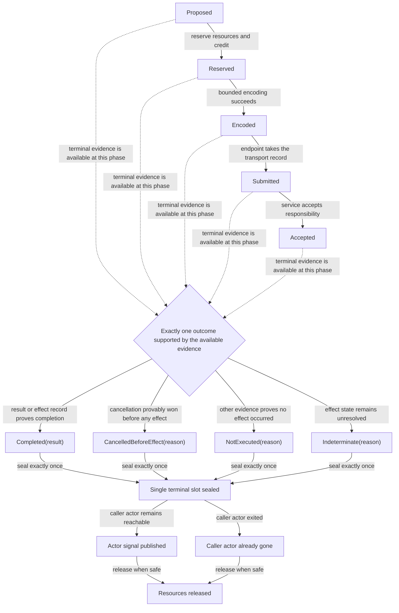
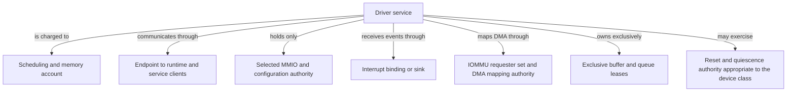

# Native work, ports, and drivers

The best default is **out-of-process native work in separately protected,
budgeted service domains**. Hardware drivers, blocking libraries, codecs,
foreign runtimes, and untrusted native accelerators receive only the kernel
capabilities they need and communicate through bounded, typed adapters. The
runtime translates request outcomes and service-incarnation changes into actor
signals; actors never receive raw device, DMA, MMIO, interrupt, or kernel
endpoint authority.

An in-process NIF lane may be retained as an explicit trusted compatibility
profile. It does not become safe because it runs on a dirty scheduler. Official
ERTS documentation is unambiguous: a NIF is a direct native extension of the
VM, memory errors can corrupt or crash the entire runtime, and lengthy native
work can delay process operations even on dirty schedulers. “Dirty” describes
scheduling isolation, not memory or authority isolation.

Separating a service address space is necessary but insufficient for hardware
drivers. DMA/IOMMU, MMIO, interrupt, configuration, reset, buffer ownership,
and device quiescence must also be confined by the kernel's protected-I/O
protocol.

## Question, scope, and operational standard

The question is:

> How can BEAM applications use native libraries and devices without making
> ordinary actor isolation depend on memory-unsafe code, blocking a scheduler,
> or hiding ambiguous effects during cancellation and service restart?

This component owns:

- actor-visible port/service handles and request correlation;
- typed term/buffer encoding between runtime and native service domains;
- request admission, cancellation, timeout, completion, and incarnation state;
- compatibility rules for external ports, linked drivers, NIFs, and dirty work;
- service crash/restart translation into actor signals and handle revocation;
- trusted in-process native API minimization and watchdog telemetry; and
- native request, copy, CPU, memory, buffer, cancellation, and restart metrics.

It does not own driver internals, device programming, kernel DMA protection,
network policy, or supervisor restart choice.

A satisfactory baseline must guarantee:

1. Normal actor schedulers never block on a device, filesystem, foreign
   runtime, or unbounded native computation.
2. Each native service receives only typed endpoints, budget accounts, and
   required device/memory capabilities; BEAM terms cannot name them directly.
3. Every request binds caller, runtime, service, endpoint, and operation
   generations and reaches exactly one terminal disposition.
4. Timeout or service loss after acceptance is `Indeterminate` unless stronger
   evidence proves `CancelledBeforeEffect`, `NotExecuted`, or `Completed`.
5. Buffers, DMA mappings, endpoints, and service leases remain owned until
   terminal completion and quiescence establish safe release.
6. Replies from an old service or actor incarnation cannot reach a successor.
7. An in-process native extension is visibly part of the whole runtime
   corruption boundary and is never described as contained.

## Evidence, synthesis, and proposal

The official [OTP 29 managed-runtime
documentation](../../30-sources/erlang-otp-team-2026-otp-29-0-6-managed-runtime-documentation.md)
records that NIFs execute in the VM without ordinary memory protection or
pre-emption. Dirty CPU/I/O schedulers prevent selected long work from occupying
normal schedulers, but a dirty NIF can continue after its actor has begun
termination and delay final heap/control-block reclamation. Linked-in drivers
share the runtime address space; external port programs do not.

[Nooks](../../30-sources/swift-et-al-2003-nooks.md) shows that wrappers,
separate protection, and resource tracking can improve recovery for legacy
extensions while providing only partial fault protection. [Recovering Device
Drivers](../../30-sources/swift-et-al-2004-recovering-device-drivers.md) shows
why shadow state and request tracking must survive outside the failed driver
and why an interrupted device operation can remain uncertain.

[MINIX 3 restructuring](../../30-sources/herder-et-al-2006-dependable-operating-system.md)
supports user-space restartable drivers. [Malicious-driver
work](../../30-sources/boyd-wickizer-zeldovich-2010-malicious-device-drivers.md)
adds the crucial negative result: address-space separation without IOMMU/MMIO/
interrupt/configuration control does not contain an adversarial device driver.

| Boundary | Scheduler isolation | Memory isolation | Device-authority isolation | Recommended role |
| --- | --- | --- | --- | --- |
| Regular NIF | No | No | Only by convention | Disallowed by default |
| Dirty NIF | From normal scheduler class | No | Only by convention | Trusted compatibility only |
| Linked driver | Partial runtime scheduling conventions | No | Only by convention | Disallowed by default |
| External host port | Host process scheduling | Host address space | Depends on host privileges | Bring-up compatibility |
| Atom OS service domain | Kernel budget | Kernel protection domain | Attenuated capabilities and IOMMU protocol | Baseline |

## Actor-visible service model

An actor receives an opaque reference:

```text
ServiceHandle {
  runtime_epoch,
  broker_slot,
  handle_generation,
  service_class,
  allowed_operation_profile,
}
```

The runtime broker maps it to a service route, incarnation, endpoint,
capability attenuation, request quota, and term/buffer codec. The handle is
serializable only if the profile defines a delegation operation; copying its
bits cannot create additional kernel authority.

Opening a service is a transaction:

```mermaid
flowchart LR
  nw_open_requested["Requested"]
  nw_open_policy["Policy checked"]
  nw_open_service["Service resolved"]
  nw_open_capacity["Capacity reserved"]
  nw_open_session["Session established"]
  nw_open_published["Handle published"]
  nw_open_no_handle["No actor-visible handle"]
  nw_open_policy_choice{"Handle policy after service restart"}
  nw_open_invalidated["Handle invalidated"]
  nw_open_rebound["Handle explicitly rebound to the new incarnation"]
  nw_open_stale_rejected["Stale handle rejected"]

  nw_open_requested -->|"check policy"| nw_open_policy
  nw_open_policy -->|"authorized"| nw_open_service
  nw_open_policy -->|"denied before publication"| nw_open_no_handle
  nw_open_policy -->|"service resolution fails"| nw_open_no_handle
  nw_open_service -->|"capacity reservation succeeds"| nw_open_capacity
  nw_open_service -->|"capacity reservation fails"| nw_open_no_handle
  nw_open_capacity -->|"establish session"| nw_open_session
  nw_open_capacity -->|"session setup fails"| nw_open_no_handle
  nw_open_session -->|"publish handle"| nw_open_published
  nw_open_session -->|"publication fails"| nw_open_no_handle
  nw_open_published -->|"service restarts"| nw_open_policy_choice
  nw_open_policy_choice -->|"invalidate by policy"| nw_open_invalidated
  nw_open_policy_choice -->|"explicitly rebind by policy"| nw_open_rebound
  nw_open_invalidated -->|"stale handle use never retargets silently"| nw_open_stale_rejected
```



Failure before publication leaves no actor-visible handle. Service restart
invalidates or explicitly rebinds handles by policy; a stale handle never
silently targets a new incarnation.

## Request protocol

```text
NativeRequestOutcome =
  Completed(result)
| CancelledBeforeEffect(reason)
| NotExecuted(reason)
| Indeterminate(reason)
```



Progress can branch to a terminal outcome from the phase allowed by its
evidence; reaching `Accepted` is not a prerequisite for every outcome. The
variants are disjoint. `CancelledBeforeEffect` means cancellation provably won
before any effect. `NotExecuted` means other protocol evidence proves that no
effect occurred. `Completed` carries the protocol's result or effect record,
while `Indeterminate` preserves unresolved effect state. A cancellation
request or elapsed deadline alone proves none of these outcomes.

Every record contains:

```text
NativeRequest {
  request_id,
  request_generation,
  caller_actor_generation,
  runtime_epoch,
  service_incarnation,
  operation_profile,
  buffer_leases[],
  endpoint_credit,
  deadline?,
  charge_reservation,
  terminal_slot,
}
```

### Admission and encoding

The broker validates the operation against the handle profile, sizes the term,
reserves runtime/service/kernel transport and buffer resources, then encodes
into a bounded representation. Cross-domain payloads contain no runtime
pointers or capabilities. Large immutable binaries may use an explicitly
shared read-only buffer lease if the kernel and service protocol preserve
ownership and charge; ordinary term graphs are reconstructed.

### Acceptance and effect

`Submitted` means the endpoint owns a transport record. `Accepted` means the
service has taken responsibility according to its operation protocol. For a
pure codec, acceptance and effect may be close. For a device write, acceptance
does not imply the hardware did or did not complete before a crash.

The service may provide stronger durable idempotency/effect records for
selected operations. Those semantics are part of the service profile, not a
generic runtime promise.

### Cancellation and timeout

Cancellation competes with acceptance/completion:

- before submission: cancel locally and return `CancelledBeforeEffect`;
- submitted but provably unaccepted: an endpoint/service cancellation
  acknowledgement may establish `CancelledBeforeEffect`;
- after acceptance: request cancellation, but retain buffers and report
  `Completed`, `CancelledBeforeEffect`, `NotExecuted`, or `Indeterminate`
  according to the evidence and which event won;
- timeout: stop actor waiting, optionally deactivate reply alias, but do not
  free native state or claim the operation never ran.

An actor may receive no reply because it exited; the broker still completes and
releases the operation through its terminal slot.

## Driver-service authority and lifecycle

Hardware services consume the [protected I/O and DMA
component](../kernel-hardware-and-architecture-components/protected-io-and-dma-ownership.md):



Device reset and service restart are separate. A new driver process cannot
assume the device is clean merely because the old address space was destroyed.
The outer device manager freezes submissions, masks/quarantines events,
establishes DMA quiescence, records indeterminate requests, resets/reinitializes
the device, creates a new service incarnation, and only then admits clients.

Driver recovery metadata that must survive—queue ownership, buffer leases,
submitted IDs, configuration generation, and last reset evidence—lives in the
kernel/device manager or another service, not solely in the driver being
restarted.

## Port-compatible behavior

An Atom OS port-like adapter can preserve actor-facing concepts:

- one owning actor and explicit transfer rules where the profile allows it;
- messages or command operations with ordered correlation;
- link/monitor and service-exit translation;
- busy/credit state that prevents unbounded buffering; and
- an opaque port identity bound to runtime and service incarnations.

External executable names, host file descriptors, shell commands, and ambient
environment variables are not part of the native architecture. A compatibility
service may implement them for a trusted hosted profile. On native Atom OS,
service discovery and launch are capability/policy operations.

The port's “closed” event states whether the route disappeared, the service
reported completion, or the runtime revoked it. It does not rewrite every
in-flight request as successful cancellation.

## Trusted NIF compatibility lane

Some existing applications require NIF call semantics or very low overhead.
The manifest for an allowed in-process module should declare:

```text
NativeModuleProfile {
  module_hash,
  nif_api_version,
  nif_functions[]: {
    name,
    arity,
    initial_execution_class,       // ErlNifFunc.flags
    maximum_uninterrupted_work,
    allowed_reschedule_classes[],  // enif_schedule_nif flags
  },
  allocation_and_gc_behavior,
  thread_creation_policy,
  resource_types_and_upgrade_callbacks,
  cancellation_behavior,
  external_authority,
  domain_fatal_risk: true,
}
```

OTP does not assign one regular-or-dirty class to a whole NIF module. Each
`ErlNifFunc` entry identifies a function by name and arity and declares its
initial class in `flags`: `0` for regular,
`ERL_NIF_DIRTY_JOB_CPU_BOUND`, or `ERL_NIF_DIRTY_JOB_IO_BOUND`. A NIF need not
be exported from its Erlang module. Moreover, a call can return
`enif_schedule_nif(...)` with the same choice of flags to schedule a later
segment as regular, dirty CPU, or dirty I/O work. A staged job can therefore
yield between segments and, when its work changes character, reschedule onto
the appropriate class. The profile must authorize and meter both the initial
`name`/`arity` entry and every scheduled class transition rather than treating
the module as statically regular or dirty.

The runtime gives the NIF a minimal generated API and no raw kernel
capabilities. Regular segments must yield within the declared bound or use
resumable calls. Dirty CPU and I/O pools have separate finite kernel budgets so
misclassified CPU work cannot starve every normal runtime/domain. Watchdogs
record per-segment and whole-invocation elapsed time and blocked process
operations.

These controls improve availability and auditability. They do not contain a
wild pointer, use-after-free, corrupt root, or arbitrary runtime call. A
deployment using the lane accepts that module into the runtime TCB and should
separate high-consequence applications into different runtime domains.

## Failure translation

Native failures remain typed:

```text
NativeServiceLost(service_incarnation, cause, requests[])
NativeProtocolViolation(service_incarnation, evidence)
NativeRequestTerminal(request_id, outcome: NativeRequestOutcome)
DriverQuarantined(device_generation, cause)
InProcessNativeFault(module_hash, fault_ref)  // runtime-domain fatal
```

The runtime maps these to compatible port exits, monitor/link signals, or
extension messages without erasing the richer outer evidence. OTP-like
supervisors decide restart or escalation. A service-restart notification does
not imply actor state is durable or external effects are rolled back.

## Failure, security, and resource analysis

- **Malformed request/reply:** validate type, size, nesting, operation, service
  and buffer generation before construction in an actor heap.
- **Service memory fault:** kernel contains address-space access; device
  authority remains governed by IOMMU/MMIO/interrupt/reset controls.
- **DMA after crash:** quarantine requester set and buffer pages until
  quiescence/reset; do not recycle on process death alone.
- **Stale completion:** reject by service, request, runtime, and actor
  generations; still release the old operation exactly once.
- **Native CPU abuse:** service/dirty contexts have hard budgets; actor waits do
  not donate unbounded priority or time.
- **Backpressure:** reserve endpoint credits before encoding; refusal is
  observable before acceptance.
- **Restart storm:** outer supervisor/device manager applies intensity and
  escalating quarantine; runtime does not loop launch autonomously.

## Alternatives and trade-offs

### All NIFs in process

Lowest call/copy overhead and greatest compatibility, but one native defect can
defeat every actor and all adapter-held authority. Only acceptable for an
explicit trusted profile.

### Software-fault isolation inside the runtime

Typed assembly, WebAssembly, SFI, or memory-safe languages can reduce classes
of memory error and may support a faster extension lane. They do not by
themselves constrain syscalls/kernel capabilities, device DMA, infinite CPU,
protocol effects, or verifier bugs. Treat as a later profile with evidence.

### One generic native daemon

Reduces domains and copying but aggregates unrelated libraries, authority, and
failure. Prefer service classes/failure domains aligned with privileges and
restart independence.

### Transparent retry

Attractive for availability but unsafe for non-idempotent effects after
ambiguous acceptance. Retry only with service-declared idempotency keys or
durable transaction semantics.

## Implementation program

### Stage 0: request/outcome model

- Model submit/accept/effect/reply, cancel, actor exit, service crash/restart,
  and stale completion.
- Require exactly one terminal slot and no premature buffer release.

### Stage 1: pure user-space service

- Isolate a deterministic codec or compute library with bounded copied terms.
- Implement handle policy, credits, cancellation, incarnation change, and
  differential results.

### Stage 2: asynchronous device service

- Add buffer leases, I/O completion, driver fault, protected I/O, reset, and
  indeterminate outcomes on an emulated device.
- Prove all kernel objects return to baseline after restart.

### Stage 3: compatibility lanes

- Implement external-port behavior and only then a minimal trusted NIF API.
- Run unsafe/slow NIF tests and make domain-fatal risk visible in deployment
  profiles and crash evidence.

## Verification and measurements

- Run infinite/slow regular NIFs, per-`name`/`arity` dirty CPU/I/O
  misclassification, `enif_schedule_nif` continuations that stay in or change
  class, and dirty-NIF actor exit; measure normal scheduler tails and delayed
  reclamation.
- Crash service before submit, after submit, after accept, after effect, and
  before reply; verify `Completed`, `NotExecuted`, and `Indeterminate`
  truthfully. Race cancellation at each phase and require
  `CancelledBeforeEffect` only when evidence proves cancellation won before
  any effect.
- Inject malformed and stale replies, duplicated completions, endpoint overflow,
  and capability/handle confusion.
- Attack DMA outside buffers, interrupt storms, failed reset, and post-crash DMA;
  verify quarantine before reuse.
- Sweep payload copy versus read-only buffer lease; report latency, CPU,
  retained pages, and restart/cancel cost.
- Confirm an in-process memory fault kills only that runtime domain and that an
  outer service—not an inner actor—reconstructs it.

## Supported decisions and open questions

Evidence strongly supports isolated native services, explicit device authority,
generation-stamped request state, ambiguous-outcome preservation, and treating
dirty schedulers as availability rather than safety. It does not choose the
serialization format, domain granularity, zero-copy lease threshold, NIF
subset, or per-device restart protocol.

The key falsifier is a path that releases or reuses native/device resources
after cancellation or service death without terminal completion and quiescence
evidence. Any such path breaks both safety and recovery semantics.

## Connections

- [Managed actor runtime layer](../managed-actor-runtime-layer.md)
- [Runtime-domain bootstrap and kernel adapter](runtime-domain-bootstrap-and-kernel-adapter.md)
- [Timers, events, and asynchronous I/O integration](timers-events-and-asynchronous-io-integration.md)
- [Protected I/O and DMA ownership](../kernel-hardware-and-architecture-components/protected-io-and-dma-ownership.md)
- [Failure translation and the OTP boundary](failure-translation-and-the-otp-boundary.md)
- [Resource accounting and overload control](resource-accounting-and-overload-control.md)

## Sources

- [OTP 29.0.6 managed-runtime documentation](../../30-sources/erlang-otp-team-2026-otp-29-0-6-managed-runtime-documentation.md)
- [Nooks](../../30-sources/swift-et-al-2003-nooks.md)
- [Recovering Device Drivers](../../30-sources/swift-et-al-2004-recovering-device-drivers.md)
- [Dependable operating-system construction](../../30-sources/herder-et-al-2006-dependable-operating-system.md)
- [Tolerating malicious device drivers](../../30-sources/boyd-wickizer-zeldovich-2010-malicious-device-drivers.md)
- [CleanQ](../../30-sources/haecki-et-al-2019-cleanq.md)
