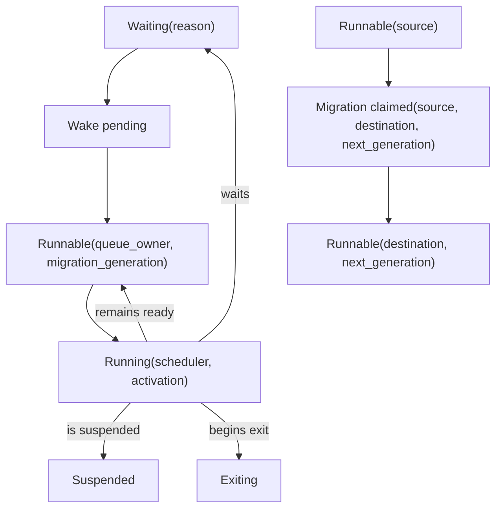

# Reduction scheduler and kernel scheduling contexts

The recommended architecture is a **two-level scheduler with separate units of
fairness and authority**. The kernel admits a modest number of runtime threads
through explicit scheduling contexts carrying CPU budget, period, account, and
optional placement hints. The runtime multiplexes very many actors over those
threads with reductions, scheduler-local queues, bounded local-first stealing,
and safe points.

Reductions choose which actor runs next; they do not enforce how much CPU the
runtime domain may consume. Actual kernel-accounted time is the enforcement
currency and is reconciled with actor/system-work attribution. Work performed
for signals, receive scans, allocation, garbage collection, timers, code
loading, tables, tracing, and cleanup cannot disappear outside the reduction
model.

Work stealing is a good baseline mechanism, not a generic BEAM theorem. Its
classic bounds assume fully strict fork/join computations, whereas actor graphs
are cyclic, long-lived, priority-bearing, selectively receiving, and subject to
GC and kernel revocation. NUMA actor studies show that locality can help
substantially and can also regress or create severe tails. Topology is therefore
adaptive policy, never actor semantics.

## Question, scope, and operational standard

The question is:

> How can the runtime give responsive, approximately fair actor service on
> admitted CPUs while the kernel retains enforceable time authority and actor
> semantics remain independent of CPU topology?

This component owns:

- runtime scheduler threads and their binding to kernel scheduling contexts;
- actor run queues, dequeue, wake, migration, and stealing protocols;
- reduction allowances and size-sensitive work charging;
- managed safe-point rules for interpreter, JIT, BIF, GC, signal, table,
  loader, timer, trace, and cleanup loops;
- actor priority behavior required by the pinned profile;
- topology hints and adaptive locality policy;
- runtime progress, utilization, queue, steal, migration, and latency metrics;
  and
- bounded system, cleanup, and recovery work classes.

It does not own kernel context implementation, actor lifecycle, native-service
work, or supervisor policy.

The initial standard requires:

1. The number of managed scheduler threads follows currently admitted kernel
   contexts, not discovered hardware threads.
2. At most one scheduler owns or executes one actor at a time.
3. Kernel pre-emption is legal at any instruction; correctness never depends on
   consuming a complete reduction slice.
4. Every managed loop has a measured maximum path to a safe point or is placed
   on an isolated native/service lane.
5. Domain CPU consumption cannot exceed the kernel budget even if reduction
   calibration is wrong.
6. Every significant unit of runtime work is attributed to an actor/request or
   a finite named system account.
7. Context revocation, hotplug, imbalance, priority traffic, and runtime
   pressure cannot lose or duplicate a runnable actor.

## Evidence and limitations

[Blumofe and
Leiserson](../../30-sources/blumofe-leiserson-1999-work-stealing.md) prove
expected `T1/P + O(T∞)` time plus space/communication bounds for fully strict
computations. Their local-deque/steal-on-idle insight is durable; the formal
bounds do not cover arbitrary actors.

[Barghi and
Karsten](../../30-sources/barghi-karsten-2018-locality-aware-actor-scheduling.md)
show that hierarchical local-first stealing can reduce remote steals and help
selected CAF workloads, while an affinity-oriented wake design produced lock
contention and severe tails. [Francesquini, Goldman, and
Méhaut](../../30-sources/francesquini-et-al-2013-numa-aware-actor-runtime.md)
reported up to 2.50× improvement and a smaller regression for an older
NUMA-aware Erlang prototype. Both are evidence for an optional policy and
complete workload/latency measurements, not fixed affinity.

[Scheduler
activations](../../30-sources/anderson-et-al-1992-scheduler-activations.md)
establish the need to coordinate kernel processor allocation with user-level
parallelism. [Scheduling-context
capabilities](../../30-sources/lyons-et-al-2018-scheduling-context-capabilities.md)
make temporal budgets explicit and delegable. Atom OS takes the division of
responsibility but avoids importing historical upcall APIs or treating an
ordinary actor message as synchronous priority donation.

Historical ERTS measurements in [Zhang's many-core
study](../../30-sources/zhang-2011-erlang-vm-many-core-scalability.md) and the
[Erlang scalability benchmark
suite](../../30-sources/aronis-et-al-2012-scalability-benchmark-suite-erlang-otp.md)
show that allocator, scheduler, messaging, and shared-runtime structures can
hide bottlenecks beneath a share-nothing language model. They support a
multidimensional evaluation, not current performance predictions.

## Scheduling domains and objects

```text
KernelSchedulingContext {
  context_generation,
  budget,
  period,
  account,
  cpu_set_or_hint,
  remaining_time,
}

RuntimeScheduler {
  scheduler_id,
  bound_context_generation,
  local_queues[priority],
  system_work_queue,
  cleanup_queue,
  steal_state,
  topology_hint,
  safe_point_epoch,
  progress_counter,
}

ActorActivation {
  actor_generation,
  reduction_allowance,
  reductions_used,
  measured_cpu_start,
  work_class,
  migration_generation,
}
```

A context is temporal authority. A scheduler is a runtime worker. An activation
is a temporary actor ownership record. Keeping them distinct lets the kernel
reduce a runtime's admitted parallelism without changing actor IDs or requiring
one kernel object per actor.

## Actor ownership state machine



One atomic state/queue protocol establishes ownership. A wake that observes
`Runnable` or `Running` does not enqueue a duplicate. A steal claims a runnable
entry before removing it; the victim or thief, never both, receives the actor.
Migration changes queue ownership only. The actor heap, PID, mailbox order, and
logical priority do not depend on the selected CPU.

Debug builds attach an ownership cookie and scheduler epoch to every actor and
assert it on interpreter entry, GC entry, mailbox drain, and state publication.

## Reduction accounting

### What reductions mean

Reductions are deterministic-enough units of managed work used to bound an
activation and rotate actors. They are not cycles or nanoseconds. A simple
instruction, a hash BIF, copying a 10 MB term, a cache miss, and a full GC have
very different elapsed cost.

The runtime defines charges for:

- BEAM instruction groups, calls, returns, and exceptions;
- BIF work, with size-dependent or resumable charges;
- every signal handled and receive candidate inspected;
- bytes/objects copied on send and GC;
- allocator slow paths and shared-object reconciliation;
- timers expired and service completions translated;
- link/monitor/exit cleanup records;
- table operations and bulk-operation slices;
- tracing/profiling work caused by the actor; and
- loader/code work initiated by an actor or application account.

A large operation either decrements a size-sensitive budget as it progresses
or stores resumable state and yields. Simply charging 1,000 reductions after a
20 ms monolithic call does not bound safe-point latency.

### Kernel time reconciliation

At activation boundaries the scheduler samples an ordered kernel runtime
counter or receives context accounting. It records `(actor reductions,
attributed CPU time, system work, context time)`. The sum of actor and named
system attribution should reconcile with context time within declared sampling
and interrupt error.

Outliers update a cost table or force a BIF into a resumable/native class. The
runtime cannot increase its own hard budget based on reductions. When the
kernel context is exhausted, the thread stops even if an actor has reductions
left.

## Safe points

A safe point is a complete runtime-state contract, not merely a branch in the
interpreter. At a safe point:

- actor registers, stack, heap top, exception state, mailbox cursor, and code
  generation are self-consistent;
- all live term roots are described;
- the actor can be pre-empted, garbage-collected, traced, suspended, migrated,
  or exited according to policy;
- no untracked native pointer refers into a movable heap;
- no runtime lock that blocks thread progress is held; and
- the scheduler can publish its code/thread-progress epoch.

Interpreter dispatch checks reductions and urgent flags at bounded instruction
intervals. Generated native code inserts checks on back edges, calls,
allocation paths, and other points derived from a verified maximum basic-block
cost. BIF, GC, receive, table, loader, timer, and cleanup implementations have
their own explicit checkpoints.

The runtime publishes maximum observed nonyielding interval by work class.
“Pre-emptive” is not a hard bound until the maximum path is established for all
supported calls and target backends.

## Queue and stealing policy

### Baseline

Each scheduler has priority-aware local queues. Newly runnable actors usually
return to the current/local scheduler to preserve cache and heap locality.
Idle workers attempt bounded steals after checking local system/cleanup work.
Victim selection begins simple and randomized; it must remain available as the
comparison baseline.

Steals move a small actor descriptor, not the heap. The actor's next execution
may access remote heap pages, so migration telemetry includes heap size,
recent message partners, allocation node, and remote-memory events.

### Adaptive locality

A hierarchical policy searches same-core-group/NUMA-node queues before remote
nodes and backs off after failures. It may preferentially wake an actor near
its heap or communicating partners. It is disabled when:

- remote-steal reduction does not improve end-to-end latency/throughput;
- local queues remain imbalanced beyond a threshold;
- affinity coordination becomes a contended centralized path; or
- kernel context grants/placement invalidate the topology assumption.

No hard pin survives context revocation. The policy is identified in every
benchmark record.

## Actor priority and system work

The compatibility profile should initially reproduce the pinned actor priority
levels and their documented starvation/inversion limitations. It must not call
them real-time priorities. Priority messages and high-priority actors can
starve ordinary actors under current semantics; metrics and operator policy
must expose that.

System work is divided into finite classes:

- signal/control work needed to make actor state coherent;
- collector work already charged to the actor/account;
- exit and resource cleanup;
- loader/publication coordination; and
- runtime health/recovery evidence.

A capped recovery reserve ensures the runtime can observe pressure, terminate
an actor, drain critical cleanup, and quiesce. It cannot be replenished by
marking arbitrary actor work “system.” Every use is attributable and rate
limited.

Priority/budget donation is confined to explicit bounded synchronous kernel or
service requests whose caller, callee, reply, and cancellation authorities are
known. Ordinary asynchronous actor messages do not propagate kernel priority;
doing so would allow cycles, amplification, and confused-deputy transfers.

## Kernel context changes

### Grant

The adapter receives a new context generation, creates or reactivates a runtime
scheduler, initializes local queues/epoch state, and publishes it to victim and
wake selection only after binding succeeds.

### Graceful revoke


No new actors are assigned after `DrainRequested`. The current actor reaches a
safe point and becomes runnable/waiting/exiting. Queue entries transfer with
ownership generations. The scheduler publishes thread/code progress before
returning the context.

### Forced kernel pre-emption

The thread may stop before graceful drain. Other runtime threads must remain
correct without acquiring a lock held indefinitely by it. Locks use bounded
critical sections, recovery/helping, or the kernel supervisor ultimately
replaces the runtime domain. A forced stop is not permission for another
scheduler to execute the pre-empted actor concurrently; ownership is recovered
only through a safe runtime protocol or domain restart.

## Failure, security, and resource analysis

- **Nonyielding managed work:** watchdog records the actor, code generation,
  call, and elapsed context time; repeated violation terminates or quarantines
  under the profile.
- **Native blockage:** in-process compatibility NIFs can still stall state;
  isolate by default and never hold runtime locks across the call.
- **Steal storm:** bound attempts, use backoff/topology scopes, and switch idle
  contexts to kernel wait rather than spin without charge.
- **Queue corruption/duplicate ownership:** fatal runtime invariant violation;
  capture evidence outside the affected actor and let outer recovery replace
  the domain.
- **Priority denial of service:** cap system reserve, expose per-priority wait
  age, and require authority for elevated service classes.
- **Accounting drift:** reconcile runtime attribution with kernel context time;
  unexplained persistent drift is a health fault.

## Alternatives and trade-offs

### One global run queue

Simple and balanced, but contended and locality-poor at scale. It remains a
small-core reference configuration and useful diagnostic fallback.

### Work sharing

Proactive distribution can help known uniform bursts but adds writes to remote
queues while workers are busy. Compare it with steal-on-idle for real actor
graphs rather than assuming one is universal.

### Hard affinity

Can improve hot actor locality; can also trap work behind a busy or revoked
context. Use soft hints and escape thresholds.

### One scheduler per hardware thread

Ignores kernel admission, co-located runtime domains, budgets, and hotplug.
Create schedulers from granted contexts instead.

## Implementation program

### Stage 0: deterministic scheduler

- One thread, explicit runnable states, reduction accounting, virtual time, and
  reproducible choices.
- Instrument every loop and runtime call with a safe-point declaration.

### Stage 1: kernel-budget integration

- Bind scheduler to one context, reconcile reductions/time, and test budget
  exhaustion and recovery reserve.
- Add graceful grant/revoke before multicore actor queues.

### Stage 2: multicore local queues

- Add per-scheduler queues, wake ownership, random bounded stealing, migration,
  and epoch publication.
- Keep a global-queue debug mode for differential scheduling invariants.

### Stage 3: adaptive NUMA policy

- Collect topology, message, heap, and steal metrics.
- Add hierarchical search and local wake behind an online/offline policy switch.
- Reject the policy when tails or imbalance regress beyond declared thresholds.

## Verification and measurements

- Model wake/run/steal/migrate/revoke with two actors and two schedulers; assert
  single ownership and no lost runnable state.
- Compare random stealing, hierarchical stealing, work sharing, and global
  queue over pipeline, fan-in/out, hub, bursty, independent, allocation-heavy,
  and selective-receive workloads.
- Report throughput plus p99.99 activation, message, safe-point, GC, steal, and
  migration latency, queue age, remote memory, and context utilization.
- Correlate reductions and CPU time for arithmetic, hashing, copying, scans,
  full GC, tracing, signal storms, and table bulk work.
- Revoke/restore contexts at every safe-point and queue transition.
- Construct actor priority inversions and system-work floods; verify finite
  reserves and honest starvation metrics.
- Inject one nonyielding BIF/native call and prove other runtime domains retain
  kernel-budgeted service.

## Supported decisions and open questions

Evidence supports two-level scheduling, local queues, bounded stealing,
separate reductions and kernel time, explicit safe points, and adaptive rather
than semantic topology. It does not determine reduction weights, actor slice,
steal thresholds, queue data structure, number of priority queues, or reserve
ratios.

The design is falsified if a supported managed path can exceed the declared
safe-point bound without entering an isolated lane, or if context revocation
causes duplicate/lost actor ownership. Performance tuning is secondary to
those invariants.

## Connections

- [Managed actor runtime layer](../managed-actor-runtime-layer.md)
- [Runtime-domain bootstrap and kernel adapter](runtime-domain-bootstrap-and-kernel-adapter.md)
- [Actor identity, lifecycle, and process state](actor-identity-lifecycle-and-process-state.md)
- [Signal ingress, mailboxes, and selective receive](signal-ingress-mailboxes-and-selective-receive.md)
- [Code execution, safe points, and version publication](code-execution-safe-points-and-version-publication.md)
- [Resource accounting and overload control](resource-accounting-and-overload-control.md)

## Sources

- [Scheduling multithreaded computations by work stealing](../../30-sources/blumofe-leiserson-1999-work-stealing.md)
- [Locality-aware actor scheduling](../../30-sources/barghi-karsten-2018-locality-aware-actor-scheduling.md)
- [NUMA-aware actor runtime](../../30-sources/francesquini-et-al-2013-numa-aware-actor-runtime.md)
- [Scheduler Activations](../../30-sources/anderson-et-al-1992-scheduler-activations.md)
- [Scheduling-context capabilities](../../30-sources/lyons-et-al-2018-scheduling-context-capabilities.md)
- [Characterizing Erlang VM scalability](../../30-sources/zhang-2011-erlang-vm-many-core-scalability.md)
- [Erlang scalability benchmark suite](../../30-sources/aronis-et-al-2012-scalability-benchmark-suite-erlang-otp.md)
- [OTP 29.0.6 managed-runtime documentation](../../30-sources/erlang-otp-team-2026-otp-29-0-6-managed-runtime-documentation.md)
