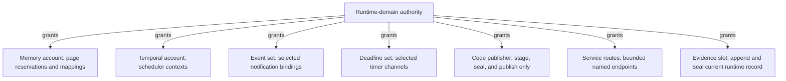
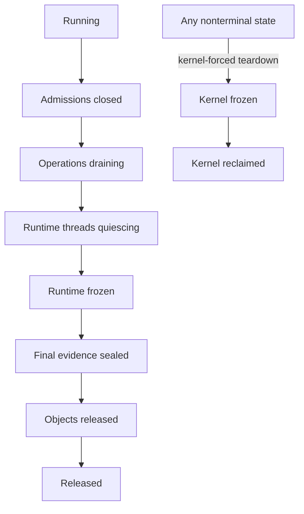

# Runtime-domain bootstrap and kernel adapter

The best-supported implementation is a **transactional runtime bootstrap plus
one capability-confined kernel adapter**. The adapter is the only runtime
component allowed to invoke the Atom OS kernel ABI. It converts kernel objects
into runtime-private typed records, never into ordinary BEAM terms, and gives
the rest of the runtime asynchronous, bounded operations for pages, execution
contexts, deadlines, events, code publication, and cross-domain transport.

A POSIX or library-OS personality is useful as temporary bring-up scaffolding
and as a way to run a close ERTS-derived conformance oracle. It should not
become the permanent runtime ABI. The production architecture should make all
host assumptions explicit and replace them with the smaller native adapter.

This is a proposed composition. Research on scheduler activations, explicit
scheduling contexts, exokernels, library operating systems, and capability
kernels supports the division of responsibility; no reviewed work validates
this exact bootstrap protocol on Atom OS.

## Question, scope, and operational standard

The question is:

> How can an unprivileged BEAM-compatible runtime acquire enough bounded
> machine service to start, run, quiesce, fail, and restart without importing a
> general host OS or leaking kernel authority into actor semantics?

This component owns:

- validation and adoption of the runtime launch descriptor;
- creation and binding of managed scheduler threads to kernel scheduling
  contexts;
- batched page acquisition and release on behalf of runtime allocators;
- bounded kernel event, deadline, and cross-domain transport adapters;
- the runtime side of executable-code publication authority;
- runtime-domain health, shutdown, and final evidence handoff; and
- an inventory proving which external facilities the runtime consumes.

It does not own actor scheduling policy, heap layout, mailbox semantics, device
policy, network routing, OTP restart strategy, or general filesystem and socket
APIs. Those live in other runtime components or protected services.

A satisfactory first implementation must meet these conditions:

1. No component except the adapter can name or invoke a kernel object.
2. No PID, port, reference, decoded term, module literal, or NIF environment
   can be reinterpreted as a kernel capability.
3. Every accepted asynchronous adapter operation has a bounded reservation,
   an operation generation, and exactly one observable terminal disposition.
4. Partial startup can be rolled back without leaking pages, endpoints,
   scheduling contexts, mappings, or notification bindings.
5. Quiescence closes admission permanently for that runtime incarnation; a
   corrupt runtime cannot reopen it.
6. Kernel teardown can freeze and reclaim the domain without cooperation from
   the adapter.
7. The runtime can boot a minimal declared compatibility profile without an
   undeclared host thread, file, signal, socket, clock, virtual-memory, entropy,
   or dynamic-loader dependency.

## Evidence, synthesis, and proposal

| Status | Claim |
| --- | --- |
| Reported evidence | [Scheduler activations](../../30-sources/anderson-et-al-1992-scheduler-activations.md) separate kernel processor allocation from user-level fine-grained scheduling, but their upcalls also expose reentrancy and critical-section complexity. |
| Reported evidence | [Scheduling-context capabilities](../../30-sources/lyons-et-al-2018-scheduling-context-capabilities.md) make CPU budgets and periods explicit authority rather than properties inferred from threads. |
| Reported evidence | [Exokernel](../../30-sources/engler-et-al-1995-exokernel.md) separates protection and revocation from higher-level resource management; [Arrakis](../../30-sources/peter-et-al-2014-arrakis.md) shows the value and risk of delegated data paths. |
| Reported evidence | [SVA](../../30-sources/criswell-et-al-2007-secure-virtual-architecture.md) demonstrates a typed execution boundary that can keep a complex compiler outside a smaller trusted layer, while leaving its verifier/runtime trusted. |
| Current implementation evidence | The pinned [OTP 29 source audit](../../30-sources/erlang-otp-team-2026-otp-29-source-tree.md) shows that current ERTS expects host threads, virtual memory, polling, clocks, files, sockets, signals, executable mappings, and native loading. Those are port dependencies, not BEAM language requirements. |
| Synthesis | Actor multiplexing and language scheduling should stay in the runtime; page ownership, temporal authority, protection, endpoints, and forced teardown should stay in the kernel. |
| Project proposal | Use a disposable compatibility personality during bring-up, but converge on a small native adapter with generated bindings and a machine-readable service inventory. |
| Unverified | Object counts, batch sizes, notification costs, cancellation latency, bootstrap time, and recovery-reserve size on selected targets. |

## Boundary model

### Launch descriptor

The kernel starts a runtime domain with an immutable, size-bounded
`RuntimeLaunchDescriptor`:

```text
RuntimeLaunchDescriptor {
  descriptor_version,
  runtime_epoch,
  image_ref,
  compatibility_manifest_hash,
  initial_address_space,
  memory_account,
  scheduler_contexts[],
  control_endpoint,
  event_endpoints[],
  deadline_channels[],
  code_publication_authority,
  service_routes[],
  crash_record_slot,
  entropy_seed_handle?,
  limits,
}
```

Every field has a declared maximum count and version. Handles are valid only
inside the adapter and are checked against the launch epoch. The loader sees
the image bytes and manifest, not the kernel object used to map them. Actor
code sees runtime abstractions—PIDs, references, timers, ports, and opaque
service handles—not selectors or capability addresses.

The descriptor is treated as untrusted input to the runtime even though the
kernel produced it. This keeps the runtime robust against version mismatch and
makes the same parser usable in models and recovery tests. Conversely, the
kernel never relies on the runtime's validation for enforcement.

### Adapter surface

The common interface should be narrow and split phase:

```text
memory_reserve(account, page_count, class) -> Reservation | Refused
memory_map(reservation, permissions, placement_hint) -> MapOp
memory_release(mapping_generation) -> ReleaseOp

context_bind(thread, scheduling_context) -> BoundContext | Refused
context_wait(bound_context, wake_set, deadline?) -> WakeRecord
context_yield(bound_context, progress_record) -> ResumeRecord

deadline_arm(channel, absolute_target, token_generation) -> DeadlineOp
event_ack(binding_generation, observed_sequence) -> AckOp

transport_send(route, credit, buffer, correlation) -> SendOp
transport_cancel(operation_generation) -> CancelDisposition

code_prepare(page_reservation) -> WritableNonExecutableStage
code_seal(stage, publication_evidence) -> ExecutableGeneration
```

These are semantic operations, not a promise of one syscall each. Batching is
permitted when it preserves ownership, generation, charge, and terminal
results. A completion ring is a notification optimization; the canonical
operation record remains pollable until consumed so a lost wakeup cannot erase
the outcome.

### Authority graph

The adapter should hold attenuated child authorities rather than one ambient
root capability:



The memory allocator cannot publish code. The loader cannot submit device I/O.
The distribution gateway cannot bind a scheduling context. Internal memory
corruption can still steal another adapter-held authority because these
components share a protection domain, but the structure reduces accidental
coupling and provides a path to later compartmentalization.

## Bootstrap and shutdown state machines

### Bootstrap


Before `FirstActorPublished`, failure follows a rollback ledger in reverse
construction order. Publication is the point at which externally visible PIDs
and service routes can exist. A runtime must not publish an actor and later
discover that its scheduling or memory account was never established.

Bootstrap contains a bounded reserve for the loader, initial collector space,
control mailbox, evidence record, and shutdown path. It must not use the same
ordinary actor pool that untrusted initialization code can exhaust.

### Quiescence and teardown



`AdmissionsClosed` is monotonic for the runtime epoch. New actors, timers,
native requests, gateway sends, and code generations are refused. Existing
operations either reach their normal terminal outcome or are sealed with a
typed cancellation/indeterminate result. The adapter attempts an orderly
drain, but the kernel may enter `KernelFrozen` on fault, timeout, revocation, or
administrative stop.

The final evidence record is useful but never authoritative over kernel-owned
objects. A corrupt runtime can omit or forge its internal summary; the kernel's
fault, budget, mapping, and teardown record remains separate.

## Critical paths

### Scheduler-thread creation and revocation

1. Reserve a runtime thread record and stack from the memory account.
2. Bind it to one specific kernel scheduling-context generation.
3. Publish it to the runtime scheduler set only after binding succeeds.
4. On grant reduction or hot removal, mark the context draining, stop assigning
   new actors, and yield at the next runtime safe point.
5. Return the context only after the thread is outside actor state and has
   published its queue ownership.

The number of scheduler threads follows admitted contexts, not hardware CPU
discovery. A kernel pre-emption is always legal; correctness cannot depend on a
thread voluntarily exhausting an actor's reduction slice.

### Page batch acquisition

1. An allocator requests a typed class and bounded count against a runtime
   subaccount.
2. The adapter reserves the domain charge before asking for mappings.
3. The kernel returns pages with an explicit ownership/mapping generation.
4. The allocator adopts the complete batch or the adapter releases it; partial
   adoption is represented explicitly.
5. Reclamation verifies generation and publication epochs before reuse.

Large batches reduce crossings but retain idle memory and make failure rollback
larger. Batch size is therefore a measured class-specific policy, not ABI.

### Cross-domain operation

The adapter never lets an actor write directly to a kernel endpoint. A runtime
gateway resolves an actor-visible handle, reserves encoding and transport
credit, produces a validated buffer, and submits it with a generation-stamped
operation record. Completion becomes a runtime signal only after route,
runtime, service, and actor incarnations are checked.

## Alternatives and rejected shortcuts

### Full POSIX personality as the permanent boundary

This maximizes reuse and hides porting work, but it makes files, signals,
threads, sockets, polling, and process-global state de facto architecture. It
also obscures which calls carry authority or resource charges. Retain it only
as a differential oracle and migration step.

### One kernel thread per actor

This would turn a cheap language object into a kernel scheduling and protection
object, defeating the intended scale and duplicating runtime mailbox, heap,
link, and failure mechanisms. Use kernel domains where hardware isolation is
required, not for every ordinary actor.

### Shared selector integers

Encoding a kernel handle as an integer or reference in an actor heap is fast
but collapses reachability and authority. A runtime broker should resolve
opaque actor-visible resource references and enforce actor/application policy;
the adapter alone keeps the kernel handle.

### Scheduler-activation-style arbitrary upcalls

The historical work demonstrates the information problem but also the cost of
asynchronous scheduler reentrancy. Atom OS should prefer explicit event records
and kernel pre-emption plus safe-point reconciliation. If urgent revocation
needs an upcall, constrain it to preallocated adapter state with no actor heap
access.

## Failure, security, and resource analysis

- **Malformed launch data:** reject before mapping or context publication;
  preserve a small kernel-visible reason code.
- **Adapter memory corruption:** assume whole runtime compromise; kernel
  capability checks and domain teardown contain it.
- **Lost notification:** terminal operation state remains pollable; sequence
  gaps and ring overflow are explicit.
- **Operation cancellation race:** cancel returns `NotSubmitted`,
  `NotExecuted`, `Completed`, or `Indeterminate`; timeout alone is never proof
  of non-execution.
- **Resource exhaustion:** ordinary admission closes before control, collector,
  cleanup, and crash-evidence reserves are consumed.
- **Runtime hang:** kernel time and progress supervision freeze the domain;
  recovery is initiated outside it.
- **Capability leakage attempt:** serializers, crash dumps, traces, and term
  printers never expose raw selectors; fuzz tests cover every term-like runtime
  object.

## Implementation program

### Stage 0: dependency inventory and executable model

- Trace a pinned OTP 29.0.6 boot through minimal ERTS, `kernel`, and `stdlib`.
- Inventory every host operation and classify it as runtime mechanism, service
  policy, temporary compatibility facility, or forbidden dependency.
- Model bootstrap, partial rollback, operation completion, and teardown with a
  tiny bounded state space.

Exit condition: every external dependency has a declared owner and the model
finds no leaked object or reopened admission path.

### Stage 1: hosted typed adapter

- Implement the semantic interface over a host personality without exposing
  POSIX types above it.
- Run the reference interpreter and conformance tests through the adapter.
- Record operations, charges, and unexpected host calls.

Exit condition: runtime code outside the adapter contains no direct host API
call and the log is complete enough to reproduce bootstrap/shutdown.

### Stage 2: native Atom OS adapter

- Replace memory, scheduling, deadline, event, code, and transport backends with
  kernel objects.
- Add forced freeze/reclaim and external runtime reconstruction.
- Exercise emulator reset-to-first-actor loops.

Exit condition: no compatibility-personality service is required to boot and
tear down the declared runtime profile.

### Stage 3: batching and resilience

- Tune per-class page batches and completion rings.
- Add context-grant changes, service incarnation replacement, and pressure
  feedback.
- Verify crash capture under OOM, event overflow, and adapter fault.

## Verification and measurements

- Inject failure after every transition in startup and shutdown; assert exact
  object-count return to baseline.
- Model generation wrap and delayed completions with intentionally tiny IDs.
- Exhaust ordinary memory/CPU/endpoints while proving recovery-reserve
  progress.
- Revoke scheduling contexts during actor, GC, loader, and mailbox work; check
  single actor ownership and eventual safe point.
- Sweep memory batch size and event-ring depth; report throughput, retained
  memory, crossing rate, p99.9 completion/cancellation latency, and overflow.
- Fuzz serialization and diagnostic paths to show that kernel handles never
  become ordinary term data.
- Maintain a build-time forbidden-symbol check and a runtime unexpected-call
  trap for host dependencies outside the adapter.

## Supported decisions and open questions

Current evidence supports one adapter, two-level scheduling, explicit temporal
and memory authority, split-phase operations, generation checking, and
kernel-authoritative teardown. It does not select the exact ABI encoding,
batch sizes, notification mechanism, reserve ratios, or whether the final
adapter should be written in the same language as the rest of the runtime.

The main falsifier is operational: if the narrow adapter cannot run the pinned
compatibility profile without recreating a broad POSIX layer, the profile must
be narrowed, selected services must be moved above it, or the proposed kernel
contract must be revised explicitly. Hiding dependencies behind undocumented
shims is not success.

## Connections

- [Managed actor runtime layer](../managed-actor-runtime-layer.md) — integrated
  contract consumed and refined here.
- [Minimal privileged kernel layer](../minimal-privileged-kernel-layer.md) —
  supplies the capabilities, budgets, endpoints, faults, and teardown that the
  adapter consumes.
- [Typed kernel-facing architecture facade](../kernel-hardware-and-architecture-components/typed-kernel-facing-architecture-facade.md) —
  normalizes the privileged mechanisms beneath the kernel objects.
- [Compatibility manifest, BEAM loader, and verifier](compatibility-manifest-beam-loader-and-verifier.md) —
  validates the image before first actor publication.
- [Reduction scheduler and kernel scheduling contexts](reduction-scheduler-and-kernel-scheduling-contexts.md) —
  consumes context grants and reports safe progress.
- [Failure translation and the OTP boundary](failure-translation-and-the-otp-boundary.md) —
  defines how runtime failure becomes typed outer recovery evidence.

## Sources

- [Scheduler Activations](../../30-sources/anderson-et-al-1992-scheduler-activations.md)
- [Scheduling-context capabilities](../../30-sources/lyons-et-al-2018-scheduling-context-capabilities.md)
- [Exokernel](../../30-sources/engler-et-al-1995-exokernel.md)
- [Arrakis](../../30-sources/peter-et-al-2014-arrakis.md)
- [Secure Virtual Architecture](../../30-sources/criswell-et-al-2007-secure-virtual-architecture.md)
- [seL4 Reference Manual](../../30-sources/sel4-foundation-2026-reference-manual.md)
- [OTP 29 source tree](../../30-sources/erlang-otp-team-2026-otp-29-source-tree.md)
- [Crash-only software](../../30-sources/candea-fox-2003-crash-only-software.md)
