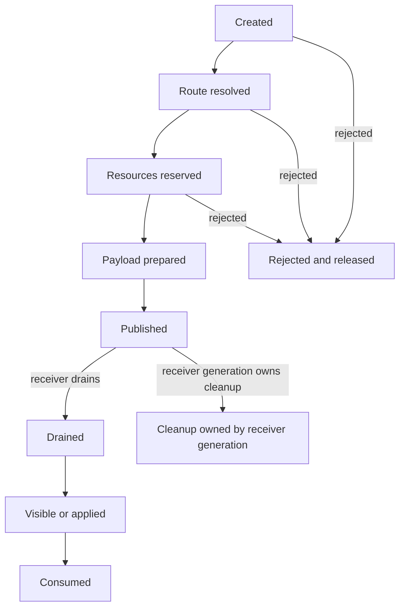
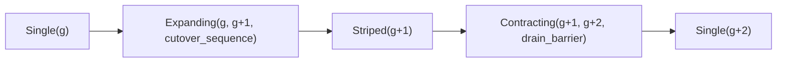
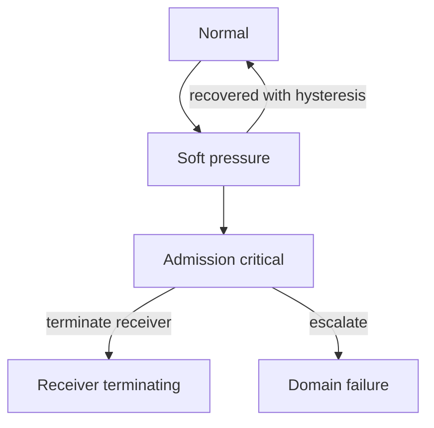

# Signal ingress, mailboxes, and selective receive

The best baseline separates the **logical signal/mailbox contract from the
physical concurrent ingress structure**. Each actor has a many-producer signal
ingress that concurrent senders may publish into, but only the owning scheduler
drains signals, materializes actor-visible messages, and advances selective
receive state. Start with the simplest correct MPSC queue; enable
sender-stable adaptive stripes only when measured fan-in contention justifies
their additional merge and reclamation state.

The logical contract preserves asynchronous signaling, conditional order from
one sender to one destination, first-match selective receive, links, monitors,
aliases, and the pinned priority-message behavior. It makes no total-order
claim across senders. Queue layout, stripe count, locks, atomics, fragments,
and receive markers remain implementation details.

Resource boundedness cannot be smuggled in as silent message loss. In the
compatibility profile, once a local live-recipient send is admitted and
published, it is not discarded merely because a mailbox threshold is crossed.
A bounded-service extension can expose `try_send` or explicit credits before
acceptance. Under hard compatible-profile exhaustion, terminate/quarantine the
overloaded receiver or runtime with structured evidence rather than pretend
the original send semantics remained unchanged.

## Question, scope, and operational standard

The question is:

> How can many senders publish signals scalably while the receiver observes the
> required order and selective-receive behavior, and how can overload be
> contained without inventing invisible message loss?

This component owns:

- route resolution and atomic signal-envelope admission;
- sender-order-preserving ingress queues and receiver wakeup hints;
- conversion of signals into links, monitors, exits, messages, and system work;
- actor-visible logical mailbox order and priority partitions;
- selective receive cursors, compiler-created correlation markers, and scan
  charging;
- alias deactivation interaction with late replies;
- queue count/byte/age/fan-in telemetry; and
- explicit compatibility and bounded-service overload profiles.

It does not own actor identity allocation, term copying internals, scheduler
policy, network transport, or supervisor response. It consumes those contracts.

The operational standard is:

1. If sender `S` emits `a` before `b` to one destination generation and both
   signals are delivered, `a` is handled before `b`; loss permitted by a
   distributed failure does not allow `b` to be observed before a delivered
   `a`.
2. No order is invented between independent senders beyond the chosen
   linearization of accepted arrivals.
3. A message becomes visible only after its entire envelope, payload ownership,
   and resource charge are committed atomically.
4. Selective receive returns the first matching message in logical mailbox
   order and preserves the relative order of skipped messages.
5. Every inspected candidate, copied byte, and bounded signal-maintenance unit
   consumes reductions or a named system-work account.
6. Actor exit, alias deactivation, admission, priority insertion, and hard
   pressure have modeled race outcomes.
7. Queue overflow, tracing loss, or wake coalescing is never reported as a
   successfully delivered ordinary message.

## Evidence, synthesis, and proposal

The official [OTP runtime
documentation](../../30-sources/erlang-otp-team-2026-otp-29-0-6-managed-runtime-documentation.md)
defines asynchronous signals and sender-destination order, but explicitly does
not promise global order or bounded delivery. [Högberg's implementation
account](../../30-sources/hogberg-2021-message-passing.md) separates incoming
signals from the message queue, explains copied payloads and queue storage
options, and shows why general selective receive scans preceding unmatched
messages.

[Winblad's many-to-one
optimization](../../30-sources/winblad-2021-parallel-signal-sending.md) uses
adaptive sender-hashed FIFO buffers to remove a contended outer queue in a
specific extreme fan-in case. Its very large reported improvement used tiny
messages on one machine; larger payloads benefited less and the single receiver
remained the drain limit. This is evidence for adaptive striping, not a fixed
64-stripe API.

[Michael and Scott](../../30-sources/michael-scott-1996-concurrent-queue-algorithms.md)
provide simple nonblocking and two-lock FIFO baselines and emphasize that safe
node reclamation is separate from enqueue/dequeue linearizability. [Mailbox
types](../../30-sources/fowler-et-al-2023-mailbox-types.md) show how a future
typed profile can rule out protocol mismatches, but ordinary BEAM retains
dynamic mailboxes.

| Status | Claim |
| --- | --- |
| Compatibility evidence | Per-sender/destination signal order and first-match selective receive are observable; queue topology is not. |
| Performance evidence | Sender-striped ingress can remove a hot enqueue lock under extreme fan-in, but does not increase one receiver's drain capacity. |
| Algorithm evidence | MPSC/nonblocking queues clarify publication and helping; reclamation and higher-level order still require a runtime protocol. |
| Negative evidence | Faster sends can worsen backlog; unbounded async distribution can exhaust a node; bounded mailboxes in other actor systems often drop or block with semantics unlike Erlang `!`. |
| Project proposal | Atomic precharged envelopes, simple MPSC baseline, adaptive stable stripes, receiver-owned draining, scan charging, and explicit overload profiles. |
| Unverified | Best stripe policy, message storage policy, pressure thresholds, wake batching, and hard-compatible exhaustion action. |

## Logical signal model

Every signal has a header independent of its physical node:

```text
SignalEnvelope {
  source_actor_or_service,
  source_incarnation,
  destination_actor,
  destination_generation,
  sender_sequence_domain,
  signal_kind,
  priority_class,
  payload_descriptor,
  charge_reservation,
  correlation?,
  trace_context?,
}
```

`sender_sequence_domain` need not be an actor-visible integer. It identifies
the ordering path used to prove that one sender's later signal cannot overtake
an earlier delivered one. A sender must use a stable ingress stripe for the
destination generation or the receiver must perform an explicit bounded merge
using sequence state. Stable hashing is simpler and preferred.

Signal kinds include message signals whose resulting messages may be ordinary
or priority, link/unlink protocol records, monitor/demonitor/`DOWN`, exit,
alias-targeted send, process-info/control requests, timer delivery, and selected
service completions. They share the ordering substrate but have distinct
actor-visible actions. Calling every record a message loses important lifecycle
and priority rules.

## Atomic send protocol



1. Resolve the destination table entry and pin/revalidate its generation.
2. Compute a bounded payload size and decide immediate, literal, large-binary,
   or copied-term handling.
3. Reserve envelope, receiver queue, runtime-domain, and copy memory. The
   bounded-service profile also consumes one edge credit.
4. Construct the entire receiver-owned payload or immutable shared reference
   off the visible queue.
5. Revalidate destination state and atomically link the complete envelope into
   the stable sender path.
6. Commit reservations and publish a coalescing wake hint.

If the destination exits before publication, the send follows the pinned
dead-destination behavior and releases reservations. After publication,
cleanup for that receiver generation owns the envelope even if exit races. A
half-built term is never visible, and rollback never unlinks a node another
consumer could have observed.

### Queue reclamation

An MPSC linked queue cannot free a node while a delayed producer may still
refer to it. The initial design should exploit single-consumer ownership,
dummy-node discipline, and an epoch/hazard or generation-safe pool whose proof
is small. Reusing envelope slots solely because the receiver advanced its head
is unsafe. Debug builds poison retired nodes and delay reuse to expose stale
producer access.

## Adaptive striped ingress

One actor begins with one queue. The runtime samples producer contention,
failed atomic retries or lock wait, sender fan-in, queue rate, and payload copy
time. It may publish a new ingress generation containing a power-of-two stripe
set. Each sender maps stably by sender identity and destination generation.

Transition needs an explicit barrier:



Senders that observed the old generation either finish there or retry before
publication. The receiver drains old and new generations in a way that
preserves each sender's order. If a sender can have nodes in both generations,
the cutover record supplies a per-sender barrier; otherwise stable pinning keeps
it on the old path until acknowledged.

Do not expand merely because the queue is long. A long queue with little
enqueue contention indicates a slow receiver; more stripes add memory without
fixing drain rate.

## Signal handling and mailbox construction

The owner scheduler drains at most a charged signal batch before returning to
actor execution or yielding. Urgent lifecycle signals may use a distinct
bounded processing class, but the reserve and maximum batch are finite.
Priority cannot be an unbounded bypass.

Ordinary messages enter one logical mailbox with the profile's priority
behavior. A message signal whose resulting message is accepted as priority
still travels in sender order; only after signal receipt can the resulting
priority message be placed in the priority partition ahead of earlier ordinary
mailbox messages according to OTP semantics. Each partition preserves its
required order. Instrumentation records signal-handling order separately from
final message-queue order to prevent incorrect claims that the signal itself
overtook another.

Mailbox storage is abstract:

```text
LogicalMailbox {
  priority_partition,
  ordinary_partition,
  save_cursor,
  correlation_markers,
  storage_accounting,
}
```

An on-heap payload may already be in the receiver's young generation; an
off-heap fragment remains queue-owned until selected. The public order and
term value are the same. Policy can change at a safe point using measured
queue age, live ratio, GC cost, and message size.

## Selective receive

General receive scans the logical mailbox from the current save cursor and
selects the first message matching the ordered clauses and guards. For every
candidate:

1. make the payload safely visible in the actor's term space if needed;
2. evaluate patterns/guards under the declared exception behavior;
3. charge at least one scan unit plus size-dependent work;
4. retain unmatched messages in their relative order; and
5. on match, remove exactly that message and reset/advance receive state as the
   profile requires.

The scan loop has a bounded safe point, so an absent match in a million-message
mailbox cannot monopolize a scheduler thread. Yielding preserves the cursor,
clause state, mailbox generation, and the fact that concurrently arriving
messages belong after the already scanned prefix unless the priority profile
requires a separate partition check.

When the compiler proves that a fresh reference was created and only later
replies can match it, the send/request path may install a marker. A receive for
that reference starts after the marker. This is an optimization with a verifier
fact or conservative runtime check; it must not skip a legally matching earlier
message. General per-pattern indexing is deferred because every enqueue would
pay mutation, hashing, and reclamation costs and Erlang patterns are richer
than simple keys.

## Aliases and cancellation

An alias identifies its creating actor generation. Deactivation prevents a
message signal that has not yet produced a mailbox entry from being accepted,
even when the sender published that signal earlier. Alias validity is therefore
rechecked while the receiver handles the signal, and the race linearizes at
mailbox insertion versus deactivation:

- mailbox insertion wins: the message is already in the mailbox and
  deactivation cannot recall it;
- deactivation wins before mailbox insertion: a later or already in-flight
  alias signal is dropped according to alias semantics; or
- destination generation is gone: the signal cannot reach a successor.

This is useful for timed-out request/reply protocols. It is not proof that the
request was canceled at the service or that no external effect occurred.

## Overload profiles

### Compatible local messaging



- Soft thresholds emit queue count/bytes, oldest age, drain/arrival rates, and
  leading producers to supervisor policy.
- Admission-critical pressure may throttle actor spawning, external ingress,
  low-authority service routes, or scheduling of producers when semantics
  permit.
- If a mandatory local send cannot be kept within the hard domain boundary,
  the declared policy terminates/quarantines the receiver or runtime and emits
  evidence. It does not silently drop an arbitrary admitted message.

The exact compatible behavior under hard memory exhaustion must be
differentially characterized; termination is an Atom OS resource-profile
extension and must be advertised as such.

### Bounded-service extension

A service endpoint may expose `try_send` or a credit channel:

```text
credit_granted >= messages_accepted - credits_returned
```

Reservation/refusal happens before publication, so the sender observes that an
operation was not accepted. Credit is per edge or request class, not a global
actor mute that could stop unrelated cleanup/control work. Ordinary `!` is
never silently redirected to this API.

## Failure, security, and resource analysis

- **Producer flood:** precharge bytes/count, attribute producer fan-in, close
  external credits, and retain control/cleanup reserve.
- **Selective-receive attack:** charge candidates and elapsed CPU, expose scan
  rate and oldest skipped message, and permit supervisor policy; never make
  scan free.
- **Priority abuse:** capability/profile-gate priority creation, cap processing
  batches, and report ordinary-message starvation.
- **Malformed cross-domain term:** validate and construct in bounded staging;
  no pointer or kernel authority crosses.
- **Wake loss/duplication:** wake is a hint derived from queue state; actor
  ownership logic handles coalesced or duplicate hints.
- **Queue corruption:** treat as runtime-domain fault because actor isolation
  depends on trusted queue metadata.

## Implementation program

### Stage 0: logical model

- Model two senders, one receiver, exit, alias, priority, receive, and tiny
  capacity.
- Check admitted exactly once or rejected before publication, per-sender order,
  first-match selection, and no successor delivery.

### Stage 1: simple ingress

- Implement one MPSC or two-lock queue per actor, receiver-only drain, copied
  payloads, one logical mailbox, and scan charging.
- Differentially test signals and receive against OTP 29.0.6.

### Stage 2: storage and batching

- Add on/off-heap queue policy, bounded signal batches, correlation markers,
  and metrics.
- Tune wake coalescing without changing behavior.

### Stage 3: adaptive stripes and pressure profiles

- Implement explicit ingress-generation cutover and safe reclamation.
- Add compatible hard-pressure action and opt-in credit endpoints.
- Keep a configuration switch to the simple baseline for comparison.

## Verification and measurements

- Sequence-tag each sender under migration, priority traffic, exit, queue
  expansion/contraction, and memory pressure.
- Sweep fan-in, payload size, stripe count, queue mode, NUMA placement, and
  scheduler count; report attempted, accepted, drained, and consumed rates
  separately with p50/p99/p99.99 latency.
- Test selective receives matching head, middle, tail, absent, and after fresh
  reference markers; record candidates and CPU per match.
- Exhaust queue bytes and domain pages while racing send/exit; verify one
  terminal ownership path and preserved cleanup progress.
- Compare compatibility termination, explicit `try_send`, credits, and
  producer throttling under cycles and control messages.
- Run memory reclamation sanitizers with delayed producers and aggressive slot
  reuse.

## Supported decisions and open questions

Evidence supports signal/mailbox separation, per-sender rather than global
order, receiver-owned drain, scan charging, optional stable stripes, and
explicit backpressure extensions. It does not choose one queue algorithm or
overload threshold for all targets.

Open questions include stripe cutover design, priority starvation control,
on/off-heap switching, the exact compatible hard-memory outcome, and whether a
typed/certified mailbox profile can safely specialize selected receives. All
must preserve the simple logical model as the oracle.

## Connections

- [Managed actor runtime layer](../managed-actor-runtime-layer.md)
- [Actor identity, lifecycle, and process state](actor-identity-lifecycle-and-process-state.md)
- [Terms, private heaps, shared binaries, and tracing collection](terms-private-heaps-shared-binaries-and-tracing-collection.md)
- [Reduction scheduler and kernel scheduling contexts](reduction-scheduler-and-kernel-scheduling-contexts.md)
- [Resource accounting and overload control](resource-accounting-and-overload-control.md)
- [Distribution gateway and remote actor semantics](distribution-gateway-and-remote-actor-semantics.md)

## Sources

- [OTP 29.0.6 managed-runtime documentation](../../30-sources/erlang-otp-team-2026-otp-29-0-6-managed-runtime-documentation.md)
- [A few notes on message passing](../../30-sources/hogberg-2021-message-passing.md)
- [Many-to-one parallel signal sending](../../30-sources/winblad-2021-parallel-signal-sending.md)
- [Concurrent queue algorithms](../../30-sources/michael-scott-1996-concurrent-queue-algorithms.md)
- [Mailbox types](../../30-sources/fowler-et-al-2023-mailbox-types.md)
- [Efficient memory management](../../30-sources/sagonas-wilhelmsson-2006-efficient-memory-management.md)
