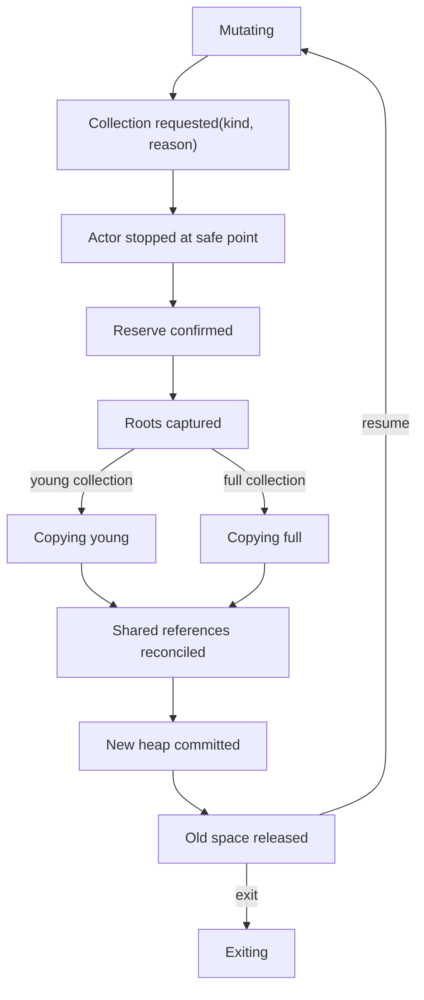

# Terms, private heaps, shared binaries, and tracing collection

The best compatibility-first implementation is **private actor heaps with a
simple generational semispace copying collector, copied ordinary message
graphs, and explicitly recognized immutable shared objects**. Each actor is
stopped independently at a safe point. The collector first reserves enough
space to finish, traces all actor-local roots, builds a complete new heap, then
commits or terminates the actor/domain without ever returning a half-forwarded
graph to execution.

This preserves the required automatic process-local tracing garbage
collection and the strongest practical benefit of BEAM isolation: allocation
and collection normally do not synchronize with other actors. It does not mean
all runtime memory is private. Large binaries, module literals, code, atoms,
tables, allocator metadata, trace state, and native resources need separate
ownership, lifetime, and accounting.

No bounded major-collection latency should be claimed for the first collector.
If measured pauses fail the responsiveness standard, add a resumable major
collector with explicit barriers and invariants; do not describe ordinary
generational copying as incremental merely because actors are small on
average.

## Question, scope, and operational standard

The question is:

> What term representation and collection design preserves ordinary BEAM
> values, private actor mutation, automatic tracing reclamation, and message
> semantics while making every shared or off-heap byte visible to Atom OS
> resource control?

This component owns:

- immediate and boxed term representation within the declared profile;
- actor-local stack/heap layout and allocation;
- young/old generation collection and exact root descriptors;
- heap fragments and on/off-heap message adoption;
- immutable module literals and shared-binary references;
- collector reserve, pause/work metrics, and memory-class reconciliation; and
- validation tools for heap ownership and object graphs.

It does not own queue ordering, table semantics, code publication, kernel page
allocation, or overload policy. It exposes precise reservations and outcomes
to those components.

An acceptable implementation must ensure:

1. No mutable pointer from actor A's private heap references actor B's private
   heap.
2. Ordinary local message graphs are copied; only declared immutable/shared
   classes cross actors by reference.
3. Every GC/safe point has a complete root map for registers, stack, process
   dictionary, exception state, accepted messages, and runtime-held actor-local
   references.
4. Old-to-young pointers are impossible or covered by a complete remembered
   set and write barrier.
5. Collection has a pre-reserved completion path and never resumes a partially
   forwarded heap.
6. Shared object lifetime and retained size are exact even when attribution is
   a declared approximation.
7. Domain memory, not `max_heap_size` alone, is a continuously enforced hard
   containment boundary.

## Evidence, alternatives, and limits

[Sagonas and
Wilhelmsson](../../30-sources/sagonas-wilhelmsson-2006-efficient-memory-management.md)
compare private, communal, and hybrid heap organizations for message-passing
programs. Private heaps enable unsynchronized allocation and actor-local
collection and make actor exit cheap; they pay message-copy bandwidth. Their
hybrid design reduces copying with analysis and incremental shared-heap work,
but the 2006 prototype and hardware do not establish current latency or
scalability.

Current [OTP 29 runtime
documentation](../../30-sources/erlang-otp-team-2026-otp-29-0-6-managed-runtime-documentation.md)
describes a process-local generational semispace collector, young and old
heaps, heap fragments, a global large-object area, reference-counted binaries,
and a virtual binary heap heuristic. Ordinary local messages are copied except
for literals and reference-counted binaries. On-heap message payloads can be
allocated in the receiver's young heap, while off-heap mode retains fragments
until message visibility/adoption. Therefore “mailbox bytes” and “heap bytes”
can overlap unless the runtime classifies storage precisely.

[Orca](../../30-sources/clebsch-et-al-2017-orca.md) demonstrates that Pony's
reference-capability type system can enable zero-copy mutable-object transfer
and concurrent actor collection. The proof assumptions are the point: ordinary
compiled BEAM supplies no equivalent uniqueness or immutability certificate.
Atom OS may later admit certified immutable or unique-transfer terms, but the
baseline copies when proof is absent.

| Design | Main advantage | Main cost or incompatibility | Role |
| --- | --- | --- | --- |
| Private generational heaps | Independent fast allocation/GC; cheap exit | Copies ordinary messages; large full-GC pauses possible | Baseline |
| One communal heap | Avoids message copying | Shared synchronization, roots, barriers, and possible global effects | Rejected baseline |
| Hybrid message area | Can reduce copies and incrementalize selected work | Complex analysis, barriers, and shared reclamation | Later experiment |
| Reference-capability transfer | Safe zero-copy under strong static facts | Ordinary BEAM lacks proofs | Optional certified profile |
| Per-actor region only, reclaim on exit | Extremely simple | Leaks until exit; fails long-lived general BEAM programs | Insufficient |

## Term and memory classes

The public compatibility profile defines observable term forms, equality,
ordering, arithmetic, exceptions, external encoding, and word-size limits. It
does not expose the internal object headers. A practical runtime classification
is:

| Class | Owner/lifetime | Cross-actor rule | Primary charge |
| --- | --- | --- | --- |
| Immediate | Encoded value | Copy bits | None beyond container |
| Actor cons/boxed object | One heap generation | Deep copy | Owning actor |
| Small heap binary | One actor heap | Copy | Owning actor |
| Large binary payload | Immutable shared object | Share reference | Binary object/domain plus declared retainer attribution |
| Subbinary/match view | Actor-local descriptor retaining parent | Copy descriptor/share immutable parent | Retained parent bytes visible to retainer |
| Module literal | Immutable code generation | Share while generation pinned | Code generation/account |
| Off-heap message fragment | Receiver queue account | Adopt/copy at visibility | Receiver queue, then actor heap if adopted |
| Table object | Table owner/account | Copy in and out for compatible baseline | Table account |
| Native/service resource | Explicit lease and generation | Opaque handle only | Service/request account |
| Atom/code/global cache | Runtime domain | Indexed immutable/global state | Domain or named subsystem |

The term representation should make pointer classes distinguishable with
cheap, total validation. A heap graph checker must be able to decide whether
every pointer lies in the owning actor's active spaces or in a declared shared
object class.

## Heap organization

### Young space and stack

The first implementation may follow the proven simplicity of a contiguous
young heap and stack growing toward each other, or use separate blocks if guard
pages and segmented stack growth materially help. The choice is internal if
root/state semantics are unchanged.

Allocation is bump-pointer fast. Before an instruction or runtime call that may
allocate, the interpreter checks a declared need or enters an allocation slow
path. That boundary is also a safe point: live registers and stack slots have a
known description, and no temporary native pointer is hidden from the
collector.

### Old space and promotion

Objects surviving a young collection are copied according to one documented
promotion rule. The initial design should avoid an actor mutator writing an old
object to point into young space; immutable functional terms usually make this
natural, but runtime-mutable objects such as process dictionary structures,
message metadata, match contexts, and native resource wrappers must be audited.
If such edges exist, use a precise card/remembered-set barrier and verify it in
the graph checker.

`fullsweep_after`, minimum heap sizing, and growth geometry are tunable policy.
They must not be treated as compatibility semantics, and their memory effects
belong in experiment metadata.

### Heap fragments and queued messages

Senders never allocate directly into a running receiver heap. They copy into a
reserved off-heap fragment or into storage whose ownership is transferred
atomically with the envelope. In off-heap queue mode, the fragment stays on the
queue account until selected; on match it becomes part of the actor's young
generation or is copied into it. In on-heap mode, the owner scheduler may
integrate admitted payloads into the heap according to safe-point rules.

Metrics expose:

- ingress envelope and fragment bytes;
- message payload bytes already participating in the heap;
- heap fragment bytes attached to the young generation;
- live young/old bytes after collection; and
- shared bytes referenced but not owned.

This prevents double counting while still showing why a mailbox retains
memory.

## Collector state machine

### Root set

The exact set includes:

- live X registers and interpreter/JIT temporaries described at the safe point;
- stack/Y slots, continuations, catch/try state, and exception value/trace;
- process dictionary and actor metadata containing terms;
- on-heap messages and attached message fragments;
- current receive/match contexts;
- actor-local link/monitor/timer payload terms where applicable;
- runtime operation records holding actor terms; and
- tracing/debug state explicitly pinned to the actor.

Global code/literal, shared binary, table, and native objects are not copied as
actor heap objects. Their actor-local wrapper is traced and their external
lifetime is reconciled after copying.

### Reserve and commit

Before writing a forwarding marker, the collector obtains a reservation that
can finish the declared collection or has a proven fallback. A semispace
collector's worst live-copy requirement can approach live size plus metadata;
resource admission must account for that, not only current allocated words.

If reserve cannot be obtained, policy may terminate the actor, attempt a
different bounded collection, or escalate the runtime under domain pressure.
It may not perform half a copy and resume. The old heap remains authoritative
until the root set and all moved objects are complete; one commit changes the
actor to the new spaces.

### Major-collection latency

A full copy is proportional to live graph size and memory bandwidth. Reductions
can charge the work, but cannot retroactively pre-empt one monolithic native
loop. Initial reports therefore publish observed maximum pause by live size and
target. If unacceptable, a resumable collector needs:

- a snapshot or barrier rule for mutator changes between slices;
- persistent forwarding and scan queues;
- roots that remain valid across yields;
- a bound on each scan/copy slice;
- safe interaction with message admission and exit; and
- OOM recovery that can still complete or discard the actor consistently.

That is a new collector design and must be modeled independently.

## Shared binaries and retained-byte accounting

One immutable binary payload has an exact allocation size, owner object,
reference count or equivalent lifetime mechanism, and domain charge. Each
actor wrapper reports the parent size and viewed range. A one-byte subbinary of
a 100 MB payload therefore exposes 100 MB of retained domain memory, not one
byte.

There is no uniquely correct per-actor monetary split. Candidate policies are:

- creator pays until release;
- equal/proportional charge among current accounts;
- each retainer receives an informational retained-byte charge while the
  domain holds the single enforcement charge; or
- transfer primary charge when the creator exits.

The recommended baseline uses one exact primary domain/object charge plus
nonduplicated actor-retention telemetry and configurable soft quotas. Hard
enforcement never sums the whole binary once per actor. Experiments should
evaluate whether a retainer policy is needed to prevent one account from
pinning objects created by another.

Reference counts must not overflow and their decrement cannot be lost during
GC, message rejection, actor exit, or table/native transfer. Per-scheduler
batched deltas are allowed only if teardown can flush or reconstruct them.

## Failure, security, and resource analysis

- **Malformed term graph:** internal constructors and decoders validate class,
  size, alignment, depth, and pointer ownership; corruption is a domain fault,
  not an actor exception unless the profile proves containment.
- **OOM during GC:** use reserve-before-forwarding and a declared actor/domain
  terminal policy.
- **Shared-binary retention:** expose parent retained size, object age,
  creator, retainers by account, and collection-trigger heuristics.
- **Atom exhaustion:** input decoding never creates atoms unless authorized and
  within the domain's permanent-atom budget.
- **Allocator fragmentation:** charge reserved/mapped pages and allocator
  slack separately from live term bytes; periodically reconcile with the
  kernel memory account.
- **GC denial of service:** charge copied/scanned words and pause time to the
  causative actor/application, while capping collector reserve.
- **Cross-actor pointer bug:** graph-checking debug builds and page/color
  poisoning fail fast before silent isolation loss.

## Implementation program

### Stage 0: representation model and checker

- Freeze the initial word sizes, tags, headers, and supported term forms.
- Implement an independent heap graph/ownership checker.
- Generate arbitrary well-formed terms and minimized corrupt graphs.

### Stage 1: full semispace collector

- Implement one private heap per actor, precise roots, copying send, full
  collection, and wholesale exit reclamation.
- Force collection at every legal allocation point in deterministic tests.

### Stage 2: generations and message modes

- Add young/old spaces, promotion, off-heap fragments, and on/off-heap queue
  policy.
- Verify every possible old-to-young edge or barrier.

### Stage 3: shared objects and pressure

- Add large binaries, subbinary retention, module literals, primary charges,
  retainer telemetry, and domain reconciliation.
- Exercise OOM and actor exit during every lifetime transition.

### Stage 4: bounded-pause experiment

- Measure first. If required, prototype resumable full collection behind a
  profile flag and compare complexity, barriers, throughput, memory, and tail
  latency with the simple collector.

## Verification and measurements

- Force minor/full GC at every allocation, call, receive, exception, and code
  transition; compare terms and behavior with OTP 29.0.6.
- After every collection, independently traverse roots and verify object
  ownership, forwarding completion, generation membership, and reference
  counts.
- Randomize nested lists, tuples, maps, big integers, binaries, funs, match
  contexts, dictionaries, exceptions, and message queue modes.
- Sweep heap size, live ratio, allocation rate, message rate, and promotion
  policy; publish throughput, copy bandwidth, p50/p99.9/max pause, reserve,
  fragmentation, and retained bytes.
- Fan out a large binary, retain tiny slices, kill creators/retainers in every
  order, and reconcile exact domain memory.
- Inject OOM/fault at each collector phase and prove no partially forwarded
  actor resumes.
- Compare copied messages, fragment adoption, and any certified zero-copy path
  with identical graphs and hardware counters.

## Supported decisions and open questions

Evidence supports private actor heaps, automatic tracing collection, copying
ordinary messages, immutable large-object exceptions, and explicit global
memory classes. It does not establish bounded full-GC latency, a universal
binary charge split, or safe zero-copy for ordinary BEAM.

Open choices include heap/stack block layout, growth sequence, promotion
threshold, large-binary cutoff, queue-mode policy, reference-count batching,
and whether resumable full collection is needed. These are measured runtime
policies, not kernel ABI or language semantics.

## Connections

- [Managed actor runtime layer](../managed-actor-runtime-layer.md)
- [Compatibility manifest, BEAM loader, and verifier](compatibility-manifest-beam-loader-and-verifier.md) —
  supplies term and root invariants for admitted code.
- [Actor identity, lifecycle, and process state](actor-identity-lifecycle-and-process-state.md) —
  owns the actor stopped and reclaimed by this component.
- [Signal ingress, mailboxes, and selective receive](signal-ingress-mailboxes-and-selective-receive.md) —
  owns message admission and queue storage transitions.
- [Resource accounting and overload control](resource-accounting-and-overload-control.md) —
  supplies domain reservations and shared-object policy.

## Sources

- [OTP 29.0.6 managed-runtime documentation](../../30-sources/erlang-otp-team-2026-otp-29-0-6-managed-runtime-documentation.md)
- [Efficient memory management for message-passing programs](../../30-sources/sagonas-wilhelmsson-2006-efficient-memory-management.md)
- [Orca](../../30-sources/clebsch-et-al-2017-orca.md)
- [A few notes on message passing](../../30-sources/hogberg-2021-message-passing.md)
- [OTP 29 source tree](../../30-sources/erlang-otp-team-2026-otp-29-source-tree.md)
