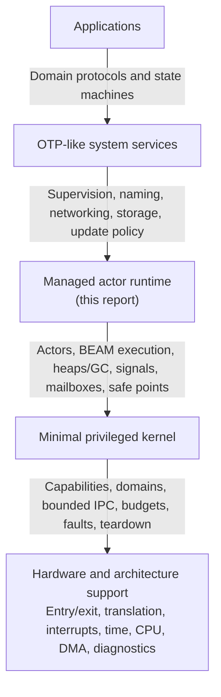

# Managed actor runtime layer: evidence, contract, and implementation plan

## Executive conclusion

The managed actor runtime should be an **unprivileged, BEAM-compatible runtime
domain** between the capability kernel and OTP-like system services. It should
own cheap actors, term representation, process-local tracing garbage
collection, signal and mailbox semantics, reduction-based pre-emption, code
loading, and runtime diagnostics. The kernel should own protection domains,
capabilities, enforceable memory and CPU budgets, bounded cross-domain
transport, device authority, faults, and teardown. OTP-like supervisors and
services should own restart policy, application lifecycle, naming, storage,
network policy, and update orchestration.

The best-supported initial implementation is not “put ERTS in the kernel” and
not “make every actor a kernel thread.” It is a two-level system:

1. the kernel schedules and contains a modest number of runtime and service
   domains using real temporal and memory authority; and
2. each managed runtime multiplexes very many actors over a few charged runtime
   threads using reductions, scheduler-local queues, and process-local heaps.

The compatible baseline should copy ordinary message terms into
receiver-owned storage. Depending on the declared `message_queue_data` mode,
the payload may enter the receiver heap immediately or remain in an off-heap
message fragment until receive or collection. Only explicitly recognized
immutable objects such as large binaries are shared, and automatic
process-local tracing collection is preserved. Research on Pony’s Orca
collector shows that zero-copy transfer of mutable objects can be type-safe
under Pony’s reference-capability assumptions and performant in the reported
microbenchmarks. Ordinary compiled BEAM code supplies no such proof, so Orca
is an extension direction, not evidence for removing copy isolation from the
baseline.

The runtime should preserve the observable BEAM/ERTS contract while refusing
to freeze current ERTS internals into the kernel ABI. In particular:

- signal order is guaranteed for one sender-destination pair, not globally;
- selective receive is preserved, but skipped-message scanning is charged;
- reductions bound an actor activation, but kernel time reconciles actual CPU
  consumption;
- local actor messages are never silently dropped merely to enforce a quota;
- native code is outside actor isolation and is isolated in a separate service
  domain by default;
- links and monitors report observations, not proof of the cause of a remote
  failure;
- distribution uses authenticated, bounded gateways rather than ambient node
  trust as the system’s security foundation; and
- supervisor policy stays above the runtime, while runtime-domain failure is
  contained and restarted from outside that domain.

This is a research architecture, not a compatibility or performance result.
The implementation earns those claims only through a declared BEAM/OTP profile,
conformance tests, adversarial resource tests, deterministic schedule replay,
fault injection, and latency/scalability measurements.

## Question and operational standard

The question is not simply how to execute BEAM instructions. It is:

> What is the smallest unprivileged runtime that can execute a declared
> compiled-BEAM profile with ERTS-compatible actor, memory, signal, failure,
> code, and observability behavior while consuming only the bounded mechanisms
> of the Atom OS kernel?

An implementation is a credible managed actor layer when it satisfies all of
the following:

1. **Compatibility.** Every supported opcode, term, exception, BIF, signal,
   mailbox operation, code transition, and process-GC behavior is declared and
   tested against one pinned reference release. Unsupported behavior fails at
   load or call time in a specified way.
2. **Semantic isolation.** Ordinary actors cannot directly read or mutate one
   another’s heaps. A PID conveys runtime messaging reachability, but no
   kernel, device, memory, or service-resource authority. Shared objects have
   explicit type, ownership, and lifetime rules.
3. **Pre-emption.** Pure BEAM execution reaches bounded safe points. Signal
   handling, mailbox scans, garbage collection, runtime services, and native
   work are included in accounting instead of hiding outside the actor budget.
4. **Resource containment.** Actor consumption is measured locally and charged
   to a kernel-enforced runtime-domain account. Heap, binary, queue, timer,
   table, code, and native resources cannot grow without an observable policy
   decision.
5. **Failure clarity.** Actor exit, runtime corruption, native-service crash,
   driver failure, remote disconnect, and machine restart remain distinguishable
   events. No inner supervisor is claimed to survive the failure boundary in
   which it resides.
6. **Responsiveness.** The runtime publishes percentile and worst-observed
   safe-point, scheduling, mailbox, and collection latency under allocation,
   fan-in, native work, tracing, and interrupt load. Throughput alone is not a
   pass condition.
7. **Reproducibility.** The release, target, kernel interface, runtime settings,
   workload, seed, topology, and complete results are retained. A deterministic
   test mode can replay relevant actor-level orderings.

Calling the layer “best” therefore means best for this architecture and its
compatibility contract, not fastest on one microbenchmark.

## Placement in the operating-system architecture

The [kernel hardware and architecture support
layer](kernel-hardware-and-architecture-support-layer.md) normalizes privileged
machine behavior. The [minimal privileged
kernel](minimal-privileged-kernel-layer.md) turns those mechanisms into typed,
budgeted, capability-addressed objects. The runtime consumes that kernel API as
an ordinary protected domain. It must not reach around the kernel for ambient
host threads, files, clocks, sockets, executable mappings, or devices.

### Trust and failure boundary

One runtime domain is one native protection boundary. Actor heaps are isolated
by runtime invariants, not by page tables. A bug in the loader, collector,
scheduler, JIT, shared table implementation, or in-process NIF can corrupt the
entire runtime domain. The kernel can contain and reconstruct that domain, but
cannot recover individual actor truth from corrupted runtime memory.

Applications needing hostile-code separation, independently enforceable
budgets, or different native authority belong in separate runtime domains. A
gateway copies or encodes terms across their bounded kernel endpoints. This is
more expensive than an intra-runtime send and deliberately marks the point at
which semantic actor isolation becomes hardware isolation.

### Why two schedulers are intentional

Actors are numerous because their context, mailbox, and heap operations stay
in user space. Kernel scheduling contexts are fewer because they carry temporal
authority and a hardware protection boundary. A runtime thread consumes a
kernel budget; the runtime then decides which actor uses that already-admitted
execution time.

[Scheduler activations](../30-sources/anderson-et-al-1992-scheduler-activations.md)
provide historical evidence for separating kernel processor allocation from
user-level fine-grained scheduling. Their expensive upcall path and reentrant
scheduler complexity are warnings against copying that API. Atom OS needs the
division of responsibility, not the historical mechanism verbatim.

## What is inherited, implemented, and deliberately changed

| Concern | Principle to preserve | Current ERTS evidence | Atom OS placement |
| --- | --- | --- | --- |
| Execution | Portable compiled BEAM contract | BEAM modules are loaded and interpreted or lowered by ERTS | Runtime loader, verifier, interpreter, and optional load-time native lowering |
| Concurrency | Very lightweight isolated actors | ERTS processes own execution state, heaps, signals, and mailboxes | Runtime objects multiplexed over kernel-scheduled threads |
| Memory | Automatic process-local tracing collection | Per-process generational copying GC plus shared large-object/runtime areas | Runtime collector; kernel maps and charges pages only |
| Communication | Asynchronous signals with per-sender order | Signals enter receiver queues; messages become selectively receivable | Runtime-local queues; bounded capability transport only across domains |
| Fairness | Short managed activations | Reductions approximate work and trigger pre-emption | Reductions plus actual kernel-time reconciliation and explicit system-work charging |
| Failure | Exit reasons, links, and monitors | Runtime translates process and connection events into signals | Runtime for actor failure; kernel for domain fault evidence; OTP services for restart policy |
| Native work | Separate blocking/long work from normal schedulers | Dirty scheduler classes reduce scheduler blockage | Separate service domains by default; trusted compatibility lane only when required |
| Code change | Prepare, publish, retain old code, retire safely | Current/old module versions and staged runtime publication | Runtime policy over kernel W^X mappings and code-publication completion |
| Distribution | Location-transparent actor protocol and explicit disconnect | Erlang distribution transports signals but trusts admitted nodes broadly | Authenticated, credit-bound gateway; legacy distribution only as an adapter profile |
| Recovery | Hierarchical supervision | OTP supervisors apply restart strategy and intensity | OTP-like services above runtime; outer supervisor restarts runtime domains |

This table separates principle from mechanism. An implementation may replace
an ERTS data structure while preserving the declared behavior. Conversely,
copying an ERTS queue or scheduler does not prove the behavior under Atom OS
budgets and failure boundaries.

## Proposed runtime components

The layer should be decomposed into thirteen components with narrow interfaces.
They can initially share one address space, but their state ownership and
accounting must remain explicit so later separation is possible.

Each component now has a dedicated implementation deep dive in the [managed
actor runtime components](managed-actor-runtime-components/README.md)
directory. The summaries below retain the integrated architecture; the linked
reports add source comparison, object and state-machine detail, alternatives,
failure analysis, staged implementation, and falsifiable experiments.

### [0. Runtime-domain bootstrap and kernel adapter](managed-actor-runtime-components/runtime-domain-bootstrap-and-kernel-adapter.md)

The adapter is the only component that speaks the kernel ABI. It receives the
runtime image, compatibility manifest, memory and scheduling accounts, bounded
event endpoints, clock source, code-publication authority, and gateway
capabilities. It starts runtime threads only against explicit kernel scheduling
contexts.

The adapter batches page acquisition, notifications, timers, and cross-domain
transport. It never converts a PID into a kernel capability or exposes raw
capability selectors as BEAM terms. On shutdown it stops admissions, drains or
cancels operations, freezes runtime threads, releases mappings and endpoints,
and emits a final bounded record. Kernel teardown remains authoritative if the
adapter is corrupt or unresponsive.

### [1. Compatibility manifest, BEAM loader, and verifier](managed-actor-runtime-components/compatibility-manifest-beam-loader-and-verifier.md)

“BEAM compatible” is too vague to test. Every runtime image should carry a
machine-readable profile containing at least:

- reference OTP and ERTS release and supported BEAM container chunks;
- opcode and operand forms;
- term encoding and word-size assumptions;
- supported BIFs, NIF/port surface, and exception behavior;
- signal, alias, link, monitor, timer, and priority-message semantics;
- code-loading and old-code behavior;
- external term and distribution versions;
- supported OTP libraries and conformance suites; and
- implementation-defined limits such as actors, atoms, timers, code, and
  shared binaries.

The loader parses into a private staging arena, checks sizes and integer
overflow, validates control-flow targets, register and stack use, literal
graphs, import/export references, and profile features, then constructs an
immutable module image. Publication is a separate atomic operation. Malformed
input must never become executable or install partial global state.

The initial research reference should be OTP 29.0.6/ERTS 17.0.6, the current
release on 2026-09-02, while implementation claims remain tied to the archive’s
separately pinned OTP 29.0.5 source audit until the newer source is audited.
That is a research baseline, not a promise that all OTP 29 applications work.
The official compatibility policy itself allows compiled artifacts and runtime
features to evolve, so the Atom OS manifest must be more explicit than a file
suffix.

### [2. Actor identity, lifecycle, and process state](managed-actor-runtime-components/actor-identity-lifecycle-and-process-state.md)

An actor record contains a generation-stamped local identity, execution state,
registers and stack roots, heap descriptors, signal ingress, message queue,
links, monitors, aliases, timer references, code references, resource ledger,
and status flags. Reusing a slot must change its generation so delayed signals
cannot address a new actor accidentally.

Spawn is transactional:

1. reserve actor, heap, queue, and scheduler-account capacity;
2. construct the private state and initial call frame;
3. install requested link or monitor relationships with a defined
   linearization point;
4. publish the PID; and
5. enqueue the actor.

Exit first makes the actor non-runnable and closes new ordinary admissions,
then performs bounded signal and resource cleanup in resumable slices. Large
fan-out must not turn one actor exit into an unbounded scheduler pause.

A PID identifies a route and incarnation. It grants no device, memory, kernel,
or remote authority. Actor-visible resource handles are opaque references
checked by a runtime broker; compromise of that broker remains compromise of
the runtime domain.

### [3. Terms, private heaps, shared binaries, and tracing collection](managed-actor-runtime-components/terms-private-heaps-shared-binaries-and-tracing-collection.md)

The compatible baseline should use private actor heaps and automatic tracing
collection. This follows both the platform requirement and the evidence in
[Sagonas and
Wilhelmsson](../30-sources/sagonas-wilhelmsson-2006-efficient-memory-management.md):
local heaps make allocation and most collection independent, reclaim private
state cheaply on exit, and confine pauses, while copying messages consumes
bandwidth and can fragment memory.

The recommended first collector is a simple, auditable generational copying
collector with actor-local young and old spaces. Its root map includes BEAM
registers, stack, process dictionary, accepted on-heap messages, exception
state, and runtime-held actor-local references. The collector runs only with
that actor stopped and charges copy/scan work to the actor or its supervising
account. Full collections must be divisible or separately latency-bounded
before the runtime claims responsiveness for large heaps.

Memory falls into explicit classes:

| Class | Owner and reclamation | Send rule |
| --- | --- | --- |
| Immediate term | Encoded value | Copy value |
| Ordinary boxed/list term | One actor heap | Deep copy into receiver-owned storage |
| Module literal | Immutable code generation | Share read-only reference while generation is pinned |
| Large binary | Charged immutable shared object | Share reference with exact byte/lifetime accounting |
| Off-heap queued message | Receiver queue account | Adopt or copy when made visible to actor heap |
| Native resource | Explicit runtime/service lease | Never rely on GC alone for authority revocation |
| Cross-domain payload | Bounded transport buffer | Validate and reconstruct; never transfer runtime pointers |

Shared binaries need proportional and retained-byte accounting. Charging the
entire binary to every small slice discourages valid sharing; charging only the
creator lets another actor retain unbounded memory. The runtime should record
creator charge, current retained bytes, per-account references, and a domain
hard limit, then publish the exact policy rather than pretending there is one
obvious number.

Atoms, code, tables, allocator metadata, and runtime caches are domain-global
state. The atom table must have a fixed or budget-derived ceiling and parsing
untrusted data must not create atoms implicitly. “Share nothing” is an actor
programming model, not a factual description of all runtime memory.

[Orca](../30-sources/clebsch-et-al-2017-orca.md) is the strongest alternative
evidence reviewed. Its zero-copy and shared-mutable-object results depend on
Pony’s statically enforced reference capabilities. A future Atom OS language
profile could attach verified immutable or unique-transfer certificates to
selected values. Those values must be rejected or copied when the proof is
absent; the ordinary BEAM profile cannot assume it.

### [4. Signal ingress, mailboxes, and selective receive](managed-actor-runtime-components/signal-ingress-mailboxes-and-selective-receive.md)

The logical contract and physical queue layout should be separated. The public
contract preserves asynchronous signals and order from one sender to one
destination. It does not invent a total order among independent senders.

A scalable physical path is:

Striped ingress is allowed because signals from one sender use the same ordered
path. [Winblad’s many-to-one
optimization](../30-sources/winblad-2021-parallel-signal-sending.md) demonstrates
the value: adaptive sender-hashed buffers removed one contended enqueue lock and
produced a very large gain in an extreme small-message microbenchmark. The same
source warns that one receiving actor remains the drain bottleneck and that
larger messages reduce the advantage. Atom OS should therefore measure send
rate, accepted rate, drain rate, backlog, and latency separately.

The message queue remains arrival ordered subject to the pinned profile’s
priority-message rules. Selective receive searches for the first matching
message. [Högberg’s message-passing
account](../30-sources/hogberg-2021-message-passing.md) shows why a general
receive can scan the entire backlog and why correlation references permit a
later search start in important request/reply cases. Every inspected message
must consume scan reductions; scanning cannot be free scheduler work.

Mailbox accounting must distinguish queued payloads from other live actor
data. In on-heap mode, queued payloads may already occupy the receiver’s young
heap and participate in collection; off-heap mode keeps them in message
fragments until they are made visible to the actor. Metrics must avoid double
counting while exposing signal ingress count and bytes, receivable message
count and bytes, skipped-scan work, oldest-message age, and producer fan-in.
Storage mode is a measured policy, not application-visible semantics.

#### Overload containment and explicit backpressure extensions

Standard local send is non-blocking and a live local recipient ordinarily
receives admitted messages. Silently dropping a message at a per-actor quota
would create a new semantic failure mode. A bounded Atom OS deployment needs a
declared overload profile. The leading profile extension to test is:

1. charge a send before publication to receiver queue and preserve atomic
   publication;
2. use soft actor thresholds to emit telemetry and invoke supervisor-defined
   overload policy;
3. at a declared actor hard threshold, terminate or quarantine the overloaded
   receiver with structured evidence rather than silently lose an arbitrary
   message;
4. use a kernel-enforced runtime-domain hard limit as the final containment
   boundary; and
5. require explicit credit-bearing protocols for cross-domain and distributed
   streams where the sender can observe refusal before treating a message as
   accepted.

Hard-threshold termination is an Atom OS resource-profile extension, not an
established OTP-compatible mailbox behavior. A stricter compatibility mode may
need buffering, spill, or distribution-like sender suspension; its boundedness
and observable semantics remain an experiment. Tests must distinguish a
message admitted before the receiver’s exit from one racing with exit. Bounded
service APIs can offer `try_send` or credit semantics, but they must not
masquerade as an unchanged Erlang `!`.

Aliases and unique references should be first-class correlation tools. Once an
alias is deactivated, a later reply sent through that alias can be discarded
before it enters the mailbox; deactivation does not remove messages already
delivered. This connects cancellation semantics to overload control without
inventing mailbox recall.

### [5. Reduction scheduler and kernel scheduling contexts](managed-actor-runtime-components/reduction-scheduler-and-kernel-scheduling-contexts.md)

Each runtime domain should normally have one managed scheduler thread per
admitted execution context, not per discovered hardware thread. Every thread
is bound to a kernel scheduling context with a period, budget, account, and
possibly an affinity hint. The kernel may pre-empt it regardless of runtime
state.

The runtime uses scheduler-local queues and local-first work selection. Idle
schedulers steal or receive migrated actors only when local work is absent or
imbalance crosses a threshold. [Barghi and
Karsten](../30-sources/barghi-karsten-2018-locality-aware-actor-scheduling.md)
show that topology-aware stealing can reduce cross-NUMA steals and improve
selected workloads, but also that affinity-oriented unblocking can introduce
contention and severe tails. Thus topology is an adaptive policy and benchmark
dimension, not part of actor semantics.

An actor activation receives a reduction allowance. The following all consume
that allowance or an explicitly attributed system-work account:

- BEAM instructions and BIF work;
- signal handling and link/monitor maintenance;
- each selective-receive candidate inspected;
- allocation slow paths and garbage-collector scan/copy work;
- timer delivery and exit cleanup;
- tracing and profiling work caused by the actor; and
- loader or shared-table work initiated by the actor.

Reduction values approximate semantic work, not elapsed CPU time. A hash BIF,
cache miss, copying a large term, and a simple arithmetic instruction do not
cost the same. The runtime therefore records both reductions and kernel
execution time per activation, periodically calibrates expensive operations,
and stops consuming CPU when the domain budget is exhausted. Reductions decide
which actor runs next; kernel time decides whether the runtime may run at all.

The initial actor-priority model may reproduce the pinned ERTS levels for
compatibility. Administrative and runtime cleanup work uses a separate capped
reserve so it does not depend on actor-priority selection. Aging actor
priorities would be an explicit non-compatible extension, not a hidden change
to ERTS priority behavior. Current OTP documentation does not promise automatic
resolution of all priority inversions, so Atom OS must not claim a real-time
guarantee from actor priority alone.

Safe-point latency is the key scheduler property. Long BIFs are split,
rescheduled, or placed on a native lane. Allocation, collector, signal, and
loader loops include explicit progress checkpoints. No runtime lock is held
across a kernel wait, code publication wait, or call into untrusted native
code.

### [6. Timers, events, and asynchronous I/O integration](managed-actor-runtime-components/timers-events-and-asynchronous-io-integration.md)

The runtime should not allocate one privileged timer object per actor timer.
It should maintain per-scheduler hierarchical timing wheels with a small
near-deadline heap, then arm a small number of kernel timer channels for the
next relevant deadlines. Kernel delivery is a coalescing wakeup; the runtime
reads raw monotonic time, expires a bounded batch, charges delivery, and rearms.

Timer identity includes a generation so cancel, fire, actor exit, code change,
and runtime restart have a defined race result. Civil time and time-zone policy
stay in services. A monotonic-era discontinuity is surfaced explicitly rather
than converting all timers through an unexamined wall clock.

Blocking I/O belongs to service domains or asynchronous kernel endpoints. A
runtime actor waits on a correlation reference while the runtime gateway turns
completion into a signal. The scheduler thread itself never blocks on a device
operation.

### [7. Code execution, safe points, and version publication](managed-actor-runtime-components/code-execution-safe-points-and-version-publication.md)

The implementation sequence should begin with a reference interpreter. It is
slower, but its explicit dispatch and state make loader, exception, safe-point,
GC-root, and conformance bugs easier to diagnose. Once the profile is stable,
modules can be lowered at load time to a compact internal representation and
then to native code.

BeamAsm history, summarized in [The Road to the
JIT](../30-sources/gustavsson-2020-road-to-the-jit.md), favors simple load-time
translation over a complex tracing optimizer for this workload: preserve the
BEAM stack/register model, remove dispatch overhead, and avoid warm-up and
mode-transition machinery. Atom OS should follow that shape before considering
adaptive optimization.

Native publication uses write-then-seal mappings. The loader writes into
non-executable staging pages, verifies relocation and metadata, asks the kernel
architecture facade to complete data/instruction visibility, maps the final
generation executable and non-writable, and atomically changes the runtime’s
active code index after every scheduler observes a safe epoch.

A module with `-on_load` adds a compatibility gate before that active switch.
Its function runs in a fresh actor with candidate-only access; prior current
code remains callable, and first-load callers suspend in a bounded waiter set.
Only `ok` publishes the candidate. Any other return or exception unloads it and
leaves prior current code intact; rollback cannot undo arbitrary external or
native effects performed during initialization.

The two current/old module versions visible to Erlang code are a runtime
compatibility rule, not the same thing as the kernel’s code-publication epochs
or current ERTS’s internal code-index count. State transformation remains an
OTP/application operation. In the OTP 29 compatibility profile, logical purge
eligibility checks direct executable references such as active frames and
continuations; it does not wait for local fun terms or code literals. A local
fun into purged code fails if later invoked, and literals are copied out during
later runtime work. Atom OS may conservatively delay physical page reclamation
for native resources, trace metadata, epoch readers, or deferred literal-copy
work, but that retention is not exposed as a stronger language-level purge
blocker. Forced purge is an explicit process-termination policy with evidence.

### [8. Native work, ports, and drivers](managed-actor-runtime-components/native-work-ports-and-drivers.md)

Official NIF documentation is direct: a native function executes as an unsafe
extension of the VM; a crash or memory error can crash or corrupt the whole VM,
and even dirty work can delay operations on the calling process. Dirty
schedulers protect normal scheduler availability, not memory safety.
Classification is per NIF name/arity entry, not per module, and
`enif_schedule_nif` can schedule later segments as regular, dirty CPU, or dirty
I/O work. A compatibility manifest therefore constrains every callable entry
and permitted class transition rather than attaching one immutable class to a
library.

The default Atom OS design is therefore:

- hardware drivers live in separately protected, restartable service domains;
- blocking libraries and untrusted codecs run behind bounded endpoints;
- a port-like adapter owns copying, cancellation, and failure translation;
- each service receives only attenuated capabilities and budgets; and
- actor supervisors observe a service incarnation change rather than trusting
  a stale native handle.

An in-process NIF compatibility profile may exist for trusted code that depends
on ordinary NIF semantics. Such a NIF joins the runtime domain’s full authority
and failure boundary. It receives a minimal runtime API, a time budget,
watchdog telemetry, and no raw kernel capabilities, but those controls do not
make memory corruption containable. “Dirty” and “safe” must never be treated as
synonyms.

### [9. Distribution gateway and remote actor semantics](managed-actor-runtime-components/distribution-gateway-and-remote-actor-semantics.md)

The managed runtime should implement actor-level encoding, correlation,
link/monitor translation, and node-incarnation rules. Networking, discovery,
authentication, routing, congestion control, and certificate policy belong to
replaceable services.

The default gateway contract is:

- mutually authenticated service and node incarnations;
- an attenuated capability or session for every permitted remote route;
- bounded send buffers and explicit byte/message credits;
- version-negotiated external-term and signal profiles;
- sequence state sufficient for the promised per-sender order;
- bounded reconnect and retry policy above, not hidden below, application
  semantics; and
- explicit evidence for refusal, disconnect, protocol violation, stale epoch,
  and lost authority.

That evidence belongs to the Atom OS gateway protocol and to explicit
credit-aware request extensions. It does not change the OTP send API:
`Dest ! Msg` and `erlang:send/2` return `Msg`, while `erlang:send/3` returns
only `ok`, `nosuspend`, or `noconnect` and provides no delivery completion.
Likewise, a transport session epoch bounds channel ordering and credit state;
it is not part of the identity of a standard remote PID or reference. Those
terms carry node-creation and identifier fields and can be used after a
same-node-incarnation reconnect, although links and monitors from the failed
connection have already broken and are not silently restored.

Standard Erlang distribution may be provided as a compatibility adapter for a
trusted deployment. It must not define the base security model. The current
model admits nodes into a broad trust domain, and connection loss cannot reveal
whether a remote request was processed before failure. A monitor reports
`noconnection`-like uncertainty; it does not turn an ambiguous operation into
exactly-once execution.

[Scaling Reliably](../30-sources/trinder-et-al-2017-scaling-reliably.md) found
that full-mesh connections, global names, and global recovery metadata created
scaling bottlenecks in its evaluated workloads, while partitioning those
structures improved the selected cases. Atom OS should use explicit topology,
partitioned names, scoped recovery data, and gateway placement aligned with
failure domains.

### [10. Failure translation and the OTP boundary](managed-actor-runtime-components/failure-translation-and-the-otp-boundary.md)

The runtime supplies mechanisms:

- normal and abnormal actor exit;
- links, monitors, aliases, and structured reasons;
- deterministic release of actor-visible runtime resources;
- runtime-domain health and quiescence records; and
- translation of native-service and gateway incarnation changes into actor
  signals.

OTP-like services supply policy:

- which child to restart and in what order;
- restart intensity and escalation;
- dependency and application lifecycle;
- state reconstruction and durable checkpoint use;
- update, rollback, and operator notification; and
- whether overload causes refusal, shedding, quarantine, or subtree restart.

This preserves the central result of [Armstrong’s
thesis](../30-sources/armstrong-2003-making-reliable-distributed-systems.md):
workers should fail when local continuation is less trustworthy than external
reconstruction, and a distinct component should decide the correction. It also
qualifies the model. An actor supervisor cannot survive corruption of its own
runtime, and neither actor memory nor a restart tree is durable state.

The outer kernel/service recovery topology observes the runtime domain. If it
faults or stops making budgeted progress, the kernel freezes and reclaims the
domain, retains bounded crash evidence, and a root service launches a new
runtime incarnation. Remote and local gateways reject stale actor identities
from the old incarnation.

### [11. Resource accounting and overload control](managed-actor-runtime-components/resource-accounting-and-overload-control.md)

Every actor has a ledger, every ledger rolls up to an application/runtime
account, and the kernel enforces the domain total. The runtime ledger includes:

- reductions and measured CPU time;
- private young/old heap bytes and collector reserve;
- queued signal/message count and bytes;
- retained shared-binary bytes;
- links, monitors, aliases, timers, and code-generation references;
- table objects and entries;
- native/gateway requests in flight; and
- tracing, event, and crash-record bytes.

Accounting is not the same as policy. A supervisor or deployment profile
chooses responses from a finite set: warn, throttle admissions, refuse spawn,
revoke a gateway credit, terminate the actor, restart a subtree, quarantine the
runtime, or fail the deployment. The outcome is observable and attributed.
There is no “unlimited” setting beneath the domain hard ceiling.

Some resources cannot be charged perfectly to one actor. Code, atoms, shared
tables, allocator fragmentation, and shared binaries require a declared
domain or proportional policy. Hiding these costs behind per-process heap
statistics would reproduce the misleading claim that actor isolation removes
runtime-global exhaustion.

#### Shared tables are explicit shared state

An ETS-like table is a distinct runtime object with an owner, optional heir,
access mode, generation-stamped handle, and resource account. Terms are copied
into and out of the table at the actor boundary in the compatible baseline.
Owner exit destroys a table with no live local heir. A two-tuple heir inherits
silently; a three-tuple heir carrying `HeirData` also receives the documented
`ETS-TRANSFER` message. Successful `give_away/3` always sends its transfer
message and leaves the configured heir unchanged. Garbage collection of an
actor-local handle is not table deletion.

Every operation publishes the atomicity and isolation that its documented OTP
profile promises. This includes single-key operations and documented
whole-operation guarantees for `delete_all_objects/1`, list `insert/2`, and
list `insert_new/2`. Traversal is not silently advertised as a consistent
snapshot where OTP specifies weaker semantics. Bulk work may prepare, scan,
resize, transfer, and reclaim in bounded slices, but partial mutation from an
atomic operation remains invisible until its one commit point. Hash shards or
contention-adapting ordered structures may be selected from workload
measurements, but the public contract exposes table kind and consistency—not a
particular lock or tree. Table bytes, entries, readers, writers, retained terms,
and deferred reclamation are charged separately from actor heaps.

### [12. Observability, deterministic testing, and crash evidence](managed-actor-runtime-components/observability-deterministic-testing-and-crash-evidence.md)

Observability is a bounded runtime facility, not an unmetered side channel.
Each event carries runtime and actor incarnations, scheduler, logical time,
event type, correlation reference, and charged size. Per-scheduler rings avoid
one global trace lock. Overflow increments a visible loss counter; tracing must
never silently block the scheduler it observes.

A deterministic test mode controls actor selection, timer advancement, and
message/failure delivery at declared choice points. It records a seed and a
compact choice schedule. [QuickCheck and
PULSE](../30-sources/claessen-et-al-2009-quickcheck-pulse.md) show that a
controlled user scheduler, generated commands, shrinking, and trace
visualization can expose races that ordinary repeated tests miss. The result is
not a production scheduler and does not control hardware races, DMA, native
memory corruption, networks, or power loss; those require kernel and service
fault injection as well. Seeded test-schedule reproduction is also distinct
from production record/replay, which would have to log selected receives,
timers, external inputs, time and randomness, native results, and code versions
and needs separate evidence.

Crash evidence is layered. Actor records hold the exit reason and bounded
stack/context. Runtime-domain records hold scheduler progress, queue and memory
summaries, last kernel fault, code manifest, and trace-loss indicators. Native
services retain their own records outside the runtime that may have triggered
them.

## Critical execution paths

### Local message send

1. Resolve the generation-stamped destination without granting authority.
2. Size the message and select copy, literal, or shared-binary handling.
3. Reserve receiver queue and runtime-domain memory charge.
4. Copy ordinary terms into receiver-owned or off-heap message storage.
5. Publish the complete signal atomically into a sender-ordered ingress stripe.
6. Mark the receiver runnable through a bounded scheduler wakeup.
7. Return according to the pinned BEAM send contract.

If the receiver exits before publication, the operation follows the reference
runtime’s dead-destination behavior. If it exits after publication, cleanup
owns the admitted message. No partially copied term becomes visible.

### Actor activation

1. A scheduler dequeues one runnable actor and records activation start time.
2. It drains a bounded amount of urgent signal/system work.
3. It executes BEAM work until a reduction or safe-point condition fires.
4. Allocation, receive scans, and collection deduct attributed work.
5. It publishes actor state before moving the actor to waiting, local runnable,
   migrated, exiting, or suspended state.
6. It reconciles actual thread time with the kernel scheduling-context budget.

Only the owning scheduler executes actor language state. Concurrent senders
touch ingress structures, not the actor heap or stack.

### Process-local collection

1. Stop only the target actor at a safe point.
2. Establish collector reserve before moving any object.
3. Trace exact roots and copy reachable terms into the target generation.
4. Update runtime-held actor-local pointers through controlled descriptors.
5. Reconcile shared binary and native-resource references.
6. Commit the new heap, release old pages, and record work and pause time.

Failure to reserve collection space follows a declared process/runtime memory
policy. It must not leave a half-forwarded heap runnable.

### Cross-domain request

1. Resolve an actor-visible gateway reference to an attenuated runtime-held
   endpoint.
2. Reserve local encoding, kernel transport, and remote credit.
3. Encode validated external terms into a bounded buffer; transfer no pointers
   or raw capabilities.
4. Commit endpoint publication and return a correlation reference.
5. Translate reply, refusal, cancellation, service restart, or timeout into a
   signal whose authority and incarnation are checked.

This path is intentionally different from the local fast path because it
crosses a real protection and resource boundary.

## Comparative actor-runtime lessons

Other actor systems answer different questions and should be mined for
mechanisms rather than treated as drop-in compatibility models.

| System or research line | Useful lesson | Why it is not the baseline |
| --- | --- | --- |
| ERTS | Reductions, local heaps, per-sender signals, selective receive, links/monitors, mature diagnostics | Hosted OS dependencies, broad native/node trust, and runtime-global resources must be redesigned at the Atom OS boundary |
| Pony and Orca | Type/runtime co-design can prove safe zero-copy transfer and concurrent collection | BEAM code lacks Pony’s reference-capability proofs and uses different language semantics |
| CAF locality research | Local-first hierarchical stealing can reduce cross-NUMA steals and help selected workloads; policy must follow workload | CAF actors, C++ memory, and scheduling semantics are not BEAM compatibility contracts |
| OTP/PULSE testing | Scheduler control plus generated histories and shrinking exposes protocol races | User-level control alone does not reproduce kernel, native, network, or power faults |

The synthesis is therefore BEAM-first and selective: preserve the language and
failure semantics applications depend on, borrow measured implementation ideas,
and reject any optimization whose proof assumptions the compatible profile
does not satisfy.

## Implementation program

### Stage 0: executable contract

- Freeze one reference release and write the compatibility manifest schema.
- Specify actor, signal, receive, link, monitor, alias, timer, exit, and code
  state machines.
- Model queue admission, exit cleanup, code publication, and stale incarnation
  races before implementation.
- Build differential test generators that can run against the reference ERTS.

Exit condition: the supported and unsupported surface is machine-readable and
the model produces replayable counterexamples.

### Stage 1: deterministic single-threaded reference runtime

- Implement validated BEAM loading, term representation, actor spawn/exit,
  copying local send, selective receive, exceptions, and a simple interpreter.
- Implement automatic process-local tracing collection from the start; a
  process-exit-only allocator cannot satisfy general BEAM execution.
- Use a deterministic virtual scheduler and clock with seeded choice-schedule
  reproduction.

Exit condition: core semantic tests and long-lived allocation tests pass
without a host VM supplying actor or collector behavior.

### Stage 2: kernel-hosted runtime domain

- Replace host memory, threads, clocks, and wakeups with the minimal kernel
  adapter.
- Add kernel-enforced memory and scheduling accounts and structured domain
  crash evidence.
- Run reset-to-first-actor traces on an emulator and one physical target.

Exit condition: no undeclared host service remains and domain teardown reclaims
all runtime kernel objects.

### Stage 3: multicore scheduling and mailbox scalability

- Add scheduler-local queues, stealing, striped signal ingress, timer shards,
  and parallel independent actor collection.
- Reconcile reductions with measured CPU time and bound every runtime loop.
- Add topology-aware policy only behind a setting and measurement record.

Exit condition: fairness, p99/p99.9 safe-point latency, fan-in, allocation, and
scaling curves meet declared targets without unexplained shared bottlenecks.

### Stage 4: code publication and optimized execution

- Add staged module loading, safe epochs, current/old code behavior, purge, and
  W^X native publication.
- Introduce load-time native lowering after the interpreter remains a reference
  oracle.
- Verify exception, stack-map, GC-root, tracing, and code-change equivalence.

Exit condition: differential conformance holds across interpreter and native
paths, including actors suspended in old code.

### Stage 5: isolated services and native compatibility

- Build port-like endpoints for console, storage, network, crypto, and codecs.
- Inject service crashes, stalls, stale replies, resource exhaustion, and
  restart during actor requests.
- Add a narrow in-process NIF profile only if required workloads cannot use an
  isolated service, and publish its expanded failure boundary.

Exit condition: ordinary native faults are contained outside the runtime; any
accepted in-process exception is explicit and tested as runtime-domain fatal.

### Stage 6: distribution and OTP profile

- Add authenticated, credit-bound gateways with node incarnations and explicit
  partition behavior.
- Port supervisor, application, naming, and release services as ordinary
  domains or actors.
- Test selected OTP applications and a legacy distribution adapter without
  treating adapter trust as base authority.

Exit condition: the published OTP coverage matrix, fault model, and operational
workflow match reproduced evidence.

## Evaluation matrix

[Bencherl](../30-sources/aronis-et-al-2012-scalability-benchmark-suite-erlang-otp.md)
argues correctly that scalability is a response surface, not one peak number.
Every runtime milestone should retain full curves across at least these axes:

| Dimension | Required observations |
| --- | --- |
| Actor scale | creation/exit rate, resident bytes per idle/active actor, cleanup latency |
| Scheduler count | one-scheduler overhead, throughput, efficiency, migrations, idle time, p99/p99.9 activation delay |
| Mailbox fan-in | sender throughput, admitted throughput, receiver drain, queue age/bytes, lock contention |
| Selective receive | matches near head/tail/absent, scan reductions, starvation, cancellation/alias behavior |
| Allocation and GC | allocation rate, copied/live bytes, young/full pause distribution, collector reserve, shared-binary retention |
| Priorities | latency by level, low-priority progress, system cleanup reserve, priority inversion scenarios |
| Native work | normal/dirty/isolated service latency, scheduler blockage, cancel/suspend delay, crash containment |
| Kernel budget | runtime throttling, reduction/time drift, interrupt and privileged work charge, recovery reserve |
| Code change | publication pause, old-code retention, purge races, rollback, malformed module rejection |
| Distribution | loss, delay, duplication, partition, reconnect, stale incarnation, credit exhaustion, ambiguous completion |
| Observability | trace overhead, ring loss, crash-record completeness, replay success |
| Topology | cache/NUMA placement, steal distance, shared allocator/table hot spots, cross-domain copy cost |

Each run records hardware or simulator, CPU topology and firmware, kernel and
runtime commits, compatibility profile, compiler path, scheduler binding,
memory policy, workload seed, warmup, duration, raw data, and confidence
interval or repeated-run distribution. A microbenchmark supports a mechanism
claim only; representative supervised services determine whether it helps the
system.

### Required correctness and fault tests

- differential opcode, BIF, exception, term, and GC-observable behavior;
- per-sender order with independent concurrent senders and priority messages;
- monitor/link/alias ordering across spawn, exit, disconnect, and cancellation;
- mailbox exhaustion with no silent partial message publication;
- GC at every allocation and message-copy boundary using randomized heaps;
- scheduler replay and property-based shrinking of failing histories;
- runtime termination during kernel call, code publication, and cross-domain
  transfer;
- NIF/service crash, infinite loop, malformed reply, and stale completion;
- per-function NIF class and `enif_schedule_nif` class-transition behavior;
- old-code direct-frame suspension and forced purge, plus local-fun invocation
  and deferred literal copying after purge;
- distribution partition before accept, after accept, and before reply;
- same-node-creation transport reconnect with reusable remote PID/reference
  terms but broken, non-restored links and monitors;
- arbitrary structured exit reasons and every documented `normal`, `kill`, and
  `killed` transformation;
- PID-target versus registered-name timer cleanup across creator and
  destination exit;
- silent two-tuple ETS heir transfer, notifying three-tuple heir transfer, and
  `give_away/3` with unchanged heir configuration;
- atom, binary, table, timer, link, trace, and code-generation exhaustion; and
- complete kernel reclamation and stale-incarnation rejection after restart.

## Decisions supported by current evidence

The research supports these provisional decisions:

1. Keep the managed runtime unprivileged and make one runtime domain the native
   failure boundary.
2. Keep actors as runtime objects; do not make them kernel threads or capability
   objects.
3. Require a versioned BEAM/OTP compatibility manifest and differential suite.
4. Preserve automatic process-local tracing GC and ordinary term-copy semantics.
5. Share only explicit immutable/lifetime-accounted objects in the compatible
   baseline.
6. Use reductions for actor selection but kernel time for enforceable CPU
   authority.
7. Preserve per-sender ordering and selective receive while allowing striped,
   adaptive physical queues.
8. Charge mailbox scans, collector work, signal handling, and tracing.
9. Use supervisor-visible overload outcomes; never silently drop a live local
   message to hide a quota failure.
10. Isolate native work and drivers in service domains by default.
11. Use a reference interpreter before load-time native translation.
12. Treat distribution as an authenticated, bounded gateway protocol and
    standard Erlang distribution as an optional trusted adapter.
13. Keep restart strategy, naming, storage, and update policy in OTP-like
    services.
14. Build deterministic scheduling and fault injection into the verification
    surface from the beginning.

## Open decisions and falsifiers

The following remain unresolved and are tracked in [What contract should the
managed actor runtime
provide?](../40-inquiries/what-contract-should-the-managed-actor-runtime-provide.md):

- the exact initial OTP patch release, BIF set, and OTP library profile;
- interpreter-only, BeamAsm-derived, or new load-time lowering strategy after
  the reference stage;
- collector layout and whether full collections can meet the latency target
  without incremental actor-local work;
- exact shared-binary charging and reclamation policy;
- mailbox hard-limit behavior compatible with required local send semantics;
- scheduler-to-kernel feedback needed to prevent budget waste and priority
  inversion without a complex activation upcall mechanism;
- whether topology-aware placement helps representative supervised workloads;
- which NIFs, ports, ETS behavior, tracing facilities, and distribution
  features are required for the first useful OTP profile; and
- how much runtime state, if any, can be reconstructed after domain failure
  without confusing replay with durable exactly-once execution.

The two-level architecture is falsified if kernel-visible actors meet the
required creation, send, scheduling, memory, and latency targets without
material protection cost. The private-heap baseline should be revised if a
BEAM-compatible ownership proof permits zero-copy messaging while retaining
pause and failure goals. Topology-aware scheduling should remain disabled if it
improves throughput but worsens tail latency or recovery. An in-process NIF is
rejected when its compatibility value does not justify accepting a
runtime-domain-wide native failure.

## Connection to the overall architecture

- [BEAM, ERTS, and OTP principles for a new operating
  system](beam-erts-and-otp-principles-for-a-new-operating-system.md) defines
  the five-layer decomposition and the platform-level compiled-BEAM and
  process-local-GC requirements.
- [Minimal privileged kernel layer](minimal-privileged-kernel-layer.md) defines
  the capabilities, domains, scheduling contexts, bounded endpoints, faults,
  and teardown mechanisms consumed here.
- [Kernel hardware and architecture support
  layer](kernel-hardware-and-architecture-support-layer.md) defines the
  privileged mechanisms under that kernel without absorbing actor policy.
- [Managed actor runtime map](../10-maps/managed-actor-runtime.md) provides the
  source trails and open questions for this layer.
- [Managed actor runtime component
  index](managed-actor-runtime-components/README.md) inventories the thirteen
  detailed implementation reports derived from this integrated model.
- [2026-09-02 managed actor runtime deep
  dive](../50-journal/2026-09-02-managed-actor-runtime-deep-dive.md) records the
  research method, versions, search coverage, and limitations.
- [2026-09-03 managed actor runtime components deep
  dive](../50-journal/2026-09-03-managed-actor-runtime-components-deep-dive.md)
  records the expanded source review, shared implementation criteria, and
  explicit absence of prototype evidence.

## Sources

### BEAM, ERTS, and reliability baseline

- [Erlang/OTP 29.0.6 managed-runtime
  documentation](../30-sources/erlang-otp-team-2026-otp-29-0-6-managed-runtime-documentation.md)
- [Erlang/OTP 29.0.5 system
  documentation](../30-sources/erlang-otp-team-2026-otp-29-documentation.md)
- [Erlang/OTP source tree at
  5cf5f9725452](../30-sources/erlang-otp-team-2026-otp-29-source-tree.md)
- [A few notes on message
  passing](../30-sources/hogberg-2021-message-passing.md)
- [The Many-to-One Parallel Signal Sending
  Optimization](../30-sources/winblad-2021-parallel-signal-sending.md)
- [The Road to the JIT](../30-sources/gustavsson-2020-road-to-the-jit.md)
- [Making reliable distributed systems in the presence of software
  errors](../30-sources/armstrong-2003-making-reliable-distributed-systems.md)

### Memory and scheduling research

- [Efficient memory management for concurrent programs that use message
  passing](../30-sources/sagonas-wilhelmsson-2006-efficient-memory-management.md)
- [Orca: GC and Type System Co-Design for Actor
  Languages](../30-sources/clebsch-et-al-2017-orca.md)
- [Work-Stealing, Locality-Aware Actor
  Scheduling](../30-sources/barghi-karsten-2018-locality-aware-actor-scheduling.md)
- [Scheduler activations](../30-sources/anderson-et-al-1992-scheduler-activations.md)
- [Characterizing the scalability of Erlang VM on many-core
  processors](../30-sources/zhang-2011-erlang-vm-many-core-scalability.md)

### Evaluation, testing, and distribution

- [A scalability benchmark suite for
  Erlang/OTP](../30-sources/aronis-et-al-2012-scalability-benchmark-suite-erlang-otp.md)
- [Finding Race Conditions in Erlang with QuickCheck and
  PULSE](../30-sources/claessen-et-al-2009-quickcheck-pulse.md)
- [Scaling Reliably](../30-sources/trinder-et-al-2017-scaling-reliably.md)
