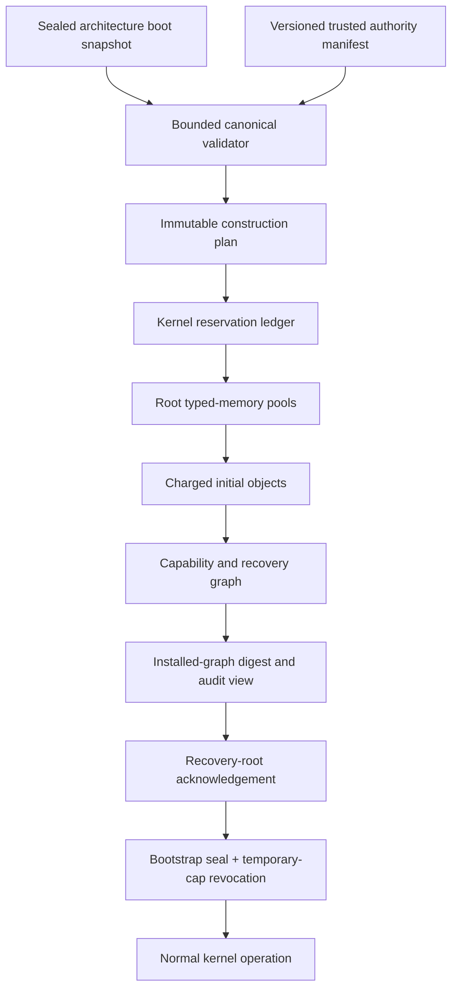
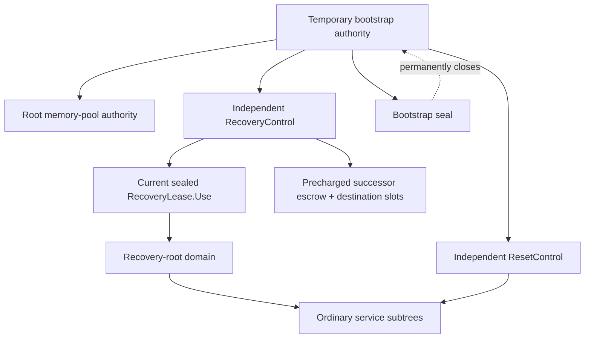
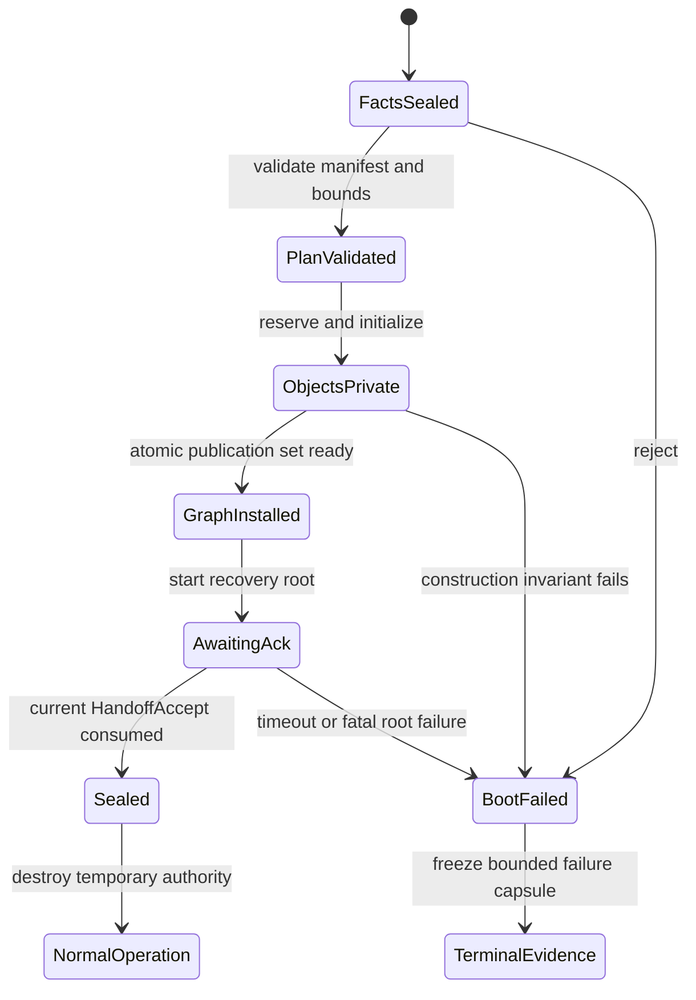

# Bootstrap and root-authority handoff

The bootstrap component should be a deterministic, transactional authority
installer, not a permanently omnipotent kernel path. It consumes the lower
architecture layer's validated immutable facts and one trusted, versioned
manifest; reserves kernel-owned memory; constructs explicitly charged initial
objects; installs a least-authority graph with independent recovery reserves;
obtains a generation-bound acknowledgement from the recovery root; and then
irreversibly seals every temporary bootstrap capability.

This is the recommended implementation for component 0 of the [minimal
privileged kernel layer](../minimal-privileged-kernel-layer.md). capDL and the
verified seL4 initialiser establish that an explicit capability distribution
can be modelled and installed with strong assurance. They do not establish the
correctness of this project's manifest extensions, escrow topology, parser,
binary, firmware inputs, or final handoff protocol.

## Question, scope, and operational standard

The question is:

> How can the kernel create enough initial authority for unprivileged system
> policy and recovery to start, while proving that no hidden bootstrap path or
> circular recovery dependency remains afterward?

This component owns only the transition from validated boot facts to the
normal kernel object model. The architecture-support layer owns loader adapters,
raw memory-map validation, machine discovery, early CPU state, and the sealed
boot snapshot. Unprivileged policy decides services, placement, names, and
restart strategy after handoff.

An implementation is adequate when it can demonstrate all of the following:

1. The same normalized facts, manifest, and kernel build produce the same
   canonical object and authority graph, excluding explicitly recorded entropy.
2. Every physical extent is classified exactly once as kernel-reserved,
   firmware/platform-reserved, device memory, unusable, or delegated through
   one root memory-pool lineage.
3. Every initial object is fully initialized, quota-charged, attached to a
   lifetime group, and given a non-aliased generation before a capability is
   published.
4. The recovery root's CPU budget, memory reserve, fault route, escrow slots,
   and reset control do not descend from a component it may need to replace.
5. The manifest can be normalized, hashed, enumerated from protected state,
   and compared with the installed graph.
6. Failure before commit leaves no user-visible partial graph; failure after
   commit either completes the one-way handoff or enters a bounded terminal
   boot failure, never a second ambiguous root.
7. Once sealed, no normal syscall can enumerate raw hardware identifiers,
   reactivate the bootstrap allocator, or mint root authority.

## Evidence and its limits

| Evidence | Supported conclusion | Limit for this design |
| --- | --- | --- |
| [capDL](../../30-sources/kuz-et-al-2010-capdl.md) | Capability distributions should be explicit data connected to the running system, so isolation and flow claims can target the actual graph | A description can encode unsafe policy; capDL does not supply this manifest's resource, recovery, or hardware extensions |
| [Formally verified system initialisation](../../30-sources/boyton-et-al-2013-verified-system-initialisation.md) | A declarative target, formal initialiser model, and conformance proof can replace ad hoc construction | Its proof does not cover this implementation, binary, boot parser, or handoff acknowledgement |
| [seL4 reference manual](../../30-sources/sel4-foundation-2026-reference-manual.md) | An initial task can receive explicit untyped memory, object capabilities, boot information, and architecture resources | seL4's boot ABI and initial-task authority are precedents, not the proposed least-authority end state |
| [seL4 information-flow enforcement](../../30-sources/murray-et-al-2013-sel4-information-flow.md) | System security reasoning depends on a suitable configured authority graph and declared assumptions | The result excludes several hardware effects and does not validate an Atom OS manifest |
| [Protection principles](../../30-sources/saltzer-schroeder-1975-protection-information.md) | Least privilege, fail-safe defaults, complete mediation, and separation of privilege apply to the root path too | These are design criteria, not an executable bootstrap construction |
| [BootStomp](../../30-sources/redini-et-al-2017-bootstomp.md) | Early privileged parsers are an exploitable attack surface and require tight input bounds | It studies mobile bootloaders, not this normalized handoff or capability graph |

The evidence supports declarative configuration and a small auditable
initialiser. The recovery-escrow graph, sealed one-use leases, two-phase
acknowledgement, and exact rollback boundary below are project proposals.

## Recommended structure



The validator produces a closed construction plan before publishing any
ordinary capability. The plan fixes counts, sizes, alignments, destination
slots, rights, badges, lineage anchors, accounts, lifetime groups, scheduling
admission, fault routes, and hardware-profile references. Construction then
needs no ambient heap and discovers no new input.

## Manifest model

The initial binary format should be simple, length-delimited, versioned, and
converted into one canonical internal form. A human-friendly source language
may compile to it, but the privileged parser should not contain YAML, JSON,
device-tree, signature-policy, or package-resolution machinery.

The canonical model should include:

```text
BootAuthorityManifest {
  format_version,
  compatibility_profile,
  normalized_boot_snapshot_digest,
  kernel_build_and_abi_digest,
  object_declarations[],
  memory_extent_assignments[],
  capability_installations[],
  derivation_and_anchor_edges[],
  resource_accounts_and_quotas[],
  lifetime_groups[],
  scheduling_admission[],
  typed_fault_routes[],
  recovery_and_reset_escrows[],
  immutable_device_and_cancellation_profiles[],
  startup_entries[],
  expected_graph_digest
}
```

Every array has a configured maximum and every cross-reference is an index into
the validated canonical plan, not a pointer or physical address. Duplicate
object identifiers, overlapping extents, cycles where prohibited, missing
destination slots, excess anchor depth, rights amplification, unaccounted
objects, and recovery dependencies inside the protected failure subtree reject
the entire plan.

Cryptographic authenticity is outside the kernel parser. A measured or secure
boot chain supplies a trusted manifest digest and bytes; the kernel verifies
that exact digest and records its provenance. Supporting signatures directly
inside the kernel would enlarge the early TCB with algorithms, key policy, and
format parsing without improving the object-transition semantics.

## Construction transaction

### Phase A: validate and size

The kernel first validates all arithmetic, extents, graph edges, quotas, fixed
capacity bounds, ISA/profile compatibility, and policy invariants. It computes
exact storage requirements for:

- kernel image, stacks, architecture tables, emergency records, and crash
  capsule;
- object headers, capability tables, lineage nodes, anchors, and audit tables;
- per-CPU stop, timeout, fault, and tracing state;
- recovery/reset escrow slots and independent reserves; and
- the immutable construction log and final graph summary.

No object capability exists yet. A validation failure can therefore stop with
a compact error record and no rollback traversal.

### Phase B: reserve and initialize privately

The bootstrap allocator reserves the exact plan from normalized usable memory.
Objects are initialized behind unpublished references in topological order.
For each object the initialiser atomically records its type, generation, payer,
lifetime group, backing extent, initial lifecycle state, and architecture
dependencies. Unused fragments become explicit root pools; they never remain
in a hidden allocator free list.

### Phase C: install authority

Capabilities are installed only into predeclared, precharged slots. Rights are
checked against each object's creation authority and the declared parent
lineage. The initialiser constructs ordinary service capabilities separately
from lifecycle, debug, recovery, reset, and escrow facets. A manifest that gives
one root process an implicit universal `Admin` authority is rejected by the
recommended deployment profile.

### Phase D: publish and acknowledge

Publication is one state transition that makes the initial protection domain,
thread, and scheduling context eligible to run. The recovery root receives:

- its expected graph digest and boot-snapshot digest;
- read-only enumeration of its installed slots and assigned accounts;
- one one-shot `HandoffAccept` facet bound to this boot generation; and
- an independent fatal route that does not rely on the ordinary service graph.

The root compares its protected view with the expected description, verifies
that required successors and reserves are reachable, and consumes
`HandoffAccept`. The kernel then seals the bootstrap state, destroys temporary
installer capabilities, releases only declared unused pool fragments, and
records the seal event in the crash capsule.

Acknowledgement is not a request for the root to validate kernel internals. It
confirms that the user-space side can see the promised starting contract before
the kernel makes it irreversible.

## Authority and recovery topology



The graph must have no recovery cycle: a supervisor cannot depend exclusively
on memory, CPU, endpoint, table slots, fault handling, or reset authority owned
by the domain it must recover. Independent escrow holds only precommitted,
attenuated successor authority; it is not a second ambient root. Advancing a
lease epoch invalidates the previous current-use facet before installing one
successor in a protected pre-reserved slot.

## Bootstrap state machine



There is intentionally no transition from `Sealed` back to installer mode. An
upgrade or replacement is an ordinary capability-mediated operation that
creates a new domain and authority graph; it does not reopen boot authority.

## Failure handling

Before `GraphInstalled`, the initialiser may discard private objects by walking
the already bounded plan in reverse order; none is visible to ordinary code.
After publication, rollback would race with execution and could create two
interpretations of authority. The baseline therefore permits only:

- successful acknowledgement and seal; or
- terminal boot failure with bounded evidence and platform reset.

If the recovery root fails before acknowledgement, the kernel may start one
predeclared fallback root only if the plan modeled that choice as an atomic
exclusive branch with independently reserved resources. It must not search for
an arbitrary executable or grant a diagnostic shell ambient authority.

## Concurrency and multiprocessor bring-up

The simplest correct profile completes the authority transaction on one boot
CPU while secondary CPUs remain in the lower layer's parked state. Secondary
CPUs may join normal scheduling only after the graph is installed, their
per-CPU objects and emergency state are charged, and the bootstrap seal is
published with the required memory-ordering protocol.

Parallel construction is premature: it complicates deterministic allocation,
rollback, and proof while boot latency is unlikely to dominate. If measurements
later justify it, independent plan partitions may initialize privately in
parallel, but capability publication and final digest comparison remain one
ordered commit.

## Recommended implementation path

1. Define a small mathematical graph model and a canonical text test format.
2. Implement an unprivileged manifest compiler and exhaustive static checker.
3. Specify the privileged binary decoder with checked arithmetic and fixed
   limits; fuzz it independently from kernel boot.
4. Build a model initialiser and prove conservation of extents, slots, rights,
   quotas, and unique generations for a bounded configuration.
5. Implement single-CPU private construction and graph enumeration.
6. Add the root acknowledgement and one-way seal, then fault-inject at every
   transition.
7. Add recovery/reset escrow only after its authority graph and epoch protocol
   have a model and negative tests.
8. Connect two architecture backends and verify that the same semantic graph
   results despite different boot loaders and hardware identifiers.

## Verification and experiments

Required executable properties include:

- property-based generation of malformed manifests, integer overflows,
  duplicate references, cycles, and capacity exhaustion;
- a conservation oracle proving each usable byte and capability slot has one
  disposition after every accepted plan;
- graph isomorphism between canonical manifest intent and protected installed
  state, allowing only explicitly declared inert implementation artifacts;
- non-amplification checks on every capability edge;
- model checking of publish, acknowledgement, root failure, timeout, and seal
  races;
- fault injection after every allocation and capability installation before
  publication, proving private rollback;
- negative tests showing sealed bootstrap syscalls and stale handoff facets
  remain unusable; and
- boot of an identical logical manifest on at least x86-64 and AArch64 or
  RISC-V, with backend-specific facts confined to typed manifest resources.

The proof target should state assumptions explicitly: trusted boot-chain
digest, normalized fact correctness, CPU and memory model, excluded DMA during
bootstrap, entropy provenance, and correctness of any generated binary.

## Rejected alternatives

- **Permanent all-powerful init.** Convenient policy becomes an enduring
  single compromise and recovery boundary.
- **Discover resources by raw number.** It bypasses the normalized hardware
  contract and makes authority depend on guessable global identifiers.
- **Lazy hidden object allocation.** It creates an uncharged privileged heap
  and makes boot-resource exhaustion nondeterministic.
- **Construct then inspect informally.** A log is not a declarative postcondition
  and cannot prove absence of hidden capability paths.
- **Rollback after user execution.** It cannot safely undo observed authority,
  IPC, DMA, or external effects.

## Open questions

- Which manifest policy checks belong in the unprivileged compiler, in a small
  privileged validator, or in an offline proof artifact?
- Should the first recovery root be one domain or a statically separated pair
  requiring two authorities for debug and reset?
- What exact configuration size bounds keep validation and graph comparison
  auditable without preventing useful deployments?
- Can the installed-graph relation reuse capDL tooling, or do the new temporal,
  escrow, and hardware-lifetime objects require a smaller new model?

## Connections

- [Typed object storage and explicit memory](typed-object-storage-and-explicit-memory.md)
- [Capability spaces and authority](capability-spaces-and-authority.md)
- [Failure boundaries and recovery topology](failure-boundaries-and-recovery-topology.md)
- [Normalized boot handoff and feature discovery](../kernel-hardware-and-architecture-components/normalized-boot-handoff-and-feature-discovery.md)
- [Minimal privileged-kernel contract inquiry](../../40-inquiries/what-contract-should-the-minimal-privileged-kernel-provide.md)

## Sources

- [capDL](../../30-sources/kuz-et-al-2010-capdl.md)
- [Formally verified system initialisation](../../30-sources/boyton-et-al-2013-verified-system-initialisation.md)
- [seL4 reference manual](../../30-sources/sel4-foundation-2026-reference-manual.md)
- [seL4 information-flow enforcement](../../30-sources/murray-et-al-2013-sel4-information-flow.md)
- [Protection of information](../../30-sources/saltzer-schroeder-1975-protection-information.md)
- [BootStomp](../../30-sources/redini-et-al-2017-bootstomp.md)
