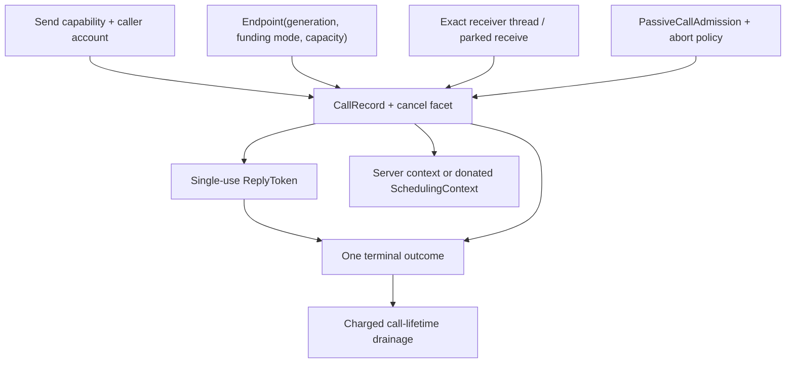
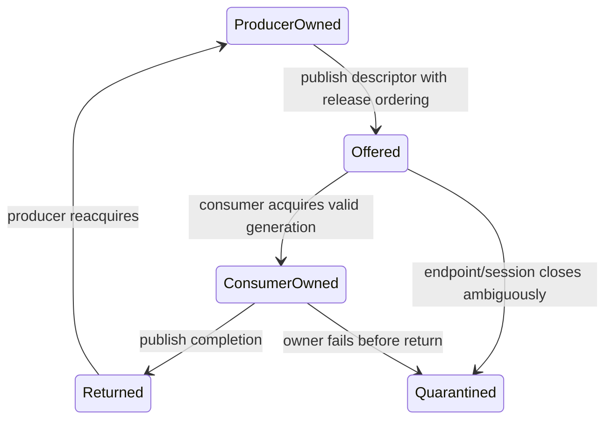

# Bounded invocation and transport

The kernel should provide one small synchronous protected-call primitive for
control, one coalescing notification primitive for readiness, and capability-
authorized shared-memory ownership rings for bulk data. Every call has a
caller-charged `CallRecord`, exact acceptance point, immutable funding mode,
single-use receiver-bound `ReplyToken`, finite cancellation authority, and one
terminal outcome. Cancellation, timeout, endpoint close, caller/callee death,
and reply compete through that record; donated CPU context and every pin return
exactly once before the record is reclaimed.

This is the recommended implementation for component 4 of the [minimal
privileged kernel layer](../minimal-privileged-kernel-layer.md). L4/seL4 and
EROS demonstrate efficient capability-mediated invocation; Shapiro identifies
its availability hazards; CleanQ supplies a formal ownership-transfer pattern
for shared queues. None proves the complete call, cancellation, donation, and
reclamation state machine proposed here.

## Question, scope, and operational standard

The question is:

> What is the smallest communication contract that supports protected service
> calls and high-throughput data without hidden queues, unbounded peer-controlled
> resource retention, or invented exactly-once semantics?

The kernel owns rendezvous, admission, protected state transitions, bounded
payload transfer, optional one-capability transfer, scheduling-context binding,
and terminal outcome evidence. User-space protocols own serialization,
mailboxes, actor signals, request IDs, retries, duplicate suppression, queue
selection, and reconciliation of external effects.

The implementation is adequate only if:

1. Every pending or accepted call consumes precharged finite state; no peer can
   create an unbounded kernel queue.
2. Acceptance is one linearization point that binds the exact endpoint and
   receiver generations, reply token, funding mode, capability destination,
   and call-lifetime pins atomically.
3. Before acceptance, cancellation or close returns `NotAccepted`; after
   acceptance, a lost reply is distinguishable from rejection and never
   reported as “no effect.”
4. Reply and each terminal failure select one outcome exactly once. The reply
   token is invalidated before resource drainage.
5. Caller-funded passive service requires server-consented finite admission and
   a positive donated handler budget; ordinary `Send` cannot authorize
   consumption or termination of arbitrary handlers.
6. Caller-funded cancellation closes dispatch and returns donated scheduling
   state exactly once; a server-funded handler may continue only on its own
   context, without live reply or call-scoped authority.
7. Notifications state their coalescing semantics, and shared rings state exact
   buffer ownership; neither is misrepresented as a lossless message queue.
8. Endpoint and domain closure reject later admissions in bounded work while
   existing calls drain in charged slices.

## Evidence and limits

| Evidence | Supported conclusion | Limit for this design |
| --- | --- | --- |
| [On micro-kernel construction](../../30-sources/liedtke-1995-microkernel-construction.md) | A carefully engineered small protected IPC path can be practical and functionally minimal | Historical fast-path results do not establish this SMP lifecycle or current hardware costs |
| [EROS](../../30-sources/shapiro-et-al-1999-eros.md) | Entry capabilities can combine service designation and authority with competitive invocation | EROS's persistence and privileged structure are not adopted |
| [seL4 reference manual](../../30-sources/sel4-foundation-2026-reference-manual.md) | Endpoints, explicit MCS reply objects, one-shot reply authority, capability transfer, and coalescing notifications are concrete mechanisms | A donated context may never return; the manual does not supply this stronger cancellation guarantee |
| [Synchronous IPC vulnerabilities](../../30-sources/shapiro-2003-synchronous-ipc-vulnerabilities.md) | Blocking, variable transfer, paging, dependency chains, and peer-held reply resources create availability and denial-of-service risks | The analysis predates this object model and is not an implementation proof |
| [CleanQ](../../30-sources/haecki-et-al-2019-cleanq.md) | Bulk queues can make finite buffer ownership and transfer states explicit across backends | It does not solve authentication, admission, reset, or malicious device behaviour |
| [Implementing RPC](../../30-sources/birrell-nelson-1984-remote-procedure-calls.md) | Incarnation IDs, duplicate suppression, and explicit request outcomes are needed; failure after acceptance remains ambiguous | Network RPC mechanisms are not local kernel rendezvous semantics |
| [The Multikernel](../../30-sources/baumann-et-al-2009-multikernel.md) | Explicit cross-core messages and batching can scale selected operations | Replicated state and message consistency add costs; messaging is not universally superior |

## Primitive set

The baseline exposes exactly three transport forms:

1. **Endpoint call/receive/reply** — a fixed-size register payload, optional
   one-capability transfer, explicit deadline/cancel facet, and no kernel-held
   arbitrary byte buffer.
2. **Notification** — a bounded sticky bitset or doorbell used to signal that
   state should be inspected. Multiple signals may coalesce by contract.
3. **Shared ownership ring** — a finite user-space descriptor ring over frames
   and buffers whose mapping and DMA lifetimes are independently authorized;
   the kernel protects setup, ownership epochs, wakeups, and teardown, not each
   ordinary data element.

Actor mailboxes stay in the managed runtime. Filesystem, network, storage, and
driver protocols stay in their user-space services.

## Object model

### `Endpoint`

An endpoint fixes, for its generation:

- caller-funded passive or server-funded active mode;
- maximum pending sender slots and registered receiver slots;
- register payload size and permitted capability-transfer shape;
- endpoint close anchor and management authority;
- allowed scheduling affinity/profile; and
- overflow/rejection status counters.

Changing funding or payload semantics requires close, complete drainage, and a
new endpoint generation. Old pending calls cannot be paired with a receiver
configured under new assumptions.

### `CallRecord`

The caller funds the record before it can enter the endpoint. It holds call ID
and generation, endpoint/session anchors, caller and accepted receiver
generations, input payload snapshot, destination-slot reservation, deadline,
current state, selected terminal outcome, optional scheduling donation, and all
pins needed for drainage.

The record is the authority-neutral race arbiter. A user-space request ID can
help a service suppress duplicate effects, but it cannot substitute for the
protected record while the local call is live.

### `ReplyToken`

Acceptance creates or activates one reply token bound to the exact accepted
receiver thread, endpoint generation, call record, and optional donated
context. It is single-use and non-transferable in the baseline. `reply` first
atomically selects the outcome and invalidates the token, then copies bounded
output and drains resources. A stale token cannot target another caller or
replacement receiver.

### Passive admission and abort policy

A caller-funded server is passive while parked: it holds no scheduling context
and becomes eligible only when an accepted caller donates one. This creates
strong failure coupling. The server must therefore mint finite
`PassiveCallAdmission` objects under endpoint `Manage` authority. All copies
share a protected use counter and reserved cleanup credit.

Each admission references an immutable `PassiveAbortPolicy`:

- **domain-fatal baseline:** accepted-call failure closes the exact callee
  domain under a preauthorized current recovery scope; or
- **thread-local profile:** allowed only for a trusted manifest-declared worker
  whose abandoned user state is reconstructible and isolated.

Callers never receive general `Terminate` authority. They receive only the
conditional ability to consume one server-consented handler and trigger its
predeclared consequence after a kernel-proven accepted failure.

## Outcome model

Externally visible terminal outcomes should be small and semantic:

| Outcome | Guaranteed statement | Not guaranteed |
| --- | --- | --- |
| `MechanismRejected(reason)` | Capability, quota, lifecycle, mapping, or other mechanism validation failed before the call entered endpoint admission | Caller-side work outside the kernel may have occurred |
| `NotAccepted(reason)` | A pending call entered endpoint state, but cancel, timeout, close, or peer lifecycle won before a receiver accepted; no call-borrowed capability or handler effect began | Caller-side work outside the kernel may have occurred |
| `ReplyReceived(payload)` | The exact accepted receiver selected reply and the bounded reply payload was captured | An external effect is durable unless the service protocol says so |
| `AcceptedNoReply(reason)` | A receiver accepted; no reply was selected before terminal failure | Whether user/device/external effects occurred |

`NotAccepted` carries a specific reason such as cancellation, timeout, endpoint
close, caller death, or callee closure. Those tags preserve diagnostics without
creating different acceptance semantics. `MechanismRejected` is separate
because the operation did not enter the endpoint's pending-call transition.

`AcceptedNoReply` is deliberately indeterminate. User-space protocols use
idempotency keys, transaction logs, query-after-timeout, or compensation. The
kernel cannot turn an accepted flash write, packet transmission, or remote RPC
into exactly-once behavior.

## Call state machine

```mermaid
stateDiagram-v2
  [*] --> Allocated
  Allocated --> Pending: enqueue in charged sender slot
  Pending --> Rejected: cancel/timeout/close wins before acceptance
  Pending --> Accepted: receiver + token + funding + transfer commit atomically
  Accepted --> ReplySelected: valid receiver token replies first
  Accepted --> FailureSelected: cancel/timeout/caller death/callee death/close wins
  ReplySelected --> ReplyDraining: token invalid, payload captured
  FailureSelected --> AbortPending: caller-funded; dispatch closed, checkpoint requested
  FailureSelected --> ServerFailureDraining: server-funded; reply and call anchors closed
  AbortPending --> FailureDraining: handler stopped or domain terminal path owns stop
  ServerFailureDraining --> CompletedNoReply: call descendants drained; handler detached
  ReplyDraining --> CompletedReply: donation and descendants returned once
  FailureDraining --> CompletedNoReply: donation and descendants returned once
  Rejected --> Drained: pending records and reservations released
  CompletedReply --> Drained
  CompletedNoReply --> Drained
  Drained --> [*]
```

The terminal outcome is selected before potentially long drainage. Inspection
can therefore report a stable semantic result plus cleanup progress. Resource
reclamation waits for drainage.

## Acceptance transaction

Acceptance is allowed only when all of these can commit together:

- endpoint and both domain/session gates remain open;
- pending call and receiver generations are current;
- receiver state is eligible for this funding mode;
- the destination capability slot and quota remain reserved;
- all borrowed-object and anchor paths fit the configured bound;
- a caller-funded admission has an unused shared counter and cleanup credit;
- a compatible scheduling context can bind exclusively; and
- the donated or server context has positive handler budget for later dispatch.

The atomic commit sets the `CallRecord` to accepted, binds the receiver and
reply token, installs capability transfer/borrow state, consumes admission, and
publishes `READY`. Dispatch is a separate scheduler decision. Acceptance cannot
make a zero-budget handler run.

## Funding modes

### Server-funded active receive

The receiver blocks with its own bound scheduling context. Acceptance wakes it
without donation. Failure does not need to recover caller time from the server,
but the server must reserve CPU for bursts and idle wait. This is the simpler
baseline for stateful or shared ERTS services.

### Caller-funded passive receive

The receiver is parked with no context. Acceptance transfers the caller's
exclusive donation binding for the handler. Nested calls may continue donation
only to a fixed maximum depth. Each link records its predecessor and return
state. A competing reply/failure terminal event owns the one return operation;
no path may duplicate, lose, or leave the context bound.

This mode improves causal accounting but amplifies failure coupling. It should
be enabled selectively after the domain-fatal baseline is verified and
measured.

## Cancellation and closure

Cancellation is a race, not a signal with eventual best effort:

- pre-accept cancel removes the pending record and returns
  `NotAccepted(cancelled)`;
- post-accept cancel selects `AcceptedNoReply(cancelled)` only if reply or a
  previous terminal event has not won;
- reply and call anchors close before drainage, so later reply or use of
  call-scoped authority fails by state or generation;
- for caller-funded service, the accepted handler's dispatch gate closes, a
  running handler reaches its declared thread/domain checkpoint, and the
  donated scheduling state returns after handler and descendant drainage,
  exactly once;
- for server-funded service, failure does not terminate a handler merely
  because the call ended: it may continue on its own scheduling context while
  call-scoped descendants drain, but a later reply is rejected and it has no
  surviving call-borrowed authority; and
- the caller may stop waiting after outcome selection, but the charged record
  survives until cleanup completes.

Endpoint close performs constant-work logical closure, rejects new callers and
receivers, selects pre-accept rejection for pending calls, and applies the
declared post-accept failure outcome to accepted calls. Incremental cursors
unlink queues without holding a global lock for unbounded work.

## Notifications

A notification is a protected sticky bitset or doorbell. `signal(bits)` ORs
allowed bits and wakes at most the declared waiter set. `wait` returns and
clears an atomically observed subset according to the object contract. Repeated
signals may coalesce; the sender cannot claim exact occurrence counts.

Use notifications for queue readiness, interrupt notice, timer events, and
management wakeups whose authoritative state lives elsewhere. If exact counts
matter, put a bounded sequence or counter in protected/shared state and expose
saturation explicitly.

## Shared-memory transport

Bulk data uses finite rings over separately authorized shared frames. Each
buffer has exactly one ownership state:

The queue contract fixes ring size, descriptor shape, buffer identities and
generations, producer/consumer roles, ordering operations, overflow behavior,
and reset/reconciliation procedure. The kernel may protect setup and a compact
ownership epoch; ordinary descriptor movement should remain user-space or
device data-plane work. A doorbell says “inspect the ring,” not “one message
arrived.”

Buffers remain mapped and pinned until queue/session teardown proves ownership
and any DMA completion. CleanQ's abstract ownership transfer informs the ring,
but authentication, malicious peers, device reset, and lifecycle closure need
the separate kernel and protected-I/O protocols.

## Cross-core implementation

Keep the semantic call model independent of placement. A same-core fast path
may hand off directly under one scheduler lock. A cross-core path can enqueue a
bounded explicit request to the receiver CPU and use epoch-tagged completion.
Both must share the same protected `CallRecord` and outcome transitions.

Batching is permitted only below the ABI. It cannot merge terminal outcomes,
reorder calls whose endpoint contract promises order, or hide queue saturation.
Cross-core notification coalescing is acceptable because coalescing is already
the public semantic.

## Implementation path

1. Specify the outcome algebra and linearization table independently of any
   optimized data structure.
2. Implement server-funded fixed-register calls and receiver-bound one-shot
   replies under a coarse lock.
3. Add bounded pending slots, deadlines, cancellation, endpoint close, and
   domain teardown; model every race.
4. Add notifications with explicit sticky semantics.
5. Add one-capability transactional transfer and call-lifetime borrows.
6. Add shared rings through a user-space library and kernel setup/epoch objects.
7. Add caller-funded passive admission and donation only after exact return and
   abort policies pass fault injection.
8. Optimize same-core and cross-core paths against one conformance suite.

## Verification and experiments

- Exhaustively explore accept/reply/cancel/timeout/close/caller-death/callee-
  death races; exactly one terminal outcome and one donation return must result.
- Verify queue capacity, record count, kernel stack, lock hold, and close-prefix
  bounds at profile maxima.
- Inject faults before and after every acceptance substep; no partial capability
  transfer, receiver binding, or admission debit may escape.
- Benchmark register payload sizes and the crossover to shared rings using
  representative ERTS control, driver, filesystem, and network traffic.
- Stress nested donation at maximum depth, exhausted budget, cross-core
  placement, receiver suspension, and domain termination.
- Property-test ring ownership and generation state against delayed, duplicate,
  malicious, and reordered descriptors.
- Confirm service tests distinguish `NotAccepted`, `Replied`, and
  `AcceptedNoReply` and reconcile the latter without exactly-once assumptions.

## Rejected alternatives

- **Unbounded kernel mailbox:** moves actor/message policy and memory exhaustion
  into privilege.
- **Raw `(address, length)` call payload:** cancellation and concurrent remap or
  mutation make lifetime and snapshot semantics ambiguous.
- **Implicit stack reply capability:** cannot be revoked or drained precisely
  under server failure and SMP.
- **Donation on ordinary `Send`:** lets any caller consume and potentially abort
  passive server handlers without server consent.
- **Notification equals count:** coalescing hardware and kernel semantics make
  the claim false.
- **Exactly-once local call:** cannot speak for external effects after acceptance.

## Open questions

- What register payload and pending-slot limits minimize the common path without
  encouraging abuse of synchronous calls for bulk data?
- Which managed-runtime services are safe and beneficial as caller-funded
  passive servers rather than independently funded active servers?
- Can thread-local abort ever be safe for an ERTS worker, or should the first
  profile always use domain-fatal accepted-call failure?
- Which ordering and fairness guarantees should endpoints expose without
  forcing one global queue implementation?

## Connections

- [Capability spaces and authority](capability-spaces-and-authority.md)
- [Protection domains, threads, and address spaces](protection-domains-threads-and-address-spaces.md)
- [Scheduling contexts and temporal authority](scheduling-contexts-and-temporal-authority.md)
- [Teardown, revocation, and safe reclamation](teardown-revocation-and-safe-reclamation.md)
- [Managed-runtime signal ingress](../managed-actor-runtime-components/signal-ingress-mailboxes-and-selective-receive.md)
- [Minimal privileged-kernel contract inquiry](../../40-inquiries/what-contract-should-the-minimal-privileged-kernel-provide.md)

## Sources

- [On micro-kernel construction](../../30-sources/liedtke-1995-microkernel-construction.md)
- [EROS](../../30-sources/shapiro-et-al-1999-eros.md)
- [seL4 reference manual](../../30-sources/sel4-foundation-2026-reference-manual.md)
- [Synchronous IPC vulnerabilities](../../30-sources/shapiro-2003-synchronous-ipc-vulnerabilities.md)
- [CleanQ](../../30-sources/haecki-et-al-2019-cleanq.md)
- [Implementing RPC](../../30-sources/birrell-nelson-1984-remote-procedure-calls.md)
- [The Multikernel](../../30-sources/baumann-et-al-2009-multikernel.md)
