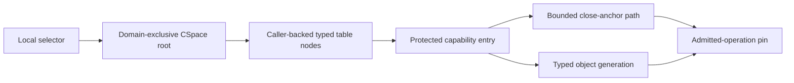
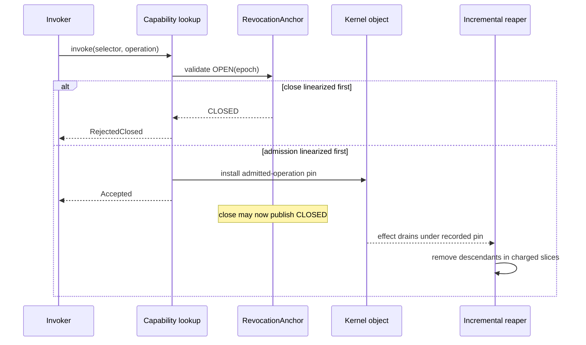

# Capability spaces and authority

The kernel should use protected typed capability tables addressed only by local
generational selectors. Copy and mint may attenuate but never amplify;
transfers require sender authority plus a receiver-designated charged slot;
every effect-producing operation inherits the bounded revocation dependencies
of the authority that enabled it. Selective revocation should combine a
constant-work close of an explicitly pre-funded anchor with incremental,
charged physical descendant removal. Closing authority prevents later
admission; it cannot undo already admitted or external effects.

This is the recommended implementation for component 2 of the [minimal
privileged kernel layer](../minimal-privileged-kernel-layer.md). Capability
systems, seL4, EROS, and Capsicum support explicit designation, attenuation,
delegation, and derivation-based revocation. The fixed-depth anchor path,
product-lineage inheritance, sealed recovery facets, and durable-detachment
rule are Atom OS proposals requiring models and measurements.

## Question, scope, and operational standard

The question is:

> How should possession, delegation, attenuation, transfer, logical closure,
> and eventual revocation of kernel authority remain precise under concurrent
> calls, object creation, domain failure, and storage reuse?

The capability component decides whether a caller may attempt an operation. It
does not establish conceptual ownership, resource payment, liveness, service
identity, success of a protocol, or completion of a hardware effect.

An implementation is adequate when:

1. No user-controlled integer or pointer becomes authority without resolving a
   current protected table entry.
2. Object type, requested operation, rights, facet constraints, object state,
   slot/object generations, and every inherited close anchor are checked on one
   complete-mediation path, including optimized fast paths.
3. Derivation and transfer cannot publish a descendant after a competing
   anchor or object close has linearized.
4. Every child right is a subset of its parent or the result of an explicit
   type-specific creation operation; there is no universal `Admin` bit.
5. Closing a declared anchor is constant-work and immediately denies later
   admission through it; descendant enumeration and removal are bounded,
   resumable, and charged.
6. Already admitted effects stay represented and pinned until their ordinary
   completion or quarantine; revocation never claims rollback.
7. Slots, lineage nodes, anchors, products, and object generations cannot alias
   after deletion, reuse, or counter wrap.
8. Authority usable for recovery, reset, debug, observation, and ordinary
   service is separately attenuable.

## Evidence and limits

| Evidence | Supported conclusion | Limit for this design |
| --- | --- | --- |
| [EROS](../../30-sources/shapiro-et-al-1999-eros.md) | Protected object capabilities can combine designation and authority and support fast invocation | EROS's persistence and privileged structure are not this lifecycle or TCB |
| [seL4 reference manual](../../30-sources/sel4-foundation-2026-reference-manual.md) | Typed capabilities, CSpaces, mint/copy/move/delete, derivation, revoke, badges, and rights checks are concrete implementable mechanisms | seL4 revoke traverses derivation state; it does not prove this constant-work anchor close |
| [Capability myths demolished](../../30-sources/miller-et-al-2003-capability-myths.md) | Object capabilities can support confinement and revocation, usually through designed indirection and protocol | The analysis does not prescribe one concurrent kernel representation |
| [Capsicum](../../30-sources/watson-et-al-2010-capsicum.md) | Fine-grained descriptor rights and an irreversible capability mode can compartmentalize real applications | It retains Unix compatibility surfaces and is not a pure object-capability kernel |
| [seL4 information-flow enforcement](../../30-sources/murray-et-al-2013-sel4-information-flow.md) | Configured capability authority can connect to machine-checked integrity and information-flow reasoning | The theorem depends on its formal policy and excludes several hardware/timing effects |
| [Protection principles](../../30-sources/saltzer-schroeder-1975-protection-information.md) | Complete mediation, least privilege, fail-safe defaults, and economy of mechanism constrain the authority design | Principles do not prove a representation, bound, or concurrent algorithm |

## Protected representation

A selector has meaning only in the caller's current capability-space root:

```text
selector = (slot_index, slot_generation)

CapabilityEntry {
  object_reference,
  object_generation,
  object_type,
  rights,
  facet_or_badge,
  lineage_reference_and_generation,
  bounded_anchor_path[(anchor_reference, generation, observed_epoch)],
  local_entry_state
}
```

Selectors can be copied as ordinary data without transferring authority; only
the protected entry makes them usable. The lookup path:

1. resolves the caller's immutable capability-space root;
2. checks table-node and slot generations;
3. loads and pins the object generation;
4. validates expected type and operation-specific rights;
5. validates every anchor and applicable domain/session gate;
6. validates object and facet lifecycle state; and
7. atomically installs an admitted-operation pin before releasing lookup locks.

If a close transition wins before step 7, lookup fails with a typed closed or
stale result. If admission wins first, the operation may complete under its
recorded authority, but closure prevents any later acquisition or extension.

## Capability-space structure

The first profile should use a shallow fixed-radix table with caller-created
nodes. A selector encodes indices, not kernel pointers. Fixed depth gives a
deterministic lookup bound and makes table memory explicit; sparse nodes avoid
allocating a flat maximum table.



Slot authority is distinct from object authority. A receiver must authorize a
destination slot and have quota for its entry and lineage metadata. Holding a
send capability does not authorize the sender to choose arbitrary positions in
the receiver's table.

## Rights and facets

Each object defines a closed operation vocabulary. Representative separations
include:

| Object | Ordinary facets | Separately privileged facets |
| --- | --- | --- |
| Endpoint | `Send`, `Receive` | `Grant`, `Manage`, `Close` |
| Frame | `MapRead`, `MapWrite`, `MapExecute` | `Dma`, `Reclaim` |
| Thread | scoped self-management | recovery suspend/resume/terminate/reap |
| ProtectionDomain | `Inspect` | `Suspend`, `Resume`, `Terminate`, `Reap` |
| IRQ binding | acknowledge/current-completion | bind, route, recover, destroy |
| Fault route | receive or observe | resolve, resume, terminate-thread, escalate |
| Debug target | bounded public counters | registers, memory, extended crash data |

`mint` can reduce rights and add an object-defined badge or facet constraint.
It cannot remove an inherited close anchor, increase an epoch, widen an address
range, or synthesize a lifecycle operation. `copy` preserves constraints while
possibly reducing rights. `move` changes the containing slot atomically but
preserves lineage. `delete` removes one reference only.

Badges identify the authority facet used for a call, not an immutable caller
identity. Since a badge-bearing capability may be delegated, treating its badge
as proof that one process called is a confused-deputy error.

## Derivation lineage

Lineage is stored in caller-funded stable nodes, never as a pointer to a
reusable capability slot. Copy or mint creates a child node; move retains the
node; delete drops one slot reference. A tombstone remains while any child,
revocation cursor, anchor reference, or admitted operation can name the node.

This permits physical descendant enumeration, audit, and cleanup. It is not
the fast logical-close mechanism: an adversary can create many descendants, so
tree traversal must be preemptible and charged. Maximum depth, maximum children
per node or allocated fan-out quota, and cursor storage are fixed by profile.

## Revocation anchors

A `RevocationAnchor` is an explicit caller-backed object created before
authority is distributed. Its protected state is:

```text
OPEN(epoch) | CLOSED(close_epoch)
```

Capabilities minted beneath it retain a protected reference to the anchor.
Paths may append child anchors only up to a fixed maximum; repeated anchors are
deduplicated. Closing the anchor is a one-way constant-work state change.
Every later lookup or derivation checks the stored generation and epoch, so it
fails without first walking all descendants.



Anchor storage cannot be freed on close. Descendant entries and admitted
operations retain accounted references until their cursors and effects drain.
This is what prevents an anchor pointer from aliasing a replacement object.

Not every capability needs an anchor. Fine-grained anchors cost storage and
checks; permanent or object-lifetime authority can rely on object closure and
generation. The creator chooses an anchor when later selective logical closure
is a real requirement.

## Capability operations

The ABI should expose distinct operations:

- `copy`: install an equal-or-narrower reference;
- `mint`: install an attenuated object-defined facet or badge;
- `move`: atomically remove the source slot and install the same lineage in a
  receiver-approved destination;
- `delete`: remove one local entry;
- `close_anchor`: immediately deny later admission beneath a preinstalled
  anchor;
- `revoke_descendants`: advance a stable charged cursor through lineage nodes;
- `close_facet`: close one relationship without destroying a shared object;
- `close_object`: publish the object's terminal admission state;
- `mint_epoch_session`: derive a non-lifecycle session beneath a current sealed
  recovery/reset lease and compatible service authority; and
- `destroy`: finalize a closed object only after type-specific drainage.

These names should not be aliases. In particular, `delete`, `revoke`, `close`,
and `destroy` have different security and lifetime meanings.

## Transfer protocol

The baseline transfers at most one capability with a synchronous invocation:

1. Sender presents a current capability with `Grant` or type-specific transfer
   authority.
2. Receiver has pre-registered an empty destination slot and quota reservation.
3. Kernel validates source lineage, rights attenuation, both domain gates,
   destination generation, and account capacity.
4. Call acceptance and capability installation commit atomically; if either
   cannot commit, neither does.
5. A move additionally removes the sender entry in the same transition; a copy
   preserves it.

The call transport does not become a lifetime dependency for a durable copied
capability merely because it carried the bytes. The source capability's
lineage is preserved. By contrast, authority borrowed only for the call gains
the call-lifetime anchor and cannot be converted to a durable product without
separately held authority.

Batch transfer should wait until a transactional design can prove all-or-none
slot and quota effects. An array partially installed under exhaustion would
create an authority graph neither endpoint requested.

## Product-lineage inheritance

Invoking a capability can create a new long-lived effect: a `Mapping`, DMA
binding, IRQ route, session, transferred capability, or published code image.
If the product did not inherit the authority dependency that permitted its
creation, temporary access could be laundered into permanent effect.

Each syscall schema therefore classifies inputs as:

- **effect-bearing lifetime authority** — inherited by the product;
- **consumed or admission-only guard** — checked/consumed but omitted only when
  independent lifetime authority exists; or
- **resource/placement input** — contributes charge or location, not access.

By default a product inherits the bounded, deduplicated union of every
effect-bearing input's anchor vector and relevant domain/session gates. Creation
rejects before publication if the union exceeds the profile limit.

Durable detachment is a special type-specific operation requiring
`CreateDurable` from every affected lifetime authority, a new group/anchor, and
accepted resource charges. It records a real lifetime transfer. Merely deleting
the input slot never detaches a product, and copying through another domain
never washes away anchors.

This rule is an important unverified proposal. It needs a small formal algebra
before an ABI is fixed.

## Sealed recovery and reset authority

`RecoveryLease.Use` and `ResetLease.Use` are non-copyable, non-mintable,
non-movable current-use facets. Threads sharing the holder's CSpace can invoke
one, but generic transfer operations reject it. Independent control authority
can atomically close the old facet, advance the protected epoch, and install
one successor into a pre-reserved slot.

Read-only epoch inspection may be copied. Narrow registry or repair sessions
can be minted only through `mint_epoch_session`, which intersects both the
current lease and the target service authority and cannot produce lifecycle,
terminate, or reset rights. Takeover closes these sessions through their lease
anchor.

This design avoids independently transferable copies of the authority that is
supposed to identify the one current recovery principal. Its usability and
failure semantics require explicit evaluation.

## Concurrency and linearizability

The capability subsystem needs a written linearization table. At minimum:

| Operation | Linearization point | Competing close result |
| --- | --- | --- |
| Lookup/invoke | Successful validation plus admitted pin publication | Before: reject; after: drain admitted effect |
| Copy/mint | Destination entry publication | Before: no child; after: child is closed and reaped |
| Move | Atomic source removal/destination publication | Neither or exactly one location is visible |
| Anchor close | `OPEN` to `CLOSED` state transition | Later admissions fail |
| Object close | Object admission gate transition | Earlier effects remain on ledger |
| Revoke slice | Cursor commit after a bounded node set | Restart resumes without skipping or double-freeing |

Table-node locks can protect mutation in the initial implementation. Lookup
may use bounded RCU/activation pins only after the same close-versus-admit
semantics are modelled. Lock-free speed is not worth a second, weaker authority
path.

## Implementation path

1. Define a capability algebra with object types, rights subsets, facets,
   generations, lineage, anchors, and input-role schemas.
2. Model a fixed-depth CSpace and single-core operations; prove
   non-amplification and stale denial.
3. Implement copy, mint, move, delete, and one-capability transfer with a coarse
   lock and exhaustive failure injection.
4. Add stable lineage nodes and charged incremental revoke.
5. Add explicit anchors and model close/admission races under SMP.
6. Add product inheritance for one type (`Mapping`) before generalizing the
   schema generator.
7. Add sealed recovery facets and durable detachment only after formal and
   adversarial review.
8. Measure lookup cost by path length, table depth, cache state, and number of
   concurrent closers.

## Verification and experiments

- Prove or exhaustively check rights monotonicity for every object operation.
- Generate random capability graphs and compare model versus implementation for
  copy/mint/move/delete/close/revoke sequences.
- Race close with lookup, transfer, mapping creation, donation, and retype on
  multiple CPUs; no post-close admission may escape.
- Test deleted and reused slots, objects, anchors, tables, endpoints, and reply
  generations at counter boundaries.
- Bound memory and work for maximum anchor depth, fan-out, and simultaneous
  revocation cursors; verify an adversary cannot consume an uncharged node.
- Use information-flow and integrity models for representative static
  configurations, while explicitly excluding timing and external effects.
- Conduct a usability study of least-authority manifest construction and error
  diagnosis; unusable capability APIs encourage authority-broad brokers.

## Rejected alternatives

- **Global object IDs plus ACLs:** separates designation from authority and
  makes delegation and confused-deputy avoidance harder.
- **One `Admin` right:** silently couples debug, lifecycle, transfer, and
  resource authority.
- **Synchronous full-tree revoke:** adversarial descendants create unbounded
  privileged work.
- **Epoch number without protected storage:** a reusable counter or user-memory
  pointer cannot safely anchor descendants.
- **Revocation means rollback:** disclosed information and admitted device or
  external effects cannot be unmade.
- **Drop product lineage:** turns borrowed or temporary authority into a
  laundering path.

## Open questions

- What anchor depth and fan-out bounds fit realistic service graphs without
  making lookup cost or metadata excessive?
- Can product-lineage schemas be generated from one machine-readable object
  definition and checked against implementation code?
- Which high-frequency capabilities can safely rely only on object lifecycle
  rather than per-session anchors?
- Should physical revoke prioritize bounded latency, locality, or deterministic
  memory release under large authority graphs?

## Connections

- [Typed object storage and explicit memory](typed-object-storage-and-explicit-memory.md)
- [Bounded invocation and transport](bounded-invocation-and-transport.md)
- [Teardown, revocation, and safe reclamation](teardown-revocation-and-safe-reclamation.md)
- [Failure boundaries and recovery topology](failure-boundaries-and-recovery-topology.md)
- [Minimal privileged-kernel contract inquiry](../../40-inquiries/what-contract-should-the-minimal-privileged-kernel-provide.md)

## Sources

- [EROS](../../30-sources/shapiro-et-al-1999-eros.md)
- [seL4 reference manual](../../30-sources/sel4-foundation-2026-reference-manual.md)
- [Capability myths demolished](../../30-sources/miller-et-al-2003-capability-myths.md)
- [Capsicum](../../30-sources/watson-et-al-2010-capsicum.md)
- [seL4 information-flow enforcement](../../30-sources/murray-et-al-2013-sel4-information-flow.md)
- [Protection of information](../../30-sources/saltzer-schroeder-1975-protection-information.md)
- [seL4 design principles](../../30-sources/heiser-2020-sel4-design-principles.md)
