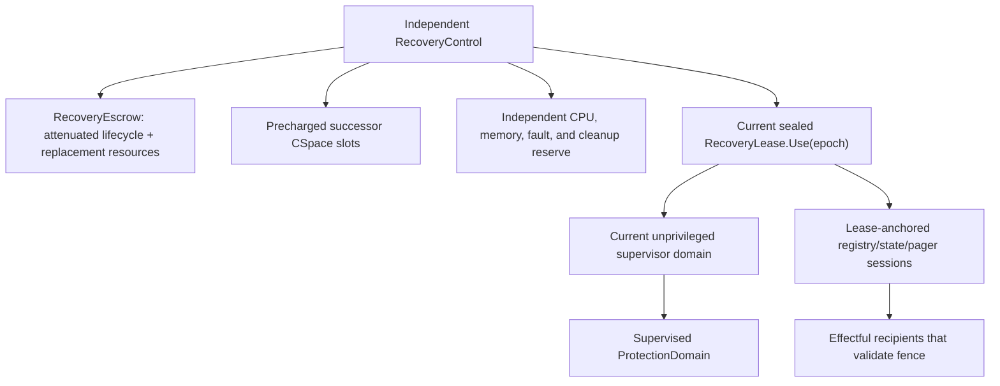
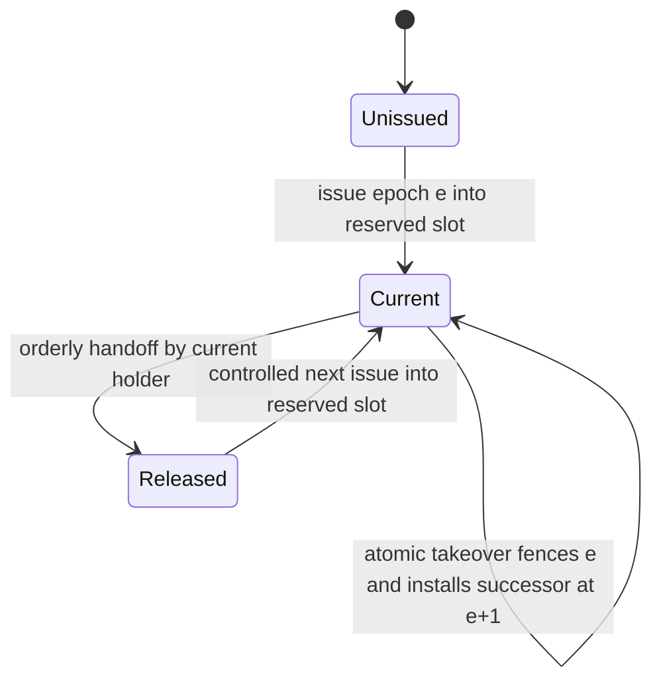
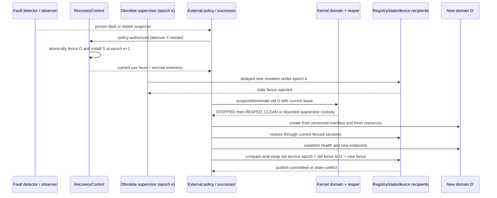

# Failure boundaries and recovery topology

Recovery should be an unprivileged, explicit replacement transaction built on
kernel-enforced containment, fencing, and independent reserves. Each recoverable
domain has one current non-copyable `RecoveryLease.Use`, a prepopulated
`RecoveryEscrow` whose authority and successor slots are outside the child and
replaceable supervisor subtrees, and independent recovery CPU/memory/fault
resources. Takeover atomically closes the old lease and its issued-session
anchor, advances a domain recovery epoch, and installs one successor. Every
effectful registry, pager, state-repair, endpoint, and device operation must
validate that fence at commit or fall outside the advertised recovery boundary.

This is the recommended implementation for component 8 of the [minimal
privileged kernel layer](../minimal-privileged-kernel-layer.md). Erlang/OTP
principles, MINIX, microreboot, CuriOS, crash-only software, and driver-recovery
work support external supervision, narrow restart scopes, and explicit state.
They do not prove the proposed kernel lease/escrow graph, end-to-end fencing, or
root-controller takeover.

## Question, scope, and operational standard

The question is:

> What authority, state, resources, and protocol must exist outside a failed
> component so a supervisor can safely contain, replace, publish, and reconcile
> it without becoming an ambient omnipotent root or reviving stale effects?

The kernel enforces one current lifecycle principal, independent escrow,
generation/epoch checks, domain stop, resource custody, and bounded protected
ledgers. User-space policy chooses restart scope, intensity, backoff, ordering,
state repair, service naming, and client retry. The kernel contains no OTP
supervisor tree.

The first implementation is adequate only when:

1. A recovery path's CPU budget, memory, capability slots, fault route, escrow,
   and reset dependencies do not descend from the component it may replace.
2. Exactly one current lease-use facet can initiate each state-changing domain
   recovery operation; ordinary copies, moves, grants, and mints cannot duplicate
   it.
3. Takeover fences the old supervisor at kernel and cooperating user-space
   commit points before the successor mutates state.
4. Recovery authority is precommitted and attenuated; takeover never reads it
   from the failed supervisor's CSpace and cannot amplify it.
5. A valid late CPU/device completion for an already admitted operation remains
   usable after lease turnover, while the old holder cannot start another
   mutation.
6. Fault fact, acknowledged stop, detector suspicion, accepted-no-reply work,
   and external-effect reconciliation remain distinct.
7. A replacement is a new kernel domain identity and a new logical service
   epoch; pending calls are not silently redirected.
8. A missing escrow, resource, cooperating fence target, or quiescence mechanism
   yields an explicit wider escalation boundary rather than a false recovery
   claim.

## Evidence and limits

| Evidence | Supported conclusion | Limit for this design |
| --- | --- | --- |
| [Armstrong's reliability thesis](../../30-sources/armstrong-2003-making-reliable-distributed-systems.md) | Isolation, explicit failure signals, supervision, restart hierarchy, and stable state are central to dependable Erlang systems | BEAM process isolation does not contain a compromised runtime, native code, DMA, or kernel failure |
| [Unreliable failure detectors](../../30-sources/chandra-toueg-1996-failure-detectors.md) | Timeout/heartbeat detection yields suspicion under assumptions; completeness and accuracy are separate | Distributed crash theory does not model local shared-memory or device corruption |
| [Dependable MINIX design](../../30-sources/herder-et-al-2006-dependable-operating-system.md) | External reincarnation authority and least-privilege user-mode drivers can turn many faults into component exits | Historical prototype, mainly accidental faults; core state and hostile DMA remain outside the result |
| [Microreboot](../../30-sources/candea-et-al-2004-microreboot.md) | Narrow restart reduces disruption when state is external and requests are safely retryable; recovery can escalate | One Java service workload does not establish arbitrary kernel, device, or external-effect recovery |
| [CuriOS](../../30-sources/david-et-al-2008-curios.md) | Client-associated state held outside a failed service can reduce cross-client damage and aid reconstruction | Selected services/faults; some connections and external effects remain lost or unrecovered |
| [Crash-only software](../../30-sources/candea-fox-2003-crash-only-software.md) | Components designed to stop/restart through the same path, with external state and retry-aware boundaries, simplify recovery | It is an architectural argument, not proof of this kernel or arbitrary service safety |
| [Recovering device drivers](../../30-sources/swift-et-al-2004-recovering-device-drivers.md) | Recovery metadata must survive outside the driver; accepted device requests may remain indeterminate | Selected drivers and a trusted shadow/kernel; no malicious hardware or exactly-once result |
| [Hive](../../30-sources/chapin-et-al-1995-hive.md) | Shared memory and devices produce correlated failure regions broader than processes | Historical system and fault model do not validate the proposed topology |

The lease fencing pattern also resembles fencing-token protocols in distributed
lock services: a new holder must carry a monotonically current token and every
effectful recipient must reject stale ones. This is an analogy and design input,
not evidence that a kernel recovery epoch automatically fences remote stores or
physical devices.

## Failure-scope hierarchy

The architecture should name these non-identical scopes:

1. **BEAM actor.** Ordinary exception, exit signal, link/monitor event, or
   process-local heap-limit termination handled by the managed runtime.
2. **Managed-runtime protection domain.** Runtime allocator, scheduler, JIT,
   shared heap/table, or unsafe native failure can require the whole instance.
3. **Native service or driver domain.** Memory-unsafe service and its delegated
   hardware protocol state.
4. **User-defined recovery group.** Several domains replaced together by
   unprivileged policy.
5. **Reset domain or system partition.** Correlated device, requester, memory,
   or recovery-resource boundary.
6. **Node.** Kernel/reference-monitor failure, uncontained DMA, stuck privileged
   CPU, or loss of every independent recovery path.
7. **External deployment.** Another node, operator, or orchestration system
   when local trusted control has failed.

A memory security boundary, CPU-budget boundary, restart unit, shared-state
boundary, hardware reset boundary, and escalation unit may differ. The manifest
and runtime inventory must make their overlap explicit.

## Authority topology

The controller is more trusted than the replaceable supervisor but has a narrow
operation: close the current lease/session anchor, advance epoch, and issue the
already deposited successor set. It does not choose restart strategy or gain
ordinary child-service authority.

### `RecoveryEscrow`

Before a domain starts, a creator with real authority deposits:

- attenuated `Domain.Suspend`, `Resume`, `Terminate`, and `Reap` facets;
- exact manifest authority and resource reservations for a successor;
- protected destination slots and account/cleanup credit;
- required fault inspection and bounded ledger access;
- compatible registry, pager, and state-repair session templates; and
- references to separately controlled reset profiles where applicable.

The kernel rejects an escrow capability whose bounded anchor path includes the
child, current lease, or any supervisor meant to be replaceable. Deposit cannot
amplify rights. Stable lifecycle facets remain protected in escrow; expendable
sessions are minted beneath the current lease anchor so takeover closes them.

### `RecoveryLease`

Exactly one non-copyable use facet is current for `(domain, recovery_epoch)`.
State-changing external operations require both the operation-specific facet
and current use. Read-only observers can receive separately copyable inspection
facets. Shared threads in the supervisor domain may invoke the one use facet,
but cannot duplicate or delegate it generically.

### `RecoveryControl`

Control authority can perform one atomic takeover:

1. validate `RecoveryControl`, target identity/generation, expected current
   recovery epoch, and the precommitted escrow/session invariants;
2. close the old use facet and lease-derived session anchor;
3. advance `recovery_epoch` under a no-wrap/no-alias rule;
4. revalidate any in-progress reap cursor against its immutable teardown epoch
   and transfer only controller authority to the successor, without relabeling
   the cursor or changing operation identity;
5. install one successor use facet and escrowed authority into protected
   pre-reserved slots; and
6. publish a bounded takeover record.

Policy outside the kernel decides whether to invoke this operation. The kernel
checks authority and invariants; it does not decide that suspicion justifies
takeover. Suspicion alone does not create a second current holder. Policy may
wait, probe, suspend, or escalate before invoking takeover.

## Lease state machine

Validation, successor-slot preparation, and cursor revalidation occur in
private protected state. No observer can see a fenced old holder without the
one successor facet already installed, or a new epoch without its escrow set.
The self-transition is the single commit point; failure before it leaves epoch
`e` current and failure cannot be reported after a partial public transition.

An operation admitted under epoch `e` keeps an immutable operation identity,
such as `stop_epoch` or device completion epoch. Late completion updates that
record even after recovery epoch `e+1` is current. The successor can adopt and
continue it with its current lease. The old holder cannot initiate a new
operation or reinterpret the old completion.

## End-to-end fencing

Kernel fencing is necessary but insufficient. Every mutable participant in the
recovery transaction must either:

- validate `(lease_object, recovery_epoch)` at the same commit point as its
  effect; or
- accept only a session capability inherited from the current lease anchor,
  with already admitted operations remaining explicit during closure.

This applies to service registries, pagers, durable-state coordinators,
endpoint managers, publication services, and the domain-recovery sessions used
to approach device managers.

A domain `RecoveryLease` never implies device reset authority. A shared device
or reset mutation requires its operation-specific facet plus the independent
current `ResetLease.Use(reset_domain, reset_epoch)` at the hardware commit
point. When domain recovery initiates that mutation, the recipient additionally
checks the current domain recovery lease or its derived session. Both fences
must be current; advancing one cannot relabel or replace the other.

A remote database, peer, or physical device that cannot validate a fence or
support idempotent reconciliation is outside the locally recoverable boundary.
The architecture records that limitation and escalates rather than assuming
the new supervisor erased a delayed old request.

## State classification

Restartability is a property of state placement and protocol:

| State class | Recovery rule |
| --- | --- |
| Ephemeral computation | Discard with old domain; never copy a suspect heap into the successor |
| Client-associated protected state | Hold in narrow external objects or reconstruct from clients; validate client/domain generations |
| Durable transactional state | Recover through versioned log/transaction semantics outside the kernel |
| Discardable cache | Invalidate and rebuild from authoritative state |
| Shared mutable state | Fence every writer and prove quiescence or use a protocol designed for one-writer failure |
| Device state | Follow immutable device/reset profile; accepted operations may be indeterminate |
| External or irreversible state | Query, deduplicate, compensate, or report uncertainty; kernel cannot roll it back |

CuriOS supports separating client state, while EROS shows whole-world
persistence is possible. For this project, transparent preservation of an
entire failed runtime risks preserving corruption. Restore only schema-checked
state through a new domain and current fenced session.

## Replacement transaction

Detailed steps are:

1. classify the observation as fact, report, or suspicion;
2. choose probe, wait, degrade, suspend, terminate, or wider escalation;
3. fence/replace the recovery holder if necessary;
4. advance the old domain through stop and teardown;
5. accept `REAPED_WITH_QUARANTINE` only when independent infrastructure takes
   custody of a precise inaccessible set;
6. create `D'` from a trusted versioned manifest, not the old CSpace or heap;
7. restore classified state through current-epoch services;
8. establish new endpoints and health checks;
9. atomically publish a new logical service epoch using both the old service
   epoch and old domain recovery fence as compare values; and
10. let clients retry or reconcile based on their old call outcome.

Pending calls are not redirected. A client bound to service epoch `s` observes
failure of `s`; it may resolve epoch `s+1` and resubmit only if its protocol
says that is safe. Kernel domain identity and service epoch remain separate.

## Root-supervisor failure

The kernel exposes an authorized bounded inventory of live domains, lifecycle
states, accounts, lifetime groups, recovery epochs, and reap tokens. A
replacement root can reconcile protected state but does not recover lost
arbitrary policy memory.

An independently bootstrappable controller first fences the old root's leases
and sessions, then issues only escrowed attenuated authority to the successor.
If the controller, escrow, successor slots, recovery budget, or end-to-end fence
targets are lost, local transparent root recovery is unavailable. The declared
next step is node reset and external orchestration, not minting a new omnipotent
root from suspicion.

Replication of the final controller would introduce consensus, split-brain,
durable fencing, and distributed trust. It belongs in a future deployment layer,
not implicitly in this minimal kernel.

## Resource availability

Containment without resources is not recovery. Admission reserves, per failure
scope:

- a scheduling context and deadline channel;
- memory for fault records, supervisor code/data, and successor construction;
- capability slots, lineage metadata, and cleanup cursors;
- fault and registry endpoints with independent routes;
- device/reset management budget where needed; and
- quarantine custody capacity or a specified escalation threshold.

The supervised child cannot spend, map, revoke, or close these resources. If
several failures share one reserve, admission states the maximum concurrent
recovery demand and degradation policy.

## External effects and operation outcomes

Recovery preserves the invocation component's three essential cases:

- **not accepted:** safe to submit as a new request, subject to application
  protocol;
- **replied/completed:** the observed result is available, though durability or
  external semantics remain service-defined; and
- **accepted without reply:** effect is indeterminate and needs query,
  deduplication, log inspection, compensation, or human policy.

Restart does not turn the third into the first. Generation changes prevent a
stale reply from mutating `D'`; they do not undo a packet, motor command, or
storage write already admitted by `D`.

## Implementation path

1. Model one child, one supervisor, one independent controller, and one escrow;
   prove exactly one current lease and non-amplification.
2. Implement recovery takeover and protected inventory without service
   publication or devices; fault-inject supervisor loss at every transition.
3. Add domain stop/reap adoption across lease turnover and verify late completion
   remains usable but stale new mutations fail.
4. Build an epoch-validating registry and fresh-domain replacement demo.
5. Add schema-checked external client state and indeterminate-call reconciliation.
6. Add one device/reset manager whose profile and fence are independently
   controlled.
7. Exercise replacement of the ordinary root; document node reset when the
   final controller or reserve fails.

## Verification and experiments

- Model-check lease close/advance/install against old/new supervisor mutations;
  there is never zero-or-two current holders after a committed takeover.
- Prove each escrow capability descends from real authority but from no
  replaceable child/supervisor anchor.
- Race takeover with domain suspend/stop, mapping repair, endpoint close,
  registry publication, reap slices, IRQ/timer operations, and device reset.
- Resume a delayed old supervisor after takeover; every effectful target must
  return stale or expose the operation as previously admitted.
- Saturate child CPU/memory/objects and demonstrate the independent recovery
  reserve starts, stops, reaps, and constructs a successor.
- Inject failures during each state restore and publication step; no partially
  published epoch becomes the current service.
- Test client outcomes across restart, including duplicate-safe and unsafe
  external effects; the system must never label uncertainty exactly-once.

## Rejected alternatives

- **Supervisor authority stored only in its CSpace:** it disappears or becomes
  inaccessible precisely when the supervisor fails.
- **Copyable recovery lease:** permits concurrent conflicting lifecycle owners.
- **Timeout mints takeover authority:** creates split brain from suspicion.
- **Kernel-encoded OTP tree:** moves application policy and restart intensity
  into privilege.
- **Copy the failed heap/CSpace:** retains corruption and stale authority.
- **Publish replacement under the old service identity silently:** hides failure
  and misroutes old calls/replies.
- **Kernel generation fences external systems automatically:** recipients must
  cooperate; physical effects may be irreversible.

## Open questions

- How is the final recovery controller protected or replicated without importing
  a consensus system into the kernel TCB?
- Which services can validate the recovery fence at their true commit point,
  and which must be declared outside local recovery?
- How much reserved capacity is sufficient for correlated failure without
  wasting most of a constrained platform?
- What state-schema and attestation mechanism prevents a new runtime from
  accepting corrupt but syntactically valid recovery data?

## Connections

- [Bootstrap and root-authority handoff](bootstrap-and-root-authority-handoff.md)
- [Fault capture and containment](fault-capture-and-containment.md)
- [Teardown, revocation, and safe reclamation](teardown-revocation-and-safe-reclamation.md)
- [Bounded invocation and transport](bounded-invocation-and-transport.md)
- [Managed-runtime failure translation](../managed-actor-runtime-components/failure-translation-and-the-otp-boundary.md)
- [Minimal privileged-kernel contract inquiry](../../40-inquiries/what-contract-should-the-minimal-privileged-kernel-provide.md)

## Sources

- [Armstrong's reliability thesis](../../30-sources/armstrong-2003-making-reliable-distributed-systems.md)
- [Unreliable failure detectors](../../30-sources/chandra-toueg-1996-failure-detectors.md)
- [Dependable MINIX design](../../30-sources/herder-et-al-2006-dependable-operating-system.md)
- [Microreboot](../../30-sources/candea-et-al-2004-microreboot.md)
- [CuriOS](../../30-sources/david-et-al-2008-curios.md)
- [Crash-only software](../../30-sources/candea-fox-2003-crash-only-software.md)
- [Recovering device drivers](../../30-sources/swift-et-al-2004-recovering-device-drivers.md)
- [Hive](../../30-sources/chapin-et-al-1995-hive.md)
- [EROS](../../30-sources/shapiro-et-al-1999-eros.md)
