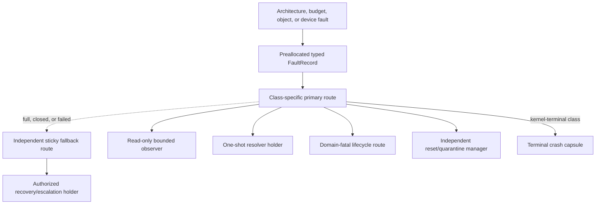

# Fault capture and containment

The kernel should convert synchronous exceptions, budget events, architecture
errors, IRQ/IOMMU/device faults, and lifecycle failures into bounded typed fault
records whose provenance, confidence, truncation, and containment status are
explicit. Delivery uses preallocated typed routes with a sticky fallback; no
fault path allocates or blocks on an unbounded receiver. Observation, one-shot
repair, thread termination, domain-fatal transition, device recovery, and debug
access are separate capabilities. A timeout or missed heartbeat is recorded as
suspicion, never promoted to a proven crash.

This is the recommended implementation for component 7 of the [minimal
privileged kernel layer](../minimal-privileged-kernel-layer.md). seL4 provides a
concrete fault/reply pattern, failure-detector theory separates fact from
suspicion, and kdump/RAS work motivates preallocation and preserved raw
evidence. The route hierarchy, typed resolver token, loss accounting, and
domain-policy mapping below remain unverified proposals.

## Question, scope, and operational standard

The question is:

> How can the kernel capture enough trustworthy evidence to contain and
> authorize a response to faults without embedding recovery policy, parsing
> unbounded diagnostic data, or misreporting suspicion as completion?

The architecture layer captures raw machine state and normalizes architecture
fault classes. This component binds faults to kernel objects, protects records,
selects preconfigured routes, blocks or closes execution where necessary, and
issues one-shot resolution authority. User-space supervisors decide restart,
escalation, repair, and service reconciliation within delegated policy.

An implementation is acceptable only when:

1. Every exceptional path uses preallocated records, bounded stack, bounded
   decoding, and a route chosen before the fault can occur.
2. Records retain raw source evidence alongside normalized class, certainty,
   object identities/generations, timestamp provenance, and containment result.
3. Full or failed routes preserve a sticky “evidence lost” fact and fatal
   escalation path; they do not silently discard faults or allocate more memory.
4. A resolvable fault blocks the exact thread until a current one-shot token
   selects one permitted terminal action; a stale resolver cannot target a
   replacement thread or mapping.
5. Domain-fatal and kernel-fatal classes cannot be downgraded by ordinary
   observer or page-repair authority.
6. Failure to stop execution, contain DMA, or complete architecture recovery is
   reflected as incomplete containment or quarantine, not `resolved`.
7. Liveness suspicion includes detector and timing assumptions and remains
   distinguishable from a trap, explicit exit, acknowledged stop, or reset.
8. Sensitive registers, addresses, memory, and traces require separate debug
   authority and redaction policy.

## Evidence and limits

| Evidence | Supported conclusion | Limit for this design |
| --- | --- | --- |
| [seL4 reference manual](../../30-sources/sel4-foundation-2026-reference-manual.md) | Typed thread faults can block the faulter, deliver through user-level endpoints, and use reply authority for resolution | It does not supply this domain-fatal topology, sticky fallback, or proposed token facets |
| [Unreliable failure detectors](../../30-sources/chandra-toueg-1996-failure-detectors.md) | Timeout-based detectors make suspicion under timing assumptions, not perfect crash facts | Distributed crash theory is not a local watchdog implementation or hardware-error model |
| [Kdump](../../30-sources/goyal-et-al-2005-kdump.md) | Reserving capture memory, metadata, and an independent capture environment while healthy improves fatal evidence survival | Severe CPU, memory, firmware, or DMA corruption can still defeat capture |
| [Linux RAS documentation](../../30-sources/linux-kernel-community-2026-ras-documentation.md) | Hardware errors need source, severity, correction/containment state, normalized fields, and raw records | Linux policy and decoder breadth are much larger than this kernel |
| [Nooks](../../30-sources/swift-et-al-2003-nooks.md) | Isolation is strengthened by typed tracking and interposition over extension resources | Nooks targets accidental faults, retains privileged extensions, and does not contain DMA fully |
| [Dependable MINIX design](../../30-sources/herder-et-al-2006-dependable-operating-system.md) | Isolated user-mode services and an external reincarnation service can improve recovery | Stateful core services and malicious DMA remain difficult; restart is not state repair |
| [Microreboot](../../30-sources/candea-et-al-2004-microreboot.md) | Narrow restart works best with externalized state and retry-aware requests | Java service results do not generalize to kernel, driver, or hardware faults |

## Fault taxonomy

The record class and permitted response are fixed by a trusted profile, not by
the faulting domain:

| Class | Examples | Initial containment | Typical permitted response |
| --- | --- | --- | --- |
| Completed explicit termination | Acknowledged thread/domain stop requested through lifecycle authority | Already stopped at the declared scope | Inspect, reap, or construct a distinct replacement |
| Resolvable thread exception | Missing mapping, permitted lazy state, breakpoint | Block exact thread | One-shot map/adjust/resume or terminate thread |
| Thread-fatal exception | Illegal instruction, access violation in declared isolated worker | Stop exact thread | Inspect, terminate, possibly replace worker |
| Domain-fatal exception | Corruption in shared runtime/native worker, fatal protocol invariant | Close domain gates and start stop epoch | Inspect, terminate/reap domain |
| Budget/timeout event | Context depletion, declared deadline miss | Deschedule or leave waiting | Observe, replenish through separate authority, suspend/terminate |
| IPC protocol/integrity fault | Invalid protected transition, endpoint protocol violation, corrupt shared-ring report | Contain the exact endpoint/call or configured domain scope | Inspect, reconcile, close endpoint, or terminate through separate authority |
| Memory/kernel-object quota exhaustion | Failed charged allocation or object admission | Reject the operation; preserve existing state | Replenish/delegate through separate authority, shed load, suspend, or terminate |
| Device/IOMMU/IRQ fault | Translation fault, queue error, storm, reset failure | Mask/stop relevant binding; close submission | Profile-specific recovery or quarantine |
| Hardware/RAS event | Corrected, recoverable, deferred, uncorrected error | Architecture/profile-specific | Retire resource, contain domain, or node-fatal |
| Kernel invariant fault | Impossible state, recursive privileged fault | Freeze bounded evidence; stop normal operation | Independent crash capture and reset |
| Liveness suspicion | Missed heartbeat or response deadline | None by fact alone | Supervisor may probe, suspend, or request termination |

The same numeric trap code can map differently by execution context and trusted
profile. A page fault while copying untrusted user bytes is a syscall result; a
fault while holding an internal invariant may be kernel-fatal.

## Fault record

```text
FaultRecord {
  record_id_and_generation,
  fault_class,
  certainty: proven | reported | suspected,
  raw_architecture_or_device_record[bounded],
  normalized_code_and_subcode,
  source_cpu_and_generation,
  domain_thread_object_generations,
  address_space_mapping_or_binding_generations,
  instruction_and_fault_address_if_authorized,
  counter_value_and_clock_provenance,
  execution_and_budget_state,
  containment_state,
  truncation_and_loss_flags,
  route_and_policy_generation,
  resolver_state,
  related_call_or_teardown_epoch
}
```

The fixed public view excludes sensitive registers and raw addresses when the
receiver lacks debug authority. A separate immutable diagnostic view can expose
more fields. Redaction occurs when the view is minted, not by trusting the
consumer to ignore data.

Raw evidence is preserved because normalization can be incomplete or wrong;
normalized fields are preserved because supervisors should not parse every
architecture/vendor format. The record states which decoder/profile produced
the normalization.

## Route topology



Routes are installed before thread start, context binding, or device arm. Each
has fixed record capacity, notification semantics, budget/account, and failure
route. A primary receiver cannot block the hard fault path; delivery publishes
into a preallocated slot or sets a sticky overflow summary and triggers the
fallback.

Fallback signalling does not itself select thread termination, domain closure,
device reset, or kernel-terminal capture. The originating thread, domain, or
device object retains the typed sticky condition; an authorized recovery holder
must inspect it and act through separately held lifecycle or device authority.
For an absent or full resolvable route, the exact thread remains `FAULT_BLOCKED`.

Fatal routes and recovery budgets live outside the faulting domain. A domain
may receive selected resolvable faults, but it cannot own the only record or
authority needed to terminate itself after corruption.

## Resolution state machine

```mermaid
stateDiagram-v2
  [*] --> Captured
  Captured --> ThreadBlocked: resolvable exact-thread fault
  Captured --> DomainClosing: domain-fatal profile
  Captured --> DeviceContained: device/profile fault
  Captured --> KernelTerminal: kernel invariant fault
  ThreadBlocked --> ResolverIssued: attenuated one-shot token installed
  ResolverIssued --> Resolving: authorized repair action wins
  ResolverIssued --> ThreadBlocked: token closes/expires; sticky unresolved + fallback
  ResolverIssued --> ThreadTerminating: separately authorized exact-thread termination wins
  ResolverIssued --> DomainClosing: separately authorized domain close wins
  Resolving --> Resumed: mapping/context repair committed + thread gate open
  Resolving --> ThreadBlocked: validation/commit fails; sticky unresolved + fallback
  Resolving --> DomainClosing: separately authorized domain close wins
  ThreadBlocked --> ThreadTerminating: authorized isolated-thread policy acts
  ThreadBlocked --> DomainClosing: separately authorized domain termination wins
  DeviceContained --> DeviceRecovered: profile completion proves safe state
  DeviceContained --> Quarantined: completion unavailable
  DomainClosing --> EvidenceRetained: stop/teardown owns record
  KernelTerminal --> EvidenceRetained
```



The resolver token binds one fault record, thread/domain/mapping generations,
allowed actions, embedded attenuated authority, deadline, and policy generation.
It is consumed by one terminal action. `Resume` requires the repair to commit
and all current execution/domain gates to remain open; if domain termination
wins first, the token becomes stale and the fatal path retains the evidence.
Token expiry, route loss, or failed repair does not prove a new fault or select
domain termination. It terminally closes that resolver attempt, leaves the exact
thread blocked with sticky unresolved evidence, and signals the independent
fallback. Later termination or escalation is a distinct, correctly authorized
policy operation.

A page resolver can receive an attenuated `FaultMap` grant captured from the
address space. It cannot map arbitrary frames, change unrelated mappings, read
all registers, or resume a different thread. A resulting mapping inherits the
address-space/domain and supplied frame authority paths, not merely the
one-shot token.

## Capture and dispatch path

The privileged fast path performs only:

1. stabilize architecture or controller state through the lower layer;
2. classify against immutable current profile and execution context;
3. copy a fixed raw/normalized prefix into a preallocated record;
4. change exact thread/domain/binding state needed for immediate containment;
5. publish to the preselected route or set sticky overflow/fallback state; and
6. return to another schedulable context or terminal capture path.

It does not allocate, symbolize stack traces, unwind arbitrary code, query a
name service, load a pager, restart a service, parse device firmware, or wait
for a user receiver. Those tasks consume ordinary user-space resources after
containment.

## Certainty and liveness

Records should use explicit evidence terms:

- **proven:** a synchronous trap, explicit exit, acknowledged stop, verified
  budget depletion, or completed reset transition establishes the fact claimed;
- **reported:** hardware/firmware/device supplied an error record whose accuracy
  and precision depend on a declared source; and
- **suspected:** a detector inferred possible failure from missing progress
  under timing and scheduling assumptions.

A supervisor may act conservatively on suspicion, but its termination request
is a new explicit operation. The later domain stop record can become proven
even though the original crash suspicion never did. This preserves useful
logic during overload, network partitions, delayed scheduling, and debugger
stops.

## Recursive and nested faults

Per-CPU exceptional state has a fixed nesting limit and dedicated emergency
stack. A fault while copying user data follows a declared recoverable table. A
fault while capturing another fault records the first available minimal tuple,
sets a recursive-fault flag, closes further ordinary delivery on that CPU, and
escalates to domain- or kernel-fatal policy according to context.

No recursive path allocates a second unbounded diagnostic record. If the
emergency slot is already occupied, one sticky lost-record counter and the
terminal capsule preserve that evidence. Claiming detailed diagnosis after the
capture machinery itself failed would be misleading.

## Interaction with recovery

Fault capture supplies evidence and an authorized state transition; it does not
select an OTP restart strategy. User space maps records to supervised actions:

- a valid page resolution can resume the exact thread;
- an isolated worker fault can terminate and replace that thread if its profile
  permits;
- shared ERTS/JIT/NIF or driver corruption usually closes the entire domain;
- device faults enter profile-specific stop/reset/quarantine through an
  independent manager; and
- `AcceptedNoReply` calls remain explicit reconciliation work after restart.

Microreboot and MINIX evidence supports narrow restart only when state and
dependencies were designed for it. Address-space isolation alone cannot tell
whether shared durable, device, or client state is consistent.

## Implementation path

1. Define a small architecture-independent taxonomy plus raw-record envelope and
   certainty vocabulary.
2. Implement preallocated per-thread/domain routes for synchronous user faults
   and an independent sticky fallback.
3. Add one-shot resolver tokens for a narrow page-fault profile and model races
   with thread/domain termination.
4. Add budget/timeout events, then IRQ/IOMMU/device fault records tied to exact
   binding generations.
5. Add RAS classes per target with raw-plus-normalized evidence and explicit
   containment status.
6. Connect kernel-fatal events to the independently reserved crash capsule only
   after recursive-fault injection passes.
7. Keep rich symbolication, stack unwinding, and policy in unprivileged tools.

## Verification and experiments

- Generate every architecture exception and validate normalization, raw record,
  context ownership, redaction, and route generation across two ISAs.
- Fill/close/starve every primary route; sticky loss evidence and independent
  fatal delivery must still make bounded progress.
- Model fault resolve versus timeout, reply, suspend, terminate, mapping close,
  and reaping; exactly one terminal thread action may win.
- Inject nested faults at each capture step and measure stack, instruction,
  lock, and record bounds.
- Test imprecise/corrected/uncorrected hardware records and retain source
  confidence rather than over-normalizing.
- Saturate CPU and memory accounts while verifying preallocated fault and
  recovery reserves remain available.
- Test debug authority separation: ordinary recovery must not read unrelated
  registers, memory, raw addresses, or sensitive trace fields.

## Rejected alternatives

- **Signal number only:** loses provenance, certainty, object generation, raw
  evidence, and containment state.
- **Faulting domain owns the only route:** corruption or exhaustion suppresses
  the evidence needed to recover it.
- **Allocate a rich report on fault:** exceptional OOM and recursive failure
  become unbounded.
- **Timeout equals crash:** confuses detection assumptions with fact.
- **Generic resolver with debug/terminate authority:** violates least privilege
  and lets page policy become lifecycle control.
- **Restart inside the kernel:** embeds policy and cannot repair arbitrary user,
  device, or external state.

## Open questions

- Which minimum normalized fields are portable and valuable without making the
  kernel a large architecture/vendor decoder?
- What route capacities and coalescing keys preserve actionable evidence under
  fault storms within fixed memory?
- Which ERTS/native thread profiles can ever receive thread-local resolution
  rather than domain-fatal classification?
- How should sensitive addresses and code identities be represented so crash
  evidence is useful without becoming an authority or disclosure channel?

## Connections

- [Protection domains, threads, and address spaces](protection-domains-threads-and-address-spaces.md)
- [Failure boundaries and recovery topology](failure-boundaries-and-recovery-topology.md)
- [Observability and crash evidence](observability-and-crash-evidence.md)
- [Architecture faults and diagnostics](../kernel-hardware-and-architecture-components/architecture-faults-and-diagnostics.md)
- [Managed-runtime failure translation](../managed-actor-runtime-components/failure-translation-and-the-otp-boundary.md)
- [Minimal privileged-kernel contract inquiry](../../40-inquiries/what-contract-should-the-minimal-privileged-kernel-provide.md)

## Sources

- [seL4 reference manual](../../30-sources/sel4-foundation-2026-reference-manual.md)
- [Unreliable failure detectors](../../30-sources/chandra-toueg-1996-failure-detectors.md)
- [Kdump](../../30-sources/goyal-et-al-2005-kdump.md)
- [Linux RAS documentation](../../30-sources/linux-kernel-community-2026-ras-documentation.md)
- [Nooks](../../30-sources/swift-et-al-2003-nooks.md)
- [Dependable MINIX design](../../30-sources/herder-et-al-2006-dependable-operating-system.md)
- [Microreboot](../../30-sources/candea-et-al-2004-microreboot.md)
- [Recovering device drivers](../../30-sources/swift-et-al-2004-recovering-device-drivers.md)
